# 遵化市 2024—2025 学年度第二学期期末学业水平评估 八年级数学试卷

考生注意：1. 本试卷共4页，总分100分，考试时间90分钟。 

2. 答题前考生务必将姓名、准考证号填写在试卷和答题卡相应位置上。 

3. 考生务必将答案写在试卷上。 

## 一、选择题（本大题有12个小题，每小题2分，共24分。在每小题给出的四个选项中，只有一项符合题目要求）。

1. 内角为 $108^{\circ}$ 的正多边形是  
A. 3 B. 4  
C. 5 D. 6 

2. 如图，边长为3的正方形OBCD的两边落在坐标轴正半轴上，点C的坐标是
A. (3, -3) B. (-3, 3)
C. (3, 3) D. (-3, -3) 

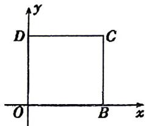

3.如图，菱形ABCD中， $\angle D = 150^{\circ}$ ，则 $\angle 1 =$ A. $30^{\circ}$ B. $25^{\circ}$ C. $20^{\circ}$ D. $15^{\circ}$ 

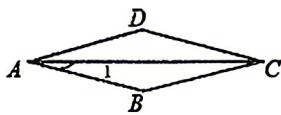

4. 如图, 在矩形ABCD中, 对角线AC, BD相交于点O, $\angle ABD = 60^{\circ}$ , AB = 2, 则AC的长为
A. 6 B. 5
C. 4 D. 3 

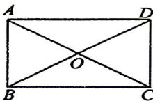

5. 如图, 平地上A、B两点被池塘隔开, 测量员在岸边选一点C, 并分别找到AC和BC的中点D、E, 测量得 $\mathrm{{DE}} = {16}$ 米, 则A、B两点间的距离为 A. 30米 B. 32米 C. 36米 D. 48米 

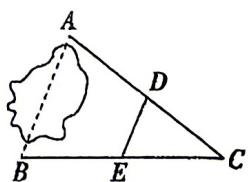

6. 如图，在每个四边形上所做的标记中，线段上的划记数量相同的表示线段相等，角的标记弧线数量相同的表示角相等，则下列一定为平行四边形的有 

A. 1个 

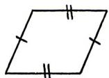

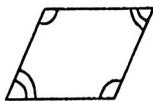

B. 2个 

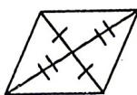

C. 3个 

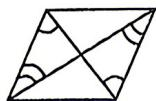

D. 4个 

7. 如图, 在平行四边形ABCD中, E是边CD上一点, 将 $\bigtriangleup  {ADE}$ 沿AE折叠至 $\bigtriangleup  {AD}^{\prime }E$ 处, $A{D}^{\prime }$ 与 

CE交于点F，若 $\angle B = 52^{\circ}$ ， $\angle \mathrm{DAE} = 20^{\circ}$ ，则 $\angle FED'$ 的度数为A. $40^{\circ}$ B. $36^{\circ}$ C. $50^{\circ}$ D. $45^{\circ}$ 

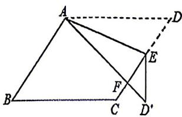

8. 如图，两条直线的交点坐标 $(-2,3)$ 可以看作两个二元一次方程的公共解，其中一个方程是 $x + y = 1$ ，则另一个方程是
A. $2x - y = 1$ B. $2x + y = -1$ C. $2x + y = 1$ D. $3x - y = 1$ 

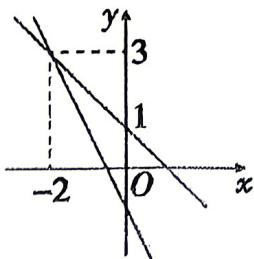

9. “漏壶”是一种古代计时器, 在它内部盛一定量的水, 水从壶下的小孔漏出。壶内壁有刻度, 人们根据壶中水面的位置计算时间。用 $x$ 表示漏水时间, $y$ 表示壶底到水面的高度。不考虑水量变化对压力的影响, 下列图象最适合表示 $y$ 与 $x$ 对应关系的是 

A.

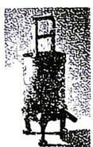

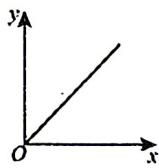

B. 

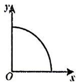

C. 

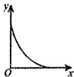

D. 

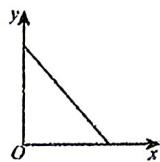

10. 下列有关一次函数 $y = -3x + 2$ 的说法中，错误的是
A. 当x值增大时，y的值随着x增大而减小
B. 函数图象与y轴的交点坐标为(0,2)
C. 函数图象经过第一、二、四象限
D. 图象经过点(1,5) 

11. 下面三个问题中都有两个变量: 

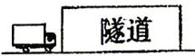

①如图1, 货车匀速通过隧道(隧道长大于货车长), 货车在隧道内的长度y与从车头进入隧道至车尾离开隧道的时间x; 

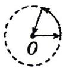

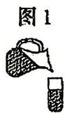

图2

②如图2, 实线是王大爷从家出发匀速散步行走的路线(圆心O表示王大爷家的位置), 他离家的距离y与散步的时间x; 

图3

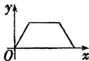

图4

③如图3, 往一个圆柱形空杯中匀速倒水, 倒满后停止, 一段时间后, 再匀速倒出杯中的水, 杯中水的体积 $\mathbf{y}$ 与所用时间 $\mathbf{x}$ . 

其中，变量y与x之间的函数关系大致符合图4的是
A. ①② 
B. ①③ 
C. ②③ 
D. ①②③ 

12. 若一组数据共有100个，则通常分成
A. 3～5组 B. 5～12组 C. 12～20组 D. 20～25组 

## 二、填空题（本大题有4个小题，每小题3分，共12分。把答案写在题中横线上）。

13. 点P到x轴的距离是2，到y轴的距离是3，且在y轴的左侧，则点P的坐标是 

14. 如图, 矩形ABCD的顶点A, B在数轴上, $\mathrm{{CD}} = 6$ ,点A对应的数为 -1 ,则点B所对应的为 

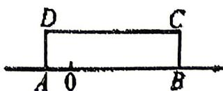

15. 已知点 $(-4,y_{1})$ ， $(2,y_{2})$ 在直线 $y=-\frac{1}{2}x+2$ 上，则 $y_{1}\_y_{2}$ （填“＞”“＜”或“＝”） 

16. 如图1, 平行四边形ABCD中, $\angle D = 150^{\circ}$ , 两动点M, N同时从点A出发, 点M在边AB上以 $2 \mathrm{~cm} / \mathrm{s}$ 的速度匀速运动, 到达点B时停止运动, 点N沿A - D - C - B的路径匀速运动, 到达点B时停止运动. $\triangle$ AMN的面积 $S(\mathrm{cm}^{2})$ 与点N的运动时间 $t(s)$ 的关系图象如图2所示, 已知 

$$
\mathrm{AB} = 4 \mathrm{cm}
$$

(1)N点的运动速度是____cm/s; 

(2)c处的数值等于____. 

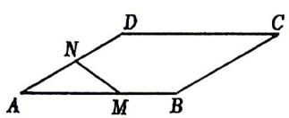

图1

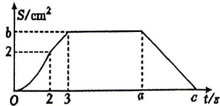

图2

## 三、解答题（本大题有8个小题，共64分，解答应写出必要的文字说明、证明过程或演算步骤）。

## 17. (本小题6分)

一次函数图象经过(3,1)，(2,0)两点. 

(1)求这个一次函数的解析式; 

(2)求当 $x = 6$ 时, $y$ 的值. 

## 18. (本小题6分)

(1)如图1, 在 $\triangle ABC$ 中, D, E分别是AC, BC的中点, 则线段DE与边AB的数量关系是 , 位置关系是 ; 

(2)拓展应用: 如图2, 在ABCD中, 连接AC并延长至点E, 连接DE并延长至点F, 使得EF = DE, 连接BF.求证: AE//BF. 

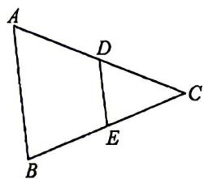

图1

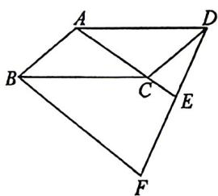

图2

## 19.(本小题6分)

图1是某房子的房顶，图2是其示意图，其中AB = DE, BC = EF, AD = CF，且 $\angle ABC = \angle DEF$ .试判断四边形ADFC的形状，并说明理由. 

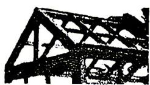

图1

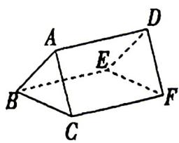

图2

## 20.(本小题8分)

如图，矩形ABCD的对角线AC，BD相交于点O，BE//AC，AE//BD. 

(1)求证: 四边形AOBE是菱形; 

(2)若 $\angle AOB=60^{\circ}$ , $AC=12$ , 求菱形AOBE的面积. 

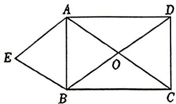

## 21.(本小题8分)

如图，直线 $l_{1}$ 的解析式为 $y=x+2$ ，直线 $l_{1}$ 和直线 $l_{2}$ 相交于点A，直线 $l_{1}$ 与x轴相交于点B，与y轴相交于点D，直线 $l_{2}$ 与x轴相交于点C(4,0)，与y轴相交于点E(0,4). 

(1)求直线 $l_{2}$ 的解析式. 

(2)求△ABC的面积. 

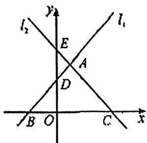

## 22. (本小题8分)

将一张长方形的纸对折, 如图①, 可得到一条折痕, 继续对折, 对折时每条折痕与上次的折痕保持平行, 如图②, 连续对折3次后, 可以得到7条折痕, 如图③. 

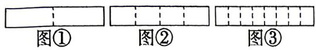

回答下列问题:

(1)对折4次可以得到 条折痕. 

(2)写出折痕的条数y与对折次数x之间的函数关系式. 

(3)求出对折10次后的折痕条数. 

## 23. (本小题10分)

在平面直角坐标系中, $O$ 为原点, $\triangle ABC$ 的顶点坐标分别为 $A(0,2), B(-2,0), C(4,0)$ , 将点 $B$ 右平移7个单位长度, 再向上平移4个单位长度, 得到对应点 $D$ . 

(1)直接写出点D的坐标____； 

(2)求 $\triangle ACD$ 的面积; 

(3)点P(m,3)是一个动点，若 $\triangle APO$ 的面积等于 $\triangle ACO$ 的面积，请求出点P坐标. 

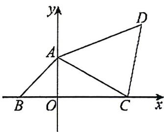

## 24. (本小题12分)

小强是校学生会体育部部长，他想了解现在同学们更喜欢什么球类运动，以便学生会组织受欢迎的比赛。于是他设计了调查问卷，在全校每个班都随机选取了一定数量的学生进行调查，调查问卷如图：调查问卷你最喜欢的球类运动是____（单选）
A. 篮球 B. 足球 C. 排球 D. 乒乓球 E. 羽毛球 F. 其他 

小强根据统计数据制作的各活动小组人数分布情况的统计表和扇形统计图如下： 

<table><tr><td>组别</td><td>篮球</td><td>足球</td><td>排球</td><td>乒乓球</td><td>羽毛球</td><td>其他</td></tr><tr><td>人数</td><td>69</td><td>m</td><td>27</td><td>n</td><td>36</td><td>9</td></tr></table>

(1)请你写出统计表的空缺部分的人数m=____，n=____；

(2)在扇形统计图中，羽毛球所对应扇形的圆心角等于____；

(3)请你根据调查结果，给小强部长简要提出合理化的建议. 

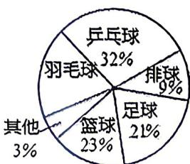
