## 第 04 讲 专题 1 点的坐标：规律题

1．小静同学观察台球比赛，从中受到启发，抽象成数学问题如下：如图，已知长方形OABC，小球P从（0， 3）出发，沿如图所示的方向运动，每当碰到长方形的边时反弹，反弹时反射角等于入射角，第一次碰到 长方形的边时的位置为 P1（3，0），当小球 P 第 2024 次碰到长方形的边时，若不考虑阻力，点 P2024的 坐标是（ ） 

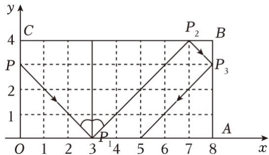

A．（1，4） 

B．（7，4） 

C．（0，3） 

D．（3，0） 

2．如图，点 A（0，1），点 A1（2，0），点 A2（3，2），点 A3（5，1），点 A4（6，3）…，按照这样的规律 下去，点 A2024的坐标为（ ） 

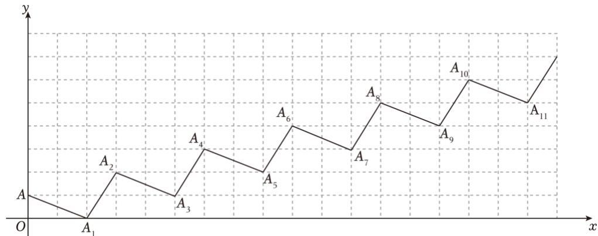

A．（3035，1011） 

B．（3036，1011） 

C．（3035，1013） 

D．（3036，1013） 

3．如图，在平面直角坐标系中，△A1A2A3，△A3A4A5，△A5A6A7，⋯都是斜边在x轴上的等腰直角三角形， 点A1（﹣2，0），A2（﹣1，﹣1），A3（0，0），⋯；则根据图示规律，点 A1020的坐标为（ ） 

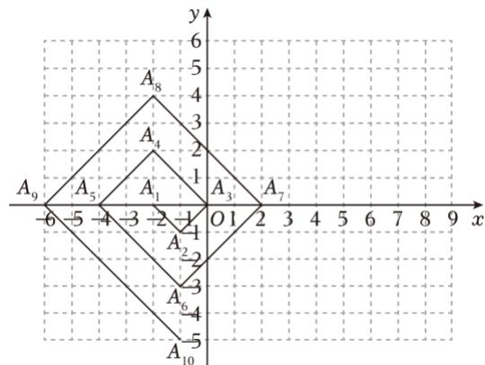

A．（﹣1，﹣510） 

B．（2，510） 

C．（﹣2，510） 

D．（1，﹣510） 

4．如图，在平面直角坐标系中，有若干个横纵坐标分别为整数的点，其顺序按图中“→”方向排列，其对 应的点坐标依次为（0，0），（1，0），（1，1），（0，1），（0，2），（1，2），（2，2），（2，1），…，根据这 个规律，第2023个点的横坐标为（ 

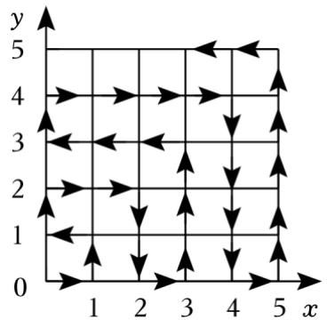

A．44 

B．45 

C．46 

D．47 

5．如图，动点M按图中箭头所示方向运动，第 1次从原点运动到点（2，2），第2次运动到点（4，0），第 3次运动到点（6，4），…，按这样的规律运动，则第 2024次运动到点（ ） 

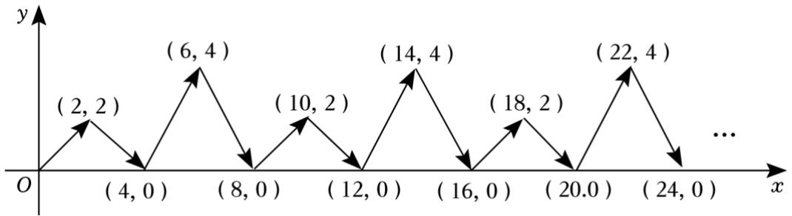

A．（2024，2） 

B．（4048，0） 

C．（2024，4） 

D．（4048，4） 

6．如图，将边长为1 的正方形OAPB 沿x轴正方向边连续翻转 2023次，点P依次落在点 $P _ { 1 } , \ P _ { 2 } , \ P _ { 3 } , \cdots ,$ ， P2023 的位置，则 P2023 的横坐标 x2023 为（ ） 

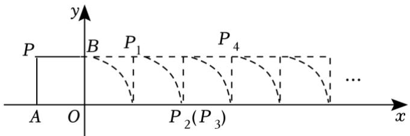

A．2021 

B．2022 

C．2023 

D．不能确定 

7．如图，在平面直角坐标系中，动点 P 从 A1（1，0）出发，沿着 $A _ { 1 } ~ ( 1 , ~ 0 )  A _ { 2 } ~ ( 2 , ~ 0 )  A _ { 3 } ~ ( 2 , ~ 1 )$ ） $ A _ { 4 } ~ ( 1 , ~ 1 ) ~  A _ { 5 } ~ ( 1 , ~ 2 ) ~  A _ { 6 } ~ ( 3 , ~ 2 ) ~  A _ { 7 } ~ ( 3 , ~ 4 ) ~  A _ { 8 } ~ ( 1 , ~ 4 ) ~  A _ { 9 } ~ ( 1 , ~ 6 ) ~  A _ { 1 0 } ~ ( 4 , ~ 6 ) ~    .$ 的 路线运动，按此规律，则点 P运动到A47时坐标为（ ） 

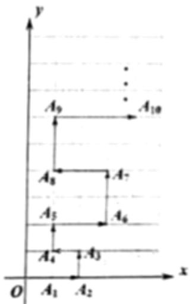

A．（13，156） 

B．（1，156） 

C．（1，144） 

D．（13，144） 

8．如图，直角坐标平面 xOy 内，动点 P 按图中箭头所示方向依次运动，第 1 次从点 （﹣1，0）运动到点 （0，1），第2次运动到点（1，0），第 3次运动到点（2，﹣2），…，按这样的运动规律，动点P 第 2023 次运动到点（ ） 

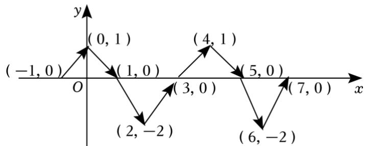

A．（2023，0） 

B．（2022，﹣2） 

C．（2023，1） 

D．（2022，0） 

9．如图，在一个单位为 1的方格纸上，△A1A2A3，△A3A4A5，△A5A6A7，…，是斜边在 x 轴上，斜边长分 别为 2，4，6，…的等腰直角三角形．若 $\triangle A _ { 1 } A _ { 2 } A _ { 3 }$ 的顶点坐标分别为 A1（2，0），A2（1，﹣1），A3（0， 0），则依图中所示规律，A2023的横坐标为（ 

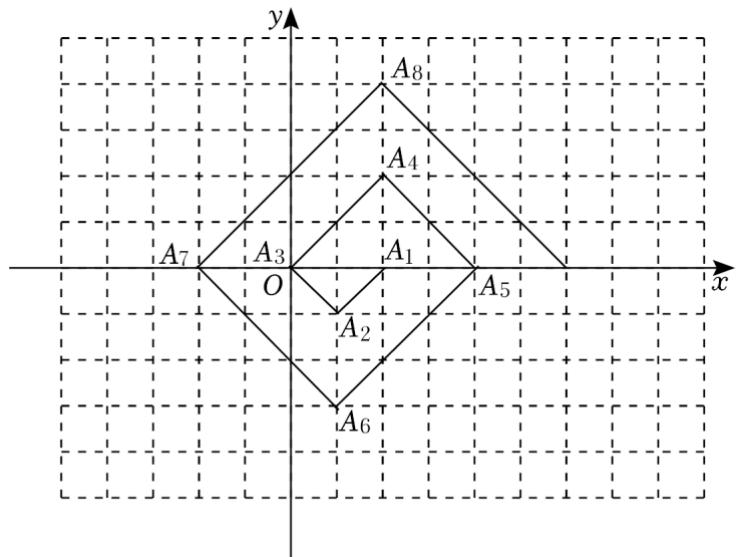

A．﹣1010 

B．1010 

C．1012 

D．﹣1012 

10．如图，在平面直角坐标系中 A（﹣1，1），B（﹣1，﹣2），C（3，﹣2），D（3，1），一只瓢虫从点 A 出发以2个单位长度/秒的速度沿 A→B→C→D→A循环爬行，问第 2025秒瓢虫在点（ ） 

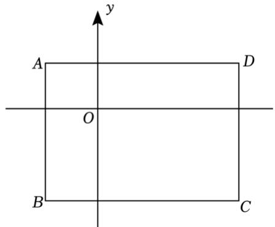

A．（﹣1，0） 

B．（﹣1，﹣1） 

C．（﹣1，﹣2） 

D．（0，﹣2） 

11．如图，动点 P 在平面直角坐标系中按图中所示方向运动，第一次从原点 O 运动到点 $P _ { 1 } ~ ( 1 , ~ 1 )$ ），第二 次运动到点P2（2，1），第三次运动到点 $P _ { 3 } ~ ( 3 , ~ 0 )$ ），第四次运动到点 $P _ { 4 } ~ ( 4 , ~ - 2 )$ ），第五次运动到点 $P _ { 5 }$ （5，0），第六次运动到点 $P 6 \ ( 6 , \ 2 )$ ），按这样的运动规律，点P2023的纵坐标是（ ） 

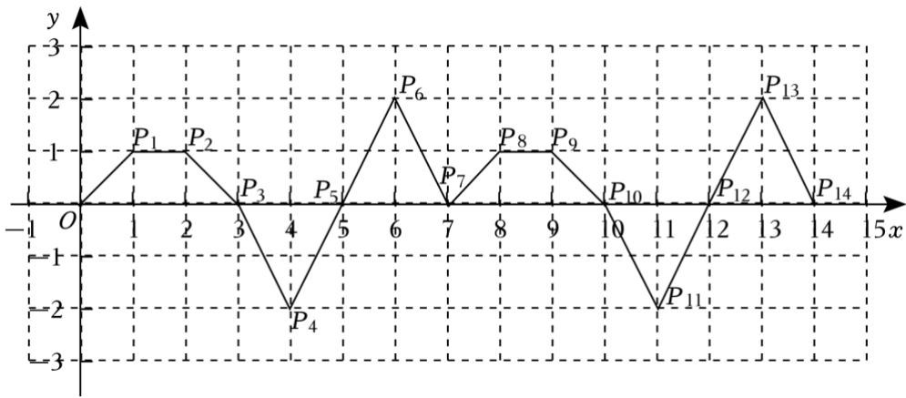

A．﹣2 

B．0 

C．1 

D．2 

12．如图，在平面直角坐标系中，已知点 A（1，1）、B（﹣1，1）、C（﹣1，﹣2）、D（1，﹣2），动点 P 从点A 出发，以每秒2个单位的速度按逆时针方向沿四边形ABCD 的边做环绕运动；另一动点Q 从点C 出发，以每秒3个单位的速度按顺时针方向沿四边形 CBAD的边做环绕运动，则第2023次相遇点的坐标 是（ ） 

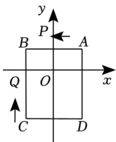

A．（﹣1，﹣1） 

B．（﹣1，1） 

C．（﹣2，2） 

D．（1，1） 

13．如图，在直角坐标系中，一个智能机器人接到的指令是：从原点 O 出发，按“向上→向右→向下→向 右”的方向依次不断移动，每次移动1个单位长度，其移动路线如图所示，第1 次移动到点 A1，第 2次 移动到点A2，…第n次移动到点 An，则点A2023的坐标是（ ） 

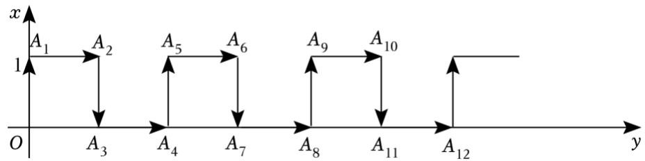

A．（1011，0） 

B．（1012，1） 

C．（1012，0） 

D．（1011，1） 

14．如图，将边长为1的正方形依次放在坐标系中，其中第一个正方形的两边 $O A _ { 1 }$ ， $O A _ { 3 }$ 分别在y轴和 x轴 上，第二个正方形的一边 $A _ { 3 } A _ { 4 }$ 与第一个正方形的边 A2A3共线，一边 A3A6在 x 轴上…以此类推，则点 A2022 的坐标为（ ） 

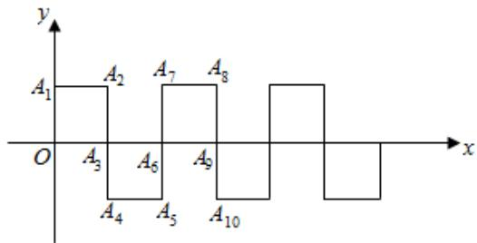

A．（672，﹣1） 

B．（673，﹣1） 

C．（674，1） 

D．（674，0） 

15．如图，一个机器人从 O 点出发，向正东方向走 3 米到达 A1点，再向正北方向走 6 米到达 A2点，再向 正西方向走9米到达A3点，再向正南方向走 12米到达 A4点，再向正东方向走15 米到达A5点，按如此 规律走下去，当机器人走到 A6点时，则A6的坐标为（ ） 

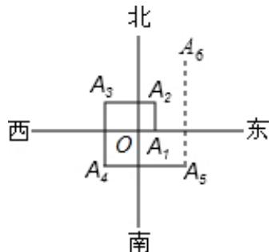

A．（9，15） 

B．（6，15） 

C．（9，9） 

D．（9，12） 

16．如图，将边长为1的正三角形 $O A P$ 沿 x轴正方向连续翻转 2023次，点P依次落在点 $P _ { 1 } , \ P _ { 2 } , \ P _ { 3 } , \cdots _ { ; }$ ， $P _ { 2 0 2 3 }$ 的位置，则点P2023的横坐标为（ ） 

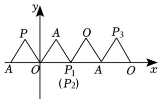

A．2022 

B．2023 

C．2024 

D．2022.5 

## 二．填空题（共 4 小题）

17．如图，点 A（1，0）第一次跳动至点 $A _ { 1 } ~ ( ~ - ~ 1 , ~ 1 )$ ），第二次跳动至点 A2（2，1），第三次跳动至点 A3（﹣ 2，2），第四次跳动至点A（4 3，2），…，依此规律跳动下去，点A第 2024次跳动至点A2024的坐标是 

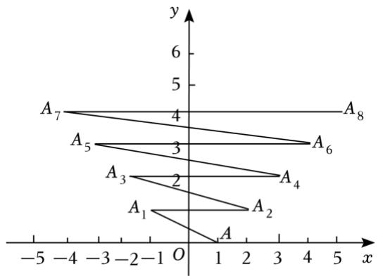

18．如图，在平面直角坐标系中，一动点从原点 O 出发，沿着箭头所示方向，每次移动 1 个单位，依次得 到点 $P _ { 1 } ~ ( 0 , ~ 1 )$ ）， $P _ { 2 }$ （1，1）， $P _ { 3 }$ （1，0）， $P _ { 4 } ~ ( 1 , ~ - ~ 1 )$ ），P5（2，﹣1），P6（2，0），…，则点 P2024 的 坐标是 

19．如图，在平面直角坐标系中，有若干个横、纵坐标均为整数的点，按 $( 1 , \ 0 ) \to ( 2 , \ 0 ) \to ( 2 , \ 1 )$ ） $\to ( 1 , 1 ) \to ( 1 , 2 ) \to ( 2 , 2 ) \to \cdots$ 的顺序用线段依次连接起来．根据这个规律，第50 个点的坐标为 

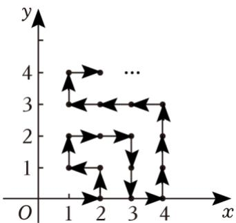

20．在平面直角坐标系中，若干个等腰直角三角形按如图所示的规律摆放．点 P 从原点 O 出发，沿着 $^ { " } O$ $ A _ { 1 } { } A _ { 2 } { } A _ { 3 } { } A _ { 4 } {...." } \ ^ { , }$ 的路线运动（每秒一条直角边），已知 $A _ { 1 }$ 坐标为（1，1），A2（2，0），A3（3，1） $A _ { 4 } ~ ( 4 , ~ 0 ) ~ \cdots$ ，设第n秒运动到点 $P _ { n } ~ ( n$ 为正整数），则点 $P _ { 2 0 2 3 }$ 的坐标是

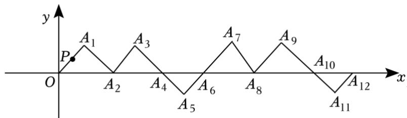
