## 第 01 讲 有序数对

## 01

## 学习目标

<table><tr><td>课程标准</td><td>学习目标</td></tr><tr><td>1有序数对的定义2表示有序数对的方法3有序数对的应用</td><td>1. 掌握有序数对的定义2. 掌握表示确定的点的位置的方法。3. 会用有序数对表示平面内的点的位置。</td></tr></table>

## 02

## 思维导图

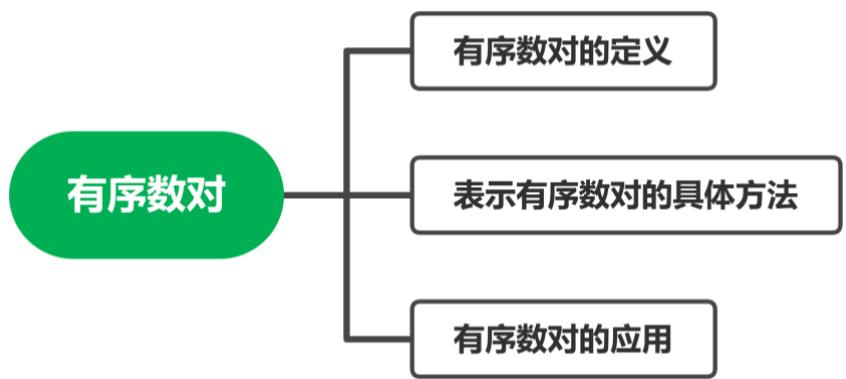

## 知识点 01 有序数对

1. 有序数对的概念： 

由 两个数 a与b组成的数对。记做 

2. 有序数对的应用： 

利用有序数对可以表示物体的位置。 

## 【即学即练 1】

1．如果剧院里“5排2号”记作（5，2），那么（7，9）表示（ ） 

A．“7排9号” 

B． $^ { “ } 9$ 排7号”

C．“7 排7号” 

D．“9排9 号” 

## 知识点02 有序数对的表示方法及其应用

1. 表示有序数对的方法： 

有： 定位法； 定位法； 定位法； 定位法。 

2. 有序数对的应用： 

有序数对可以用来表示准确的 和 。 

## 【即学即练 1】

1．在平面内，下列数据不能确定一个物体位置的是（ ） 

A．北偏西 $4 0 ^ { \circ }$ 

B．3 楼 5 号 

C．解放路30号 

D．东经 $3 0 ^ { \circ }$ ，北纬 $1 2 0 ^ { \circ }$ 

## 【即学即练 2】

2．如图，一只甲虫在5×5的方格（每小格边长为1）上沿着网格线运动．规定：向上向右走为正，向下向 左走为负．如果从 A 到B 记为： $A {  } B ( + 1 , + 4 )$ ），从 B 到 A 记为： $B {  } A ( { } - 1 , { } - 4 )$ ），其中第一个数表 示左右方向，第二个数表示上下方向，那么图中： 

（1） $A {  } C$ （ ）； 

（2）B→D（ ）； 

（3）若这只甲虫按最短路径行走的路线为 $A {  } B {  } C {  } D$ ，请计算该甲虫走过的路程； 

（4）若这只甲虫从 A 处去甲虫 P 处的行走路线依次为（+2，+2），（+1，﹣1），（﹣2，+3），（0，﹣2）， 请在图中标出P 的位置 

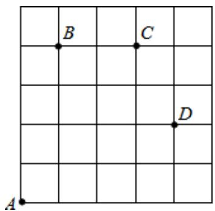

## 题型 01 有序数对表示位置的具体方法

【典例 1】根据下列表述，能确定具体位置的是（ ） 

A．七（3）班教室第三排 

B．昆明市人民东路 

C．南偏西 $4 5 ^ { \circ }$ 

D．东经 $1 0 2 ^ { \circ }$ ，北纬 $2 4 ^ { \circ }$ 

【变式 1】下列表述中，不能确定具体位置的（ 

A．东经 $1 0 8 ^ { \circ }$ 北纬 $5 3 ^ { \circ }$ 

B．某电影院1 号厅的3排 4座 

C．某灯塔南偏西 $3 0 ^ { \circ }$ 方向 

D．距离某学校东北方向500 米处 

【变式 2】根据下列表述，不能确定具体位置的是（ ） 

A．青县众视影城1号厅的 3排4座 

B．青县清州镇新华西路226 号 

C．某灯塔南偏西 $3 0 ^ { \circ }$ 方向 

D．东经 $1 0 8 ^ { \circ }$ ，北纬 $5 3 ^ { \circ }$ 

【变式 3】生态园位于县城东北方向 5公里处，如图表示准确的是（ ） 

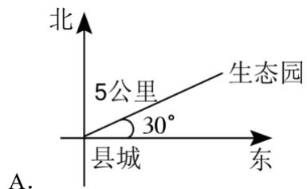

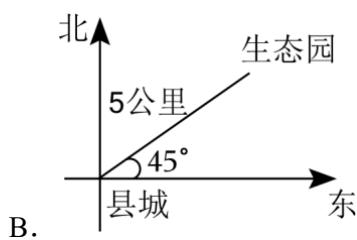

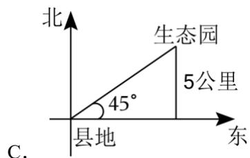

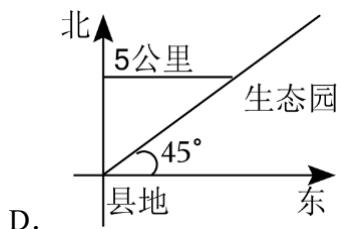

## 题型 02 有序数对与位置

【典例 1】如果棋盘上的“第5列第2行”记作（5，2），“第 7列第5行”记作（7，5），那么（4，3）表 示（ ） 

A．第 3列第5行 

B．第 5列第3行 

C．第 4列第3 行 

D．第 3列第4行 

【变式 1】中国象棋是中华民族的文化瑰宝，它源远流长，趣味性强，成为极其广泛的棋艺活动．如图， 若在象棋盘上建立平面直角坐标系，使“马”位于点（2，﹣2），“兵”位于点（﹣3，1），则“帅”位于 点（ ） 

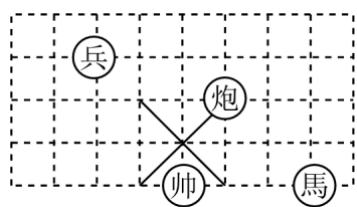

A．（﹣1，1） 

B．（﹣1，﹣2） 

C．（﹣2，1） 

D．（﹣2，﹣1） 

【变式 2】课间操时，小华、小军、小刚的位置如图，小华对小刚说，如果我的位置用（1，1）表示，小 军的位置用（3，2）表示，那么小刚的位置可以表示成（ 

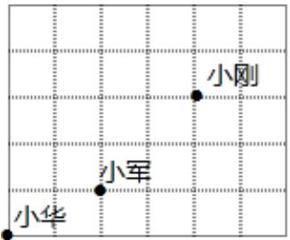

A．（5，4） 

B．（4，5） 

C．（3，4） 

D．（4，3） 

【变式 3】音乐课，聪聪坐在音乐教室的第 4 列第 2 行，用数对（4，2）表示，明明坐在聪聪正后面的第 一个位置上，明明的位置用数对表示是（ ） 

A．（5，2） 

B．（4，1） 

C．（3，2） 

D．（4，3） 

【变式 4】甲坐在第 4 列第 3 行，用数对表示为（4，3），乙的位置用数对表示为（7，6），丙坐在甲的右 边一列，乙的前面一行，则丙的位置用数对表示是（ ） 

A．（3，7） 

B．（4，6） 

C．（5，5） 

D．（4，7） 

【变式 5】如图是一组密码的一部分，为了保密，不同的情况下可以采用不同的密码．若输入数字密码（7， 7），（8，5），对应中转口令是“数学”，最后outputs口令为“文化”；按此方法，若输入数字密码（2，7）， （3，4），则最后outputs口令为（ 

<table><tr><td>8</td><td>邻</td><td>补</td><td>垂</td><td>同</td><td>人</td><td>务</td><td>教</td><td>版</td></tr><tr><td>7</td><td>直</td><td>平</td><td>线</td><td>分</td><td>义</td><td>育</td><td>数</td><td>爱</td></tr><tr><td>6</td><td>二</td><td>次</td><td>根</td><td>号</td><td>语</td><td>物</td><td>角</td><td>理</td></tr><tr><td>5</td><td>相</td><td>木</td><td>条</td><td>可</td><td>问</td><td>文</td><td>位</td><td>学</td></tr><tr><td>4</td><td>流</td><td>程</td><td>行</td><td>发</td><td>现</td><td>过</td><td>程</td><td>点</td></tr><tr><td>3</td><td>素</td><td>养</td><td>以</td><td>重</td><td>难</td><td>目</td><td>化</td><td>标</td></tr><tr><td>2</td><td>模</td><td>交</td><td>互</td><td>心</td><td>中</td><td>特</td><td>殊</td><td>情</td></tr><tr><td>1</td><td>况</td><td>型</td><td>插</td><td>图</td><td>即</td><td>为</td><td>所</td><td>求</td></tr><tr><td></td><td>1</td><td>2</td><td>3</td><td>4</td><td>5</td><td>6</td><td>7</td><td>8</td></tr></table>

A．垂直 

B．平行 

C．素养 

D．相交 

## 题型 03 有序数对表示路径

【典例 1】如图，一只甲虫在 5×5的方格（每小格边长为 1）上沿着网格线运动．它从 A处出发去看望B、 C、D处的其它甲虫，规定：向上向右走为正，向下向左走为负．如果从 A到B 记为：A→B（+1，+4）， 从 B 到 A 记为： $B {  } A ( { } - 1 , { } - 4 )$ ），其中第一个数表示左右方向，第二个数表示上下方向，按图解答下 列问题： 

（1）C→________（+1，________ ）；

（2）若这只甲虫的行走路线为 $A {  } B {  } C {  } D$ ，请计算该甲虫走过的最短路程； 

（3）若这只甲虫从A 处去甲虫P 处的行走路线依次为：（+2，+2），（+2，﹣1），（﹣2，+3），（+1，﹣3）， 请在图中标出P 的位置 

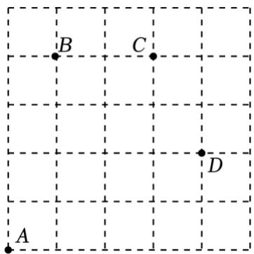

【变式 1】如图，灰太狼和喜羊羊、美羊羊、沸羊羊、懒洋洋在5×5的方格（每个小方格的边长均为 1m） 图上沿着网格线运动．灰太狼从点A 处出发去寻找点 B，C，D，E处的某只羊，规定：向上、向右走为 正，向下、向左走为负．例如从点 A到点B记为A→B（+1，+3），从点B 到点 A记为B→A（﹣1，﹣3）， 其中第一个数表示左右方向的走动，第二个数表示上下方向的走动 

（1）填空：从点 B 到点 D 记为 B→D 

（2）若灰太狼从点 A 处出发去找喜羊羊的行走路线依次为（+1，+3），（+1，+1），（+1，﹣2），（+1，﹣ 1），请在图中标出喜羊羊的位置 E； 

（3）在（2）中若灰太狼每走 1m需消耗0.6焦耳的能量，则灰太狼寻找喜羊羊的过程共需消耗多少焦耳 的能量？ 

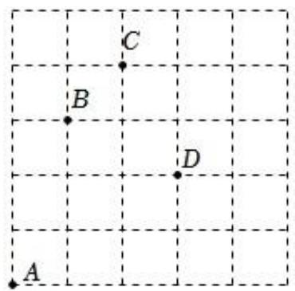

1．下列描述，能确定具体位置的是（ ） 

A．祖庙附近 

B．教室第 2排 

C．北偏东 $5 5 ^ { \circ }$ 

D．东经 $1 1 8 ^ { \circ }$ ，北纬 $4 0 ^ { \circ }$ 

2．如图，有 A，B，C 三点，如果 A 点用（1，1）来表示，B 点用（2，3）表示，则 C 点的坐标的位置可 以表示为（ ） 

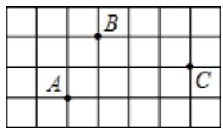

A．（6，2） 

B．（5，3） 

C．（5，2） 

D．（2，5） 

3．根据下列描述，能够确定一个点的位置的是（ ） 

A．学校图书馆前面 

B．凤凰电影院 3排 6座 

C．和谐号第2 号车厢 

D．北偏东 $4 0 ^ { \circ }$ 方向 

4．若（1，2）表示教室里第 1列第2排的位置，则教室里第 3列第2排的位置表示为（ 

A．（2，3） 

B．（3，2） 

C．（2，1） 

D．（3，3） 

5．根据下列表述，能确定准确位置的是（ ） 

A．华艺影城3号厅2排 

B．解放路中段 

C．南偏东 $4 0 ^ { \circ }$ 

D．东经 $1 1 6 ^ { \circ }$ ，北纬 $4 2 ^ { \circ }$ 

6．如果剧院里“5排2号”记作（5，2），那么（7，9）表示（ ） 

A．“7排9号” 

B．“9排7号” 

C．“7 排7号” 

D．“9排9 号” 

7．钓鱼岛及其附属岛屿自古以来就是中国的固有领土，在明代钓鱼岛纳入中国疆域版图，下列描述能够准 确表示钓鱼岛地点的是（ ） 

A．北纬 25°44 

B．福建的正东方向 

C．距离温州市约356千米 

D．北纬 $2 5 ^ { \circ } 4 4 . 1 ^ { \prime }$ ，东经 $1 2 3 ^ { \circ } 2 7 . 5 ^ { \prime }$ 

8．如图是雷达探测到的 6个目标，若目标 B 用 $( 3 0 , ~ 6 0 ^ { \circ }$ ）表示，目标 D 用（50，210°）表示，则表示 为（40，330°）的目标是（ ） 

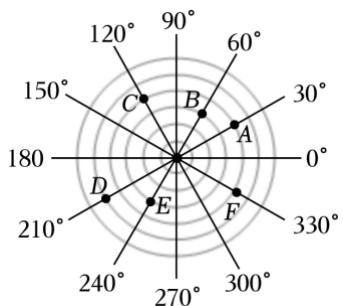

A．目标A 

B．目标C 

C．目标E 

D．目标F 

9．若按照横排在前，纵列在后的编号，甲同学的位置是（3，6），而乙同学所在的位置是第 3 列第 6 排， 则甲、乙同学（ ） 

A．在同一列上 

B．在同一位置上 

C．在同一排上 

D．不在同一列或同一排上 

10．小米同学乘坐一艘游船出海游玩，游船上的雷达扫描探测得到的结果如图所示，每相邻两个圆之间距 离是 1km（小圆半径是 1km）．若小艇 C 相对于游船的位置可表示为（270°，1），则描述图中另外两艘 小艇A，B 的位置，正确的是（ ） 

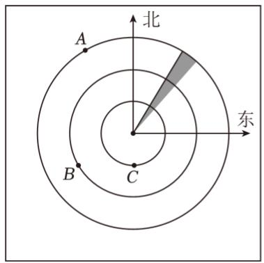

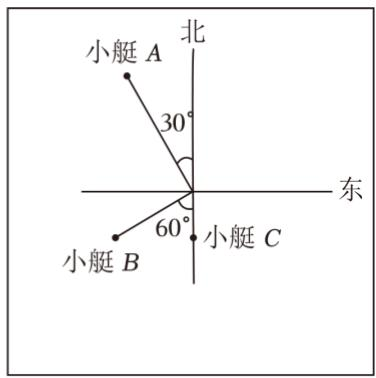

A．小艇A（30°，3），小艇 B（60°，2） 

B．小艇A（30°，3），小艇 B（120°，2） 

C．小艇A（120°，3），小艇B（150°，2） 

D．小艇A（120°，3），小艇B（210°，2） 

11．若电影院中的3排4号记作（3，4），则6排2号可以记作 

12．如图，若在象棋盘上建立直角坐标系，使“帅”位于点（1，﹣1），“马”位于点（4，﹣1），则“兵” 位于点（ ）． 

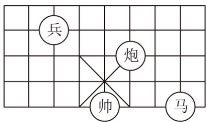

13．五（1）班同学进行队列训练，每列人数相等，张静站在最后一列的最后一个，她的位置用数对表示是 （8，6），五（1）班有 名同学参加了队列训练 

14．如图，雷达探测器在一次探测中发现了两个目标A，B．若目标A的位置表示为（30°，5），则目标B 的位置可以表示为 

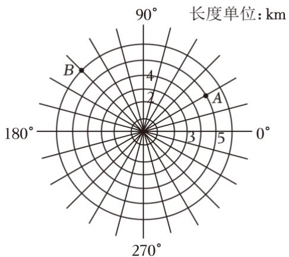

15．同学们，你玩过五子棋吗？它的比赛规则是只要同色 5 子先成一条直线就获胜，如图是两人玩的一盘 2 棋，若白①的位置是（1，﹣5），黑 的位置是（2，﹣4），现轮到黑棋走，你认为黑棋放在 位置 就能获胜． 

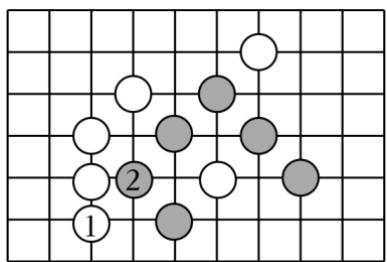

16．根据如图提供的信息回答问题 

（1）书店在小军家 方向 米处． 

（2）学校在小军家正北方向 800 米处，记作“+800 米”，则少年宫在小军家正南方向大约 米 处，记作 米． 

（3）花店在学校南偏东30°方向400米处，请在如图中标示出来 

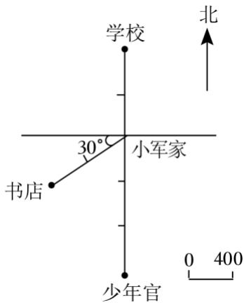

17．填一填，画一画 

（1）百姓超市的位置是 

（2）淘气堡的位置是（1，3），在图中用“●”标出来 

（3）万达影城在世纪广场 度的方向上，距离世纪广场 米． 

（4）滑冰馆在世纪广场东偏南 75°，距世纪广场 1000 米的位置上，在图上用“▲”标出来 

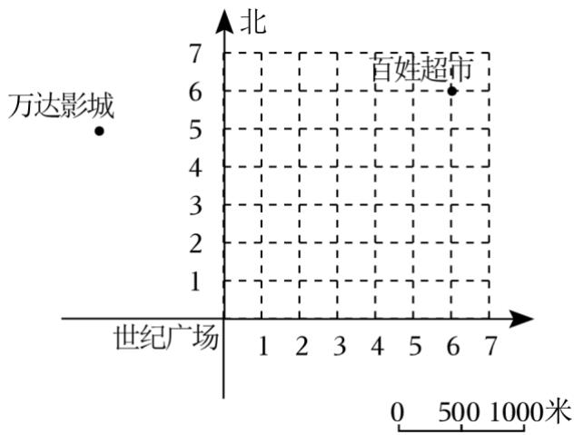

18．如图是游乐园的一角 

（1）如果用（3，2）表示跳跳床的位置，那么跷跷板用数对 表示，碰碰车用数对 表 示，摩天轮用数对 表示． 

（2）请你在图中标出秋千的位置，秋千在大门以东400m，再往北300m处 

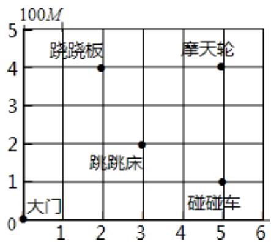

19．如图是光明小区内的一幢商品房的示意图．若小赵家所在的位置用（4，2）表示 

（1）用有序数对表示小李、小张家的位置； 

（2）（3，5），（5，4）分别表示谁家所在的位置？ 

<table><tr><td></td><td></td><td>小王</td><td></td><td></td></tr><tr><td></td><td></td><td></td><td></td><td>小周</td></tr><tr><td>小张</td><td></td><td></td><td></td><td></td></tr><tr><td></td><td></td><td></td><td>小赵</td><td></td></tr><tr><td></td><td>小李</td><td></td><td></td><td></td></tr></table>

20．如图，表示的是图书馆、保龙仓、中国银行和餐馆的位置关系 

（1）以图书馆为参照点，请用方向角和图中所标示的距离分别表示保龙仓、中国银行和餐馆的位置； 

（2）火车站在图书馆的南偏东 60°的方向上，并且火车站距图书馆的距离与中国银行距图书馆的距离 相等，请在图中画出火车站的位置 

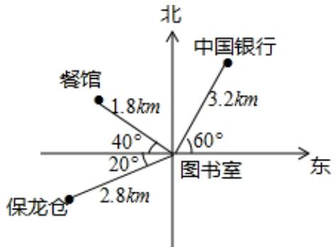
