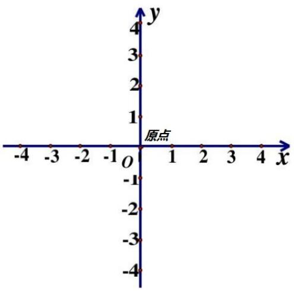
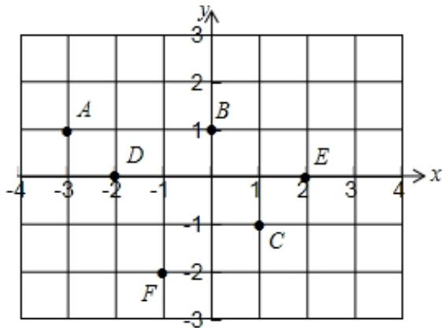
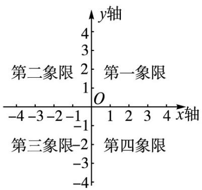
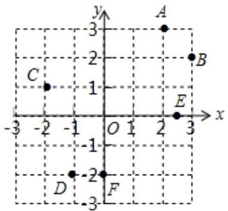
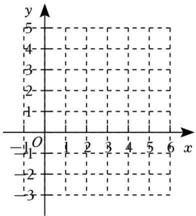
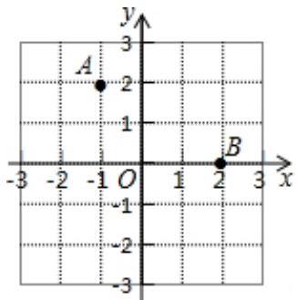
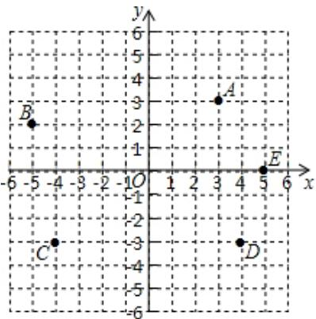
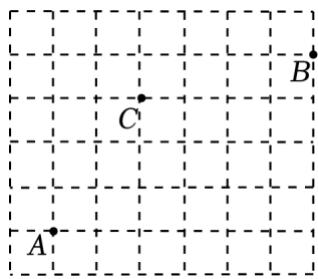
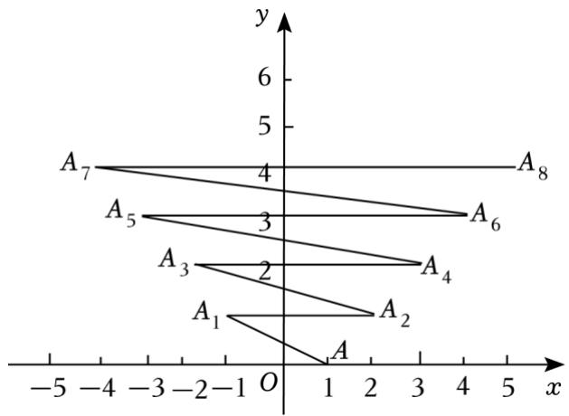

## 第 02 讲 平面直角坐标系

## 01

## 学习目标

<table><tr><td>课程标准</td><td>学习目标</td></tr><tr><td>1平面直角坐标系及点的坐标2象限及其点的坐标特点</td><td>1. 掌握平面直角坐标系的定义及其图形,能够根据点的位置确定点的坐标以及根据点的坐标确定点的位置。2. 掌握各个象限内的点的坐标特点,以及一些特殊位置上的点的坐标特点并能够熟练应用。</td></tr></table>

## 02

## 思维导图

## 知识点01 平面直角坐标系与点的坐标

1. 平面直角坐标系的定义： 

如图：平面内两条相互 且原点 的 数轴组成平面直角坐标系。 

①坐标轴：水平的数轴称为 ；竖直的数轴 称为 。 

②坐标原点：两条坐标轴的 是平面直角坐标系 的原点。 

③坐标平面：坐标轴所在的平面为坐标平面。 

2. 点的坐标： 

横坐标：过平面内一点做x轴的垂线，垂足在x轴上对应的数为这个点的 

纵坐标：过平面内一点做 y 轴的垂线，垂足在 y 轴上对应的数为这个点的 

## 【即学即练 1】

1．如图，写出坐标系中各点的坐标 

## 【即学即练 2】

2．在平面直角坐标系中描出下列各点：A（﹣3，2），B（﹣2，3），C（0，2），D（﹣4，0） 

## 知识点 02 象限及象限内的坐标特点

1. 象限： 

如图，坐标轴把坐标平面分成了四个部分，每一个部分称为象限， 从右上角为 ；逆时针一次得到 、 以及 。 特别地，坐标轴不属于任何一 个象限。 

2. 象限内的点的坐标特点： 

第一象限内的所有点的坐标，横坐标纵坐标均 0；可以表 示为 。 

第二象限内的所有点的坐标，横坐标 0，纵坐标, 0；可以表示为 

第三象限内的所有点的坐标，横坐标 0，纵坐标, 0；可以表示为 。 

第四象限内的所有点的坐标，横坐标 0，纵坐标, 0；可以表示为 。 

## 【即学即练 1】

3．在平面直角坐标系中，点（4，﹣4）所在的象限是（ ） 

A．第一象限 

B．第二象限 

C．第三象限 

D．第四象限 

## 【即学即练 2】

4．如果点 A（a，b）在第二象限，则点 B（b，a）在（ ） 

A．第一象限 

B．第二象限 

C．第三象限 

D．第四象限 

## 知识点 03 特殊位置上的点的坐标特点

1. 坐标轴上的点的坐标特点： 

①x轴上的所有点的纵坐标等于 ，可表示为 

②y轴上的所有点的横坐标等于 ，可表示为 。 

2. 象限角平分线上的点的坐标特点： 

①一、三象限的角平分线上的点的横坐标与纵坐标 

②二、四象限的角平分线上的点的横坐标与纵坐标 

3. 平行与x轴（垂直于y轴）的直线上的点的坐标特点： 

平行与x轴（垂直于y轴）的直线上的所有点的坐标 相等。 

4. 平行与y轴（垂直于x轴）的直线上的点的坐标特点： 

平行与y轴（垂直于x轴）的直线上的所有点的坐标 相等。 

5. 点到坐标轴的距离： 

点到横坐标轴的距离等于该点的 。 

点到纵坐标轴的距离等于该点的 。 

## 【即学即练 1】

5．如果点P（m+3，2m+4）在 y轴上，那么点P的坐标是（ ） 

A．（0，﹣2） 

B．（3，0） 

C．（1，0） 

D．（2，0） 

## 【即学即练 2】

6．点P（3﹣2x，5﹣x）在二、四象限的角平分线上，则 x＝（ ） 

A． $\frac { 8 } { 3 }$ 

B．2 

C． $- { \frac { 8 } { 3 } }$ 

D．﹣2 

## 【即学即练 3】

7．已知点P位于y轴左侧，距 y轴 3个单位长度，位于 x轴上方，距离x轴4 个单位长度，则点P的坐标 是（ ） 

A．（﹣3，4） 

B．（3，﹣4） 

C．（﹣4，3） 

D．（4，﹣3） 

## 【即学即练 4】

8．已知线段 MN 平行于 y 轴，且 M（3，﹣5），N（x，2），那么 x＝ 

## 04

## 题型精讲

## 题型01 确定点的坐标以及在平面直角坐标系中确定点的位置

【典例 1】写出图中A，B，C，D，E，F，O 各点的坐标 

【变式 1】请在如图所示的平面直角坐标系中描出下列各点 

A（5，﹣2），B（3，0），C（2，1），D（6，3） 

【变式 2】如图，在平面直角坐标系中， 

（1）确定点A、B 的坐标； 

（2）描出点C（﹣1，﹣2），点D（2，﹣3） 

【变式 3】如图，在平面直角坐标系中， 

（1）写出点 A，B，C，D，E 的坐标； 

（2）描出点 P（﹣2，﹣1），Q（3，﹣2），S（2，5），T（﹣4，3），分别指出各点所在的象限． 

## 题型 02 判定点所在的象限

【典例 1】在平面直角坐标系中，点 P（﹣2，3）在（ ） 

A．第一象限 

B．第二象限 

C．第三象限 

D．第四象限 

【变式 1】平面直角坐标系中， $( m ^ { 2 } + 1 , \textrm { ~ - } 2 )$ 在第 象限． 

【变式 2】若点 $P \ ( \ - \ 3 , \ a )$ 在 x 轴上，则点 $Q \ ( a - 3 , \ a + 1 )$ 所在象限是（ ） 

A．第一象限 

B．第二象限 

C．第三象限 

D．第四象限 

【变式 3】若点 $P \ ( a , \ b )$ 在第二象限，则 $M \ ( a b , \mathrm { ~ \ ~ - ~ } a )$ ）应在（ ） 

A．第一象限 

B．第二象限 

C．第三象限 

D．第四象限 

【变式 4】若 $a < 0 , \ b > 0$ ，则点（a，b+1）在（ ） 

A．第一象限 

B．第二象限 

C．第三象限 

D．第四象限 

## 题型 03 根据点所在的位置的特点求值

【典例 1】在平面直角坐标系中，点 $M \ ( m - 3 , \ m + 1 )$ ）在x轴上，则点M的坐标为（ 

A．（﹣4，0） 

B．（0，﹣2） 

C．（﹣2，0） 

D．（0，﹣4） 

【变式 1】已知点A（m﹣1，m+4）在y轴上，则m的值为（ ） 

A．﹣4 

B．﹣1 

C．1 

D．4 

【变式 2】已知点P（5a+1，6a+2）在一、三象限的角平分线上，则a＝ 

【变式 3】若点 $M \ ( \mathfrak 5 + a , \ a \ - \ 3 )$ ）在第二、四象限角平分线上，则a的值是（ ）

A．1 

B．2 

C．﹣1 

D．﹣2 

【变式 4】在平面直角坐标系中，点 $P \ ( a , \ b )$ 在第一象限的角平分线上，且 a、b 满足 $2 a + b = 9$ ，则点 P 的坐标为（ 

A．（1，7） 

B．（2，2） 

C．（3，3） 

D．（9，﹣9） 

【变式 5】已知点P、Q的坐标分别为（2m﹣5，m﹣1）、（n+2，2n﹣1），若点P在第二、四象限的角平分 

线上，点 Q 在第一、三象限的角平分线上，则 $m ^ { n }$ 的值为 

## 题型 04 根据点到坐标轴的距离求坐标

【典例 1】第三象限内的点 P 到 x 轴的距离是 7，到 y 轴的距离是 8，那么点 P 的坐标是（ 

A．（﹣8，﹣7） 

B．（﹣7，﹣8） 

C．（8，7） 

D．（7，8） 

【变式 1】点M在第二象限，距离 x轴 5个单位长度，距离 y轴 3 个单位长度，则 M 点的坐标为（ ） 

A．（5，﹣3） 

B．（﹣5，3） 

C．（3，﹣5） 

D．（﹣3，5） 

【变式 2】在平面直角坐标系内有一点A 到x轴的距离是 2，到 y轴距离是4，且A 点在第四象限内，则点 A 的坐标是（ ） 

A．（4，﹣2） 

B．（﹣4，﹣2） 

C．（﹣2，4） 

D．（﹣4，2） 

## 题型 05 根据平行与坐标轴的直线的坐标特点求坐标

【典例 1】在平面直角坐标系中，P（1，2），点 Q 在 x 轴下方， $P Q / / y$ 轴，若 PQ＝5，则点 Q 的坐标为（ 

A．（﹣4，2） 

B．（6，2） 

C．（1，﹣3） 

D．（1，7） 

【变式 1】已知点A的坐标为（﹣1，3），线段AB平行于 x轴且AB＝5，则点 B的坐标为（ ） 

A．（4，3） 

B．（4，3）或（﹣6，3） 

C．（﹣1，8） 

D．（﹣1，8）或（1，﹣2） 

【变式 2】在平面直角坐标系中，已知点 A（m﹣1，2m﹣2），B（﹣3，2）．若直线 AB∥y 轴，则线段 AB 的长为（ ） 

A．2 

B．4 

C．6 

D．8 

【变式 3】在平面直角坐标系中，若 $\textit { A } ( m + 3 , \ \textit { - } 1 ) , \ B ( 1 \ - \ m , \ 3 )$ ），且直线AB∥y轴，则m的值是（ ） 

A．﹣1 

B．1 

C．2 

D．3 

1．在平面直角坐标系中，下列各选项的点在第二象限的是（ ） 

A．（1，2） 

B．（﹣3，2） 

C．（0，0） 

D．（2，﹣3） 

2．若点 $P ~ ( m , ~ n )$ 在第二象限，且到 x轴的距离为2，到 y轴的距离为3，则点P的坐标是（ ） 

A．（﹣2，3） 

B．（2，﹣3） 

C．（﹣3，2） 

D．（3，﹣2） 

3．在平面直角坐标系中，点 $\textit { P } ( m , \textit { n } )$ 位于第四象限，下列结论一定正确的是（ 

A． $m n { > } 0$ 

B． $m n { < } 0$ 

C． $m { + } n { > } 0$ 

D． $m { + } n { < } 0$ 

4．在平面直角坐标系中，点 $P \ ( \mathbf { \varepsilon } - \mathbf { 1 } - m ^ { 2 } , \ \mathbf { 1 } )$ 位于（ ） 

A．第一象限 

B．第二象限 

C．第三象限 

D．第四象限 

5．若点 $P \ ( a - 3 , \ 2 - a )$ ）在 y 轴上，则点 P 的坐标为（ 

A．（0，1） 

B． $ ( 0 , - 1 )$

C．（1，0） 

D．（﹣1，0） 

6．已知点 P（x，y）在 x 轴的上方，且 $\scriptstyle | x | = 3 , \ y ^ { 2 } = 4$ ，则点 P 的坐标为（ ） 

A．（3，2） 

B．（3，﹣2） 

C．（﹣3，2） 

D．（3，2）或（﹣3，2） 

7．小美家（A）、小明家（B）、小丽家（C）在同一个小区，位置如图所示，如果小美家（A）的位置用（﹣ 4，﹣3）表示，小明家（B）的位置用（2，1）表示，那么小丽家（C）的位置可以表示为（ 

A．（0，﹣2） 

B．（﹣2，0） 

C．（﹣2，1） 

D．（﹣1，2） 

8．下列说法不正确的是（ ） 

A．若 $x + y = 0 ;$ ，则点 $P _ { \mathrm { ~ \tiny ~ ( ~ 1 ~ , ~ ~ 1 ~ ) ~ } } ( { \boldsymbol { x } } , { \boldsymbol { y } } )$ 一定在第二、第四象限角平分线上 

B．点 P（﹣2，3）到y轴的距离为 2 

C．若 $P ( x , y )$ 中xy＝0，则P 点在 x轴上

D．点 $A (- a ^ { 2 } - 1 ,| b | { + } 1 )$ 一定在第二象限

9．在平面直角坐标系中，若 $\textit { A } ( m + 3 , \ \mathrm { ~ - ~ } 1 ) , \ \textit { B } ( 3 , \ 1 \ - \ m )$ ），且直线 $A B / / y$ 轴，则m 的值是（ ） 

A．0 

B．1 

C．2 

D．3 

10．已知点P的坐标为（a，b），其中a，b均为实数，若 a，b 满足 $3 a = 2 b + 5$ ，则称点P 为“和谐点”．若 点 $M \ ( m - 1 , \ 3 m + 2 )$ ）是“和谐点”，则点M所在的象限是（ ） 

A．第四象限 

B．第三象限 

C．第二象限 

D．第一象限 

11．已知点P（a，2a﹣1）在一、三象限的角平分线上，则 a的值为 

12．已知点 $\textit { P } ( a ^ { 2 } - 9 , \ a - 1 )$ 在 x轴上，则点P的坐标为 

13．已知点 $ { P } \left( a , \ 2 a { + } 3 \right)$ 在第二象限，且 P到x轴的距离与它到 y轴的距离相等，则 a＝ 

14．在平面直角坐标系中，点C（2，1），CD＝5，CD 平行于 y轴，则点D坐标为 

15．如图，点 A（1，0）第一次跳动至点 $A _ { 1 } ~ ( ~ - ~ 1 , ~ 1 )$ ，第二次跳动至点 A2（2，1），第三次跳动至点 A3（﹣ 2，2），第四次跳动至点A（4 3，2），…，依此规律跳动下去，点A第 2024次跳动至点 A2024的坐标是 

16．已知点 $P \ ( m - 3 , \ 2 m + 4 )$ ），根据下列条件求点 P的坐标 

（1）点P 在x轴上； 

（2）点P 在y轴上 

17．在平面直角坐标系中，已知点 $M \ ( 2 - m , \ 1 { + } 2 m )$ ） 

（1）若点M在 y轴上，求 M点的坐标； 

（2）若点M在第二、四象限的角平分线上，求 M点的坐标 

18．已知点 $P \ ( 2 a - 2 , \ a + 5 )$ ），解答下列各题： 

（1）若点P在x轴上．求出点P 的坐标； 

（2）若点Q的坐标为（4，5），直线 $P Q / / x$ 轴，求出点P 的坐标； 

（3）若点P到x轴、y轴的距离相等，求出点 P的坐标，并说出P 点所在的象限 

19．已知当m，n都是实数，且满足 $2 m { = } 8 { + } n$ 时，称 $p \ ( m - 1 , \ { \frac { \mathtt { n } + 2 } { 2 } } )$ 为“开心点”．例如点 A（5，3）为 “开心点”． 

∵当A（5，3）时，m﹣1＝5， ${ \frac { \ n + 2 } { 2 } } = 3$ ，得m＝6，n＝4， 

$$
\therefore 2 m = 2 \times 6 = 1 2, 8 + n = 8 + 4 = 1 2.
$$

∴ $2 m { = } 8 { + } n$ ．∴A（5，3）是“开心点” 

（1）判断点B（9，6）是否为“开心点”，并说明理由； 

（2）若点 $M \ ( a , \ 2 a - 3 )$ ）是“开心点”，请判断点M在第几象限？并说明理由 

20．在平面直角坐标系中，对于点 $A \ ( x , \ y )$ ，若点 B 的坐标为 $( x + a y , a x + y )$ ，其中 a 为常数，则称点 B 是点A 的 $ a$ 倍相关点”

例如，点 A（1，3）的“2 倍相关点”B 的横坐标为： $1 + 2 \times 3 = 7$ ，纵坐标为： $2 \times 1 + 3 = 5$ ，所以点 A 的 “2倍相关点”B 的坐标为（7，5） 

（1）已知点 P（﹣2，3）的 $\frac { 1 } { 3 }$ 倍相关点”是点 $\textit { Q } ( s , \ t )$ ，求 s+t 的值；

（2）已知点M（1，2m）的 $^  \mathrm { ~ - ~ } 2$ 倍相关点”是点N，且点 N在y轴上，求点N 到x轴的距离