## 第 03 讲 坐标方法的简单应用

## 01

## 学习目标

<table><tr><td>课程标准</td><td>学习目标</td></tr><tr><td>1坐标表示位置2利用坐标表示平移</td><td>1. 掌握建立平面直角坐标系的方法,能够根据已知信息建立平面直角坐标系表示点的坐标。2. 掌握坐标表示平移的规律,并能够熟练运用其解决相关题目。</td></tr></table>

## 02

## 思维导图

## 坐标方法的简单应用

用坐标表示地理位置 

用坐标表示平移 

## 知识点01 利用坐标表示位置

1. 建立平面直角坐标系表示位置的步骤： 

第一步：建立坐标系，选择合适的参照点作为 ，确定x轴与 y轴的正方形。 

第二步：根据具体问题确定 

第三步：在平面直角坐标系内画出待表示的点，写出各点的坐标与名称。 

2. 利用方向角和距离表示地理位置： 

以一点为参照点，用 加上与该参照点的 来确定一点的位置。 

## 【即学即练 1】

1．围棋，起源于中国，古代称为“弈”，是棋类鼻祖，距今已有4000多年的历史．如图是某围棋棋盘的局 部，若棋盘是由边长均为1 的小正方形组成的，棋盘上A、B 两颗棋子的坐标分别为A（﹣2，4），B（1， 2） 

（1）根据题意，画出相应的平面直角坐标系； 

（2）分别写出C、D两颗棋子的坐标； 

（3）有一颗黑色棋子 E 的坐标为（3，﹣1），请在图中画出黑色棋子 E 

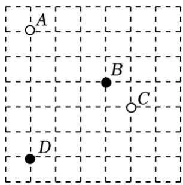

## 【即学即练 2】

2．根据如图提供的信息回答问题 

（1）书店在小军家 方向 米处． 

（2）学校在小军家正北方向 800 米处，记作“+800 米”，则少年宫在小军家正南方向大约 米 处，记作 米． 

（3）花店在学校南偏东30°方向400米处，请在如图中标示出来 

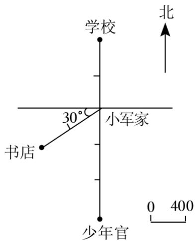

## 知识点 02 利用坐标表示平移

1. 点的平移： 

左右平移：点在平面直角坐标系中进行左右平移时，纵坐标 ，横坐标进行 。向右平 移时 ，向左平移时 

巧记：左右平移，横加减，纵不变，右加左减。 

上下平移：点在平面直角坐标系中进行上下平移时，横坐标 ，纵坐标进行 。向上 平移时 ，向下平移时 

巧记：上下平移，纵加减，横不变，上加下减。 

2. 图形的平移： 

图形平移时，把图形的关键点按照点的平移进行平移，然后把平移后的点按照原图形连接。因为图形 是整体平移，所以图形上的每一个点都遵循同一个平移规律。 

## 【即学即练 1】

3．点P（﹣2，﹣3）向右平移 3个单位，再向上平移5个单位，则所得点的坐标为（ ） 

A．（﹣5，2） 

B．（1，2） 

C．（﹣5，﹣8） 

D．（1，﹣8） 

## 【即学即练 2】

4．如图，在平面直角坐标系中，点A、B 的坐标分别为（2，0）、（0，1），若将线段AB平移至CD，则a+b 的值为 

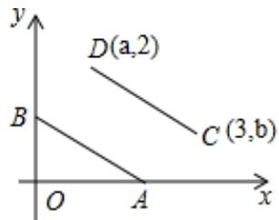

04 

题型精讲 

## 题型 01 利用坐标确定位置

【典例 1】如图，在中国象棋的残局上建立平面直角坐标系，如果“馬”和“車”的坐标分别是（4，3） 和（﹣2，1），那么“炮”的坐标为（ 

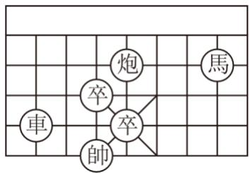

A．（3，3） 

B．（1，3） 

C．（3，2） 

D．（0，2） 

【变式 1】如图是在4×4的小正方形组成的网格中，画的一张脸的示意图，如果用（0，4）和（2，4）表 示眼睛，那么嘴的位置可以表示为（ ） 

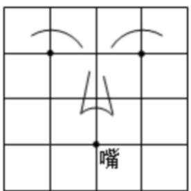

A．（1，1） 

B．（﹣1，1） 

C．（2，1） 

D．（1，2） 

【变式 2】如图所示的是一所学校的平面示意图，若用（3，2）表示教学楼，（4，0）表示旗杆，则实验楼 

的位置可表示成（ 

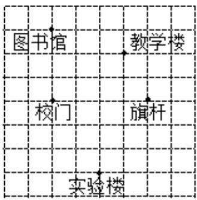

A．（1，﹣2） 

B．（﹣2，1） 

C．（﹣3，2） 

D．（2，﹣3） 

【变式 3】为让每个农村孩子都能上学，国家实施了“农村中小学寄宿制学校建设工程”，如图是某寄宿制 学校的平面示意图，已知旗杆的位置是（﹣2，3），实验室的位置是（1，4） 

（1）请你画出该学校平面示意图所在的坐标系； 

（2）办公楼的位置是（﹣2，1），教学楼的位置是（2，2），在图中标出办公楼和教学楼的位置； 

（3）写出食堂、书馆的坐标 

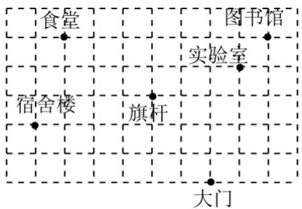

【变式 4】填一填，画一画 

（1）百姓超市的位置是 

（2）淘气堡的位置是（1，3），在图中用“●”标出来 

（3）万达影城在世纪广场 度的方向上，距离世纪广场 米 

（4）滑冰馆在世纪广场东偏南 75°，距世纪广场1000 米的位置上，在图上用“▲”标出来 

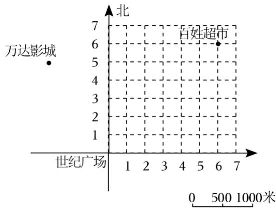

【典例 1】在平面直角坐标系中，已知点A 的坐标为（1，4），如果将点 A向右平移2个单位长度得到点 $A ^ { \prime }$ ， 则点 $A ^ { \prime }$ 的坐标为（ ） 

A．（1，2） 

B．（1，6） 

C．（﹣1，4） 

D．（3，4） 

【变式 1】若点 A（1，2）向下平移 2 个单位长度得到对应点 $A ^ { \prime }$ ，则点 $A ^ { \prime }$ 的坐标是（ 

A．（﹣1，2） 

B．（1，0） 

C．（1，4） 

D．（3，2） 

【变式 2】在平面直角坐标系中，将点 A（﹣2，﹣3）向右平移2个单位长度，再向下平移 4个单位长度得 到点 B，则点 B 的坐标为（ ） 

A．（0，﹣3） 

B．（﹣4，﹣7） 

C．（4，﹣3） 

D．（0，﹣7） 

【变式 3】在平面直角坐标系中，已知线段 AB 的两个端点分别是 A（﹣3，﹣2），B（1，2），将线段 AB 平移后得到线段 $A ^ { \prime } B ^ { \prime }$ ′，若点 $A ^ { \prime }$ 坐标为（﹣4，2），则点 $B ^ { \prime }$ 的坐标为（ ） 

A．（0，6） 

B．（2，2） 

C．（6，0） 

D．（5，6） 

【变式 4】在平面直角坐标系中，已知点A（﹣4，0）和B（﹣2，2），现将线段AB沿着直线AB 平移，使 点A与点B重合，则平移后点B 坐标是（ ） 

A．（0，﹣2） 

B．（4，6） 

C．（4，4） 

D．（0，4） 

【变式 5】将点P（m+2，2m﹣3）向下平移1个单位，向左平移3个单位得到点 $\mathcal { Q } ,$ ，点Q 恰好落在y轴上， 则点Q的坐标是 

【变式 6】在平面直角坐标系中，将点（m，n）先向右平移 2 个单位，再向上平移 1 个单位，最后所得点 的坐标是（ ） 

A．（m﹣2，n﹣1） 

B． $( m - 2 , ~ n { + } 1 )$ 

C．（m+2，n﹣1） 

D． $\left( m + 2 , n + 1 \right)$ 

【变式 7】△ABC 三个顶点的坐标分别为 A（2，1），B（4，3），C（0，2），将△ABC 平移到了 $\triangle A ^ { \prime } B ^ { \prime } C$ ， 其中A'（﹣1，3），则C'点的坐标为（ ） 

A．（﹣3，6） 

B．（2，﹣1） 

C．（﹣3，4） 

D．（2，5） 

【变式 8】如图，在平面直角坐标系中，将三角形ABC 平移至三角形 $A _ { 1 } B _ { 1 } C _ { 1 }$ ，点 $P \ ( a , \ b )$ ）是三角形ABC 内一点，经平移后得到三角形 $A _ { 1 } B _ { 1 } C _ { 1 }$ 内对应点 $P _ { 1 } \ ( a + 8 , \ b - 5 )$ ），若点 $A _ { 1 }$ 的坐标为（5，﹣1），则点 A 的坐标为（ 

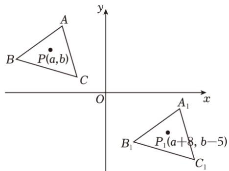

A．（﹣4，3） 

B．（﹣1，2） 

C．（﹣6，2） 

D．（﹣3，4） 

## 题型 03 求平移前的坐标

【典例 1】已知某点向右平移 3个单位长度，再向上平移3个单位长度得到坐标是（﹣1，4），则该点平移 前坐标是（ ） 

A．（﹣4，1） 

B．（﹣4，7） 

C．（2，2） 

D．（2，7） 

【变式 1】将△ABC 向右平移 5个单位，向上平移6 个单位后A点的坐标为（4，7），则平移前 A点的坐标 为（ ） 

A．（9，13） 

B．（﹣1，1） 

C．（﹣1，13） 

D．（9，1） 

【变式 2】把图形M先向左平移 2个单位，再向上平移 6个单位，如果平移后的图形上有一点A 的坐标为 （﹣3，3），那么平移前该点的坐标为（ ） 

A．（﹣1，﹣3） 

B．（﹣5，9） 

C．（﹣1，9） 

D．（﹣5，3） 

【变式 3】将点A（m+2，m﹣3）向左平移三个单位后刚好落在y轴上，则平移前点 A的坐标是 

## 题型 04 利用平移规律求值

【典例 1】已知点A的坐标是（2，a），将其向下平移 1 个单位后的坐标是（2，2），则 a的值是 

【变式 1】如图，点A，B的坐标分别为（﹣2，a），（0，﹣2），现将线段平移至 $A 1 B 1$ ，且点A1， $B 1$ 的坐标 分别为（1，4），（b，1），则 a+b 的值为（ ） 

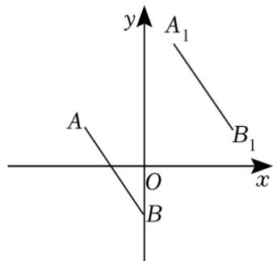

A．﹣3 

B．3 

C．﹣4 

D．4 

【变式 2】将点P（m+2，3）向右平移 3个单位长度到P'，且 P'在 y轴上，则m 的值是（ ） 

A．﹣5 

B．1 

C．﹣1 

D．﹣3 

【变式 $4 】 \triangle A B C$ 所在平面内任意一点 $P \ ( a , \ b )$ ）经过平移后对应点 $P _ { 1 } \ ( c , \ d )$ ，已知 A（2，3）经过此次 平移后对应点 $A _ { 1 } ~ ( 5 , ~ - ~ 1 )$ ，则 $a + b - c - d$ 的值为（ ）

A．﹣5 

B．5 

C．﹣1 

D．1 

【变式 5】在平面直角坐标系中，把点 P（a﹣1，5）向左平移3 个单位得到点Q（2﹣2b，5），则 $2 a + 4 b + 3$ 的值为 

## 题型 05 平面直角坐标系中利用割补法求三角形的面积

【典例 1】如图，在平面直角坐标系中，已知 A（﹣2，3），B（﹣4，﹣1），C（2，0），△ABC 先向右平移 6个单位长度，再向上平移 4 个单位长度得到 $\triangle A _ { 1 } B _ { 1 } C _ { 1 }$ ，完成以下问题： 

（1）画出 $\triangle A _ { 1 } B _ { 1 } C _ { 1 }$ ； 

（2）写出点 $A _ { 1 } , \ B _ { 1 } , \ C _ { 1 }$ 的坐标； 

（3）求△ABC 的面积 

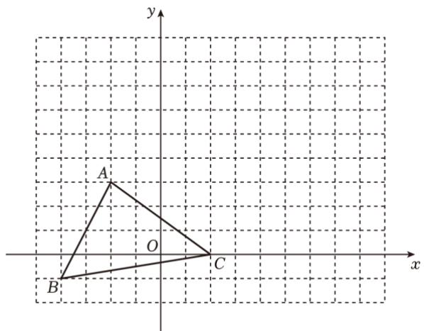

【变式 1】如图，在平面直角坐标系中，三角形ABC 的顶点都在网格点上，其中点 C的坐标为（1，2） 

（1）点A 的坐标是 （2，﹣1） 点B 的坐标是 （4，3） 

（2）画出将三角形ABC先向左平移 2个单位长度，再向上平移 1 个单位长度所得到的三角形A'B'C'．请 

写出三角形A'B'C'的三个顶点坐标； 

（3）求三角形ABC的面积 

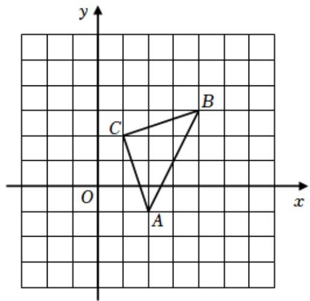

【变式 2】如图，△ABC 在直角坐标系中，把△ABC向上平移 2个单位，再向右平移 2个单位得 $\triangle A _ { 1 } B _ { 1 } C _ { 1 }$ 

（1）请求出 $\triangle A B C$ 的面积 

（2）请你在图中画出 $\triangle A _ { 1 } B _ { 1 } C _ { 1 }$ ，并写出点A1的坐标 

（3）若点 $P \ ( a , \ b )$ ）是 $\triangle A B C$ 内一点，直接写出点 P 平移后对 应点的坐标 

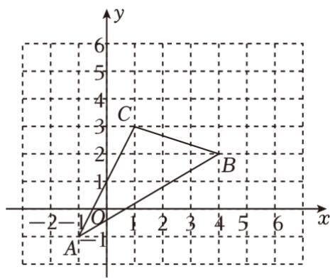

【变式 3】如图，在平面直角坐标系中，已知点 $A ~ ( ~ - ~ 5 , ~ 2 ) , ~ B ~ ( ~ - ~ 4 , ~ 5 ) , ~ C ~ ( ~ m , ~ n )$ 

（1）点 C 落在 y 轴正半轴，且到原点的距离为 3，则 $m = \_ 0 , n = \_ 3$ ； 

（2）在平面坐标系中画出△ABC； 

（3）若 $\triangle A B C$ 边上任意一点 $P _ { \mathrm { ~ \tiny ~ \left( ~ \it { ~ x ~ } _ { 0 } , ~ \epsilon ~ \right) ~ } } ( { \boldsymbol { \it ~ x ~ } _ { 0 } } , { \boldsymbol { \it ~ y } _ { 0 } } )$ ）平移后对应点 $P _ { 1 } ~ ( x _ { 0 } \ – 4 , ~ y _ { 0 } - 1 )$ ），在平面直角坐标系中画出平 移后的 $\triangle A _ { 1 } B _ { 1 } C _ { 1 }$ 

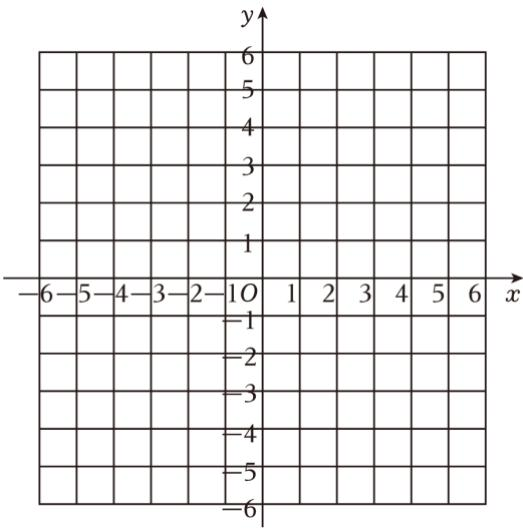

05 

强化训练 

1．中国象棋是中华民族的文化瑰宝，如图，棋盘放在直角坐标系中，“炮”所在位置的坐标为（﹣2，1）， 

“相”所在位置的坐标为（3，﹣1），则“帅”所在位置的坐标为（ 

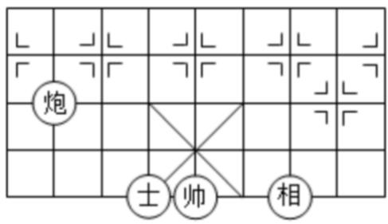

A．（1，﹣1） 

B．（﹣1，﹣1） 

C．（1，0） 

D．（﹣1，1） 

2．点M（2，4）先向右平移 3个单位长度，再向下平移 2个单位长度得到的点坐标是（ ） 

A．（﹣1，6） 

B．（﹣1，2） 

C．（5，6） 

D．（5，2） 

3．如图，这是围棋棋盘的一部分，将它放置在某个平面直角坐标系中，若白棋②的坐标为（﹣3，﹣1）， 黑棋①的坐标为（1，﹣4），则白棋④的坐标为（ 

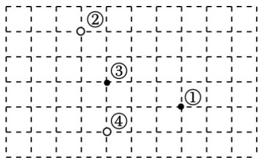

A．（﹣2，﹣3） 

B．（1，﹣4） 

C．（﹣2，﹣5） 

D．（﹣5，﹣2） 

4．将点 A（﹣3，﹣1）先向左平移 2个单位长度，再向上平移 4 个单位长度，得到点 $A ^ { \prime }$ ，则点 $A ^ { \prime }$ 在（ ） 

A．第一象限 

B．第二象限 

C．第三象限 

D．第四象限 

5．在平面直角坐标系中，已知 A（﹣2，0），B（0，3），将线段 AB 平移后得到线段 CD，点 A，B 的对应 点分别是点C，D．若点D 的坐标为（4，0），则点C的坐标为（ ） 

A．（2，﹣2） 

B．（2，﹣3） 

C．（1，﹣2） 

D．（1，﹣3） 

6．在平面直角坐标系中，已知点 A（m﹣1，2m﹣2），B（﹣3，2）．若直线AB∥y轴，则线段AB的长为（ 

A．2 

B．4 

C．6 

D．8 

7．如图，在平面直角坐标系中，四边形 ABCD的顶点都在网格点上，将四边形ABCD平移使得点B 平移至 点D 的位置，则此时点A对应的点的坐标为（ ） 

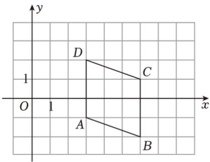

A．（0，0） 

B．（2，3） 

C．（0，3） 

D．（﹣1，4） 

8．下列结论正确的是（ ） 

A．点 P（﹣1，2023）在第四象限 

B．点 M在第二象限，且到 x轴和y轴的距离分别为4和 3，则点M的坐标为（﹣4，3） 

C．平面直角坐标系中，点 $P \ ( x , \ y )$ 位于坐标轴上，那么 $x y = 0$ 

D．已知点 P（﹣5，6），Q（﹣3，6），则直线 $P Q / / y$ 轴 

9．在平面直角坐标系 xOy 中，对于 P，Q 两点给出如下定义：若点 P 到 x、y 轴的距离中的最大值等于点 Q 到 x、y轴的距离中的最大值，则称 P，Q 两点为“等距点”．如图中的P，Q 两点即为“等距点”．若点 A 的坐标为（﹣3，1），点B 的坐标为 $B \ ( m , \ m { + } 6 )$ ），且 A，B 两点为“等距点”，则点B 的坐标为（ ） 

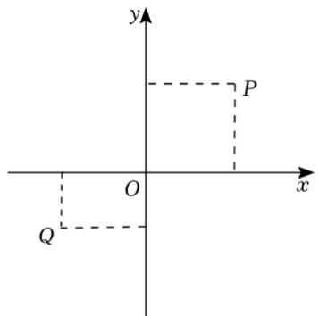

A．（3，9） 

B．（﹣3，3） 

C．（﹣9，﹣3） 

D．（﹣9，3） 

10．如图，在平面直角坐标系 $x O y$ 中，点 P（1，0）．点 P 第 1 次向上跳动1 个单位至点 $P _ { 1 } \ ( 1 , \ 1 )$ ），紧接 着第 2 次向左跳动2 个单位至点 $P _ { 2 } ~ ( ~ - ~ 1 , ~ 1 )$ ），第3 次向上跳动 1 个单位至点 $P _ { 3 }$ ，第 4次向右跳动 3个 单位至点 P4，第 5 次又向上跳动 1 个单位至点 P5，第 6 次向左跳动 4 个单位至点 P6，…照此规律，点 P 第2020次跳动至点P2020的坐标是（ ） 

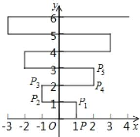

A．（﹣506，1010） 

B．（﹣505，1010） 

C．（506，1010） 

D．（505，1010） 

11．已知在平面直角坐标系中，点A的坐标为（﹣5，1），若 $A B \bot x$ 轴于点B，则点B 的坐标为 

12．在平面直角坐标系中，若点 M（1，3）与点N（m，3）之间的距离是3，则m的值是 

13．在平面直角坐标系中，线段AB经过平移后得到线段CD，已知点A（﹣3，2）的对应点为 C（1，﹣2）．若 点B的对应点为D（0，1），则点 B的坐标为 

14．如图，已知A，B 的坐标分别为（1，2），（3，0），将 $\triangle O A B$ 沿 x轴正方向平移，使 B 平移到点 E，得 到 $\triangle D C E$ ，若 $O E { = } 4$ ，则点 C的坐标为 

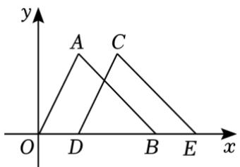

15．如图，在平面直角坐标系中，一动点从原点 O 出发，按向上、向右、向下、向右的方向依次平移，每 次移动一个单位，得到点 $A _ { 1 } ( 0 , 1 ) , A _ { 2 } ( 1 , 1 ) , A _ { 3 } ( 1 , 0 ) , A _ { 4 } ( 2 , 0 )$ ，…那么点A2022的坐标为 

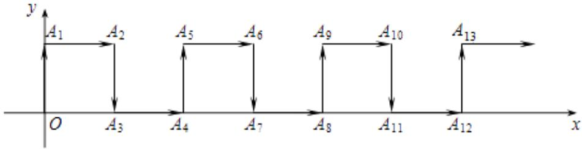

16．如图，已知火车站的坐标为（2，2），文化馆的坐标为（﹣1，3） 

（1）请你根据题目条件，画出平面直角坐标系； 

（2）写出体育场，市场，超市的坐标； 

（3）已知游乐场 A，图书馆 B，公园 C 的坐标分别为（0，5），（﹣2，﹣2），（2，﹣2），请在图中标出 A，B，C 的位置 

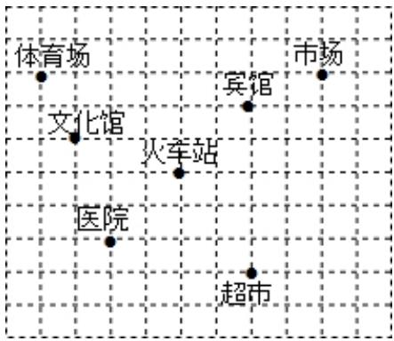

17．已知点 $P \ ( 2 a - 3 , \ a + 6 )$ ），解答下列各题： 

（1）若点Q的坐标为（3，3），且直线 $P Q / / y$ 轴，求出点 P的坐标； 

（2）若点 P 在第二象限，且它到 x 轴、y 轴的距离相等，求 $\mathtt { a } ^ { 2 0 2 4 } + \sqrt [ 3 ] { \mathtt { a } }$ 的值． 

18．已知：A（0，1），B（2，0），C（4，3） 

（1）在坐标系中描出各点，画出 $\triangle A B C$ 

（2）求 $\triangle A B C$ 的面积； 

（3）设点P在坐标轴上，且 $\triangle A B P$ 与 $\triangle A B C$ 的面 积相等，求点 P 的坐标 

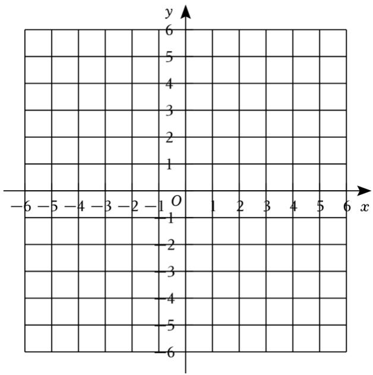

19．先阅读下列一段文字，再回答后面的问题 

已知在平面内两点 $P _ { 1 } ( x _ { 1 } , \ y _ { 1 } ) , \ P _ { 2 } ( x _ { 2 } , \ y _ { 2 } )$ ），这两点间的距离 $P _ { 1 } P _ { 2 } { = } \sqrt { ( \mathbf { \sigma } _ { { \bf x } _ { 2 } } { - } \mathbf { \acute { x } } _ { 1 } ) { } ^ { 2 } + ( \mathbf { \acute { y } } _ { 2 } { - } \mathbf { \acute { y } } _ { 1 } ) { } ^ { 2 } }$ ，同 时，当两点所在的直线在坐标轴或平行于坐标轴或垂直于坐标轴时，两点间距离公式可简化为 $\left| x 2 ^ { \mathbf { \gamma } - { \mathbf { \gamma } } } x 1 \right.$ |或 $| y _ { 2 } - y _ { 1 } | .$ ． 

（1）已知A（2，4）， $B \ ( \ - \ 3 , \ - \ 8 )$ ），试求A，B 两点间的距离； 

（2）已知A，B在平行于y轴的直线上，点A 的纵坐标为 5，点B 的纵坐标为﹣1，试求A，B 两点间的 距离． 

20．对于平面直角坐标系 $x O y$ 中的点 $P \ ( a , \ b )$ ，若点 $P ^ { \prime }$ 的坐标为 $( a { + } k b , k a { + } b )$ ）（其中 k为常数，且 $k { \neq }$ 0），则称点 $P ^ { \prime }$ 为点P的“k属派生点” 

例如：P（1，4）的“2 属派生点”为 $P ^ { \prime } ( 1 { + } 2 { \times } 4 , 2 { \times } 1 { + } 4 )$ ），即 $P ^ { \prime } ( 9 , 6 )$ ） 

（1）点 $P ~ ( ~ - ~ 1 , ~ 6 )$ 的 $^ { 6 6 } 2$ 属派生点” $P ^ { \prime }$ 的坐标为 

（2）若点P的 $^ { 6 6 } 3$ 属派生点” $P ^ { \prime }$ 的坐标为（6，2），则点 P的坐标 

（3）若点P 在x轴的正半轴上，点P 的 $^ {“} k$ 属派生点”为 $P ^ { \prime }$ 点，且线段 $P P ^ { \prime }$ ′的长度为线段 $O P$ 长度的2 倍，求 k 的值