## 第 04 讲 专题 1 点的坐标：规律题

1．小静同学观察台球比赛，从中受到启发，抽象成数学问题如下：如图，已知长方形OABC，小球P从（0， 3）出发，沿如图所示的方向运动，每当碰到长方形的边时反弹，反弹时反射角等于入射角，第一次碰到 长方形的边时的位置为 $P _ { 1 }$ （3，0），当小球 P 第 2024 次碰到长方形的边时，若不考虑阻力，点 P2024的 坐标是（ ） 

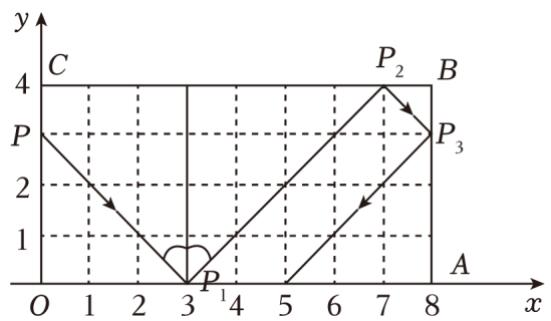

A．（1，4） 

B．（7，4） 

C．（0，3） 

D．（3，0） 

【解答】解：因为点 $P _ { 1 }$ 的坐标为（3，0）， 

根据点P的运动方式，结合反射角等于入射角可知， 

点 $P _ { 2 }$ 的坐标为（7，4）， 

点 $P _ { 3 }$ 的坐标为（8，3）， 

点 $P 4$ 的坐标为（5，0）， 

点 $P _ { 5 }$ 的坐标为（1，4）， 

点 $P _ { 6 }$ 的坐标为（0，3）， 

点 $P _ { 7 }$ 的坐标为（3，0）， 

由此可见，点P 每反弹6次，点的坐标循环出现， 

由因为 $2 0 2 4 \div 6 = 3 3 7$ 余2， 

所以点 $P _ { 2 0 2 4 }$ 的坐标为（7，4） 

故选：B． 

2．如图，点 A（0，1），点 A1（2，0），点 A2（3，2），点 A3（5，1），点 $A _ { 4 } ~ ( 6 , ~ 3 ) ~ \cdots$ ，按照这样的规律 下去，点 A2024的坐标为（ ） 

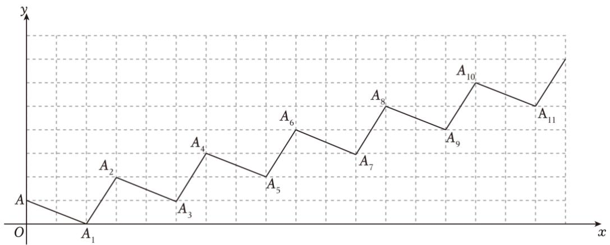

A．（3035，1011） 

B．（3036，1011） 

C．（3035，1013） 

D．（3036，1013） 

【解答】解：由题知， 

点A1的坐标为（2，0）； 

点A2的坐标为（3，2）； 

点 $A _ { 3 }$ 的坐标为（5，1）； 

点 $A _ { 4 }$ 的坐标为（6，3）； 

点A5的坐标为（8，2）； 

点 $A _ { 6 }$ 的坐标为（9，4）； 

点A7的坐标为（11，3）； 

点A8的坐标为（12，5）； 

由此可见，点 $A _ { n }$ 的坐标为 $( \frac { 3 \pi } { 2 } , \ \frac { n + 2 } { 2 } )$ ，点 $A _ { n - 1 }$ 的坐标为 $( \frac { 3 \bar { \mathrm { n } } } { 2 } - 1 , ~ \frac { \bar { \mathrm { n } } ^ { - 2 } } { 2 } )$ （ （n 为正偶数）； 

当 n＝2024 时， 

$$
\frac {3 \mathrm{n}}{2} = \frac {3 \times 2 0 2 4}{2} = 3 0 3 6,
$$

$$
\frac {n + 2}{2} = \frac {2 0 2 4 + 2}{2} = 1 0 1 3,
$$

所以点 A2024 的坐标为（3036，1013） 

故选：D． 

3．如图，在平面直角坐标系中， $\triangle A _ { 1 } A _ { 2 } A _ { 3 } , \triangle A _ { 3 } A _ { 4 } A _ { 5 } , \triangle A _ { 5 } A _ { 6 } A _ { 7 }$ ，⋯都是斜边在x轴上的等腰直角三角形， 点 $A _ { 1 } ( { \mathit { \Delta } } - 2 , { \mathit { \Delta } } 0 ) , A _ { 2 } ( { \mathit { \Delta } } - 1 , { \mathit { \Delta } } - 1 ) , A _ { 3 } ( { \mathit { \Delta } } 0 , { \mathit { \Delta } } 0 ) , \cdots ;$ ；则根据图示规律，点 A1020的坐标为（ ） 

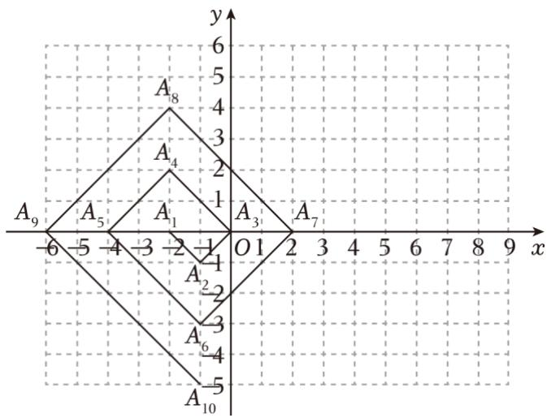

A．（﹣1，﹣510） 

B．（2，510） 

C．（﹣2，510） 

D．（1，﹣510） 

【解答】解：由题知， 

点 $A _ { 1 }$ 的坐标为（﹣2，0）； 

点 $A 2$ 的坐标为（﹣1，﹣1）； 

点 $A _ { 3 }$ 的坐标为（0，0）； 

点 $A _ { 4 }$ 的坐标为（﹣2，2）； 

点 $A 5$ 的坐标为（﹣4，0）； 

点 $\boldsymbol { A } 6$ 的坐标为 $( \mathbf  - 1 , \mathbf - 3 ) ;$

点 $A 7$ 的坐标为（2，0）； 

点 $\boldsymbol { A } _ { 8 }$ 的坐标为（﹣2，4）； 

由此可知，点 $A 4 n$ 的坐标为（﹣2，2n）（n 为正整数）， 

又因为 $1 0 2 0 \div 4 = 2 5 5 ,$ 

所以 $2 \times 2 5 5 = 5 1 0 ,$ 

所以点A1020的坐标为（﹣2，510） 

故选：C 

4．如图，在平面直角坐标系中，有若干个横纵坐标分别为整数的点，其顺序按图中“→”方向排列，其对 应的点坐标依次为（0，0），（1，0），（1，1），（0，1），（0，2），（1，2），（2，2），（2，1），…，根据这 个规律，第2023个点的横坐标为（ 

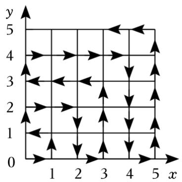

A．44

B．45

C．46

D．47

【解答】解：第一个正方形上有 4 个点，添上第二个正方形后，一共有 3×3＝9 个点，添上第三个正方 形后，一共有 4×4＝16 个点， 

∵添上第44个正方形后，一共有 $4 5 \times 4 5 { = } 2 0 2 5$ 个点， 

∴第 2025个点的坐标是（44，0）， 

∴第 2023个点的横坐标为 44， 

故选：A． 

5．如图，动点M按图中箭头所示方向运动，第 1次从原点运动到点（2，2），第2次运动到点（4，0），第 3次运动到点（6，4），…，按这样的规律运动，则第 2024次运动到点（ ） 

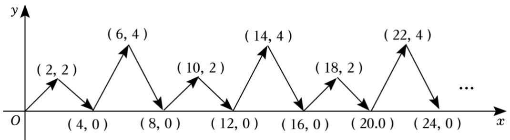

A．（2024，2）

B．（4048，0）

C．（2024，4）

D．（4048，4）

【解答】解：∵第1次从原点运动到点（2，2），第2 次运动到点（4，0），第3次运动到点（6，4），第 4次从原点运动到点（8，0），第5次运动到点（10，2）……， 

∴动点M的横坐标为2n，纵坐标按照 2，0，4，0四个为一组进行循环， 

$$
\because 2 0 2 4 \div 4 = 5 0 4,
$$

∴第 2023次运动到点（2×2024，0），即：（4048，0）； 

故选：B． 

6．如图，将边长为1 的正方形OAPB 沿x轴正方向边连续翻转 2023次，点P依次落在点 $P _ { 1 } , \ P _ { 2 } , \ P _ { 3 } , \cdots _ { }$ ， $P _ { 2 0 2 3 }$ 的位置，则 $P _ { 2 0 2 3 }$ 的横坐标 x2023 为（ ） 

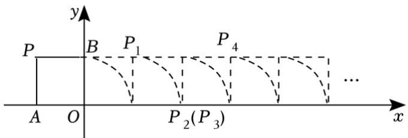

A．2021 

B．2022 

C．2023 

D．不能确定 

【解答】解：从P到 $P _ { 4 }$ 要翻转 4次，横坐标刚好加4， 

$$
\because 2 0 2 3 \div 4 = 5 0 5 \dots \dots 3,
$$

$$
\therefore 5 0 5 \times 4 - 1 = 2 0 1 9,
$$

还要再翻三次，即完成从P 到 $P _ { 3 }$ 的过程，横坐标加3， 

则 $P _ { 2 0 2 3 }$ 的横坐标 $x _ { 2 0 2 3 } = 2 0 2 2$ 

故选：B． 

7．如图，在平面直角坐标系中，动点 P 从 $A _ { 1 } \ ( 1 , \ 0 )$ 出发，沿着 $A _ { 1 } ~ ( 1 , ~ 0 )  A _ { 2 } ~ ( 2 , ~ 0 )  A _ { 3 } ~ ( 2 , ~ 1 )$ ） $ A _ { 4 } ( 1 , \ 1 )  A _ { 5 } ( 1 , \ 2 )  A _ { 6 } ( 3 , \ 2 )  A _ { 7 } ( 3 , \ 4 )  A _ { 8 } ( 1 , \ 4 )  A _ { 9 } ( 1 , \ 6 )  A _ { 1 0 } ( 4 , \ 6 )    \mathrm { f } _ { 1 0 } ( 6 , \ 4 ) .$ 的 路线运动，按此规律，则点 P运动到A47时坐标为（ ） 

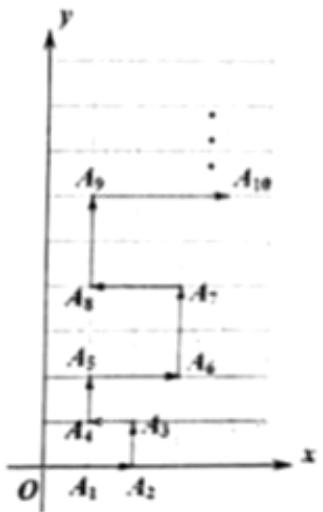

A．（13，156） 

B．（1，156） 

C．（1，144） 

D．（13，144） 

【解答】解：由题知， 

∵A4（1，1），A8（1，4），A12（1，9），…， 

$\therefore A _ { 4 \mathrm { n } } ( 1 , { \ n } ^ { 2 } )$ ∴ （ n为正整数） 

当 $n { = } 1 2$ 时， 

A48（1，144） 

再结合点 $A _ { 4 7 }$ 和点 $\boldsymbol { A } _ { 4 8 }$ 的位置可知， 

点 $A _ { 4 7 }$ 在点 $\boldsymbol { A } _ { 4 8 }$ 的右边12个单位长度， 

$$
\therefore 1 + 1 2 = 1 3,
$$

故点A47的坐标为（13，144） 

故选：D． 

8．如图，直角坐标平面 xOy 内，动点 P 按图中箭头所示方向依次运动，第 1 次从点 （﹣1，0）运动到点 （0，1），第2次运动到点（1，0），第 3次运动到点（2，﹣2），…，按这样的运动规律，动点P 第 2023 次运动到点（ ） 

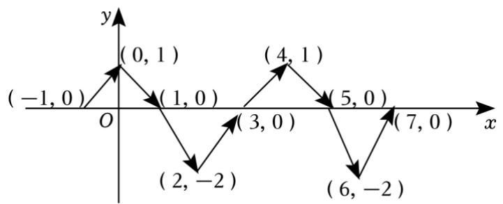

A．（2023，0） 

B．（2022，﹣2） 

C．（2023，1） 

D．（2022，0） 

【解答】解：由题意可知，第 1次运动到点（0，1）、第 2次运动到点（1，0）、第 3次运动到点（2， 2）、第4次运动到点（3，0）、第5次运动到点（4，1）， 

∴可得到，第n次运动到点的横坐标为 n﹣1，纵坐标为 4次一循环，循环规律为 $1 {  } 0 {  } - 2 {  } 0 {  } 1$ ， $\because 2 0 2 3 \div 4 = 5 0 5 \ldots 3$ ， 

∴动点P第 2023次运动到点的坐标为（2022，﹣2）， 

故选：B． 

9．如图，在一个单位为 1的方格纸上，△A1A2A3，△A3A4A5，△A5A6A7，…，是斜边在 x 轴上，斜边长分 别为 2，4，6，…的等腰直角三角形．若 $\triangle A _ { 1 } A _ { 2 } A _ { 3 }$ 的顶点坐标分别为 A1（2，0），A2（1，﹣1），A3（0， 0），则依图中所示规律，A2023的横坐标为（ 

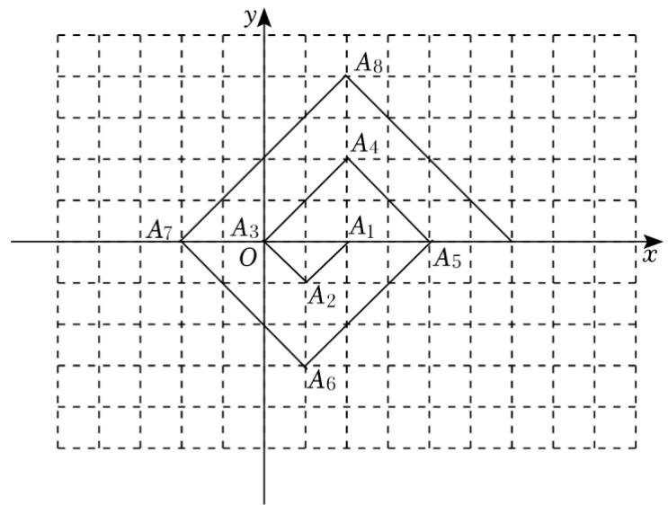

A．﹣1010 

B．1010 

C．1012 

D．﹣1012 

【解答】解：∵图中的各三角形都是等腰直角三角形，斜边长分别为2，4，6，… 

∴A1（2，0），A2（1，﹣1），A3（0，0），A4（2，2），A5（4，0），A6（1，﹣3），A7（﹣2，0），A8（2， 4），A9（6，0），A10（1，﹣5），A11（﹣4，0），A12（2，6），..． 

总结得出规律： $A 4 n + 1 ~ ( 2 n + 2 , ~ 0 ) , ~ A 4 n + 2 ~ ( 1 , ~ - 2 n - 1 ) , ~ A 4 n + 3 ~ ( - 2 n , ~ 0 ) , ~ A 4 n + 4 ~ ( 2 , ~ 2 n + 2 )$ ， 

$\because 2 0 2 3 = 4 \times 5 0 5 + 3$ ， 

∴点A2023在x轴负半轴上，横坐标为 $- ~ 2 \times 5 0 5 = - ~ 1 0 1 0$ 

故选：A． 

10．如图，在平面直角坐标系中 A（﹣1，1），B（﹣1，﹣2），C（3，﹣2），D（3，1），一只瓢虫从点 A 出发以2个单位长度/秒的速度沿 A→B→C→D→A循环爬行，问第 2025秒瓢虫在点（ ） 

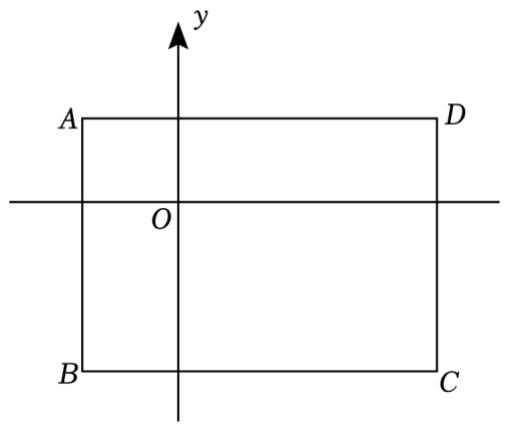

A．（﹣1，0） 

B．（﹣1，﹣1） 

C．（﹣1，﹣2） 

D．（0，﹣2） 

【解答】解： $\therefore A B + B C + C D + D A = 3 + 4 + 3 + 4 = 1 4 ,$ ， 

$$
1 4 \div 2 = 7,
$$

∴瓢虫7秒爬行一圈， 

$$
\because 2 0 2 5 \div 7 = 2 8 9 \dots \dots 2,
$$

$$
2 \times 2 = 4,
$$

$$
4 - 3 = 1,
$$

∴第 2025秒瓢虫在点（0，﹣2）， 

故选：D 

11．如图，动点 P 在平面直角坐标系中按图中所示方向运动，第一次从原点 O 运动到点 $P _ { 1 } ~ ( 1 , ~ 1 )$ ），第二 次运动到点P2（2，1），第三次运动到点 $P _ { 3 } ~ ( 3 , ~ 0 )$ ），第四次运动到点 $P _ { 4 } ~ ( 4 , ~ - 2 )$ ），第五次运动到点 $P _ { 5 }$ （5，0），第六次运动到点 $P 6 \ ( 6 , \ 2 )$ ），按这样的运动规律，点P2023的纵坐标是（ ） 

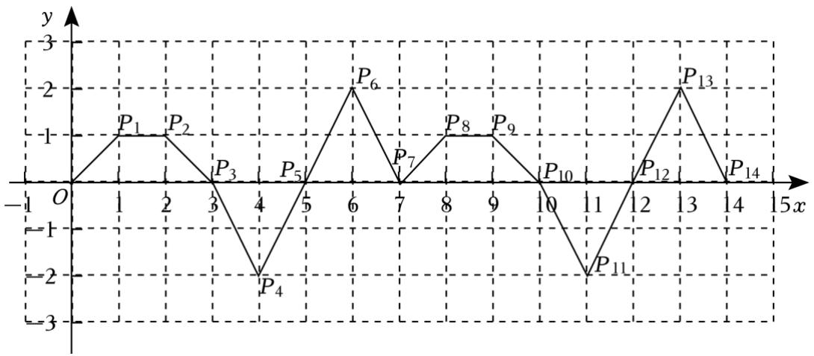

A．﹣2 

B．0 

C．1 

D．2 

【解答】解：观察图象，结合动点P 第一次从原点O 运动到点 $P _ { 1 }$ （1，1），第二次运动到点 $P _ { 2 } \ ( 2 , \ 1 )$ ）， 第三次运动到点 $P _ { 3 } ~ ( 3 , ~ 0 )$ ），第四次运动到点 $P _ { 4 } ~ ( 4 , ~ - ~ 2 )$ ），第五次运动到点 $P 5 \ ( 5 , \ 0 )$ ），第六次运动到 点 $P 6 \ ( 6 , \ 2 )$ ），运动后的点的坐标特点可以发现规律，横坐标与次数相等，纵坐标每 6 次运动组成一个 循环：P1（1，1），P2（2，1），P3（3，0），P4（4，﹣2），P5（5，0），P6（6，2），P7（7，0），P8（8， 1）…， 

$$
\because 2 0 2 3 = 7 \times 2 8 9,
$$

∴动点 $P _ { 2 0 2 3 }$ 的坐标是（2023，0）， 

∴动点 $P _ { 2 0 2 3 }$ 的纵坐标是0， 

故选：B． 

12．如图，在平面直角坐标系中，已知点 A（1，1）、B（﹣1，1）、C（﹣1，﹣2）、D（1，﹣2），动点 P 从点A 出发，以每秒2个单位的速度按逆时针方向沿四边形ABCD 的边做环绕运动；另一动点Q 从点C 出发，以每秒3个单位的速度按顺时针方向沿四边形 CBAD的边做环绕运动，则第2023次相遇点的坐标 是（ ） 

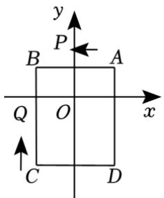

A．（﹣1，﹣1） 

B．（﹣1，1） 

C．（﹣2，2） 

D．（1，1） 

【解答】解：∵点 A（1，1）、B（﹣1，1）、C（﹣1，﹣2）、D（1，﹣2）， 

$$
\therefore A B = C D = 1 - (- 1) = 2, A D = B C = 1 - (- 2) = 3,
$$

∴矩形的周长为2×（2+3）＝10， 

由题意，经过 1 秒时，P、Q 在点 B（﹣1，1）处相遇，接下来 P、Q 两点走的路程和是 10 的倍数时， 两点相遇，相邻两次相遇间隔时间为10÷（2+3）＝2 秒， 

∴第二次相遇点是CD 的中点（0，﹣2）， 

第三次相遇点是点A（1，1）， 

第四次相遇点是点（﹣1，﹣1）， 

第五次相遇点是点（1，﹣1）， 

第六次相遇点是点B（﹣1，1）， 

由此发现，每五次相遇点重合一次， 

$$
\because 2 0 2 3 \div 5 = 4 0 4 \dots 3,
$$

∴第 2023次相遇点的坐标与第三次相遇点的坐标重合，即 A（1，1）， 

故选：D． 

13．如图，在直角坐标系中，一个智能机器人接到的指令是：从原点 O 出发，按“向上→向右→向下→向 右”的方向依次不断移动，每次移动1个单位长度，其移动路线如图所示，第1 次移动到点 A1，第 2次 移动到点A2，…第n次移动到点 $A _ { n } ,$ ，则点A2023的坐标是（ 

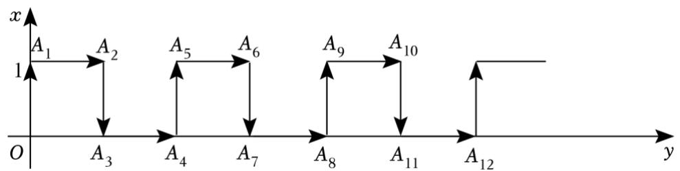

A．（1011，0） 

B．（1012，1） 

C．（1012，0） 

D．（1011，1） 

【解答】解：A1（0，1），A2（1，1），A3（1，0），A4（2，0），A5（2，1），A6（3，1），…… 

$$
\because 2 0 2 3 \div 4 = 5 0 5 \dots \dots 3,
$$

∴点 A2023 的坐标为（505×2+1，0）， 

∴A2023（1011，0）， 

故选：A． 

14．如图，将边长为1的正方形依次放在坐标系中，其中第一个正方形的两边 $O A _ { 1 } , ~ O A _ { 3 }$ 分别在y轴和 x轴 上，第二个正方形的一边 $A _ { 3 } A _ { 4 }$ 与第一个正方形的边 A2A3 共线，一边 A3A6 在 x 轴上…以此类推，则点 A2022 的坐标为（ ） 

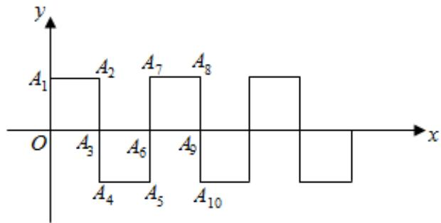

A．（672，﹣1） 

B．（673，﹣1） 

C．（674，1） 

D．（674，0） 

【解答】解：∵（2022﹣1）÷3＝673…2， 

∴点 A2022的坐标为（674，0） 

故选：D 

15．如图，一个机器人从 O 点出发，向正东方向走 3 米到达 $A _ { 1 }$ 点，再向正北方向走 6 米到达 A2点，再向 正西方向走9米到达A 点，再向正南方向走 12米到达 $A _ { 4 }$ 点，再向正东方向走15 米到达 $A 5$ 点，按如此 规律走下去，当机器人走到 A6点时，则 $\boldsymbol { A } 6$ 的坐标为（ 

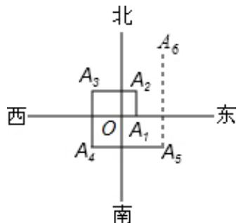

A．（9，15） 

B．（6，15） 

C．（9，9） 

D．（9，12） 

【解答】解：由题意可知： $O A 1 = 3$ ； $A _ { 1 } A _ { 2 } { = } 3 { \times } 2$ ； $A 2 A 3 = 3 \times 3$ ；可得规律： $A _ { n - 1 } A _ { n } { = } 3 n$ ， 

当机器人走到 $A _ { 6 }$ 点时， $A 5 A _ { 6 } = 1 8$ 米，点 $A _ { 6 }$ 的坐标是（9，12） 

故选：D． 

16．如图，将边长为 1 的正三角形 $O A P$ 沿 x 轴正方向连续翻转 2023 次，点 P 依次落在点 $P 1 , \ P 2 , \ P 3 , \ \cdots$ ， $P _ { 2 0 2 3 }$ 的位置，则点 $P _ { 2 0 2 3 }$ 的横坐标为（ ） 

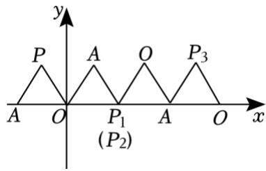

A．2022 

B．2023 

C．2024 

D．2022.5 

【解答】解：观察图形结合翻转的方法可以得出 $P _ { 1 }$ 、 $P _ { 2 }$ 的横坐标是 1， $P _ { 3 }$ 的横坐标是 2.5， $P _ { 4 }$ 、 $P 5$ 的横 坐标是4， $P _ { 6 }$ 的横坐标是5.5…依此类推下去， 

$\therefore P 3 n + 1$ 的横坐标为 $3 n +$ 1， $P 3 n { + } 2$ 的横坐标为： $3 n { + } 1$ ， $P 3 n { + } 3$ 的横坐标为 $3 n + \frac { 5 } { 2 } ( n$ 为自然数）， 

$$
\because 2 0 2 3 = 6 7 4 \times 3 + 1,
$$

$\therefore$ 点 P2023 的横坐标为 2023 

故选：B． 

## 二．填空题（共 4小题）

17．如图，点A（1，0）第一次跳动至点 $A _ { 1 } ~ ( ~ - ~ 1 , ~ 1 )$ ，第二次跳动至点A2（2，1），第三次跳动至点 A3（﹣ 2，2），第四次跳动至点A（4 3，2），…，依此规律跳动下去，点A第2024次跳动至点A2024的坐标是 （1013， 1012） 

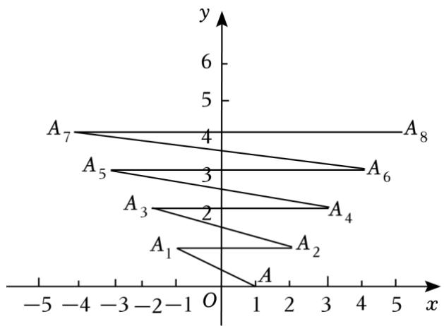

【解答】解：由题知， 

因为点A的坐标为（1，0）， 

根据点A的运动方式可知， 

点 $A 1$ 的坐标为（﹣1，1）； 

点 $A _ { 2 }$ 的坐标为（2，1）； 

点 $A _ { 3 }$ 的坐标为（﹣2，2）； 

点 $A 4$ 的坐标为（3，2）； 

点 $A 5$ 的坐标为（﹣3，3）； 

点 $A _ { 6 }$ 的坐标为（4，3）； 

由此可见，点 $A _ { n }$ 的坐标为 $( { \frac { \mathtt { n } } { 2 } } + 1 , \ { \frac { \mathtt { n } } { 2 } } )$ +1， （n 为正偶数）， 

当 $n { = } 2 0 2 4$ 时， 

$$
\frac {n}{2} + 1 = 1 0 1 3,
$$

$$
\frac {\mathrm{n}}{2} = 1 0 1 2,
$$

即点 $A 2 0 2 4$ 的坐标为（1013，1012） 

故答案为：（1013，1012） 

18．如图，在平面直角坐标系中，一动点从原点 O 出发，沿着箭头所示方向，每次移动 1 个单位，依次得 到点 $P _ { 1 } ( 0 , \ 1 ) , \ P _ { 2 } ( 1 , \ 1 ) , \ P _ { 3 } ( 1 , \ 0 ) , \ P _ { 4 } ( 1 , \ - 1 ) , \ P _ { 5 } ( 2 , \ - 1 ) , \ P _ { 6 } ( 2 , \ 0 ) , \ \cdots$ ，则点 $P _ { 2 0 2 4 }$ 的 坐标是 （675，1） 

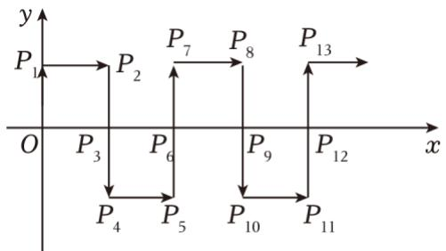

【解答】解：由图可得， $P _ { 6 }$ （2，0）， $P _ { 1 2 }$ （4，0），…，P6n（2n，0）， $P _ { 6 n + 1 }$ （2n，1）， 

$$
2 0 2 4 \div 6 = 3 3 7 \dots 2,
$$

$$
\therefore P _ {6 \times 3 3 7 + 2} (2 \times 3 3 7 + 1, 1),
$$

即 $P _ { 2 0 2 4 }$ （675，1）， 

故答案为：（675，1） 

19．如图，在平面直角坐标系中，有若干个横、纵坐标均为整数的点，按（1，0）→（2，0）→（2，1） $\to \ ( 1 , \ 1 ) \to \ ( 1 , \ 2 ) \to \ ( 2 , \ 2 ) \to \cdots$ 的顺序用线段依次连接起来．根据这个规律，第50个点的坐标为 （8，0） 

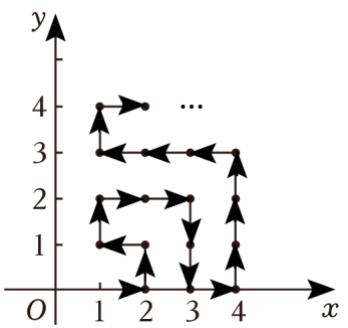

【解答】解：第1圈有1个点：（1，0）， 

第2圈有3个点：（1，0），（2，1），（1，1），前2圈共有 1+3＝4个点， 

第3圈有5个点：（2，1），（2，2），（3，2），（3，1），（3，0），前3圈共有 $1 + 3 + 5 = 9 = 3 ^ { 2 }$ 个点， 

第 4 圈有 7 个点：（4，0），（4，1），（4，2），（4，3），（3，3），（2，3），（1，3），前 4 圈共有 1+3+5+7 $= 1 6 { = } 4 ^ { 2 }$ 个点， 

前圈共有 $n ^ { 2 }$ 个点， 

$$
\because 5 0 = 7 ^ {2} + 1,
$$

∴第 50个点再第8圈，是第一个点，其坐标为（8，0）， 

故答案为：（8，0） 

20．在平面直角坐标系中，若干个等腰直角三角形按如图所示的规律摆放．点 P 从原点 O 出发，沿着 $^ { 6 6 } O$ $ A _ { 1 } {  } A _ { 2 } {  } A _ { 3 } {  } A _ { 4 } {  } \ ^ { , }$ 的路线运动（每秒一条直角边），已知 $A _ { 1 }$ 坐标为（1，1），A2（2，0），A3（3，1） $A 4 \ ( 4 , \ 0 ) \ \cdots$ ，设第 n 秒运动到点 $P _ { n } ~ ( n$ 为正整数），则点 P2023 的坐标是 （2023，1） 

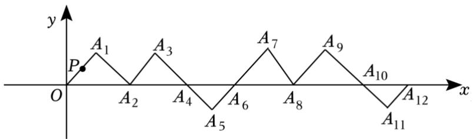

【解答】解：由题意知， 

A1（1，1）， 

A2（2，0）， 

A3（3，1）， 

A4（4，0）， 

A5（5，﹣1）， 

A6（6，0）， 

A7（7，1）， 

由上可知，每个点的横坐标等于序号，纵坐标每6个点依次为：1，0，1，0，﹣1，0这样循环， 

∵点 P 从原点 O 出发，第 n 秒运动到点 $P _ { 2 0 2 3 }$ ，即点 A2023， 

∴P2023（2023，1）， 

故答案为：（2023，1） 