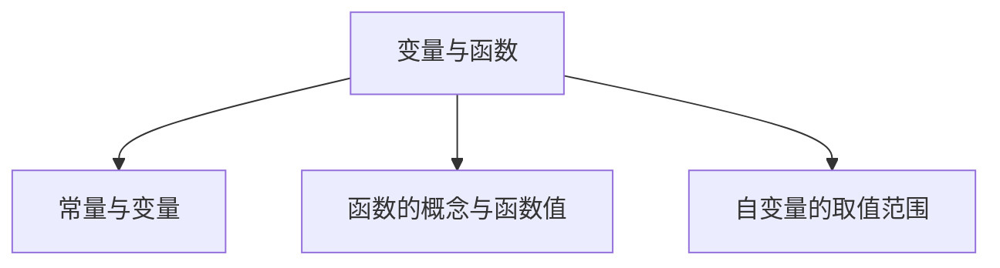
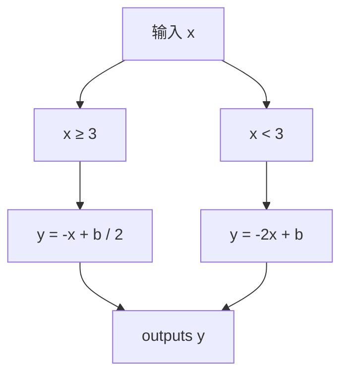
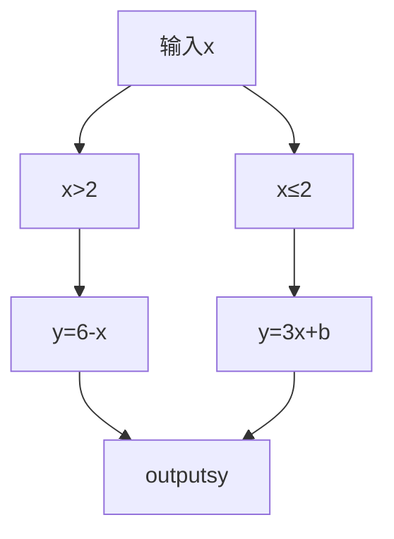
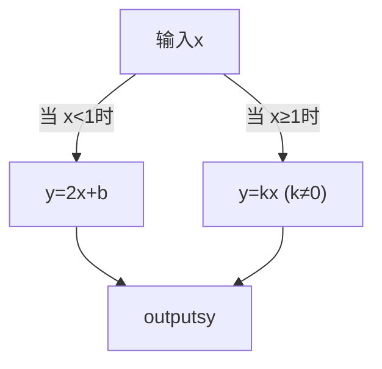

## 第 01讲 变量与函数

## 01

## 学习目标

<table><tr><td>课程标准</td><td>学习目标</td></tr><tr><td>1常量与变量2函数的概念与函数值3自变量的取值范围</td><td>1. 掌握常量与变量的概念,能够准确的判断常量与变量。2. 掌握函数的概念,能够判断函数关系以及根据自变量求函数值。3. 能够根据不同的函数表达式类型熟练的求出自变量的取值范围。</td></tr></table>

## 02

## 思维导图

flowchart

##

##

## 知识点01 常量与变量

1. 变量：

在一个变化过程中，数值 发生变化 的量称为变量。

2. 常量：

在一个变化过程中，数值 始终不变 的量称为常量。

变量与常量一定存在于一个变化过程中，有时可以相互转化。

## 【即学即练1】

1．阅读并完成下面一段叙述：

（1）某人持续以 a 米/分的速度经 t 分时间跑了 s 米，其中常量是 a ，变量是 t，S

（2）在 t 分内，不同的人以不同的速度 a 米/分跑了 s 米，其中常量是 t ，变量是 a，S  
（3）s 米的路程不同的人以不同的速度 a 米/分各需跑的时间为 t 分，其中常量是 s ，变量是 a，t  
（4）根据以上三句叙述，写出一句关于常量与变量的结论： 常量和变量在一个过程中相对地存在的

【解答】解：（1）由题意得，数值不变的量为 a，为常量，

数值发生变化的量为 t，s，为变量；

（2）由题意得，数值不变的量为 t，为常量，

数值发生变化的量为 a，s，为变量；

（3）由题意得，数值不变的量为 s，为常量，

数值发生变化的量为 a，t，为变量；

（4）根据以上三句叙述，写出一句关于常量与变量的结论：常量和变量在一个过程中相对地存在的故答案为：a；t，s；t；a，s；s；a，t；常量和变量在一个过程中相对地存在的

## 知识点02 函数的概念与函数值

1. 函数的概念：

一般地，在一个变化过程中，如果有两个变量 x和 y ，并且对于x的每一个确定的值， y 都有 唯一确定 的值与之对应，那么我们就说 x 是 自变量 ， y 是x的 函数 ，又称因变量。

说明：对于函数概念的理解：①有两个变量；②一个变量的数值随着另一个变量的数值的变化而发生变化；③对于自变量的每一个确定的值，函数值有且只有一个值与之对应，即单对应。

2. 函数值：

在一个函数中，若存在x  a时 $y = b$ ，则b就是自变量为a时的 函数值

## 【即学即练1】

2．关于变量 x，y 有如下关系：①x﹣y＝5；②y 2＝2x；③y＝|x|；④y＝ ． $\textcircled { 4 } y = \frac { 3 } { \tt x }$ 其中 y 是 x 函数的是（ ）

A．①②③

B．①②③④

C．①③

D．①③④

【解答】解：y 是 x 函数的是 $\textcircled { 1 } x - y = 5 ; \textcircled { 3 } y = | x | ; \textcircled { 4 } y = \frac { 3 } { x }$

当 x＝1 时，在 $y ^ { 2 } { = } 2 x$ 中 $y = \pm { \sqrt { 2 } }$ ，则不是函数；

故选：D

## 【即学即练2】

3．当 x＝﹣2 时，函数 $y = \sqrt { 4 x + 9 }$ 的函数值为 1

【解答】解：当 x＝﹣2 时，

$$
y = \sqrt {4 x + 9} = \sqrt {4 \times (- 2) + 9} = \sqrt {1} = 1
$$

故答案为：1

## 知识点03 自变量的取值范围

1. 自变量的取值范围：

在函数表达式中，自变量的取值必须使相应的函数表达式有意义。

2. 常见的几种函数解析式中自变量的取值范围：

①整式型函数表达式：自变量取值范围为 一切实数  
②分式型函数表达式：自变量取值范围为 分母不为 0 的一切实数 。  
③根式型函数表达式：自变量取值范围为 被开方数大于等于 0 的一切实数  
④零次幂与负整数指数幂函数表达式：自变量取值范围为 底数不为 0 的一切实数

3. 在实际问题中与几何图形中的自变量取值：

在实际问题与几何图形中，既要满足函数表达式有意义，也要满足实际问题的实际意义，还要满足几何图形的几何意义。

## 【即学即练1】

4．函数 $y = \frac { \sqrt { x + 5 } } { x + 2 }$ 的自变量 x的取值范围是 $x \geq - 5$ 且 $x \neq - 2$

【解答】解：依题意， $x + 5 \geqslant 0 , x + 2 \neq 0$ ，

解得： $x \geqslant - 5$ 且 $x \neq - 2$ ，

故答案为： $x \geqslant - 5$ 且 $x \neq - 2$

## 【即学即练2】

5．在函数 $y = \frac { 1 } { \sqrt { x + 3 } } + ( x - 3 ) ^ { 0 } \ +$ ，自变量 x 的取值范围是（ ）

A． $x \geqslant - 3$

B． $x > - 3$

C． $x \neq 3$

D． $x > - 3$ 且 $x \neq 3$

【解答】解：由题意得： $x { + } 3 > 0$ 且 $x - 3 \neq 0$ ，

解得： $x > - 3$ 且 $x \neq 3$ ，

故选：D

text_image

题型精讲

## 题型 01 判断变量与常量

【典例 1】小亮爸爸到加油站加油，如图是所用的加油机上的数据显示牌，金额随着数量的变化而变化．则下列判断正确的是（ ）

<table><tr><td>240.56</td><td>金额/元</td></tr><tr><td>31</td><td>数量/升</td></tr><tr><td>7.76</td><td>单价/(元/升))</td></tr></table>

A．金额是自变量

B．单价是自变量

C．7.76 和 31 是常量

D．金额是数量的函数

【解答】解：单价是常量，金额和数量是变量，金额是数量的函数，故选项 D 符合题意

故选：D．

【变式 1】一个圆形花坛，周长 C 与半径 r的函数关系式为 $C { = } 2 \pi r$ ，其中关于常量和变量的表述正确的是（ ）

A．常量是 2，变量是 C，π，r  
B．常量是 2，变量是 r，  
C．常量是 2，变量是 C，π  
D．常量是 2π，变量是 C，r

【解答】解：根据题意得：函数关系式 $C { = } 2 \pi r$ 中常量是 2π，变量是 C、r

故选：D．

【变式 2】已知一个长方形的面积为 $1 5 c m ^ { 2 }$ ，它的长为 a cm，宽为 b cm，下列说法正确的是（ ）

A．常量为 15，变量为 a，b  
C．常量为 15，b，变量为 a

B．常量为 15，a，变量为 b

D．常量为 a，b，变量为 15

【解答】解：∵长方形的面积始终不变为常量；

长和宽的数值发生变化为变量，

故选：A．

【变式 3】球的体积是 M，球的半径为 R，则 $M { = } \frac { 4 } { 3 } \pi R ^ { 3 }$ ，其中变量和常量分别是（ ）

A．变量是 M，R；常量是 $\frac { 4 } { 3 } \pi$  
B．变量是 R，π；常量是 $\frac { 4 } { 3 }$  
C．变量是 M， ；常量是 3，4  
D．变量是 R；常量是 M

【解答】解：球的体积是 M，球的半径为 R，则 $M { = } \frac { 4 } { 3 } \pi R ^ { 3 }$ ，

其中变量是 M，R；常量是 $\frac { 4 } { 3 } \pi$ ，

故选：A．

## 题型 02 判断函数关系

【典例 1】下列变量间的关系不是函数关系的是（ ）

A．长方形的宽一定，其长与面积  
B．正方形的周长与面积  
C．圆柱的底面半径与体积  
D．圆的周长与半径

【解答】解：A、长方形的宽一定，其长与面积成正比，所以其长与面积是函数关系，所以 A 选项不正确；

B、正方形的面积与它的周长为二次函数关系，所以 B 选项不正确； B、正方形的面积与它的周长为二次函数关系，所以B选项不正确;

C、圆柱的底面半径与体积不是函数关系，所以 C 选项正确； C、圆柱的底面半径与体积不是函数关系，所以C选项正确;

D、圆的周长与半径成正比，所以它们为函数关系，所以D选项不正确; D、圆的周长与半径成正比，所以它们为函数关系，所以 D 选项不正确；

故选：C

【变式 1】下列所述不属于函数关系的是（

A．长方形的面积一定，它的长和宽的关系  
B．x+2 与 x 的关系  
C．匀速运动的火车，时间与路程的关系  
D．某人的身高和体重的关系

【解答】解： $A , \because S { = } a b$ ，∴矩形的长和宽成反比例，故本选项正确，不符合题意；

B、∵x+2 中随 x 的变化而变化是函数，故本选项正确，不符合题意； B、·x+2中随x的变化而变化是函数，故本选项正确，不符合题意;

C、∵S＝vt，速度固定时，路程和时间是正比例关系，故本选项正确，不符合题意； C、∵S=νt，速度固定时，路程和时间是正比例关系，故本选项正确，不符合题意;

D、·身高和体重不是函数，故本选项错误，符合题意; D、∵身高和体重不是函数，故本选项错误，符合题意；

故选：D．

【变式 2】下列关于变量 x 和 y 的关系式：

$$
x - y = 0, \quad y ^ {2} = x, \quad | y | = 2 x, \quad y ^ {2} = x ^ {2}, \quad y = 3 - x, \quad y = 2 x ^ {2} - 1, \quad y = \frac {3}{\mathbf {x}},
$$

其中 y 是 x 的函数的个数为（

A．3

B．4

C．5

D．6

【解答】解：y 是 x 的函数的有： $x \cdot y = 0 , \ y = 3 \cdot x , \ y = 2 x ^ { 2 } - 1 , \ y = { \frac { 3 } { \mathbf { x } } }$ 共 4 个，

故选：B．

【变式 3】下列等式中 $y = \mid x \mid , | y | = x , 5 x ^ { 2 } - y = 0 , x ^ { 2 } - y ^ { 2 } = 0$ ，其中表示 y 是 x 的函数的有（ ）

A．0 个

B．1 个

C．2 个

D．4 个

【解答】解：由函数的定义判断： $y = | x | , \ 5 x ^ { 2 } - y = 0$ 表示 y 是 x 的函数； $\scriptstyle | y | = x , x ^ { 2 } - y ^ { 2 } = 0$ 不表示 y 是 x的函数，

∴表示 y是 x的函数的有 2个

故选：C

## 题型 03 求自变量的取值范围

【典例1】在函数 $y = \frac { x - 2 } { 2 x + 1 }$ 中，自变量 x 的取值范围是 $x \neq - \frac { 1 } { 2 }$

【解答】解：由题意可得，

$$
2 x + 1 \neq 0,
$$

解得 $x \neq - { \frac { 1 } { 2 } }$ ，

故答案为： $x \neq - \frac { 1 } { 2 }$

【变式1】使函数 $y = \sqrt { x + 3 }$ 有意义的 x的取值范围是 $x \geq - 3$

【解答】解：由题意得 $x + 3 \geqslant 0$ ，

解得 $x \geqslant - 3$

故答案为： $x \geqslant - 3$

【变式2】函数 $y = \frac { x } { \sqrt { x - 5 } }$ 的定义域为 $\underline { { x } } > 5$

【解答】解：根据题意得 $x - 5 > 0$ ，

解得 $x { > } 5 .$

故答案为： $x { > } 5$

【变式3】函数 $y = 2 x + \frac { x } { x + 1 }$ 中自变量 x 的取值范围是 $\_ x \neq - 1$

【解答】解：由题意得： $x { + } 1 { \neq } 0$ ，

解得： $x \neq - 1$ ，

故答案为： $x \neq - 1$

【变式4】函数 $y = \sqrt { 2 x + 4 } - \frac { 3 } { x - 1 }$ 的自变量 x 的取值范围是 $x \geq - 2$ 且 $\underline { { x } } \neq 1$

【解答】解：由题意可得： $2 x + 4 \geq 0$ 且 $x - 1 \neq 0$ ，

解得 $x \geqslant - 2$ 且 $x \neq 1$

∴自变量 x 的取值范围是 $x \geqslant - 2$ 且 $x \neq 1$

故答案为： $x \geqslant - 2$ 且 $x \neq 1$

## 题型04 求函数值

【典例 1】在关系式 $y = \frac { 1 } { 3 } x + 2 4$ 中，当因变量 y＝﹣2 时，自变量 x的值为（ ）

A． $\frac { 8 } { 3 }$

B．﹣4

C．﹣12

D．12

【解答】解：当 y＝﹣2 时， $- 2 = - \frac { 1 } { 3 } x + 2$ ，

解得 x＝12，

故选：D．

【变式 1】已知函数 $f \left( x \right) = 2 x - 3$ ，那么 f（1）＝ ﹣1

【解答】解：当 x＝1 时， $f \left( 1 \right) = 2 \times 1 - 3 = - 1$ ，

故答案为：﹣

【变式 2】已知函数 $\frac { x } { 5 } ( x ) = \frac { \frac { x + 4 } { 2 x - 1 } } { 2 x - 1 }$ 2x-1 ，那么 $f \left( 2 \right) = \_ 2$

【解答】解： $\because f ( x ) = \frac { x + 4 } { 2 x - 1 }$

$$
\therefore f (2) = \frac {2 + 4}{4 - 1} = 2.
$$

故答案为：2

$f ( x ) = \frac { 2 } { 2 - x }$ ，那么 $f ( { \sqrt { 3 } } ) = 4 \substack { + 2 { \sqrt { 3 } } } \_$ ．

【解答】解：当 $\scriptstyle x = { \sqrt { 3 } }$ 时，

$$
\begin{array}{l} f (\sqrt {3}) = \frac {2}{2 - \sqrt {3}} \\ = \frac {2 (2 + \sqrt {3})}{(2 - \sqrt {3}) (2 + \sqrt {3})} \\ = 4 + 2 \sqrt {3}. \\ \end{array}
$$

故答案为： $4 { + } 2 { \sqrt { 3 } }$

【变式 4】根据如图所示的程序计算函数 y 的值，若输入 x 的值是 8，则outputs y 的值是﹣3，若输入 x 的值是﹣8，则outputs y 的值是（ ）

flowchart

A．10

B．14

C．18

D．22

【解答】解：当 x＝8 时， $\frac { - 8 + b } { 2 } = - 3$

$$
\therefore b = 2,
$$

∴当 x＝﹣8 时， $y = - \ 2 \times \mathrm { ~ ( ~ - ~ 8 ~ ) ~ } + 2 = 1 6 + 2 = 1 8$ ，

故选：C

text_image

强化训练

1．在圆锥体积公式 ${ \mathbb { V } } { = } \frac { 1 } { 3 } \pi { \mathrm { \Delta r } } ^ { 2 } { \mathrm { h } } ^ { \# }$

A．常量是 ，变量是 V，h $\frac 1 3$  
B．常量是 $\frac 1 3$ ，变量是 h，r  
C．常量是 $\frac 1 3$ ，变量是 V，h，r  
D．常量是 $\frac 1 3$ ， 变量是 V，h，π，r

【解答】解：由圆锥体积公式 ${ \mathbb { V } } { = } \frac { 1 } { 3 } \pi \operatorname { r } ^ { 2 } \mathrm { h } ^ { \prime }$

可知：常量是 $\frac 1 3$ ，变量是 V，h，r．

故选：C

2．下列关系式中，y 不是 x的函数的是（ ）

A． $y = x + 1$

B．y＝x﹣1 $\scriptstyle { y = } { x ^ { \mathrm { ~ \tiny ~ - ~ 1 ~ } } }$

C． $y = - ~ 2 x$

D． $\vert y \vert { = } x$

【解答】解： $A \scriptstyle , \ y = x + 1$ ，y 是 x 的函数，故 A 不符合题意；

B、 $\scriptstyle { y = x ^ { \mathrm { ~ \tiny ~ I ~ } } }$ ，y 是 x 的函数，故 B 不符合题意；  
C、 $y = - ~ 2 x , ~ y$ 是 x 的函数，故 C 不符合题意；  
D、|y|＝x，当 x＝2 时， $y = \pm 2$ ，即对于 x 的每一个确定的值，y 不是有唯一的值与其对应，

$\therefore y$ 不是 x 的函数，故 D 符合题意

故选：D．

3．下列表达式中，与表格表示同一函数的是（ ）

<table><tr><td>x</td><td>...</td><td>-2</td><td>-1</td><td>0</td><td>1</td><td>2</td><td>...</td></tr><tr><td>y</td><td>...</td><td>5</td><td>3</td><td>1</td><td>-1</td><td>-3</td><td>...</td></tr></table>

A． $y = - ~ 2 x + 1$

B． $y = x - 1$

C．y＝2x﹣1

D． $y = 2 x + 1$

【解答】解：设表格表示的函数为 $y = k x + b$ ，

将（0，1），（1，﹣1）代入 $y = k x + b$ 得 $\left\{ \begin{array} { l } { 1 = 0 } \\ { - 1 = k + b } \end{array} \right.$

解得 $\left\{ \begin{array} { l l } { \mathbf { k } = - 2 } \\ { \mathbf { b } = 1 } \end{array} \right.$ ，

∴表格表示的函数解析式为 $y = - ~ 2 x + 1$ ，

故选：A

4．油箱中存油 40 升，油从油箱中均匀流出，流速为 0.2升/分钟，则油箱中剩余油量 Q（升）与流出时间 t（分钟）的函数关系是（

A． $Q { = } 0 . 2 t$

B． $Q { = } 4 0 \mathrm { ~ - ~ } 0 . 2 t$

C．Q＝0.2t+40

D． $Q = 0 . 2 t - 4 0$

【解答】解：由题意得：流出油量是 0.2t，

则剩余油量： $Q { = } 4 0 \mathrm { ~ - ~ } 0 . 2 t$ ，

故选：B．

5．如图，有一个球形容器，小海在往容器里注水的过程中发现，水面的高度 h、水面的面积 S 及注水量 V是三个变量．下列有四种说法：

①S 是 V 的函数；②V 是 S 的函数；③h 是 S 的函数，④S 是 h 的函数．

其中所有正确结论的序号是（

natural_image

Simple line drawing of a laboratory flask with a curved tube and a base, showing liquid level marked as h (no text or symbols)

A．①③

B．①④

C．②③

D．②④

【解答】解：由题意可知，对于注水量 V 的每一个数值，水面面积 S 都有唯一值与之对应，即 S是 V 的函数，故①正确；

对于水面面积 S 的每一个数值，注水量 V 的值不唯一，即 V 不是 S的函数，故②错误；

对于水面面积 S 的每一个数值，水面的高度 h不唯一，即 h不是 S 的函数，故③错误；

对于水面的高度 h的每一个数值，水面面积 S有唯一值与之对应，即 S 是 h 的函数，故④正确

故正确的结论有①④

故选：B．

6．某市的出租车收费标准如下：3 千米以内（包括 3 千米）收费 8元，超过 3 千米后，每超 1 千米就加收2 元．若某人乘出租车行驶的距离为 $x \left( x { > } 3 \right)$ ）千米，则需付费用 y 元与 x（千米）之间的关系式是（ ）

A． $y = 8 + 2 x$

B． $y = 2 + 2 x$

C $y = 2 x - 8$

D． $y = 2 x - 3$

【解答】解： $y = 8 + 2 ( x - 3 )$

$$
\begin{array}{l} = 8 + 2 x - 6 \\ = 2 + 2 x, \\ \end{array}
$$

故选：B．

7．函数 $y = \frac { 1 } { x - 9 } + \sqrt { x - 2 }$ 中，自变量 x 的取值范围是（ ）

A． $x \geqslant 2$

B． $x \geqslant 2$ 且 $x \neq 9$

C． $x \neq 9$

D． $2 { \leqslant } x { < } 9$

【解答】解： $\left\{ { \bf x } - 9 \neq 0 \right. ,$

解得 $x \geqslant 2$ 且 $x \neq 9$

故选：B．

8．变量 y与 x之间的关系是 $y = - ~ 2 x + 3$ ，当自变量 x＝6 时，因变量 y的值是（ ）

A．﹣6

B．﹣9

C．﹣12

D．﹣15

【解答】解：当 $x = 6$ 时，

$$
y = - 2 \times 6 + 3 = - 9.
$$

故选：B．

9．用如图所示的程序框图来计算函数 y 的值，当输入 x为﹣1 和 7 时，outputs y 的值相等，则 b 的值是（ ）

flowchart

A．﹣4

B．﹣2

C．4

D．2

【解答】解：根据题意，当 $x = - ~ 1$ 时， $y = 3 x + b = 3 \times ( - 1 ) + b = - 3 + b ;$

当 $x { = } 7$ 时， $y = 6 - x = 6 - 7 = - ~ 1$

$$
\because - 3 + b = - 1,
$$

$$
\therefore b = 2.
$$

故选：D．

10．火车匀速通过隧道时，火车在隧道内的长度 y（米）与火车行驶时间 x（秒）之间的关系用图象描述如图所示，有下列结论：

①火车的长度为 150米；  
②火车的速度为 30 米/秒；  
③火车整体都在隧道内的时间为 25秒；  
④隧道长度为 750米

其中正确的结论是（ ）

line chart

| Point | x (秒) | y (米) |
|-------|--------|--------|
| A     | 0      | 150    |
| B     | 30     | 150    |
| C     | 35     | 35     |

A．①②③

B．②③④

C．①②③④

D．②④

【解答】解：在 BC 段，所用的时间是 5 秒，路程是 150 米，则速度是 30 米/秒．故②正确；

text_image

y/米
150
A	B
O	30	35
x/秒

火车的长度是 150米，故①正确；

整个火车都在隧道内的时间是：35﹣5﹣5＝25秒，故③正确；

隧道长是：30×35﹣150＝900米，故④错误

故正确的是：①②③

故选：A．

11．下列各式①y＝0.5x﹣2；②y＝|2x|；③3y+5＝x；④y 2＝2x+8 中，y 是 x 的函数的有 ①②③ （只填序号）

【解答】解： $\textcircled { 1 } y = 0 . 5 x - 2 ;$ ；②y＝|2x|；③3y+5＝x，y 是 x 的函数，

故答案为：①②③

12．若函数 $\frac { \sqrt { x + 3 } } { x - 3 }$ 在实数范围内有意义，则自变量的取值范围是 x≥﹣3且 x≠3

【解答】解：由题意得： $x + 3 \geqslant 0$ 且 $x - 3 \neq 0 ,$ ，

解得：x≥﹣3且 x≠3，

故答案为：x≥﹣3且 x≠3

13．函数 $y = f \left( { \mathbf { - } } { \mathbf { 4 } } \right) = { \mathbf { - } } { \mathbf { 2 } } x { \mathbf { + } } b { \mathbf { = } } { \mathbf { - } } { \mathbf { 5 } }$ ，则 f（0）＝ ﹣13

【解答】解：将 x＝﹣4 代入﹣2x+b＝﹣5，

得 8+b＝﹣5，解得 b＝﹣13，

$$
\therefore y = - 2 x - 1 3.
$$

∴当 x＝0 时，f（0）＝﹣13

故答案为：﹣13

14．如图是 1 个纸杯和 6 个叠放在一起的相同纸杯的示意图．若设杯沿高为 a（常量），杯子底部到杯沿底

边高为 b，写出杯子总高度 h 随着杯子数量 n（自变量）的变化规律 $\scriptstyle h = a n + b$

natural_image

Two trapezoidal shapes with black and white sections, no text or symbols present

【解答】解：由题意可知， $h { = } a n { + } b$ ，

故答案为： $h { = } a n { + } b$

15．一个矩形的长比宽多 3cm，矩形的面积是 $S c m ^ { 2 }$ ．设矩形的宽为 $x \ : c m$ ，当 x在一定范围内变化时，S 随x 的变化而变化，则 S与 x满足的函数关系是 $S { = } x ^ { 2 } { + } 3 x$

【解答】解：由题意得：矩形的长为 $( x { + } 3 ) c m$ ，

则 $S = x \ ( x + 3 ) \ = x ^ { 2 } + 3 x$ ，

∴S与 x满足的函数关系是： $S { = } x ^ { 2 } – 1 3 x$

故答案为： $S { = } x ^ { 2 } { + } 3 x$

16．求下列函数中自变量的取值范围

（1） $y = 2 x - 1$ ；  
（2） $y = \sqrt { x - 3 } + \sqrt { 5 - x }$  
（3） $y = \frac { 1 } { \sqrt { 4 - 2 x } }$

【解答】解：（1）y＝2x﹣1中，自变量的取值范围是全体实数；

（2）由题意得： $x - 3 \geq 0 , \ 5 - x \geq 0$ ，

解得： $3 \leqslant x \leqslant 5$ ；

（3）由题意得： $4 - 2 x > 0$

解得： $x { < } 2$

17．周长为 20cm 的矩形，若它的一边长是 x cm，面积是 $S c m ^ { 2 }$

（1）请用含 x 的式子表示 S，并指出常量与变量；  
（2）当 $x { = } 6$ 时，求 S的值

【解答】解：（1） $S = x \times \frac { 2 0 - 2 \tt x } { 2 } = - \tt { \nabla } x ^ { 2 } + 1 0 x ,$ × ＝﹣x2+10x，

周长 20cm是常量；一边 $x \ c m$ ，面积 $S c m ^ { 2 }$ 是变量

（2）当 $x = 6$ 时，

$$
\begin{array}{l} S = - x ^ {2} + 1 0 x \\ = - 6 ^ {2} + 1 0 \times 6 \\ = - 3 6 + 6 0 \\ = 2 4. \\ \end{array}
$$

18．如图，是一个“因变量随着自变量变化而变化“的示意图，下面表格中，是通过运算得到的几组 x 与 y的对应值．根据图表信息解答下列问题：

<table><tr><td>输入x</td><td>...</td><td>-2</td><td>0</td><td>2</td><td>...</td></tr><tr><td>outputsy</td><td>...</td><td>2</td><td>m</td><td>18</td><td>...</td></tr></table>

（1）直接写出： $k { = } \quad 9 \quad , \ b { = } \quad 6 \quad , \ m { = } \quad 6 \quad ;$  
（2）当输入 x 的值为﹣1 时，求outputs y 的值；  
（3）当outputs y 的值为 12 时，求输入 x 的值

flowchart

【解答】解：（1）把 $x = - \ 2 , \ y = 2$ 代入 $y = 2 x + b$ 得 $2 = \textrm { - } 4 { + } b$ ，

解得 b＝6；

把 $x { = } 2 , \ y { = } 1 8$ 代入 y＝kx 得 18＝2k，

解得 k＝9；

把 $x { = } 0 , \ y { = } m$ 代入 $y = 2 x + 6$ 得 $m { = } 0 { + } 6$ ，

解得 $m { = } 6 .$

故答案为： $k { = } 9 , b { = } 6 , m { = } 6 ;$

（2）当 $x = - \ 1 < 1$ 时，有 $y = 2 \times ( - 1 ) + 6 { = } 4$ ；  
（3）当 $y = 1 2 , x { < } 1$ 时， $2 x { + } 6 { = } 1 2$ ，解得 $x { = } 3 > 1$ ，不符合题意，舍去；

当 $y = 1 2$ 时， $x \geqslant 1$ 时， $9 x = 1 2$ ，解得 $\mathbf { x } = \frac { 4 } { 3 } > 1$ ， 符合题意

∴当outputs的 y 值为 12 时，输入的 x 值为 ${ \frac { 4 } { 3 } } .$

19．电业部门每月都按时取居民家查电表，电表读数与上次读数的差就是这段时间内用电的千瓦时数．月初小亮家电表显示的度数为 300，本月初电表显示的读数为 n

（1）小亮家上月用电多少千瓦时？  
（2）如果每千瓦时的电费为 0.52元，全月的电费为 $y ( \overline { { \mathcal { K } } } )$ ，那么上月小亮家应缴费电费是多少？  
（3）在问题（2）中，哪些量是常量？哪些量是变量？y 是哪个变量的函数？

【解答】解：（1）根据题意得，小亮家上月用电（n﹣300）千瓦时；

（2）根据题意得 $y = 0 . 5 2 \ \mathrm { ~ } ( n - 3 0 0 )$ ）；  
（3）常量：0.52，300；变量：y，n；y 是 n 的函数

20．“五一”期间，小刚和父母一起开车到距家 100 千米的景点旅游，出发前，汽车油箱内储油 35 升，当行驶 80 千米时，发现油箱余油量为 25 升（假设行驶过程中汽车的耗油量是均匀的）

（1）求该车平均每千米的耗油量，并写出行驶路程 x（千米）与剩余油量 Q（升）的关系式；

（2）当 $x = 1 2 0$ 千米时，求剩余油量 Q 的值；

（3）当油箱中剩余油量低于 3 升时，汽车将自动报警，如果往返途中不加油，他们能否在汽车报警前回到家？请说明理由．

【解答】解：（1）该汽车平均每千米的耗油量为 $( 3 5 - 2 5 ) \div 8 0 = 0 . 1 2 5$ （升/千米），

∴行驶路程 x（千米）与剩余油量 Q（升）的关系式为 $Q { = } 3 5 \mathrm { ~ - ~ } 0 . 1 2 5 x ;$ ；

（2）当 $x = 1 2 0$ 时， $Q { = } 3 5 \textrm { - } 0 . 1 2 5 \times 1 2 0 { = } 2 0$ （升），

答：当 $x = 1 2 0$ （千米）时，剩余油量 Q 的值为 20 升；

（3）他们能在汽车报警前回到家，

$( 3 5 \textrm { - } 3 ) \ \div 0 . 1 2 5 = 2 5 6 ( \mp ) \ K )$ ，

由 $2 5 6 { > } 2 0 0$ 知他们能在汽车报警前回到家