## 第 01讲 变量与函数

## 01

## 学习目标

<table><tr><td>课程标准</td><td>学习目标</td></tr><tr><td>1常量与变量2函数的概念与函数值3自变量的取值范围</td><td>1. 掌握常量与变量的概念,能够准确的判断常量与变量。2. 掌握函数的概念,能够判断函数关系以及根据自变量求函数值。3. 能够根据不同的函数表达式类型熟练的求出自变量的取值范围。</td></tr></table>

## 02

## 思维导图

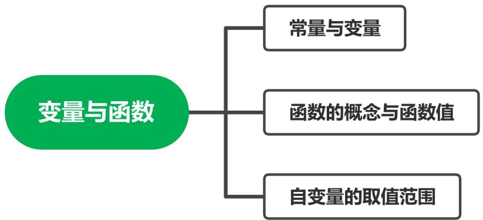

flowchart

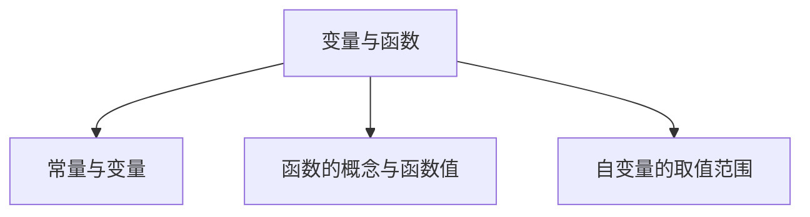

##

##

## 知识点01 常量与变量

1. 变量：

在一个变化过程中，数值 的量称为变量。

2. 常量：

在一个变化过程中，数值 的量称为常量。

变量与常量一定存在于一个变化过程中，有时可以相互转化。

## 【即学即练1】

1．阅读并完成下面一段叙述：

（1）某人持续以 a 米/分的速度经 t 分时间跑了 s 米，其中常量是 ，变量是

（2）在 t 分内，不同的人以不同的速度 a 米/分跑了 s 米，其中常量是 ，变量是  
（3）s 米的路程不同的人以不同的速度 a 米/分各需跑的时间为 t 分，其中常量是 ，变量是  
（4）根据以上三句叙述，写出一句关于常量与变量的结论：

## 知识点02 函数的概念与函数值

1. 函数的概念：

一般地，在一个变化过程中，如果有两个变量x和 y ，并且对于x的每一个确定的值，y 都有 的值与之对应，那么我们就说x是 ， y 是x的 ，又称因变量。

说明：对于函数概念的理解：①有两个变量；②一个变量的数值随着另一个变量的数值的变化而发生变化；③对于自变量的每一个确定的值，函数值有且只有一个值与之对应，即单对应。

2. 函数值：

在一个函数中，若存在x  a时 $y = b$ ，则b就是自变量为a时的 。

## 【即学即练1】

2．关于变量 x，y 有如下关系： $\textcircled { 1 } x - y = 5 ; \textcircled { 2 } y ^ { 2 } = 2 x ; \textcircled { 3 } y = | x | ; \textcircled { 4 } y = \frac { 3 } { \mathbf { x } }$ ．其中 y 是 x 函数的是（ ）

A．①②③

B．①②③④

C．①③

D．①③④

## 【即学即练2】

3．当 x＝﹣2 时，函数 $y = \sqrt { 4 x + 9 }$ 的函数值为

## 知识点03 自变量的取值范围

1. 自变量的取值范围：

在函数表达式中，自变量的取值必须使相应的函数表达式有意义。

2. 常见的几种函数解析式中自变量的取值范围：

①整式型函数表达式：自变量取值范围为  
②分式型函数表达式：自变量取值范围为 。  
③根式型函数表达式：自变量取值范围为  
④零次幂与负整数指数幂函数表达式：自变量取值范围为 。

3. 在实际问题中与几何图形中的自变量取值：

在实际问题与几何图形中，既要满足函数表达式有意义，也要满足实际问题的实际意义，还要满足几何图形的几何意义。

## 【即学即练1】

4．函数 $y = \frac { \sqrt { x + 5 } } { x + 2 }$ x+2 的自变量 x的取值范围是

## 【即学即练2】

5．在函数 $y = \frac { 1 } { \sqrt { x + 3 } } + ( x - 3 ) ^ { 0 _ { 5 } }$ 中，自变量 x 的取值范围是（ ）

A． $x \geqslant - 3$

B． $x > - 3$

C． $x \neq 3$

D． $x > - 3$ 且 $x \neq 3$

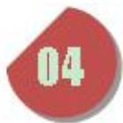

text_image

题型精讲

## 题型 01 判断变量与常量

【典例 1】小亮爸爸到加油站加油，如图是所用的加油机上的数据显示牌，金额随着数量的变化而变化．则下列判断正确的是（ ）

<table><tr><td rowspan="3"></td><td>金额/元</td></tr><tr><td>数量/升</td></tr><tr><td>单价/(元/升))</td></tr></table>

A．金额是自变量

B．单价是自变量

C．7.76 和 31 是常量

D．金额是数量的函数

【变式 1】一个圆形花坛，周长 C 与半径 r的函数关系式为 $C { = } 2 \pi r$ ，其中关于常量和变量的表述正确的是（

A．常量是 2，变量是 C，π，r  
B．常量是 2，变量是 r，π  
C．常量是 2，变量是 C，π  
D．常量是 2π，变量是 C，r

【变式 2】已知一个长方形的面积为 $1 5 c m ^ { 2 }$ ，它的长为 a cm，宽为 b cm，下列说法正确的是（ ）

A．常量为 15，变量为 a，b

B．常量为 15，a，变量为 b

C．常量为 15，b，变量为 a

D．常量为 a，b，变量为 15

【变式 3】球的体积是 M，球的半径为 R，则 $M { = } \frac { 4 } { 3 } \pi R ^ { 3 }$ ，其中变量和常量分别是（ ）

A．变量是 M，R；常量是 $\frac { 4 } { 3 } \pi$  
B．变量是 R，π；常量是 $\frac { 4 } { 3 }$  
C．变量是 M， ；常量是 3，4  
D．变量是 R；常量是 M

## 题型 02 判断函数关系

【典例 1】下列变量间的关系不是函数关系的是（ ）

A．长方形的宽一定，其长与面积  
B．正方形的周长与面积  
C．圆柱的底面半径与体积  
D．圆的周长与半径

【变式 1】下列所述不属于函数关系的是（ ）

A．长方形的面积一定，它的长和宽的关系  
B．x+2 与 x 的关系  
C．匀速运动的火车，时间与路程的关系  
D．某人的身高和体重的关系

【变式 2】下列关于变量 x 和 y 的关系式：

$$
x - y = 0, \quad y ^ {2} = x, \quad | y | = 2 x, \quad y ^ {2} = x ^ {2}, \quad y = 3 - x, \quad y = 2 x ^ {2} - 1, \quad y = \frac {3}{\mathbf {x}},
$$

其中 y 是 x 的函数的个数为（ ）

A．3

B．4

C．5

D．6

【变式 3】下列等式中 $y = \mid x \mid , | y | = x , 5 x ^ { 2 } - y = 0 , x ^ { 2 } - y ^ { 2 } = 0$ ，其中表示 y 是 x 的函数的有（ ）

A．0 个

B．1 个

C．2 个

D．4 个

## 题型 03 求自变量的取值范围

【典例1】在函数 $y = \frac { x - 2 } { 2 x + 1 }$ 2x+1 中，自变量 x 的取值范围是

【变式1】使函数 $y = \sqrt { x + 3 }$ 有意义的 x的取值范围是

【变式2】函数 $y = \frac { x } { \sqrt { x - 5 } }$ 的定义域为

【变式3】函数 $y = 2 x + \frac { x } { x + 1 }$ 中自变量 x 的取值范围是

【变式4】函数 $y = \sqrt { 2 x + 4 } - \frac { 3 } { x - 1 }$ 的自变量 x 的取值范围是

## 题型 04 求函数值

【典例 1】在关系式 $y = \frac { 1 } { 3 } x + 2 4$ 中，当因变量 y＝﹣2 时，自变量 x的值为（ ）

A． $\frac { 8 } { 3 }$

B．﹣4

C．﹣12

D．12

【变式 1】已知函数 $f \left( x \right) = 2 x - 3$ ，那么 f（1）＝

【变式 2】已知函数 $f ( x ) = \frac { x + 4 } { 2 x - 1 }$ 2x-1 ，那么 f（2）＝

$f ( x ) = \frac { 2 } { 2 - x }$ ，那么 $f \ ( { \sqrt { 3 } } )$ ）＝

【变式 4】根据如图所示的程序计算函数 y 的值，若输入 x 的值是 8，则outputs y 的值是﹣3，若输入 x 的值是﹣8，则outputs y 的值是（ ）

flowchart

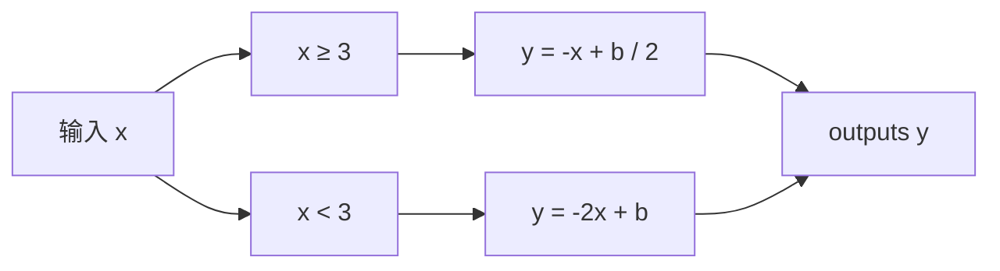

A．10

B．14

C．18

D．22

1．在圆锥体积公式 ${ \mathbb { V } } { = } \frac { 1 } { 3 } \pi { \mathrm { \Delta r } } ^ { 2 } { \mathrm { h } } ^ { \# }$ ）

A．常量是 ，变量是 V，h $\frac 1 3$  
B．常量是 ，变量是 h，r $\frac 1 3$  
C．常量是 ，变量是 V，h，r $\frac 1 3$  
D．常量是 $\frac 1 3$ ， 变量是 V，h，π，r

2．下列关系式中，y 不是 x的函数的是（ ）

A． $y = x + 1$

B．y＝x﹣1 $\scriptstyle { y = x ^ { - 1 } }$

C．y＝﹣2x

D． $\vert y \vert { = } x$

3．下列表达式中，与表格表示同一函数的是（ ）

<table><tr><td>x</td><td>...</td><td>-2</td><td>-1</td><td>0</td><td>1</td><td>2</td><td>...</td></tr><tr><td>y</td><td>...</td><td>5</td><td>3</td><td>1</td><td>-1</td><td>-3</td><td>...</td></tr></table>

A． $y = - ~ 2 x + 1$

B．y＝x﹣1

C $y = 2 x - 1$

D． $y = 2 x + 1$

4．油箱中存油 40 升，油从油箱中均匀流出，流速为 0.2升/分钟，则油箱中剩余油量 Q（升）与流出时间 t（分钟）的函数关系是（

A．Q＝0.2t

B．Q＝40﹣0.2t

C．Q＝0.2t+40

D．Q＝0.2t﹣40

5．如图，有一个球形容器，小海在往容器里注水的过程中发现，水面的高度 h、水面的面积 S 及注水量 V是三个变量．下列有四种说法：

①S 是 V 的函数；②V 是 S的函数；③h是 S的函数，④S 是 h 的函数

其中所有正确结论的序号是（

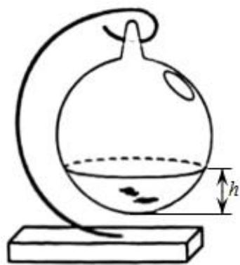

text_image

Diagram of a laboratory setup with a flask, bulb, and stand, labeled with height h

A．①③

B．①④

C．②③

D．②④

6．某市的出租车收费标准如下：3 千米以内（包括 3 千米）收费 8元，超过 3 千米后，每超 1 千米就加收2 元．若某人乘出租车行驶的距离为 $x \left( x { > } 3 \right)$ ）千米，则需付费用 y 元与 x（千米）之间的关系式是（ ）

A． $y = 8 + 2 x$

B． $y = 2 + 2 x$

C．y＝2x﹣8

D．y＝2x﹣3

7．函数 $y = \frac { 1 } { x - 9 } + \sqrt { x - 2 }$ 中，自变量 x的取值范围是（ ）

A． $x \geqslant 2$

B． $x \geqslant 2$ 且 $x \neq 9$

C． $x \neq 9$

D． $2 { \leqslant } x { < } 9$

8．变量 y与 x之间的关系是 $y = - ~ 2 x + 3$ ，当自变量 x＝6时，因变量 y的值是（ ）

A．﹣6

B．﹣9

C．﹣12

D．﹣15

9．用如图所示的程序框图来计算函数 y 的值，当输入 x为﹣1 和 7 时，outputs y 的值相等，则 b 的值是（ ）

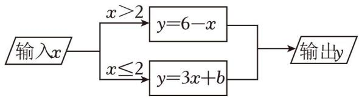

flowchart

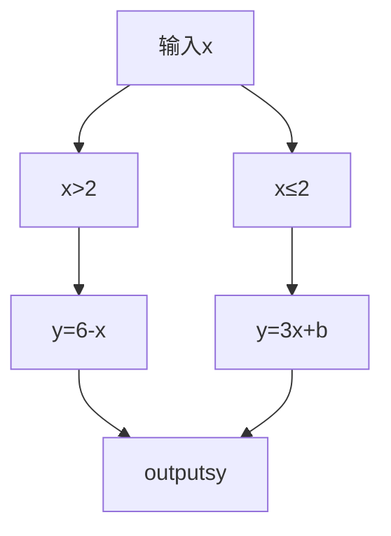

A．﹣4

B．﹣2

C．4

D．2

10．火车匀速通过隧道时，火车在隧道内的长度 y（米）与火车行驶时间 x（秒）之间的关系用图象描述如图所示，有下列结论：

①火车的长度为 150米；  
②火车的速度为 30 米/秒；  
③火车整体都在隧道内的时间为 25秒；  
④隧道长度为 750米

其中正确的结论是（ ）

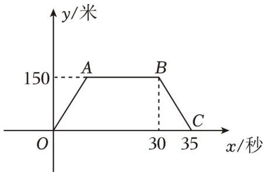

text_image

y/米
150
A	B
O	30	35
x/秒

A．①②③

B．②③④

C．①②③④

D．②④

11．下列各式①y＝0.5x﹣2； $\textcircled{2} y = \lvert 2 x \rvert$ ；③3y+5＝x； $\textcircled{4} y ^ { 2 } = 2 x + 8$ 中，y 是 x 的函数的有 （只填序号）  
12．若函数 $\frac { \sqrt { x + 3 } } { x - 3 }$ 在实数范围内有意义，则自变量的取值范围是  
13．函数 $y = f \left( { \mathbf { - } } { \mathbf { 4 } } \right) = { \mathbf { - } } { \mathbf { 2 } } x { \mathbf { + } } b { \mathbf { = } } { \mathbf { - } } { \mathbf { 5 } }$ ，则 f（0）＝  
14．如图是 1 个纸杯和 6 个叠放在一起的相同纸杯的示意图．若设杯沿高为 a（常量），杯子底部到杯沿底边高为 b，写出杯子总高度 h 随着杯子数量 n（自变量）的变化规律

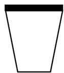

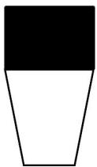

15．一个矩形的长比宽多 3cm，矩形的面积是 $S c m ^ { 2 }$ ．设矩形的宽为 xcm，当 x在一定范围内变化时，S 随x 的变化而变化，则 S与 x满足的函数关系是

16．求下列函数中自变量的取值范围

（1） $y = 2 x - 1$ ；

（2） $y = \sqrt { x - 3 } + \sqrt { 5 - x }$

（3） $y = \frac { 1 } { \sqrt { 4 - 2 x } }$

17．周长为 20cm 的矩形，若它的一边长是 x cm，面积是 $S c m ^ { 2 }$

（1）请用含 x 的式子表示 S，并指出常量与变量；

（2）当 $x { = } 6$ 时，求 S的值

18．如图，是一个“因变量随着自变量变化而变化“的示意图，下面表格中，是通过运算得到的几组 x 与 y的对应值．根据图表信息解答下列问题：

<table><tr><td>输入x</td><td>...</td><td>-2</td><td>0</td><td>2</td><td>...</td></tr><tr><td>outputsy</td><td>...</td><td>2</td><td>m</td><td>18</td><td>...</td></tr></table>

（1）直接写出： $k { = } \quad 9 \quad , \ b { = } \quad 6 \quad , \ m { = } \quad 6 \quad ;$ ；

（2）当输入 x 的值为﹣1 时，求outputs y 的值；

（3）当outputs y 的值为 12 时，求输入 x 的值

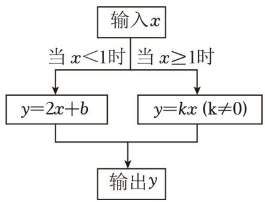

flowchart

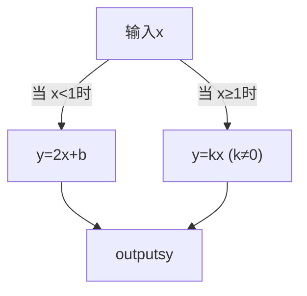

19．电业部门每月都按时取居民家查电表，电表读数与上次读数的差就是这段时间内用电的千瓦时数．月初小亮家电表显示的度数为 300，本月初电表显示的读数为 n

（1）小亮家上月用电多少千瓦时？

（2）如果每千瓦时的电费为 0.52元，全月的电费为 y（元），那么上月小亮家应缴费电费是多少？

（3）在问题（2）中，哪些量是常量？哪些量是变量？y 是哪个变量的函数？

20．“五一”期间，小刚和父母一起开车到距家 100 千米的景点旅游，出发前，汽车油箱内储油 35 升，当行驶 80 千米时，发现油箱余油量为 25 升（假设行驶过程中汽车的耗油量是均匀的）

（1）求该车平均每千米的耗油量，并写出行驶路程 x（千米）与剩余油量 Q（升）的关系式；

（2）当 x＝120千米时，求剩余油量 Q 的值；

（3）当油箱中剩余油量低于 3 升时，汽车将自动报警，如果往返途中不加油，他们能否在汽车报警前回到家？请说明理由．