## 第 02讲 函数的图像

## 01

## 学习目标

<table><tr><td>课程标准</td><td>学习目标</td></tr><tr><td>1函数的图像2函数图像的画法3函数的三种表达方式</td><td>1. 掌握函数的图像的概念,能判断函数图像与函数图像上的点的关系。2. 掌握画函数图像的过程,并能够熟练的画出函数的函数图像。3. 掌握函数的三种表达方式,能准确判断所表达的关系是否为函数关系,并能够进行相互转换。</td></tr></table>

## 02

## 思维导图

## 函数的图像

函数的图像

函数图像的画法

函数的三种表达方法

##

##

## 知识点01 函数的图像

## 1. 函数的图像的概念：

一般地，对于一个函数，如果把 与 的每对对应值分别看作为点的横、纵坐标，那么坐标平面内由这些点组成的图形，是这个函数的图像。

## 2. 图像上的点与满足函数关系的有序数对：

函数图像上的任意一点 $( x , \ y )$ ）中的 x，y 都满足 ；满足函数关系的任意一对有序数对所对应的点都在 。

## 【即学即练1】

1．两家牛奶销售公司招聘送奶员，下面的海报显示两家公司的周薪计算方式：

甲公司

星期内送出的前 240 瓶牛奶，每瓶牛奶 0.5元，此后，每多送一瓶每瓶多 0.3元

乙公司

底薪 200 元．此外，每送出一瓶牛奶将额外有 0.3 元．

小明决定应聘当送奶员，下列正确表示两家公司的周薪计算方式的图是（ ）

周薪/元

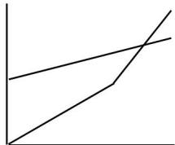

natural_image

Simple line graph showing two intersecting lines with no text or labels

A

数量份

周薪元

natural_image

Pure geometric lines forming a V-shape with no text, numbers, or symbols

B．

数量份

周薪元

natural_image

Simple line graph showing two intersecting lines with no text or labels

C．

数量份

周薪/元

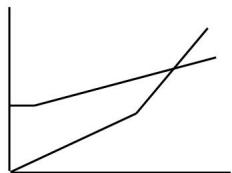

natural_image

Simple line graph showing two diverging trends with one increasing and the other decreasing, both axes labeled (no text or symbols)

数量/份

## 知识点02 函数图像的画法

1. 画函数图像的步骤：

步骤 1：列表：表中给出一些自变量及其自变量对应的函数值。

步骤 2：描点：在平面直角坐标系中，以自变量作为 横坐标 ，函数值作为 纵坐标 ，描出表格中的数值所对应的点。

步骤 3：连线：按照横坐标由小到大的顺序，把所描出的点用光滑的曲线连接起来。

## 【即学即练1】

2．小朋在学习过程中遇到一个函数 $y { = } \frac { 1 } { 2 } x ^ { 3 } .$

（1）观察这个函数的解析式可知，x的取值范围是 ，函数值 y 的取值范围是  
（2）进一步研究，y 与 x 的几组对应值如下表：

<table><tr><td>x</td><td>...</td><td>-2</td><td> $-\frac{3}{2}$ </td><td>-1</td><td>0</td><td>1</td><td> $\frac{3}{2}$ </td><td>2</td><td>...</td></tr><tr><td>y</td><td>...</td><td></td><td></td><td></td><td>0</td><td></td><td></td><td></td><td>...</td></tr></table>

（3）结合上表，画出函数图象：  
（4）结合函数图象，写出两条性质

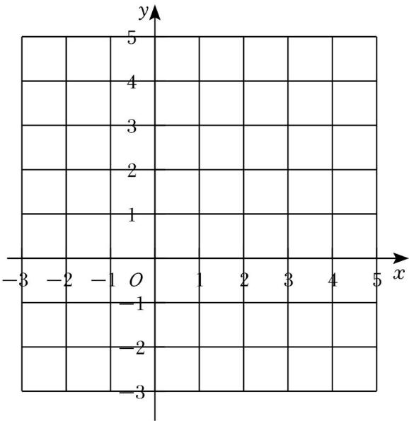

text_image

y
5
4
3
2
1
-3 -2 -1 O 1 2 3 4 5 x
-1
-2
-3

## 知识点03 函数的三种表达方式

1. 解析式法：

定义：用含有 自变量 x 的式子来表示函数的方法叫做解析式法。

优点：能准确的反应整个变化过程中两个变量的关系。

缺点：对于一些特点的函数关系无法用解析式法表达。

判断式子是否为函数关系，需判断一个自变量是否只能求出唯一的函数值。

2. 列表法：

定义：把一系列 自变量 x 的值与对应的 函数值 y 列成一个表来表示函数关系的方法。

优点：可以由表格知道的已知自变量的相应函数值。

缺点：自变量的值不能一一列出，也不容易看出两个变量之间的对应关系。

3. 图像法;

定义：用图像来表示函数关系的方法。

优点：能直观形象的表达函数关系。

缺点：有些图像只能得到近似的函数关系，不能得到确定的函数关系。

判断图像是否为函数图像需确认一个自变量是否对应一个函数值。即作 x 轴的垂线，与图像只能有一个交点。

## 【即学即练1】

3．油箱中存油 40 升，油从油箱中均匀流出，流速为 0.2升/分钟，则油箱中剩余油量 Q（升）与流出时间 t（分钟）的函数关系是（ ）

A．Q＝0.2t

B．Q＝40﹣0.2t

C．Q＝0.2t+40

D．Q＝0.2t﹣40

## 【即学即练2】

4．海拔高度 h（千米）与此高度处气温 t（℃）之间有下面的关系：

<table><tr><td>海拔高度h/千米</td><td>0</td><td>1</td><td>2</td><td>3</td><td>4</td><td>5</td><td>...</td></tr><tr><td>气温t/°C</td><td>20</td><td>14</td><td>8</td><td>2</td><td>-4</td><td>-10</td><td>...</td></tr></table>

下列说法错误的是（ ）

A．其中 h是自变量，t 是因变量

B．海拔越高，气温越低

C．气温 t 与海拔高度 h 的关系式为 t＝20﹣5h

D．当海拔高度为 8千米时，其气温是﹣28℃

## 【即学即练3】

5．如图所示的图象分别给出了 x与 y的对应关系，其中表示 y 不是 x的函数的是（

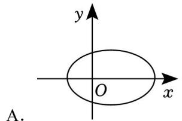

text_image

y
O
x
A.

B  
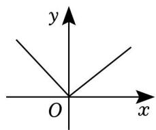

text_image

y
O
x

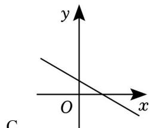

text_image

y
O
x
C

D  
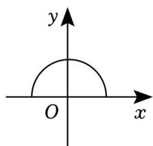

text_image

y
O
x

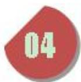

text_image

题型精讲

## 题型 01 判断函数关系式

【典例 1】下列关系式中，y 不是 x 的函数的是（ ）

A． $y = x + 1$

B． $\scriptstyle { y = x ^ { - 1 } }$

C．y＝﹣2x

D． $\vert y \vert { = } x$

【变式 1】下列关于变量 x 和 y 的关系式：

$x \cdot y = 0 , y ^ { 2 } = x , \vert y \vert = 2 x , y ^ { 2 } = x ^ { 2 } , y = 3 - x , y = 2 x ^ { 2 } - 1 , y = \frac { 3 } { x }$ ，其中 y 是 x 的函数的个数为（ ）

A．3

B．4

C．5

D．6

【变式 2】下列等式中 y＝|x|， $\lvert y \rvert { = } x .$ ， $5 x ^ { 2 } - y = 0$ ， $x ^ { 2 } - y ^ { 2 } { = } 0$ ，其中表示 y 是 x 的函数的有（ ）

A．0 个

B．1 个

C．2 个

D．4 个

## 题型 02 利用表格的信息解决问题

【典例 1】如表是研究弹簧长度与所挂物体质量关系的实验表格，则弹簧不挂物体时的长度为（ ）

<table><tr><td>所挂物体重量 $x$ (kg)</td><td>1</td><td>2</td><td>3</td><td>4</td><td>5</td></tr><tr><td>弹簧长度  $y$ (cm)</td><td>10</td><td>12</td><td>14</td><td>16</td><td>18</td></tr></table>

A．4cm

B．6cm

C．8cm

D．10cm

【变式 1】已知蓄水池有水 $5 m ^ { 3 }$ 现匀速放水，池中水量和放水时间的关系如表所示，则放水 14min 后，池中水量为（ ）

<table><tr><td>放水时间/min</td><td>0</td><td>1</td><td>2</td><td>3</td><td>4</td><td>...</td></tr><tr><td>池中水量池中水量/ $m^{3}$ </td><td>50</td><td>48</td><td>46</td><td>44</td><td>42</td><td>...</td></tr></table>

A． $2 2 m ^ { 3 }$

B． $2 4 m ^ { 3 }$

C． $2 6 m ^ { 3 }$

D． $2 8 m ^ { 3 }$

【变式 2】某科研小组在网上获取了声音在空气中传播的速度与空气温度关系的一些数据（如表）：下列说法错误的是（ ）

<table><tr><td>温度/°C</td><td>-20</td><td>-10</td><td>0</td><td>10</td><td>20</td><td>30</td></tr><tr><td>声速/(m/s)</td><td>318</td><td>324</td><td>330</td><td>336</td><td>342</td><td>348</td></tr></table>

A．在这个变化中，自变量是温度，因变量是声速

B．温度越高，声速越快

C．当空气温度为 $2 0 \mathrm { { ^ \circ C } }$ 时，声音 5s 可以传播 1740m

D．当温度每升高 $1 0 ^ { \circ } \mathrm { C }$ ，声速增加 6m/s

【变式 3】某校七年级数学兴趣小组利用同一块长为 1 米的光滑木板，测量小车从不同高度沿斜放的木板从顶部滑到底部所用的时间，支撑物的高度 h（cm）与小车下滑时间 t（s）之间的关系如下表所示：

<table><tr><td>支撑物高度h(cm)</td><td>10</td><td>20</td><td>30</td><td>40</td><td>50</td><td>60</td><td>70</td></tr><tr><td>小车下滑时间t(s)</td><td>4.23</td><td>3.00</td><td>2.45</td><td>2.13</td><td>1.89</td><td>1.71</td><td>1.59</td></tr></table>

根据表格所提供的信息，下列说法中错误的是（ ）

A．支撑物的高度为 50cm，小车下滑的时间为 1.89s

B．支撑物的高度 h 越大，小车下滑时间越小

C．若支撑物的高度每增加 10cm，则对应的小车下滑时间的变化情况都相同  
D．若小车下滑的时间为 2.5s，则支撑物的高度在 20cm 至 30cm 之间

## 题型 03 判断函数图像

【典例 1】如图，下列各曲线中能够表示 y是 x的函数的（ ）

【变式 1】下列各曲线中，表示 y 是 x 的函数的是（ ）

【变式 2】下列各图中不能表示 y是 x的函数的是（ ）

A  
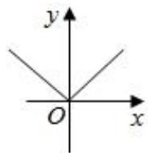

B  
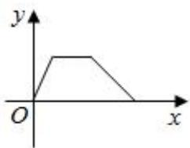

text_image

y
O
x

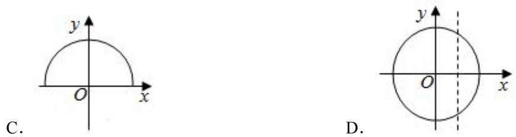

C

## 题型 04 获取函数图像信息

【典例 1】在一辆小汽车行驶过程中，小汽车离出发地的距离 s（km）和行驶时间 t（h）之间的函数关系如

图，根据图中的信息，下列说法错误的是（ ）

A．小汽车共行驶 240km  
B．小汽车中途停留 0.5h  
C．小汽车出发后前 3 小时的平均速度为 40 千米/时

D．小汽车自出发后 3 小时至 5 小时之间行驶的速度在逐渐减小

line chart

| Time (h) | Distance (km) |
| :--- | :--- |
| 0 | 0 |
| 1 | 80 |
| 1.5 | 80 |
| 2 | 120 |
| 3 | 120 |
| 4 | 60 |
| 5 | 0 |

【变式 1】如图是某品牌小汽车 2023 年 9～12 月这四个月的月销售量情况，则下列说法错误的是（ ）

A．该品牌小汽车 2023年 10月的销售量是 1.6 万辆  
B．该品牌小汽车 2023年这四个月销售量持续增长  
C．该品牌小汽车 2023年这四个月中 12月的销售量最高  
D．该品牌小汽车 2023年这四个月中 10月到 11月的销售量增长最快

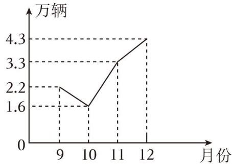

line chart

| 月份 | 万辆 |
|---|---|
| 9 | 2.2 |
| 10 | 1.6 |
| 11 | 3.3 |
| 12 | 4.3 |

【变式 2】甲、乙两工程队分别同时开挖两条 600米长的管道，所挖管道长度 y（米）与挖掘时间 x（天）之间的关系如图所示，则下列说法中：①甲队每天挖 100米；②乙队开挖两天后，每天挖 50 米；③甲队比乙队提前 3天完成任务；④当 x＝2 或 6 时，甲乙两队所挖管道长度都相差 100米．正确的有（ ）

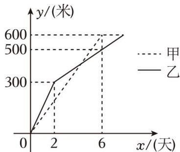

line chart

| x(天) | 甲    | 乙    |
|-------|-------|-------|
| 0     | 0     | 0     |
| 2     | 300   | 300   |
| 6     | 600   | 500   |

A．①②③

B．①②④

C．①③④

D．②③④

【变式 3】甲、乙两人骑车分别从 A、B 两地相向匀速行驶，当乙到达 A 地后，继续保持原速向远离 B 的方向行驶，而甲到达 B 地后立即掉头，并保持原速与乙车同向行驶，经过一段时间后，两车同时到达 C 地，设两车的行驶时间为 x 小时，两车之间的距离为 y 千米，y 与 x 之间的函数关系如图所示，则两人出发 小时后相距 30千米

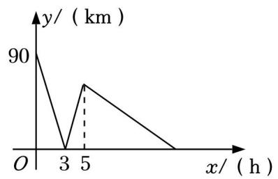

line chart

| x (h) | y (km) |
|---|---|
| 0 | 90 |
| 3 | 0 |
| 5 | 80 |
| 7 | 0 |

【变式 4】小敏上午 8：00 从家里出发，骑车去一家超市购物，然后从这家超市返回家中，小敏离家的路程 y（米）和所经过的时间 x（分）之间的函数图象如图所示．下列结论：①小敏在超市逗留了 30分钟；②小敏家距离超市 3000米；③小敏去超市途中的速度是 300 米/分钟；④小敏 8 点 50分返回到家．以上结论中正确的是 （填序号）

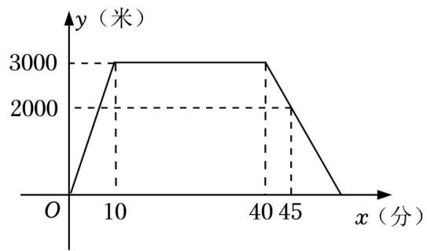

line chart

| x (分) | y (米) |
| ------ | ------ |
| 0      | 0      |
| 10     | 3000   |
| 40     | 3000   |
| 45     | 2000   |
| >45    | 0      |

## 题型 05 判断变量的大致图像

【典例 1】周日上午，小张跑步去公园锻炼身体，到达公园后原地锻炼了一会之后散步回家，下面能反映小张离公园的距离 y与时间 x的函数关系的大致图象是（ ）

【变式 1】苹果熟了，从树上落下来．下面可以大致刻画出苹果下落过程中（即落地前）的速度变化情况的图象是（ ）

A  
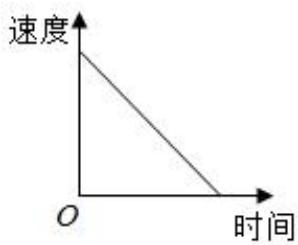

text_image

速度
O
时间

B  
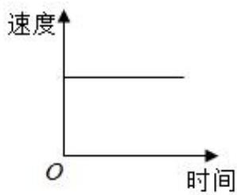

text_image

速度
O
时间

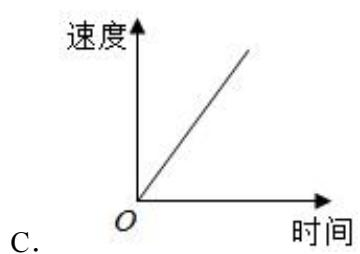

text_image

速度
O
时间
C.

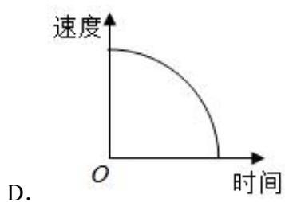

text_image

速度
O
时间
D.

【变式 2】如图，现有一个计时沙漏，开始时盛满沙子，沙子从上部均匀下漏，经过 5 分钟漏完，则该沙漏中沙面下降的高度 h（cm）与下漏时间 t（min）之间的函数图象大致是（ ）

text_image

A.
O
5 t
C.

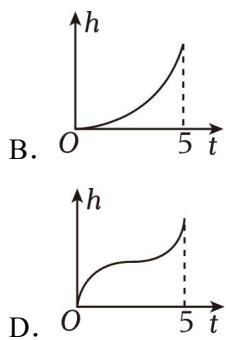

line chart

| t | h (B) | h (D) |
|---|---|---|
| 0 | 0 | 0 |
| 5 | >5 | >5 |

【变式 3】某景区有一根长 60cm 的特大蜡烛，若每小时燃烧 4cm，那么蜡烛剩余长度 y（cm）与燃烧时间x（小时）之间的函数关系式用图象表示为（ ）

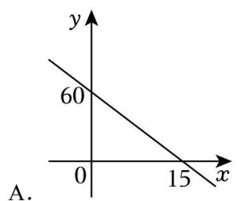

line chart

| x | y |
|---|---|
| 0 | 60 |
| 15 | 0 |

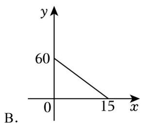

line chart

| x | y |
|---|---|
| 0 | 60 |
| 15 | 0 |

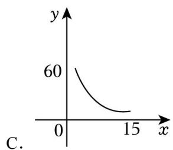

line chart

| x | y |
|---|---|
| 0 | 60 |
| 15 | 40 |

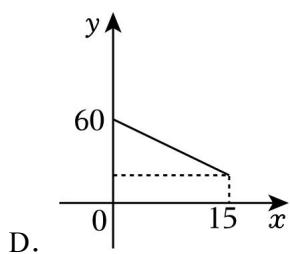

line chart

| x | y |
|---|---|
| 0 | 60 |
| 15 | 40 |
D.

## 强化训练

1．某市的出租车收费标准如下：3 千米以内（包括 3 千米）收费 8元，超过 3 千米后，每超 1 千米就加收2 元．若某人乘出租车行驶的距离为 x（x＞3）千米，则需付费用 y 元与 x（千米）之间的关系式是（ ）

A． $y = 8 + 2 x$

B．y＝2+2x

C．y＝2x﹣8

D． $y = 2 x - 3$

2．下列图象中，不能表示 y是 x的函数的是（ ）

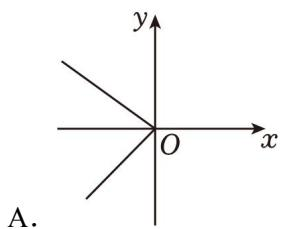

text_image

y
O
x
A.

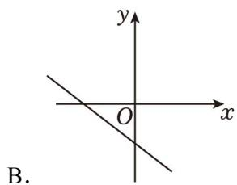

text_image

y
O
x
B.

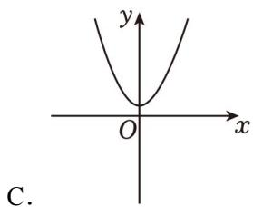

text_image

y
O x
C.

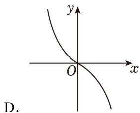

text_image

y
O
x
D.

3．如果某函数的图象如图所示，那么 y 随着 x的增大而（ ）

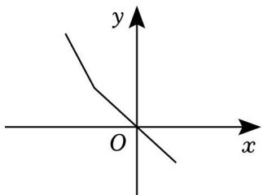

text_image

y
O
x

A．增大

B．减小

C．先减小后增大

D．先增大后减小

4．某科研小组在网上获取了声音在空气中传播的速度与空气温度关系的一些数据（如表）：下列说法错误的是（

<table><tr><td>温度(°C)</td><td>-10</td><td>0</td><td>10</td><td>20</td><td>30</td><td>...</td></tr><tr><td>声速(m/s)</td><td>324</td><td>330</td><td>336</td><td>342</td><td>348</td><td>...</td></tr></table>

A．在这个变化过程中，自变量是温度，因变量是声速

B．在一定温度范围内，温度越高，声速越快

C．当空气温度为 $2 0 \mathrm { { ^ \circ C } }$ 时，声音 5s 可以传播 1740m

D．当温度升高到 33℃时，声速为 349.8m/s

5．研究表明，当潮水高度不低于 260cm 时，货轮能够安全进出该港口，海洋研究所通过实时监测获得 6月份某天记录的港口湖水高度 y（cm）和时间 x（h）的部分数据，绘制出函数图象如图：

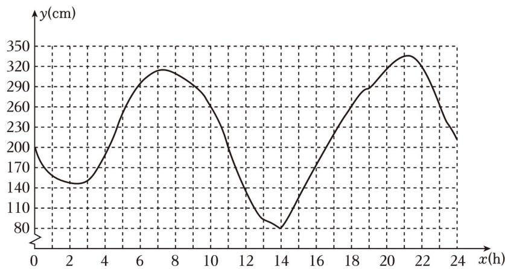

line chart

| x(h) | y(cm) |
|------|-------|
| 0    | 200   |
| 2    | 140   |
| 4    | 180   |
| 6    | 290   |
| 8    | 320   |
| 10   | 280   |
| 12   | 140   |
| 14   | 80    |
| 16   | 140   |
| 18   | 260   |
| 20   | 320   |
| 22   | 340   |
| 24   | 230   |

小颖观察图象得到了以下结论：①当 x＝18 时，y＝260；②当 0＜x＜4 时，y 随 x 的增大而增大；③当x＝14时，y 有最小值为 80；④当天只有在 5≤x≤10时间段时，货轮适合进出此港口，以上结论正确的个数为（ ）

A．1 个

B．2 个

C．3 个

D．4 个

6．如图，在实验课上，小亮利用同一块木板，测量了小车从木板顶部下滑的时间 t 与支撑物的高度 h，得到如表所示的数据．下列结论不正确的是（ ）

<table><tr><td>木板的支撑物高度h(cm)</td><td>10</td><td>20</td><td>30</td><td>40</td><td>50</td><td>...</td></tr><tr><td>下滑时间t(s)</td><td>3.25</td><td>3.01</td><td>2.81</td><td>2.66</td><td>2.56</td><td>...</td></tr></table>

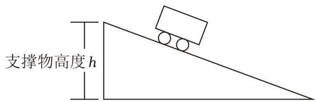

text_image

支撑物高度h

A．这个实验中，木板的支撑物高度是自变量  
B．支撑物高度 h 每增加 10cm，下滑时间就会减少 0.24s  
C．当 h＝40cm 时，t 为 2.66s  
D．随着支撑物高度 h 的增加，下滑时间越来越短

7．小明在公园半圆形步道上练习长跑，如图，AB 是半圆的直径，O 是半圆的圆心，C 是半圆上一点．他沿着 O﹣A﹣C﹣B﹣O 的路径匀速跑步，从他离开点 O 开始计时，则他到点 O 的距离 s 与跑步时间 t 之间的关系基本符合（ ）

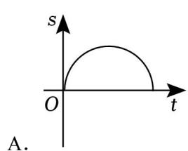

text_image

s
O
t
A.

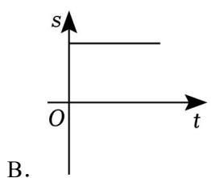

text_image

s
O
t
B.

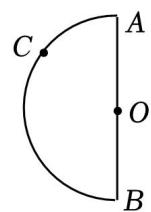

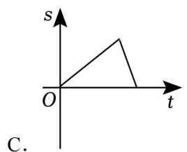

text_image

s
O
t
C.

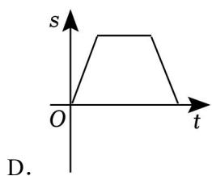

text_image

s
O
t
D.

8．弹簧挂上物体后会伸长，测得一弹簧的长度 y（cm）与所挂重物的质量 x（kg）有下面的关系：

<table><tr><td>x(kg)</td><td>0</td><td>1</td><td>2</td><td>3</td><td>4</td><td>5</td><td>6</td></tr><tr><td>y(cm)</td><td>12</td><td>12.5</td><td>13</td><td>13.5</td><td>14</td><td>14.5</td><td>15</td></tr></table>

那么弹簧总长 y（cm）与所挂重物 $x \ ( k g )$ ）之间的关系式为（ ）

A． $y = 0 . 5 x + 1 2$

B． $y = \scriptstyle x + 1 0 . 5$

C． $y = 0 . 5 x + 1 0$

D． $y = x + 1 2$

9．设 $A = \frac { 2 x + a } { 2 } + 1$ ， $B { = } \frac { \mathsf { a } \mathbf { x } { - } 2 } { 2 }$ ， a 为常数，x 的取值与 A 的对应值如表：

<table><tr><td>x</td><td>...</td><td>1</td><td>...</td></tr><tr><td>A</td><td>...</td><td>4</td><td>...</td></tr></table>

小明观察表格并探究出以下结论： $\textcircled{1} a = 5$ ；②当 $x { = } 4$ 时， $A = 7$ ；③当 x＝1 时，B＝1；④若 $A = B$ ，则 x＝4．正确结论的序号是（ ）

A．①③

B．②③

C．①②④

D．②③④

10．以某公园西门 O 为原点建立平面直角坐标系，东门 A 和景点 B 的坐标分别是（6，0）和（4，4）．如图 1，甲的游览路线是： $O {  } B {  } A$ ，其折线段的路程总长记为 $l _ { 1 }$ ，如图 2，景点 C 和 D 分别在线段 OB，BA 上，乙的游览路线是： $O {  } C {  } D {  } A$ ，其折线段的路程总长记为 l ，如图 3，景点 E 和 G 分别在线段OB，BA 上，景点 F 在线段 OA 上，丙的游览路线是： $O {  } E {  } F {  } G {  } A$ ，其折线段的路程总长记为 l ．下列 l1，l2，l3的大小关系正确的是（ ）

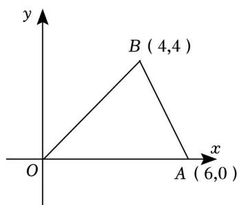

text_image

y
B (4,4)
O
A (6,0)
x

图1

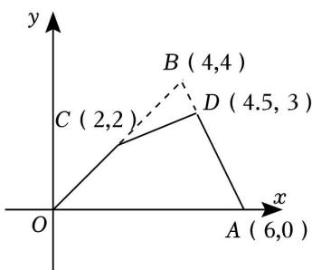

text_image

y
B (4,4)
C (2,2)
D (4.5, 3)
O
x
A (6,0)

图2

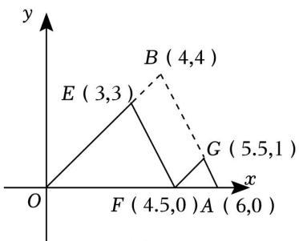

line chart

| Point | x-coordinate | y-coordinate |
|---|---|---|
| E   | 3,3 | |
| F   | 4,5,0 | |
| G   | 5,5,1 | |
| B   | 4,4 | |

图3

A． $l _ { 1 } = l _ { 2 } = l _ { 3 }$

B． $l _ { 1 } < l _ { 2 }$ 且 $l _ { 2 } = l _ { 3 }$

C． $l _ { 2 } { < } l _ { 1 } { < } l _ { 3 }$

D． $l _ { 1 } > l _ { 2 }$ 且 $l _ { 1 } = l _ { 3 }$

11．某人购进一批大庙香水梨到市场上零售，已知卖出香水梨的质量 x 与售价 y 的关系如下表：

<table><tr><td>质量x/kg</td><td>1</td><td>2</td><td>3</td><td>4</td><td>5</td></tr><tr><td>售价y/元</td><td>20</td><td>40</td><td>60</td><td>80</td><td>100</td></tr></table>

写出用 x表示 y 的关系式：

12．某型号汽油的数量与相应金额的关系如图所示，小明爸爸一次加这种型号的汽油 40升，需要付加油站 元．

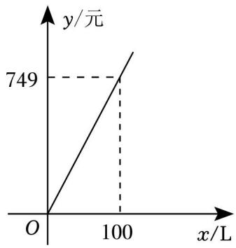

line chart

| x/L | y/元 |
| --- | ---- |
| 0   | 0    |
| 100 | 749  |

13．如图是 A，B 两种手机套餐每月资费 y（元）与通话时间 x（分钟）对应的函数图象，若小红每月通话时间大约为 500分钟，则从 A，B 两种手机资费套餐中选择 种更合适

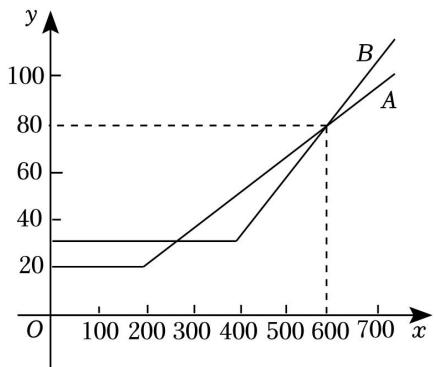

line chart

| x | y (Line A) | y (Line B) |
|---|---|---|
| 0 | 30 | 20 |
| 200 | 30 | 20 |
| 400 | 30 | 60 |
| 600 | 80 | 80 |
| 700 | 100 | 100 |

14．如图 1，已知长方形 ABCD，动点 P 沿长方形 ABCD 的边以 $B {  } C {  } D$ 的路径运动，记 $\triangle A B P$ 的面积为y，动点 P 运动的路程为 x，y 与 x 的关系如图 2 所示，则图 2 中的 m 的值为

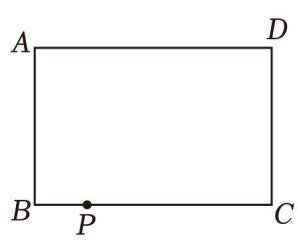

text_image

A
D
B
P
C

图1

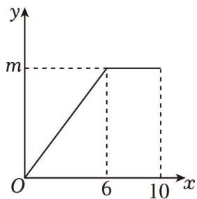

text_image

y
m
O
6
10 x

图2

15．如图①，在正方形 ABCD 中，点 P 以每秒 2cm 的速度从点 A 出发，沿 $A B {  } B C$ 的路径运动，到点 C停止．过点 P 作 PQ∥BD， $P Q$ 与边 AD（或边 CD）交于点 Q，PQ 的长度 $y _ { \mathit { \Delta } C m }$ 与点 P 的运动时间 x（秒）的函数图象如图②所示，当点 P 运动 3.5 秒时，PQ 的长是 cm．

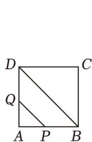

text_image

D
C
Q
A P B

图①

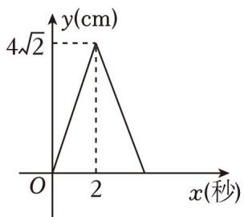

line chart

| x(秒) | y(cm) |
|-------|-------|
| 0     | 0     |
| 2     | 4√2   |

图②

16．甲、乙两人沿同一行驶路线开车从 A 地前往 B 地．设甲的行驶时间为 xh，甲、乙两人距出发点 A 地的

路程 $s _ { \textsc { p } } , \textit { s } _ { Z }$ 关于 x 的函数图象如图所示

（1）乙出发多长时间，甲、乙两人相遇？  
（2）甲出发多长时间，甲、乙两人相距 50km？

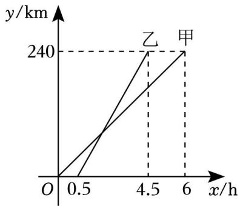

line chart

| x/h | y/km (甲) | y/km (乙) |
|-----|----------|----------|
| 0   | 0        | 0        |
| 4.5 | 240      | 240      |
| 6   | 240      | 240      |

17．下一页如图 1，在长方形 ABCD 中，BC＝4，AB＝6，点 E 以每秒 1个单位的速度从点 A 出发，沿 A→B→C 运动到点 C 后停止．连接 AC，EC．设点 E 的运动时间为 x，△ACE 的面积为 y

（1）求 y 关于 x 的函数关系式，并写出 x 的取值范围  
（2）在图 2 中画出（1）中函数的图象，并结合函数图象，写出该函数的两条性质

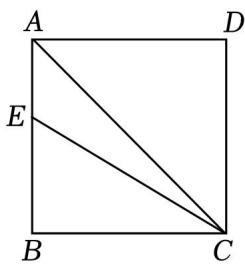

text_image

A
D
E
B
C

图1

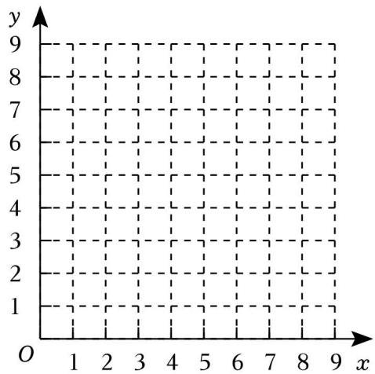

text_image

y
9
8
7
6
5
4
3
2
1
O 1 2 3 4 5 6 7 8 9 x

图2

18．已知一个矩形的面积为 6，长为 x，宽为 y

（1）y 与 x 之间的函数表达式为  
（2）在图中画出该函数的图象；

列表：

<table><tr><td>x</td><td>...</td><td>1</td><td>2</td><td>3</td><td>4</td><td>6</td><td>...</td></tr><tr><td>y</td><td>...</td><td>6</td><td>3</td><td>m</td><td>1.5</td><td>1</td><td>...</td></tr></table>

上面表格中 m 的值是

描点：在如图所示的平面直角坐标系中描出相应的点；

连线：用光滑的曲线顺次连接各点，即可得到该函数的图象

（3）若点 A（a，b）与点 B（a+1，c）是该函数图象上的两点，试比较 b和 c的大小

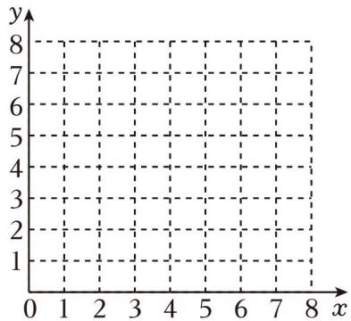

natural_image

Empty Cartesian coordinate grid with x-axis ranging from 0 to 8 and y-axis ranging from 1 to 8, no plotted data or text labels

19．电动汽车的续航里程也可以称作续航能力，是指电动汽车的动力蓄电池在充满电的状态下可连续行驶的总里程，它是电动汽车重要的经济性指标．高速路况状态下，电动车的续航里程除了会受到环境温度的影响，还和汽车的行驶速度有关．某科研团队为了分析续航里程与速度的关系，进行了如下的探究：下面是他们的探究过程，请补充完整：

（1）他们调取了某款电动汽车在某个特定温度下的续航里程与速度的有关数据：

<table><tr><td>速度(千米/小时)</td><td>10</td><td>20</td><td>30</td><td>40</td><td>60</td><td>80</td><td>100</td><td>120</td><td>140</td><td>160</td></tr><tr><td>续航里程(千米)</td><td>100</td><td>340</td><td>460</td><td>530</td><td>580</td><td>560</td><td>500</td><td>430</td><td>380</td><td>310</td></tr></table>

则设 为 y， 为 x，y 是 x 的函数；

（2）建立平面直角坐标系，在给出的格点图中描出表中各对对应值为坐标的点，画出该函数的图象；

（3）结合画出的函数图象，下列说法正确的有

①y 随 x的增大而减小；  
②当汽车的速度在 60千米/小时左右时，汽车的续航里程最大；  
③实验表明，汽车的速度过快或过慢时，汽车的续航里程都会变小

（4）若想要该车辆的续航里程保持在 500千米以上，该车的车速大约控制在 至 千米/小时范围内

20．自行车骑行爱好者小轩为备战中国国际自行车公开赛，积极训练．以下图象是他最近一次在深圳湾体

育公园骑车训练，离家的距离 s（km）与所用时间 t（h）之间的关系．请根据图象回答下列问题：

（1）途中小轩共休息了 小时；  
（2）小轩第一次休息后，骑行速度恢复到第 1 小时的速度，请求出目的地离家的距离 a 是多少 km？  
（3）小轩第二次休息后返回家时，速度和到达目的地前的最快车速相同，则全程最快车速是 km/h；  
（4）已知小轩是早上 7 点离开家的，请通过计算，求出小轩到家的时间

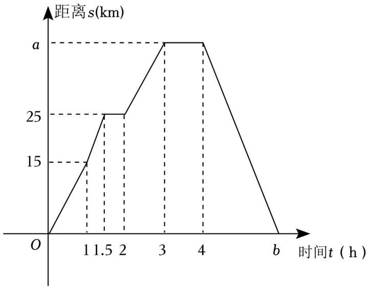

line chart

| 时间t (h) | 距离s (km) |
| --------- | ---------- |
| 0         | 0          |
| 1         | 15         |
| 1.5       | 25         |
| 2         | 25         |
| 3         | a          |
| 4         | a          |
| b         | 0          |

