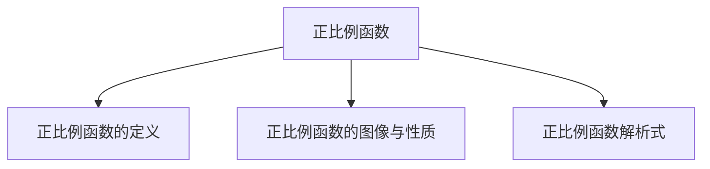

# 第 03讲 正比例函数

## 01

## 学习目标

<table><tr><td>课程标准</td><td>学习目标</td></tr><tr><td>1正比例函数的定义2正比例函数的图像与性质3正比例函数的解析式</td><td>1. 掌握正比例函数的定义,能够准确的判断正比例函数以及根据定义求值。2. 掌握正比例函数的图像与性质,并能够熟练的运用图像与性质解决相应的题目。3. 掌握待定系数法求正比例函数的解析式。</td></tr></table>

## 02

## 思维导图

flowchart

##

##

## 知识点01 正比例函数的定义

## 1. 正比例函数的定义：

一般地，形如 $\scriptstyle y = k x ( k $ 为常数且 $. k \neq 0 )$ 的函数叫做正比例函数。其中，k 叫做 比例系数

注意：①自变量系数不能为 0

②自变量次数一定是 1 。

③正比例函数解析式中，自变量后面为 0

## 【即学即练1】

## 1．下面各组变量的关系中，成正比例关系的有（ ）

## A．人的身高与年龄

B．汽车从甲地到乙地，所用时间与行驶速度  
C．正方形的面积与它的边长  
D．圆的周长与它的半径

【分析】判断两个相关联的量之间成什么比例，就看这两个量是对应的比值一定，还是对应的乘积一定；如果是比值一定，就成正比例；如果是乘积一定，则成反比例

【解答】解：A、人的身高与年龄不成比例，故此选项不符合题意；

B、汽车从甲地到乙地，所用时间与行驶速度成反比例关系，故此选项不符合题意；  
C、正方形的面积与它的边长的平方成正比例，故此选项不符合题意；  
D、圆的周长与它的半径成正比例关系，故此选项符合题意；

故选：D

## 【即学即练2】

2．在下列函数中，正比例函数是（ ）

A． $y = 2 x - 1$

B． $y = - ~ 2 x + 1$

C． $y = 2 x$

D． $y = 2 x ^ { 2 } + 1$

【分析】根据正比例函数的概念即可得出正确的答案

【解答】解：A． $y = 2 x \mathrm { ~ - ~ } 1$ 不是正比例函数，故该选项不符合题意；

B． $y = - ~ 2 x + 1$ 不是正比例函数，故该选项不符合题意；  
C．y＝2x 是正比例函数，故该选项符合题意；  
D． $y = 2 x ^ { 2 } + 1$ 不是正比例函数，故该选项不符合题意

故选：C

## 【即学即练3】

3．若函数 $\nu = - \ x ^ { a ^ { - } 3 } + b - 1$ 是关于 x 的正比例函数，则 a+b 的平方根为 $\pm \sqrt { 5 } _ { - }$

【分析】根据正比例函数的基本形式 y＝kx（k为常数），求出 a，b 的值，再求平方根即可

【解答】解：∵数 $y = - \ x ^ { a ^ { - } 3 } + b - 1$ 是关于 x 的正比例函数，

$$
\begin{array}{l} \therefore a - 3 = 1, b - 1 = 0, \\ \therefore a = 4, b = 1, \\ \end{array}
$$

$\therefore a + b$ 的平方根为 $\pm { \sqrt { 4 + 1 } } = \pm { \sqrt { 5 } }$

故答案为： $\pm \sqrt { 5 }$

## 知识点02 正比例函数的图像与性质

1. 正比例函数的图像与性质：

<table><tr><td>k的取值k&gt;0</td><td>经过象限一、三</td><td>大致图像</td><td>y随x的变化情况y随x的增大而增大</td></tr><tr><td>k&lt;0</td><td>二、四</td><td></td><td>y随x的增大而减小</td></tr></table>

正比例函数的图像是必经过 原点 的一条直线。在画正比例函数图像时，还需确定除原点外的另一个点即可。

## 【即学即练1】

4．下列关于正比例函数 $y = 3 x$ 的说法中，正确的是（ ）

A．当 x＝3时，y＝1  
B．它的图象是一条过原点的直线  
C．y 随 x 的增大而减小  
D．它的图象经过第二、四象限

【分析】根据正比例函数的性质对各选项进行逐一分析即可

【解答】解：A、当 x＝3 时，y＝9，故本选项错误；

B、∵直线 $y = 3 x$ 是正比例函数，∴它的图象是一条过原点的直线，故本选项正确；  
C、 $\because k = 3 > 0 , ~ \therefore y$ 随 x 的增大而增大，故本选项错误；  
D、∵直线 y＝3x 是正比例函数， $k { = } 3 > 0$ ，∴此函数的图象经过一三象限，故本选项错误

故选：B．

## 知识点03 正比例函数解析式

1. 待定系数法求函数解析式

具体步骤：

①设：设 正比例 函数解析式 $y = k x { \big ( } k \neq 0 { \big ) }$ 。  
②带：把已知点带入函数解析式中，得到关于未知系数k 的方程。  
③解方程：解步骤②中得到的方程，得到比例系数k 的值。  
④反带：将求得的比例系数带入函数解析式即可

## 【即学即练1】

5．已知 y 与 x成正比例，且当 $x = - 6$ 时， $y = 2$

（1）求 y 与 x 之间的函数关系式；  
（2）设点 $\left( a , \quad - 3 \right)$ ）在这个函数的图象上，求 a 的值

【分析】（1）设 $y = k x$ ，然后把当 $x = - \ 6 , \ y = 2$ 代入求出 k 即可；

（2）把（a，﹣3）代入（1）中的解析式可得到 a的值

【解答】解：（1）设 $y = k x ,$ ，

∵当 x＝﹣6 时， $y = 2$ ，

$$
\therefore 2 = - 6 k,
$$

解得 $k = - \frac { 1 } { 3 }$ ，

$\therefore y$ 与 x 之间的函数关系式为 $y = - \frac { 1 } { 3 } x ;$ ；

（2）把 $( a , \mathrm { ~ \textit ~ { ~ - ~ } ~ } 3 )$ 代入 $y = - \frac { 1 } { 3 } x$ 得 $\mathbf { \partial } - 3 = \mathbf { \partial } - \frac { 1 } { 3 } a$ ，

解得 a＝9，

即 a的值为 9

## 题型精讲

## 题型 01 判断正比例函数

【典例 1】下列函数中是正比例函数的是（ ）

A． $y = - \ 7 x$

B． $y = \frac { - 7 } { \frac { x } { 3 } }$

C． $y = 2 x ^ { 2 } + 1$

D． $y = 0 . 6 x - 5$

【分析】利用正比例函数定义进行解答即可

【解答】解： $A \cdot \ y = - \ 7 x$ 是正比例函数，故此选项符合题意；

$y = \frac { - 7 } { \frac { x } { 3 } }$ 是反比例函数，故此选项不合题意；

C、 $y = 2 x ^ { 2 } + 1$ 是二次函数，故此选项不合题意；

D、 $y = 0 . 6 x \mathrm { ~ - ~ } 5$ 是一次函数，故此选项不合题意；

故选：A．

【变式 1】下列关系中，属于成正比例函数关系的是（ ）

A．正方形的面积与边长

B．三角形的周长与边长

C．圆的面积与它的半径  
D．速度一定时，路程与时间

【分析】分别得出各个选项中的两个变量的函数关系式，进而确定是正比例函数

【解答】解：正方体的面积是边长的平方，即： $S { = } a ^ { 2 }$ ，因此 A 选项不符合题意；

三角形的周长＝三边之和，变量不止一个，因此 B 选项不符合题意；

圆的面积 $S { = } { \pi } r ^ { 2 }$ ，S是 r 的二次函数，因此 C 选项不符合题意；

路程＝速度×时间，因此选项 D 符合题意；

故选：D．

【变式 2】x、y是两种相关联的量，下面（ ）中的 x、y 成正比例关系

A． $\mathbf { y } = \frac { 6 } { 1 1 } \mathbf { x }$

B． $\frac { x } { 1 2 } = \frac { 1 } { y }$

C． $x + y = 1 0$

D． $\frac { 5 } { x } = y$

【分析】直接利用正比例函数的定义分析得出答案

【解答】解： $\boldsymbol { \mathscr { A } } \setminus \boldsymbol { y } { = } \frac { 6 } { 1 1 } \boldsymbol { x } , ~ \boldsymbol { x } \setminus \boldsymbol { y }$ 成正比例关系，故此选项符合题意；

B、 $\frac { \texttt { x } } { 1 2 } = \frac { 1 } { \texttt { y } }$ 则 $x y = 1 2$ ，即 $y = \frac { 1 2 } { \mathbf { x } }$ ，x 和 y成反比例关系，故不符合题意；

C、 $x + y = 1 0 , \ x$ 和 y不成正比例关系，故此选项不符合题意；

$y = \frac { 5 } { x }$ x 和 y成反比例关系，故此选项不符合题意

故选：A

## 题型 02 根据正比例函数的定义求值

【典例1】若函数 $y = - 2 x + m$ 是关于 x 的正比例函数，则 m 的值为（ ）

A．﹣1

B．0

C．1

D．2

【分析】根据正比例函数的定义，求出 m 的值即可

【解答】解：∵函数 $y = - ~ 2 x + m$ 是正比例函数，

$$
\therefore m = 0,
$$

故选：B

【变式1】若函数 $y = { x + 1 } - m$ 是正比例函数，则 m 的值是（ ）

A．2

B．1

C．﹣1

D．0

【分析】根据正比例函数的定义得出关于 m 的方程，求出 m 的值即可

【解答】解：∵函数 $y = x + 1 - m$ 是正比例函数，

$$
\therefore 1 - m = 0,
$$

解得 $m = 1$

故选：B．

【变式2】若函数 $y = ( k { + } 1 ) x { + } b - 2$ 是正比例函数，则（ ）

A．k≠﹣1，b＝﹣2

B．k≠1，b＝﹣2

C．k＝1，b＝﹣2

D．k≠﹣1，b＝2

【分析】根据正比例函数的定义可知 $k { + } 1 { \neq } 0$ ，b﹣2＝0，从而可求得 k、b 的值

【解答】解： $\because y = ( k + 1 ) x + b - 2$ 是正比例函数，

$$
\therefore k + 1 \neq 0, b - 2 = 0.
$$

解得 $k \neq - \ 1 , b { = } 2$

故选：D

【变式3】若函数 $y = x + k ^ { 2 } - 1$ 是正比例函数，则 k 的值为（ ）

A．﹣1

B．0

C．2

D．±1

【分析】根据正比例函数的概念和一般形式可得出关于 k 的式子，即可得出 k的值

【解答】解： $\because y = x + k ^ { 2 } - 1$ ，

$$
\therefore k ^ {2} - 1 = 0,
$$

解得： $k = \pm 1 ;$

故选：D．

【变式4】若函数 $y = ( k + 2 ) x + k ^ { 2 } - 4$ 是正比例函数，则 k 的值是（ ）

A． $k { \neq } - 2$

B． $k = \pm 2$

C．k＝2

$k = \frac { 1 } { 2 }$

【分析】根据正比例函数的定义得出 $k { + } 2 { \neq } 0$ 且 $k ^ { 2 } - 4 = 0$ ，再求出 k 即可

【解答】解： $\because y = ( k + 2 ) x + k ^ { 2 } - 4$ 是正比例函数，

$$
\therefore k + 2 \neq 0 \text {且} k ^ {2} - 4 = 0,
$$

解得：k＝2

故选：C

【变式5】若 $y = ( a - 1 ) x + a ^ { 2 } - 1$ 是关于 x的正比例函数，则 $a ^ { 2 0 2 3 }$ 的值为 ﹣1

【分析】利用正比例函数的定义分析得出 a，再代入计算即可求解

【解答】解： $\because y = ( a - 1 ) x + a ^ { 2 } - 1$ 是关于 x 的正比例函数，

$$
\therefore a ^ {2} - 1 = 0 \text {且} a - 1 \neq 0,
$$

解得：a＝﹣1，

$$
\therefore a ^ {2 0 2 3} = (- 1) ^ {2 0 2 3} = - 1.
$$

故答案为：﹣1

## 题型 02 正比例函数的图像与性质

【典例 1】已知正比例函数 ${ { y } = } k x \ ( \ k$ 是常数， $k { \neq } 0 )$ ），y 随 x 的增大而增大，写出一个符合条件的 k 的值 1（答案不唯一）

【分析】根据正比例函数的增减性可知 k＞0，写出符合条件的 k的值即可

【解答】解：∵正比例函数 $\scriptstyle { y = k x \ ( k }$ 是常数， $k { \neq } 0 )$ ），y 随 x的增大而增大，

$$
\therefore k > 0,
$$

∴k的值可以为 1

故答案为：1（答案不唯一）

【变式 1】已知正比例函数 $y = k x ,$ ，当 x每增加 1时，y 减少 2，则 k的值为（ ）

$- { \frac { 1 } { 2 } }$

B． $\frac 1 2$

C．2

D．﹣2

【分析】根据题意可得： $y \ - \ 2 = k \ ( x { + } 1 )$ ），再求解即可

【解答】解：∵正比例函数 $y = k x$ ，当 x 每增加 1 时，y 减少 2，

$\therefore y - 2 = k ( x + 1 )$ ），即 $y - 2 = k x + k$ ，

$$
\therefore k = - 2.
$$

故选：D．

【变式 2】正比例函数 $y = a x$ 的图象经过第一、三象限，则直线 $y = \mathrm { ~ ( ~ - ~ } a \mathrm { ~ - ~ } 1 \mathrm { ) }$ x 经过（ ）

A．第一、三象限

B．第二、三象限

C．第二、四象限

D．第三、四象限

【分析】根据正比例函数 y＝ax的图象经过一、三象限，可以得到 $a > 0$ ，从而可以得到﹣ $a \mathrm { ~ - ~ } 1 { < } 0$ ，再根据正比例函数的性质，即可得到直线 $y = \mathrm { ~ ( ~ - ~ } a \mathrm { ~ - ~ } 1 \mathrm { ) }$ x 经过的象限

【解答】解：∵正比例函数 $y = a x$ 的图象经过一、三象限，

$$
\therefore a > 0,
$$

$$
\therefore - a - 1 <   0,
$$

∴直线 $y = \mathrm { ~ ( ~ - ~ } a \mathrm { ~ - ~ } 1 \mathrm { ~ ) ~ } x$ 经过第二、四象限，

故选：C

【变式 3】已知正比例函数 $y = \mathrm { ~ ( ~ - ~ } k ^ { 2 } - 2 \mathrm { ) ~ }$ x，那么它的图象经过（ ）

A．第一、三象限

B．第一、二象限

C．第二、四象限

D．第三、四象限

【分析】首先确定比例系数的符号，然后再由正比例函数的性质求解即可

【解答】解： $\because - k ^ { 2 } - 2 < 0$ ，

∴图象过二、四象限

故选：C

【变式 4】对于正比例函数 y＝3x，当 $2 { \leqslant } x { \leqslant } 4$ 时，y 的最大值等于 12

【分析】先根据题意判断出函数的增减性，进而可得出结论

【解答】解：∵正比例函数 $y = 3 x$ 中， $k { = } 3 > 0$ ，

$\therefore y$ 随 x的增大而增大，

$$
\because 2 \leqslant x \leqslant 4,
$$

∴当 $x { = } 4$ 时， $y _ { \scriptstyle { \frac { 1 } { 4 x } } \neq { } } = 3 \times 4 = 1 2$

故答案为：12

【变式5】若 $y = ( m - 2 ) \ x + m ^ { 2 } - 4$ 是 y 关于 x的正比例函数，如果点 $A \ ( m , \ a )$ 和点 $B \ ( \ - \ m , \ b )$ ）在该函数的图象上，那么 a 和 b 的大小关系是（ ）

A． $a { < } b$

B． $a > b$

C． $a { \leqslant } b$

D． $a { \geqslant } b$

【分析】利用正比例函数的定义可求出 m 值，进而可得出正比例函数解析式，由 $k = \mathrm { ~ - ~ } 4 < 0$ ，利用正比例函数的性质可得出 y随 x的增大而减小，再结合 $m < - \ m$ ，即可得出 $a > b$

【解答】解： $\because y = ( m - 2 ) x + m ^ { 2 } - 4$ 是 y关于 x 的正比例函数，

$$
\therefore \left\{ \begin{array}{l} \mathrm{m-2} \neq 0 \\ \mathrm{m} ^ {2} - 4 = 0 \end{array} , \right.
$$

$$
\therefore m = - 2,
$$

∴正比例函数的解析式为 $y = - ~ 4 x$

$$
\because k = - 4 <   0,
$$

$\therefore y$ 随 x的增大而减小，

又∵点 $A ( m , \ a )$ ）和点 $B ^ { \mathrm { ~ \scriptsize ~ ( ~ - ~ } m , \mathrm { ~ \scriptsize ~ \it ~ b ~ ) ~ } }$ ）在该函数的图象上，且 $m < - \ m$ ，

$$
\therefore a > b.
$$

故选：B．

## 题型 02 利用待定系数法求正比例函数解析式

【典例 1】已知正比例函数 $y = k x$ 的图象经过点（2，4），k的值是（ ）

A．﹣2

$- \frac { 1 } { 2 }$

C．2

D．1

【分析】把点（2，4），代入正比例函数 $y = k x$ ，求出 k 的数值即可

【解答】解：把点（2，4），代入正比例函数 $y = k x$ 得

$$
4 = 2 k,
$$

解得 k＝2

故选：C

【变式 1】已知 y 与 x 成正比例且当 $x { = } 2$ 时， $y = 4$ ．

（1）求 y 与 x 之间的函数表达式；  
（2）当 $y = 2$ 时，x 的值是多少？

【分析】（1）利用待定系数法求正比例函数解析式即可；

（2）利用（1）中解析式计算函数值为 2所对应的自变量的值即可；

【解答】解：（1）设 $y = k x \ ( k \neq 0 )$ ），

将 $x { = } 2 , \ y { = } 4$ 代入得： $4 { = } 2 k ,$

$$
k = 2,
$$

$$
\therefore y = 2 x;
$$

（2）当 $y = 2$ 时， $2 = 2 x , x = 1$ ，

∴当 $y = 2$ 时，x 的值为 1

【变式 2】已知：如图，正比例函数 $y = k x$ 的图象经过点 A，

（1）请你求出该正比例函数的解析式；  
（2）若这个函数的图象还经过点 $B ( m , m + 3 )$ ），请你求出 m 的值

text_image

y
A
2
-1 O x

【分析】（1）把点 A 的坐标代入 $y = k x$ 中求出 k 即可；

（2）把点 $B ( m , m + 3 )$ ）代入（1）中的解析式得到关于 m 的一次方程，然后解一次方程即可

【解答】解：（1）把 A（﹣1，2）代入 $y = k x$ 得﹣k＝2，

解得 $k = - ~ 2 .$ ，

∴正比例函数解析式为 $y = - \ 2 x ;$ ；

（2）将点 $B ( m , m + 3 )$ ）代入 $y = - ~ 2 x \not  - 2 m = m + 3$ ，

解得 $m = - ~ 1$

即 m 的值为﹣1

【变式3】已知 $y = y _ { 1 } + y _ { 2 } , \ y _ { 1 }$ 与 x 成正比例，y2 与 x﹣3成正比例，当 $x = - 1$ 时， $y = 4$ ；当 $x { = } 1$ 时， $y = 8$ ，求 y 与 x 之间的函数关系式

【分析】根据题意设 $y 1 = k _ { 1 } x , y _ { 2 } = k _ { 2 } ( x - 3 )$ ），从而可得 $y = k _ { 1 } x + k _ { 2 } ( x - 3 )$ ），然后把 $x = - \ 1 , \ y = 4$ 和 $x =$ $1 , \ y = 8$ 代入联立方程组，进行计算即可解答

【解答】解：设 $y _ { 1 } = k _ { 1 } x , y _ { 2 } = k _ { 2 } ( x - 3 )$ ），

则 $y = y _ { 1 } + y _ { 2 } = k _ { 1 } x + k _ { 2 } ( x - 3 )$ ），

由题意得： $\left\{ \begin{array} { l l } { - \mathbf { k } _ { 1 } - 4 \mathbf { k } _ { 2 } = 4 } \\ { \mathbf { k } _ { 1 } - 2 \mathbf { k } _ { 2 } = 8 } \end{array} \right. ,$

解得： $\left\{ \begin{array} { l l } { \mathbf { k } _ { 1 } = 4 } \\ { \mathbf { k } _ { 2 } = - 2 } \end{array} \right. ,$ ，

$\therefore y$ 与 x之间的函数关系式为： $y = 4 x - 2 ( x - 3 )$ ），

即 $y = 2 x + 6$

$\therefore y$ 与 x之间的函数关系式为： $y = 2 x + 6$

【变式 4】已知 $y = y _ { 1 } - 2 y _ { 2 }$ 中，其中 y1 与 x 成正比例，y2与 $\left( { x + 1 } \right)$ ）成正比例，且当 $x = 1$ 时， $y = 3$ ；当 x＝2 时，y＝5．

（1）求 y 与 x 的函数关系式；  
（2）若点（a，3）在这个函数图象上，求 a 的值

【分析】（1）y1 与 x 成正比例，可设 $y _ { 1 } = k _ { 1 } x , y _ { 2 }$ 与（x+1）成正比例，可把 x+1 看成一个整体，设 $y _ { 2 } =$ $k _ { 2 } ( x { + } 1 )$ ），利用待定系数法即可求解；

（2）把 $x = a , y = 3$ 代入解析式解答即可

【解答】解：（1）设 $y _ { 1 } = k _ { 1 } x , y _ { 2 } = k _ { 2 } ( x + 1 )$ ），则 $y = k _ { 1 } x - 2 k _ { 2 } ( x + 1 )$ ），

$\left\{ \begin{array} { l l } { 3 = \operatorname { k } _ { 1 } - 4 \operatorname { k } _ { 2 } } \\ { 5 = 2 \operatorname { k } _ { 1 } - 6 \operatorname { k } _ { 2 } } \end{array} \right.$ 3=k1-4k2 根据题意得

解得： $\left\{ \begin{array} { l l } { \displaystyle \mathrm { k } _ { 1 } = 1 } \\ { \displaystyle \mathrm { k } _ { 2 } = - \frac { 1 } { 2 } } \end{array} \right.$

$$
\therefore y = x - 2 \times \left(- \frac {1}{2}\right) (x + 1) = 2 x + 1;
$$

（2）把 $x = a , y = 3$ 代入解析式 $y = 2 x + 1$ ，

可得： $2 a { + } 1 { = } 3$ ，

解得：a＝1

## 05

## 强化训练

1．正比例函数 $y = - ~ 3 x$ 的图象经过（ ）象限．

A．第一、三象限

B．第二、四象限

C．第一、四象限

D．第二、三象限

【分析】根据正比例函数 $y = k x \ ( k { \neq } 0 )$ k 的符号即可确定正比例函数 $y = - \ 3 x$ 的图象经过的象限

【解答】解：在正比例函数 $y = - \ 3 x$ 中，

$$
\because k = - 3 <   0,
$$

∴正比例函数 $y = - \ 3 x$ 的图象经过第二、四象限，

故选：B．

2．下列函数（其中 x 是自变量）中，一定是正比例函数的是（ ）

A． $y = \frac { 2 } { \tt x }$

$y = - \frac { \texttt { x } } { 3 }$

C． $y = - 3 x + 2$

D． $y = k x$

【分析】根据正比例函数、一次函数、反比例函数的定义对各小题进行逐一判断即可

【解答】解： $\scriptstyle A \ , \ y = { \frac { 2 } { \tt x } }$ 是反比例函数；

$y = \frac { \mathtt { x } } { 3 }$ 是正比例函数；

C、 $y = - ~ 3 x + 2$ 是一次函数；

D、当 k＝0时，不是正比例函数

故选：B

3．点 A（1，m）在函数 $y = 2 x$ 的图象上，则 m 的值是（ ）

A．1

B．2

C ． $\frac 1 2$

D．0

【分析】用代入法即可

【解答】解：把 x＝1，y＝m 代入 $y = 2 x$ ，

解得： $m = 2$

故选：B．

4．已知函数 $y = ( m + 1 ) x ^ { n ^ { 2 } } - 3$ 是正比例函数，且图象在第二、四象限内，则 m 的值是（ ）

A．2

B．﹣2

C．±2

$- \frac { 1 } { 2 }$

【分析】根据正比例函数的定义，正比例函数的性质，可得答案

【解答】解：由题意，得

$m ^ { 2 } - 3 = 1$ ，且 $m { + } 1 { < } 0$ ，

解得 $m = - ~ 2$ ，

故选：B．

5．已知函数 $y = k x \ ( \ k \neq 0$ ，k 为常数）的函数值 y 随 x值的增大而减小，那么这个函数图象可能经过的点是

A．（0.5，1）

B．（2，1）

C．（﹣2，4）

D．（﹣2，﹣2）

【分析】由函数 y＝kx（k≠0，k为常数）的函数值 y 随 x 值的增大而减小，可得出 k＜0，进而可得出正比例函数 y＝kx（k≠0，k 为常数）的图象经过第二、四象限，再对照四个选项即可得出结论

【解答】解：∵函数 $y = k x \ ( \ k \neq 0$ ，k 为常数）的函数值 y 随 x 值的增大而减小，

$$
\therefore k <   0,
$$

∴正比例函数 $y = k x \ ( \ k \neq 0$ ，k 为常数）的图象经过第二、四象限，

∴这个函数图象可能经过的点是（﹣2，4）

故选：C

6．若函数 $y = ( k + 2 ) x + k ^ { 2 } - 4$ 是正比例函数，则 k的值为（ ）

A．0

B．2

C．±2

D．﹣2

【分析】根据正比例函数的定义得出 $k { + } 2 { \neq } 0$ 且 $k ^ { 2 } - 4 = 0$ ，再求出 k 即可

【解答】解： $\because y = ( k + 2 ) x + k ^ { 2 } - 4$ 中，y 是 x 的正比例函数，

$$
\therefore k + 2 \neq 0 \text {且} k ^ {2} - 4 = 0,
$$

解得：k＝2，

故选：B．

7．已知正比例函数的图象如图所示，则这个函数的关系式为（ ）

text_image

y
3
O
x
-3

A． $y = x$

B．y＝﹣x

C．y＝﹣3x

D． $y = - \mathbf { \nabla } x / 3$

【分析】首先根据图象是经过原点的直线可得此函数是正比例函数，故设解析式为 $y = k x \ ( k { \neq } 0 )$ ），把图象所经过的点（3，﹣3）代入设出的函数解析式，计算出 k的值，进而得到函数解析式

【解答】解：设函数解析式为 $y = k x \ ( k { \neq } 0 )$ ），

∵图象经过（3，﹣3），

$$
\therefore - 3 = k \times 3,
$$

解得 k＝﹣1，

∴这个函数的关系式为 $y = - \ x$

故选：B．

8．已知点 P（m，0）在 x 轴负半轴上，则函数 y＝mx 的图象经过（ ）

A．二、四象限

B．一、三象限

C．一、二象限

D．三、四象限

【分析】根据题意得出 m＜0，继而根据正比例函数图象的性质即可求解

【解答】解：∵点 P（m，0）在 x 轴负半轴上，

$$
\therefore m <   0,
$$

∴函数 y＝mx 的图象经过二、四象限，

故选：A．

9．已知 $y = ( 2 m - 1 ) \times \pi ^ { 2 } - 3$ 是正比例函数，且 y 随 x 的增大而减小，那么这个函数的解析式为（ ）

A． $y = - \ 5 x$

B． $y = 5 x$

C．y＝3x

D． $y = - \ 3 x$

【分析】根据正比例函数的定义和性质列出关于 m 的不等式组，求出 m 的值即可

【解答】解：由题意知 $m ^ { 2 } - 3 = 1$ 且 $2 m - 1 < 0$ ，

解得 $m = \pm 2$ ，且 $m < \frac { 1 } { 2 }$

$$
\therefore m = - 2.
$$

$$
\therefore y = - 5 x.
$$

故选：A．

10．若函数 $y = k x$ 的图象上有两点 $A ( x _ { 1 } , \ y _ { 1 } ) , \ B ( x _ { 2 } , \ y _ { 2 } )$ ），当 $x _ { 1 } > x _ { 2 }$ 时， $y _ { 1 } { < } y _ { 2 }$ ，则 k 的值可以是（ ）

A．﹣2

B．0

C．1

D．2

【分析】利用正比例函数的增减性求出 k 的取值范围，结合选项即可得到答案

【解答】解：∵正比例函数 $y = k x$ 图象上有两点 $A ( x _ { 1 } , \ y _ { 1 } ) , \ B ( x _ { 2 } , \ y _ { 2 } )$ ），当 $x _ { 1 } > x _ { 2 }$ 时， $y _ { 1 } { < } y _ { 2 }$ ，$\therefore y$ 随 x的增大而减小，

$$
\therefore k <   0,
$$

结合选项，四个选项中只有﹣2在 k＜0 的范围内

故选：A

11．如果函数 $y = \begin{array} { l } { ( m { + } 2 ) } \end{array} x ^ { | m | ^ { - } 1 }$ 是正比例函数，则 m 的值是 2

【分析】根据正比例函数的定义可得关于 m 的方程，解出即可

【解答】解：由正比例函数的定义可得： $m + 2 \ne 0 , | m | - 1 = 1$ ，

$$
\therefore m = 2.
$$

故填 2．

12．函数 $y = \frac { x } { 2 \pi - 3 }$ （m 为常数）中，y 的值随 x 的增大而减小，那么 m 的取值范围是 $\_ m < \frac { 3 } { 2 }$

【分析】根据正比例函数性质解答即可

【解答】解： $\because y = k x , k < 0$ 时，y 的值随 x 的增大而减小，

$\therefore \frac { 1 } { 2 \pi - 3 } < 0$ ，即 $2 m - 3 < 0$

解得 $m < \frac { 3 } { 2 }$

故答案为： $m < \frac { 3 } { 2 }$

13．已知 y 与 x+1 成正比例，当 x＝1 时，y＝4，则当 x＝2 时，y的值是 6

【分析】设 $y = k \ ( x { + } 1 ) \ ( k { \neq } 0 )$ ），把 $x = 1 , \ y = 4$ 代入并求得 k的值；然后求当 x＝2 时所对应的 y 的值即可．

【解答】解：设 $y = k ( x + 1 ) ( k \neq 0 )$ ），

把 $x = 1 , y = 4$ 代入，得 $k \times \ ( 1 { + } 1 ) \ = 4$

解得 k＝2

所以当 x＝2 时， $y = 2 ( 2 + 1 ) = 6$

故答案为：6

14．已知正比例函数 $y = \left( m + 1 \right) x + m ^ { 2 } - 4$ ，若 y 随 x 的增大而减小，则 m 的值是 ﹣2

【分析】先根据正比例函数的定义列出关于 m 的方程，求出m 的值，再根据此正比例函数 y 随 x 的增大而减小即可求出 m 的值

【解答】解：∵函数 $y = ( m + 1 ) x + m ^ { 2 } - 4$ 是正比例函数，

$$
\therefore m ^ {2} - 4 = 0,
$$

解得： $m = \pm 2$ ，

$\because y$ 随 x的增大而减小，

$$
\therefore m + 1 <   0,
$$

$$
\therefore m <   1,
$$

$$
\therefore m = - 2,
$$

故答案为：﹣2．

15．在同一坐标系中，如图所示，一次函数 $y = k _ { 1 } x , y = k _ { 2 } x , y = k _ { 3 } x , y = k _ { 4 } x$ 的图象分别为 $l _ { 1 } , l _ { 2 } , l _ { 3 } , l _ { 4 } $ ，则 $k _ { 1 } , ~ k _ { 2 } , ~ k _ { 3 } , ~ k _ { 4 }$ 的大小关系是 $k _ { 3 } > k _ { 4 } > k _ { 1 } > k _ { 2 }$

text_image

y
l₂
l₃
l₁
O
x
l₄

【分析】想知道 k 之间的大小关系，图中又无其他信息，对此我们可以自己找点来近似的估计 k 值，如可近似估计四条线上的各一个异于（0，0）的点，然后代入求出 $k 1 \setminus k 2 \setminus k 3 \setminus k 4$ ．再比较即可

【解答】解：把 x＝1 代入 $y = k _ { 1 } x , y = k _ { 2 } x , y = k _ { 3 } x , y = k _ { 4 } x$ 中，

可得： $k _ { 3 } > k _ { 4 } > k _ { 1 } > k _ { 2 }$

故答案为： $k _ { 3 } > k _ { 4 } > k _ { 1 } > k _ { 2 }$

16．已知 y 关于 x 的函数 $y = 4 x + m - 3$

（1）若 y 是 x 的正比例函数，求 m 的值；  
（2）若 m＝7，求该函数图象与 x轴的交点坐标

【分析】（1）根据正比例函数的定义即可得出 m 的值；

（2）当 m＝7 时，函数为一次函数，令 $y = 0$ ，即可得出图象与 x 轴的交点坐标

【解答】解：（1）∵y是 x的正比例函数， $\therefore m - 3 = 0$ ，

解得 $m = 3$

故 m 的值为：3

（2）当 $m = 7$ 时，该函数的表达式为 $y = 4 x + 4$ ，

令 $y = 0$ ，得 $4 x + 4 = 0$ ，

解得 $x = - \ 1 , \therefore$ 当 $m = 7$ 时，该函数图象与 x 轴的交点坐标为（﹣1，0）

17．已知：函数 $y = ( b + 2 ) x ^ { 2 } - 3$ 且 y 是 x的是正比例函数， $5 a { + 4 }$ 的立方根是 4，c 是 $\sqrt { 1 1 }$ 的整数部分．

（1）求 $a , \ b , \ c$ 的值；  
（2）求 $2 a - b + c$ 的平方根

【分析】（1）根据正比例函数的定义、立方根、估算无理数的大小确定 $a , \ b , \ c$ 的值；

（2）把（1）中 $a , \ b , \ c$ 的值代入计算求得 $2 a - b + c$ ，进而即可求得 $2 a - b + c$ 的平方根

【解答】解： $( 1 ) \because$ 函数 $y = ( b + 2 ) x ^ { 2 } - 3$ 且 y 是 x 的是正比例函数，

$$
\begin{array}{l} \therefore \left\{ \begin{array}{l} b + 2 \neq 0 \\ b ^ {2} - 3 = 1 \end{array} , \right. \\ \therefore b = 2, \\ \end{array}
$$

$\because 5 a { + 4 }$ 的立方根是 4，

$$
\therefore 5 a + 4 = 4 ^ {3},
$$

$$
\therefore a = 1 2,
$$

$\because c$ 是 $\sqrt { 1 1 }$ 的整数部分，

$$
\therefore c = 3;
$$

（2） $2 a - b + c = 2 \times 1 2 - 2 + 3 = 2 5$ ，则 $2 a - b + c$ 的平方根为±5

18．已知 y 关于 x 的函数 $y = \ ( 2 m + 6 ) x + m - 3$ ，且该函数是正比例函数

（1）求 m 的值；  
（2）若点 $( a , \ y _ { 1 } ) , \ ( a + 1 , \ y _ { 2 } )$ ）在该函数的图象上，请直接写出 y1，y2的大小关系

【分析】（1）利用正比例函数的定义，可得出关于 m 的一元一次不等式及一元一次方程，解之即可求出m 的值；

（2）由 $m = 3$ ，可得出 $k { = } 2 m { + } 6 { = } 1 2 { > } 0$ ，利用正比例函数的性质，可得出 y 随 x 的增大而增大，再结合$a { < } a { + } 1$ ，即可得出 $y _ { 1 } { < } y _ { 2 }$ ．

【解答】解：（1）∵函数 $y = \ ( 2 m + 6 ) x + m - 3$ 是正比例函数，

$$
\therefore \left\{ \begin{array}{l} 2 m + 6 \neq 0 \\ m - 3 = 0 \end{array} , \right.
$$

解得： $m = 3$ ，

$\therefore m$ 的值为 3；

（2） $\because m = 3$ ，

$$
\therefore k = 2 m + 6 = 2 \times 3 + 6 = 1 2 > 0,
$$

$\therefore y$ 随 x的增大而增大，

又∵点 $( a , \ y _ { 1 } ) , \ ( a + 1 , \ y _ { 2 } )$ 在该函数的图象上，且 $a { < } a { + } 1$ ，

$$
\therefore y _ {1} <   y _ {2}.
$$

19．已知 $y - 2$ 与 $3 x - 4$ 成正比例函数关系，且当 $x { = } 2$ 时， $y = 3$

（1）写出 y 与 x 之间的函数解析式；  
（2）若点 $\begin{array} { r l } { P \ ( a , \ } & { { } - \ 3 ) } \end{array}$ 在这个函数的图象上，求 a 的值；

（3）若 y 的取值范围为 $- \ 1 \leqslant y \leqslant 1$ ，求 x的取值范围

【分析】（1）根据正比例的定义设 $y - 2 = k \ ( 3 x - 4 )$ ），然后把 x＝2 时， $y = 3$ 代入计算求出 k 值，再整理即可得解；

（2）将点 $( a , \mathrm { ~ \textit ~ { ~ - ~ } ~ } 3 )$ 代入（1）中所求的函数的解析式求 a的值；

（3）分别代入 $y = - \ 1$ 和 y＝1，分别求出所对应的 x 的值，即可求得 x 的取值范围

【解答】解：（1）设 $y - 2 = k \ ( 3 x - 4 )$ ），

将 $x { = } 2 , \ y { = } 3$ 代入，得：2k＝1，解得 $k { = } \frac { 1 } { 2 }$ ，

$\therefore y - 2 = \frac { 1 } { 2 } ( 3 x - 4 )$ ，即 $y = \frac { 3 } { 2 } x ;$ ；

（2）将点 $\textit { P } \left( \boldsymbol { a } , \mathrm { ~  ~ { ~ - ~ } ~ } 3 \right)$ 代入 $y = { \frac { 3 } { 2 } } x .$ ，得： $\frac { 3 } { 2 } a = - \ 3$

解得： $a = - ~ 2 ;$ ；

（3）当 y＝﹣1 时， $\frac { 3 } { 2 } x = - \ 1$ ，解得： $x = - \frac { 2 } { 3 }$ ，

当 y＝1 时， ${ \frac { 3 } { 2 } } x = 1$ ，解得： $x { = } \frac { 2 } { 3 }$ ，

故 $- \frac { 2 } { 3 } \leq x \leq \frac { 2 } { 3 } .$ ≤x

20．已知 $y = y _ { 1 } + y _ { 2 } , \ y _ { 1 }$ 与 x﹣1 成正比，y2 与 x 成正比．当 x＝2 时， $y = 4 ;$ ；当 x＝﹣1 时， $y = - 5$

（1）求 y 与 x 的函数关系式；  
（2）当 x＝﹣5 时，求 y 的值；  
（3）当 y＞0时，求 x的取值范围．

【分析】（1） $y _ { 1 }$ 与 x﹣1 成正比例，可设 $y _ { 1 } = k _ { 1 } ~ ( x - 1 ) , ~ y _ { 2 }$ 与 x 成正比例，设 $y _ { 2 } = k _ { 2 } x$ ，利用待定系数法即可求解

（2）直接把 x 的值代入（1）中的函数关系式即可；  
（3）由 $y { > } 0$ 得到一元一次不等式，解不等式即可得到 x 的取值范围

【解答】解：（1）设 $y _ { 1 } = k _ { 1 } \ \left( x - 1 \right)$ ），设 $y _ { 2 } = k _ { 2 } x$ ，则 $y = k _ { 1 } ( x - 1 ) + k _ { 2 } x$ ，

根据题意得， $\left\{ \begin{array} { l l } { { \tt k } _ { 1 } + { \tt 2 k } _ { 2 } = 4 } \\ { { \tt 2 k } _ { 1 } + { \tt k } _ { 2 } = 5 } \end{array} \right. ,$

解得 $\left\{ { \bf k } _ { 1 } = 2 \atop { \bf k } _ { 2 } = 1  \right. \nonumber$

$$
\therefore y = 2 \times (x - 1) + x,
$$

即 $y = 3 x - 2$ ；

（2）把 $x = - \ 5 \nmid + \bigwedge \ \wedge \ y = 3 x - 2 \ \not  : \ y = - \ 1 5 - 2 = - \ 1 7 ;$  
（3） $\because y > 0$

$$
\therefore 3 x - 2 > 0,
$$

解得： $x { > } \frac { 2 } { 3 } .$