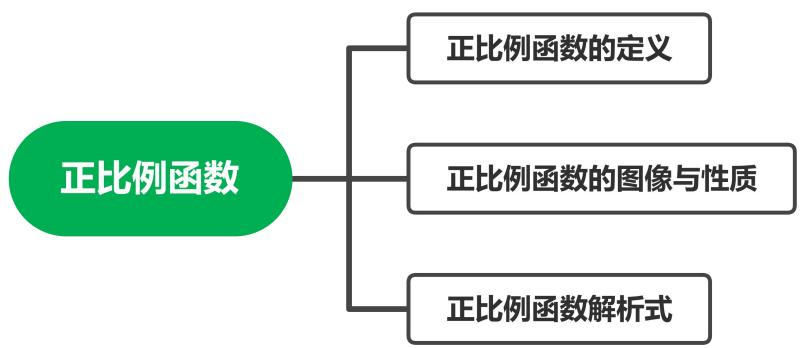
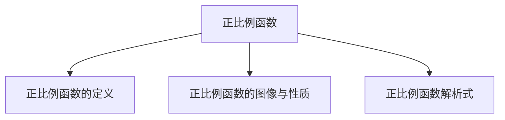
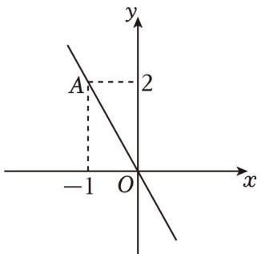
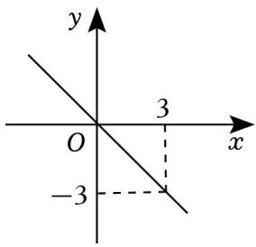
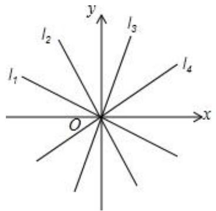

## 第 03讲 正比例函数

## 01

## 学习目标

<table><tr><td>课程标准</td><td>学习目标</td></tr><tr><td>1正比例函数的定义2正比例函数的图像与性质3正比例函数的解析式</td><td>1. 掌握正比例函数的定义,能够准确的判断正比例函数以及根据定义求值。2. 掌握正比例函数的图像与性质,并能够熟练的运用图像与性质解决相应的题目。3. 掌握待定系数法求正比例函数的解析式。</td></tr></table>

## 02

## 思维导图

flowchart

##

##

## 知识点01 正比例函数的定义

1. 正比例函数的定义：

一般地，形如 的函数叫做正比例函数。其中，k 叫做 。

注意：①自变量系数不能为

②自变量次数一定是 。

③正比例函数解析式中，自变量后面为

## 【即学即练1】

1．下面各组变量的关系中，成正比例关系的有（ ）

A．人的身高与年龄  
B．汽车从甲地到乙地，所用时间与行驶速度

C．正方形的面积与它的边长  
D．圆的周长与它的半径

## 【即学即练2】

2．在下列函数中，正比例函数是（ ）

A． $y = 2 x - 1$

B． $y = - ~ 2 x + 1$

C $y = 2 x$

D． $y = 2 x ^ { 2 } + 1$

## 【即学即练3】

3．若函数 $y = - \ x ^ { a ^ { - } 3 } + b - 1$ 是关于 x 的正比例函数，则 a+b 的平方根为

## 知识点02 正比例函数的图像与性质

1. 正比例函数的图像与性质：

<table><tr><td>k的取值</td><td>经过象限</td><td>大致图像</td><td>y随x的变化情况</td></tr><tr><td>k&gt;0</td><td>____</td><td></td><td>y随x的增大而____</td></tr><tr><td>k&lt;0</td><td>____</td><td></td><td>y随x的增大而____</td></tr></table>

正比例函数的图像是必经过 的一条直线。在画正比例函数图像时，还需确定除原点外的另一个点即可。

## 【即学即练1】

4．下列关于正比例函数 $y = 3 x$ 的说法中，正确的是（ ）

A．当 x＝3时，y＝1  
B．它的图象是一条过原点的直线  
C．y 随 x 的增大而减小  
D．它的图象经过第二、四象限

## 知识点03 正比例函数解析式

1. 待定系数法求函数解析式

具体步骤：

①设：设 函数解析式 $y = k x { \big ( } k \neq 0 { \big ) }$ 。

②带：把已知点带入函数解析式中，得到关于未知系数k 的方程。

③解方程：解步骤②中得到的方程，得到比例系数k 的值。

④反带：将求得的比例系数带入函数解析式即可

## 【即学即练1】

5．已知 y 与 x成正比例，且当 $x = - 6$ 时， $y = 2$

（1）求 y 与 x 之间的函数关系式；

（2）设点 $\left( a , \quad - 3 \right)$ 在这个函数的图象上，求 a 的值

text_image

题型精讲

## 题型 01 判断正比例函数

【典例 1】下列函数中是正比例函数的是（ ）

A． $y = - \ 7 x$

B．y $y = \frac { - 7 } { \frac { x } { 3 } }$

C $y = 2 x ^ { 2 } + 1$

D． $y = 0 . 6 x - 5$

【变式 1】下列关系中，属于成正比例函数关系的是（ ）

A．正方形的面积与边长

B．三角形的周长与边长

C．圆的面积与它的半径

D．速度一定时，路程与时间

【变式 2】x、y是两种相关联的量，下面（ ）中的 x、y 成正比例关系

A． $\mathbf { y } = \frac { 6 } { 1 1 } \mathbf { x }$

B． $\frac { x } { 1 2 } = \frac { 1 } { y }$ x

C． $x + y = 1 0$

D． $\frac { 5 } { x } = y$

## 题型 02 根据正比例函数的定义求值

【典例1】若函数 $y = - 2 x + m$ 是关于 x 的正比例函数，则 m 的值为（ ）

A．﹣1

B．0

C．1

D．2

【变式1】若函数 $y = { x + 1 } - m$ 是正比例函数，则 m 的值是（ ）

A．2

B．1

C．﹣1

D．0

【变式2】若函数 $y = ( k { + } 1 ) x { + } b - 2$ 是正比例函数，则（

A．k≠﹣1，b＝﹣2

B． $k { \neq } 1$ ， $b = - 2$

C．k＝1，b＝﹣2

D．k≠﹣1，b＝2

【变式3】若函数 $y = x + k ^ { 2 } - 1$ 是正比例函数，则 k 的值为（ ）

A．﹣1

B．0

C．2

D． $\pm 1$

【变式4】若函数 $y = ( k + 2 ) x + k ^ { 2 } - 4$ 是正比例函数，则 k 的值是（ ）

A． $k { \neq } - 2$

B． $k = \pm 2$

C．k＝2

D． $k = \frac { 1 } { 2 }$

【变式5】若 $y = ( a - 1 ) x + a ^ { 2 } - 1$ 是关于 x的正比例函数，则 $a ^ { 2 0 2 3 }$ 的值为

## 题型 03 正比例函数的图像与性质

【典例 1】已知正比例函数 $\scriptstyle { y = k x ( k }$ 是常数，k≠0），y 随 x 的增大而增大，写出一个符合条件的 k 的值

【变式 1】已知正比例函数 $y = k x .$ ，当 x每增加 1时，y 减少 2，则 k的值为（ ）

A ． $- { \frac { 1 } { 2 } }$

B． $\frac 1 2$

C．2

D．﹣2

【变式 2】正比例函数 y＝ax 的图象经过第一、三象限，则直线 y＝（﹣a﹣1）x 经过（ ）

A．第一、三象限

B．第二、三象限

C．第二、四象限

D．第三、四象限

【变式 3】已知正比例函数 $y = \mathrm { ~ ( ~ - ~ } k ^ { 2 } - 2 \mathrm { ~ ) ~ } x$ ，那么它的图象经过（ ）

A．第一、三象限

B．第一、二象限

C．第二、四象限

D．第三、四象限

【变式 4】对于正比例函数 $y = 3 x$ ，当 $2 { \leqslant } x { \leqslant } 4$ 时，y 的最大值等于

【变式5】若 $y = ( m - 2 ) \ x + m ^ { 2 } - 4$ 是 y 关于 x的正比例函数，如果点 $A \ ( m , \ a )$ ）和点 $B \ ( \ - \ m , \ b )$ ）在该函数的图象上，那么 a和 b的大小关系是（ ）

A． $a { < } b$

B． $a > b$

C． $a { \leqslant } b$

D． $a { \geqslant } b$

## 题型04 利用待定系数法求正比例函数解析式

【典例 1】已知正比例函数 $y = k x$ 的图象经过点（2，4），k 的值是（ ）

A．﹣2

$- \frac { 1 } { 2 }$

C．2

D．1

【变式 1】已知 y 与 x 成正比例且当 $x { = } 2$ 时， $y = 4$

（1）求 y 与 x 之间的函数表达式；

（2）当 y＝2时，x 的值是多少？

【变式 2】已知：如图，正比例函数 $y = k x$ 的图象经过点 A，

（1）请你求出该正比例函数的解析式；

（2）若这个函数的图象还经过点 $B ( m , m + 3 )$ ），请你求出 m 的值

text_image

y
A
2
-1 O x

【变式3】已知 $y = y _ { 1 } + y _ { 2 } , y _ { 1 }  x$ 成正比例， $y _ { 2 }$ 与 $x - 3$ 成正比例，当 $x = - 1$ 时， $y = 4 ;$ ；当 $x { = } 1$ 时， $y = 8$ ，求 $y$ 与 x 之间的函数关系式

【变式 4】已知 $y = y _ { 1 } - 2 y _ { 2 }$ 中，其中 $y 1$ 与 x 成正比例， $y _ { 2 }$ 与 $\left( { { x + 1 } } \right)$ ）成正比例，且当 $x = 1$ 时， $y = 3$ ；当 $x$

＝2 时，y＝5

（1）求 y 与 x 的函数关系式；  
（2）若点（a，3）在这个函数图象上，求 a 的值

1．正比例函数 $y = - \ 3 x$ 的图象经过（ ）象限．

A．第一、三象限

B．第二、四象限

C．第一、四象限

D．第二、三象限

2．下列函数（其中 x 是自变量）中，一定是正比例函数的是（ ）

$y = \frac { 2 } { \tt x }$

$y = - \frac { \texttt { x } } { 3 }$

C． $y = - 3 x + 2$

D． $y = k x$

3．点 A（1，m）在函数 $y = 2 x$ 的图象上，则 m 的值是（ ）

A．1

B．2

$\frac 1 2$

D．0

4．已知函数 $y = ( m + 1 ) x ^ { n ^ { 2 } } - 3$ 是正比例函数，且图象在第二、四象限内，则 m 的值是（ ）

A．2

B．﹣2

C．±2

D． $- \frac { 1 } { 2 }$

5．已知函数 $y = k x \ ( \ k \neq 0$ ，k 为常数）的函数值 y 随 x值的增大而减小，那么这个函数图象可能经过的点是（ ）

A．（0.5，1）

B．（2，1）

C．（﹣2，4）

D．（﹣2，﹣2）

6．若函数 $y = ( k + 2 ) x + k ^ { 2 } - 4$ 是正比例函数，则 k的值为（ ）

A．0

B．2

C．±2

D．﹣2

7．已知正比例函数的图象如图所示，则这个函数的关系式为（

text_image

y
3
O
x
-3

A．y＝x

B．y＝﹣x

C $y = - \ 3 x$

D． $y = - \mathbf { \nabla } x / 3$

8．已知点 $P ~ ( m , ~ 0 )$ ）在 x 轴负半轴上，则函数 $y = m x$ 的图象经过（ ）

A．二、四象限

B．一、三象限

C．一、二象限

D．三、四象限

9．已知 $y = ( 2 m - 1 ) \times \pi ^ { 2 } - 3$ 是正比例函数，且 y 随 x 的增大而减小，那么这个函数的解析式为（ ）

A． $y = - \ 5 x$

B． $y = 5 x$

C． $y = 3 x$

D． $y = - \ 3 x$

10．若函数 y＝kx 的图象上有两点 $A \ ( x _ { 1 } , \ y _ { 1 } )$ 、 $B \ ( x _ { 2 } , \ y _ { 2 } )$ ，当 $x _ { 1 } > x _ { 2 }$ 时， $y _ { 1 } { < } y _ { 2 }$ ，则 k的值可以是（ ）

A．﹣2

B．0

C．1

D．2

11．如果函数 $y = \begin{array} { l } { ( m { + } 2 ) } \end{array} x ^ { | m | ^ { - } 1 }$ 是正比例函数，则 m 的值是

12．函数 $y = \frac { x } { 2 \pi - 3 }$ （m 为常数）中，y 的值随 x 的增大而减小，那么 m 的取值范围是

13．已知 y 与 x+1 成正比例，当 x＝1 时， $y = 4$ ，则当 $x { = } 2$ 时，y的值是

14．已知正比例函数 $y = \left( m + 1 \right) x + m ^ { 2 } - 4$ ，若 y 随 x 的增大而减小，则 m 的值是

15．在同一坐标系中，如图所示，一次函数 $y = k _ { 1 } x , y = k _ { 2 } x , y = k _ { 3 } x , y = k _ { 4 } x$ 的图象分别为 $l _ { 1 } , l _ { 2 } , l _ { 3 } , l _ { 4 }$ ，则 $k _ { 1 } , ~ k _ { 2 } , ~ k _ { 3 } , ~ k _ { 4 }$ 的大小关系是

text_image

y
l₂
l₃
l₁
O
x
l₄

16．已知 y 关于 x 的函数 $\scriptstyle { \gamma = 4 x + m - 3 }$

（1）若 y 是 x 的正比例函数，求 m 的值；  
（2）若 m＝7，求该函数图象与 x轴的交点坐标

17．已知：函数 $y = ( b + 2 ) x ^ { 2 } - 3$ 且 y 是 x的是正比例函数， $5 a { + 4 }$ 的立方根是 4，c 是 $\sqrt { 1 1 }$ 的整数部分．

（1）求 $a , \ b , \ c$ 的值；  
（2）求 $2 a - b + c$ 的平方根

18．已知 y 关于 x 的函数 $y = \ ( 2 m + 6 ) x + m - 3$ ，且该函数是正比例函数

（1）求 m 的值；  
（2）若点 $( a , \ y _ { 1 } ) , ( a + 1 , \ y _ { 2 } )$ 在该函数的图象上，请直接写出 y1，y2的大小关系

19．已知 y﹣2与 3x﹣4成正比例函数关系，且当 x＝2 时， $y = 3$

（1）写出 y 与 x 之间的函数解析式；  
（2）若点 $\begin{array} { r l } { P \ ( a , \ } & { { } - \ 3 ) } \end{array}$ 在这个函数的图象上，求 a 的值；  
（3）若 y 的取值范围为﹣1≤y≤1，求 x的取值范围

20．已知 $y = y _ { 1 } + y _ { 2 } , \ y _ { 1 }$ 与 x﹣1 成正比，y2与 x 成正比．当 x＝2 时，y＝4；当 x＝﹣1 时，y＝﹣5

（1）求 y 与 x 的函数关系式；  
（2）当 x＝﹣5 时，求 y 的值；  
（3）当 y＞0时，求 x的取值范围．