## 第 04 讲 一次函数（1）

## 01

## 学习目标

<table><tr><td>课程标准</td><td>学习目标</td></tr><tr><td>1一次函数的定义2一次函数的图像与性质</td><td>1. 掌握一次函数的定义,能判断一次函数以及能根据一次函数的定义求值。2. 掌握一次函数的图像与性质,并能够熟练利用图像与性质解决相应的题目。</td></tr></table>

## 02

## 思维导图

flowchart

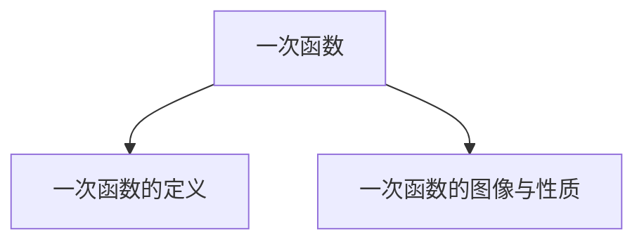

##

##

## 知识点01 一次函数的定义

## 1. 一次函数的定义：

一般地，形如 $y = k x + b ( k ,$ ，b是常数 $\underline { { \mathtt { E l } } } k \neq 0 \Big )$ 的函数是一次函数。

注意：一次函数的结构中，k ≠ 0，自变量系数为 1 。b 为任意实数。当b 的值等于 0 时，一次函数变成正比例函数。

## 【即学即练1】

1．函数 $\textcircled{1} y = k x + b ;$ ； $\textcircled{2} y = 2 x ;$ ；③ $y = \frac { 3 } { x }$ ；④ $y = \frac { 1 } { 3 } x + 3$ ；⑤ $y = x ^ { 2 } - 2 x + 1$ ．是一次函数的有（ ）

A．1 个

B．2 个

C．3 个

D．4 个

【分析】根据一次函数的定义对各函数进行逐一分析即可

【解答】解： $\textcircled{1} y = k x + b$ ，当 k＝0 时，不是一次函数；

② $y = 2 x$ 是一次函数；

③ $y = \frac { 3 } { x }$ 不是一次函数；  
$y = \frac { 1 } { 3 } x + 3$ 是一次函数；  
⑤ $y = x ^ { 2 } - 2 x + 1$ 不是一次函数；

所以是一次函数的有 2个

故选：B．

## 【即学即练2】

2．已知函数 $y = \left( a - 2 \right) \ x ^ { | a | ^ { - } 1 + 5 }$ 是关于 x的一次函数，则 $a = \_ { 2 }$

【分析】根据一次函数的定义得到 $\{ \begin{array} { l l } { | \textrm { a } | - 1 = 1 } \\ { | \textrm { a } - 2 \neq 0 } \end{array} $ 然后解方程和不等式即可得到满足条件的 a的值

【解答】解：根据题意得 $\{ \begin{array} { l l } { | \textrm { a } | - 1 = 1 } \\ { | \textrm { a } - 2 \neq 0 } \end{array} $

解得 $a = - 2$

故答案为：﹣2．

## 知识点02 一次函数的图像与性质

1. 一次函数的图像：

一次函数的图像是一条直线。

2. 一次函数的图像与性质：

<table><tr><td>k的取值</td><td>b的取值</td><td>经过象限</td><td>大致图像</td><td>y随x的变化情况</td></tr><tr><td rowspan="2">k&gt;0一定过_一、三象限</td><td>b&gt;0与y轴交于_正半轴</td><td>一、二、三</td><td></td><td rowspan="2">y随x的增大而_增大。自变量越大,函数值就_越大</td></tr><tr><td>b&lt;0与y轴交于_负半轴</td><td>一、三、四</td><td></td></tr><tr><td rowspan="2">k&lt;0一定过_二、四象限</td><td>b&gt;0与y轴交于_正半轴</td><td>一、二、四</td><td></td><td rowspan="2">y随x的增大而_减小。自变量越大,函数值就越小</td></tr><tr><td>b&lt;0与y轴交于_负半轴</td><td>二、三、四</td><td></td></tr></table>

3. 一次函数的图像与坐标轴的交点坐标：

①一次函数与纵坐标的交点坐标为 （0，b） 。  
②一次函数与横坐标的交点坐标为 $\frac { ( - \frac { k } { } , ~ 0 ) } { b }$

画一次函数图像时用两点法，两点确定一条直线。通常情况下选择的两点就是图像与坐标轴的交点。

## 【即学即练1】

3．关于函数 $y = 3 x + 1$ ，下列结论正确的是（ ）

A．函数图象过一、二、三象限  
B．函数图象是一条线段  
C．y 随 x 增大而减小  
D．点（1，3）在函数图象上

【分析】A．由 k＝3＞0，b＝1＞0，利用一次函数图象与系数的关系，可得出一次函数 $y = 3 x + 1$ 的图象经过第一、二、三象限；

B 一次函数 y＝3x+1 的图象是一条直线；

C．由 k＝3＞0，利用一次函数的性质，可得出 y随 x 的增大而增大；

D．利用一次函数图象上点的坐标特征，可得出点（1，3）不在一次函数 y＝3x+1 的图象上

【解答】解： $A . ~ : ^ { \cdot } k = 3 > 0 , ~ b = 1 > 0 ,$ ，

∴一次函数 $y = 3 x + 1$ 的图象经过第一、二、三象限，选项 A 符合题意；

B 一次函数 $y = 3 x + 1$ 的图象是一条直线，选项 B 不符合题意；

C． $\because k = 3 > 0 ;$ ，

$\therefore y$ 随 x的增大而增大，选项 C 不符合题意；

D．当 x＝1时， $y = 3 \times 1 + 1 = 4 , 4 \neq 3$ ，

∴点（1，3）不在一次函数 $y = 3 x + 1$ 的图象上，选项 D 不符合题意

故选：A．

## 【即学即练2】

已知一次函数 $y = k x + b$ ，y 随着 x 的增大而减小，且 kb＞0，则它的大致图象是（ ）

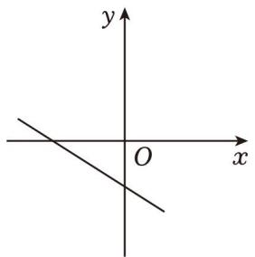

text_image

y
O
x

A

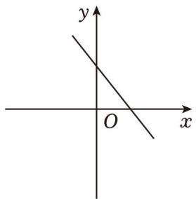

text_image

y
O
x

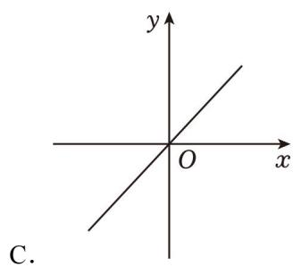

text_image

y
O
x
C.

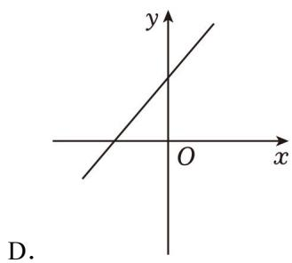

text_image

y
O x
D.

【分析】根据一次函数 y＝kx+b，y 随着 x 的增大而减小，且 $k b { > } 0$ ，可以得到 k、b的正负情况，然后根据一次函数的性质，即可得到该函数的图象经过哪几个象限，从而可以解答本题

【解答】解：∵一次函数 $y = k x + b$ ，y 随着 x 的增大而减小，且 $k b { > } 0$ ，

$$
\therefore k <   0, b <   0,
$$

∴该函数图象经过第二、三、四象限，

故选：A．

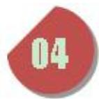

## 题型 01 判断一次函数解析式

【典例 1】下列函数中，y 是 x 的一次函数的是（ ）

A． $y = 2 x ^ { 2 } - 3$

B． $y = - \ 3 x$

C．y＝3

D． $y ^ { 2 } { = } x$

【分析】根据一次函数的定义： $y = k x + b ( k \neq 0 )$ ），进行判断即可

【解答】解：A． $y = 2 x ^ { 2 } - 3$ 是二次函数，不符合题意；

B．y＝﹣3x 是一次函数，符合题意；

C． $y = 3$ 不是一次函数，不符合题意；

D． $y ^ { 2 } { = } x$ 不是一次函数，不符合题意

故选：B

【变式 1】下列函数： $\textcircled{1} y = - 3 x$ ， $\textcircled { 2 } y = - 3 x + 3$ ， $\textcircled{3} y = - 3 x ^ { 2 }$ ，④ $y = \frac { 3 } { x }$ ； 其中一次函数的个数是（ ）

A．1

B．2

C．3

D．4

【分析】根据一次函数的定义解答即可

【解答】解： $\textcircled{1} y = - 3 x$ 是一次函数；

② $y = - ~ 3 x + 3$ 是一次函数；

③ $y = - \ 3 x ^ { 2 }$ 是二次函数；

$\gamma = - \frac { 3 } { \tt x }$ 是反比例函数．

一次函数有 2个，

故选：B．

【变式 2】下列关于 x 的函数： $\textcircled { 1 } y = \ ( k { + } 1 ) \ x { + } 5$ （k 为常数）； $\textcircled { 2 } y = 2 x + k \ ( \ k$ 为常数）； $\textcircled { 3 } y = - 3 x ; \textcircled { 4 } y$ $= \sqrt { \tt x }$ ； $\textcircled{5} y = x - 4$ ，一次函数的有（ ）

A．1 个

B．2 个

C．3 个

D．4 个

【分析】根据一次函数的定义条件解答即可

【解答】解： $\textcircled { 1 } y = \ ( k { + } 1 ) \ x { + } 5$ 当 k＝﹣1 时不是函数；

②y＝2x+k是一次函数；  
③ $y = - ~ 3 x$ 是一次函数；  
$\scriptstyle \gamma = { \sqrt { \mathbf { x } } }$ 自变量次数不为 1，不是一次函数；  
⑤ $y = x - 4$ 是一次函数

故选：C

## 题型 02 根据一次函数的定义求值

【典例 1】下列函数：（1）y＝3x；（2） $y = 2 x - 1$ ；（3） $y = \frac { 1 } { x }$ ；（4） $y = x ^ { 2 } - 1$ ；（5） $y = \frac { 8 } { 8 }$ 中，是一次函数的有（ ）个．

A．4

B．3

C．2

D．1

【分析】根据一次函数的定义： $y = k x + b ( k \neq 0 )$ ），逐一进行判断即可

【解答】解： $( 1 ) \ y = 3 x$ 是正比例函数，也是一次函数；

（2） $y = 2 x \mathrm { ~ - ~ } 1$ 是一次函数；  
（3） $y = \frac { 1 } { x }$ 的分母含有自变量 x，不是一次函数；  
（4） $y = x ^ { 2 } - 1$ 是二次函数，不是一次函数；  
$y = \frac { 8 } { 8 }$ 是正比例函数，也是一次函数

是一次函数的有 3个，

故选：B．

【变式 1】已知函数 $y = \left( m - 3 \right) x + 2$ 是 y 关于 x 的一次函数，则 m 的取值范围是（

A． $m { \neq } 0$

B． $m \neq 3$

C． $m \neq - 3$

D．m 为任意实数

【分析】根据一次函数的定义即可求出 m 的取值范围

【解答】解：根据题意得：

$$
m - 3 \neq 0,
$$

$$
\therefore m \neq 3.
$$

故选：B．

【变式2】若函数 $y = \mathrm { ~ ( } m { + } 1 ) \ x ^ { | m | } - 6$ 是一次函数，则 m 的值为（ ）

A．±1

B．﹣1

C．1

D．2

【分析】根据一次函数的定义列出有关 m 的方程，继而求出 m 的值

【解答】解：∵函数 $y = \mathrm { ~ ( } m { + } 1 ) \ x ^ { | m | } - 6$ 是一次函数，

$$
\therefore \left\{ \begin{array}{l} m + 1 \neq 0 \\ | m | = 1 \end{array} , \right.
$$

$$
\therefore m = 1,
$$

故选：C

【变式3】若函数 $y = ( m - 1 ) x ^ { \mathtt { m } ^ { 2 } + 3 }$ 是一次函数，则 m 的值为（ ）

A．﹣1

B．1

C．0

D．﹣1 或 1

【分析】利用一次函数定义可得 $m ^ { 2 } = 1$ ，且 $m - 1 \neq 0$ ，再解即可

【解答】解：由题意得： $m ^ { 2 } { = } 1$ ，且 $m \textrm { - } 1 { \neq } 0$ ，

解得： $m = - ~ 1$ ，

故选：A

【变式4】函数 $y = \left( 2 m - 1 \right) { x } ^ { n + 3 } + \left( m - 5 \right)$ ）是关于 x的一次函数的条件为（ ）

A． $m \neq 5$ 且 n＝﹣2

B． $n = - 2$

C． $m \neq \frac { 1 } { 2 }$ 且 $n = - 2$

D． $m \neq \frac { 1 } { 2 }$

【分析】根据一次函数的定义得到 n+3＝1，据此求得 n 的值

【解答】解：∵函数 $y = \left( 2 m - 1 \right) x ^ { n + 3 } + \left( m - 5 \right)$ ）是关于 x 的一次函数，

$\therefore n + 3 = 1$ 且 $2 m - 1 \neq 0$ ，

解得 n＝﹣2且 $m \neq \frac { 1 } { 2 }$

故选：C

【变式5】若函数 $y = \left( a - 2 \right) x ^ { \left| a \right| ^ { - } 1 _ { + 4 } }$ 是一次函数，则 a的值为（ ）

A．﹣2

B． $\pm 2$

C．2

D．0

【分析】根据一次函数 $y = k x + b$ 的定义可知，k、b为常数， $k { \neq } 0$ ，自变量的次数为 1，即可求解

【解答】解： $\because y = ( a - 2 ) x ^ { | a | ^ { - } 1 } + 4 $ 是关于 x的一次函数，

$\therefore | a | - 1 = 1$ 且 $a - 2 \neq 0$ ，

$\therefore | a | = 2$ 且 $a \neq 2$

$\therefore a = \pm 2$ 且 $a \neq 2$ ，

$\therefore a = - 2 .$

故选：A

## 题型 03 一次函数的性质

【典例 1】关于一次函数 y＝﹣x+1 的描述，下列说法正确的是（ ）

A．图象经过点（﹣2，1）  
B．图象经过第一、二、三象限  
C．y 随 x 的增大而增大  
D．图象与 y 轴的交点坐标是（0，1）

【分析】A．利用一次函数图象上点的坐标特征可得出一次函数 y＝﹣x+1 的图象不过点（﹣2，1）；B．利用一次函数图象与系数的关系可得出一次函数 y＝﹣x+1 的图象经过第一、二、四象限；C．利用一次函数的性质可得出 y 随 x 的增大而减小；D．利用一次函数图象上点的坐标特征可得出一次函数 y＝﹣x+1的图象与 y 轴的交点坐标是（0，1）．

【解答】解：A．当 x＝﹣2 时， $y = - \ 1 \times \ ( \ - \ 2 ) \ + 1 = 3$ ，

∴一次函数 y＝﹣x+1 的图象不过点（﹣2，1），

∴选项 A 不正确，不符合题意；

B．∵k＝﹣1＜0，b＝1＞0，

一次函数 y＝﹣x+1 的图象经过第 四象限，

∴选项 B 不正确，不符合题意；

C．∵k＝﹣1＜0，

∴y随 x的增大而减小，

∴选项 C 不正确，不符合题意；

D．当 x＝0时，y＝﹣1×0+1＝1，

∴一次函数 y＝﹣x+1 的图象与 y 轴的交点坐标是（0，1），

∴选项 D 正确，符合题意

故选：D．

【变式 1】对于一次函数 y＝﹣3x+m，下列说法正确的是（ ）

A．函数图象一定不过原点  
B．当 m＝﹣1时，函数图象不经过第一象限  
C．当 m＝2 时函数图象经过点（1，1）  
D．点（﹣2，1）和（2，n）均在函数图象上，则 n＞0

【分析】根据一次函数图象与系数的关系对 A、B 进行判断；根据一次函数图象上点的坐标特征对 C、D进行判断

【解答】解：A、当 m＝0 时，函数图象过原点，故本选项错误，不符合题意；

B、当 m＝﹣1时，一次函数 y＝﹣3x﹣1，函数图象经过第二、三、四象限，不经过第一象限，故本选项正确，符合题意；  
C、当 m＝2 时，一次函数 y＝﹣3x+2，函数图象经过点（1，﹣1），故本选项错误，不符合题意；  
D、∵点（﹣2，1）在函数图象上，

$\therefore - 3 \times ( - 2 ) + m = 1$ ，解得 $m = - ~ 5$ ，

∴一次函数 $y = - 3 x - 5 ,$

∵点（2，n）在函数图象上，

$\therefore n = - \ 6 - \ 5 = \ - \ 1 1 < 0$ ，故本选项错误，不符合题意

故选：B．

【变式 2】小红在平面直角坐标系内画了一个一次函数的图象，图象特点如下：

①图象过点（﹣1，4）  
②图象与 y 轴的交点在 x 轴上方  
③y 随 x的增大而减小

符合该图象特点的函数关系式为（

A．y＝﹣4x+2

B．y＝﹣3x+1

C．y＝3x+1

D．y＝﹣5x﹣1

【分析】A．利用一次函数图象上点的坐标特征，可得出一次函数 y＝﹣4x+2 的图象不过点（﹣1，4）；

B．利用一次函数图象上点的坐标特征及一次函数的性质，可得出一次函数 $y = - 3 x + 1$ 符合给出的三个特点；

C．利用一次函数的性质，可得出 y 随 x 的增大而增大；

D．利用一次函数图象上点的坐标特征，可得出一次函数 $y = - 5 x - 1$ 的图象与 y 轴交于点（0，﹣1），在x 轴下方．

【解答】解：A．当 x＝﹣1 时， $y = - \ 4 \times \ ( \ - \ 1 ) \ + 2 = 6 , \ 6 \neq 4$

∴一次函数 y＝﹣4x+2 的图象不过点（﹣1，4），选项 A 不符合题意；

B．当 x＝﹣1 时， $y = - \ 3 \times \ ( \ - \ 1 ) \ + 1 = 4 , \ 4 = 4$ ，

∴一次函数 y＝﹣3x+1 的图象经过点（﹣1，4）；

当 x＝0 时， $y = - \ 3 \times 0 + 1 = 1$ ，

一次函数 $y = - ~ 3 x + 1$ 的图象与 y 轴交于点（0，1），在 x 轴上方；

$$
\because k = - 3 <   0,
$$

∴y随 x的增大而减小，选项 B 符合题意；

$$
C. \because k = 3 > 0,
$$

∴y随 x的增大而增大，选项 C 不符合题意；

D．当 x＝0时， $y = - \ 5 \times 0 - 1 = - \ 1$ ，

∴一次函数 $y = - 5 x - 1$ 的图象与 y 轴交于点（0，﹣1），在 x轴下方，选项 D 不符合题意

故选：B．

【变式 3】一次函数 $y = 2 x + 3$ 的图象与 y 轴的交点是（ ）

A．（2，3）

B．（0，2）

C．（0，3）

D． $( ~ - ~ \frac { 3 } { 2 } , ~ 0 )$

【分析】代入 $x { = } 0$ ，求出 y值，进而可得出一次函数 $y = 2 x + 3$ 的图象与 y轴的交点坐标

【解答】解：当 x＝0 时， $y = 2 \times 0 + 3 = 3$ ，

∴一次函数 $y = 2 x + 3$ 的图象与 y 轴的交点是（0，3）

故选：C

【变式 4】关于一次函数 $y = - ( m ^ { 2 } + 1 ) x - 2$ ，下列结论错误的是（ ）

A．y 的值随 x 值的增大而减小  
B．图象过定点（0，﹣2）  
C．函数图象经过第二、三、四象限  
D．当 x＞0时， $y > - 2$

【分析】A．利用偶次方的非负性，可得出 $m ^ { 2 } { \geqslant } 0$ ，进而可得出 $m ^ { 2 } + 1 > 0 \mathcal { Z } - ( m ^ { 2 } + 1 ) < 0$ ，再利用一次函数的性质，可得出 y的值随 x值的增大而减小；

B．利用一次函数图象上点的坐标特征，可得出一次函数 $y = - ( m ^ { 2 } + 1 ) x - 2$ 的图象过定点（0，﹣2）；  
C．由 $k = - ~ ( m ^ { 2 } + 1 ) < 0 , ~ b = - ~ 2 < 0$ ，利用一次函数图象与系数的关系，可得出一次函数 $y = - \frac { 2 } { ( m ^ { 2 } + 1 ) }$ ）x﹣2的图象经过第二、三、四象限；  
D．由一次函数 $y = - ( m ^ { 2 } + 1 ) x - 2$ 的图象过定点（0，﹣2），且 y 的值随 x 值的增大而减小，可得出当$x { > } 0$ 时， $y < - 2$

【解答】解： $A . \because m ^ { 2 } { \geqslant } 0$ ，

$$
\therefore m ^ {2} + 1 > 0,
$$

$$
\therefore - (m ^ {2} + 1) <   0,
$$

∴y的值随 x值的增大而减小，选项 A 不符合题意；

B．当 x＝0 时， $y = - \mathrm {  ~ \nabla ~ } ( m ^ { 2 } + 1 ) \mathrm {  ~ \nabla ~ } \times 0 - 2 = - 2$ ，

∴一次函数 $y = - ( m ^ { 2 } + 1 ) x - 2$ 的图象过定点（0，﹣2），选项 B 不符合题意；

$$
C. \because k = - (m ^ {2} + 1) <   0, b = - 2 <   0,
$$

∴一次函数 $y = - ( m ^ { 2 } + 1 ) x - 2$ 的图象经过第二、三、四象限，选项 C 不符合题意；

D ∵ 次函数 $y = - ( m ^ { 2 } + 1 ) x - 2$ 的图象过定点（0，﹣2），且 y 的值随 x 值的增大而减小，

∴当 $x { > } 0$ 时， $y < - 2$ ，选项 D 符合题意

故选：D．

【变式 5】关于函数 y＝（k﹣3）x+k（k 为常数），有下列结论：

①当 k≠3 时，此函数是一次函数；  
②无论 k 取什么值，函数图象必经过点（﹣1，3）；  
③若图象经过二、三、四象限，则 k 的取值范围是 $k { < } 0 ;$ ；  
④若函数图象与 x 轴的交点始终在正半轴，则 k 的取值范围是 $0 { < } k { < } 3$

其中，正确结论的个数是（

A．1

B．2

C．3

D．4

【分析】①根据一次函数定义即可求解； $\textcircled { 2 } y = ( k - 3 ) x + k = k ( x + 1 ) - 3 x$ ，即可求解；③若图象经过二、三、四象限，则 k﹣3＜0，k＜0，解关于 k 的不等式组即可；④若函数图象与 x 轴的交点始终在正半轴，则 $x { > } 0$ ．即可求解

【解答】解：①根据一次函数定义：形如 $y = k x + b ( k \neq 0 )$ ）的函数为一次函数，

$$
\therefore k - 3 \neq 0,
$$

$$
\therefore k \neq 3,
$$

故①正确；

② $\therefore y = ( k - 3 ) x + k = k ( x + 1 ) - 3 x ,$

∴无论 k 取什么值，函数图象必经过点（﹣1，3），

故②正确；

③∵图象经过二、三、四象限，

$$
\therefore \left\{ \begin{array}{l} k - 3 <   0, \\ k <   0, \end{array} \right.
$$

解不等式组得：k＜0，

故③正确；

④令 y＝0 时，则 $x = - \frac { k } { k - 3 }$

∵函数图象与 x 轴的交点始终在正半轴，

$$
\therefore - \frac {k}{k - 3} > 0,
$$

$$
\therefore \frac {k}{k - 3} <   0,
$$

经分析知：

$$
\left\{ \begin{array}{l} k > 0, \\ k - 3 <   0, \end{array} \right.
$$

解不等式组得： $0 { < } k { < } 3$ ，

故④正确．

∴①②③④都正确，

故答案为 D

## 题型04 一次函数的图像（图像共存）

【典例 1】已知 k＞0，则一次函数 $y = - k x + k$ 的图象可能是（ ）

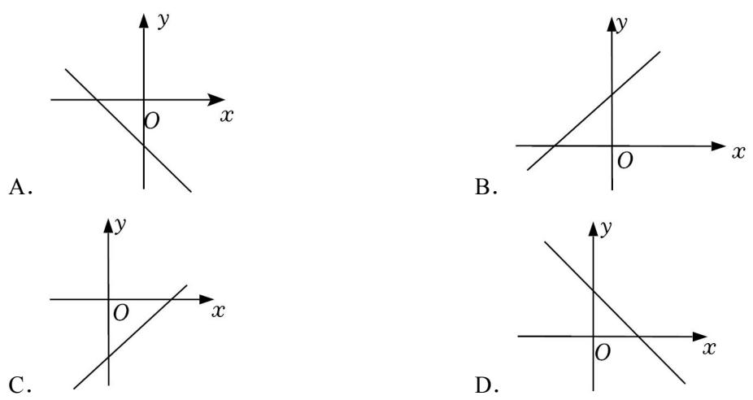

【分析】判断一次函数 $y = - k x + k$ 的图象经过象限即可

【解答】解：∵k＞0，

$$
\therefore - k <   0,
$$

一次函数 y＝﹣kx+k 的图象经过第 四象限；

故选：D．

【变式 1】若点（m，n）在第二象限，则一次函数 $y = n x + m - n$ 的图象可能是（ ）

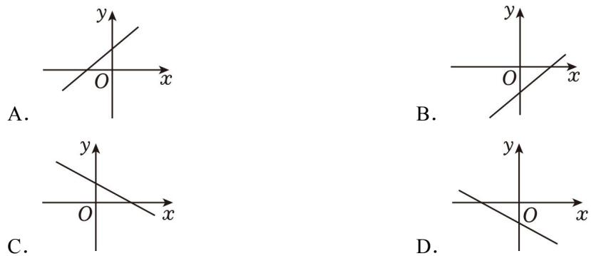

【分析】根据点（m，n）在第二象限，可得 m＜0，n＞0，利用一次函数的图象与性质的关系即可得出答案．

【解答】解：∵点（m，n）在第二象限，

$$
\therefore m <   0, n > 0,
$$

$$
\therefore m - n <   0,
$$

一次函数 $y = n x + m \mathrm { ~ - ~ } n$ 图象经过第一、三、四象限，

故选：B．

【变式2】若式子 $\sqrt { k - 1 } + ( k - 1 ) ^ { 0 }$ 有意义，则一次函数 y＝（k﹣1）x+k 的图象可能是（ ）

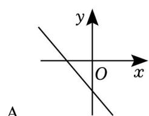

text_image

y
O
x
A.

B  
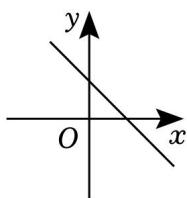

C．

D．

【分析】先求出 k的取值范围，再判断出 k﹣1 的符号，进而可得出结论

【解答】解： $\because \sqrt { k - 1 } + ( k - 1 ) ^ { 0 }$ 有意义，

$$
\therefore \left\{ \begin{array}{l} k - 1 \geqslant 0 \\ k - 1 \neq 0 \end{array} , \right.
$$

解得 k＞1，

$$
\therefore k - 1 > 0,
$$

一次函数 y＝（k﹣1）x+k 的图象过 三象限

故选：D．

【变式 3】在同一平面直角坐标系中，函数 y＝kx和 $y = - \ k x + k \ ( \ k \neq 0 )$ ）的图象可能是（ ）

A

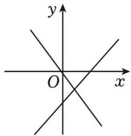

text_image

y
O
x

B

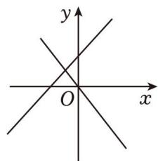

text_image

y
O
x

C

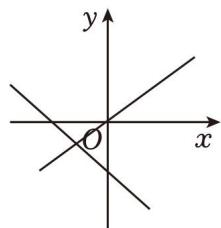

text_image

y
x
O

D．

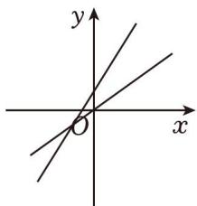

text_image

y
x
O

【分析】可先根据一次函数的图象判断 k的符号，再判断正比例图象与实际是否相符，判断正误

【解答】解： $\because y = - k x + k = - k \ ( x - 1 )$ ），

∴一次函数 y＝﹣kx+k 过点（1，0），故 B、C、D 不合题意，

A、由一次函数的图象可得 k＜0，而正比例函数图象可得 k＜0，符合题意；

故选：A．

【变式 4】一次函数 $y = m x + n ( m , ~ n$ 为常数且 $m n { \neq } 0 )$ ）与正比例函数 $y = m n x$ 在同一平面直角坐标系中的图象可能是（ ）

A

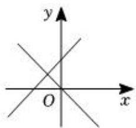

text_image

y
O
x

B

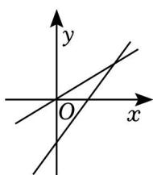

text_image

Mathematical graph showing two intersecting lines in a Cartesian coordinate system with labeled x and y axes.

C．

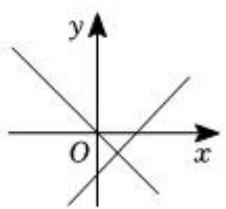

text_image

y
O
x

D

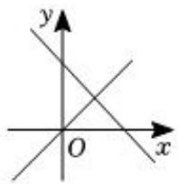

text_image

y
O
x

【分析】根据一次函数的性质和正比例函数的性质，可以判断哪个选项中的图象符合题意

【解答】解：选项 A 中，一次函数 $y = m x ^ { + } n$ 中的 $m > 0 , n > 0$ ，则 $m n { > } 0$ ，正比例函数 $y = m n x$ 中的 $m n$ $< 0$ ，故选项 A 不符合题意；

选项 B 中，一次函数 $y = m x + n$ 中的 $m > 0 , n { < } 0$ ，则 $m n { < } 0$ ，正比例函数 $y = m n x$ 中的 $m n { > } 0$ ，故选项 B不符合题意；

选项 C 中，一次函数 $y = m x + n$ 中的 $m > 0 , n < 0$ ，则 $m n { < } 0$ ，正比例函数 $y = m n x$ 中的 $m n { < } 0$ ，故选项 C符合题意；

选项 D 中，一次函数 $y = m x + n$ 中的 $m { < } 0 , \ n { > } 0$ ，则 $m n { < } 0$ ，正比例函数 $y = m n x$ 中的 $m n { > } 0$ ，故选项 $D$ 不符合题意；

故选：C

【变式5】直线 $y _ { 1 } = m x ^ { + } n$ 和 $y _ { 2 } = n m x \cdot n$ 在同一平面直角坐标系中的大致图象可能是（ ）

A

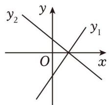

text_image

y
y₂
y₁
O
x

B

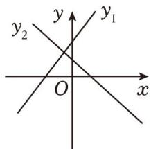

text_image

y
y₂
y₁
O
x

C

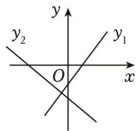

text_image

y
y₂
O
x
y₁

D．

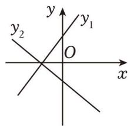

text_image

y
y₂
O
x
y₁

【分析】根据各个图象的位置判断 m、n 的正负，比较即可

【解答】解：A、直线 $y _ { 1 }$ 解析式中， $m > 0 , n < 0$ ，直线 $y _ { 2 }$ 解析式中， $m n { < } 0 , \quad - \ n { > } 0$ ，即 $m > 0 , n < 0$ 致，符合题意；

B、直线 $y _ { 1 }$ 解析式中， $m > 0 , n > 0$ ，直线 $y _ { 2 }$ 解析式中， $m n { < } 0 , \quad - \ n { > } 0$ ，矛盾，不符合题意；

C、直线 $y _ { 1 }$ 解析式中， $m > 0 , n < 0$ ，直线 $y _ { 2 }$ 解析式中， $m n { < } 0 , \quad - \ n { < } 0$ ，矛盾，不符合题意；

D、直线 $y _ { 1 }$ 解析式中， $m > 0 , n > 0$ ，直线 $y _ { 2 }$ 解析式中， $m n { < } 0 , \quad - \ n { < } 0$ ，矛盾，不符合题意；

故选：A．

## 题型05 一次函数图像上的点

【典例1】已知点 $( 3 , \ y _ { 1 } ) , \ ( \ - \ 7 , \ y _ { 2 } )$ ）都在直线 $y = - 2 x + 1$ 上，则 $y _ { 1 } , \ y _ { 2 }$ 的大小关系为（ ）

A． $y _ { 1 } > y _ { 2 }$

B．y1＝y2 $y _ { 1 } = y _ { 2 }$

C． $y _ { 1 } { < } y _ { 2 }$

D．不能比较

【分析】由一次项系数 k＜0，结合一次函数的性质，再根据﹣7＜3 即可得出结论

【解答】解： $\because y = - 2 x + 1$ 中， $\textrm { -- } 2 { < } 0$ ，

一次函数 $y = - ~ 2 x + 1$ 中，y 随 x 增大而减小，

$$
\because - 7 <   3,
$$

$$
\therefore y _ {1} <   y _ {2}.
$$

故选：C

【变式1】点 $A \ ( x _ { 1 } , \ y _ { 1 } )$ ）和 $B \ ( x _ { 2 } , \ y _ { 2 } )$ 都在直线 $y = - ~ 3 x + 2$ 上，且 $x _ { 1 } { < } x _ { 2 }$ ，则 y1与 y2的关系是（ ）

A． $y _ { 1 } { \leqslant } y _ { 2 }$

B． $y _ { 1 } \geqslant y _ { 2 }$

C $y _ { 1 } { < } y _ { 2 }$

D． $y _ { 1 } > y _ { 2 }$

【分析】利用一次函数的增减性进行比较即可

【解答】解：

∵在 $y = - ~ 3 x + 2 ~ \forall , ~ k = - ~ 3 < 0$ ，

$\therefore y$ 随 x的增大而减小，

∵点 $A \ ( x _ { 1 } , \ y _ { 1 } )$ 和 $B \ ( x _ { 2 } , \ y _ { 2 } )$ 都在直线 $y = - \ 3 x + 2$ 上，且 $x 1 { < } x 2$ ，

$$
\therefore y _ {1} > y _ {2},
$$

故选：D．

【变式 2】已知（﹣1，y1），（﹣0.5，y2），（1.8，y3）是直线 $y = - 2 x + b$ （b 为常数）上的三个点，则 $y 1 \cdot y 2 \colon$ y3的大小关系是（ ）

A． $y _ { 1 } > y _ { 2 } > y _ { 3 }$

B． $y _ { 1 } > y _ { 3 } > y _ { 2 }$

C． $_ { y 3 } > y _ { 1 } > y _ { 2 }$

D． $_ { y 3 } > y _ { 2 } > y _ { 1 }$

【分析】由 $y = - 9 x + b$ （b为常数）可知 $k = - \ 2 < 0$ ，故 y 随 x 的增大而减小，由 $- \ 1 { < } 0 . 5 { < } 1 . 8$ ，可得 $y _ { 1 }$ ，$y _ { 2 } , \ y _ { 3 }$ 的大小关系．

【解答】解： $\because k = - 2 < 0$ ，

$\therefore y$ 随 x的增大而减小，

$$
\because - 1 <   0. 5 <   1. 8,
$$

$$
\because y _ {1} > y _ {2} > y _ {3},
$$

故选：A

【变式 3】一次函数 $y = - x + 3$ 的图象过点 $( x _ { 1 } , \ y _ { 1 } ) , \ ( x _ { 1 } + 1 , \ y _ { 2 } ) , \ ( x _ { 1 } + 2 , \ y _ { 3 } )$ ），则（ ）

A． $y _ { 3 } { < } y _ { 2 } { < } y 1$

B． $y _ { 1 } { < } y _ { 2 } { < } y _ { 3 }$

C $y _ { 2 } { < } y 1 { < } y 3$

D． $y _ { 3 } { < } y 1 { < } y 2$

【分析】由 $k { = } - 1 { < } 0$ ，利用一次函数的性质，可得出 y 随 x 的增大而减小，再结合 $x _ { 1 } < x _ { 1 } + 1 < x _ { 1 } + 2$ ，即可得出 $y _ { 3 } { < } y _ { 2 } { < } y _ { 1 }$

【解答】解： $\because k = - 1 < 0$ ，

$\therefore y$ 随 x的增大而减小，

又∵一次函数 $y = - x + 3$ 的图象过点 $( x _ { 1 } , \ y _ { 1 } ) , \ ( x _ { 1 } + 1 , \ y _ { 2 } ) \ ( x _ { 1 } + 2 , \ y _ { 3 } )$ ），且 $x _ { 1 } < x _ { 1 } + 1 < x _ { 1 } + 2$ ，

$$
\therefore y _ {3} <   y _ {2} <   y _ {1}.
$$

故选：A

【变式 4】在一次函数 $y = \frac { 2 } { 3 } x + \frac { 1 } { 3 }$ x+ 的图象上任取不同两点 $P _ { 1 } ( x _ { 1 } , \ y _ { 1 } ) , \ P _ { 2 } ( x _ { 2 } , \ y _ { 2 } )$ ），则 （2号 $\frac { { \bf y } _ { 2 } - { \bf y } _ { 1 } } { { \bf x } _ { 2 } - { \bf x } _ { 1 } }$ 的正负情况是（ ）

A． y2-y1＜0 $\frac { y _ { 2 } - y _ { 1 } } { z _ { 2 } - z _ { 1 } } < 0$ x2-x1

B． y2-y1>0 $\frac { \mathbf { y } _ { 2 } - \mathbf { y } _ { 1 } } { \mathbf { x } _ { 2 } - \mathbf { x } _ { 1 } } > 0$ x2-x1

C． $\frac { \mathbf { y } _ { 2 } - \mathbf { y } _ { 1 } } { \mathbf { x } _ { 2 } - \mathbf { x } _ { 1 } } \leqslant 0$ <0 x2-x1

D． $\frac { \mathbf { y } _ { 2 } - \mathbf { y } _ { 1 } } { \mathbf { x } _ { 2 } - \mathbf { x } _ { 1 } } \equiv 0$ x2-x1

【分析】根据一次函数的图象与性质即可求解

【解答】解： $\because - \frac { 2 } { 3 } < 0$ 2 ，

$\therefore y$ 随 x的增大而减小，

当 $x _ { 2 } > x _ { 1 }$ 时， $y _ { 2 } { < } y _ { 1 }$ ，

$$
\therefore \frac {y _ {2} - y _ {1}}{x _ {2} - x _ {1}} <   0,
$$

故选：A．

text_image

强化训练

1．给出下列函数： $\textcircled{1} x + y = 0$ ； $\textcircled{2} y = x + 2$ ； $\textcircled { 3 } y + 3 = 3 ( x + 1 )$ ）； $\textcircled{4} y = 2 x ^ { 2 } + 1$ ； $\textcircled { 5 } y = \frac { 3 } { \mathrm { ~ x ~ } } + 2$ ； $\textcircled{6} y = k x + 3$ ．其中 y 一定是 x 的一次函数的有（ ）

A．2 个

B．3 个

C．4 个

D．5 个

【分析】根据一次函数的定义条件进行逐一分析即可

【解答】解： $\textcircled { 1 } x + y = 0 , \ y = \textrm { - } x$ 符合一次函数的定义，

②y＝x﹣2 符合一次函数的定义，  
③ $y + 3 = 3 ( x - 1 )$ ）符合一次函数的定义，  
④ $y = 2 x ^ { 2 } + 1$ 不符合一次函数的定义，  
$= \frac { 3 } { x } + 2$ 不符合一次函数的定义，  
⑥y＝ $= k x + 3$ 不符合一次函数的定义，

故选：B．

2．一次函数 $y = \mathrm { ~ ( } m - 2 ) \ x ^ { n ^ { - } 1 } + 3$ 是关于 x 的一次函数，则 m，n 的值为（ ）

A． $m \neq 2$ 且 $n { = } 2$

B． $m = 2$ 且 $n { = } 2$

C． $m \neq 2$ 且 $n { = } 1$

D．m＝2 且 $n { = } 1$

【分析】直接利用一次函数的定义分析得出答案

【解答】解：∵一次函数 $y = \mathrm { ~ ( ~ } m \mathrm { ~ - ~ } 2 \mathrm { ~ ) ~ } x ^ { n ^ { - } 1 } +$ 3 是关于 x 的一次函数，

$\therefore n - 1 = 1$ 且 $m - 2 \neq 0$ ，

解得：n＝2 且 $m \neq 2$

故选：A

3．已知一次函数 $y = k x + 5$ 的图象经过 M（﹣1，2），则 k 的值是（ ）

A．3

B．﹣3

C．6

D．﹣6

【分析】把 M（﹣1，2）代入一次函数 $y = k x + 5$ 求出 k的值即可

【解答】解：把 M（﹣1，2）代入一次函数 $y = k x + 5$ 得： $2 = - \ k + 5$ ，

解得：k＝3，故 A 正确

故选：A．

4．对于函数 $y = - 3 x + 1$ ，下列结论正确的是（ ）

A．它的图象必经过点（1，3）  
B．y 的值随 x 值的增大而增大  
C．当 $x { > } 0$ 时， $y { < } 0$  
D．它的图象与 x 轴的交点坐标为 $( { \frac { 1 } { 3 } } , \ 0 )$

【分析】利用一次函数图象上点的坐标特征可得出一次函数 y＝﹣3x+1 的图象不经过点（1，3）及一次函数 $y = - 3 x + 1$ 的图象与 x 轴的交点坐标为 $( { \frac { 1 } { 3 } } , \ 0 )$ ；由 $k = \mathrm { ~ - ~ } 3 < 0$ ，利用一次函数的性质可得出 y的值随 x 的增大而减小；代入 $x { > } 0$ 可得出 $y < 1$

【解答】解：A．当 x＝1 时， $y = - \ 3 \times 1 + 1 = \ - \ 2$ ，

一次函数 $y = - ~ 3 x + 1$ 的图象不经过点（1，3）；

B． $\because k = - \ 3 < 0 ,$ ，

$\therefore y$ 的值随 x的增大而减小；

C．当 $x { > } 0$ 时， $y < - \ 3 \times 0 + 1 = 1$ ；  
D．当 $y = 0$ 时， $- \ 3 x + 1 = 0$

解得： $x { = } \frac { 1 } { 3 }$ ，

一次函数 $y = - ~ 3 x + 1$ 的图象与 x 轴的交点坐标为 $( \frac { 1 } { 3 }$ ， 0）

故选：D．

5．已知一次函数 $y = k x + k ,$ ，y 随 x 的增大而增大，则该函数图象不经过第（ ）象限

A．一

B．二

C．三

D．四

【分析】根据一次函数的性质解答即可

【解答】解：∵一次函数 $y = k x + k , \ y$ 随 x 的增大而增大，

$\therefore k > 0 ;$

∴此函数的图象经过第一、二、三象限，不经过第四象限

故选：D．

6．若一次函数 y＝kx+1 在﹣2≤x≤2的范围内 y 的最大值比最小值大 8，则下列说法正确的是（

A．k 的值为 2 或﹣2

B．y 的值随 x 的增大而减小

C．k 的值为 1 或﹣1

D．在﹣2≤x≤2 的范围内，y 的最大值为 3

【分析】将 x的代入求出 y的数据，求解即可

【解答】解：当 x＝2 时， $y = 2 k + 1$ ，

当 $x = - 2$ 时， $y = - ~ 2 k + 1$ ，

当 k＞0 时，y随 x 的增大而增大，

则由题意可得： $2 k + 1 - \mathrm { ~ ( ~ - ~ } 2 k + 1 ) = 8$ ，

$\therefore k = 2 ,$

此时在 $\scriptstyle - 2 \leqslant x \leqslant 2$ 的范围内，y 的最大值为 $2 k { + } 1 = 5$ ，

当 k＜0 时，y随 x 的增大而减小，

则由题意可得： $- 2 k + 1 - ( 2 k + 1 ) = 8 ,$

$\therefore k = - 2 ,$

此时在 $\scriptstyle - 2 \leqslant x \leqslant 2$ 的范围内，y 的最大值为 $- \ 2 k { + } 1 = 5$ ，

故选：A．

7．点 $P _ { 1 } ( x _ { 1 } , \ y _ { 1 } ) , \ P _ { 2 } ( x _ { 2 } , \ y _ { 2 } )$ ）是一次函数 $y = - x + 3$ 图象上的两点．若 $x _ { 1 } > x _ { 2 }$ ，则 y1与 y2的大小关系是（ ）

A． $y _ { 1 } > y _ { 2 }$

B． $y _ { 1 } = y _ { 2 }$

C． $y _ { 1 } { < } y _ { 2 }$

D．不能确定

【分析】方法一：将点 $P _ { 1 } ( x _ { 1 } , \ y _ { 1 } ) , \ P _ { 2 } ( x _ { 2 } , \ y _ { 2 } )$ ）代入 $y = - x + 3$ 之中得 $y _ { 1 } = - x _ { 1 } + 3 , y _ { 2 } = - x _ { 2 } + 3$ ，再由$x _ { 1 } > x _ { 2 }$ 得 $- \ x _ { 1 } + 3 < - \ x _ { 2 } + 3$ ，由此可得出 y1与 y2的大小关系；

方法二：根据一次函数的性质得：对于一次函数 $y = - x + 3$ ，y 随 x 的增大而减小，再根据 $P _ { 1 } ( x _ { 1 } , \ y _ { 1 } )$ ，$P _ { 2 } \ ( x _ { 2 } , \ y _ { 2 } )$ ）是一次函数 $y = - x + 3$ 图象上的两点，且 $x _ { 1 } > x _ { 2 }$ ，即可得出 $y _ { 1 }$ 与 $y _ { 2 }$ 的大小关系

【解答】解法一： $\because P _ { 1 } ( x _ { 1 } , \ y _ { 1 } ) , P _ { 2 } ( x _ { 2 } , \ y _ { 2 } )$ ）是一次函数 $y = - x + 3$ 图象上的两点，

$$
\therefore y _ {1} = - x _ {1} + 3, \quad y _ {2} = - x _ {2} + 3,
$$

$$
\because x _ {1} > x _ {2},
$$

$$
\therefore - x _ {1} <   - x _ {2},
$$

$$
\therefore - x _ {1} + 3 <   - x _ {2} + 3,
$$

$$
\therefore y _ {1} <   y _ {2},
$$

故选：C

解法二：∵对于一次函数 $y = - x + 3$ ，y 随 x 的增大而减小，

又 $\therefore P _ { 1 } ( x _ { 1 } , \ y _ { 1 } ) , P _ { 2 } ( x _ { 2 } , \ y _ { 2 } )$ ）是一次函数 $y = - x + 3$ 图象上的两点，且 $x _ { 1 } > x _ { 2 }$

$$
\therefore y _ {1} <   y _ {2},
$$

故选：C

8．一次函数 $y _ { 1 } = a x + b$ 与 ${ } y _ { 2 } = b x + a $ 在同一直角坐标系中的图象可能是（ ）

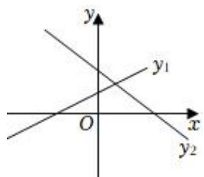

text_image

y
y₁
O
x
y₂

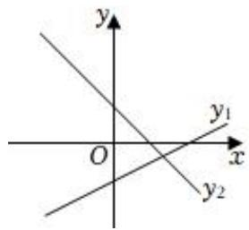

text_image

y
y₁
O
x
y₂

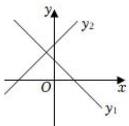

text_image

y
y₂
O
x
y₁

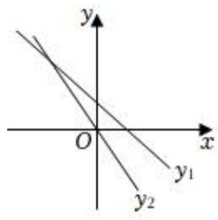

text_image

y
O
x
y₁
y₂

C

【分析】先由一次函数 $y _ { 1 } = a x + b$ 图象得到字母系数的符号，再与一次函数 ${ { y } _ { 2 } } = b { { x } } + a$ 的图象相比较看是否一致

【解答】解：A、∵一次函数 $y _ { 1 } = a x + b$ 的图象经过 三象限，

$$
\therefore a > 0, b > 0;
$$

∴一次函数 ${ { y } _ { 2 } } \mathrm { { = } } b { { x } } \mathrm { { + } } a$ 图象应该经过一、二、三象限，故不符合题意；

B、∵一次函数 $y _ { 1 } = a x + b$ 的图象经过一、三、四象限，

$$
\therefore a > 0, b <   0;
$$

∴一次函数 ${ } y _ { 2 } = b x + a $ 图象应该经过一、二、四象限，故符合题意；

C、∵一次函数 $y _ { 1 } = a x + b$ 的图象经过一、二、四象限，

$$
\therefore a <   0, b > 0;
$$

∴一次函数 ${ { y } _ { 2 } } \mathrm { { = } } b { { x } } \mathrm { { + } } a$ 图象应该经过一、三、四象限，故不符合题意；

、∵一次函数 $y _ { 1 } = a x + b$ 的图象经过 四象限，

$$
\therefore a <   0, b > 0;
$$

∴一次函数 ${ } y _ { 2 } = b x + a $ 图象应该经过一、三、四象限，故不符合题意；

故选：B．

9．若一次函数 $y = \left( 2 k { + } 1 \right) x { + } k - 3$ 的图象不经过第二象限，则 k 的值可以是（ ）

A．4

B．0

C．﹣2

D．﹣4

【分析】若一次函数图象不经过第二象限，则 $2 k { + } 1 > 0$ 且 $k ^ { \mathrm { ~ - ~ } 3 \leqslant 0 }$

【解答】解：∵一次函数 $y = \left( 2 k { + } 1 \right) x { + } k - 3$ 的图象不经过第二象限，

$\therefore 2 k + 1 > 0$ 且 $k ^ { \mathrm { ~ - ~ } 3 \leqslant 0 }$

$$
\therefore - \frac {1}{2} <   k \leqslant 3.
$$

观察选项，只有选项 B 符合题意

故选：B．

10．已知关于 x 的多项式 $x ^ { 2 } { + } k x { + } 1$ 是一个完全平方式，则在平面直角坐标系中，一次函数 $y = ~ ( k - 1 ) ~ x \mathrm { + } 5$ 的图象一定经过（ ）

A．第一、二、三象限

B．第一、二、四象限

C．第一、二象限

D．第三、四象限

【分析】根据多项式 x2+kx+1 是一个完全平方式，可以得到 k 的值，然后即可写出一次函数 $y = \mathrm { ~ ( ~ } k - 1 )$ $x { + 5 }$ 的图象经过哪几个象限，再观察，即可写出一次函数 $y = ~ ( k - 1 ) ~ x \mathrm { + } 5$ 的图象一定经过哪几个象限

【解答】解：∵多项式 $x ^ { 2 } { + } k x { + } 1$ 是一个完全平方式，

$$
\therefore k = \pm 2,
$$

当 $k { = } 2$ 时，一次函数 $y = \ ( k - 1 ) \ x + 5 = x + 5$ ，它的图象经过第一、二、三象限，

当 k＝﹣2 时，一次函数 $y = ( k - 1 ) x + 5 = - 3 x + 5$ ，它的图象经过第一、二、四象限，

由上可得，一次函数 $y = ~ ( k - 1 ) ~ x \mathrm { + } 5$ 的图象一定经过第一、二象限，

故选：C

11．已知函数 $y = \ ( m - 2 ) \ x ^ { | m - 1 | + 2 }$ 是关于 x 的一次函数，则 $m = \_ 0$

【分析】根据一次函数 $y = k x + b$ 的定义条件是：k、b 为常数， $k { \neq } 0$ ，自变量次数为 1，即可得出 m 的值

【解答】解：根据一次函数的定义可得： $m - 2 { \neq } 0 , | m - 1 | { = } 1$ ，

由 $| m \texttt { - } 1 | = 1$ ，解得： $m { = } 0$ 或 2，

又 $m \textmd { - } 2 7 0 , m 7 2$ ，

$$
\therefore m = 0.
$$

故答案为：0

12．若点 $P \ ( a , \ b )$ 在一次函数 $y = 3 x \mathrm { ~ - ~ } 1$ 的图象上，则代数式 $6 a - 2 b + 8$ 的值等于 10

【分析】把点 P 的坐标代入一次函数解析式可以求得 a、b间的数量关系，所以易求代数式 $6 a \textmd { - } 2 b \text{ + } 8$ 的值

【解答】解：∵点 $P \ ( a , \ b )$ ）在一次函数 $y = 3 x \mathrm { ~ - ~ } 1$ 的图象上，

$$
\therefore b = 3 a - 1,
$$

$$
\therefore 3 a - b = 1,
$$

$$
\therefore 6 a - 2 b + 8 = 2 (3 a - b) + 8 = 2 + 8 = 1 0,
$$

故答案为：10

13．已知 $A \ ( x _ { 1 } , \ y _ { 1 } ) , \ B \ ( x _ { 2 } , \ y _ { 2 } )$ ）是一次函数 $y = \left( 3 - 2 m \right) x + 1$ 的图象上两点，且 $( x _ { 1 } - x _ { 2 } ) \ ( y _ { 1 } - y _ { 2 } ) \ < 0$ ，则 m 的取值范围为 $\frac { m > \frac { 3 } { 2 } } { 2 } .$

【分析】由 $( x _ { 1 } - x _ { 2 } ) \ ( y _ { 1 } - y _ { 2 } ) \ < 0$ ，可得出 $x _ { 1 } \textrm { -- } x _ { 2 }$ 与 $y _ { 1 } - y _ { 2 }$ 异号，进而可得出 y 随 x 的增大而减小，再利用一次函数的性质，可得出 $3 - 2 m { < } 0$ ，解之即可得出 m 的取值范围．

【解答】解： $\because A ( x _ { 1 } , \ y _ { 1 } ) , \ B ( x _ { 2 } , \ y _ { 2 } )$ ）是一次函数 $y = \mathit { \Omega } ( 3 \cdot 2 m ) \mathit { \Omega } x \mathrm { + } 1$ 的图象上两点，且 $( x _ { 1 } - x _ { 2 } ) ( y _ { 1 }$ $\underline { { { \mathbf { \Pi } } } } _ { y 2 } ) \le = \underline { { { \mathbf { \pi } } } } _ { 0 }$ ，

$\therefore x \Game x 2$ 与 $y _ { 1 } - y _ { 2 }$ 异号，

$\therefore y$ 随 x的增大而减小，

$$
\therefore 3 - 2 m <   0,
$$

$$
\therefore m > \frac {3}{2},
$$

$\therefore m$ 的取值范围为 $m > \frac { 3 } { 2 }$

故答案为： $m > \frac { 3 } { 2 }$

14．若关于 x 的不等式组 $\left\{ \begin{array} { l l } { { 2 \mathbf { x } > \mathbf { x } + 2 } } \\ { { 4 \mathbf { x } - 1 < \ l \mathrm { a } } } \end{array} \right.$ 有且只有两个整数解，关于 m 的一次函数 $y = m + a - 1 8$ 的图象不经过第二象限，则所有满足条件的整数 a的值之和为 51

【分析】求出不等式组的解集，根据不等式组有且只有两个整数解，结合 $y = m + a - 1 8$ 的图象不经过第二象限，求出 a 的取值范围，进而得出结论

【解答】解： $\left\{ \begin{array} { l l } { 2 \mathbf { x } > \mathbf { x } + 2 \boldsymbol { \left( \hat { 1 } \right) } } \\ { 4 \mathbf { x } - 1 < a \boldsymbol { \left( \hat { 2 } \right) } } \end{array} , \right.$

由①得， $x > 2 ;$

由②得， $x < \frac { 1 + a } { 4 }$

$\because$ 不等式组 $\left\{ \begin{array} { l l } { { 2 \mathbf { x } > \mathbf { x } + 2 } } \\ { { 4 \mathbf { x } - 1 < \ l \mathrm { a } } } \end{array} \right.$ 有且只有两个整数解，

∴这两个整数解为 3，4，

$$
\therefore 4 <   \frac {1 + a}{4} \leqslant 5,
$$

$$
\therefore 1 5 <   a \leqslant 1 9,
$$

∵关于 m 的一次函数 $y = m + a - 1 8$ 的图象不经过第二象限，

$$
\therefore a - 1 8 \leqslant 0,
$$

$$
\therefore a \leqslant 1 8,
$$

$$
\therefore 1 5 <   a \leqslant 1 8,
$$

∴整数 a的值为 16，17，18，

∴整数 a的值之和 $\begin{array} { r } { 1 = 1 6 + 1 7 + 1 8 = 5 1 } \end{array}$

故答案为：51

15．如图，直线 $l : y = \frac { 2 } { 3 } x + 4$ 与 x 轴、y 轴分别交于点 A、B，点 C 是直线 l 上的一点，且其纵坐标为 2，点D 为 OA 的中点，点 P 为 y 轴上一动点，当 $P C + P D$ 的值最小时，则 $\triangle P C D$ 的周长是 $2 + 2 \sqrt { 1 0 }$

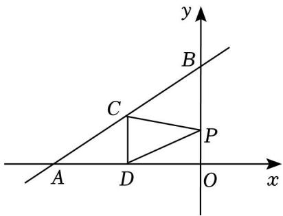

text_image

y
B
C
P
A
D
O
x

【分析】根据题意可作点 D 关于 y轴的对称点 E，然后连接 CE，交 y 轴于点 P，根据轴对称的性质及两点之间线段最短可进行求解

【解答】解：令 $y = 0$ ，则有 $\frac { 2 } { 3 } x + 4 = 0$ x+4=0，

解得： $x = - ~ 6$ ，

$$
\because O A = 6,
$$

∵点 D 为 OA 的中点，

$\therefore O D = 3$ ，即 $\textit { D } ( \textit { - } 3 , \textit { } 0 )$ ），

令 $y = 2$ ，则有 $\frac { 2 } { 3 } x + 4 = 2$ x+4=2，

解得： $x = - 3$ ，

∴点 C（﹣3，2），

$$
\because C D = 2,
$$

作点 D 关于 y 轴的对称点 E，然后连接 CE，交 y 轴于点 F，如图所示：

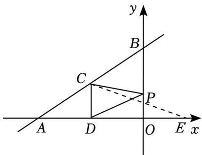

text_image

y
B
C
P
A D O E x
O

∴E（3，0），

由轴对称的性质可知 y 轴垂直平分 DE，则根据垂直平分线的性质及两点之间线段最短可知当点 P 与点 F重合时， $P C + P D$ 的值最小，即为 CE 的长，

$$
\therefore \mathrm{CE} = \sqrt {(- 3 - 3) ^ {2} + (2 - 0) ^ {2}} = 2 \sqrt {1 0},
$$

$\therefore \triangle P C D$ 的周长为 $2 + 2 \sqrt { 1 0 }$ ，

故答案为： $2 + 2 \sqrt { 1 0 }$

16．已知函数 $y = \ ( 2 m + 1 ) \ x + m - 3$

（1）若函数图象与 y 轴交于点（0，﹣2），求 m 的值；  
（2）若这个函数是一次函数，且 y 随着 x 的增大而减小，求 m 的取值范围

【分析】（1）直接把（0，﹣2）代入求出 m 的值即可；

（2）直线 $y = k x + b$ 中，y 随 x 的增大而减小说明 k＜0

【解答】解：（1）当 x＝0 时， $y = - ~ 2$ ，即 $m - 3 = - 2$ ，

解得 m＝1；

（2）根据 y 随 x 的增大而减小说明 k＜0．即 $2 m { + } 1 { < } 0$

解得： $m < - \frac { 1 } { 2 }$

17．已知一次函数 $y = ( 2 a - 4 ) \ x + ( 3 - b ) \ ( a , \ b$ 是常数）

（1）若该一次函数为正比例函数，求 a 的取值范围和 b 的值；  
（2）若 y 随 x 的值增大而减小且不经过第一象限，求 a，b的取值范围．

【分析】（1）该一次函数为正比例函数，则 $2 a - 4 \neq 0 , 3 - b = 0$ ，解得 a≠2，b＝3即可求解；

（2）根据一次函数的图象与系数的关系即可得出结论

【解答】解：（1）一次函数 $y = ( 2 a - 4 ) x + ( 3 - b ) ( a , b$ 是常数），

该一次函数为正比例函数，则 $2 a - 4 \neq 0 , 3 - b = 0$ ，

解得 $a \neq 2 , b = 3$ ；

（2）∵一次函数 $y = ( 2 a - 4 ) \ x + ( 3 - b ) \ ( a , \ b$ 是常数）的图象 y 随 x的值增大而减小且不经过第一象限，

$$
\therefore 2 a - 4 <   0, \quad 3 - b \leqslant 0,
$$

$$
\therefore a <   2, b \geqslant 3.
$$

18．已知直线 $y = 2 x + 4$ 与坐标轴分别交于点 A、B，点 C 在 x轴上，且 $S _ { \triangle A B C } { = } 6$ ．

（1）画出函数 $y = 2 x + 4$ 的图象；  
（2）求 A、B、C 点的坐标

【分析】（1）求出点 A、B 的坐标，根据两点确定一条直线即可画出直线；

（2）设点 C 坐标为（x，0），利用△ABC 面积为 6 列出方程即可求解

【解答】解：（1）当 x＝0 时， $y = 4$ ，

∴点 B 的坐标为（0，4）；

当 $y = 0$ 时， $x = - 2$ ，

∴点 A 的坐标为（﹣2，0），

过点 A（﹣2，0）、B（0，4）画直线 AB，则直线 AB 即为所求；

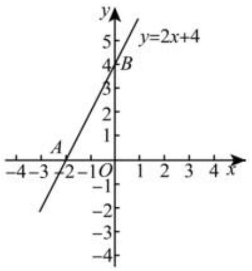

line chart

| Point | x | y |
|---|---|---|
| A | -2 | 0 |
| B | 4 | 4 |
| Point B (y=2x+4) | 4 | 4 |

（2）由（1）得 A（﹣2，0），B（0，4），

$$
\therefore O B = 4,
$$

设点 C 坐标为（x，0），则 $A C = ( x - ( - 2 ) ) = | x + 2 |$ ，

$$
\because S _ {\triangle A B C} = 6,
$$

$$
\therefore \frac {1}{2} \times A C \times O B = 6,
$$

即 $\frac { 1 } { 2 } \times \vert x + 2 \vert \times 4 = 6$ ，

$$
\therefore | x + 2 | = 3,
$$

解得 $x = - 5$ 或 1，

∴点 $C ~ ( ~ - ~ 5 , ~ 0 )$ 或（1，0）

19．用“列表﹣描点﹣连线”的方法画出函数 $y = 2 x + 1$ 的图象

（1）列表：下表是 y 与 x 的几组对应值，请补充完整

<table><tr><td>x</td><td>...</td><td>-2</td><td>-1</td><td>0</td><td>1</td><td>2</td><td>...</td></tr><tr><td>y</td><td>...</td><td>-3</td><td>-1</td><td>1</td><td>3</td><td>5</td><td>...</td></tr></table>

（2）描点连线：在平面直角坐标系 $x O y$ 中，将各点进行描点、连线，画出函数 $y = 2 x + 1$ 的图象；  
（3）写出函数 $y = 2 x + 1$ 的图象的两条特征

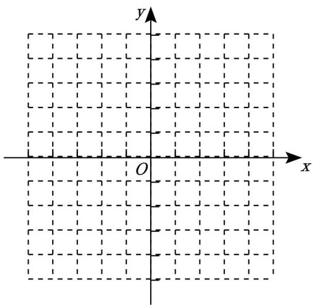

text_image

y
O
x

【分析】（1）将表格中 x 的值代入函数解析式，求出相应的 y 的值即可；

（2）在坐标系中描点连线即可；  
（3）根据图象写出两条特征即可

【解答】解： $( 1 ) \because y = 2 x + 1$ ，

∴当 $x = - ~ 1$ 时， $y = 2 \times \mathrm { ~ ( ~ - ~ 1 ~ ) ~ } + 1 = \mathrm { ~ - ~ 1 ~ }$ ，

当 $x { = } 0$ 时， $y { = } 2 \times 0 { + } 1 { = } 1$ ，

当 $x { = } 2$ 时， $y { = } 2 \times 2 { + } 1 { = } 5$ ，

故答案为：﹣1，1，5；

（2）如右图所示；  
（3）第一个特征：y 随 x 的增大而增大；

第二个特征：该函数图象经过第一、二、三象限

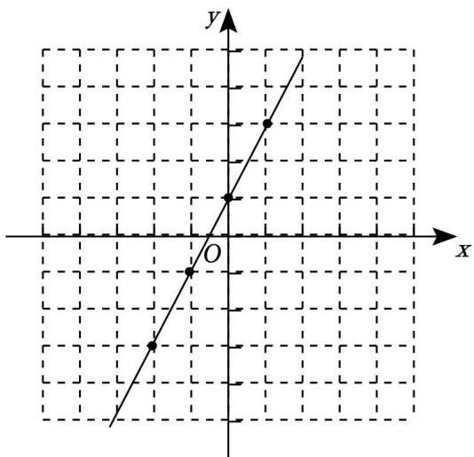

text_image

y
x
O

20．如图点 $P \ ( x , \ y )$ 是第一象限内一个动点，且在直线 $y = - 2 x + 8$ 上，直线与 x轴交于点 A

（1）当点 P 的横坐标为 3 时， $\triangle A P O$ 的面积为多少？  
（2）设 $\triangle A P O$ 面积为 S，用含 x 的解析式表示 S，并写出 x 的取值范围

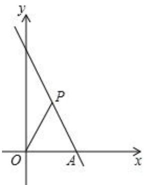

text_image

y
P
O
A
x

【分析】（1）根据一次函数的解析式求出 A 点坐标，故可得出 OA 的长，再把 $x { = } 3$ 代入直线 $y = - ~ 2 x + 8$ 求出 y 的值，故可得出 $\triangle A P O$ 的面积；

（2）设点 $\begin{array} { r l } { P \ \left( x , \ \right. } & { { } - \ 2 x + 8 ) } \end{array}$ ），根据三角形的面积公式用 x 表示出 S 即可

【解答】解：（1）∵令 y＝0，则 $- \ 2 x + 8 = 0$ ，解得 $x { = } 4$ ，

$$
\therefore O A = 4,
$$

∵点 $P \ ( x , \ y )$ ）是第一象限内一个动点，且在直线 $y = - 2 x + 8$ 上，

∴当 x＝3 时， $y = ( { \mathit { \Delta - 2 } } ) \times 3 + 8 = 2 .$ ，

$$
\therefore S _ {\triangle A P O} = \frac {1}{2} \times 4 \times 2 = 4;
$$

（2）∵点 $\begin{array} { r l } { P \ \left( { x , \ } & { { } - \ 2 x + 8 } \right) } \end{array}$ ），

$$
\therefore S _ {\triangle A P O} = \frac {1}{2} O A \times (- 2 x + 8) = \frac {1}{2} \times 4 \times (- 2 x + 8) = - 4 x + 1 6 (0 <   x <   4).
$$