## 第 04 讲 一次函数（1）

## 01

## 学习目标

<table><tr><td>课程标准</td><td>学习目标</td></tr><tr><td>1一次函数的定义2一次函数的图像与性质</td><td>1. 掌握一次函数的定义,能判断一次函数以及能根据一次函数的定义求值。2. 掌握一次函数的图像与性质,并能够熟练利用图像与性质解决相应的题目。</td></tr></table>

## 02

## 思维导图

flowchart

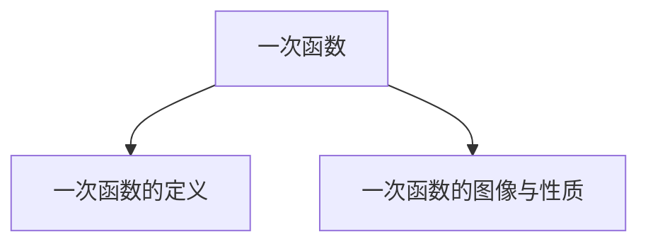

##

##

## 知识点01 一次函数的定义

## 1. 一次函数的定义：

一般地，形如 的函数是一次函数。

注意：一次函数的结构中，k 0，自变量系数为 。b为任意实数。当b 的值等于 时，一次函数变成正比例函数。

## 【即学即练1】

1．函数 $\textcircled{1} y = k x + b$ ； $\textcircled{2} y = 2 x ;$ ；③ $y = \frac { 3 } { x }$ ；④ $y = \frac { 1 } { 3 } x + 3$ ；⑤ $\scriptstyle y = x ^ { 2 } - 2 x + 1$ ．是一次函数的有（ ）

A．1 个

B．2 个

C．3 个

D．4 个

## 【即学即练2】

2．已知函数 $y = \left( a - 2 \right) \ x ^ { | a | ^ { - } 1 } + 5$ 是关于 x的一次函数，则 $a =$

## 知识点02 一次函数的图像与性质

## 1. 一次函数的图像：

一次函数的图像是一条直线。

## 2. 一次函数的图像与性质：

<table><tr><td>k的取值</td><td>b的取值</td><td>经过象限</td><td>大致图像</td><td>y随x的变化情况</td></tr><tr><td rowspan="2">k&gt;0一定过____象限</td><td>b&gt;0与y轴交于__半轴</td><td>____</td><td></td><td rowspan="2">y随x的增大而____。自变量越大,函数值就____</td></tr><tr><td>b&lt;0与y轴交于__半轴</td><td>____</td><td></td></tr><tr><td rowspan="2">k&lt;0一定过____象限</td><td>b&gt;0与y轴交于__半轴</td><td>____</td><td></td><td rowspan="2">y随x的增大而____。自变量越大,函数值就____</td></tr><tr><td>b&lt;0与y轴交于__半轴</td><td>____</td><td></td></tr></table>

## 3. 一次函数的图像与坐标轴的交点坐标：

①一次函数与纵坐标的交点坐标为 。  
②一次函数与横坐标的交点坐标为 。

画一次函数图像时用两点法，两点确定一条直线。通常情况下选择的两点就是图像与坐标轴的交点。

## 【即学即练1】

## 3．关于函数 y＝3x+1，下列结论正确的是（ ）

A．函数图象过一、二、三象限  
B．函数图象是一条线段  
C．y 随 x 增大而减小  
D．点（1，3）在函数图象上

## 【即学即练2】

已知一次函数 y＝kx+b，y 随着 x 的增大而减小，且 kb＞0，则它的大致图象是（ ）

A

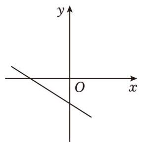

text_image

y
O
x

B

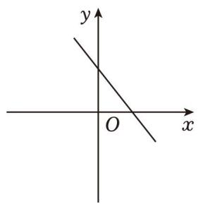

text_image

y
O
x

C．

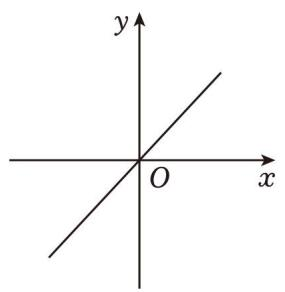

text_image

y
O
x

D

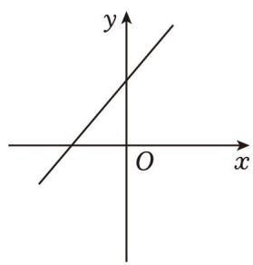

text_image

y
O x

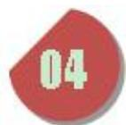

text_image

题型精讲

## 题型 01 判断一次函数解析式

【典例 1】下列函数中，y 是 x 的一次函数的是（ ）

A． $y = 2 x ^ { 2 } - 3$

B． $y = - \ 3 x$

C．y＝3

D． $y ^ { 2 } { = } x$

【变式 1】下列函数： $\textcircled{1} y = - 3 x$ ， $\textcircled { 2 } y = - 3 x + 3$ ， $\textcircled{3} y = - 3 x ^ { 2 }$ ，④ $\mathrm { y } = \frac { 3 } { \mathrm { x } } ;$ ； 其中一次函数的个数是（ ）

A．1

B．2

C．3

D．4

【变式 2】下列关于 x 的函数： $\textcircled { 1 } y = \ ( k { + } 1 ) \ x { + } 5$ （k 为常数）； $\textcircled{2} y = 2 x + k$ （k 为常数）； $\textcircled{3} y = - 3 x ;$ ；④y$= { \sqrt { \mathbf { x } } } ; ~ \textcircled { 5 } y = x - 4$ ，一次函数的有（ ）

A．1 个

B．2 个

C．3 个

D．4 个

## 题型 02 根据一次函数的定义求值

【典例 1】下列函数：（1）y＝3x；（2） $y = 2 x - 1$ ；（3） ${ \mathrm { y } } = { \frac { 1 } { \mathrm { x } } } ; ( 4 ) \ y = x ^ { 2 } - 1$ ；（5） ${ \bf y } = \frac { \bf x } { 8 } \ = \frac { \bf y } { 8 } \ = \frac { \bf y } { 8 }$ 中，是一次函数的有（ ）个．

A．4

B．3

C．2

D．1

【变式 1】已知函数 $y = \left( m - 3 \right) x + 2$ 是 y 关于 x 的一次函数，则 m 的取值范围是（

A． $m { \neq } 0$

B． $m \neq 3$

C． $m \neq - 3$

D．m 为任意实数

【变式2】若函数 $y = \mathrm { ~ ( } m { + } 1 ) \ x ^ { | m | } - 6$ 是一次函数，则 m 的值为（ ）

A．±1

B．﹣1

C．1

D．2

【变式3】若函数 $y = ( m - 1 ) x ^ { \mathtt { m } ^ { 2 } + 3 }$ 是一次函数，则 m 的值为（ ）

A．﹣1

B．1

C．0

D．﹣1 或 1

【变式4】函数 $y = \left( 2 m - 1 \right) x ^ { n + 3 } + \left( m - 5 \right)$ ）是关于 x 的一次函数的条件为（ ）

A． $m \neq 5$ 且 n＝﹣2

B． $n = - 2$

C． $m \neq \frac { 1 } { 2 }$ 且 n＝﹣2

D． $m \neq \frac { 1 } { 2 }$

【变式5】若函数 $y = \left( a - 2 \right) x ^ { \left| a \right| ^ { - } 1 _ { + 4 } }$ 是一次函数，则 a的值为（ ）

A．﹣2

B． $\pm 2$

C．2

D．0

## 题型 03 一次函数的性质

【典例 1】关于一次函数 $y = - \ x + 1$ 的描述，下列说法正确的是（ ）

A．图象经过点（﹣2，1）

B．图象经过第一、二、三象限

C．y 随 x 的增大而增大

D．图象与 y 轴的交点坐标是（0，1）

【变式 1】对于一次函数 $y = - 3 x + m$ ，下列说法正确的是（ ）

A．函数图象一定不过原点

B．当 m＝﹣1时，函数图象不经过第一象限

C．当 m＝2 时函数图象经过点（1，1）

D．点（﹣2，1）和（2，n）均在函数图象上，则 $n { > } 0$

【变式 2】小红在平面直角坐标系内画了一个一次函数的图象，图象特点如下：

①图象过点（﹣1，4）

②图象与 y 轴的交点在 x 轴上方

③y 随 x的增大而减小

符合该图象特点的函数关系式为（ ）

A． $y = - ~ 4 x + 2$

B． $y = - 3 x + 1$

C． $y = 3 x + 1$

D． $y = - 5 x - 1$

【变式 3】一次函数 $y = 2 x + 3$ 的图象与 y 轴的交点是（ ）

A．（2，3）

B．（0，2）

C．（0，3）

D． $( - \frac { 3 } { 2 }$ ， 0）

【变式 4】关于一次函数 $y = - ( m ^ { 2 } + 1 ) x - 2$ ，下列结论错误的是（ ）

A．y 的值随 x 值的增大而减小

B．图象过定点（0，﹣2）

C．函数图象经过第二、三、四象限

D．当 $x { > } 0$ 时， $y > - 2$

【变式 5】关于函数 $y = \left( k - 3 \right) x + k$ （k 为常数），有下列结论：

①当 $k { \neq } 3$ 时，此函数是一次函数；  
②无论 k 取什么值，函数图象必经过点（﹣1，3）；  
③若图象经过二、三、四象限，则 k 的取值范围是 $k { < } 0$ ；  
④若函数图象与 x 轴的交点始终在正半轴，则 k 的取值范围是 $0 { < } k { < } 3$

其中，正确结论的个数是（

A．1

B．2

C．3

D．4

## 题型04 一次函数的图像（图像共存）

【典例 1】已知 k＞0，则一次函数 $y = - k x + k$ 的图象可能是（ ）

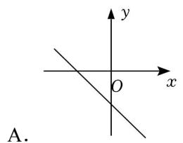

text_image

A.

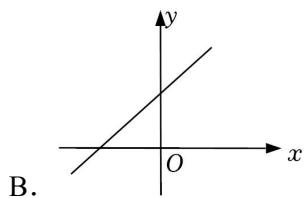

text_image

B.

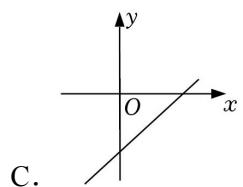

text_image

y
O x
C.

text_image

y
O
x
D.

【变式1】若点 $( m , \ n )$ 在第二象限，则一次函数 $y = n x + m - n$ 的图象可能是（ ）

text_image

y
O x
A.

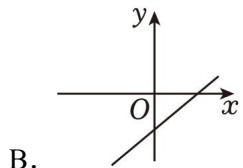

text_image

y
O x
B.

text_image

y
O x
C.

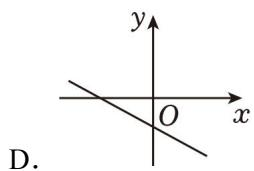

text_image

y
O x
D.

【变式2】若式子 $\sqrt { k - 1 } + ( k - 1 ) ^ { 0 }$ 有意义，则一次函数 $y = \ ( k - 1 ) \ x + k$ 的图象可能是（ ）

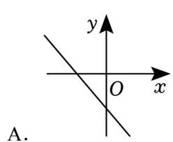

text_image

y
O x
A.

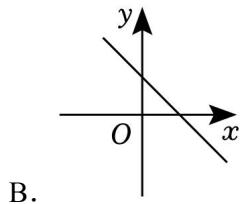

text_image

y
O
x
B.

C．

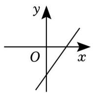

D．

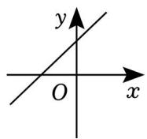

【变式 3】在同一平面直角坐标系中，函数 $y = k x$ 和 $y = - \ k x + k \ ( \ k \neq 0 )$ ）的图象可能是（ ）

A

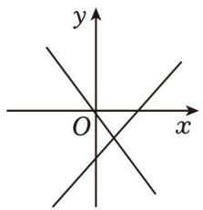

text_image

y
O
x

B

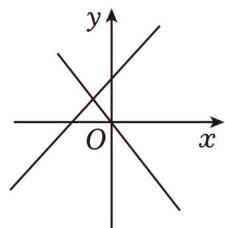

text_image

y
O
x

C．

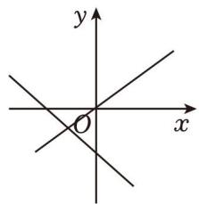

text_image

y
x
O

D．

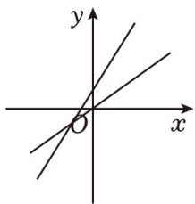

text_image

y
x
O

【变式 4】一次函数 $y = m x + n ( m , ~ n$ 为常数且 $m n { \neq } 0 )$ ）与正比例函数 $y = m n x$ 在同一平面直角坐标系中的图象可能是（ ）

A

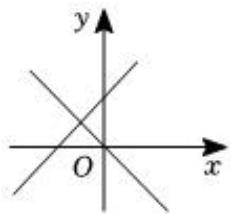

text_image

y
O
x

B

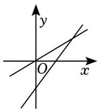

text_image

Mathematical graph showing two intersecting lines in a Cartesian coordinate system with labeled x and y axes.

C．

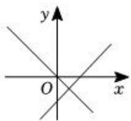

text_image

y
O
x

D．

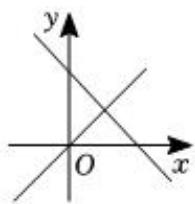

text_image

y
O
x

【变式5】直线 $y _ { 1 } = m x ^ { + } n$ 和 $y _ { 2 } = n m x \cdot n$ 在同一平面直角坐标系中的大致图象可能是（ ）

A

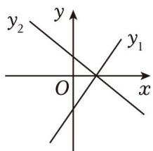

text_image

y
y₂
O
x
y₁

B

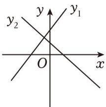

text_image

y
y₂
y₁
O
x

C．

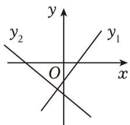

text_image

y
y₂ y₁
O x

D．

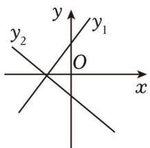

text_image

y
y₂
O
x
y₁

## 题型05 一次函数图像上的点

【典例 1】已知点（3，y1），（﹣7，y2）都在直线 $y = - 2 x + 1$ 上，则 y1，y2 的大小关系为（ ）

A． $y _ { 1 } > y _ { 2 }$

B． $y _ { 1 } = y _ { 2 }$

C $y 1 { < } y 2$

D．不能比较

【变式1】点 $A \ ( x _ { 1 } , \ y _ { 1 } )$ ）和 $B \ ( x _ { 2 } , \ y _ { 2 } )$ ）都在直线 $y = - ~ 3 x + 2$ 上，且 $x _ { 1 } { < } x _ { 2 }$ ，则 y1 与 y2 的关系是（ ）

A． $y _ { 1 } { \leqslant } y _ { 2 }$

B． $y _ { 1 } \geqslant y _ { 2 }$

C． $y _ { 1 } { < } y _ { 2 }$

D． $y _ { 1 } > y _ { 2 }$

【变式 2】已知（﹣1，y1），（﹣0.5，y2），（1.8，y3）是直线 $y = - 2 x + b$ （b 为常数）上的三个点，则 $y 1 \cdot y 2 \colon$ ，y3的大小关系是（ ）

A． $y _ { 1 } > y _ { 2 } > y _ { 3 }$

B． $y _ { 1 } > y _ { 3 } > y _ { 2 }$

C． $_ { y 3 } > y _ { 1 } > y _ { 2 }$

D． $_ { y 3 } > y _ { 2 } > y _ { 1 }$

【变式 3】一次函数 $y = - x + 3$ 的图象过点（x1，y1），（x1+1，y2），（x1+2，y3），则（ ）

A． $y _ { 3 } { < } y _ { 2 } { < } y 1$

B． $y _ { 1 } { < } y _ { 2 } { < } y _ { 3 }$

C． $y _ { 2 } { < } y 1 { < } y 3$

D． $y _ { 3 } { < } y 1 { < } y 2$

【变式 4】在一次函数 $y = \frac { 2 } { 3 } x + \frac { 1 } { 3 }$ x+ 的图象上任取不同两点 （ $P _ { 1 } ( x _ { 1 } , \ y _ { 1 } ) , \ P _ { 2 } ( x _ { 2 } , \ y _ { 2 } )$ ），则 x2-x1 $\frac { { \bf y } _ { 2 } - { \bf y } _ { 1 } } { { \bf x } _ { 2 } - { \bf x } _ { 1 } }$ 的正负情况是（ ）

A． y-y1<0 $\frac { y _ { 2 } - y _ { 1 } } { z _ { 2 } - z _ { 1 } } < 0$ x2-x1

B． $\frac { \mathbf { y } _ { 2 } - \mathbf { y } _ { 1 } } { \mathbf { x } _ { 2 } - \mathbf { x } _ { 1 } } > 0$ y2-y1>0 x2-x1

C． y-y1 $\frac { \mathbf { y } _ { 2 } - \mathbf { y } _ { 1 } } { \mathbf { x } _ { 2 } - \mathbf { x } _ { 1 } } \leqslant 0$ <0 x2-x1

D． y2-y1 $\frac { \mathbf { y } _ { 2 } - \mathbf { y } _ { 1 } } { \mathbf { x } _ { 2 } - \mathbf { x } _ { 1 } } \equiv 0$

## 强化训练

$\textcircled{1} x + y = 0$ $\textcircled{2} y = x + 2$ $\textcircled { 3 } y + 3 = 3 ( x + 1 )$ $: 2 x ^ { 2 } + 1$ $y = \frac { 3 } { \tt x } + 2 ;$ $\scriptstyle \gamma = k x + 3$ X中 y 一定是 x 的一次函数的有（ ）

A．2 个

B．3 个

C．4 个

D．5 个

2．一次函数 $y = \left( m - 2 \right) x ^ { n ^ { - } 1 } + 3$ 是关于 x 的一次函数，则 m，n 的值为（ ）

A． $m \neq 2$ 且 n＝2

B． $m = 2$ 且 $n { = } 2$

C． $m \neq 2$ 且 n＝1

D．m＝2 且 $n { = } 1$

3．已知一次函数 $y = k x + 5$ 的图象经过 M（﹣1，2），则 k 的值是（ ）

A．3

B．﹣3

C．6

D．﹣6

4．对于函数 $y = - 3 x + 1$ ，下列结论正确的是（ ）

A．它的图象必经过点（1，3）

B．y 的值随 x 值的增大而增大

C．当 $x { > } 0$ 时， $y { < } 0$

D．它的图象与 x 轴的交点坐标为 $( \frac { 1 } { 3 }$ ， 0）

5．已知一次函数 y＝kx+k，y 随 x 的增大而增大，则该函数图象不经过第（ ）象限

A．一

B．二

C．三

D．四

6．若一次函数 $y = k x + 1$ 在﹣2≤x≤2的范围内 y 的最大值比最小值大 8，则下列说法正确的是（

A．k 的值为 2 或﹣2

B．y 的值随 x 的增大而减小

C．k 的值为 1 或﹣1

D．在﹣ $2 { \leqslant } x { \leqslant } 2$ 的范围内，y 的最大值为 3

7．点 $P _ { 1 } ( x _ { 1 } , \ y _ { 1 } ) , \ P _ { 2 } ( x _ { 2 } , \ y _ { 2 } )$ ）是一次函数 $y = - x + 3$ 图象上的两点．若 $x _ { 1 } > x _ { 2 }$ ，则 y1与 y2的大小关系是（ ）

A． $y _ { 1 } > y _ { 2 }$

B． $y _ { 1 } = y _ { 2 }$

C． $y 1 { < } y 2$

D．不能确定

8．一次函数 $y _ { 1 } = a x + b$ 与 ${ } y _ { 2 } = b x + a $ 在同一直角坐标系中的图象可能是（ ）

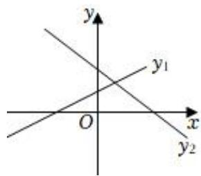

text_image

y
y₁
O
x
y₂

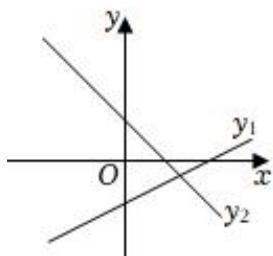

text_image

y
y₁
O
x
y₂

A

B

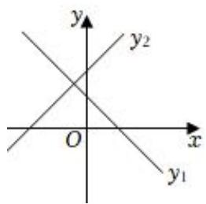

text_image

y
y₂
O
x
y₁

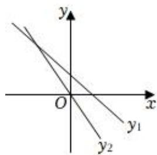

text_image

y
O
x
y₁
y₂

C

D．

9．若一次函数 $y = \left( 2 k { + } 1 \right) x { + } k - 3$ 的图象不经过第二象限，则 k 的值可以是（ ）

A．4

B．0

C．﹣2

D．﹣4

10．已知关于 x 的多项式 $x ^ { 2 } { + } k x { + } 1$ 是一个完全平方式，则在平面直角坐标系中，一次函数 $y = ~ ( k - 1 ) ~ x \mathrm { + } 5$ 的图象一定经过（ ）

A．第一、二、三象限

B．第一、二、四象限

C．第一、二象限

D．第三、四象限

11．已知函数 $y = \ ( m - 2 ) \ x ^ { | m ^ { - } 1 | _ { + 2 } }$ 是关于 x 的一次函数，则 m＝

12．若点 $P \ ( a , \ b )$ 在一次函数 $y = 3 x \mathrm { ~ - ~ } 1$ 的图象上，则代数式 $6 a - 2 b + 8$ 的值等于

13．已知 $A \ ( x _ { 1 } , \ y _ { 1 } ) , \ B \ ( x _ { 2 } , \ y _ { 2 } )$ ）是一次函数 $y = \left( 3 - 2 m \right) x + 1$ 的图象上两点，且 $( x _ { 1 } - x _ { 2 } ) \ ( y _ { 1 } - y _ { 2 } ) \ < 0$ ，则 m 的取值范围为

14．若关于 x 的不等式组 $\left\{ \begin{array} { l l } { { 2 \mathbf { x } > \mathbf { x } + 2 } } \\ { { 4 \mathbf { x } - 1 < \ l \mathrm { a } } } \end{array} \right.$ 有且只有两个整数解，关于 m 的一次函数 $y = m + a - 1 8$ 的图象不经过第二象限，则所有满足条件的整数 a的值之和为

15．如图，直线 $l : y = \frac { 2 } { 3 } x + 4$ 与 x 轴、y 轴分别交于点 A、B，点 C 是直线 l 上的一点，且其纵坐标为 2，点D 为 OA 的中点，点 P 为 y 轴上一动点，当 $P C + P D$ 的值最小时，则 $\triangle P C D$ 的周长是

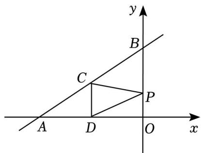

text_image

y
B
C
P
A D O x

16．已知函数 $y = \ ( 2 m + 1 ) \ x + m - 3$

（1）若函数图象与 y 轴交于点（0，﹣2），求 m 的值；

（2）若这个函数是一次函数，且 y 随着 x 的增大而减小，求 m 的取值范围

17．已知一次函数 $y = ( 2 a - 4 ) \ x + ( 3 - b ) \ ( a , \ b$ 是常数）

（1）若该一次函数为正比例函数，求 a 的取值范围和 b 的值；  
（2）若 y 随 x 的值增大而减小且不经过第一象限，求 a，b的取值范围．

18．已知直线 $y = 2 x + 4$ 与坐标轴分别交于点 A、B，点 C 在 x轴上，且 $S _ { \triangle A B C } { = } 6$

（1）画出函数 $y = 2 x + 4$ 的图象；  
（2）求 A、B、C 点的坐标

19．用“列表﹣描点﹣连线”的方法画出函数 $y = 2 x + 1$ 的图象

（1）列表：下表是 y 与 x 的几组对应值，请补充完整

<table><tr><td>x</td><td>...</td><td>-2</td><td>-1</td><td>0</td><td>1</td><td>2</td><td>...</td></tr><tr><td>y</td><td>...</td><td>-3</td><td>____</td><td>____</td><td>3</td><td>____</td><td>...</td></tr></table>

（2）描点连线：在平面直角坐标系 $x O y$ 中，将各点进行描点、连线，画出函数 $y = 2 x + 1$ 的图象；  
（3）写出函数 $y = 2 x + 1$ 的图象的两条特征

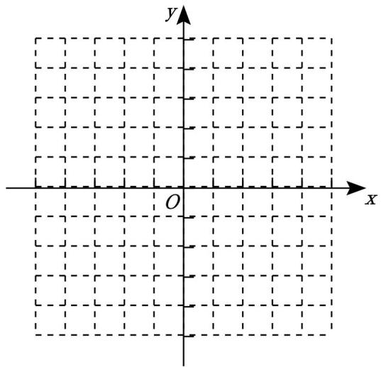

natural_image

Empty Cartesian coordinate system with x and y axes, no plotted data or text

20．如图点 $P \ ( x , \ y )$ 是第一象限内一个动点，且在直线 $y = - 2 x + 8$ 上，直线与 x轴交于点 A

（1）当点 P 的横坐标为 3 时， $\triangle A P O$ 的面积为多少？  
（2）设 $\triangle A P O$ 面积为 S，用含 x 的解析式表示 S，并写出 x 的取值范围

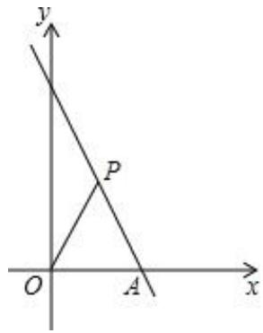

text_image

y
P
O
A
x

