## 第 05 讲 一次函数（2）

## 01

## 学习目标

<table><tr><td>课程标准</td><td>学习目标</td></tr><tr><td>1一次函数图像的平移2一次函数解析式3一次函数的应用</td><td>1. 掌握一次函数图像的平移规律,并能够熟练的运用。2. 掌握待定系数法求函数解析式,并熟练应用其求一次函数解析式。3. 掌握一次函数的基本性质,并能够熟练的运用一次函数的基本性质解决相关的实际问题。</td></tr></table>

## 02

## 思维导图

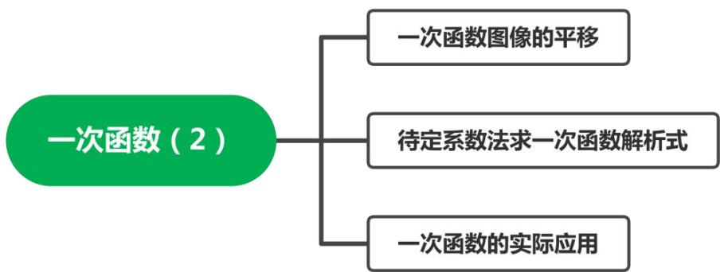

flowchart

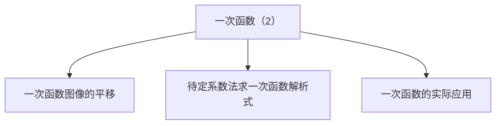

##

##

## 知识点01 一次函数图像的平移

## 1. 一次函数的平移变换：

①一次函数的左右平移：

函数在进行左右平移时，平移变换规律为在 自变量 上加减平移单位。左加右减。

I：若函数 $y = k x + b$ 向左平移 $a$ 个单位长度，则平移后得到的函数解析式为 $\underline { { \boldsymbol { y } } } = \boldsymbol { k } \big ( \boldsymbol { x } + \boldsymbol { a } \big ) + \boldsymbol { b } $

II：若函数 $y = k x + b$ 向右平移 a个单位长度，则平移后得到的函数解析式为 $\scriptstyle \underline { { \gamma = k ( x - a ) + b } }$ 。

②一次函数的上下平移：

函数在进行上下平移时，平移变换规律为在 函数解析式 上加减平移单位。上加下减。

I：若函数 $y = k x + b$ 向上平移 a 个单位长度，则平移后得到的函数解析式为 $y = k x + b + a$

II：若函数 $y = k x + b$ 向下平移 a 个单位长度，则平移后得到的函数解析式为 $\ y = k x + b - a$ 。

## 【即学即练1】

1．把直线 $l \colon y = - 2 x$ 沿 x轴正方向向右平移 2 个单位得到直线 l′，则直线 l'的解析式为（

A． $y = - 2 x + 4$

B．y＝﹣2x+2

C．y＝2x+4

D．y＝﹣2x﹣2

【分析】根据“左加右减”的原则进行解答即可

【解答】解：把直线 $l \colon y = - 2 x$ 沿 x 轴正方向向右平移 2 个单位得到直线 l′，则直线 l'的解析式为 $y =$ $\mathit { \Pi } _ { - \mathrm { ~ 2 ~ } } \left( x - 2 \right)$ ），即 $y = - ~ 2 x { + } 4$ ．

故选：A．

## 【即学即练2】

2．将直线 $y = 2 x - 1$ 向上平移 3 个单位长度，得到的直线的解析式是（ ）

A． $y = 2 x + 5$

B． $y = 2 x - 7$

C．y＝2x+2

D．y＝2x﹣4

【分析】根据“上加下减”的函数图象平移规律来解答

【解答】解：将直线 $y = 2 x \mathrm { ~ - ~ } 1$ 向上平移 3个单位长度，平移后直线的解析式为 $y = 2 x - 1 + 3$ ，即 $y = 2 x + 2$ ，故选：C

## 拓展：一次函数的对称变换：

一、函数关于x轴对称：

若函数关于x轴对称，函数的自变量 不发生变化 ，函数值变为原来的 相反数

即 $y = k x + b$ 关于x轴对称的函数解析式为 $y = - k x - b$ 。

二、函数关于 y 轴对称：

若函数关于 y 轴对称，函数的函数值 不发生变化 ，自变量变为原来的 相反数 。

即 $y = k x + b$ 关于 y 轴对称的函数解析式为 $y = - k x + b$

## 拓展：一次函数的翻折变换：

$\therefore y = k x + b \Rightarrow y = \left| k x + b \right|$

在函数解析式上添加绝对值符号相当于把函数图像在 x 轴下方的部分沿 x 轴向上翻折。

$\begin{array} { r } { \stackrel { - } { \_ } y = k x + b \Rightarrow y = k \vert x \vert + b } \end{array}$

在函数解析式的自变量上加绝对值符号相当于把函数解析式 y 轴左边的图像去掉，再把右边的部分沿 y轴向左翻折，翻折前后的两部分为新的函数图像。

## 【即学即练1】

3．将 $y = \frac { 1 } { 2 }$ （ ）

A． $y = \frac { 1 } { 2 } x - 2$ x-2

B． $\mathbf { y } = \frac { 1 } { 2 } \mathbf { x } + 2$ x+2

$y = \frac { 1 } { 2 } x + 2$

$y = \frac { 1 } { 2 } x - 2$

【分析】利用平移规律得出平移后关系式，再利用关于 x 轴对称的性质得出答案

【解答】解：将 $y = \frac { 1 } { 2 }$ 的图象沿 y 轴向上平移 2 个单位长度，所得的函数是 $y = \frac { 1 } { 2 } x + 2$ ，

将该函数的图象沿 x 轴翻折后所得的函数关系式 $- y = \frac { 1 } { 2 } x + 2$ ， $y = - \frac { 1 } { 2 } x - 2$

故选：A

## 【即学即练2】

4．学习“一次函数”时，我们从“数”和“形”两方面研究了一次函数的性质，并积累了一些经验和方法，尝试用你积累的经验和方法解决下面问题

<table><tr><td>x</td><td>...</td><td>-3</td><td>-2</td><td>-1</td><td>0</td><td>1</td><td>2</td><td>3</td><td>...</td></tr><tr><td>y</td><td>...</td><td>____</td><td>____</td><td>____</td><td>____</td><td>____</td><td>____</td><td>____</td><td>...</td></tr></table>

（1）在平面直角坐标系中，画函数 $y = | x | { + } 1$ 的图象：

①列表：完成表格；  
②画出 $y = | x | { + } 1$ 的图象；

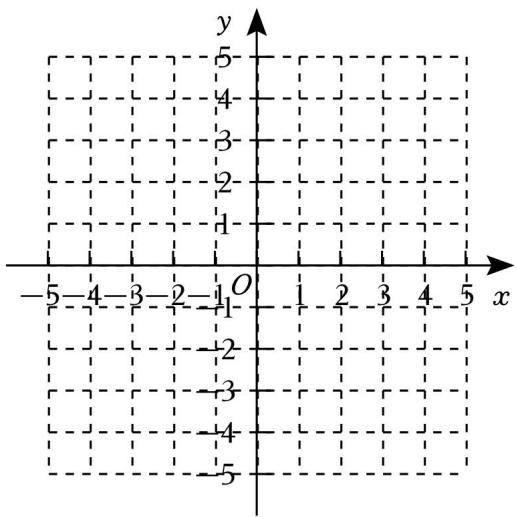

text_image

y
-5 -4 -3 -2 -1 O 1 2 3 4 5 x
-5

（2）结合所画函数图象，写出 $y = | x | + 1$ 两条不同的性质；  
（3）直接写出函数 $y = \left| x \right|$ 的图象是由函数 $y = | x | { + } 1$ 的图象怎样得到的？

【分析】（1）把 x的值代入解析式计算即可；

（2）根据图象所反映的特点写出即可；  
（3）根据函数的对应关系即可判定

【解答】解：（1）①填表如下：

<table><tr><td>x</td><td>...</td><td>-3</td><td>-2</td><td>-1</td><td>0</td><td>1</td><td>2</td><td>3</td><td>...</td></tr><tr><td>y</td><td>...</td><td>4</td><td>3</td><td>2</td><td>1</td><td>2</td><td>3</td><td>4</td><td>...</td></tr></table>

故答案为：4，3，2，1，2，3，4；

②如图所示：

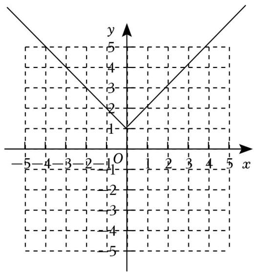

text_image

y
5
4
3
2
1
O
-5 -4 -3 -2 -1 1 2 3 4 5 x
-1
-2
-3
-4
-5

（2）①y＝|x|+1 的图象位于第一、二象限，在第一象限 y随 x的增大而增大，在第二象限 y随 x 的增大而减小，②函数有最小值，最小值为 1；

（3）函数 $y = | x | + 1$ 的图象向下平移 1 个单位得到函数 y＝|x|的图象．

## 知识点02 待定系数法求一次函数解析式

1. 待定系数法求一次函数解析式：

具体步骤：

①设：设一次函数解析式 $y = k x + b ( k \neq 0 )$ 。  
②找点：找一次函数图像上的点。  
③带入：将找到的点的坐标带入函数解析式中得到方程（或方程组）。  
④解：解③中得到的方程（或方程组），求出k，b的值。  
⑤反带入：将求出的k，b的值带入函数解析式中得到函数解析式。

## 【即学即练1】

5．已知一次函数的图象经过 A（﹣1，4），B（1，﹣2）两点

（1）求该一次函数的解析式；  
（2）直接写出函数图象与两坐标轴的交点坐标  
【分析】（1）利用待定系数法容易求得一次函数的解析式；  
（2）分别令 $x { = } 0$ 和 $y = 0$ ，可求得与两坐标轴的交点坐标

【解答】解：（1）∵图象经过点 $( \mathit { \Pi } - \ 1 , \ \ 4 ) , \ ( \ 1 , \ \mathit { \Pi } - \ 2 )$ ）两点，

∴把两点坐标代入函数解析式可得 $- k + b = 4 ,$

解得 $\left\{ \begin{array} { l l } { \mathbf { k } = - 3 } \\ { \mathbf { b } = 1 } \end{array} \right.$ ，

一次函数解析式为 $y = - ~ 3 x + 1$ ；

（2）在 $y = - ~ 3 x + 1$ 中，令 y＝0，可得 $- \ 3 x + 1 = 0$ ，解得 $x { = } \frac { 1 } { 3 }$ ；

令 $x { = } 0$ ，可得 $y = 1$ ，

$\therefore$ 一次函数与 x 轴的交点坐标为 $( { \frac { 1 } { 3 } } , \ 0 )$ ），与 y 轴的交点坐标为（0，1）

## 知识点03 一次函数的应用

## 1. 分段函数：

在一次函数的实际应用中，最常见为分段函数。分段函数是在不同区间有不同对应方式的函数，要特别注意自变量取值范围的划分，既要科学合理，又要符合实际。

关键点：①分段函数各段的函数解析式。

②各个拐点的实际意义。

③函数交点的实际意义。

## 2. 一次函数的综合：

（1）一次函数与几何图形的面积问题

首先要根据题意画出草图，结合图形分析其中的几何图形，再求出面积

（2）一次函数的优化问题

通常一次函数的最值问题首先由不等式找到x的取值范围，进而利用一次函数的增减性在前面范围内的前提下求出最值。

（3）用函数图象解决实际问题

从已知函数图象中获取信息，求出函数值、函数表达式，并解答相应的问题。

解决一次函数的实际应用题必须弄清楚自变量的取值范围。

## 【即学即练1】

6．2023年 7 月 28 日至 2023 年 8 月 8日，第 31 届世界大学生夏季运动会在成都成功举办，美丽的东安湖体育公园给国内外朋友留下了深刻的印象；在公园建设过程中，准备在一块草地上种植甲、乙两种花卉，经市场调查，甲种花卉的种植单价 $y ( \overline { { \mathcal { T } } } )$ 与种植面积 $x \ ( m ^ { 2 } )$ ） 之间的函数关系如图所示，乙种花卉的种植费用为每平方米 100元

（1）直接写出当 $0 { \leqslant } x { \leqslant } 4 0 0$ 和 $x { > } 4 0 0$ 时，y 与 x 的函数关系式；

（2）广场上甲、乙两种花卉的种植面积共 $1 0 0 0 m ^ { 2 }$ 最终花费为 121000元，那么甲、乙两种花卉的种植面积分别为多少？

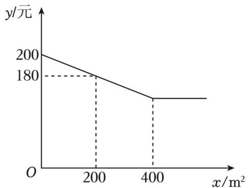

line chart

| x/m² | y/元 |
| ---- | ---- |
| 0    | 200  |
| 200  | 180  |
| 400  | 180  |

【分析】（1）根据函数图象用待定系数法求分段函数解析式；

（2）分当 $0 { \leqslant } x { \leqslant } 4 0 0$ 和 $x { > } 4 0 0$ 时两种情况，根据总费用＝两种花卉费用之和列出方程，解方程即可

【解答】解：（1）当 $0 { \leqslant } x { \leqslant } 4 0 0$ 时，设 y 与 x的函数关系式为 $y = k x + b$ ，

把（0，200），（200，180）代入解析式得： $\left\{ { \begin{array} { l } { { \mathrm { b } } = 2 0 0 } \\ { 2 0 0 k + { \mathrm { b } } = 1 8 0 } \end{array} } \right. ,$

解得 $\left\{ \begin{array} { l } { \displaystyle \mathrm { k } = - \frac { 1 } { 1 0 } } \\ { \displaystyle \mathrm { b } = 2 0 0 } \end{array} \right.$

$$
\therefore y = - \frac {1}{1 0} x + 2 0 0;
$$

当 $x { = } 4 0 0$ 时， $y = - \frac { 1 } { 1 0 } \times 4 0 0 + 2 0 0 = 1 6 0$

$\therefore$ 当 $x { > } 4 0 0$ 时， $y = 1 6 0$

$\therefore y$ 与 x的函数关系式为 $y = \left\{ \begin{array} { l l } { - \frac { 1 } { 1 0 } { \bf x } + 2 0 0 ( 0 \leqslant { \bf x } \leqslant 4 0 0 ) } \\ { 1 6 0 ( { \bf x } > 4 0 0 ) } \end{array} \right.$ 1×+200（0≤x≤400） ；

（2）当 $0 { \leqslant } x { \leqslant } 4 0 0$ 时，

由题： $\mathbf { x } ( - \frac { 1 } { 1 0 } \mathbf { x } + 2 0 0 ) + 1 0 0 ( 1 0 0 0 - \mathbf { x } ) = 1 2 1 0 0 0$ 1+200）1000-x）210

解得 $x _ { 1 } = 3 0 0 , ~ x _ { 2 } = 7 0 0$ （舍）；

当 $x { > } 4 0 0$ 时，

$$
1 6 0 x + 1 0 0 (1 0 0 0 - x) = 1 2 1 0 0 0,
$$

解得 $x = 3 5 0 ~ ( \widehat { \sharp } )$ ），

∴甲、乙两种花卉的种植面积分别为 300和 $7 0 0 m ^ { 2 }$

## 题型01 求平移前后的函数解析式

【典例1】将直线 $y = 3 x$ 向上平移 2 个单位长度，所得直线的关系式为（ ）

A． $y = 3 x + 2$

B． $y = 3 ( x + 2 )$ ）

C．y＝3（x﹣2）

D．y＝3x﹣2

【分析】根据一次函数图象向上平移的性质：左加右减、上加下减的特点，再结合题意求解析式即可

【解答】解：直线 y＝3x 向上平移 2个单位长度，

$$
\therefore y = 3 x + 2,
$$

故选：A．

【变式1】将函数 $y { = } 2 x { + } 3$ 的图象向上平移 2 个单位长度，所得直线对应的函数表达式为（ ）

A． $y = 2 x + 1$

B． $y = 2 x + 2$

C．y＝2x+4

D． $y = 2 x + 5$

【分析】根据一次函数平移法则“上加下减”直接写出平移后的解析式即可

【解答】解：将函数 $y = 2 x + 3$ 的图象向上平移 2个单位长度得到新的函数解析式为： $y = 2 x + 5$ ，故选：D．

【变式 2】将一次函数 $y = - \ 3 x \cdot 1$ 的图象沿 y轴向下平移 3个单位长度后，所得图象的函数表达式为（

A． $y = - 3 ( x - 3 )$

B．y＝﹣3x+2

C．y＝﹣3（x+3）

D．y＝﹣3x﹣4

【分析】直接根据“上加下减”的原则进行解答即可

【解答】解：将直线 $y = - ~ 3 x ^ { \mathrm { ~ - ~ } } 1$ 沿 y轴向下平移 3个单位后的直线所对应的函数解析式是： $y = - ~ 3 x ^ { \mathrm { ~ - ~ } } 1$ $- 3 = - 3 x - 4 .$

故选：D．

【变式 3】把直线沿 y 轴向上平移 2 个单位长度得到直线 $y = - ~ 2 x - 1$ ，则平移前直线的函数解析式为（

A． $y = - ~ 2 x + 1$

B． $y = - ~ 4 x - 3$

C． $y = - 2 x - 3$

D． $y = - ~ 2 x - 1$

【分析】直接根据“上加下减，左加右减”的原则进行解答即可

【解答】解：把直线沿 y 轴向上平移 2 个单位长度得到直线 $y = - ~ 2 x ^ { \mathrm { ~ - ~ } } 1$ ，

则平移前的直线解析式为： $y = - ~ 2 x - 1 - 2 = - ~ 2 x - 3$

故选：C

【变式 4】在平面直角坐标系中，将一条直线向下平移 3 个单位长度，再向右平移 2 个单位长度，得到直线 $y = 2 x - 6$ ，则平移前的直线解析式为： y＝2x+1

【分析】直接根据“上加下减，左加右减”的原则进行解答即可

【解答】解：将一条直线向下平移 3个单位长度，再向右平移 2个单位长度，得到直线 $y = 2 x - 6$ 则平移前的直线解析式为： $y = 2 ( x + 2 ) - 6 + 3 = 2 x + 1$

故答案为： $y = 2 x + 1$

## 题型 02 利用函数的平移求值

【典例 1】在平面直角坐标系中，若要使直线 $y _ { 1 } = - ~ 4 x + 4$ 平移后得到直线 $y _ { 2 } = - ~ 4 x - 1$ ，则应将直线 y（1

A．向上平移 5个单位

B．向下平移 5个单位

C．向左平移 5 个单位

D．向右平移 5个单位

【分析】利用一次函数图象的平移规律，右加左减，上加下减，即可得出答案

【解答】解：设将直线 $y _ { 1 } = - ~ 4 x + 4$ 向左平移 a个单位后得到直线 $y _ { 2 } = - 4 ( x + a ) + 4 ( a > 0 )$ ），

$$
\therefore - 4 (x + a) + 4 = - 4 x - 1,
$$

解得： $a = \frac { 5 } { 4 }$ ，

故将直线 $y _ { 1 } = - ~ 4 x + 4$ 向左平移 $\frac { 5 } { 4 }$ 个单位后得到直线 $y _ { 2 } = - ~ 4 x - 1$ ，

同理可得，将直线 $y _ { 1 } = - ~ 4 x + 4$ 向下平移 5个单位后得到直线 $y _ { 2 } = - ~ 4 x - 1$ ，

观察选项，只有选项 B 符合题意

故选：B．

【变式 1】将一次函数 $y = - ~ 5 x + 3$ 的图象向下平移 m 个单位长度，使其成为正比例函数，则 m 的值为（

A．﹣3

B．﹣5

C．3

D．5

【分析】求出平移后的函数为 $y = - 5 x + 3 - m$ ，再由题意可得方程 $3 \textrm { -- } m { = } 0$ ，求出 m 的值即可

【解答】解：将一次函数 $y = - ~ 5 x + 3$ 的图象向下平移 m 个单位长度，

∴平移后的函数解析式为 $y = - 5 x + 3 - m$ ，

∵平移后为正比例函数，

$$
\therefore 3 - m = 0,
$$

解得 m＝3，

故选：C

【变式 2】将一次函数 $y = x - 2$ 的图象沿 y轴向上平移 m 个单位长度后经过点（1，4），则 m 的值为（ ）

A．6

B．5

C．﹣5

D．﹣6

【分析】先求出函数平移后的解析式，再把点（1，4）代入求出 m 的值即可

【解答】解：∵一次函数 $y = x - 2$ 的图象沿 y轴向上平移 m 个单位长度，

∴平移后的解析式为 $y = x - 2 + m$ ，

∵平移后经过点（1，4），

$$
\therefore 4 = 1 - 2 + m,
$$

解得 m＝5

故选：B．

【变式 3】已知直线 l 与 x 轴交于点 A（﹣2，0），且直线 l 与两坐标轴围成的三角形的面积为 4，将直线l1向下平移 $m \ ( m { > } 0 )$ ）个单位得到直线 l2，直线 l2交 x轴于点 B，若点 A 与点 B 关于 y 轴对称，则 m 的值为（ ）

A．8

B．7

C．6

D．5

【分析】根据题意求得 B（2，0），直线 l1与 y 轴的交点为（0，4），求得求得直线 l1为 $y = 2 x + 4$ ，进而

求得直线 l2为 $y = 2 x + 4 - m$ ，代入 B 点的坐标，即可求得 m 的值．

【解答】解：∵直线 l1与 x 轴交于点 A（﹣2，0），

$$
\therefore O A = 2,
$$

∵直线 l1与两坐标轴围成的三角形的面积为 4，

∴直线 l1与 y 轴的交点为（0，4）或（0，﹣4），

∵将直线 l1向下平移 $m \ ( m > 0 )$ ）个单位得到直线 l2，直线 l2交 x 轴于点 B，若点 A 与点 B 关于 y 轴对称，∴B（2，0），

∴直线 l1与 y 轴的交点为（0，4），

∴直线 l1为 $y = 2 x + 4 ,$ ，

∴直线 l2为 $y = 2 x + 4 - m$ ，

代入 B（2，0）得， $0 { = } 2 { \times } 2 { + } 4 {  { \mathrm { ~ - ~ } } } m$

解得 $m { = } 8$

故选：A

【变式 4】在平面直角坐标系中，将一次函数 y＝3x+m（m 为常数）的图象向上平移 2 个单位长度后恰好经过原点，若点 A（﹣1，a）在一次函数 $y = 3 x + m$ 的图象上，则 a 的值为（ ）

A．1

B．﹣2

C．﹣4

D．﹣5

【分析】先根据平移原则得到 m 的值，再把点 $\textit { A } \left(  { \mathrm { ~ - ~ } } 1 ,  { \mathrm { ~ } } a \right)$ 代入 $y = 3 x + m$ ，则可求出 a 的值

【解答】解：∵将一次函数 y＝3x+m（m 为常数）的图象向上平移 2 个单位长度后得到 $y = 3 x + m + 2$ ，且经过原点，

$$
\therefore m + 2 = 0,
$$

$$
\therefore m = - 2,
$$

$$
\therefore y = 3 x - 2,
$$

∵点 A（﹣1，a）在一次函数 $y = 3 x - 2$ 的图象上，

$$
\therefore a = 3 \times (- 1) - 2 = - 5,
$$

故选：D．

【变式 5】如图，直线 y＝2x+4 与 x 轴、y 轴分别交于点 A、B 两点，以 OB 为斜边在 y轴右侧作 $\ R t { \triangle } O B C$ 且 $\angle O B C = 3 0 ^ { \circ }$ °，将直线 $y = 2 x + 4$ 向下平移 m 个单位，使平移后的直线经过点 C，则 m 的值是（ ）

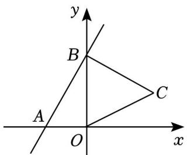

text_image

y
B
A
O
x
C

A． $3 + 2 \sqrt { 3 }$

B．8

C． $2 + 3 \sqrt { 3 }$

D．4

【分析】过点 C 作 $C D \perp x$ 轴于点 D，先求出 OB＝4，利用含 $3 0 ^ { \circ }$ 角的直角三角形的性质可得 $O C = 2$ ，

$C D = 1$ ，利用勾股定理可得 $O D = \sqrt { 3 }$ ，从而可得 $\complement ( { \sqrt { 3 } } , \ 1 )$ ，再根据一次函数图象的平移规律可设平移后的直线的解析式为 $y = 2 x + 4 - m$ ，将点 $C ( \sqrt { 3 }$ 代入计算即可得．

【解答】解：如图，过点 C 作 $C D \perp x$ 轴于点 D，

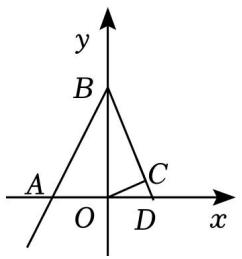

text_image

y
B
A
O
D
x
C

对于一次函数 $y = 2 x + 4$ ，

当 $x { = } 0$ 时， $y = 4$ ，即 $O B { = } 4$ ，

∵在 $\mathrm { R t } \triangle O B C$ 中， $\angle O B C = 3 0 ^ { \circ }$

$$
\therefore \angle B O C = 6 0 ^ {\circ}, O C = \frac {1}{2} O B = 2,
$$

$$
\because \angle B O D = 9 0 ^ {\circ},
$$

$$
\therefore \angle C O D = 3 0 ^ {\circ},
$$

在 $\mathrm { R t } \triangle C O D$ 中， $C D = \frac { 1 } { 2 } O C = 1$ $O D = \sqrt { O C ^ { 2 } - C D ^ { 2 } } = \sqrt { 3 }$ ，

$$
\therefore C (\sqrt {3}, 1),
$$

设将直线 $y = 2 x + 4$ 向下平移 m 个单位，使平移后的直线的解析式为 $y = 2 x + 4 - m$

将点 $\complement ( { \sqrt { 3 } } , \ 1 )$ 代入得： $2 \sqrt { 3 } + 4 - \pi = 1$

解得 $m = 3 + 2 \sqrt { 3 }$ ，

故选：A

【变式 6】图象法是函数的表示方法之一，下面我们就一类特殊的函数图象展开探究

<table><tr><td>x</td><td>...</td><td>-3</td><td>-2</td><td>-1</td><td>0</td><td>1</td><td>2</td><td>3</td><td>...</td></tr><tr><td> $y_1=2|x|$ </td><td>...</td><td>6</td><td>4</td><td>2</td><td>0</td><td>2</td><td>4</td><td>6</td><td>...</td></tr></table>

画函数 $_ { y 1 } = 2 | x |$ 的图象，经历列表、描点、连线过程得到函数图象如图所示：

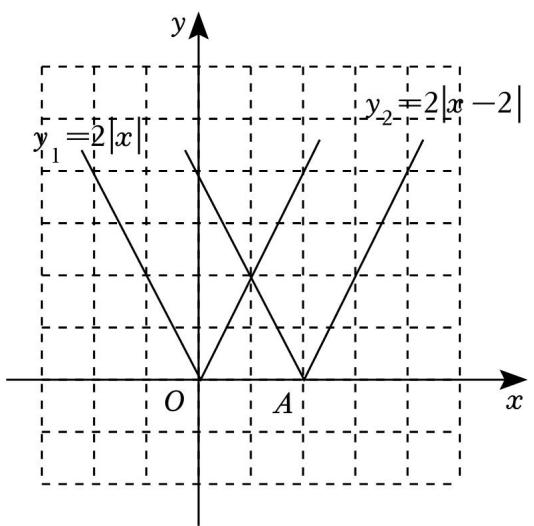

text_image

y
y₁=2|x|
O
A
x
y₂=2|x-2|

探究发现：函数 $y _ { 2 } = 2 | x - 2 |$ |的图象是由 $y _ { 1 } = 2 | x |$ 向右平移 2 个单位得到；函数 $y _ { 3 } = 2 | x - 2 | + 3$ 的图象是由$y _ { 2 } = 2 | x - 2 |$ 向上平移 3个单位得到

（1）函数 $y _ { 3 } = 2 | x - 2 | + 3$ 的最小值为 3 ；  
（2）函数 $y _ { 4 } = 2 | x - m | + 3$ 在 $\scriptstyle - 2 \leqslant x \leqslant 1$ 中有最小值 4，则 m 的值是 $- \frac { 3 } { 2 } \geq \frac { 5 } { 2 } -$

【分析】（1）函数 $y _ { 3 } = 2 | x - 2 | + 3$ 中， $2 | x - 2 | \geqslant 0$ ，可直接写出最小值；

（2）从函数 $y _ { 4 } = 2 | x - m | + 3$ 对称轴 $x { = } m$ 分情况讨论在 $\scriptstyle - 2 \leqslant x \leqslant 1$ 中有最小值 4，求出 m 的值即可

【解答】解： $( 1 ) \because 2 | x - 2 | \geq 0$ ，

$$
\therefore 2 | x - 2 | + 3 \geqslant 3,
$$

∴函数 $y _ { 3 } = 2 | x - 2 | + 3$ 的最小值为 3，

故答案为：3；

（2）函数 $y _ { 4 } = 2 | x - m | + 3$ 的对称轴是直线 $x { = } m$ ，

①当 $x { < } m$ 时，y 随 x 的增大而减小，

$\because$ 函数在 $\scriptstyle - 2 \leqslant x \leqslant 1$ 中有最小值 4，即 $x = 1$ 时 $y = 4$ ，

$$
\therefore 4 = 2 \vert 1 - m \vert + 3,
$$

即 $| 1 - m | = \frac { 1 } { 2 }$ ，

$$
\therefore 1 - m = \pm \frac {1}{2},
$$

解得 $m { = } \frac { 3 } { 2 } \equiv \frac { 1 } { 2 }$ （舍去），

②当 $x > m$ 时，y 随 x 的增大而增大，

$\because$ 函数在 $\scriptstyle - 2 \leqslant x \leqslant 1$ 中有最小值 4，即 $x = - 2$ 时 $y = 4$

$$
\therefore 4 = 2 \vert - 2 - m \vert + 3,
$$

$\therefore 1 - 2 - m = \frac { 1 } { 2 }$ ，即 $- \ 2 - m = \pm \frac { \ 1 } { \ 2 }$ ，

解得： $m = - \frac { 5 } { 2 }$ 或 $m = - \frac { 3 } { 2 }$ （舍去）．

综上分析，m 的值为： $\frac { 3 } { 2 } = x - \frac { 5 } { 2 }$

故答案为： $\frac { 3 } { 2 } = x - \frac { 5 } { 2 }$

## 题型 03 函数的对称

【典例 1】若一次函数 $y = k x + b ( k \neq 0 )$ ）与 $y = - x + 2$ 的图象关于 y 轴对称，则 k＝（

A．1

B．2

C．3

D．4

【分析】由直线 $y = - x + 2$ ，知与 x 轴交于（2，0），与 y 轴交于（0，2），根据轴对称性质，直线 $y = k x + b$ 经过点（﹣2，0），（0，2），建立二元一次方程组求解

【解答】解：直线 $y = - \ x + 2 , \ x = 0$ 时， $y = 2 ; y = 0$ 时， $x { = } 2 $ ；

$\therefore$ 直线 $y = - x + 2$ 与 x 轴交于（2，0），与 y 轴交于（0，2）

$\therefore$ 直线 $y = k x + b$ 经过点（﹣2，0），（0，2）

$$
\therefore \left\{ \begin{array}{l} - 2 k + b = 0 \\ b = 2 \end{array} , \right.
$$

解得 k＝1

故选：A．

【变式 1】已知直线 $y = - { \frac { 1 } { 2 } } x + 1$ 与直线 l 关于 x 轴对称，则直线 l 与 y 轴的交点坐标是（

A．（0，﹣1）

B．（0，1）

C．（2，0）

D．（﹣2，0）

【分析】求出直线 $\mathbf { y } = \frac { 1 } { 2 } \mathbf { x } + 1$ 2 -x+1 与 y 轴交点为（0，1），然后根据关于 x 轴对称的点的坐标特征可得答案

【解答】解：在 $y = - \frac { 1 } { 2 } x + 1$ 中，，令 x＝0 得 y＝1，

∴直线 y＝ $\therefore$ $y = - \frac { 1 } { 2 } x + 1$ 与 y 轴交点为（0，1），

$\because$ 直线 $\mathbf { y } = \frac { 1 } { 2 } \mathbf { x } + 1$ 与直线 l 关于 x轴对称，

$\therefore$ 直线 l 与 y 轴的交点坐标是（0，﹣1），

故选：A

【变式 2】已知直线 $l _ { 1 }$ 的表达式为 $y = - 2 x + b$ ，若直线 $l _ { 1 }$ 与直线 $l _ { 2 }$ 关于 y轴对称，且 l2经过点（1，6），则b的值为（

A．8

B．4

C．﹣8

D．﹣4

【分析】先求出点（1，6）关于 y 轴的对称点的坐标，再代入直线 $y = - 2 x + b$ ，求出 b的值即可

【解答】解：∵l2经过点（1，6），

∴点（1，6）关于 y 轴的对称点为（﹣1，6），

∵直线 l1与直线 l2关于 y 轴对称，

∴点（﹣1，6）在直线 l1上，

$$
\therefore 2 + b = 6,
$$

$$
\therefore b = 4.
$$

故选：B．

【变式 3】在平面直角坐标系中，直线 $y = - 3 x + 2  y = k x + b$ 关于 x 轴对称，那么对于一次函数 $y = k x + b$ ，当 x 每增加 1 时，y增加（ ）

A．12

B．6

C．3

D．1

【分析】先求出直线 $y = - ~ 3 x + 2$ 关于 x 轴对称的直线解析式，即 $y = k x + b$ ，再根据函数的性质得出结论

【解答】解：直线 $y = - ~ 3 x + 2$ 关于 x 轴对称的直线解析式为 $y = 3 x - 2$ ，

∵直线 $y = - ~ 3 x + 2$ 与 $y = k x + b$ 关于 x 轴对称，

$$
\therefore y = k x + b = 3 x - 2,
$$

∴当 x 每增加 1 时，y增加 3，

故选：C

## 题型04 求一次函数解析式

【典例 1】已知 y 是关于 x 的一次函数，且点 A（0，4），B（﹣2，0）在此函数图象上

（1）求这个一次函数的表达式；  
（2）当 y≥﹣1 时，求 x 的取值范围

【分析】（1）利用待定系数法求一次函数解析式；  
（2）先根据题意列不等式 $2 x + 4 \geqslant - \ 1$ ，然后解不等式即可

【解答】解：（1）设一次函数解析式为 $y = k x + b$ ，

根据题意得 $b = 4$

解得 $\left\{ \begin{array} { l } { \mathbf { k } = 2 } \\ { \mathbf { b } = 4 } \end{array} \right. ,$

∴这个一次函数的表达式为 $y = 2 x + 4$ ；

（2）当 $y \geqslant - 1$ 时，即 $2 x + 4 \geqslant - \ 1$ ，

解得 $x \geq - \frac { 5 } { 2 }$ ，

即 x的取值范围为 $x \geq - \frac { 5 } { 2 }$

【变式 1】已知 y﹣2和 x成正比例，且当 $x { = } 1$ 时，当 $y = 1$

（1）求 $y  x$ 之间的函数关系式；  
（2）若点 $P ~ ( 3 , ~ m )$ 在这个函数图象上，求 m 的值

【分析】（1）根据正比例函数的定义设设 $y - 2 = k x \ ( \ k \neq 0 )$ ），然后把 x、y 的值代入求出 k 的值，再整理即可得解

（2）将点 P 的坐标代入函数解析式进行验证

【解答】（1）设 $y \mathrm { ~ - ~ } 2 { = } k x .$ ，

把 $x = 1 , \ y = 1$ 代入得： $1 - 2 = k$ ，

解得： $k = - \ 1$ ，

∴函数解析式是 $y = - x + 2$ ；

（2）∵点 $P ~ ( 3 , ~ m )$ 在这个函数图象上，

$$
\therefore m = - 1 \times 3 + 2 = - 1.
$$

【变式 2】如图，直线 l 经过点 A（1，6）和点 $B \ ( \ - \ 3 , \ - \ 2 )$ ）

（1）求直线 l 的解析式，直线与坐标轴的交点坐标；  
（2）求 $\triangle A O B$ 的面积

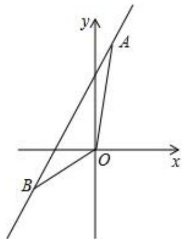

text_image

y
A
O
x
B

【分析】（1）利用待定系数法求出直线 l 的解析式，解一元一次方程求出直线与坐标轴的交点坐标；

（2）结合图形、根据三角形的面积公式计算即可

【解答】解：（1）设直线解析式为 $y = k x + b$ ，

把点 $A \ ( \ 1 , \ 6 )$ 和点 $B \ ( \ - \ 3 , \ - \ 2 )$ ）代入，

得， $\left\{ \begin{array} { l l } { k + b = 6 } \\ { - 3 k + b = - 2 } \end{array} \right. ,$

解得： $k { = } 2 , \ b { = } 4$ ，

所以， $y = 2 x + 4 ,$

$x { = } 0$ 时， $y = 4 ,$

$y = 0$ 时， $x = - 2$

则直线与 x 轴交点为（﹣2，0），与 y 轴交点为（0，4），

（2） $\triangle A O B$ 的面积 $\frac { 1 } { 2 } \times 2 \times 6 + \frac { 1 } { 2 } \times 2 \times 2 = 8$

【变式 3】一次函数 $y = k x + b ( k \neq 0$ ，b 为常数）的部分对应值如下表：

<table><tr><td>x</td><td>...</td><td>0</td><td>1</td><td>2</td><td>...</td></tr><tr><td>y</td><td>...</td><td>1</td><td>2a</td><td>2a+3</td><td>...</td></tr></table>

则该一次函数的表达式为（

A． $y = x + 1$

B． $y = 2 x + 1$

C． $y = 3 x + 1$

D． $y = 4 x + 1$

【分析】把表中的三组对应值分别代入 $y = k x + b$ 得到方程组，然后解方程组即可

【解答】解：根据题意得 $k + b = 2 a$

解得 $\left\{ \begin{array} { l } { \mathbf { k } = 3 } \\ { \mathbf { b } = 1 } \end{array} \right. ,$

所以一次函数解析式为 $y = 3 x + 1$

故选：C

【变式 4】在平面直角坐标系中，已知直线 $l \colon y { = } k x { + } b$ 过点 A（2，2），且与坐标轴交于点 B，则当 $\triangle O A B$ 的面积为 2，且直线 l 与 y 轴不平行时，直线 l 的表达式为 y＝2或 $y = \frac { 1 } { 2 } x + 1$ 或 $y = 2 x - 2$

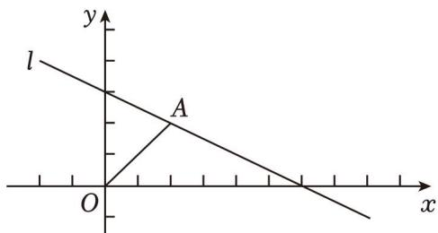

text_image

l
A
O
x
y

【分析】解分三种情况讨论，利用三角形面积公式求得 B 点的坐标，然后利用待定系数法即可求得直线l 的表达式

【解答】解：∵点 A（2，2）， $\triangle { O A B }$ 的面积为 2，且直线 l 与 y 轴不平行

$$
\therefore \frac {1}{2} O B \cdot 2 = 2,
$$

$$
\therefore O B = 2,
$$

∴B 点的坐标为（0，2）或（0，﹣2）或（﹣2，0），

当直线 l 过点（0，2）时，直线 l 的表达式为 $y = 2$ ；

当直线 l 过点（0，﹣2）时，则 $\scriptstyle \left\{ { \begin{array} { l } { 2 \mathbf { k } + \mathbf { b } = 2 } \\ { \mathbf { b } = - 2 } \end{array} } \right.$ ， 解得 $\left\{ \begin{array} { l l } { \mathbf { k } = 2 } \\ { \mathbf { b } = - 2 } \end{array} \right.$ ，

所以直线 l 的表达式为 $y = 2 x - 2$ ；

当直线 l 过点（﹣2，0）时，则 $2 k + b = 2$ 解得 $\left\{ \begin{array} { l l } { \displaystyle \mathbf { k } = \frac { 1 } { 2 } } \\ { \displaystyle \mathbf { b } = 1 } \end{array} \right.$ ，一

所以直线 l 的表达式为 $y = { \frac { 1 } { 2 } } x + 1$ ；

综上，直线 l 的表达式为 y＝2或 $y = \frac { 1 } { 2 } x + 1$ 或 $y = 2 x - 2$

故答案为：y＝2 或 $y = \frac { 1 } { 2 } x + 1$ 或 $y = 2 x - 2$

## 题型05 一次函数的应用— 图像分析

【典例 1】天气转暖，正是露营好时节．周六，小联同学一家从家出发，开车匀速前往离家 30 千米的露营基地．行驶 0.5 小时后，到达露营基地．在基地玩耍一段时间后，按照原路返程回家．由于车流增加，平均行驶速度比去基地的平均速度少 $\frac { 1 } { 6 }$ 在整个运动过程中，小联同学距家的距离 y（千米）与所用时6

间 x（小时）之间的函数关系如图所示，下列说法不正确的是（ ）

A．去基地的平均速度是每小时 60千米

B．露营玩耍的时长为 4 小时

C．回家的平均速度是每小时 50 千米

D．与家相距 10千米时，x 的值为 4.74

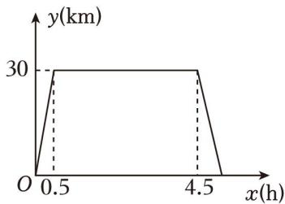

line chart

| x (h) | y (km) |
|---|---|
| 0.5 | 30 |
| 4.5 | 30 |
| 0.5 | 0 |

【分析】用路程除以时间可得去基地的平均速度是每小时 60千米，判断 A 正确；根据图象直接可判断 B正确；由按照原路返程回家．由于车流增加，平均行驶速度比去基地的平均速度 $= \frac { 1 } { 6 }$ 列式计算，可判断C 正确；去基地时，与家相距 10千米， $x = \frac { 1 0 } { 6 0 } = \frac { 1 } { 6 }$ 回家时，与家相距 10 千米， $x { = } 4 . 5 { + } \frac { 3 0 { - } 1 0 } { 5 0 } { = } 4 . 9$ ，50可判断 D 不正确．

【解答】解：去基地的平均速度是 30÷0.5＝60（千米/小时）；故 A 正确，不符合题意；

露营玩耍的时长为 4.5﹣0.5＝4（小时），故 B 正确，不符合题意；

回家的平均速度是 $6 0 \times ~ ( 1 - \frac { 1 } { 6 } ) = 5 0$ （千米/小时），故 C 正确，不符合题意；

去基地时，与家相距 10千米， $x = \frac { 1 0 } { 6 0 } = \frac { 1 } { 6 }$

回家时，与家相距 千米， $x { = } 4 . 5 { + } \frac { 3 0 { - } 1 0 } { 5 0 } { = } 4 . 9$

$\therefore$ 与家相距 10千米时，x 的值为 $\frac { 1 } { 6 }$ 或 4.9，故 D 不正确，符合题意；

故选：D．

【变式 1】小李家，小明家，学校依次在一条直线上．某天，小李和小明相约回家取球拍后回学校打球．他们同时从学校出发匀速返回家中，两人同时到家，小李到家取完球拍后立即以另一速度返回学校，小明取完球拍在家休息了 4min 后按原速返回，且同时到达学校（两人找球拍时间忽略不计）．小李和小明与

学校的距离 y（m）与两人出发时间 x（min）的函数关系如图所示．下列描述中，错误的是（ ）

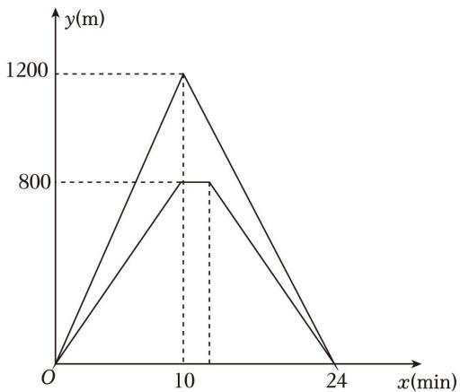

line chart

| x(min) | y(m) |
|---|---|
| 0 | 0 |
| 10 | 800 |
| 24 | 0 |
| 1200 | 1200 |

A．小李家距离学校 1200m  
B．小明速度为 62.5m/min  
C．小李返回学校的速度为 $\frac { 6 0 0 } { 7 } m / m i n$

D．两人出发 16min 时，小李与小明相距 $\frac { 3 2 0 } { 7 } \pi$

【分析】由图象可得小明家离学校800米，小李家离学校1200

米，由速度＝路程÷时间，可以两人的速度，由路程的和差关系可求两人出发 16min 时，小李和小明相距的路程，即可求解

【解答】解：由图象可得：小明家离学校 800 米，小李家离学校 1200米，

∴小明的速度为： 800 $\frac { 8 0 0 } { 1 0 } = 8 0$ （米/秒），小李的返回学校速度为： $\frac { 1 2 0 0 } { 2 4 - 1 0 } = \frac { 6 0 0 } { 7 }$ （米/秒）；

两人出发 16min 时，小李和小明相距： $1 2 0 0 - 8 0 0 + 8 0 \times ~ ( 1 6 - 1 4 ) ~ - \frac { 6 0 0 } { 7 } \times ~ ( 1 6 - 1 0 ) = \frac { 3 2 0 } { 7 }$ （米），

∴选项 ACD 都不符合题意，

故选：B．

【变式 2】甲、乙两人沿同一条路从 A 地出发，去往 100千米外的 B 地，甲、乙两人离 A 地的距离（千米）

与时间 t（小时）之间的关系如图所示，以下说法正确的是（ ）

A．甲出发 2 小时后两人第一次相遇

B．乙的速度是 30km/h

C．甲乙同时到达 B 地

D．甲的速度是 60km/h

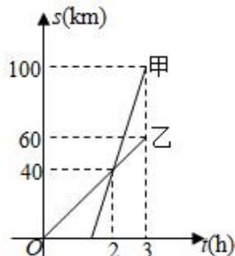

line chart

| t(h) | s(km) - 甲 | s(km) - 乙 |
|------|------------|------------|
| 0    | 0          | 0          |
| 2    | 40         | 40         |
| 3    | 100        | 60         |

【分析】根据函数图象中的数据，可以计算出各个选项中的说法是否正确，然后即可判断哪个选项中的说法是否正确

【解答】解：由图可知，乙出发 2 小时后两人第一次相遇，故 A 不正确，不符合题意；

乙 3小时走了 60 千米，速度是 20km/h，故 B 不正确，不符合题意；

由图可知，甲到达 B 地时，乙距 B 地还有 40千米，故 C 不正确，不符合题意；

甲的速度是 $ ( 1 0 0 \textrm { - } 4 0 ) \ \div \ ( 3 \textrm { - } 2 ) \ = 6 0 k m / h$ ，故 D 正确，符合题意；

故选：D

【变式 3】小明早晨 7：20从家里出发步行去学校（学校与家的距离是 1000 米），4 分钟后爸爸发现小明数学书没带，骑电瓶车去追赶，7：26 追上小明并将数学书交给他（交接时间忽略不计），交接完成后爸爸放慢速度原路返回，7：30小明到达学校，同时爸爸也正好到家．如图，线段 OA 与折线 $B ^ { \mathrm { ~ - ~ } } C ^ { \mathrm { ~ - ~ } } D$ 分别表示小明和爸爸离开家的距离 s（米）关于时间 t（分钟）的函数图象，下列说法错误的是（ ）

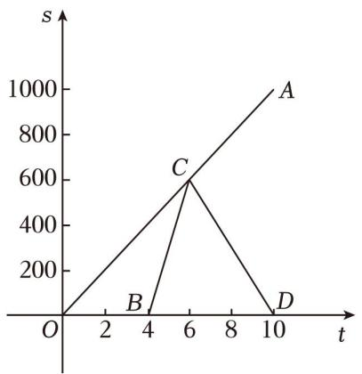

line chart

| Point | t | s |
|---|---|---|
| A | 10 | 1000 |
| B | 4 | 0 |
| C | 6 | 600 |
| D | 10 | 0 |

A．小明步行的速度为每分钟 100米  
B．爸爸出发时，小明距离学校还有 600米  
C．爸爸回家时的速度是追赶小明时速度的一半  
D．7：25 和 7：27 时，父子俩均相距 200 米

【分析】根据速度、路程、时间之间的关系等知识逐项判断即可

【解答】解：小明步行的速度为 $\frac { 1 0 0 0 } { 1 0 } = 1 0 0$ （米/分），

故 A 正确，不符合题意；

爸爸出发时小明离学校还有 $1 0 0 0 \cdot 4 \times 1 0 0 = 1 0 0 0 \cdot 4 0 0 = 6 0 0$ （米），

故 B 正确，不符合题意；

由题意知，爸爸用两分钟追上小明，

∴爸爸追赶小明时的速度为 $\frac { 1 0 0 \times 6 } { 2 } = 3 0 0$ （米/分），

爸爸回家的速度为： $\frac { 6 0 0 } { 1 0 - 6 } = 1 5 0$ （米/分），

∴爸爸回家时的速度是追赶小明时速度的一半，

故 C 正确，不符合题意；

设小明出发 t 分钟时父子俩相距 200米，

根据题意得：100t﹣300（t﹣4）＝200 或 $\left( 1 0 0 + 3 0 0 \right) \ \left( \begin{array} { l } { t - 6 } \end{array} \right) = 2 0 0$ ，

解得 t＝5 或 t＝6.5，

∴7：25和 7：26分 30秒时，父子俩均相距 200米，

故 D 错误，符合题意

故选：D．

【变式 4】甲、乙两人分别从 A、B 两地同时出发，相向而行，匀速前往 B 地、A 地，两人相遇时停留了 4min，又各自按原来速度前往目的地，甲、乙两人之间的距离 y（m）与甲所用时间 x（min）之间的函数关系如图所示，给出下列结论：①A、B 之间的距离为 1200m；②24min 时，甲、乙两人中有一人到达目的地； $\textcircled { 3 } b = 8 0 0 ; \textcircled { 4 } a = 3 2$ ，其中正确的结论个数为（ ）

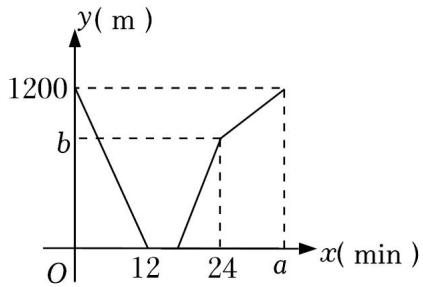

line chart

| x (min) | y (m) |
|---|---|
| 0 | 1200 |
| 12 | 0 |
| 24 | b |
| a | 1200 |

A．1 个

B．2 个

C．3 个

D．4 个

【分析】根据函数图象中的数据，可以直接看出 A，B 之间的距离，从而可以判断①；

根据图像倾斜程度，即可判断②；

根据图象中的数据和题意，可以求得甲和乙的速度之和，从而可以得到 b的值，从而判断③；

根据已知，可以先计算乙的速度，然后再计算出甲的速度，再根据图象，可以求得 a 的值，从而判断④

【解答】解：由图象可得，A，B 之间的距离为 1200m，故①正确；

根据图像可知，在 24min 时，甲、乙两人中有一人到达目的地，故②正确；

甲乙的速度之和为： $1 2 0 0 \div 1 2 { = } 1 0 0 ~ ( m / m i n )$ ），则 $b = \ ( \ 2 4 \mathrm { ~ - ~ } \ 1 2 \mathrm { ~ - ~ } 4 ) \ \times 1 0 0 { = } 8 0 0$ ，故③正确；

∵乙的速度为： $1 2 0 0 \div \ : ( 2 4 - 4 ) = 6 0 \ : ( m / m i n )$ ），甲的速度为： $1 2 0 0 \div 1 2 \cdot 6 0 = 1 0 0 \cdot 6 0 = 4 0 ( m / m i n )$ ，$\therefore a = 1 2 0 0 \div 4 0 + 4 = 3 0 + 4 = 3 4 \neq 3 2$ ，故④错误；

综上，正确的结论个数为 3个，

故选：C

【变式 5】如图，甲乙两人骑车都从 A 地出发前往 B 地，已知甲先出发 5 分钟后，乙才出发，乙在 A，B之间的 C 地追赶上甲，当乙追赶上甲后，乙立即原路返回（掉头时间忽略不计），甲继续往 B 地前行，乙返回 A 地后停止骑行，甲到达 B 地后停止骑行．在整个骑行过程中，甲和乙都保持各自速度匀速骑行，甲、乙两人相距的路程 y（米）与甲出发的时间 x（分钟）之间的关系如图所示．下列结论：

①A，B 两地相距 6300米  
②甲的速度为 150米/分；乙的速度为 227.5米/分  
③乙用 15 分钟追上甲．  
④图中 P 点的坐标为（25，3750）

其中说法正确的有（ ）

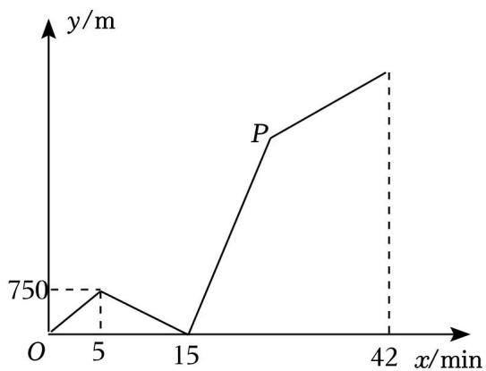

line chart

| x/min | y/m |
|---|---|
| 0 | 0 |
| 5 | 750 |
| 15 | 0 |
| 42 | >750 |

A．1 个

B．2 个

C．3 个

D．4 个

【分析】求出甲的速度为：750÷5＝150（米/分），可得 A，B 两地相距 42×150＝6300（米），判断①正确，列式求出乙的速度为 225（米/分），判断②不正确；乙用 10 分钟追上甲；判断③不正确；乙返回 A地时， $x = 1 5 + ~ ( 1 5 - 5 ) ~ = 2 5$ ，而 $2 5 \times 1 5 0 = 3 7 5 0 .$ ，故 P 点的坐标为（25，3750），判断④正确

【解答】解：由图象可得，

甲的速度为：750÷5＝150（米/分）；

∵42×150＝6300（米），

∴A，B 两地相距 6300米；故①正确；

乙的速度为：150×15÷（15﹣5）＝225（米/分），故②不正确；

∵当两人之间距离为 0时，x＝15，15﹣5＝10（分），

∴乙用 10分钟追上甲；故③不正确；

乙返回 A 地时， $x = 1 5 + ~ ( 1 5 - 5 ) ~ = 2 5$ ，

$$
\because 2 5 \times 1 5 0 = 3 7 5 0,
$$

∴P 点的坐标为（25，3750），故④正确；

综上所述，①④说法正确，

故选：B．

## 题型05 一次函数的应用——方案选择（优化）

【典例 1】某中学计划组织八年级全体师生到红色基地开展研学活动，需要租用甲、乙两种客车共 6 辆，已知甲、乙两种客车的租金分别为 450元/辆和 300元/辆，设租用乙种客车 x 辆，租车费为 y 元

（1）求 y 与 x 的函数表达式（写出自变量 x 的取值范围）；

（2）若租用乙种客车的数量少于甲种客车的数量，租用乙种客车多少辆时，租车费有最少？最少费用是多少？

【分析】（1）租车费用 y 分为两部分，甲客车的费用与乙客车的费用，分别表示出两种客车的费用相加即可；

（2）由租用乙种客车的数量少于甲种客车的数量，则可得 x＝1或 x＝2，代入（1）中的函数关系式进行

求解即可

【解答】解：（1）设租用乙种车辆为 x，则租用甲种车辆为 6﹣x，由题意得：

$$
y = (6 - x) \times 4 5 0 + 3 0 0 x,
$$

$$
y = 2 7 0 0 - 1 5 0 x,
$$

∴y与 x的函数表达式为： $y = 2 7 0 0 - 1 5 0 x ~ ( 0 < x < 6 )$ ；

（2）∵租用乙种客车要少于甲种汽车，

$$
\therefore x <   6 - x,
$$

$$
\therefore x <   3,
$$

∵为正整数，

∴当 x＝1 时， $y { = } 2 7 0 0 - 1 5 0 \times 1 { = } 2 5 5 0 \ \overrightarrow { \mathrm { \pi } }$ ，

当 x＝2 时， $y { = } 2 7 0 0 - 1 5 0 { \times } 2 { = } 2 4 0 0 \ \overline { { \mathcal { D } } } ,$ ，

$$
\because 2 5 5 0 > 2 4 0 0
$$

∴租用乙种客车 2辆时，租车费最少，最少为 2400元

【变式 1】5G 时代的到来，给人类生活带来很多的改变．某营业厅现有 A、B 两种型号的 5G 手机，进价和售价如表所示：

<table><tr><td></td><td>进价(元/部)</td><td>售价(元/部)</td></tr><tr><td>A</td><td>3000</td><td>3400</td></tr><tr><td>B</td><td>3500</td><td>4000</td></tr></table>

（1）若该营业厅卖出 70 台 A 型号手机，30 台 B 型号手机，可获利 43000 元；  
（2）若该营业厅再次购进 A、B 两种型号手机共 100 部，且全部卖完，设购进 A 型手机 x 台，总获利为W 元．

①求出 W 与 x的函数表达式；

②若该营业厅用于购买这两种型号的手机的资金不超过 330000元，求最大利润 W是多少？

【分析】（1）计算 $7 0 \times ~ ( 3 4 0 0 \cdot 3 0 0 0 ) + 3 0 \times ~ ( 4 0 0 0 \cdot 3 5 0 0 )$ 即可求解；

（2）①根据 $W = ~ ( 3 4 0 0 - 3 0 0 0 ) ~ x + ~ ( 4 0 0 0 - 3 5 0 0 ) ~ ( 1 0 0 - x )$ 即可求解；②根据一次函数的增减性即可求解

【解答】解：（1）若该营业厅卖出 70台 A 型号手机，30台 B 型号手机，可获利：

$$
7 0 \times (3 4 0 0 - 3 0 0 0) + 3 0 \times (4 0 0 0 - 3 5 0 0) = 4 3 0 0 0 (\text {元}),
$$

故答案为：43000

（2）①∵购进 A 型手机 x 台，

∴购进 B 型手机（100﹣x）台，

$$
W = (3 4 0 0 - 3 0 0 0) x + (4 0 0 0 - 3 5 0 0) (1 0 0 - x) = - 1 0 0 x + 5 0 0 0 0
$$

②由题意得，

$$
3 0 0 0 x + 3 5 0 0 (1 0 0 - x) \leqslant 3 3 0 0 0 0,
$$

解得， $4 0 { \leqslant } x { \leqslant } 1 0 0$

$$
\because W = - 1 0 0 x + 5 0 0 0 0, k = - 1 0 0 <   0,
$$

∴W 随着 x 的增大而减小

∴当 x＝40 时，W 有最大值为 46000 元

【变式 2】为响应政府号召，某地水果种植户借助电商平台，在线下批发的基础上同步在电商平台线上零售水果．已知线上零售 200kg、线下批发 400kg 水果共获得 18000 元；线上零售 50kg 和线下批发 80kg水果的销售额相同

（1）求线上零售和线下批发水果的单价分别为每千克多少元？

（2）该种植户某月线上零售和线下批发共销售水果 4000kg，设线上零售 m kg，获得的总销售额为 w 元：

①请写出 w 与 m 的函数关系式；

②当线上零售和线下批发的数量相等时，求获得的总销售额为多少？

【分析】（1）根据线上零售 200kg、线下批发 400kg 水果共获得 18000 元；线上零售 50kg 和线下批发 80kg水果的销售额相同，可以列出相应的方程组，然后求解即可；

（2）①根据题意和（1）中的结果，可以写出 w 与 m 的函数关系式；

②根据线上零售和线下批发的数量相等，可以求得 m 的值，然后代入①中关系式计算即可

【解答】解：（1）设线上零售水果的单价为每千克 x 元，线下批发水果的单价为每千克 y 元，

由题意得： $2 0 0 x + 4 0 0 y = 1 8 0 0 0 ,$

解得 $\left\{ \begin{array} { l } { \mathbf { x } = 4 0 } \\ { \mathbf { y } = 2 5 } \end{array} \right. .$

答：线上零售水果的单价为每千克 40元，线下批发水果的单价为每千克 25 元；

（2）①由题意可得，

$$
w = 4 0 m + 2 5 (4 0 0 0 - m) = 1 5 m + 1 0 0 0 0 0,
$$

即 w 与 m 的函数关系式是 $w = 1 5 m \substack { + 1 0 0 0 0 0 }$

②∵线上零售和线下批发的数量相等，

$$
\therefore m = 4 0 0 0 - m,
$$

解得 $m { = } 2 0 0 0 ,$

∴当 m＝2000 时， $w { = } 1 5 \times 2 0 0 0 { + } 1 0 0 0 0 { = } 1 3 0 0 0 0$ ，

答：当线上零售和线下批发的数量相等时，获得的总销售额为 130000元

【变式 3】2023 年 12 月 18 日甘肃积石山县发生 6.2 级地震，造成严重的人员伤亡和财产损失．为支援灾区的灾后重建，甲、乙两县分别筹集了水泥 200吨和 300吨支援灾区，现需要调往灾区 A 镇 100吨，调往灾区 B 镇 400吨．已知从甲县调运一吨水泥到 A 镇和 B 镇的运费分别为 40元和 80元；从乙县调运一吨水泥到 A 镇和 B 镇的运费分别为 30元和 50元

（1）设从甲县调往 A 镇水泥 x 吨，求总运费 y 关于 x的函数关系式；

（2）求出总运费最低的调运方案，最低运费是多少？

【分析】（1）用含 x的代数式分别表示出从甲县调往 B 镇水泥的数量和从乙县调往 A 镇、B 镇水泥的数量，再根据每吨水泥不同的运费写出 y 关于 x的函数关系式，并标明 x 的取值范围；

（2）根据（1）中得到的函数关系式，判断 y随 x 的变化情况，结合 x 的取值范围，确定当 x为何值时，y 取最小值，并将此时 x 的值代入函数，计算 y 的最小值，并计算从甲县和乙县分别调往 A 镇、B 镇水泥的数量．

【解答】解：（1）根据题意可知，从甲县调往 B 镇水泥 $( 2 0 0 - x )$ ）吨，从乙县调往 A 镇水泥（100﹣x）吨、调往 B 镇水泥（x+200）吨，

$$
\therefore y = 4 0 x + 8 0 (2 0 0 - x) + 3 0 (1 0 0 - x) + 5 0 (x + 2 0 0) = - 2 0 x + 2 9 0 0 0,
$$

∴y 关于 x 的函数关系式为 $y = - ~ 2 0 x + 2 9 0 0 0 ~ ( 0 \leqslant x \leqslant 1 0 0 )$ ）

（2） $\because y = - ~ 2 0 x + 2 9 0 0 0 ~ ( 0 { \leqslant } x { \leqslant } 1 0 0 ) ,$ ，

∴y随 x的增大而减小，

∴当 x＝100 时，y 取最小值，y的最小值为 $y = - \ 2 0 \times 1 0 0 + 2 9 0 0 0 = 2 7 0 0 0$ ，

∴从甲县分别调往 A 镇和 B 镇水泥各 100吨，从乙县将 300吨水泥全部调往 B 镇，可使总运费最低，最低运费是 27000 元

【变式 4】随着“低碳生活，绿色出行”理念的普及，新能源汽车正逐渐成为人们喜爱的交通tools-2．某汽车销售公司计划购进一批新能源汽车尝试进行销售，据了解 2 辆 A 型汽车、3 辆 B 型汽车的进价共计 110万元；3 辆 A 型汽车、2 辆 B 型汽车的进价共计 115万元

（1）求 A、B 两种型号的汽车每辆进价分别为多少万元？

（2）若该公司计划用 400万元购进以上两种型号的新能源汽车（两种型号的汽车均要购买，且 400万元全部用完），问该公司有哪几种购买方案，请通过计算列举出来；

（3）若该汽车销售公司销售 1 辆 A 型汽车可获利 0.8 万元，销售 1辆 B 型汽车可获利 0.5万元，在（2）中的购买方案中，假如这些新能源汽车全部售出，哪种方案获利最大？最大利润是多少万元？

【分析】（1）列二元一次方程组并求解即可；

（2）分别用字母表示两种汽车型号的数量，将一种型号汽车的数量用另一种型号的汽车数量表示出来，当它们均为正整数时确定其数值，从而得到购买方案；

（3）分别计算每种方案的利润并进行比较大小即可

【解答】解：（1）设 A、B 两种型号的汽车进价分别为 x万元、y 万元

根据题意，得 $\begin{array} { r } { { 2 } \mathbf { x } + 3 \mathbf { y } = 1 1 0 } \\ { 3 \mathbf { x } + 2 \mathbf { y } = 1 1 5 ^ { \circ } } \end{array}$ 解得 $\left\{ \begin{array} { l } { \mathbf { x } = 2 5 } \\ { \mathbf { y } = 2 0 } \end{array} \right.$

答：A、B 两种型号的汽车进价分别为 25 万元、20 万元

（2）设 A、B 两种型号的汽车分别购进 a 辆和 b辆

根据题意，得 $2 5 a + 2 0 b = 4 0 0$ ，即 $b = 2 0 - \frac { 5 a } { 4 }$

∵两种型号的汽车均购买，且 a、b 均为正整数，

$\therefore \{ \frac { a = 4 } { b = 1 5 }$ 或 $\left\{ \begin{array} { l l } { \mathtt { a } = 8 } \\ { \mathtt { b } = 1 0 } \end{array} \right.$ 或 $a = 1 2$

∴共有以下 3种购买方案：

方案 1：A 型号的汽车购进 4 辆，B 型号的汽车购进 15 辆；

方案 2：A 型号的汽车购进 8 辆，B 型号的汽车购进 10 辆；

方案 3：A 型号的汽车购进 12 辆，B 型号的汽车购进 5 辆

（3）方案 1 可获利： $0 . 8 \times 4 + 0 . 5 \times 1 5 { = } 1 0 . 7 ( \mathcal { F } \overline { { \mathcal { T } } } )$ ；

方案 2 可获利： $0 . 8 \times 8 + 0 . 5 \times 1 0 { = } 1 1 . 4 ( \mathcal { H } \overline { { \mathcal { I } } } )$ ；

方案 3 可获利： $0 . 8 \times 1 2 \substack { + 0 . 5 \times 5 } = 1 2 . 1 ( \overline { { \mathcal { H } } } \overline { { \mathcal { T } } } )$ ；

∵10.7＜11.4＜12.1，

∴方案 3获利最大，最大利润是 12.1万元

## 强化训练

1．将一次函数 y＝3x 的图象向右平移 1 个单位长度，平移后的图象经过坐标系的（

A．第一、三象限

B．第二、四象限

C．第一、二、四象限

D．第一、三、四象限

【分析】根据图象平移规律，可得平移后的解析式，然后根据一次函数的性质判断即可

【解答】解：将一次函数 $y = 3 x$ 的图象向右平移 1个单位长度，得 $y = 3 ( x - 1 )$ ），即 $y = 3 x \mathrm { ~ - ~ } 3$ ，

$$
\because a = 3 > 0, b = - 3 <   0,
$$

∴平移后的图象经过坐标系的第一、三、四象限，

故选：D．

2．已知 y与 x﹣2 成正比例，且当 $x { = } 3$ 时 $y = 4$ ，则当 $x { = } 5$ 时，y＝（ ）

A．﹣12

B．12

C．16

D．﹣16

【分析】根据题意设 $y = k \ ( x - 2 ) \ ( k \neq 0 )$ ）．将 x＝3，y＝4 代入函数解析式，列出关于系数 k 的方程，借助于方程即可求得 k 的值，求得解析式，然后代入 x＝5 求得即可

【解答】解：∵y与 x﹣2 成正比例，

∴设 $y = k \ ( x - 2 ) \ ( k \neq 0 )$ ）

∵当 x＝3 时， $y = 4$ ，

$$
\therefore 4 = k (3 - 2),
$$

解得， $k { = } 4$ ，

∴该函数解析式为： $y = 4 \ ( x - 2 ) \ = 4 x - 8$ ，即 $y = 4 x - 8$ ，

把 $x { = } 5$ 代入得， $y { = } 4 \times 5 \textrm { - } 8 { = } 1 2$

故选：B．

3．一次函数 $y = k x - 5$ 的图象经过点（k，﹣1），且 y随 x的增大而减小，则这个函数的表达式是（ ）

A． $y = - \frac { 5 } { 2 } x - 5$

B．y $y = \frac { 5 } { 2 } x - 5$

C $y = - 2 x - 5$

D． $y = 2 x - 5$

【分析】根据题意和一次函数的性质，可以解答本题

【解答】解：∵一次函数 $y = k x \textrm { - } 5$ 的图象经过点 $\ : ( k , \mathrm { ~ \scriptsize ~ - ~ } 1 ) \ :$ ），且 y随 x的增大而减小，

$$
\therefore - 1 = k ^ {2} - 5, k <   0,
$$

$$
\therefore k = - 2,
$$

∴函数的表达式是 $y = - ~ 2 x - 5$ ，

故选：C

4．已知一次函数 $y = a x + b$ ，当 $\scriptstyle - 4 \leqslant x \leqslant 1$ 时，对应 y 的取值范围是 $1 \leqslant y \leqslant 1 6$ ，则 a+b 的值是（ ）

A．1

B．16

C．1 或 16

D．无法确定

【分析】一次函数可能是增函数也可能是减函数，应分两种情况进行讨论，根据待定系数法求出解析式即可．

【解答】解：由一次函数性质知，当 $a > 0$ 时，y 随 x 的增大而增大，所以得

$$
\left\{ \begin{array}{l} - 4 a + b = 1 \\ a + b = 1 6 \end{array} , \right.
$$

解得 $\left\{ \begin{array} { l l } { \mathtt { a } = 3 } \\ { \mathtt { b } = 1 3 } \end{array} \right.$ ，

即 $a + b = 1 6 ;$

当 $a < 0$ 时，y随 x的增大而减小，所以得

$$
\left\{ \begin{array}{l} - 4 a + b = 1 6 \\ a + b = 1 \end{array} , \right.
$$

解得 $\{ a = - 3$

即 $a + b = 1$

$\therefore a + b$ 的值为 1或 16

故选：C

5．已知一条直线经过点（0，﹣2）且与两坐标轴围成的三角形面积为 3，则这条直线的表达式为（ ）

A． $y = \frac { 2 } { 3 } x + 2$ \_2 3 或 $y = \frac { 2 } { 3 } x + 2$

B． $y = \frac { 3 } { 4 } x - 2$ 或 $\mathrm { y } = \frac { 3 } { 4 } \mathrm { x } - 2$ x-2

C． $y = - 3 x - 2$ 或 $y = - 2 x - 2$

D． $y = \frac { 2 } { 3 } x - 2$ 2 3 或 $y = \frac { 2 } { 3 } x - 2$ 3

【分析】由一次函数过（0，﹣2），设出一次函数解析式为 $y = k x - 2 ~ ( k { \neq } 0 )$ ），令 $y = 0$ 求出对应的 x 的值，表示出一次函数与 x 轴交点的横坐标，利用直角三角形面积等于两直角边乘积的一半表示出围成三角形的面积，根据已知的面积为 4 列出关于 k 的方程，求出方程的解得到 k 的值，即可确定出一次函数解析式

【解答】解：根据题意画出相应的图形，如图所示：

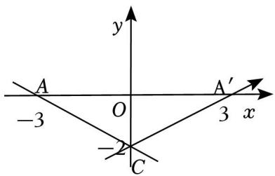

text_image

y
A
-3 O A′
3 x
-2 C

由一次函数过（0，﹣2），设一次函数解析式为 $y = k x - 2 ( k { \neq } 0 )$ ），

令 $y = 0$ ，解得： $x { = } \frac { 2 } { \frac { 1 } { 5 } }$

又一次函数与两坐标轴围成的三角形面积为 4，

$\therefore \frac { 1 } { 2 } \times 1 - 2 1 \times 1 \frac { 2 } { 5 } = 3$ ，即 $| k | = \frac { 2 } { 3 }$ ，

解得： $k { = } \pm \frac { 2 } { 3 }$ ，

则一次函数解析式为 $y = \frac { 2 } { 3 } x - 2$ 或 $y = - \frac { 2 } { 3 } x - 2$

故选：D．

6．象棋起源于中国，中国象棋文化历史悠久．如图所示是某次对弈的残图，如果建立平面直角坐标系，使棋子“帅”位于点（﹣2，﹣1）的位置，则在同一坐标系下，经过棋子“帅”和“马”所在的点的一次函数解析式为（ ）

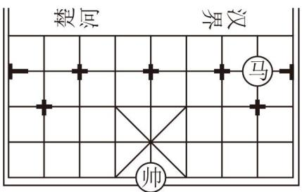

text_image

楚河
界汉
马
帅

A． $y = x + 1$

B． $y = x - 1$

C． $y = 2 x + 1$

D． $y = 2 x - 1$

【分析】根据棋子“帅”位于点（﹣2，﹣1）的位置，求出“马”所在的点的坐标，由此解答即可

【解答】解：∵“帅”位于点（﹣2，﹣1）可得出“马”（1，2），

设经过棋子“帅”和“马”所在的点的一次函数解析式为 $y = k x + b$

$$
\therefore \left\{ \begin{array}{l} - 1 = - 2 k + b \\ 2 = k + b \end{array} , \right.
$$

解得 $\left\{ \begin{array} { l } { \mathbf { k } = 1 } \\ { \mathbf { b } = 1 } \end{array} \right. ,$

$$
\therefore y = x + 1,
$$

故选：A．

7．对于一次函数 $y = - 2 x + 4$ ，①函数的图象不经过第三象限，②函数的图象与 x 轴的交点坐标是（2，0），

③函数的图象向下平移 4 个单位长度得 $y = - ~ 2 x$ 的图象，④若两点 $A ( x _ { 1 } , \ y _ { 1 } ) , \ B ( x _ { 2 } , \ y _ { 2 } )$ ）在该函数图象上，且 $x 1 { < } x 2$ ，则 $y _ { 1 } { < } y _ { 2 }$ ．以上结论，正确的个数为（

A．4 个

B．3 个

C．2 个

D．1 个

【分析】根据一次函数的性质逐项分析判断正误即可

【解答】解：①一次函数 $y = - ~ 2 x { + } 4$ ，函数的图象不经过第三象限，故①正确；

一次函数 $y = - ~ 2 x { + } 4$ ，令 $y = 0$ ，则 $x { = } 2$ ，函数的图象与 x 轴的交点坐标是（2，0），故②正确；  
③一次函数 $y = - ~ 2 x { + } 4$ 的图象向下平移 4 个单位长度得 $y = - ~ 2 x$ 的图象，故③正确；  
④一次函数 $y = - ~ 2 x { + } 4$ 中 $k = - \ 2 < 0$ ，y 随 x 的增大而减小， $x _ { 1 } < x _ { 2 }$ ，则 $y _ { 1 } > y _ { 2 }$ ，故④错误

正确的个数有三个，

故选：B．

8．某学校要建一块矩形菜地供学生参加劳动实践，菜地的一边靠墙，另外三边用木栏围成，木栏总长为40m．如图所示，设矩形一边长为 x m，另一边长为 y m，当 x 在一定范围内变化时，y 随 x 的变化而变化，则 y与 x满足的函数关系是（ ）

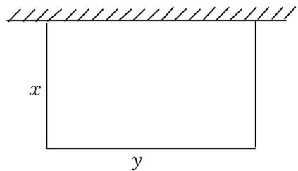

text_image

x
y

A． $y = 2 0 x$

B． $y = 4 0 - 2 x$

C． $\mathbf { y } = \frac { 4 0 } { \mathbf { x } }$

D．y＝x（40﹣2x）

【分析】由木栏的总长，可得出 2x+y＝40，变形后，即可得出结论

【解答】解：∵木栏总长为 $4 0 m$ ，

$$
\therefore 2 x + y = 4 0,
$$

$$
\therefore y = 4 0 - 2 x.
$$

故选：B．

9．一条公路旁依次有 A，B，C 三个村庄，甲、乙两人骑自行车分别从 A 村、B 村同时出发前往 C 村，甲、乙之间的距离 $s ( k m )$ 与骑行时间 t（h）之间的函数关系如图所示，下列结论错误的是（ ）

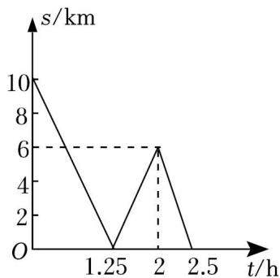

line chart

| t/h | s/km |
|---|---|
| 0 | 10 |
| 1.25 | 0 |
| 2 | 6 |
| 2.5 | 0 |

A．A，B 两村相距 10km

B．出发 1.25h 后两人相遇  
C．甲每小时比乙多骑行 8km  
D．相遇后两人又骑行了 14min，此时两人相距 2km

【分析】根据图象与纵轴的交点可得出 A、B 两地的距离，而 s＝0 时，即为甲、乙相遇的时候，同理根据图象的拐点情况解答即可

【解答】解： $8 \times 1 . 2 5 { = } 1 0 k m$ ，A、B 两村相距 10km，故 A 正确，不符合题意；

当 1.25h时，甲、乙相距为 0km，故在此时相遇，故 B 正确，不符合题意；

当 $0 \leqslant t \leqslant 1 . 2 5$ 时，得一次函数的解析式为 $s = - \ 8 t + 1 0$

故甲的速度比乙的速度快 8km/h，故 C 正确，不符合题意；

相遇后，15min 后两人相距 $8 \times \frac { 1 5 } { 6 0 } { = } 2 ( k m )$ ，

当 t＝2 时，乙距 C 地 6km，所以乙的速度是：

$$
\frac {6}{2 . 5 - 2} = 1 2 (k m / h),
$$

相遇 55min 后，乙距 C 地的路程是：

$$
6 - 1 2 \times (\frac {5 5}{6 0} - 0. 7 5) = 4 (k m),
$$

故 D 错误，符合题意

故选：D

10．如图，杆秤是利用杠杆原理来称物品质量的简易衡器，其秤砣到秤纽的水平距离 y cm 与所挂物重 $x k g$ 之间满足一次函数关系．若不挂重物时，秤砣到秤纽的水平距离为 2.5cm，挂 1kg物体时，秤砣到秤纽的水平距离为 8cm．则当秤砣到秤纽的水平距离为 35.5cm 时，秤钩所挂物重为（ ）

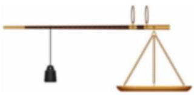

natural_image

Simple line drawing of a balance scale with weights (no text or symbols)

A．4.5kg

C．5.5kg

D． $7 k g$

【分析】利用待定系数法求出 y关于 x 的函数关系式，当 y＝35.5时解方程求出对应 x 的值即可

【解答】解：设 y与 x的函数关系式为 $y = k x + b$ （k、b为常数，且 $k { \neq } 0 )$ ）

将 x＝0， $y = 2 . 5$ 和 x＝1，y＝8 代入 $y = k x + b$ ，

得 $y = 2 . 5$ ， 解得 $\left\{ k = 5 . 5 \atop { \mathrm { b } = 2 . 5 } \right. ,$

$$
\therefore v = 5. 5 x + 2. 5.
$$

当 $5 . 5 x + 2 . 5 = 3 5 . 5$ 时，解得 $x { = } 6$ ，

故选：B

11．已知 y﹣1 与 x+2 成正比例，且当 x＝1 时， $y = - 5$ ，则 y 关于 x的函数图象不经过第 一 象限．【分析】利用正比例函数的定义，再把已知的一组对应值代入求出得到 $y = - 2 x - 3$ ，然后根据一次函数的性质解决问题

【解答】解：设 $y - 1 = k ( x + 2 )$ ），

$$
\because x = 1, y = - 5,
$$

$$
\therefore - 5 - 1 = k \times (1 + 2),
$$

解 $k = - 2$ ，

$$
\therefore y - 1 = - 2 (x + 2),
$$

即 $y = - ~ 2 x - 3$ ，

$\cdot y = - 2 x - 3$ 经过第二、三、四象限，不经过第一象限．

故答案为：

12．一次函数 $y = k x + b ;$ ，当 $\scriptstyle - 3 \leqslant x \leqslant 1$ 时，对应的函数值的取值范围为 $1 \leqslant y \leqslant 9$ ，求 k+b 的值 9 或 1

【分析】当 $k { > } 0$ 时，y 随 x 的增大而增大，则 x＝1 时，y＝9，据此可求出 k+b 的一个值；当 $k { < } 0$ 时，y随 x的增大而减小，则 x＝1 时，y＝1，据此也可求出 k+b 的一个值，从而解答题目

【解答】解：由一次函数的增减性可知，若该一次函数的 y值随 x 的增大而增大，

则有 $x = - 3$ 时，y＝1，x＝1 时， $y = 9$ ；

故有 $- 3 k + b = 1$

解得 $\scriptstyle \left\{ { \begin{array} { l } { \mathbf { k } = 2 } \\ { \mathbf { b } = 7 } \end{array} } \right.$

$$
\therefore k + b = 9.
$$

若该一次函数的 y 值随 x 的增大而减小，则有 x＝﹣3 时，y＝9，x＝1时， $y = 1$

故 $- 3 k + b = 9$

解得 $\left\{ \begin{array} { l l } { \mathbf { k } = - 2 } \\ { \mathbf { b } = 3 } \end{array} \right.$

$$
\therefore k + b = 1,
$$

综上可知， $k { + } b { = } 9$ 或 1

故答案为：9或 1

13．已知 $\Eup A B C$ 的顶点坐标分别为 A（﹣5，0），B（3，0），C（0，3），当过点 C 的直线 l 将 $\triangle A B C$ 分成面积相等的两部分时，直线 l 所表示的函数表达式为 $\scriptstyle y = 3 x + 3$

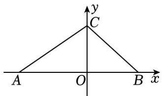

text_image

y
C
A O B x

【分析】根据题意，先求出线段 AB 的中点坐标，再利用待定系数法求出直线 l 的解析式即可

【解答】解：线段 AB 的中点坐标为（﹣1，0），

设直线 l 的解析式为 $y = k x + b$ ，

$$
\left\{ \begin{array}{l} b = 3 \\ - k + b = 0 \end{array} , \right.
$$

解得 $\{ 5 = 3 , \atop { \bf b = 3 } $

∴直线 l 的解析式为： $y = 3 x + 3$

故答案为： $y = 3 x + 3$

14．如图，在平面直角坐标系中，长方形 ABCD 的边 AB 在 x 轴的正半轴上，点 D 和点 B 的坐标分别为（4，3）、（10，0），过点 D 的正比例函数 y＝kx 图象上有一点 P，使得点 D 为 OP 的中点，将 y＝kx 的图象沿y 轴向下平移得到 $y = k x + b$ 的图象，若点 P 落在长方形 ABCD 的内部，则 b的取值范围是 $- 6 < b < -$ 3 ．

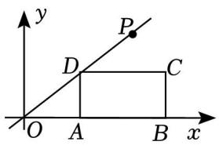

text_image

y
P
D
C
O
A
B
x

【分析】根据 D 点坐标得到直线 OD 解析式，过点 P 作 $P F \bot x$ 轴，交 CD 于点 E，则 E（8，3），F（8，0），将点 EF 坐标代入 $y = \frac { 3 } { 4 } x + b$ 可得 b 的取值范围

【解答】解：∵点 D（4，3）在直线 y＝kx上，

$$
\therefore k = \frac {3}{4},
$$

∴直线 OD 的解析式为 $y = \frac { 3 } { 4 } x$ ，

$\because D$ 是 OP 的中点，且 D（4，3），

∴P（8，6），

过点 P 作 $P F \bot x$ 轴，交 CD 于点 E，

∴E（8，3），F（8，0），

设直线 OP 平移后的解析式为 $y = \frac { 3 } { 4 } x + b$ x+b，

将点 E（8，3）坐标代入 $y = \frac { 3 } { 4 } x + b$ $3 = \frac { 3 } { 4 } \times 8 + b$ ×8+b，

解得 b＝﹣3，

将点 F（8，0）坐标代入 $y = \frac { 3 } { 4 } x + b$ 得，0 $0 = \frac { 3 } { 4 } \times 8 + b$ ×8+b，

解得 $b = - \ 6$ ，

$$
\therefore - 6 <   b <   - 3,
$$

故答案为： $- \ 6 < b < \ - \ 3$ ，

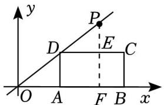

text_image

y
P
D
E
C
O
A
F
B
x

15．甲无人机从地面起飞，乙无人机从距离地面 20m 高的楼顶起飞，两架无人机同时匀速上升 10s．甲、乙两架无人机所在的位置距离地面的高度 y（单位：m）与无人机上升的时间 x（单位：s）之间的关系如图所示.10s 时，两架无人机的高度差为 20 m．

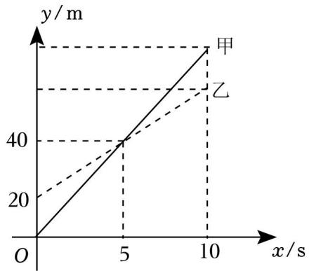

line chart

| x/s | y/m (甲) | y/m (乙) |
| --- | -------- | -------- |
| 0   | 0        | 0        |
| 5   | 40       | 40       |
| 10  | 50       | 50       |

【分析】利用待定系数法分别求出甲、乙两架无人机所在的位置距离地面的高度 y 与无人机上升的时间x 之间的函数关系式，当 x＝10时，分别求出两者的函数值并求差即可

【解答】解：设甲无人机所在的位置距离地面的高度 y 甲与无人机上升的时间 x 之间的函数关系为 $y _ { \mathbb { H } } =$ $k _ { 1 } x$ ，

$\because$ 当 x＝5 时， $y _ { \perp } { = } 4 0$ ，

$\therefore 5 k 1 = 4 0$ ，解得 $k _ { 1 } = 8$

$$
\therefore y _ {\text { 甲 }} = 8 x;
$$

设乙无人机所在的位置距离地面的高度 y 乙与无人机上升的时间 x之间的函数关系为 $y _ { \textrm { Z } } = k _ { 2 } x + b$ ，

$\because$ 当 x＝0 时， $y _ { \textrm { Z } } { = } 2 0$ ；当 x＝5 时， $y _ { \textrm { Z } } { = } 4 0$ ，

$\therefore \left\{ \begin{array} { l l } { \mathbf { b } = 2 0 } \\ { 5 \mathbf { k } _ { 2 } + \mathbf { b } = 4 0 } \end{array} \right.$ ，解得 $\left\{ { \begin{array} { l } { \mathbf { k } _ { 2 } = 4 } \\ { \mathbf { b } = 2 0 } \end{array} } \right.$ ，

$$
\therefore y _ {\text { 乙 }} = 4 x + 2 0;
$$

当 x＝10时， $y _ { \mathrm { \scriptsize ~ { \scriptstyle H } } } = 8 \times 1 0 = 8 0 , y _ { \mathrm { \scriptsize ~ { \scriptscriptstyle Z } } } = 4 \times 1 0 + 2 0 = 6 0$

$$
8 0 - 6 0 = 2 0 (m),
$$

∴10s 时，两架无人机的高度差为 20m，

故答案为：20．

16．如图，在平面直角坐标系中，点 O 为坐标原点，直线 $y = k x + b$ 经过 A（﹣6，0），B（0，3）两点，点 C在直线 AB 上，C 的纵坐标为 4

（1）求 k、b的值及点 C 坐标；

（2）若点 D 为直线 AB 上一动点，且△OBC 的面积是△OAD 面积的一半，试求点 D 的坐标．

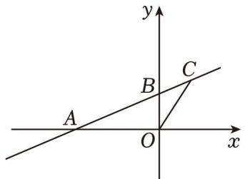

text_image

y
B
C
A
O
x

【分析】（1）利用待定系数法求出一次函数解析式，从而得到k、b 的值，然后计算函数值为 4 所对应的自变量的值得到 C 点坐标；

（2）设 $D \ ( \ t , \ { \frac { 1 } { 2 } } t ^ { + 3 } )$ ），利用三角形面积公式得到 $\frac { 1 } { 2 } \times 6 \times 1 \frac { 1 } { 2 } t + 3 1 = \frac { 1 } { 2 } \times \frac { 1 } { 2 } \times 3 \times 2$ 1x ，然后解方程求出 t，从而得到 D 点坐标

【解答】解：（1）根据题意得 $- 6 k + b = 0$

解得 $k { = } { \frac { 1 } { 2 } } , \ b { = } 3 .$ ，

一次函数解析式为 $y = \frac { 1 } { 2 } x + 3$ ，

当 $y = 4$ 时， $\frac { 1 } { 2 } x + 3 = 4$

解得 x＝2，

∴C 点坐标为（2，4）；

（2）设 $D \ ( \ t , \ { \frac { 1 } { 2 } } t ^ { + 3 } )$ ），

$\because \triangle O B C$ 的面积是 $\triangle O A D$ 面积的一半，

$$
\therefore \frac {1}{2} \times 6 \times \left| \frac {1}{2} t + 3 \right| = \frac {1}{2} \times \frac {1}{2} \times 3 \times 2,
$$

解得 t＝﹣5 或 $t = - 7$ ，

∴D 点坐标为 $( \mathbf { \partial } - 5 , \ { \frac { 1 } { 2 } } )$ 或 $( - 7 , - \frac { 1 } { 2 } )$

17．D 县举办运动会需购买 A，B 两种奖品，若购买 A 种奖品 5件和 B 种奖品 2 件，共需 80 元；若购买 A种奖品 3件和 B 种奖品 3 件，共需 75 元

（1）求 A、B 两种奖品的单价各是多少元？

（2）大会组委会计划购买 A、B 两种奖品共 100 件，购买费用不超过 1150 元，且 A 种奖品的数量不大于 B 种奖品数量的 3 倍，设购买 A 种奖品 m 件，购买费用为 $W { \overline { { \pi } } }$ ，写出 $W \ : \left( \overline { { \mathcal { T } } } \overline { { \subset } } \right)$ 与 m（件）之间的函数关系式．求出自变量 m 的取值范围，并确定最少费用 W的值

【分析】（1）设 A、B 两种奖品的单价分别为 $x , y \cdot { \vec { \pi } }$ ，则 $\left\{ { 5 x + 2 y = 8 0 } \atop { 3 x + 3 y = 7 5 }  \right.$ 即可求解；

（2）设购买 A 种奖品 m 件，则 B 为 $( 1 0 0 \textrm { - } m )$ 件，由题意得： $\left\{ \begin{array} { l l } { 1 0 \mathrm { m } + 1 5 ( 1 0 0 - \mathrm { m } ) = 1 5 0 0 } \\ { \qquad \mathrm { m } \leqslant 3 ( 1 0 0 - \mathrm { m } ) } \end{array} \right.$ ，而 $W { = } 1 0 m { + } 1 5$ $( 1 0 0 \textrm { -- } m ) \ = 1 5 0 0 \textrm { - } 5 m$ ，即可求解．

【解答】解：（1）设 A、B 两种奖品的单价分别为 x、y 元，

则 $\left\{ { 5 x + 2 y = 8 0 } \atop { 3 x + 3 y = 7 5 }  \right. ,$

解得： $\scriptstyle { \left\{ \begin{array} { l } { \mathbf { x } = 1 0 } \\ { \mathbf { y } = 1 5 } \end{array} \right. } ;$ ；

（2）设购买 A 种奖品 m 件，则 B 为（100﹣m）件，

由题意得： $\left\{ \begin{array} { l l } { 1 0 \mathrm { m } + 1 5 \left( 1 0 0 - \mathrm { m } \right) \leqslant 1 5 0 0 } \\ { \qquad \mathrm { m } \leqslant 3 \left( 1 0 0 - \mathrm { m } \right) } \end{array} \right.$

解得： $7 0 { \leqslant } m { \leqslant } 7 5$ ，

$$
W = 1 0 m + 1 5 (1 0 0 - m) = 1 5 0 0 - 5 m,
$$

当 m＝75 时，W 有最小值为：1125，

答：最少费用为 1125

18．在平面直角坐标系中，一次函数 $y = k x + 2 ( k { \neq } 0 )$ ）的图象经过点 A（1，3）

（1）求该函数的表达式；

（2）若点 $B \ ( 2 m , \quad - \ 4 m { + } 1 1 )$ ）在该函数图象上，求点 B 的坐标；

（3）当 $x { < } 3$ 时，对于 x 的每一个值，一次函数 $\mathbf { y } = \frac { 3 } { 4 } \mathbf { x } + \mathbf { n }$ 的值都大于一次函数 y＝kx+2 值，请直接写出 $y = k x + 2$ n 的取值范围

【分析】（1）将点 A（1，3）坐标代入解析式解出 k值即可得到解析式；

（2）将点 $B \ ( 2 m , \quad - \ 4 m { + } 1 1 )$ ）坐标代入一次函数解析式求出 m 值，即可得到点 B 的坐标；

（3）当 x＝3时，求出一次函数值，利用不等式得到 n值的范围即可

【解答】解：（1）∵一次函数 $y = k x + 2 ( k \neq 0 )$ ）的图象经过点 A（1，3），

$$
\therefore k + 2 = 3,
$$

解得 k＝1，

∴一次函数解析式为： $y = x + 2$ ；

（2）∵点 $B \ ( 2 m , \quad - \ 4 m { + } 1 1 )$ ）在一次函数图象上，

$$
\therefore 2 m + 2 = - 4 m + 1 1,
$$

解得 $m { = } \frac { 3 } { 2 }$

∴点 B 的坐标为（3，5）；

（3）当 $x { < } 3$ 时，一次函数 $\mathrm { y } = \frac { 3 } { 4 } \mathrm { x } + \mathrm { n }$ x+n 的值都大于一次函数 $y = x + 2$ ，

∴两个一次函数的交点坐标为：（3，5），

即 $\frac { 3 } { 4 } \times 3 + n > 5$

$$
\therefore n > \frac {1 1}{4}.
$$

19．如图，直线 $l _ { 1 } \colon y { = } x { + } 1$ 与 x 轴和 y 轴分别交于 A、B 两点，点 C 在直线 l1上，坐标为 $( m , ~ 3 )$ ），直线 l2过点 C 且与 y 轴交于点 D（D 在 B 点上方），与 x 轴交于点 E． $\triangle B C D$ 的面积是 5

（1）求 m 的值；  
（2）求直线 l 的表达式；  
（3）求 $\triangle A C E$ 的面积

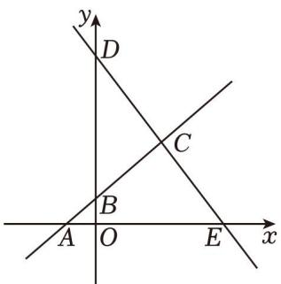

text_image

y
D
C
B
A O E x

【分析】（1）将点 C 代入 $y = x + 1$ 中，即可求 m 的值；

（2）根据 $\frac { 1 } { 2 } \times \ ( y _ { D } - 1 ) \times 2 = 5$ ，求出 D 点坐标，再由用待定系数法求函数的解析式即可；  
（3）求出 A、E 点坐标，再求三角形面积即可

【解答】解： ${ ( 1 ) } \because C$ 点在 $y = x + 1$ 上，

$$
\therefore m + 1 = 3,
$$

解得 $m = 2$ ；

（2）当 x＝0时，y＝1，

$$
\therefore B (0, 1),
$$

$\because \triangle B C D$ 的面积是 5，

$$
\therefore \frac {1}{2} \times (y _ {D} - 1) \times 2 = 5,
$$

解得 $y _ { D } { = } 6 $ ，

$$
\therefore D (0, 6),
$$

设直线 l2的表达式为 $y = k x + b$ ，

$$
\therefore \left\{ \begin{array}{l} b = 6 \\ 2 k + b = 3 \end{array} , \right.
$$

解得 $\{ x = - \frac { 3 } { 2 } ,$

$\therefore$ 直线 l2的表达式为 $y = - { \frac { 3 } { 2 } } x + 6 ;$

（3）当 y＝0时， $x { + } 1 { = } 0$ ，

解得 x＝﹣1，

$$
\therefore A (- 1, 0),
$$

当 y＝0 时， $\displaystyle - \frac { 3 } { 2 } x + 6 = 0 .$

解得 x＝4，

$$
\therefore E (4, 0),
$$

$$
\therefore A E = 5,
$$

$\therefore \triangle A C E$ 的面积 $= { \frac { 1 } { 2 } } \times 5 \times 3 = { \frac { 1 5 } { 2 } }$

20．某工厂同时生产甲、乙两种零件，已知每生产一个甲种零件可获得利润 260 元，每生产一个乙种零件可获得利润 150 元，工作 2天后为了提高生产效率，现引进新的生产技术，对生产乙种零件的生产工人进行了新技术的培训同时停产一天，新技术培训后生产效率是之前的 2 倍．甲、乙生产线各自生产的零件个数 y（件）与生产时间 x（天）的函数关系如图所示

（1）求生产甲种零件的个数 y（件）与工作时间 x（天）的函数关系式；  
（2）求新技术培训后生产乙种零件的个数 y（件）与工作时间 x（天）的函数关系式；  
（3）该工厂前 7 天的总利润是多少？

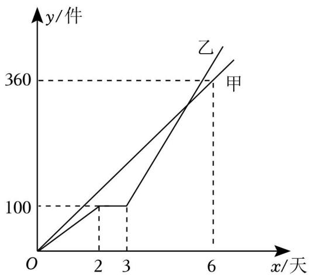

line chart

| x/天 | 甲 y/件 | 乙 y/件 |
| ---- | ------- | ------- |
| 0    | 0       | 0       |
| 2    | 100     | 100     |
| 3    | 100     | 150     |
| 6    | 360     | 360     |

【分析】（1）利用待定系数法解答即可；

（2）先求出乙当 y＝360时对应 x 的值，再利用待定系数法解答即可；  
（3）该工厂前 7 天的总利润＝前 7 天生产甲种零件的利润+前 7天生产乙种零件的利润，据此作答即可

【解答】解：（1）设生产甲种零件的个数 y 与工作时间 x 的函数关系式为 ${ { y } = { k _ { 1 } } x \ } \left( { { k _ { 1 } } } \right.$ 为常数，且 $k _ { 1 } \neq 0 )$ ）将 $x = 6 , y = 3 6 0$ 代入 $y { = } k _ { 1 } x$ ，

得 $6 k 1 = 3 6 0$ ，解得 $k _ { 1 } = 6 0$ ，

$$
\therefore y = 6 0 x.
$$

（2）新技术培训前的生产效率是 $\frac { 1 0 0 } { 2 } = 5 0$ （件/天），新技术培训前的生产效率是 $5 0 \times 2 = 1 0 0$ （件/天），

$$
\frac {3 6 0 - 1 0 0}{1 0 0} = 2. 6 (\text {天}), 3 + 2. 6 = 5. 6 (\text {天}).
$$

设新技术培训后生产乙种零件的个数 y 与工作时间 x 的函数关系式为 $y = k _ { 2 } x + b \left( k _ { 2 } , k \right)$ 为常数，且 $k _ { 2 } \neq 0 )$ ）将 $x = 3 , y = 1 0 0$ 和 $x = 5 . 6 , y = 3 6 0$ 代入 $y = k _ { 2 } x + b$ ，

$\begin{array} { r } { \hat { \mathcal { A } } _ { \sharp } ^ { \sharp } \left\{ \begin{array} { l l } { 3 \mathbf { k } _ { 2 } + \mathbf { b } = 1 0 0 } \\ { 5 . 6 \mathbf { k } _ { 2 } + \mathbf { b } = 3 6 0 } \end{array} \right. , \ : \ : \sharp \sharp ^ { \prime } \mathbb { H } ^ { \sharp } \left\{ \begin{array} { l l } { \mathbf { k } _ { 2 } = 1 0 0 } \\ { \mathbf { b } = - 2 0 0 } \end{array} \right. , \ : } \end{array}$

$$
\therefore y = 1 0 0 x - 2 0 0 (x \geqslant 3).
$$

（3）前 7 天生产甲种零件的利润为 $6 0 \times 7 \times 2 6 0 { = } 1 0 9 2 0 0 ( \overrightarrow { \mathcal { D } } )$ ），生产乙种零件的利润为 $( 1 0 0 \times 7 - 2 0 0 )$ ）$\times 1 5 0 { = } 7 5 0 0 0 ~ ( \overline { { \mathcal { \pi } } } )$ ，

$$
1 0 9 2 0 0 + 7 5 0 0 0 = 1 8 4 2 0 0 (\text {元}),
$$

∴该工厂前 7天的总利润是 184200 元