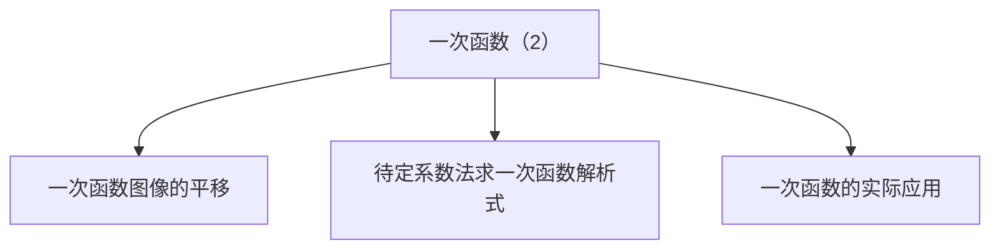

## 第 05 讲 一次函数（2）

## 01

## 学习目标

<table><tr><td>课程标准</td><td>学习目标</td></tr><tr><td>1一次函数图像的平移2一次函数解析式3一次函数的应用</td><td>1. 掌握一次函数图像的平移规律,并能够熟练的运用。2. 掌握待定系数法求函数解析式,并熟练应用其求一次函数解析式。3. 掌握一次函数的基本性质,并能够熟练的运用一次函数的基本性质解决相关的实际问题。</td></tr></table>

## 02

## 思维导图

flowchart

##

##

## 知识点01 一次函数图像的平移

1. 一次函数的平移变换：

①一次函数的左右平移：

函数在进行左右平移时，平移变换规律为在 上加减平移单位。左加右减。

I：若函数 $y = k x + b$ 向左平移 $a$ 个单位长度，则平移后得到的函数解析式为 。

II：若函数 $y = k x + b$ 向右平移a个单位长度，则平移后得到的函数解析式为 。

②一次函数的上下平移：

函数在进行上下平移时，平移变换规律为在 上加减平移单位。上加下减。

I：若函数 $y = k x + b$ 向上平移a个单位长度，则平移后得到的函数解析式为 。

II：若函数 $y = k x + b$ 向下平移a个单位长度，则平移后得到的函数解析式为 。

## 【即学即练1】

1．把直线 $l \colon y = - 2 x$ 沿 x轴正方向向右平移 2 个单位得到直线 l′，则直线 l'的解析式为（ ）

A． $y = - 2 x + 4$

B． $y = - ~ 2 x + 2$

C． $y = 2 x + 4$

D． $y = - 2 x - 2$

## 【即学即练2】

2．将直线 $y = 2 x - 1$ 向上平移 3 个单位长度，得到的直线的解析式是（ ）

A． $y = 2 x + 5$

B． $y = 2 x - 7$

C． $y = 2 x + 2$

D． $y = 2 x - 4$

## 拓展：一次函数的对称变换：

## 一、函数关于x轴对称：

若函数关于x轴对称，函数的自变量 ，函数值变为原来的

即 $y = k x + b$ 关于x轴对称的函数解析式为 。

## 二、函数关于 y 轴对称：

若函数关于 y 轴对称，函数的函数值 ，自变量变为原来的

即 $y = k x + b$ 关于 y 轴对称的函数解析式为 。

## 拓展：一次函数的翻折变换：

$\therefore y = k x + b \Rightarrow y = \left| k x + b \right|$

在函数解析式上添加绝对值符号相当于把函数图像在 x 轴下方的部分沿 x 轴向上翻折。

$\begin{array} { r } { \stackrel {  } {  } , y = k x + b \Rightarrow y = k \vert x \vert + b } \end{array}$

在函数解析式的自变量上加绝对值符号相当于把函数解析式 y 轴左边的图像去掉，再把右边的部分沿 y轴向左翻折，翻折前后的两部分为新的函数图像。

## 【即学即练1】

3．将 $y = \frac { 1 } { 2 }$ ）

A． $y = \frac { 1 } { 2 } x - 2$ x-2

B． $\mathbf { y } = \frac { 1 } { 2 } \mathbf { x } + 2$ =x+2 1

$y = \frac { 1 } { 2 } x + 2$

D． $y = \frac { 1 } { 2 } x - 2$

## 【即学即练2】

4．学习“一次函数”时，我们从“数”和“形”两方面研究了一次函数的性质，并积累了一些经验和方法，尝试用你积累的经验和方法解决下面问题

<table><tr><td>x</td><td>...</td><td>-3</td><td>-2</td><td>-1</td><td>0</td><td>1</td><td>2</td><td>3</td><td>...</td></tr><tr><td>y</td><td>...</td><td>____</td><td>____</td><td>____</td><td>____</td><td>____</td><td>____</td><td>____</td><td>...</td></tr></table>

（1）在平面直角坐标系中，画函数 $y = | x | { + } 1$ 的图象：

①列表：完成表格；  
②画出 $y = | x | { + } 1$ 的图象；

text_image

y
-5
-4
-3
-2
-1
0
1
2
3
4
5
x
-5
-4
-3
-2
-1
O
-2
-3
-4
-5

（2）结合所画函数图象，写出 $y = | x | + 1$ 两条不同的性质；  
（3）直接写出函数 $y = \left| x \right|$ 的图象是由函数 $y = | x | { + } 1$ 的图象怎样得到的？

## 知识点02 待定系数法求一次函数解析式

1. 待定系数法求一次函数解析式：

具体步骤：

①设：设一次函数解析式 $y = k x + b ( k \neq 0 )$ 。  
②找点：找一次函数图像上的点。  
③带入：将找到的点的坐标带入函数解析式中得到方程（或方程组）。  
④解：解③中得到的方程（或方程组），求出 $k , \ b$ 的值。  
⑤反带入：将求出的k，b的值带入函数解析式中得到函数解析式。

## 【即学即练1】

5．已知一次函数的图象经过 A（﹣1，4），B（1，﹣2）两点

（1）求该一次函数的解析式；  
（2）直接写出函数图象与两坐标轴的交点坐标

## 知识点03 一次函数的应用

## 1. 分段函数：

在一次函数的实际应用中，最常见为分段函数。分段函数是在不同区间有不同对应方式的函数，要特别注意自变量取值范围的划分，既要科学合理，又要符合实际。

关键点：①分段函数各段的函数解析式。  
②各个拐点的实际意义。  
③函数交点的实际意义。

## 2. 一次函数的综合：

（1）一次函数与几何图形的面积问题

首先要根据题意画出草图，结合图形分析其中的几何图形，再求出面积

（2）一次函数的优化问题

通常一次函数的最值问题首先由不等式找到x的取值范围，进而利用一次函数的增减性在前面范围内的前提下求出最值。

（3）用函数图象解决实际问题

从已知函数图象中获取信息，求出函数值、函数表达式，并解答相应的问题。

解决一次函数的实际应用题必须弄清楚自变量的取值范围。

## 【即学即练1】

6．2023年 7 月 28 日至 2023 年 8 月 8日，第 31 届世界大学生夏季运动会在成都成功举办，美丽的东安湖体育公园给国内外朋友留下了深刻的印象；在公园建设过程中，准备在一块草地上种植甲、乙两种花卉，经市场调查，甲种花卉的种植单价 y（元）与种植面积 x $( m ^ { 2 } )$ ） 之间的函数关系如图所示，乙种花卉的种植费用为每平方米 100元

（1）直接写出当 $0 { \leqslant } x { \leqslant } 4 0 0$ 和 $x { > } 4 0 0$ 时，y 与 x 的函数关系式；  
（2）广场上甲、乙两种花卉的种植面积共 $1 0 0 0 m ^ { 2 }$ 最终花费为 121000元，那么甲、乙两种花卉的种植面积分别为多少？ y/元→

line chart

| x/m² | y/元 |
|---|---|
| 0 | 200 |
| 200 | 180 |
| 400 | 160 |
| 500 | 160 |

text_image

题型精讲

## 题型01 求平移前后的函数解析式

【典例1】将直线 $y = 3 x$ 向上平移 2 个单位长度，所得直线的关系式为（ ）

A． $y = 3 x + 2$

B． $y = 3 ( x + 2 )$ ）

C． $y = 3 ( x - 2 )$

D． $y = 3 x - 2$

【变式1】将函数 $y { = } 2 x { + } 3$ 的图象向上平移 2 个单位长度，所得直线对应的函数表达式为（ ）

A． $y = 2 x + 1$

B． $y = 2 x + 2$

C． $y = 2 x + 4$

D． $y = 2 x + 5$

【变式 2】将一次函数 $y = - \ 3 x \cdot 1$ 的图象沿 y轴向下平移 3个单位长度后，所得图象的函数表达式为（

A． $y = - 3 ( x - 3 )$

B． $y = - \ 3 x + 2$

C $y = - 3 ( x + 3 )$

D． $y = - 3 x - 4$

【变式 3】把直线沿 y 轴向上平移 2 个单位长度得到直线 $y = - ~ 2 x - 1$ ，则平移前直线的函数解析式为（

A． $y = - ~ 2 x + 1$

B． $y = - ~ 4 x - 3$

C． $y = - 2 x - 3$

D． $y = - ~ 2 x - 1$

【变式 4】在平面直角坐标系中，将一条直线向下平移 3 个单位长度，再向右平移 2 个单位长度，得到直线 $y = 2 x - 6$ ，则平移前的直线解析式为：

## 题型 02 利用函数的平移求值

【典例 1】在平面直角坐标系中，若要使直线 $y 1 = - 4 x + 4$ 平移后得到直线 $y _ { 2 } = - ~ 4 x - 1$ ，则应将直线 y（1 ）

A．向上平移 5个单位

B．向下平移 5个单位

C．向左平移 5 个单位

D．向右平移 5个单位

【变式 1】将一次函数 $y = - ~ 5 x + 3$ 的图象向下平移 m 个单位长度，使其成为正比例函数，则 m 的值为（ ）

A．﹣3

B．﹣5

C．3

D．5

【变式 2】将一次函数 $y = x - 2$ 的图象沿 y 轴向上平移 m 个单位长度后经过点（1，4），则 m 的值为（ ）

A．6

B．5

C．﹣5

D．﹣6

【变式 3】已知直线 $l _ { 1 }$ 与 x 轴交于点 A（﹣2，0），且直线 $l _ { 1 }$ 与两坐标轴围成的三角形的面积为 4，将直线$l _ { 1 }$ 向下平移 $m \ ( m { > } 0 )$ ）个单位得到直线 $l _ { 2 } ,$ ，直线 $l _ { 2 }$ 交 x轴于点 B，若点 A 与点 B 关于 y 轴对称，则 m 的值为（ ）

A．8

B．7

C．6

D．5

【变式 4】在平面直角坐标系中，将一次函数 $y = 3 x + m \mathrm { ~ ( ~ } m$ 为常数）的图象向上平移 2 个单位长度后恰好经过原点，若点 $\textit { A } \left(  { \mathrm { ~ - ~ } } 1 ,  { \mathrm { ~ } } a \right)$ 在一次函数 $y = 3 x + m$ 的图象上，则 a 的值为（ ）

A．1

B．﹣2

C．﹣4

D．﹣5

【变式 5】如图，直线 $y = 2 x + 4$ 与 x 轴、y 轴分别交于点 A、B 两点，以 OB 为斜边在 y轴右侧作 $\ R t { \triangle } O B C$ 且 $\angle O B C = 3 0 ^ { \circ }$ °，将直线 $y = 2 x + 4$ 向下平移 m 个单位，使平移后的直线经过点 C，则 m 的值是（ ）

text_image

y
B
A
O
x
C

A． $3 + 2 \sqrt { 3 }$

B．8

C． $2 + 3 \sqrt { 3 }$

D．4

【变式 6】图象法是函数的表示方法之一，下面我们就一类特殊的函数图象展开探究

<table><tr><td>x</td><td>...</td><td>-3</td><td>-2</td><td>-1</td><td>0</td><td>1</td><td>2</td><td>3</td><td>...</td></tr><tr><td> $y_1=2|x|$ </td><td>...</td><td>6</td><td>4</td><td>2</td><td>0</td><td>2</td><td>4</td><td>6</td><td>...</td></tr></table>

画函数 $y _ { 1 } = 2 | x |$ 的图象，经历列表、描点、连线过程得到函数图象如图所示：

text_image

y
y₁=2|x|
O
A
x
y₂=2|x-2|

探究发现：函数 $y _ { 2 } = 2 | x - 2 |$ 的图象是由 $y _ { 1 } = 2 | x |$ 向右平移 2 个单位得到；函数 $y _ { 3 } = 2 | x - 2 | + 3$ 的图象是由$\scriptstyle y _ { 2 } = 2 | x - 2 |$ 向上平移 3个单位得到

（1）函数 $y _ { 3 } = 2 | x - 2 | + 3$ 的最小值为  
（2）函数 $y _ { 4 } = 2 | x - m | + 3$ 在 $\scriptstyle - 2 \leqslant x \leqslant 1$ 中有最小值 4，则 m 的值是

## 题型 03 函数的对称

【典例 1】若一次函数 $y = k x + b ( k \neq 0 ) \ 5 y = - x + 2$ 的图象关于 y 轴对称，则 k＝（ ）

A．1

B．2

C．3

D．4

【变式 1】已知直线 $y = - { \frac { 1 } { 2 } } x + 1$ 与直线 l 关于 x 轴对称，则直线 l 与 y 轴的交点坐标是（ ）

A．（0，﹣1）

B．（0，1）

C．（2，0）

D．（﹣2，0）

【变式 2】已知直线 $l _ { 1 }$ 的表达式为 $y = - 2 x + b$ ，若直线 $l _ { 1 }$ 与直线 $l _ { 2 }$ 关于 y轴对称，且 l2经过点（1，6），则b的值为（ ）

A．8

B．4

C．﹣8

D．﹣4

【变式 3】在平面直角坐标系中，直线 $y = - 3 x + 2$ 与 $y = k x + b$ 关于 x 轴对称，那么对于一次函数 $y = k x + b$ ，当 x 每增加 1 时，y增加（ ）

A．12

B．6

C．3

D．1

## 题型04 求一次函数解析式

【典例 1】已知 y 是关于 x 的一次函数，且点 A（0，4），B（﹣2，0）在此函数图象上

（1）求这个一次函数的表达式；  
（2）当 $y \geqslant - 1$ 时，求 x 的取值范围

【变式 1】已知 y﹣2和 x成正比例，且当 $x { = } 1$ 时，当 $y = 1$

（1）求 y 与 x 之间的函数关系式；  
（2）若点 $P ~ ( 3 , ~ m )$ 在这个函数图象上，求 m 的值

【变式 2】如图，直线 l 经过点 A（1，6）和点 B（﹣3，﹣2）

（1）求直线 l 的解析式，直线与坐标轴的交点坐标；  
（2）求 $\triangle A O B$ 的面积

text_image

y
A
O
x
B

【变式 3】一次函数 $y = k x + b ( k \neq 0$ ，b为常数）的部分对应值如下表：

<table><tr><td>x</td><td>...</td><td>0</td><td>1</td><td>2</td><td>...</td></tr><tr><td>y</td><td>...</td><td>1</td><td>2a</td><td>2a+3</td><td>...</td></tr></table>

则该一次函数的表达式为（

A． $y = x + 1$

B． $y = 2 x + 1$

C $y = 3 x + 1$

D． $y = 4 x + 1$

【变式 4】在平面直角坐标系中，已知直线 l： $y = k x + b$ 过点 A（2，2），且与坐标轴交于点 B，则当△OAB的面积为 2，且直线 l 与 y 轴不平行时，直线 l 的表达式为

text_image

l
A
O
x
y

## 题型05 一次函数的应用——图像分析

【典例 1】天气转暖，正是露营好时节．周六，小联同学一家从家出发，开车匀速前往离家 30 千米的露营基地．行驶 0.5 小时后，到达露营基地．在基地玩耍一段时间后，按照原路返程回家．由于车流增加，平均行驶速度比去基地的平均速度少 $\frac { 1 } { 6 }$ 在整个运动过程中，小联同学距家的距离 y（千米）与所用时6

间 x（小时）之间的函数关系如图所示，下列说法不正确的是（ ）

A．去基地的平均速度是每小时 60千米

B．露营玩耍的时长为 4 小时

C．回家的平均速度是每小时 50 千米

D．与家相距 10千米时，x 的值为 4.74

text_image

y(km)
30
O 0.5 4.5 x(h)

【变式 1】小李家，小明家，学校依次在一条直线上．某天，小李和小明相约回家取球拍后回学校打球．他们同时从学校出发匀速返回家中，两人同时到家，小李到家取完球拍后立即以另一速度返回学校，小明取完球拍在家休息了 4min 后按原速返回，且同时到达学校（两人找球拍时间忽略不计）．小李和小明与

学校的距离 y（m）与两人出发时间 x（min）的函数关系如图所示．下列描述中，错误的是（

A．小李家距离学校 1200m

B．小明速度为 62.5m/min

C．小李返回学校的速度为 $\frac { 6 0 0 } { 7 } \boldsymbol { m } / m i n$

D．两人出发 16min 时，小李与小明相距 $\frac { 3 2 0 } { 7 } \pi$

line chart

| x (min) | y (m) |
|---|---|
| 0 | 0 |
| 10 | 800 |
| 24 | 0 |
| 1200 | 1200 |

【变式 2】甲、乙两人沿同一条路从 A 地出发，去往 100千米外的 B 地，甲、乙两人离 A 地的距离（千米）

与时间 t（小时）之间的关系如图所示，以下说法正确的是（ ）

A．甲出发 2 小时后两人第一次相遇

B．乙的速度是 30km/h

C．甲乙同时到达 B 地

D．甲的速度是 60km/h

line chart

| Point | r(h) | s(km) |
|-------|------|-------|
| 甲     | 3    | 100   |
| 乙     | 2    | 60    |

【变式 3】小明早晨 7：20从家里出发步行去学校（学校与家的距离是 1000 米），4 分钟后爸爸发现小明数学书没带，骑电瓶车去追赶，7：26追上小明并将数学书交给他（交接时间忽略不计），交接完成后爸爸放慢速度原路返回，7：30小明到达学校，同时爸爸也正好到家．如图，线段 OA 与折线 B﹣C﹣D 分别表示小明和爸爸离开家的距离 s（米）关于时间 t（分钟）的函数图象，下列说法错误的是（ ）

line chart

| Point | t | s |
|---|---|---|
| A | 10 | 1000 |
| B | 4 | 0 |
| C | 6 | 600 |
| D | 10 | 0 |

A．小明步行的速度为每分钟 100米

B．爸爸出发时，小明距离学校还有 600米

C．爸爸回家时的速度是追赶小明时速度的一半

D．7：25 和 7：27 时，父子俩均相距 200 米

【变式 4】甲、乙两人分别从 A、B 两地同时出发，相向而行，匀速前往 B 地、A 地，两人相遇时停留了 4min，又各自按原来速度前往目的地，甲、乙两人之间的距离 y（m）与甲所用时间 x（min）之间的函数关系如图所示，给出下列结论：①A、B 之间的距离为 1200m；②24min 时，甲、乙两人中有一人到达目的地；③b＝800；④a＝32，其中正确的结论个数为（ ）

line chart

| x (min) | y (m) |
|---|---|
| 0 | 1200 |
| 12 | 0 |
| 24 | b |
| a | 1200 |

A．1 个

B．2 个

C．3 个

D．4 个

【变式 5】如图，甲乙两人骑车都从 A 地出发前往 B 地，已知甲先出发 5 分钟后，乙才出发，乙在 A，B之间的 C 地追赶上甲，当乙追赶上甲后，乙立即原路返回（掉头时间忽略不计），甲继续往 B 地前行，乙返回 A 地后停止骑行，甲到达 B 地后停止骑行．在整个骑行过程中，甲和乙都保持各自速度匀速骑行，甲、乙两人相距的路程 y（米）与甲出发的时间 x（分钟）之间的关系如图所示．下列结论：

①A，B 两地相距 6300米  
②甲的速度为 150 米/分；乙的速度为 227.5米/分  
③乙用 15 分钟追上甲．  
④图中 P 点的坐标为（25，3750）

其中说法正确的有（ ）

line chart

| x/min | y/m |
|---|---|
| 0 | 0 |
| 5 | 750 |
| 15 | 0 |
| 42 | >750 |

A．1 个

B．2 个

C．3 个

D．4 个

## 题型05 一次函数的应用——方案选择（优化）

【典例 1】某中学计划组织八年级全体师生到红色基地开展研学活动，需要租用甲、乙两种客车共 6 辆，已知甲、乙两种客车的租金分别为 450元/辆和 300元/辆，设租用乙种客车 x 辆，租车费为 y 元

（1）求 y 与 x 的函数表达式（写出自变量 x 的取值范围）；  
（2）若租用乙种客车的数量少于甲种客车的数量，租用乙种客车多少辆时，租车费有最少？最少费用是多少？

【变式 1】5G 时代的到来，给人类生活带来很多的改变．某营业厅现有 A、B 两种型号的 5G 手机，进价和售价如表所示：

<table><tr><td></td><td>进价(元/部)</td><td>售价(元/部)</td></tr><tr><td>A</td><td>3000</td><td>3400</td></tr><tr><td>B</td><td>3500</td><td>4000</td></tr></table>

（1）若该营业厅卖出 70 台 A 型号手机，30 台 B 型号手机，可获利 43000 元；

（2）若该营业厅再次购进 A、B 两种型号手机共 100 部，且全部卖完，设购进 A 型手机 x 台，总获利为W 元．

①求出 W 与 x的函数表达式；

②若该营业厅用于购买这两种型号的手机的资金不超过 330000元，求最大利润 W是多少？

【变式 2】为响应政府号召，某地水果种植户借助电商平台，在线下批发的基础上同步在电商平台线上零售水果．已知线上零售 200kg、线下批发 400kg 水果共获得 18000 元；线上零售 50kg 和线下批发 80kg水果的销售额相同

（1）求线上零售和线下批发水果的单价分别为每千克多少元？

（2）该种植户某月线上零售和线下批发共销售水果 4000kg，设线上零售 m kg，获得的总销售额为 w 元：

①请写出 w 与 m 的函数关系式；

②当线上零售和线下批发的数量相等时，求获得的总销售额为多少？

【变式 3】2023 年 12 月 18 日甘肃积石山县发生 6.2 级地震，造成严重的人员伤亡和财产损失．为支援灾区的灾后重建，甲、乙两县分别筹集了水泥 200吨和 300吨支援灾区，现需要调往灾区 A 镇 100吨，调往灾区 B 镇 400 吨．已知从甲县调运一吨水泥到 A 镇和 B 镇的运费分别为 40 元和 80元；从乙县调运一吨水泥到 A 镇和 B 镇的运费分别为 30元和 50元

（1）设从甲县调往 A 镇水泥 x 吨，求总运费 y 关于 x的函数关系式；  
（2）求出总运费最低的调运方案，最低运费是多少？

【变式 4】随着“低碳生活，绿色出行”理念的普及，新能源汽车正逐渐成为人们喜爱的交通tools-2．某汽车销售公司计划购进一批新能源汽车尝试进行销售，据了解 2 辆 A 型汽车、3 辆 B 型汽车的进价共计 110万元；3 辆 A 型汽车、2 辆 B 型汽车的进价共计 115万元

（1）求 A、B 两种型号的汽车每辆进价分别为多少万元？  
（2）若该公司计划用 400万元购进以上两种型号的新能源汽车（两种型号的汽车均要购买，且 400万元全部用完），问该公司有哪几种购买方案，请通过计算列举出来；  
（3）若该汽车销售公司销售 1 辆 A 型汽车可获利 0.8 万元，销售 1辆 B 型汽车可获利 0.5万元，在（2）中的购买方案中，假如这些新能源汽车全部售出，哪种方案获利最大？最大利润是多少万元？

# 强化训练

1．将一次函数 y＝3x 的图象向右平移 1 个单位长度，平移后的图象经过坐标系的（ ）

A．第一、三象限

B．第二、四象限

C．第一、二、四象限

D．第一、三、四象限

2．已知 y 与 x﹣2 成正比例，且当 x＝3 时 y＝4，则当 x＝5 时，y＝（ ）

A．﹣12

B．12

C．16

D．﹣16

3．一次函数 y＝kx﹣5 的图象经过点（k，﹣1），且 y随 x的增大而减小，则这个函数的表达式是（ ）

A． $y = - \frac { 5 } { 2 } x - 5$

B．y $y = \frac { 5 } { 2 } x - 5$

C． $y = - 2 x - 5$

D． $y = 2 x - 5$

4．已知一次函数 $y = a x + b$ ，当 $\scriptstyle - 4 \leqslant x \leqslant 1$ 时，对应 y 的取值范围是 $1 \leqslant y \leqslant 1 6$ ，则 a+b 的值是（ ）

A．1

B．16

C．1 或 16

D．无法确定

5．已知一条直线经过点（0，﹣2）且与两坐标轴围成的三角形面积为 3，则这条直线的表达式为（ ）

A $y = \frac { 2 } { 3 } x + 2$ 或 y   $y = - \frac { 2 } { 3 } x + 2$

B． $y = \frac { 3 } { 4 } x - 2$ 或 y  $y = - { \frac { 3 } { 4 } } x - 2$

C． $y = - 3 x - 2$ 或 $y = - 2 x - 2$

D． $y = \frac { 2 } { 3 } x - 2$ 或 y   $y = - \frac { 2 } { 3 } x - 2$

6．象棋起源于中国，中国象棋文化历史悠久．如图所示是某次对弈的残图，如果建立平面直角坐标系，使棋子“帅”位于点（﹣2，﹣1）的位置，则在同一坐标系下，经过棋子“帅”和“马”所在的点的一次函数解析式为（

text_image

楚河
汉游
马
帅

第 6题

text_image

x
y

第 8 题

A． $y = x + 1$

B． $y = x - 1$

C． $y = 2 x + 1$

D． $y = 2 x - 1$

7．对于一次函数 $y = - 2 x + 4$ ，①函数的图象不经过第三象限，②函数的图象与 x 轴的交点坐标是（2，0），③函数的图象向下平移 4 个单位长度得 $y = - ~ 2 x$ 的图象，④若两点 $A \ ( x _ { 1 } , \ y _ { 1 } )$ ）， $B \ ( x _ { 2 } , \ y _ { 2 } )$ ）在该函数图象上，且 $x _ { 1 } { < } x _ { 2 }$ ，则 $y _ { 1 } { < } y _ { 2 }$ ．以上结论，正确的个数为（ ）

A．4 个

B．3 个

C．2 个

D．1 个

8．某学校要建一块矩形菜地供学生参加劳动实践，菜地的一边靠墙，另外三边用木栏围成，木栏总长为40m．如图所示，设矩形一边长为 x m，另一边长为 y m，当 x 在一定范围内变化时，y 随 x 的变化而变化，则 y与 x满足的函数关系是（

A． $y = 2 0 x$

B． $y = 4 0 - 2 x$

C． $\mathbf { y } = \frac { 4 0 } { \mathbf { x } }$

D． $y = x \ ( 4 0 - 2 x )$

9．一条公路旁依次有 A，B，C 三个村庄，甲、乙两人骑自行车分别从 A 村、B 村同时出发前往 C 村，甲、

乙之间的距离 s（km）与骑行时间 t（h）之间的函数关系如图所示，下

列结论错误的是（ ）

A．A，B 两村相距 10km

B．出发 1.25h 后两人相遇

C．甲每小时比乙多骑行 8km

D．相遇后两人又骑行了 14min，此时两人相距 2km

line chart

| t/h | s/km |
|---|---|
| 0 | 10 |
| 1.25 | 0 |
| 2 | 6 |
| 2.5 | 0 |

10．如图，杆秤是利用杠杆原理来称物品质量的简易衡器，其秤砣到秤纽的水平距离 y cm 与所挂物重 x kg之间满足一次函数关系．若不挂重物时，秤砣到秤纽的水平距离为 2.5cm，挂 $1 k g$ 物体时，秤砣到秤纽的水平距离为 8cm．则当秤砣到秤纽的水平距离为 35.5cm 时，秤钩所挂物重为（ ）

natural_image

Simple line drawing of a balance scale with fulcrum and weights (no text or symbols)

A． $4 . 5 k g$

B． $6 k g$

C． $5 . 5 k g$

D． $7 k g$

11．已知 y﹣1 与 x+2 成正比例，且当 x＝1 时，y＝﹣5，则 y 关于 x的函数图象不经过第 象限．

12．一次函数 $y = k x + b$ ，当 $\scriptstyle - 3 \leqslant x \leqslant 1$ 时，对应的函数值的取值范围为 $1 \leqslant y \leqslant 9$ ，求 k+b的值

13．已知 $\triangle A B C$ 的顶点坐标分别为 A（﹣5，0），B（3，0），C（0，3），当过点 C 的直线 l 将 $\triangle A B C$ 分成面积相等的两部分时，直线 l 所表示的函数表达式为

text_image

y
C
A O B x

14．如图，在平面直角坐标系中，长方形 ABCD 的边 AB 在 x 轴的正半轴上，点 D 和点 B 的坐标分别为（4，3）、（10，0），过点 D 的正比例函数 y＝kx 图象上有一点 P，使得点 D 为 OP 的中点，将 $y = k x$ 的图象沿y 轴向下平移得到 $y = k x + b$ 的图象，若点 P 落在长方形 ABCD 的内部，则 b 的取值范围是

text_image

y
P
D
C
O A B x

15．甲无人机从地面起飞，乙无人机从距离地面 20m 高的楼顶起飞，两架无人机同时匀速上升 10s．甲、乙

两架无人机所在的位置距离地面的高度 y（单位：m）与无人机上升的时间x（单位：s）之间的关系如图所示.10s 时，两架无人机的高度差为 m

line chart

| x/s | y/m (甲) | y/m (乙) |
| --- | -------- | -------- |
| 0   | 0        | 20       |
| 5   | 40       | 40       |
| 10  | 40       | 30       |

16．如图，在平面直角坐标系中，点 O 为坐标原点，直线 $y = k x + b$ 经过 A（﹣6，0），B（0，3）两点，点 C在直线 AB 上，C 的纵坐标为 4

（1）求 k、b的值及点 C 坐标；

（2）若点 D 为直线 AB 上一动点，且 $\triangle { O B C }$ 的面积是 $\triangle O A D$ 面积的一半，试求点 D 的坐标

text_image

y
B
C
A
O
x

17．D 县举办运动会需购买 A，B 两种奖品，若购买 A 种奖品 5件和 B 种奖品 2 件，共需 80 元；若购买 A种奖品 3件和 B 种奖品 3 件，共需 75 元

（1）求 A、B 两种奖品的单价各是多少元？

（2）大会组委会计划购买 A、B 两种奖品共 100 件，购买费用不超过 1150 元，且 A 种奖品的数量不大于 B 种奖品数量的 3 倍，设购买 A 种奖品 m 件，购买费用为 W 元，写出 $W \ : \left( \overline { { \mathcal { T } } } \overline { { \subset } } \right)$ 与 m（件）之间的函数关系式．求出自变量 m 的取值范围，并确定最少费用 W的值

18．在平面直角坐标系中，一次函数 $y = k x + 2 ( k { \neq } 0 )$ ）的图象经过点 A（1，3）

（1）求该函数的表达式；

（2）若点 $B \ ( 2 m , \quad - \ 4 m { + } 1 1 )$ ）在该函数图象上，求点 B 的坐标；

（3）当 $x { < } 3$ 时，对于 x 的每一个值，一次函数 $\mathbf { y } = \frac { 3 } { 4 } \mathbf { x } + \mathbf { n }$ $y = k x + 2$ n 的取值范围

19．如图，直线 $l _ { 1 } \colon y { = } x { + } 1$ 与 x轴和 y 轴分别交于 A、B 两点，点 C 在直线 $l _ { 1 }$ 上，坐标为（m，3），直线 $l _ { 2 }$ 过点 C 且与 y 轴交于点 D（D 在 B 点上方），与 x 轴交于点 E． $\triangle B C D$ 的面积是 5

（1）求 m 的值；

（2）求直线 $l _ { 2 }$ 的表达式；

（3）求△ACE 的面积

text_image

y
D
C
B
A O E x

20．某工厂同时生产甲、乙两种零件，已知每生产一个甲种零件可获得利润 260 元，每生产一个乙种零件可获得利润 150 元，工作 2天后为了提高生产效率，现引进新的生产技术，对生产乙种零件的生产工人进行了新技术的培训同时停产一天，新技术培训后生产效率是之前的 2 倍．甲、乙生产线各自生产的零件个数 y（件）与生产时间 x（天）的函数关系如图所示

（1）求生产甲种零件的个数 y（件）与工作时间 x（天）的函数关系式；

（2）求新技术培训后生产乙种零件的个数 y（件）与工作时间 x（天）的函数关系式；

（3）该工厂前 7 天的总利润是多少？

line chart

| x/天 | 甲 y/件 | 乙 y/件 |
| ---- | ------- | ------- |
| 0    | 0       | 0       |
| 2    | 100     | 100     |
| 3    | 100     | 150     |
| 6    | 360     | 360     |

