## 第 07 讲专题 1 一次函数的应用

类型一：由实际问题抽象出一次函数

类型二：一次函数图像的处理

类型三：一次函数的实际应用

类型四：一次函数与方案选择

## 类型一：有实际问题抽象出一次函数

1．百货大楼进了一批花布，出售时要在进价（进货价格） 的基础上加一定的利润，其长度 x 与售价 y 如下表，下列用长度 x表示售价 y 的关系式中，正确的是（ ）

<table><tr><td>长度x/m</td><td>1</td><td>2</td><td>3</td><td>4</td><td>...</td></tr><tr><td>售价y/元</td><td>8+0.3</td><td>16+0.6</td><td>24+0.9</td><td>32+1.2</td><td>...</td></tr></table>

A． $y = 8 x + 0 . 3$

B．y＝（8+0.3）x

C． $y = 8 + 0 . 3 x$

D． $y = 8 + 0 . 3 + x$

【分析】本题通过观察表格内的 x 与 y的关系，可知 y的值相对 x＝1时是成倍增长的，由此可得出方程

【解答】解：依题意得：y＝（8+0.3）x；

故选：B．

2．平行四边形的周长为 240，两邻边长为 x、y，则 y 与 x之间的关系是（ ）

A． $y = 1 2 0 - x ( 0 < x < 1 2 0 )$

B． $y = 1 2 0 - x ( 0 { \leqslant } x { \leqslant } 1 2 0 )$

C． $y = 2 4 0 - x ~ ( 0 < x < 2 4 0 )$

D． $y = 2 4 0 - x ( 0 { \leqslant } x { \leqslant } 2 4 0 )$

【分析】直接利用平行四边形的性质结合其对边相等进而得出 y与 x之间的关系

【解答】解：∵平行四边形的周长为 240，两邻边长为 $x , \ y$ ，

$$
\therefore 2 (x + y) = 2 4 0,
$$

则 $y = 1 2 0 - x ( 0 < x < 1 2 0 )$ ）

故选：A．

3．水池中有水 10L，此后每小时漏水 0.05L，水池中的水量 V（单位：L）随时间 t（单位：h）的变化而变化，当 $0 \leqslant t \leqslant 2 0 0$ 时，V 与 t 的函数解析式是（ ）

A． $V { = } 0 . 0 5 t$

B． $\mathrm { \Delta } \mathrm { \mathit { V } = \frac { 1 0 } { t } }$

C． $V = \mathrm { ~ - ~ } 0 . 0 5 t { + } 1 0$

D． $V = \mathrm { ~ - ~ } 0 . 0 5 t ^ { 2 } { + } 1 0 t$

【分析】利用水池中的水量 $V { = } 1 0 \mathrm { ~ - ~ } 0 . 0 5 \times$ 时间，即可得出 V 关于 t 的函数关系式，此题得解

【解答】解：根据题意得：当 $0 \leqslant t \leqslant 2 0 0$ 时，V 与 t 的函数解析式是 $V = \mathrm { ~ - ~ } 0 . 0 5 t + 1 0 \ \left( 0 { \leqslant } t { \leqslant } 2 0 0 \right)$

故选：C

4．汽车由北京驶往相距 120 千米的天津，它的平均速度是 30 千米/时，则汽车距天津的路程 S（千米）与行驶时间 t（时）的函数关系及自变量的取值范围是（ ）

A． $S { = } 1 2 0 \mathrm { ~ - ~ } 3 0 t \mathrm { ~ } ( 0 { \leqslant } t { \leqslant } 4 )$

B． $S { = } 3 0 t ~ ( 0 { \leqslant } t { \leqslant } 4 )$

C． $S { = } 1 2 0 \mathrm { ~ - ~ } 3 0 t \mathrm { ~ } \left( t { > } 0 \right)$

D． $S { = } 3 0 t ~ ( t { = } 4 )$

【分析】汽车距天津的路程＝总路程﹣已行驶路程，把相关数值代入即可，自变量的取值应保证时间为非负数，S 为非负数

【解答】解：汽车行驶路程为：30t，

∴车距天津的路程 S（千米）与行驶时间 t（时）的函数关系及自变量的取值范围是： $S = 1 2 0 \mathrm { ~ - ~ } 3 0 t \mathrm { ~ } \left( 0 \leqslant t \right.$ ≤4）．

故选：A

5．已知一根弹簧在不挂重物时长 6cm，在一定的弹性限度内，每挂 1kg 重物弹簧伸长 0.3cm．则该弹簧总长 $y \ ( c m )$ 随所挂物体质量 x（kg）变化的函数关系式为 ${ \underline { { \boldsymbol { \nu } } } } { = } 0 . 3 x { + } 6$ （20

【分析】弹簧总长＝挂上 xkg的重物时弹簧伸长的长度+弹簧原来的长度，把相关数值代入即可

【解答】解：∵每挂 1kg 重物弹簧伸长 0.3cm，

∴挂上 xkg 的物体后，弹簧伸长 0.3x cm，

∴弹簧总长 $y = 0 . 3 x \substack { + 6 }$

故答案为： $_ { y } = 0 . 3 x + 6$

6．一水池的容积是 $9 0 m ^ { 3 }$ ，现蓄水 $1 0 m ^ { 3 }$ ，用水管以 $5 m ^ { 3 } / h$ 的速度向水池注水，直到注满为止写出蓄水量 V$( m ^ { 3 } )$ 与注水时间 t（h）之间的关系式（指出自变量 t 的取值范围） $\nu { = } 1 0 { + } 5 t ~ \left( 0 { \leqslant } t { \leqslant } 1 6 \right)$ ）

【分析】根据总容量＝蓄水量+单位时间内的注水量×注入时间就可以表示出 v 与 x 之间的关系式，再根据水池的容积是 $9 0 m ^ { 3 }$ 求出自变量 t 的取值范围

【解答】解：由题意，得

$$
v = 1 0 + 5 t,
$$

∵水池的容积是 $9 0 m ^ { 3 }$ ，

$$
\therefore 1 0 + 5 t \leqslant 9 0,
$$

$$
\therefore t \leqslant 1 6,
$$

又 $\because t = 0 ,$ ，

$$
\therefore 0 \leqslant t \leqslant 1 6,
$$

$$
\therefore v = 1 0 + 5 t (0 \leqslant t \leqslant 1 6).
$$

故答案为 $\nu = 1 0 + 5 t ~ \left( 0 \leqslant t \leqslant 1 6 \right)$ ）

7．某市出租车白天的收费起步价为 14 元，即路程不超过 3 公里时收费 14元，超过部分每公里收费 2.4元．如果乘客白天乘坐出租车的路程 $x ( x { > } 3 )$ ）公里，乘车费为 y 元，那么 y与 x之间的关系式为 $\scriptstyle y = 2 . 4 x + 6 . 8$ ：

【分析】根据乘车费用＝起步价+超过 3 千米的付费得出

【解答】解：依题意有： $y = 1 4 + 2 . 4 \ ( x - 3 ) \ = 2 . 4 x + 6 . 8$

故答案为： $y = 2 . 4 x \substack { + 6 . 8 }$

## 类型二：一次函数图像的理解

8．天气转暖，正是露营好时节．周六，小联同学一家从家出发，开车匀速前往离家 30 千米的露营基地．行驶 0.5 小时后，到达露营基地．在基地玩耍一段时间后，按照原路返程回家．由于车流增加，平均行驶速度比去基地的平均速度少 ． $\frac { 1 } { 6 }$ 在整个运动过程中，小联同学距家的距离 y（千米）与所用时间 x（小时）之间的函数关系如图所示，下列说法不正确的是（ ）

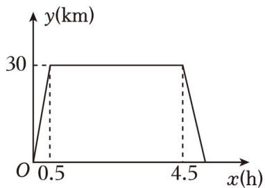

text_image

y(km)
30
O 0.5 4.5 x(h)

A．去基地的平均速度是每小时 60千米  
B．露营玩耍的时长为 4 小时  
C．回家的平均速度是每小时 50 千米  
D．与家相距 10 千米时，x 的值为 4.74

【分析】用路程除以时间可得去基地的平均速度是每小时 60千米，判断 A 正确；根据图象直接可判断 B正确；由按照原路返程回家．由于车流增加，平均行驶速度比去基地的平均速度少 $\frac { 1 } { 6 }$ 列式计算，可判断C 正确；去基地时，与家相距 10千米， $x = \frac { 1 0 } { 6 0 } = \frac { 1 } { 6 }$ 回家时，与家相距 10 千米， $x { = } 4 . 5 { + } \frac { 3 0 { - } 1 0 } { 5 0 } { = } 4 . 9$ ，50可判断 D 不正确

【解答】解：去基地的平均速度是 $3 0 \div 0 . 5 = 6 0$ （千米/小时）；故 A 正确，不符合题意；

露营玩耍的时长为 $4 . 5 - 0 . 5 = 4 ( N H )$ ），故 B 正确，不符合题意；

回家的平均速度是 $6 0 \times ~ ( 1 - \frac { 1 } { 6 } ) = 5 0$ （千米/小时），故 C 正确，不符合题意；

去基地时，与家相距 10千米， $x = \frac { 1 0 } { 6 0 } = \frac { 1 } { 6 }$

回家时，与家相距 千米， $x { = } 4 . 5 { + } \frac { 3 0 { - } 1 0 } { 5 0 } { = } 4 . 9$ ，

∴与家相距 10千米时，x 的值为 $\frac { 1 } { 6 }$ 或 4.9，故 D 不正确，符合题意；

故选：D．

9．一条公路旁依次有 A，B，C 三个村庄，甲、乙两人骑自行车分别从 A 村、B 村同时出发前往 C 村，甲、乙之间的距离 s（km）与骑行时间 t（h）之间的函数关系如图所示，下列结论错误的是（ ）

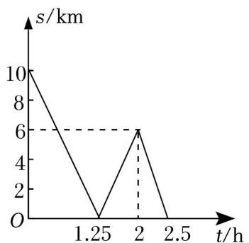

line chart

| t/h | s/km |
|---|---|
| 0 | 10 |
| 1.25 | 0 |
| 2 | 6 |
| 2.5 | 0 |

A．A，B 两村相距 10km  
B．出发 1.25h 后两人相遇  
C．甲每小时比乙多骑行 8km  
D．相遇后两人又骑行了 14min，此时两人相距 2km

【分析】根据图象与纵轴的交点可得出 A、B 两地的距离，而 s＝0 时，即为甲、乙相遇的时候，同理根据图象的拐点情况解答即可

【解答】解： $8 \times 1 . 2 5 { = } 1 0 k m$ ，A、B 两村相距 10km，故 A 正确，不符合题意；

当 1.25h时，甲、乙相距为 0km，故在此时相遇，故 B 正确，不符合题意；

当 $0 \leqslant t \leqslant 1 . 2 5$ 时，得一次函数的解析式为 $s = - \ 8 t + 1 0$ ，

故甲的速度比乙的速度快 8km/h，故 C 正确，不符合题意；

相遇后，15min 后两人相距 $8 \times \frac { 1 5 } { 6 0 } { = } 2 ( k m )$ ），

当 t＝2 时，乙距 C 地 6km，所以乙的速度是：

$$
\frac {6}{2 . 5 - 2} = 1 2 (k m / h),
$$

相遇 55min 后，乙距 C 地的路程是：

$$
6 - 1 2 \times (\frac {5 5}{6 0} - 0. 7 5) = 4 (k m),
$$

故 D 错误，符合题意

故选：D．

10．小明早晨 7：20 从家里出发步行去学校（学校与家的距离是 1000米），4 分钟后爸爸发现小明数学书没带，骑电瓶车去追赶，7：26追上小明并将数学书交给他（交接时间忽略不计），交接完成后爸爸放慢速度原路返回，7：30小明到达学校，同时爸爸也正好到家．如图，线段 OA 与折线 $B ^ { \mathrm { ~ - ~ } } C ^ { \mathrm { ~ - ~ } } D$ 分别表示小明和爸爸离开家的距离 s（米）关于时间 t（分钟）的函数图象，下列说法错误的是（ ）

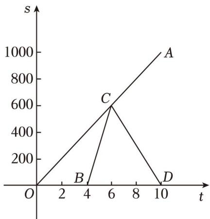

line chart

| Point | t | s |
|---|---|---|
| A | 10 | 1000 |
| B | 4 | 200 |
| C | 6 | 600 |
| D | 10 | 0 |

A．小明步行的速度为每分钟 100米  
B．爸爸出发时，小明距离学校还有 600米  
C．爸爸回家时的速度是追赶小明时速度的一半  
D．7：25 和 7：27 时，父子俩均相距 200 米

【分析】根据速度、路程、时间之间的关系等知识逐项判断即可

【解答】解：小明步行的速度为 $\frac { 1 0 0 0 } { 1 0 } = 1 0 0$ （米/分），

故 A 正确，不符合题意；

爸爸出发时小明离学校还有 $1 0 0 0 \cdot 4 \times 1 0 0 = 1 0 0 0 \cdot 4 0 0 = 6 0 0$ （米），

故 B 正确，不符合题意；

由题意知，爸爸用两分钟追上小明，

∴爸爸追赶小明时的速度为 $\frac { 1 0 0 \times 6 } { 2 } = 3 0 0$ （米/分），

爸爸回家的速度为： $\frac { 6 0 0 } { 1 0 - 6 } = 1 5 0$ 600 （米/分），

∴爸爸回家时的速度是追赶小明时速度的一半，

故 C 正确，不符合题意；

设小明出发 t 分钟时父子俩相距 200米，

根据题意得：100t﹣300（t﹣4）＝200 或（100+300）（t﹣6）＝200，

解得 t＝5 或 t＝6.5，

∴7：25和 7：26分 30秒时，父子俩均相距 200米，

故 D 错误，符合题意

故选：D

11．甲、乙两人分别从 A、B 两地同时出发，相向而行，匀速前往 B 地、A 地，两人相遇时停留了 4min，又各自按原来速度前往目的地，甲、乙两人之间的距离 y（m）与甲所用时间 x（min）之间的函数关系如图所示，给出下列结论：①A、B 之间的距离为 1200m；②24min 时，甲、乙两人中有一人到达目的地；③ $b = 8 0 0 ; \textcircled { 4 } a = 3 2$ ，其中正确的结论个数为（ ）

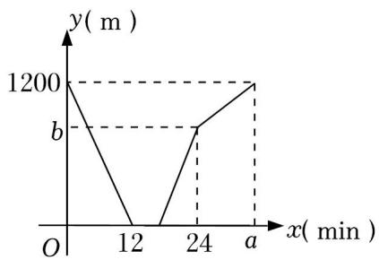

line chart

| x (min) | y (m) |
|---|---|
| 0 | 1200 |
| 12 | 0 |
| 24 | b |
| a | 1200 |

A．1 个

B．2 个

C．3 个

D．4 个

【分析】根据函数图象中的数据，可以直接看出 A，B 之间的距离，从而可以判断①；

根据图像倾斜程度，即可判断②；

根据图象中的数据和题意，可以求得甲和乙的速度之和，从而可以得到 b的值，从而判断③；

根据已知，可以先计算乙的速度，然后再计算出甲的速度，再根据图象，可以求得 a 的值，从而判断④

【解答】解：由图象可得，A，B 之间的距离为 1200m，故①正确；

根据图像可知，在 24min 时，甲、乙两人中有一人到达目的地，故②正确；

甲乙的速度之和为： $1 2 0 0 \div 1 2 { = } 1 0 0 ~ ( m / m i n )$ ），则 $b = \ ( \ 2 4 \mathrm { ~ - ~ } \ 1 2 \mathrm { ~ - ~ } 4 ) \ \times 1 0 0 { = } 8 0 0$ ，故③正确；

∵乙的速度为： $1 2 0 0 \div ( 2 4 - 4 ) = 6 0 ( m / m i n )$ ），甲的速度为： $1 2 0 0 \div 1 2 \cdot 6 0 = 1 0 0 \cdot 6 0 = 4 0 ( m / m i n )$ ，

$\therefore a = 1 2 0 0 \div 4 0 + 4 = 3 0 + 4 = 3 4 \neq 3 2$ ，故④错误；

综上，正确的结论个数为 3个，

故选：C

12．甲、乙两辆摩托车分别从 A、B 两地出发相向而行，图中 l 、l 分别表示两辆摩托车与 A 地的距离 s（km）与行驶时间 t（h）之间的函数关系，则下列说法：

①A、B 两地相距 24km；  
②甲车比乙车行完全程多用了 0.1 小时；  
③甲车的速度比乙车慢 8km/h；  
④两车出发后，经过 0.3 小时，两车相遇

其中正确的有（

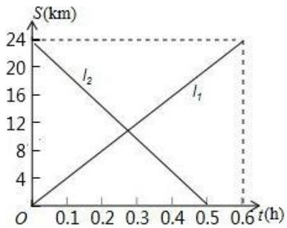

line chart

| t(h) | S(km) |
|---|---|
| 0.0 | 24 |
| 0.1 | 20 |
| 0.2 | 16 |
| 0.3 | 12 |
| 0.4 | 8 |
| 0.5 | 4 |
| 0.6 | 0 |

A．4 个

B．3 个

C．2 个

D．1 个

【分析】根据纵坐标判断①正确，根据横轴计算判断出②正确，根据速度＝路程÷时间计算出甲乙两车的速度，判断出③正确，根据相遇问题的等量关系列式求解即可判断出④错误

【解答】解： $\textcircled{1} x = 0$ 时，S＝24，所以 A、B 两地相距 24千米，故①正确；

②甲车比乙车行完全程多用了 $0 . 6 \textrm { -- } 0 . 5 = 0 . 1$ 小时，故②正确；  
③甲的速度为： $2 4 \div 0 . 6 { = } 4 0$ 千米/小时，

乙的速度为： $2 4 \div 0 . 5 = 4 8$ 千米/小时，

48﹣40＝8 千米/小时，

所以，甲车的速度比乙车慢 8 千米/小时错误，故③正确；

④ $2 4 \div ( 4 8 + 4 0 ) = \frac { 3 } { 1 1 }$ 小时，

所以，两车出发后，经过 $\frac { 3 } { 1 1 }$ 小时相遇，故④错误；

综上所述，正确的有①②③共 3个正确，

故选：B．

13．甲、乙两位同学周末相约去游玩，沿同一路线从 A 地出发前往 B 地，甲、乙分别以不同的速度匀速前行乙比甲晚 0.5h 出发，并且在中途停留 1h后，按原来速度的一半继续前进．此过程中，甲、乙两人离 A地的路程 s（km）与甲出发的时间 t（h）之间的关系如图．下列说法：①A，B 两地相距 24km；②甲比乙晚到 B 地 1h；③乙从 A 地刚出发时的速度为 72km/h；④乙出发 $\frac { 1 7 } { 1 4 } \mathrm { h }$ 与甲第三次相遇．其中正确的有）

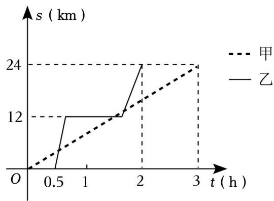

line chart

| t (h) | 甲   | 乙   |
|-------|------|------|
| 0     | 0    | 0    |
| 0.5   | 5    | 12   |
| 1     | 10   | 12   |
| 2     | 15   | 24   |
| 3     | 24   | -    |

A．1 个

B．2 个

C．3 个

D．4 个

【分析】根据函数与图象的关系以此计算即可判断

【解答】解：从图中可以看出，A，B 两地相距 24km，甲比乙晚到 B 地 1h，

故①②正确，符合题意；

设从 A 地刚出发时的速度为 $\nu k m / h$ ，

则 $\frac { 1 2 } { \mathrm { ~ \it ~ \cdot ~ } } + \frac { 1 2 } { 0 . 5 \mathrm { v } } = 2 \mathrm { ~ - ~ } 1 \mathrm { ~ - ~ } 0 . 5 .$ ，

解得 $\nu { = } 7 2$ ，

∴乙从 A 地刚出发时的速度为 $7 2 k m / h$ ，

故③正确，符合题意；

根据图象可知，甲的速度为 $\scriptstyle { \frac { 2 4 } { 3 } } = 8 ( k m / h )$ ），乙在途中停留 1h 后，二者第三次相遇，

乙中途停留前运动时间为 $\frac { 1 2 } { 7 2 } \mathrm { = } \frac { 1 } { 6 } ( h )$ ，

设乙继续前进 t 小时后二者相遇，

根据题意得： $8 ~ ( 0 . 5 + \frac { 1 } { 6 } + 1 + t ) ~ = 1 2 + 3 6 t .$ ，

解得 $t { = } \frac { 1 } { 2 1 }$

故第三次相遇为乙出发后 $\frac { 1 } { 6 } + 1 + \frac { 1 } { 2 1 } = \frac { 1 7 } { 1 4 } ( h )$ ，

故④正确．符合题意

故选：D．

14．小亮从学校步行回家，图中的折线反映了小亮离家的距离 S（米）与时间 t（分钟）的函数关系，根据图象提供的信息，给出以下结论：①他在前 12 分钟的平均速度是 70 米/分；②他在第 19 分钟到家；③他在第 12～19 分钟时离家越来越远；④他在第 33 分钟离家的距离是 720 米．其中正确的序号为（ ）

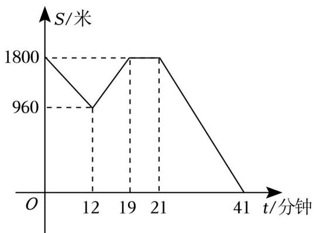

line chart

| t/分钟 | S/米 |
| ------ | ---- |
| 0      | 1800 |
| 12     | 960  |
| 19     | 1800 |
| 21     | 1800 |
| 41     | 0    |

A．①②③④

B．①④

C．①③

D．①③④

【分析】①让前 12 分钟走的路程除以所用的时间即可得到这个阶段内的速度；②若小亮到家，纵坐标应该为 0，第 19 分时纵坐标为 1800，表示离家还有 1800 米，所以②错误；在第 12～19 分钟时，随着时间的增加，纵坐标越来越大，那么离家越来越远，故③正确；易得第 21 分～41分时的函数解析式，把 x＝33代入即可得到离家的距离

【解答】解：∵0～12分时，从距家 1800米到距家 960米，

∴前 12 分钟的平均速度是： $\frac { 1 8 0 0 - 9 6 0 } { 1 2 } { = } 7 0$ 米/分．

$\therefore \textcircled{1}$ 正确；

∵第 19 分时纵坐标为 1800，

∴此时距家 1800 米

$\therefore \textcircled{2}$ 错误；

∵第 12～19 分钟时，随着时间的增加，纵坐标越来越大，

$\therefore$ 离家越来越远

$\therefore \textcircled{3}$ 正确；

设第 21 分～41分时的函数解析式为： $y = k x + b ( k \neq 0 )$ ）

∵过（21，1800），（41，0），

$$
\therefore \left\{ \begin{array}{l} 2 1 k + b = 1 8 0 0 \\ 4 1 k + b = 0 \end{array} . \right.
$$

解得： $\left\{ \begin{array} { l } { \mathbf { k } = - 9 0 } \\ { \mathbf { b } = 3 6 9 0 } \end{array} \right. .$

$$
\therefore y = - 9 0 x + 3 6 9 0.
$$

当 $x = 3 3$ 时， $y = 7 2 0$

$\therefore \textcircled{4}$ 正确．

故答案为：D

15．A、B 地相距 2400 米，甲、乙两人从起点 A 匀速步行去终点 B，已知甲先出发 4 分钟，在整个步行过程中，甲、乙两人之间的距离 y（米）与甲出发的时间 t（分）之间的关系如图所示，下列结论中，其中不正确的结论有（ ）个．

①甲步行的速度为 60米/分；  
②乙走完全程用了 32分钟；  
③乙用 16 分钟追上甲；  
④乙到达终点时，甲离终点还有 300米

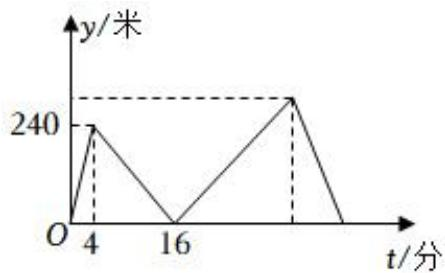

line chart

| t/分 | y/米 |
| ---- | ---- |
| 4    | 240  |
| 16   | 0    |
| 30   | 240  |

A．1

B．2

C．3

D．4

【分析】根据题意和函数图象中的数据可以判断各个小题中的结论是否正确，从而可以解答本题

【解答】解：由图可得，

甲步行的速度为： $2 4 0 \div 4 = 6 0$ 米/分，故 $\textcircled{1}$ 正确；

乙走完全程用的时间为： $2 4 0 0 \div ( 1 6 \times 6 0 \div 1 2 ) = 3 0$ （分钟），故 $\textcircled{2}$ 错误；

乙追上甲用的时间为： $1 6 - 4 = 1 2$ （分钟），故③错误；

乙到达终点时，甲离终点距离是： $2 4 0 0 - ( 4 + 3 0 ) \times 6 0 = 3 6 0$ 米，故 $\textcircled{4}$ 错误

故其中不正确的结论有 3 个

故选：C

16．某地为了鼓励市民节约用水，采取阶梯分段收费标准，共分三个梯段，0～15 吨为基本段，15～22 吨为极限段，超过 22吨为较高收费段，且规定每月用水超过 22 吨时，超过的部分每吨 4 元，居民每月应交水费 y（元）是用水量 x（吨）的函数，其图象如图所示

（1）基本段每吨水费 2 元；  
（2）若某用户该月用水 20吨，应交水费为 46元；  
（3）y 与 x 的函数解析式： $y = 2 x ;$

（4）若某月一用户交水费 48 元，则该用户用水 21吨，

其中正确的个数为（

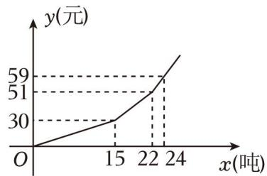

line chart

| x(吨) | y(元) |
| ----- | ----- |
| 0     | 0     |
| 15    | 30    |
| 22    | 51    |
| 24    | 59    |

A．1 个

B．2 个

C．3 个

D．4 个

【分析】（1）根据“每吨水费＝水费÷用水吨数”计算即可；

（2）利用待定系数法求出 $1 5 { \leqslant } x { < } 2 2$ 时 y 关于 x 的函数表达式，计算当 x＝20时对应 y 的值即可；  
（3）利用待定系数法求出 y 与 x 的函数解析式（表示为分段函数）即可；  
（4）根据图象，判断函数值为 48 时对应 x 的取值范围，从而把 y＝48 代入相应的函数进行计算

【解答】解：基本段每吨水费为 $3 0 \div 1 5 = 2 ( \overline { { \mathcal { D } } } )$ ），

∴（1）正确；

当 $1 5 { \leqslant } x { < } 2 2$ 时，设 y与 x的函数关系式为 $y = k _ { 1 } x + b _ { 1 } ( k _ { 1 } , ~ b _ { 1 }$ 为常数，且 $k _ { 1 } \neq 0 )$ ）

将 x＝15，y＝30 和 x＝22，y＝51 代入 $y = k _ { 1 } x + b _ { 1 }$ ，

得 $\left\{ \begin{array} { l } { { 1 5 \mathrm { k } _ { 1 } + \mathrm { b } _ { 1 } = 3 0 } } \\ { { 2 2 \mathrm { k } _ { 1 } + \mathrm { b } _ { 1 } = 5 1 } } \end{array} \right.$ 解得 $\left\{ \begin{array} { l l } { \mathtt { k } _ { 1 } = 3 } \\ { \mathtt { b } _ { 1 } = - 1 5 } \end{array} \right.$

$$
\therefore y = 3 x - 1 5 (1 5 \leqslant x <   2 2),
$$

当 $x { = } 2 0$ 时， $y = 3 \times 2 0 - 1 5 = 4 5$ ，

（2）不正确；

当 $0 \leqslant x < 1 5$ 时，设 y 与 x 的函数关系式为 $y = k _ { 2 } x$ （k2为常数，且 $k _ { 2 } \neq 0 )$ ）

将 x＝15，y＝30 代入 $y = k _ { 2 } x$ ，

得 $1 5 k _ { 2 } = 3 0$ ，解得 $k _ { 2 } = 2$

$$
\therefore y = 2 x (0 \leqslant x <   1 5),
$$

当 x≥22时，设 y与 x的函数关系式为 $y = k _ { 3 } x + b _ { 2 } ( k _ { 3 }$ 、b2为常数，且 $k _ { 3 } \neq 0 )$ ）

将 $x = 2 2 , y = 5 1$ 和 x＝24，y＝59 代入 $y = k _ { 3 } x + b _ { 2 }$ ，

得 $\left\{ \begin{array} { l } { { 2 2 \mathrm { k } _ { 3 } + \mathrm { b } _ { 2 } = 5 1 } } \\ { { 2 4 \mathrm { k } _ { 3 } + \mathrm { b } _ { 2 } = 5 9 } } \end{array} \right.$ 解得 $b _ { 2 } = - 3 7$

$$
\therefore y = 4 x - 3 7 (x \geqslant 2 2),
$$

综上， $y = \left\{ \begin{array} { l l } { 2 \mathbf { x } \left( 0 { \leqslant } \mathbf { x } < 1 5 \right) } \\ { 3 \mathbf { x } { - } 1 5 \left( 1 5 { \leqslant } \mathbf { x } < 2 2 \right) } \\ { 4 \mathbf { x } { - } 3 7 \left( \mathbf { x } { \geqslant } 2 2 \right) } \end{array} \right.$ ，

∴（3）不正确；

根据图象可知，30＜48＜51，

∴对应 x的取值范围是 15≤x＜22，

$\therefore 3 x - 1 5 = 4 8$ ，解得 x＝21，

∴（4）正确；

综上，（1）（4）正确，（2）（3）不正确，

故选：B．

17．某校八年级同学到距学校 8千米的某地参加社会实践活动，一部分同学步行，另一部分同学骑自行车，沿相同路线前往，如图，a，b 分别表示步行和骑车前往目的地所走的路程 y（千米）与所用时间 x（分）之间的函数图象，根据图象提供的信息，下面选项中正确的个数是（

①骑车的同学比步行的同学晚出发 30分钟；②骑车的同学和步行的同学同时到达目的地；③步行的速度是 7.5千米/时；④汽车的同学从出发到追上步行的同学用了 18分

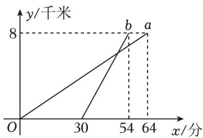

line chart

| x/分 | y/千米 (a) | y/千米 (b) |
| ---- | --------- | --------- |
| 30   | 8         | 8         |
| 64   | 8         | 8         |

A．1

B．2

D．4

【分析】①②根据图象直接判断即可；

③根据速度＝路程÷时间计算即可；

④根据速度＝路程÷时间计算骑车的速度，当骑车的同学追上步行的同学时，二者通过的路程相等，据此列方程并求解即可

【解答】解：由函数图象可知，骑车的同学比步行的同学晚出发 30 分钟，

$\therefore \textcircled{1}$ 正确；

根据函数图象，骑车的同学于 54分时到达目的地，而步行的同学于 64 分时到达目的地，

$\therefore \textcircled{2}$ 不正确；

步行的速度为 $8 \div \frac { 6 4 } { 6 0 } = 7 . 5$ （千米/时），

$\therefore \textcircled{3}$ 正确；

骑车的速度为 $8 \div \frac { 5 4 - 3 0 } { 6 0 } = 2 0$ （千米/时），

设骑车的同学从出发到追上步行的同学用了 t 小时，

则 7.5 $( t + \frac { 1 } { 2 } ) = 2 0 t$ ，解得 $t { = } \frac { 3 } { 1 0 }$

$$
\frac {3}{1 0} \times 6 0 = 1 8 (\text {分}),
$$

∴④正确；

综上，正确的有 $\textcircled{1} \textcircled{3} \textcircled{4}$ ，共 3 个，

故选：C

## 类型三：一次函数的实际应用

18．如图， $l _ { 1 }$ 反映了某品牌汽车一天的销售收入与销售量之间的函数关系， $l _ { 2 }$ 反映了该品牌汽车一天的销售成本与销售量之间的函数关系，请根据图象回答下列问题：

（1）当销售量为多少时该品牌汽车销售收入等于销售成本？  
（2）分别求出 $l _ { 1 }$ 与 l2所对应的函数表达式；  
（3）当销售量为 20 辆时，该品牌汽车所获利润为多少（利润＝销售收入﹣销售成本）？

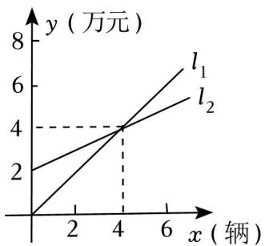

line chart

| x (辆) | y (万元) - l₁ | y (万元) - l₂ |
| ------ | ------------- | ------------- |
| 0      | 0             | 0             |
| 2      | 2             | 2             |
| 4      | 4             | 4             |
| 6      | 6             | 6             |

【分析】（1）由函数图象关键函数的意义可以得出结论；

（2）设 $l _ { 1 }$ 与 x 的关系式为 $y _ { 1 } = k _ { 1 } x$ ，l2与 x 的关系式为 $y = k ^ { \prime } x + 2 ( k ^ { \prime } \neq 0 )$ ），由待定系数法求出其解即可；  
（3）设销售利润为 w，根据利润＝销售收入﹣销售成本就可以得出解析式，当 $x { = } 2 0$ 时代入解析式期初其解即可．

【解答】解：（1）根据函数图象可知，两条函数图象的交点为（4，4），

$\therefore$ 当销售量为 4 辆时，该装载机厂销售收入等于销售成本；

（2）设 l1所对应的函数表达式为 $y = k x \ ( \ k { \neq } 0 )$ ），把（4，4）代入得：4k＝4，

解得：k＝1，

$\therefore l _ { 1 }$ 所对应的函数表达式为 $y = x ;$

设 $l _ { 2 }$ 所对应的函数表达式为 $y = k ^ { \prime } x + 2 ( k ^ { \prime } \neq 0 )$ ），把（4，4）代入得： $4 { = } 4 k ^ { \prime } \ + 2$

解得： $k ^ { \prime } = \frac { 1 } { 2 }$

$\therefore l _ { 2 }$ 所对应的函数表达式为 $y = \frac { 1 } { 2 } x + 2$

（3）设销售利润为 w，由题意，得

$$
w = x - 0. 5 x - 2,
$$

$$
w = 0. 5 x - 2.
$$

当 $x { = } 2 0$ 时，

$$
w = 0. 5 \times 2 0 - 2 = 8 (\text {万元}).
$$

答：当销售量为 20辆时，该品牌汽车所获利润为 8 万元

19．为满足顾客的购物需求，某水果店计划购进甲、乙两种水果进行销售．通过市场调研发现：购进 5 千克甲种水果和 3 千克乙种水果共需 38元；乙种水果每千克的进价比甲种水果多 2 元

（1）求甲、乙两种水果的进价分别是多少？

（2）已知甲、乙两种水果的售价分别为 6 元/千克和 9 元/千克，若水果店购进这两种水果共 300千克，其中甲种水果的重量不低于乙种水果的 2倍，则水果店应如何进货才能获得最大利润，最大利润是多少？

【分析】（1）分别设甲、乙两种水果的进价为未知数，根据题意列二元一次方程组并求解即可；

（2）将购进甲水果数量用某一字母表示，根据题意写出售完这两种水果获得的总利润关于这个字母的函数，根据这个函数随这个字母的增减性和这个字母的取值范围，判断当这个字母取何值时总利润取最大值，求出这个最大值，并求出这时购进乙水果的数量

【解答】解：（1）设甲、乙两种水果的进价分别是 x 元和 y元

根据题意，得 $\left\{ \begin{array} { l l } { 5 x + 3 y = 3 8 } \\ { y = x + 2 } \end{array} \right.$

解得 $\left\{ \begin{array} { l } { \mathbf { x } = 4 } \\ { \mathbf { y } = 6 } \end{array} \right. ,$

∴甲、乙两种水果的进价分别是 4 元和 6元

（2）设购进甲水果 m 千克，那么购进乙水果（300﹣m）千克，

$$
m \geqslant 2 (3 0 0 - m),
$$

解得 $m \geqslant 2 0 0$ ，

根据题意，售完这两种水果获得的总利润 $w = \textrm { ( 6 - 4 ) } m + \textrm { ( 9 - 6 ) } \ : ( 3 0 0 \textrm { - } m ) = \textrm { - } m + 9 0 0 \textrm { }$ ，

$$
\because - 1 <   0,
$$

$\therefore w$ 随 m 的减小而增大，

∴当 $m { = } 2 0 0$ 时，w 最大，此时 $w = - \ 2 0 0 + 9 0 0 = 7 0 0$ ，

300﹣200＝100（千克），

∴水果店应购进甲水果 200千克、乙水果 100千克才能获得最大利润，最大利润是 700元

20．学校饮用水安全问题事关重大，直接影响到广大青少年的身体健康．为了全力保障校园饮水安全，让学生喝上放心水、健康水，某校在教学楼每个楼层都安装了饮水机．为了解饮水机的使用情况，小亮所在综合实践小组进行了调查研究，他们发现：饮水机的容量是 25L，共有三个放水管，且每个水管出水的速度相同：三个水管同时打开时，饮水机的存水量（升）与放水时间（分）的关系如表所示

<table><tr><td>放水时间(分)</td><td>0</td><td>3</td><td>8</td><td>...</td></tr><tr><td>直饮水机的存水量(升)</td><td>25</td><td>17.5</td><td>5</td><td>...</td></tr></table>

（1）当三个放水管全部打开时，每分钟的总出水量为 2.5 L；

（2）某天课间休息时，同学们依次用饮水机接水．假设前后两人接水的间隔时间忽略不计，且水不发生泼洒，每个同学所接的水量相同．刚开始时，只打开了其中两个放水管，过了一会儿，来接水的同学越来越多，三个放水管全部打开．饮水机的存水量 y（L）与放水时间 x（min）的函数关系如图所示

①求饮水机中的存水量 y（L）与放水时间 x（min）（x≥3）的函数关系式；  
②如果前 3 分钟恰好有 10 名同学接完水，则前 30 个同学接完水共需多少时间？

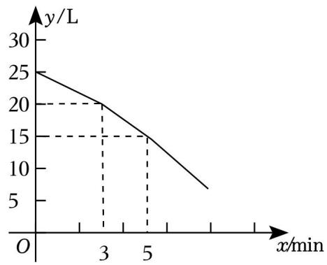

line chart

| x/min | y/L |
|---|---|
| 0 | 25 |
| 3 | 20 |
| 5 | 15 |
| 7 | 8 |

【分析】（1）根据图像和表格数据，可得 3 分钟放水 7.5升，除 3 即可得到每分钟的总出水量；

（2）①把（3，20）、（5，15）代入 $y = k x + b ( k \neq 0 )$ ）可得函数关系式为 $y = - ~ 2 . 5 x + 2 7 . 5$ 即可；

②如果前 3 分钟恰好有 10 名同学接完水，那么每名同学放水用时 $3 \times 2 \div 1 0 = 0 . 6 ( m i n )$ ），所以则前 30个同学接完水共需 $3 + 0 . 6 \times \frac { 3 0 - 1 0 } { 3 } = 7 ( m i n )$ 3 ．

【解答】解：（1）∵根据题意，三个放水管每个水管出水的速度相同，由已知表格数据知：三个水管同时打开时，3 分钟放水 25﹣17.5＝7.5（升），

∴当三个放水管全部打开时，每分钟的总出水量为 $7 . 5 \div 3 { = } 2 . 5 ( L )$ ）；

故答案为：2.5L

（2）①设函数关系式为 $y = k x + b ( k \neq 0 )$ ），把（3，20）、（5，15）代入，得 $3 k + b = 2 0 ,$

解得： $\left\{ { \begin{array} { l } { \mathbf { k } = - 2 . 5 } \\ { \mathbf { b } = 2 7 . 5 } \end{array} } \right. ,$

∴饮水机中的存水量 y（L）与放水时间 x（min）（x≥3）的函数关系式为 $y = - \ 2 . 5 x + 2 7 . 5 ;$

②如果前 3分钟恰好有 10名同学接完水，那么每名同学放水用时 $3 \times 2 \div 1 0 { = } 0 . 6 ( m i n )$ ），前 30个同学接完水共需 $3 + 0 . 6 \times \frac { 3 0 - 1 0 } { 3 } = 7 ( m i n )$ ．

答：前 30个同学接完水共需 7 分钟

21．一辆汽车和一辆摩托车分别从 A，B 两地去同一城市 C，它们离 A 地的路程随时间变化的图象如图所示，已知汽车的速度为 60km/h，摩托车比汽车晚 1个小时到达城市 C

（1）求摩托车到达城市 C 所用的时间；  
（2）求摩托车离 A 地的路程 y（km）关于时间 x（h）的函数表达式；  
（3）当 x 为何值时，摩托车和汽车相距 30km

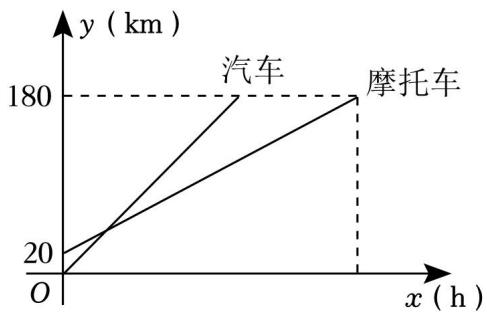

line chart

| x (h) | y (km) |
|-------|--------|
| 0     | 20     |
| 汽车  | 180    |
| 摩托车 | 180    |

【分析】（1）先计算汽车到达中点的用时 $\frac { 1 8 0 } { 6 0 } = 3 5$ ，结合摩托车比汽车晚 1个小时到达城市 C 求解即可

（2）设解析式为 $y = k x + b$ ，把（0，20），（4，180）分别代入解析式求解即可

（3）根据题意，得 $6 0 x - ( 4 0 x + 2 0 ) = 3 0$ ，求解即可

【解答】解：（1）根据图象信息，得到 A 到 C 点的距离为 180千米，

∵汽车的速度为 60km/h，

∴汽车到达中点的用时 $\frac { 1 8 0 } { 6 0 } = 3 n$ ，

∵摩托车比汽车晚 1 个小时到达城市 C，

∴摩托车到达城市 C 的时间为 4 小时

（2）设解析式为 $y = k x + b$ ，

把（0，20），（4，180）分别代入解析式得：

$$
\left\{ \begin{array}{l} 4 k + b = 1 8 0 \\ b = 2 0 \end{array} , \right.
$$

解得 $\left\{ \begin{array} { c } { \mathbf { k } = 4 0 } \\ { \mathbf { b } = 2 0 } \end{array} \right.$

故摩托车离 A 地的路程 y（km）关于时间 x（h）的函数表达式为 $y = 4 0 x + 2 0$

（3）根据题意，得到汽车的函数解析式为 $y = 6 0 x$ ，根据题意，得：

$$
6 0 x - (4 0 x + 2 0) = 3 0,
$$

解得 $x = \frac { 5 } { 2 }$

故经过 $\frac { 5 } { 2 } \iint \cdot A H \cdot f$ ，摩托车和汽车相距 30km

22．【阅读材料】为了保护学生的视力，学校的课桌、椅的高度都是按一定的关系配套设计的．为了了解学校新添置的一批课桌、椅高度的配套设计情况，小明所在的综合实践小组进行了调查研究，他们发现可以根据人的身高调节课桌、椅的高度，且课桌的高度 y（cm）与对应的椅子高度（不含靠背）x（cm）符合一次函数关系，他们测量了一套符合条件的课桌、椅对应的四档高度，数据如下表：

<table><tr><td>档次/高度</td><td>第一档</td><td>第二档</td><td>第三档</td><td>第四档</td></tr><tr><td>椅高x/cm</td><td>37.0</td><td>40.0</td><td>42.0</td><td>45.0</td></tr><tr><td>桌高y/cm</td><td>68.0</td><td>74.0</td><td>78.0</td><td></td></tr></table>

根据阅读材料，完成下列各题：

（1）求 y 与 x 的函数关系式；  
（2）在表格中，第四档的桌高数据被墨水污染了，请你求出被污染的数据；  
（3）小丽测量了自己新更换的课桌椅，桌子的高度为 61cm，椅子的高度为 32cm，请你判断它们是否配套？如果配套，请说明理由；如果不配套，请你帮助小丽调整桌子或椅子的高度使得它们配套

【分析】（1）可设 y 与 x 的函数关系式为 $y = k x + b ( k \neq 0 )$ ），把任意两组数值代入后计算得到相应的关系式，可把第三组数值代入看是否符合，若符合可得 y 与 x 的函数关系式；

（2）把 $x { = } 4 5 . 0$ 代入（1）得到的函数关系式，可得第四档的桌高数据，即被污染的数据；  
（3）把桌子的高度 61 代入（1）得到的函数关系式中的 y，可得椅子的高度，根据所得数据调整使它们配套；把椅子的高度 32 代入（1）得到的函数关系式中的 x，可得桌子的高度，根据所得数据调整使它们配套．

【解答】解：（1）设 y与 x的函数关系式为 $y = k x + b ( k \neq 0 )$ ）

把（37，68）和（40，74）代入，得：

$$
\left\{ \begin{array}{l} 3 7 k + b = 6 8 \\ 4 0 k + b = 7 4 \end{array} . \right.
$$

解得： $\left\{ \begin{array} { l l } { \mathbf { k } = 2 } \\ { \mathbf { b } = - 6 } \end{array} \right.$

$$
\therefore y = 2 x - 6.
$$

∵当 x＝42 时， $y = 7 8$ ，

∴第三档符合上述函数解析式，

$\therefore y$ 与 x的函数关系式为： $y = 2 x - 6$

（2）当 x＝45.0 时， $y { = } 2 \times 4 5 . 0 \ \mathrm { - } \ 6 { = } 8 4 . 0 .$ ，

∴被污染的数据为 84.0

（3）不配套，理由如下：

方法一：在 $y = 2 x - 6 \not \in$ ，当 x＝32时， $y { = } 2 \times 3 2 \ { - } \ 6 { = } 5 8$ ，

$$
\therefore 6 1 - 5 8 = 3 (c m),
$$

∴把小丽的桌子高度降低 3cm 就可以配套了

方法二：在 $y = 2 x - 6$ 中，当 $y = 6 1$ 时， $6 1 = 2 x - 6$ ，解得： $x { = } 3 3 . 5$ ，

$$
\therefore 3 3. 5 - 3 2 = 1. 5 (c m).
$$

∴把小丽的椅子高度升高 1.5cm 就可以配套了

23．如图①，部队、学校、仓库、基地在同一条直线上．学校开展国防教育活动，师生乘坐校车从学校出发前往基地，与此同时，教官们乘坐客车从部队出发，到仓库领取装备后再前往基地；到达基地后，他们需要 10min 整理装备．客车和校车离部队的距离 y（km）与所用时间 t（h）的函数图象如图②所示，其中，点 C 在线段 AB 上

（1）部队和基地相距 100 km，客车到达仓库前的速度为 80 km/h  
（2）求校车离部队的距离 y 与 t 的函数表达式以及教官们领取装备所用的时间  
（3）为确保师生到达基地时装备已经整理完毕，则客车第二次出发时的速度至少是多少？

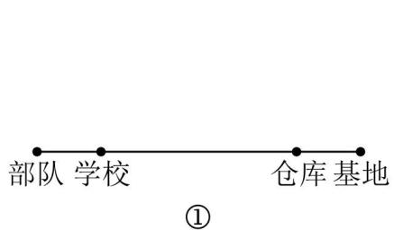

text_image

部队 学校
仓库 基地
①

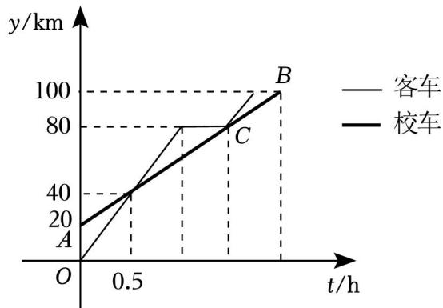

line chart

| t/h | 客车 (km) | 校车 (km) |
| --- | --------- | --------- |
| 0   | 0         | 0         |
| 0.5 | 40        | 40        |
| 1   | 80        | 80        |
| 2   | 100       | 100       |

②

【分析】（1）由图象直接得出部队和基地的距离；根据客车 0.5小时行驶的距离为 40km，求出客车到达仓库前的速度；

（2）用待定系数法求函数解析式；再把 $y = 8 0$ 代入解析式求出 x，然后求出客车在仓库停留的时间；  
（3）求出校车到达基地的时间，就可得出客车到达基地最大时间，然后求出客车速度的最小值

【解答】解：（1）由图象可知，部队和基地相距 100km，

客车到达仓库前的速度为： $\frac { 4 0 } { 0 . 5 } { = } 8 0 \ ( k m / h )$ ，

故答案为：100，80；

（2）校车离部队的距离 y 与 t 的函数表达式为 $y = k t { + b }$ ，

把（0，20），（0.5，40）代入解析式得： $\left\{ \begin{array} { l l } { { \bf b } = 2 0 } \\ { 0 . 5 { \bf k } + { \bf b } = 4 0 } \end{array} \right. ,$

解得 $\left\{ { \begin{array} { l } { _ { \mathrm { k } } = 4 0 } \\ { { \mathrm { b } } = 2 0 } \end{array} } \right. ,$

∴校车离部队的距离 y与 t 的函数表达式为 $y = 4 0 x + 2 0$ ；

把 $y = 8 0$ 代入 $y = 4 0 x + 2 0$ 得， $8 0 { = } 4 0 x { + } 2 0$ ，

解得 $x { = } 1 . 5$ ，

$\because$ 客车的速度为 $8 0 k m / h$ ，

$\therefore$ 客车到达仓库的时间为 $\frac { 8 0 } { 8 0 } { = } 1 ( h )$ ），

$$
\because 1. 5 - 1 = 0. 5 (h),
$$

∴教官们领取装备所用的时间 0.5h；

把 $y = 1 0 0$ 代入 $y = 4 0 x + 2 0$ 得， $1 0 0 { = } 4 0 x + 2 0$ ，

解得 x＝2，

∴校车 2小时到达营地，

为确保师生到达基地时装备已经整理完毕，

客车到达基地的时间 $t { \leqslant } 2 - \frac { 1 } { 6 } = \frac { 1 1 } { 6 }$ ，

∴客车第二次出发时的速度 $\nu { \gtrsim } \frac { 1 0 0 - 8 0 } { \frac { 1 1 } { 6 } - \frac { 3 } { 2 } }  { = } 6 0 ~ ( k m / h ) .$

∴客车第二次出发时的速度至少是 60km/h

## 类型四：一次函数与方案选择

24．疫情放开之后，商场为刺激消费推出了两种购物方案．方案一：非会员购物所有商品价格可获九五折优惠，方案二：如交纳 300元会费成为该商场会员，则所有商品价格可获九折优惠

（1）以 x（元）表示商品价格， $y \ ( \overline { { \pi } } )$ ）表示支出金额，分别写出两种购物方案中 y关于 x 的函数解析式；  
（2）若某人计划在商场购买价格为 7000元的电视机一台，请分析选择哪种方案更省钱？

【分析】（1）方案一中 y 关于 x的函数解析式根据“支出金额＝商品价格×折扣”、方案二中 y 关于 x的函数解析式根据“支出金额＝商品价格×折扣+会费”作答即可；

（2）当 $x { = } 7 0 0 0$ 时，分别计算两种方案中 y 的值并比较大小即可得出结论

【解答】解：（1）根据题意，方案一中 y 关于 x 的函数解析式为 $y = 0 . 9 5 x ;$ ；

方案二中 y 关于 x的函数解析式为 ${ { y } } = 0 . 9 { { x } } + 3 0 0 \ $

（2）当 $x { = } 7 0 0 0$ 时：

方案一实际付款 $y { = } 0 . 9 5 \times 7 0 0 0 { = } 6 6 5 0$ ；

方案二实际付款 $y { = } 0 . 9 { \times } 7 0 0 0 { + } 3 0 0 { = } 6 6 0 0$ ，

$$
\because 6 6 0 0 <   6 6 5 0,
$$

∴选择方案二更省钱

25．A 品牌大米远近闻名，深受广大消费者喜爱．开心超市每天购进一批成本价为每千克 4 元的 A 品牌大米，以不低于成本价且不超过每千克 8 元的价格销售．当每千克售价为 6 元时，每天售出该大米 900kg；当每千克售价为 7 元时，每天售出该大米 $8 5 0 k g$ ．通过分析销售数据发现：每天销售 A 品牌大米的质量 y（kg）与每千克售价 x（元）满足一次函数关系

（1）请求出 y 与 x 的函数关系式；  
（2）当每千克售价定为多少元时，开心超市销售 A 品牌大米每天获得的利润最大？最大利润为多少元？

【分析】（1）根据当每千克售价为 6 元时，每天售出大米 900kg；当每千克售价为 7 元时，每天售出大米 $8 5 0 k g$ 列出方程组，解方程组求出 k，b 即可；

（2）设利润为 W，根据题意可得 $W = ~ ( x - 4 ) ~ ( ~ - ~ 5 0 x + 1 2 0 0 ) ~ = ~ - ~ 5 0 x ^ { 2 } + 1 4 0 0 x - 4 8 0 0$ 化为顶点式，由函数性质求最值

【解答】解：（1）根据题意设 $y = k x + b$ ，

当每千克售价为 6 元时，每天售出大米 900kg；当每千克售价为 7 元时，每天售出大米 $8 5 0 k g$

则 $6 k + b = 9 0 0 ,$

解得 $\begin{array}{c} f _ { { \mathrm { { b } } } } = - 5 0  \\ { \lfloor { \mathrm { { b } } } = 1 2 0 0 } \end{array} ,$

$\therefore y$ 与 x的函数关系式为 $y = - 5 0 x + 1 2 0 0 ( 4 \leqslant x \leqslant 8 )$ ）；

（2）设开心超市销售 A 品牌大米每天获得的利润为 $W \mathcal { \overline { { \pi } } }$ ，

根据题意可得： $W { = } \ ( x - 4 ) \ ( \ - \ 5 0 x + 1 2 0 0 ) \ = \ - \ 5 0 x ^ { 2 } + 1 4 0 0 x - 4 8 0 0 { = } \ - \ 5 0 \ ( x - 1 4 ) \ ^ { 2 } + 5 0 0 0 ,$

$\because a = - 5 0 < 0$ ，对称轴为 x＝14，

∴当 $x { < } 1 4$ 时，W 随 x 的增大而增大，

又 $\because 4 \leqslant x \leqslant 8$ ，

∴x＝8 时， $W _ { \scriptscriptstyle \perp \perp \times 1 \perp } = - 5 0 ( 8 - 1 4 ) ^ { 2 } + 5 0 0 0 = 3 2 0 0 ,$

∴当每千克售价定为 8 元时，开心超市销售 A 品牌大米每天获得的利润最大，最大利润为 3200元

26．2023 年 12 月 18 日甘肃积石山县发生 6.2 级地震，造成严重的人员伤亡和财产损失．为支援灾区的灾后重建，甲、乙两县分别筹集了水泥 200吨和 300吨支援灾区，现需要调往灾区 A 镇 100吨，调往灾区B 镇 400 吨．已知从甲县调运一吨水泥到 A 镇和 B 镇的运费分别为 40元和 80元；从乙县调运一吨水泥到 A 镇和 B 镇的运费分别为 30元和 50元

（1）设从甲县调往 A 镇水泥 x 吨，求总运费 y 关于 x的函数关系式；  
（2）求出总运费最低的调运方案，最低运费是多少？

【分析】（1）用含 x的代数式分别表示出从甲县调往 B 镇水泥的数量和从乙县调往 A 镇、B 镇水泥的数量，再根据每吨水泥不同的运费写出 y 关于 x的函数关系式，并标明 x 的取值范围；

（2）根据（1）中得到的函数关系式，判断 y随 x 的变化情况，结合 x 的取值范围，确定当 x为何值时，y 取最小值，并将此时 x 的值代入函数，计算 y 的最小值，并计算从甲县和乙县分别调往 A 镇、B 镇水泥的数量

【解答】解：（1）根据题意可知，从甲县调往 B 镇水泥 $( 2 0 0 - x )$ ）吨，从乙县调往 A 镇水泥 $( 1 0 0 - x )$ 吨、调往 B 镇水泥（x+200）吨，

$$
\therefore y = 4 0 x + 8 0 (2 0 0 - x) + 3 0 (1 0 0 - x) + 5 0 (x + 2 0 0) = - 2 0 x + 2 9 0 0 0,
$$

$\therefore y$ 关于 x 的函数关系式为 $y = - ~ 2 0 x + 2 9 0 0 0 ~ ( 0 \leqslant x \leqslant 1 0 0 )$ ）

（2） $\because y = - ~ 2 0 x + 2 9 0 0 0 ~ ( 0 \leqslant x \leqslant 1 0 0 )$ ，

$\therefore y$ 随 x的增大而减小，

∴当 x＝100 时，y取最小值，y的最小值为 $y = - \ 2 0 \times 1 0 0 + 2 9 0 0 0 = 2 7 0 0 0$ ∴从甲县分别调往 A 镇和 B 镇水泥各 100吨，从乙县将 300吨水泥全部调往 B 镇，可使总运费最低，最低运费是 27000 元

27．5G 时代的到来，给人类生活带来很多的改变．某营业厅现有 A、B 两种型号的 5G 手机，进价和售价如表所示：

<table><tr><td></td><td>进价(元/部)</td><td>售价(元/部)</td></tr><tr><td>A</td><td>3000</td><td>3400</td></tr><tr><td>B</td><td>3500</td><td>4000</td></tr></table>

（1）若该营业厅卖出 70 台 A 型号手机，30 台 B 型号手机，可获利 43000 元；

（2）若该营业厅再次购进 A、B 两种型号手机共 100 部，且全部卖完，设购进 A 型手机 x 台，总获利为W 元．

①求出 W 与 x的函数表达式；

②若该营业厅用于购买这两种型号的手机的资金不超过 330000元，求最大利润 W是多少？

【分析】（1）计算 70×（3400﹣3000）+30×（4000﹣3500）即可求解；

（2）①根据 W＝（3400﹣3000）x+（4000﹣3500）（100﹣x）即可求解；②根据一次函数的增减性即可求解．

【解答】解：（1）若该营业厅卖出 70 台 A 型号手机，30 台 B 型号手机，可获利：

$$
7 0 \times (3 4 0 0 - 3 0 0 0) + 3 0 \times (4 0 0 0 - 3 5 0 0) = 4 3 0 0 0 (\text {元}),
$$

故答案为：43000

（2）①∵购进 A 型手机 x 台，

∴购进 B 型手机（100﹣x）台，

$$
W = (3 4 0 0 - 3 0 0 0) x + (4 0 0 0 - 3 5 0 0) (1 0 0 - x) = - 1 0 0 x + 5 0 0 0 0
$$

②由题意得，

$$
3 0 0 0 x + 3 5 0 0 (1 0 0 - x) \leqslant 3 3 0 0 0 0,
$$

解得，40≤x≤100

$$
\because W = - 1 0 0 x + 5 0 0 0 0, k = - 1 0 0 <   0,
$$

∴W 随着 x 的增大而减小

∴当 x＝40 时，W 有最大值为 46000 元

28．为响应政府低碳生活，绿色出行的号召，某公交公司决定购买一批节能环保的新能源公交车，计划购买 A 型和 B 型两种公交车，其中每辆的价格、年载客量如表：

<table><tr><td></td><td>A型</td><td>B型</td></tr><tr><td>价格(万元/辆)</td><td>a</td><td>b</td></tr><tr><td>年载客量(万人/年)</td><td>60</td><td>100</td></tr></table>

若购买 A 型公交车 1 辆，B 型公交车 2辆，共需 400 万元；若购买 A 型公交车 2 辆，B 型公交车 1 辆，

共需 350万元

（1）求 a，b的值；  
（2）计划购买 A 型和 B 型两种公交车共 10辆，如果该公司购买 A 型和 B 型公交车的总费用不超过 1200万元，且确保这 10辆公交车在该线路的年均载客总和不少于 640万人次，问有几种购买方案？  
（3）在（2）的条件下，请用一次函数的性质说明哪种方案使得购车总费用最少？最少费用是多少万元？

【分析】（1）利用总价＝单价×数量，结合“购买 A 型公交车 1 辆，B 型公交车 2 辆，共需 400 万元；购买 A 型公交车 2 辆，B 型公交车 1 辆，共需 350万元”，即可得出关于 a，b 的二元一次方程组，解之即可得出结论；

（2）根据购买 A 型公交车 8 辆，B 型公交车 2 辆，设购买 A 型公交车 m 辆，则购买 B 型公交车（10﹣m）辆，根据“购买 A 型和 B 型公交车的总费用不超过 1200 万元，且确保这 10辆公交车在该线路的年均载客总和不少于 720 万人次”，即可得出关于 m 的一元一次不等式组，解之即可得出 m 的取值范围，结合m 为整数，即可得出 m 的值，得出购买方案；  
（3）设购车总费用为 w 万元，根据总费用＝购买两种公交车费用之和列出函数解析式，由函数的性质得出最值

【解答】解：（1）依题意得：

答：a 的值为 100，b 的值为 150；

（2）设购买 A 型公交车 m 辆，则购买 B 型公交车 （10﹣m） 辆，

解得：6≤m≤9

又∵m 为整数，

∴有 4 购买方案；

方案一：购买 A 型公交车 6 辆，购买 B 型公交车 4 辆；

方案二：购买 A 型公交车 7 辆，购买 B 型公交车 3 辆；

方案一：购买 A 型公交车 8 辆，购买 B 型公交车 2 辆；

方案二：购买 A 型公交车 9 辆，购买 B 型公交车 1 辆；

（3）设购车总费用为 w 万元，

则 w＝100m+150（10﹣m）＝﹣50m+1500，（6≤m≤9 且 m 为整数）

$$
\because - 5 0 <   0,
$$

∴w 随 m 的增大而减小，

∴当 m＝9时，w 最小，最小值为﹣50×9+1500＝1050（万元），

∴购车总费用最少的方案是购买 A 型公交车 9 辆，购买 B 型公交车 1 辆，购车总费用为 1050万元

29．2023 年 4月 23 日是世界第 28个读书日，为培养学生的阅读兴趣，某校准备购进甲、乙两种图书．经调查，甲种图书费用 y（元）与购进本数 x（本）之间的函数关系如图所示，乙种图书每本 25 元

（1）当 x≥100时，求 y 与 x 之间的函数关系式；

（2）①若只购买 80本甲种图书，则需费用 1920 元；

②学校准备购进 400 本图书，且两种图书均不少于 100 本，如何购买，才能使总费用最少？最少总费用多少元？

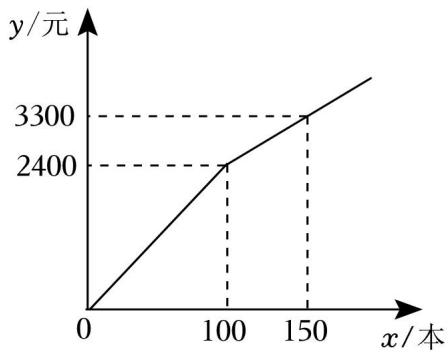

line chart

| x/本 | y/元 |
| ---- | ---- |
| 0    | 0    |
| 100  | 2400 |
| 150  | 3300 |

【分析】（1）设 y 与 x 之间的函数关系式是 $y = a x + b$ ，根据函数图象代入数据，可以求出当对应的函数解析式；

（2）设总费用为 w 元，求出 w 关于 x的关系式，再利用一次函数的性质求出最少的费用即可

【解答】（1）解：当 $x \geqslant 1 0 0$ 时，设 y 与 x 之间的函数关系式是 $y = a x + b$ ，

$$
\left\{ \begin{array}{l} 1 0 0 a + b = 2 4 0 0 \\ 1 5 0 a + b = 3 3 0 0 \end{array} , \right.
$$

解得 ${ \left\{ \begin{array} { l } { { \boldsymbol { \mathrm { a } } } = 1 8 } \\ { { \boldsymbol { \mathrm { b } } } = 6 0 0 } \end{array} \right. } ,$ ，

即当 $x \geqslant 1 0 0$ 时，y与 x 之间的函数关系式是 $y = 1 8 x + 6 0 0$ ，

$\therefore y$ 与 x 之间的函数关系式是： $y = 1 8 x + 6 0 0$ ；

（2）①当 $0 { \leqslant } x { \leqslant } 1 0 0$ 时，设 y 与 x之间的函数关系式是 $y = k x$ ，

$$
1 0 0 k = 2 4 0 0,
$$

解得， $k { = } 2 4 ,$ ，

即当 $0 { \leqslant } x { \leqslant } 1 0 0$ 时，y与 x 之间的函数关系式是 $y = 2 4 x$ ，

当 $x { = } 8 0$ 时， $y = 2 4 \times 8 0 = 1 9 2 0 ~ \overline { { \mathcal { T } } }$

故答案为：1920；

②设总费用为 w 元，设购买 x 本甲本图书，则购买 $( 4 0 0 - x )$ ）本乙本图书，

∵两种图书均不少于 100本，

则 $\left\{ \begin{array} { l } { \displaystyle \mathbf { x } \geqslant 1 0 0 } \\ { \displaystyle 3 0 0 - \mathbf { x } \geqslant 1 0 0 } \end{array} \right. ,$

$$
\therefore 1 0 0 \leqslant x \leqslant 3 0 0,
$$

$$
\therefore w = 1 8 x + 6 0 0 + 2 5 (4 0 0 - x)
$$

$$
= - 7 x + 1 0 6 0 0,
$$

$\because k < 0 , \ w$ 随 x的增大而减小，

$\therefore \stackrel { \scriptscriptstyle * } { \equiv } \iota = 3 0 0$ 时，w 最少为 $- \ 2 1 0 0 \div 1 0 6 0 0 = 8 5 0 0$ ，

∴应购买甲种图书 100本，乙种图书 300本，才能使总费用最少，最少是 8500元

30．随着“低碳生活，绿色出行”理念的普及，新能源汽车正逐渐成为人们喜爱的交通tools-2．某汽车销售公司计划购进一批新能源汽车尝试进行销售，据了解 2 辆 A 型汽车、3 辆 B 型汽车的进价共计 110万元；3 辆 A 型汽车、2 辆 B 型汽车的进价共计 115万元

（1）求 A、B 两种型号的汽车每辆进价分别为多少万元？

（2）若该公司计划用 400万元购进以上两种型号的新能源汽车（两种型号的汽车均要购买，且 400万元全部用完），问该公司有哪几种购买方案，请通过计算列举出来；

（3）若该汽车销售公司销售 1 辆 A 型汽车可获利 0.8 万元，销售 1辆 B 型汽车可获利 0.5万元，在（2）中的购买方案中，假如这些新能源汽车全部售出，哪种方案获利最大？最大利润是多少万元？

【分析】（1）列二元一次方程组并求解即可；

（2）分别用字母表示两种汽车型号的数量，将一种型号汽车的数量用另一种型号的汽车数量表示出来，当它们均为正整数时确定其数值，从而得到购买方案；

（3）分别计算每种方案的利润并进行比较大小即可

【解答】解：（1）设 A、B 两种型号的汽车进价分别为 x万元、y 万元

根据题意，得 $\begin{array} { r } { { 2 } \mathbf { x } + 3 \mathbf { y } = 1 1 0 } \\ { 3 \mathbf { x } + 2 \mathbf { y } = 1 1 5 ^ { \circ } } \end{array}$ 解得 $y = 2 5$

答：A、B 两种型号的汽车进价分别为 25 万元、20 万元

（2）设 A、B 两种型号的汽车分别购进 a 辆和 b辆

根据题意，得 $2 5 a + 2 0 b = 4 0 0$ ，即 $b = 2 0 - \frac { 5 a } { 4 }$

∵两种型号的汽车均购买，且 a、b 均为正整数，

$\therefore \{ \frac { a = 4 } { b = 1 5 }$ 或 $\left\{ \begin{array} { l l } { \mathtt { a } = 8 } \\ { \mathtt { b } = 1 0 } \end{array} \right.$ 或 $a = 1 2$

∴共有以下 3种购买方案：

方案 1：A 型号的汽车购进 4 辆，B 型号的汽车购进 15 辆；

方案 2：A 型号的汽车购进 8 辆，B 型号的汽车购进 10 辆；

方案 3：A 型号的汽车购进 12 辆，B 型号的汽车购进 5 辆

（3）方案 1 可获利： $0 . 8 \times 4 + 0 . 5 \times 1 5 = 1 0 . 7 ( \mathcal { F } \overline { { \mathcal { T } } } )$ ）；

方案 2 可获利： $0 . 8 \times 8 + 0 . 5 \times 1 0 { = } 1 1 . 4 ( \mathcal { H } \overline { { \mathcal { \pi } } } )$ ）；

方案 3 可获利： $0 . 8 \times 1 2 \substack { + 0 . 5 \times 5 } = 1 2 . 1 ( \overline { { \mathcal { H } } } \overline { { \mathcal { T } } } )$ ；

$$
\because 1 0. 7 <   1 1. 4 <   1 2. 1,
$$

∴方案 3获利最大，最大利润是 12.1万元