## 第 08 讲专题 2 一次函数与几何图形

类型一：一次函数与图形的平移

类型二：一次函数与图形的对称

类型三：一次函数与图形的旋转

类型四：一次函数与三角形

类型五：一次函数与四边形

## 类型一：一次函数与图形的平移

1．如图，点 M 的坐标为（3，4），将 OM 沿 x 轴正方向平移，使点 M 的对应点 M′落在直线 $y = \frac { 1 } { 2 } x$ 上，点 O 的对应点为 $O ^ { \prime }$

（1）则点 $M ^ { \prime }$ 的坐标为 （8，4） ；  
（2）连接 $M M ^ { \prime }$ ′，四边形 $M O O ^ { \prime } \ J$ ′的形状为 菱形

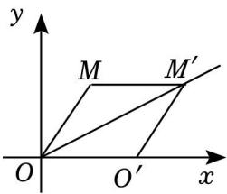

text_image

y
M M'
O O' x

【分析】（1）把 y＝4 代入 $y = \frac { 1 } { 2 }$ 得到 $x { = } 8$ ，即可得到点 $M ^ { \prime }$ 的坐标；

（2）由平移可得 $O M { = } O M ^ { \prime }$ ′， $O M / / O M ^ { \prime }$ ′，证到四边形 $M O O ^ { \prime } \ : \ : M ^ { \prime }$ ′为平行四边形，由勾股定理得到$O M { = } 5$ ，再由 $M , \ M ^ { \prime }$ 的坐标得到 $O M { = } M M ^ { \prime } ~ = 5$ ，即可证明四边形 $M O O ^ { \prime } \ : \ : M ^ { \prime }$ 为菱形；

【解答】解：（1）把 $y = 4$ 代入 $y = \frac { 1 } { 2 }$ ，

得 x＝8，

∴点 $M ^ { \prime }$ ′坐标为（8，4），

故答案为：（8，4）；

（2）四边形 $M O O ^ { \prime } \ : \ : M ^ { \prime }$ ′为菱形

理由如下：过点 M作 $M A \perp x$ 轴于点 A，

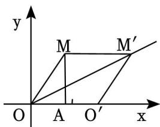

text_image

y
M M'
O A O' x

由平移得，

$$
O M = O M ^ {\prime}, O M / / O M ^ {\prime},
$$

∴四边形 $M O O ^ { \prime } \ : \ : M ^ { \prime }$ ′为平行四边形，

∵点 M 的坐标为（3，4），

$$
\therefore O A = 3, \quad A M = 4,
$$

$$
\therefore O M = \sqrt {3 ^ {2} + 4 ^ {2}} = 5,
$$

∵点 M 的坐标为（3，4），点 $M ^ { \prime }$ 坐标为（8，4），

$$
\therefore M M ^ {\prime} = 8 - 3 = 5,
$$

$$
\therefore O M = M M ^ {\prime},
$$

∴平行四边形 $M O O ^ { \prime } \ : \ : M ^ { \prime }$ 为菱形，

故答案为：菱形

2．如图，在平面直角坐标系中，直线 $\scriptstyle ! _ { 1 } : \ { y = { \frac { 1 } { 2 } } x + 3 }$ 与 x 轴、y 轴交点分别为点 A 和点 B，直线 $l _ { 2 }$ 过点 B 且与 x轴交于点 C，将直线 $l _ { 1 }$ 向下平移 4 个单位长度得到直线 $l _ { 3 } .$ ，已知直线 $l _ { 3 }$ 刚好过点 C 且与 y 轴交于点D．

（1）求直线 $l _ { 2 }$ 的解析式；  
（2）求四边形 ABCD 的面积

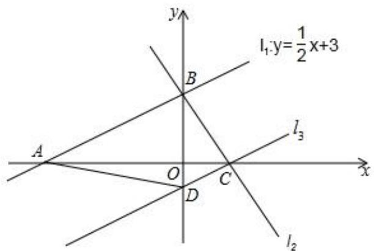

text_image

y
l₁:y=\frac{1}{2}x+3
B
A
O
C
D
x
l₃
l₂

【分析】（1）根据直线 $l _ { 1 }$ 的解析式求出 A（﹣6，0），B（0，3）．根据上加下减的平移规律求出直线 l3的解析式为 $y = \frac { 1 } { 2 } x - 1$ ，求出 C（2，0），D（0，﹣1）．根据直线 l2过点 B、C，利用待定系数法求出直线 $l _ { 2 }$ 的解析式；

（2）根据 $S _ { \ D \perp \dot { 2 } \underline { { { 2 } } } \dot { 2 } \dot { 2 } \dot { 2 } \dot { 2 } \cdot A B C D } { = } S _ { \triangle A B C } { + } S _ { \triangle A D C }$ ，即可求出四边形 ABCD 的面积

【解答】解：（1）∵直线 $l _ { 1 } \colon y = \frac 1 2 x + 3$ 与 x 轴、y 轴交点分别为点 A 和点 B，

∴y＝0 时， $\therefore y = 0$ $\frac { 1 } { 2 } x + 3 = 0$ ，解得 $x = - ~ 6$ ，

$x { = } 0$ 时， $y = 3$ ，

∴A（﹣6，0），B（0，3）

$\because$ 将直线 $l _ { 1 } \colon y = \frac 1 2 x + 3$ 向下平移 4个单位长度得到直线 $l _ { 3 }$ ，

$\therefore$ 直线 $l _ { 3 }$ 的解析式为： $y = \frac { 1 } { 2 } x + 3 - 4$ ，即 $y = \frac { 1 } { 2 } x - 1$

$\because y = 0$ 时， ${ \frac { 1 } { 2 } } x - 1 = 0$ ，解得 $x { = } 2$ ，

$x { = } 0$ 时， $y = - \ 1$ ，

∴C（2，0），D（0，﹣1）

设直线 l2的解析式为 $y = k x + b$ ，

$\because$ 直线 l2过点 B（0，3）、点 C（2，0），

$\therefore \{ 6 = 3$ ，解得 $\left\{ \begin{array} { l l } { \mathbf { k } = - { \frac { 3 } { 2 } } } \\ { \mathbf { b } = 3 } \end{array} \right.$ ，

$\therefore$ 直线 $l _ { 2 }$ 的解析式为 $y = - \frac { 3 } { 2 } x + 3$ ；

（2）∵A（﹣6，0），B（0，3），C（2，0），D（0，﹣1），

$$
\therefore A C = 2 - (- 6) = 8, O B = 3, O D = 1,
$$

$$
\begin{array}{l} \therefore S _ {\text { 四边形 } A B C D} = S _ {\triangle A B C} + S _ {\triangle A D C} \\ = \frac {1}{2} A C \cdot O B + \frac {1}{2} A C \cdot O D \\ = \frac {1}{2} \times 8 \times 3 + \frac {1}{2} \times 8 \times 1 \\ = 1 2 + 4 \\ = 1 6. \\ \end{array}
$$

3．综合应用

如图 1，直线 l1：y＝2x+3 与 x 轴交于点 B，直线 l2与 x 轴交于点 $\mathsf { C } ( \frac { 3 } { 2 } , \mathsf { 0 } )$ ，l1、l2 交于 y 轴上一点 A

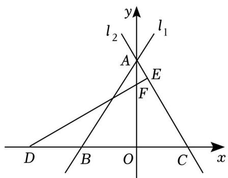

text_image

y
l₂
l₁
A
E
F
D
B
O
C
x

图1

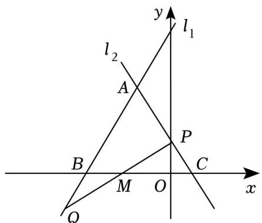

text_image

y
l₁
l₂
A
P
B
M
O
C
x
Q

图2

（1）特征探究：求直线 $l _ { 2 }$ 的表达式；  
（2）坐标探究：过 x 轴上一点 $D \ ( \ - \ 3 , \ 0 )$ ），作 DE⊥AC 于点 E，交 y 轴于点 F，求 E 点坐标；  
（3）规律探究；将 $\triangle A B C$ 将向左平移 m 个单位长度 $( 0 < \pi < \frac { 3 } { 2 } )$ 得到图 2，AC 与 y 轴交于点 P（点 P

不与 A 点和 C 点重合），在 AB 的延长线上取一点 Q，使 $B Q { = } C P$ ，连接 $P Q$ 交 x 轴于 M 点．请探究 $\triangle A B C$ 向左平移的过程中，线段 MO 的长度的变化情况？

【分析】（1）把 $x { = } 0$ 代入 $y = 2 x + 3$ 求出点 A 的坐标，结合点 C 的坐标求出 $l _ { 2 }$ 的表达式；

（2）根据题意求出直线 DE 的解析式，从而求出点 E 和点 F 的坐标；

（3）OM 的长度不变，理由如下，过点 Q 作 $D Q \bot x$ 轴，证明 $\triangle B D Q { \cong } \triangle C O P$ 得到 ${ \cal D } B { = } O C , ~ D Q { = } O P $ ，再证明 $\triangle M D Q { \cong } \triangle M O P$ ，得到 $O M = \frac { 1 } { 2 } 0 \mathbb { D }$ ，从而求出 OM 的长度

【解答】解：（1）把 x＝0 代入 $y = 2 x + 3$ ，得 $y = 3$ ，

∴点 A 的坐标为（0，3），

设 l2的表达式为 $y = k x + b$ ，把 A（0，3）， $\mathsf { C } ( \frac { 3 } { 2 } , \mathsf { 0 } )$ 代入，

得 $\left\{ \begin{array} { l l } { { \displaystyle { b = 3 } } } \\ { { \displaystyle { \frac { 3 } { 2 } } k + b = 0 } } \end{array} \right.$ 解得 $\left\{ \begin{array} { l l } { \mathbf { k } = - 2 } \\ { \mathbf { b } = 3 } \end{array} \right.$

$\therefore l _ { 2 }$ 的表达式为 $y = - ~ 2 x + 3$ ；

（2）由 $D E \bot A C , l _ { 2 }$ 的表达式为 $y = - ~ 2 x + 3$ ，

设直线 DE 的解析式为 $y = \frac { 1 } { 2 } x + b$ x+b， 把 $\textit { D } ( \textit { - } 3 , \textit { } 0 )$ ）代入，

解得 $b { = } \frac { 3 } { 2 }$ ，

$\therefore$ 直线 DE 的解析式为 $y = \frac { 1 } { 2 } x + \frac { 3 } { 2 }$

把 $x { = } 0$ 代入 $y = \frac { 1 } { 2 } x + \frac { 3 } { 2 }$ 1 解得 y＝ $y = \frac { 3 } { 2 }$ ，

$\therefore$ 点 F 的坐标为 $( 0 , \ \frac { 3 } { 2 } )$

联立 $y = \frac { 1 } { 2 } x + \frac { 3 } { 2 }$ 解得 $\left\{ \begin{array} { l } { \displaystyle \mathbf { x } = \frac { 3 } { 5 } } \\ { \displaystyle \mathbf { y } = \frac { 9 } { 5 } } \end{array} \right. ,$

$\therefore$ 点 E 的坐标为 $( \frac { 3 } { 5 } , \frac { 9 } { 5 } )$

（3）OM 的长度不变，理由如下：

如图 1，由 $( - \frac { 3 } { 2 } , 0 ) , ( ( \frac { 3 } { 2 } , 0 )$

$\therefore O B { = } O C .$ ，且 $B C = 3$ ，

$$
\because \angle B O A = \angle C O A = 9 0 ^ {\circ}, O A = O A,
$$

$$
\therefore \triangle A O B \cong \triangle A O C,
$$

$$
\therefore A B = A C,
$$

过点 Q 作 DQ⊥x 轴，

$$
\because A B = A C,
$$

$$
\therefore \angle A B C = \angle A C B = \angle D B Q,
$$

$$
\because B Q = C P, \angle B D Q = \angle C O P = 9 0 ^ {\circ},
$$

$$
\therefore \triangle B D Q \cong \triangle C O P (A A S),
$$

$$
\therefore D B = O C, \quad D Q = O P,
$$

$$
\therefore O D = D B + O B = O C + O B = B C = 3,
$$

$$
\because \angle M D Q = \angle M O P = 9 0 ^ {\circ}, \angle D M Q = \angle O M P, D Q = O P,
$$

$$
\therefore \triangle M D Q \cong \triangle M O P (A A S),
$$

$$
\therefore D M = O M,
$$

$$
\therefore O M = \frac {1}{2} O D = \frac {3}{2}.
$$

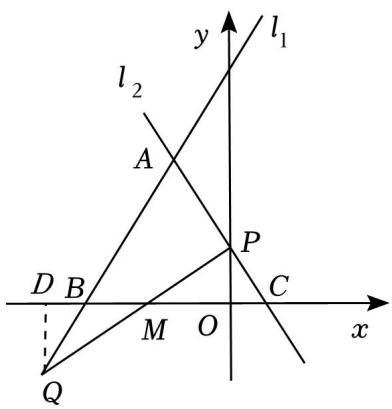

text_image

l₁
y
l₂
A
P
D B
M O C
x
Q

4．如图，在直角坐标系中，一次函数的图象 $l _ { 1 }$ 与 $y$ 轴交于点 A（0，2），与 x 轴交于点 $B ( - \frac { 4 } { 7 } , 0 ) , 5 -$ 次函数 $y = x - 3$ 的图象 $l _ { 2 }$ 交于点 E

（1）求 $l _ { 1 }$ 的函数表达式；  
（2）直线 $l _ { 2 }$ 与 y 轴交于点 C，求 $\triangle A E C$ 的面积；  
（3）如图，已知长方形 MNPQ，PQ＝2，NP＝1， $\textit { M } ( a , \ 1 )$ ），矩形 MNPQ 的边 $P Q$ 在 x 轴上平移，若矩形 $M N P Q$ 与直线 $l _ { 1 }$ 或 $l _ { 2 }$ 有交点，直接写出 a 的取值范围

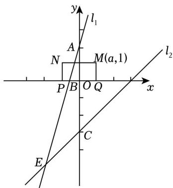

text_image

y
l₁
A
N
M(a,1)
P B O Q x
l₂
C
E

【分析】（1）利用待定系数法求出 $l _ { 1 }$ 的解析式；

（2）根据点 E 是直线 l1和直线 $l _ { 2 }$ 的交点，求出 E 点坐标，利用面积计算公式即可求解；

（3）分别求出矩形 MNPQ 在平移过程中，当点 Q 在 $l _ { 1 }$ 上、点 Q 在 l2上、点 N 在 l1上、点 N 在 l2上时a 的值，即可得出结论

【解答】解：（1）设直线 $l _ { 1 }$ 的表达式 $y = k x + b$ ，

∵直线 l1 过点 A（0，2）和点 $\because$ $B ( - \frac { 4 } { 7 } , 0 )$ ，代入得：

$$
\left\{ \begin{array}{l} 2 = b \\ 0 = - \frac {4}{7} k + b \end{array} , \right.
$$

解得 $\{ k = \frac { 7 } { 2 }$

$\therefore$ 直线 l1的表达式为 $y = \frac { 7 } { 2 } x + 2$ x+2.

（2）∵点 E 是直线 l1和直线 l2的交点，联立得：

$$
\left\{ \begin{array}{l} y = x - 3 \\ y = \frac {7}{2} x + 2 \end{array} , \right.
$$

解得 $x = - 2$

则点 E 的坐标为（﹣2，﹣5），

$$
S _ {\triangle A E C} = \frac {1}{2} \times A C \times | x _ {E} | = \frac {1}{2} \times 5 \times 2 = 5;
$$

（3）当矩形 MNPQ 的顶点 Q 在 $l _ { 1 }$ 上时，a 的值为 $- \frac { 4 } { 7 }$ ，

矩形 MNPQ 向右平移，当点 N 在 l 上时，

$$
\frac {7}{2} x + 2 = 1,
$$

$x = - \frac { 2 } { 7 }$ ，即点 $( - \frac { 2 } { 7 } , 1 )$

$\therefore a$ 的值为 $- \frac { 2 } { 7 } + 2 = \frac { 1 2 } { 7 }$ +2=7

矩形 MNPQ 继续向右平移，当点 Q 在 l2上时，a 的值为 3，

矩形 MNPQ 继续向右平移，当点 N 在 $l _ { 2 }$ 上时， $x - 3 = 1$ ，

解得 x＝4，即点 N（4，1），

$\therefore a$ 的值 $4 + 2 = 6$ ，

综上所述，当 $- \frac { 4 } { 7 } \leq a \leq \frac { 1 2 } { 7 }$ 时，矩形 MNPQ 与直线 $l _ { 1 }$ 有交点，当 $3 { \leqslant } a { \leqslant } 6$ 时，矩形 MNPQ 与直线 l2有

交点．

5．如图，直角三角板 AOB 如图所示在平面直角坐标系内， $\angle B = 3 0 ^ { \circ }$ °，O 为坐标原点，作 $A H \bot x$ 轴，AO＝10，若 $\angle A O H = 3 0 ^ { \circ }$

（1）点 A 的坐标为 $( - 5 \sqrt { 3 } , 5 ) ; O B = 1 0 \sqrt { 3 } -$ ；

（2）求边 AB 所在直线的表达式；

（3）直线 $y = m x + n$ 自与直线 AB 重合的位置向下平移，当其平分三角形 AOB 面积时，直接写出直线 y$= m x + n$ 的表达式

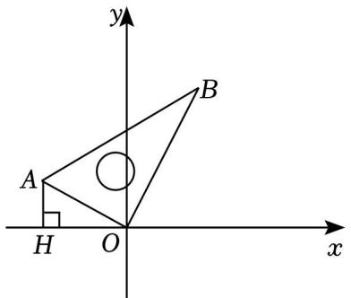

text_image

y
A
B
H
O
x

【分析】（1）在 $\mathrm { R t } \triangle A O H$ 中， $\angle A O H = 3 0 ^ { \circ }$ °，则 $A H { = } \frac { 1 } { 2 } A O { = } 5 , \ O H { = } 1 0 \mathrm { c o s } 3 0 ^ { \circ } \ = 5 \sqrt { 3 }$ ，进而求解；

（2）用待定系数法即可求解；

（3）由 $\triangle H N O = \frac { 1 } { 2 } \times O H ^ { \bullet } \frac { \sqrt { 3 } } { 3 } O H = \frac { \sqrt { 3 } } { 6 } O H ^ { 2 } = \frac { 1 } { 2 } S _ { \triangle A B O } = 2 5 \sqrt { 3 }$ OH2 ，即可求解

【解答】解：（1）在 $\mathrm { R t } \triangle A O H$ 中， $\angle A O H = 3 0 ^ { \circ }$

则 $A H { = } \frac { 1 } { 2 } A O { = } 5 , O H { = } 1 0 \mathrm { c o s } { 3 } 0 ^ { \circ } \ = 5 \sqrt { 3 } ,$ ，

故点 A 的坐标为： $( \mathbf { \nabla } - 5 { \sqrt { 3 } } , \ 5 )$

在 $\mathrm { R t } \triangle A O B$ 中， $\angle B = 3 0 ^ { \circ }$

则 $B O { = } \sqrt { 3 } A O { = } 1 0 \sqrt { 3 }$

故答案为： $( \mathbf { \nabla } - 5 { \sqrt { 3 } } , \ 5 ) , 1 0 { \sqrt { 3 } }$ ；

（2）过点 B 作 $B T \perp x$ 轴于点 T，

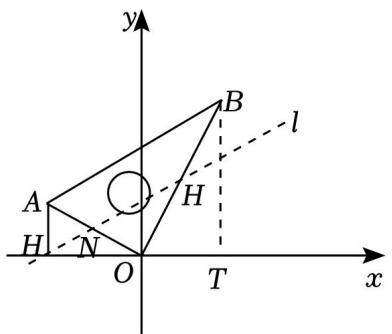

text_image

y
A
H
N
O
T
x
B
H
l

则 $\angle B O T { = } 6 0 ^ { \circ }$

则 $O T { = } \frac { 1 } { 2 } B O { = } 5 \sqrt { 3 }$ ， 同理可得： $B T { = } 1 5$ ，

即点 $B \ ( 5 { \sqrt { 3 } } , \ 1 5 )$ ），

设直线 AB 的表达式为： $y = s x + t ,$

则 $\left\{ \begin{array} { l l } { 5 = - 5 \sqrt { 3 } \mathtt { s } + \mathtt { t } } \\ { 1 5 = 5 \sqrt { 3 } \mathtt { s } + \mathtt { t } } \end{array} \right. ,$

解得： $\left\{ \begin{array} { l } { { \tt s } = \displaystyle \frac { \sqrt { 3 } } { 3 } , } \\ { { \tt t } = 1 0 } \end{array} \right.$

故直线 AB 的表达式为： $\scriptstyle y = { \frac { \sqrt { 3 } } { 3 } } x + 1 0 $

（3） $S _ { \triangle } A B O = \frac { 1 } { 2 } \times A O ^ { \bullet } B O = \frac { 1 } { 2 } \times 1 0 \times 1 0 \sqrt { 3 } = 5 0 \sqrt { 3 } ,$

设直线 $l \colon y { = } m x { + } n$ 交 OB 于点 H，交 OA 于点 N，

由 O、B 坐标得，直线 OB 的表达式为： $\scriptstyle { y = { \sqrt { 3 } } x }$

设点 $\boldsymbol { H } ~ ( \boldsymbol { r } , ~ \sqrt { 3 } \boldsymbol { r } )$

在 $\mathrm { R t } \triangle O H N$ 中， $\angle H N O = \angle B A O = 6 0 ^ { \circ }$ ，则 $O N { = } \frac { \sqrt { 3 } } { 3 } O H$

当直线 l 平分三角形 AOB 面积时，

则 $\triangle H N O = \frac { 1 } { 2 } \times O H ^ { \bullet } \frac { \sqrt { 3 } } { 3 } O H = \frac { \sqrt { 3 } } { 6 } O H ^ { 2 } = \frac { 1 } { 2 } S _ { \triangle A B O } = 2 5 \sqrt { 3 } ,$

解得： $O H 2 = 1 5 0$ ，

即 $r ^ { 2 } + \ ( \sqrt { 3 } r ) \ ^ { 2 } = 1 5 0 .$

解得： $r { = } \frac { 5 \sqrt { 6 } } { 2 }$ ，

则点 H 的坐标为： $( { \frac { 5 { \sqrt { 6 } } } { 2 } } , { \frac { 1 5 { \sqrt { 2 } } } { 2 } } )$ ），

则直线 l 的表达式为： $\scriptstyle \gamma = { \frac { \sqrt { 3 } } { 3 } } ( x - { \frac { 5 { \sqrt { 6 } } } { 2 } } ) + { \frac { 1 5 { \sqrt { 2 } } } { 2 } } = { \frac { \sqrt { 3 } } { 3 } } x + 5 { \sqrt { 2 } }$

6．如图，在平面直角坐标系中，直线 $y = 2 x + 8$ 与 x 轴交于点 A，与 y 轴交于点 B，过点 B 的直线交 x 轴于点 C，且点 C（4，0）．

（1）求直线 BC 的解析式；

（2）将直线 BC 向下平移 3个单位长度得到直线 L，此时直线 L 交于 AB 于点 D，交 x 轴于点 E，并且 D的横坐标为 $- \frac { 3 } { 4 }$ 请求出 $\triangle A D E$ 的面积；

（3）点 P 为线段 AB 上一点，点 Q 为线段 BC 延长线上一点，且 AP＝CQ，PQ 交 x 轴于 N，设点 Q 横坐标为 m，△PBQ 的面积为 S，求 S 与 m 的函数关系式（不要求写出自变量 m 的取值范

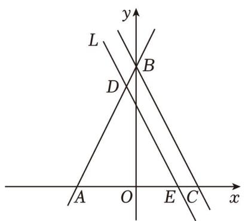

text_image

y
L
B
D
A O E C x

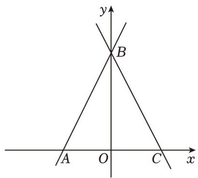

text_image

y
B
A O C x

围）．

备用图

【分析】（1）先求出点 A，点 B 坐标，由等腰三角形的性质可求点 C 坐标，由待定系数法可求 BC 的解析式；

（2）由直线的平移可得直线 DE 的解析式，进而可得点 D，E 的坐标，根据三角形的面积公式可得结论

（3）过点 P 作 PG⊥AC，PE∥BC 交 AC 于 E，过点 Q 作 $H Q \bot A C ,$ ，由 $^ { 6 6 } A A S ^ { 9 }$ 可证 $\triangle A G P { \cong } \triangle C H Q$ ，可得 $\scriptstyle A G = H C = m \ - \ 4 , \ P G = H Q = 2 m \ - \ 8$ ，由 $^ { 6 6 } A A \boldsymbol { S } ^ { \prime \prime }$ 可证 $\triangle P E F { \cong } \triangle Q C F .$ ，可得 $S _ { \triangle } P E F { = } S _ { \triangle } Q C F$ ，即可求解．

【解答】解：（1）∵直线 $y = 2 x + 8$ 与 x 轴交于点 A，与 y 轴交于点 B，

∴点 B（0，8），点 A（﹣4，0）

设直线 BC 解析式为： $y = k x + b$ ，

由题意可得： $b = 8$

解得： $\left\{ \begin{array} { l l } { \mathbf { k } = - 2 } \\ { \mathbf { b } = 8 } \end{array} \right.$

∴直线 BC 解析式为： $y = - ~ 2 x + 8$ ；

（2）将直线 BC 向下平移 3 个单位长度得到直线 L，

$$
\therefore L: y = - 2 x + 5,
$$

令 $y = 0$ ，则 $x { = } 2 . 5$ ，

∴E（2.5，0），

∵点 D 的横坐标为 $- \frac { 3 } { 4 }$ ，

$$
\therefore D \left(- \frac {3}{4}, \frac {1 3}{2}\right),
$$

$$
\begin{array}{l} \therefore S _ {\triangle A D E} = \frac {1}{2} \times (x _ {E} - x _ {A}) \times y _ {D} \\ = \frac {1}{2} \times (\frac {5}{2} + 4) \times \frac {1 3}{2} \\ = \frac {1 6 9}{8}; \\ \end{array}
$$

（3）如图，过点 P 作 PG⊥AC，PE∥BC 交 AC 于 E，过点 Q 作 HQ⊥AC，

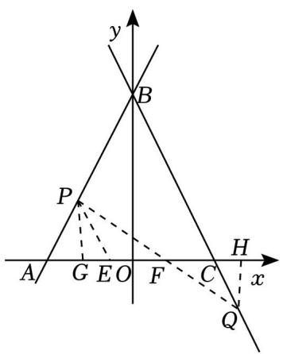

text_image

y
B
P
A G E O F C H x
Q

$$
\because A B = C B,
$$

$$
\therefore \angle B A C = \angle B C A,
$$

∵点 Q 横坐标为 m，

$$
\therefore \text {   点   } Q (m, - 2 m + 8)
$$

$$
\therefore H Q = 2 m - 8, \quad C H = m - 4,
$$

$$
\because A P = C Q, \angle B A C = \angle B C A = \angle Q C H, \angle A G P = \angle Q H C = 9 0 ^ {\circ},
$$

$$
\therefore \triangle A G P \cong \triangle C H Q (A A S),
$$

$$
\therefore A G = H C = m - 4, P G = H Q = 2 m - 8,
$$

$$
\because P E \parallel B C,
$$

$$
\therefore \angle P E A = \angle A C B, \angle E P F = \angle C Q F,
$$

$$
\therefore \angle P E A = \angle P A E,
$$

$\therefore A P { = } P E .$ ，且 $A P { = } C Q$ ，

$$
\therefore P E = C Q, \text {且} \angle E P F = \angle C Q F, \angle P F E = \angle C F Q,
$$

$$
\therefore \triangle P E F \cong \triangle Q C F (A A S)
$$

$$
\therefore S _ {\triangle P E F} = S _ {\triangle Q C F},
$$

∴△PBQ 的面积＝四边形 BCFP 的面积 ${ } _ { + \triangle C F Q }$ 的面积＝四边形 BCFP 的面积 $\mathop { : + } \triangle P E F$ 的面积＝四边形PECB 的面积，

$$
\therefore S = S _ {\triangle A B C} - S _ {\triangle P A E} = \frac {1}{2} \times 8 \times 8 - \frac {1}{2} \times (2 m - 8) \times (2 m - 8) = 1 6 m - 2 m ^ {2}.
$$

## 类型二：一次函数与图形的对称

7．已知一次函数 $y = k x + b ( k \neq 0 )$ 的图象过点（0，2）

（1）若函数图象还经过点（﹣1，﹣4），求这个函数的表达式；  
（2）若点 $M \ ( 2 m , \ m { + } 3 )$ 关于 x 轴的对称点恰好落在该函数的图象上，求 m 的值

【分析】（1）用待定系数法即可解决问题

（2）先用 m 表示出点 M 关于 x轴的对称点的坐标，再代入一次函数解析式即可

【解答】解：（1）由题知，

因为点（0，2）和点 $( \mathbf { \partial } - 1 , \mathbf { \partial } - 4 )$ 在一次函数的图象上，

所以 $b = 2$

解得 $\left\{ \begin{array} { l } { \mathbf { k } = 6 } \\ { \mathbf { b } = 2 } \end{array} \right.$

所以这个函数的表达式为 $y = 6 x + 2$

（2）点 M 关于 x 轴的对称点的坐标为 $( 2 m , \textrm { ~ - } m - 3 )$ ），

又因为该对称点在一次函数的图象上，

所以 $\mathit { \Pi } - \mathit { m } - 3 = 1 2 \mathit { m } + 2$ ，

解得 $m = - \frac { 5 } { 1 3 }$

故 m 的值为 $- { \frac { 5 } { 1 3 } }$

8．如图，直线 $l : ~ y = \frac { 3 } { 4 } x + 3$ 3 交 x、y 轴分别为 A、B 两点，C 点与 A 点关于 y 轴对称．动点 P、Q 分别在线段 AC、AB 上（点 P 不与点 A、C 重合），满足 $\angle B P Q = \angle B A O$

（1）点 A 坐标是 $( \ - \ 4 , \ 0 )$ ，点 B 的坐标 （0，3） ， $B C = \underline { { 5 } }$  
（2）当点 P 在什么位置时， $\triangle A P Q { \cong } \triangle C B P$ ，说明理由  
（3）当 $\triangle P Q B$ 为等腰三角形时，求点 P 的坐标

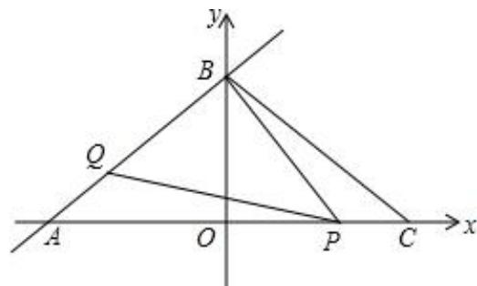

text_image

y
B
Q
A O P C x

【分析】（1）对于直线 l 解析式，分别令 x 与 y 为 0 求出 y 与 x 的值，确定出 A 与 B 的坐标，根据 A 与C 关于 y轴对称确定出 C 坐标，利用勾股定理求出 BC 的长即可；

（2）由三角形 $A P Q$ 与三角形 $C B P$ 全等，利用全等三角形对应边相等得到 $P Q { = } B C { = } 5$ ，由 $A P - O A =$ OP，求出 OP 的长，确定出 P 坐标即可；

（3）分三种情况考虑：当 $P Q { = } P B$ 时，由（2）确定出此时 P 的坐标；当 $B Q { = } B P$ 时，利用外角性质判断不可能；当 $B Q { = } P Q$ 时，求出此时 P 的坐标即可

【解答】解：（1）对于直线 $l \colon \ y = \frac { 3 } { 4 } x + 3$

令 $x { = } 0$ ，得到 $y = 3 ;$ ；令 $y = 0$ ，得到 $x = - 4$

∴A（﹣4，0），B（0，3），即 $O B = 3$ ，

$\because A$ 与 C 关于 y轴对称，

$\therefore C \ ( 4 , \ 0 )$ ，即 $O C { = } 4$ ，

则根据勾股定理得： $B C = \sqrt { 3 ^ { 2 } + 4 ^ { 2 } } = 5 ,$ ；

故答案为： $( ~ - ~ 4 , ~ 0 ) ; ~ ( 0 , ~ 3 ) ; ~ 5 ;$ ；

（2）由 $\triangle A P Q { \cong } \triangle C B P$ ，得到 $A P { = } B C { = } 5$ ，

$\because A ( - 4 , 0 )$ ，即 $O A { = } 4$ ，

$\therefore O P = 5 - 4 = 1$ ，即 $P ~ ( 1 , ~ 0 ) { : }$ ；

（3）（i）当 $P Q { = } P B$ 时， $\triangle A P Q { \cong } \triangle C B P$ ，

由（2）知此时点 $\textit { P } \left( \begin{array} { l l } { 1 , } & { 0 } \right) \end{array}$ ；

（ii）当 $B Q { = } B P$ 时， $\angle B Q P { = } \angle B P Q$ ，

$\because \angle B Q P$ 是 $\triangle A P Q$ 的外角，

$$
\therefore \angle B Q P > \angle B A P,
$$

又 $\because \angle B P Q = \angle B A O$

∴这种情况不可能；

（iii）当 $B Q { = } P Q$ 时， $\angle Q B P { = } \angle Q P B$ ，

又 $\because \angle B P Q = \angle B A O$ ，

$$
\therefore \angle Q B P = \angle B A O,
$$

$$
\therefore A P = 4 + x, B P = \sqrt {\mathrm{x} ^ {2} + 3 ^ {2}},
$$

$$
\therefore 4 + x = \sqrt {x ^ {2} + 9},
$$

解得： $x = - \frac { 7 } { 8 }$

此时点 P 的坐标为： $( - \frac { 7 } { 8 } , 0 )$ ）

综上，P 的坐标为（1，0）， $( - \frac { 7 } { 8 } , 0 )$

10．如图，已知直线 $l \colon y { = } 2 x { + } 4$ 交 x 轴于点 A，交 y 轴于点 B

（1）直线 l 向右平移 2 个单位长度得到的直线 $l _ { 1 }$ 的表达式为 $\underline { { \boldsymbol { y } } } \equiv 2 \boldsymbol { x }$ ；  
（2）直线 l 关于 $y = - \boldsymbol { x }$ 对称的直线 l2的表达式为 $\scriptstyle \frac { y = \frac { 1 } { 2 } \underline { { x } } + 2 }$  
（3）点 P 在直线 l 上，若 $S _ { \triangle { O A P } } { = } 2 S _ { \triangle { O B P } }$ ，求 P 点坐标

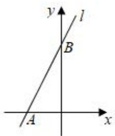

text_image

y
l
B
A
x

【分析】（1）利用平移的性质即可得出结论；

（2）先得到原直线上的两个点的坐标，进而得到这两点关于 $y = - \ x$ 对称的点的坐标，代入直线解析式求解即可；  
（3）设 P 的坐标为 $( x , \ 2 x { + } 4 )$ ），由 $S _ { \triangle { O A P } } { = } 2 S _ { \triangle { O B P } }$ ，得到 $\frac { 1 } { 2 } O A \bullet | 2 x + 4 | = 2 \times \frac { 1 } { 2 } O B \bullet | x |$ 1 ，即 $| 2 x + 4 | = 4 | x |$ ，解得 $x = - \frac { 2 } { 3 }$ 或 2，即可求得 P 的坐标．

【解答】解：（1）直线 $l \colon y { = } 2 x { + } 4$ 向右平移 2 个单位得到的直线 l2的解析式为： $y = 2 ( x - 2 ) + 4$ ，即 y$= 2 x$ ，

故答案为 $y = 2 x ;$

（2）∵（0，4），（﹣2，0）在直线 $l \colon y { = } 2 x { + } 4$ 上，

这两点关于 $y = - \ x$ 的对称点为（﹣4，0），（0，2），

设直线 l1的解析式为 $y = k x + b$ ，

$\therefore \{ \frac { - 4 k + b } { b } = 0$ ， 解得 $\left\{ k = \frac { 1 } { 2 } \right.$ ，

∴直线 l1的解析式为： $y = \frac { 1 } { 2 } x + 2$ ，

故答案为 $y = \frac { 1 } { 2 } x + 2$ ；

（3）∵直线 $l \colon y { = } 2 x { + } 4$ 交 x 轴于 A，交 y 轴于 B

$$
\therefore A (- 2, 0), B (0, 4),
$$

$$
\therefore O A = 2, \quad O B = 4,
$$

设 P 的坐标为 $( x , \ 2 x { + } 4 )$ ），

$$
\because S _ {\triangle O A P} = 2 S _ {\triangle O B P},
$$

$\therefore \frac { 1 } { 2 } O A \bullet \vert 2 x + 4 \vert = 2 \times \frac { 1 } { 2 } O B \bullet \vert x \vert$ ，即 $| 2 x + 4 | = 4 | x |$ ，

解得 $x = - \frac { 2 } { 3 }$ 或 2，

$\therefore P ( - \frac { 2 } { 3 } , \frac { 8 } { 3 } )$ 或（2，8）

11．如图，在平面直角坐标系中，点 A、点 B 分别在 x 轴与 y 轴上，直线 AB 的解析式为 $\mathbf { y } = \frac { 3 } { 4 } \mathbf { x } + 3$ ，以线段 AB、BC 为边作平行四边形 ABCD

（1）如图 1，若点 C 的坐标为（3，7），判断四边形 ABCD 的形状，并说明理由；

（2）如图 2，在（1）的条件下，P 为 CD 边上的动点，点 C 关于直线 BP 的对称点是 Q，连接 PQ，BQ①当 $\angle C B P = 3 0 ^ { \circ }$ °时，点 Q 位于线段 AD 的垂直平分线上；

②连接 $A Q , \ D Q$ ，设 $C P { = } x$ ，设 PQ 的延长线交 AD 边于点 E，当 $\angle A Q D = 9 0 ^ { \circ }$ 时，求证： $Q E { = } D E$ ，并求出此时 x 的值

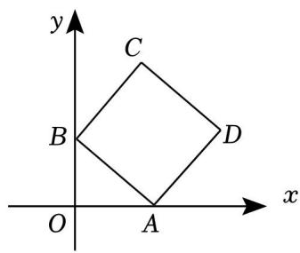

text_image

y
C
B
D
O
A
x

图1

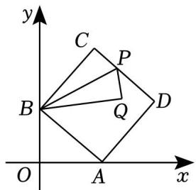

text_image

y
C
P
B
Q
D
O
A
x

图2

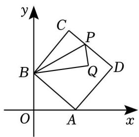

text_image

y
C
P
B
Q
D
O
A
x

备用图

【分析】（1）过 C 作 CH⊥y 轴于 H，在 $y = - \frac { 3 } { 4 } x + 3$ 中，可得 A（4，0），B（0，3），即有 $O A = 4$ ，OB$= 3 , A B { = } 5$ ，而 C（3，7），故 $O B { = } C H { = } 3$ ， $O A { = } B H { = } 4$ ，可证 $\triangle A O B { \cong } \triangle B H C$ （SAS），得 $A B { = } B C$ ，$\angle A B O = \angle B C H$ ，从而可得 $\angle A B C = 9 0 ^ { \circ }$ ，根据四边形 ABCD 是平行四边形，且 $\scriptstyle A B = B C , \angle A B C = 9 0 ^ { \circ }$ °，即知四边形 ABCD 是正方形；

（2）①过 Q 作 $Q K \bot A D$ 于 K，连接 CQ，由 Q 在 AD 的垂直平分线上，可得 $B Q { = } C Q$ ，而 C 关于直线$B P$ 的对称点是 Q，有 $B C { = } B Q$ ，故△BCQ 是等边三角形， $\angle C B Q = 6 0 ^ { \circ }$ ，即可得 $\angle C B P = \angle Q B P = \frac { 1 } { 2 } \angle$ $C B Q { = } 3 0 { ^ \circ }$ ；

②由 $\angle A Q D = 9 0 ^ { \circ }$ °，C 关于直线 BP 的对称点是 Q，四边形 ABCD 是正方形，可得 $\angle D Q E = \angle B Q A$ ，∠$Q D E { = } \angle B A Q$ ，而 $A B { = } B Q$ ，有 $\angle B Q A = \angle B A Q$ ，故 $\angle D Q E { = } \angle Q D E$ ，即得 $Q E { = } D E$ ，从而可得 $D E { = } Q E$ $= _ { A E } = \frac { 5 } { 2 }$ ， 设 $C P { = } P Q { = } x$ ，在 $\mathrm { R t } \triangle P D E$ 中有 $( 5 - x ) ^ { 2 } + ( \frac { 5 } { 2 } ) ^ { 2 } = ( x + \frac { 5 } { 2 } ) ^ { 2 }$ ，从而可解得 x 的值是 $\frac { 5 } { 3 }$

【解答】解：（1）四边形 ABCD 是正方形，理由如下：

过 C 作 $C H \bot y$ 轴于 H，如图：

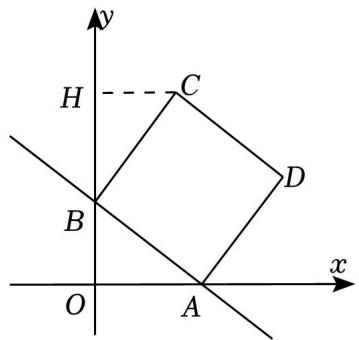

text_image

y
H
C
B
D
O
A
x

在 $y = - \frac { 3 } { 4 } x + 3$ 中，令 $x { = } 0$ 得 $y = 3$ ，令 $y = 0$ 得 $x { = } 4$ ，

∴A（4，0），B（0，3），

$$
\therefore O A = 4, O B = 3, A B = \sqrt {4 ^ {2} + 3 ^ {2}} = 5,
$$

$$
\because C (3, 7),
$$

$$
\therefore B H = O H - B O = 4, \quad C H = 3,
$$

$$
\therefore O B = C H = 3, \quad O A = B H = 4,
$$

在△AOB 和△BHC 中，

$$
\left\{ \begin{array}{l} O B = C H \\ \angle A O B = \angle B H C, \\ O A = B H \end{array} \right.
$$

$$
\therefore \triangle A O B \cong \triangle B H C (S A S),
$$

$$
\therefore A B = B C, \angle A B O = \angle B C H,
$$

$$
\because \angle B C H + \angle H B C = 9 0 ^ {\circ},
$$

$$
\therefore \angle A B O + \angle H B C = 9 0 ^ {\circ},
$$

$$
\therefore \angle A B C = 9 0 ^ {\circ},
$$

∵四边形 ABCD 是平行四边形，且 $\scriptstyle A B = B C , \angle A B C = 9 0 ^ { \circ }$

∴四边形 ABCD 是正方形；

（2）①过 Q 作 QK⊥AD 于 K，连接 CQ，如图：

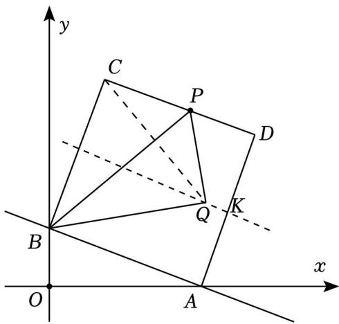

text_image

y
C
P
D
Q
K
B
O
A
x

∵Q 在 AD 的垂直平分线上，

∴直线 QK 是正方形 ABCD 的对称轴，

∴QK 是 BC 的垂直平分线，

$$
\therefore B Q = C Q,
$$

∵C 关于直线 BP 的对称点是 Q，

$$
\therefore B C = B Q,
$$

$$
\therefore B C = B Q = C Q,
$$

$\therefore \triangle B C Q$ 是等边三角形，

$$
\therefore \angle C B Q = 6 0 ^ {\circ},
$$

∵C 关于直线 BP 的对称点是 Q，

$$
\therefore \angle C B P = \angle Q B P = \frac {1}{2} \angle C B Q = 3 0 ^ {\circ},
$$

故答案为：30；

②如图：

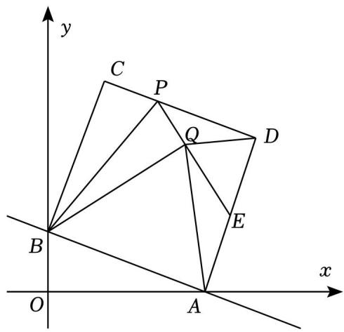

text_image

y
C P
Q D
B E
x
O A

$$
\because \angle A Q D = 9 0 ^ {\circ},
$$

$$
\therefore \angle D Q E + \angle E Q A = 9 0 ^ {\circ}, \angle Q D E + \angle D A Q = 9 0 ^ {\circ},
$$

∵C 关于直线 BP 的对称点是 Q，四边形 ABCD 是正方形，

$$
\therefore \angle B Q P = \angle C = 9 0 ^ {\circ}, \angle B A D = 9 0 ^ {\circ}, A B = B C = B Q,
$$

$$
\therefore \angle B Q E = 9 0 ^ {\circ} = \angle B Q A + \angle E Q A, \angle B A Q + \angle D A Q = 9 0 ^ {\circ},
$$

$$
\therefore \angle D Q E = \angle B Q A, \angle Q D E = \angle B A Q,
$$

$$
\because A B = B Q,
$$

$$
\therefore \angle B Q A = \angle B A Q,
$$

$$
\therefore \angle D Q E = \angle Q D E,
$$

$$
\therefore Q E = D E,
$$

$$
\because \angle E Q A = 9 0 ^ {\circ} - \angle D Q E = 9 0 ^ {\circ} - \angle Q D E = \angle E A Q,
$$

$$
\therefore Q E = A E,
$$

$$
\therefore D E = Q E = A E,
$$

$$
\therefore Q E = D E = \frac {1}{2} A D = \frac {1}{2} A B = \frac {5}{2},
$$

设 $C P { = } P Q { = } x$ ，则 $P D = C D - x = 5 - x , P E = P Q + Q E = x + \frac { 5 } { 2 } ,$

在 $\mathrm { R t } \triangle P D E$ 中， $P D ^ { 2 } + D E ^ { 2 } = P E ^ { 2 }$ ，

$$
\therefore (5 - x) ^ {2} + \left(\frac {5}{2}\right) ^ {2} = (x + \frac {5}{2}) ^ {2},
$$

解得 $x = \frac { 5 } { 3 }$

$\therefore x$ 的值是 $\frac { 5 } { 3 }$

12．平面直角坐标系中，直线 AB 交 x 轴于点（a，0），交 y轴于点（0，b），a、b 满足 $b = \sqrt { a - 4 } + \sqrt { 4 - a } + 4$ 1（1）求 A、B 两点的坐标；

（2）如图 1，D 为 OA 上一点，连接 BD，过点 O 作 OE⊥BD 交 AB 于 E，若 $\angle B D O = \angle E D A$ ，求点 D的坐标；  
（3）如图 2，点 B、Q 关于 x 轴对称，M 为 x 轴上 A 点右侧一点，过点 M 作 $M N \bot B M$ 交直线 QA 于点 N，是否存在点 M．使 $S _ { \triangle A M N } { = } \frac { 3 } { 2 } S _ { \triangle A M Q }$ ，若存在，求点 M的坐标，若不存在，请说明理由．

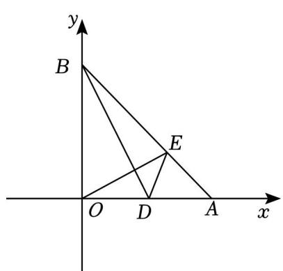

text_image

y
B
E
O D A x

图1

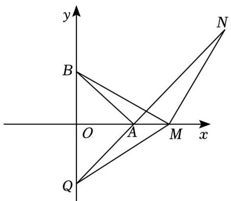

text_image

y
B
O
A
M
x
Q
N

图2

【分析】（1）由题意得： $a { \leqslant } 4$ 且 $a \geqslant 4$ ，则 $a = 4$ ，即可求解；

（2）证明 $\triangle B O G { \cong } \triangle O A E$ （ASA）和 $\triangle G O D { \cong } \triangle E A D$ （AAS），即可求解；  
（3）由 S△AMN $S _ { \triangle A M N } { = } \frac { 3 } { 2 } S _ { \triangle A M Q } .$ ，得到 $N P { = } \frac { 3 } { 2 } O Q { = } 6$ ，证明 $\triangle B O M { \cong } \triangle M N P$ （AAS），即可求解

【解答】解：（1）由题意得： $a { \leqslant } 4$ 且 $a \geqslant 4$ ，则 $a = 4$ ，

当 $a = 4$ 时， $b = \sqrt { a - 4 } + \sqrt { 4 - a } + 4 = 4$ ，

则点 A、B 的坐标分别为：（4，0）、（0，4）；

（2）如图，作 $\angle A O B$ 的角平分线交 BD 于点 G，设 BD 交 OE 于点 F，

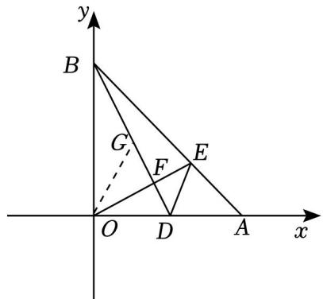

text_image

y
B
G
F
E
O
D
A
x

图1

$$
\therefore \angle B O G = \angle O A E = 4 5 ^ {\circ}, O B = O A,
$$

$$
\therefore \angle O B G = \angle A O E = 9 0 ^ {\circ} - \angle B O F,
$$

$$
\therefore \triangle B O G \cong \triangle O A E (A S A),
$$

$$
\therefore O G = A E,
$$

$$
\because \angle B D O = \angle E D A, \angle G O D = \angle E A D = 4 5 ^ {\circ}, O G = A E,
$$

$$
\therefore \triangle G O D \cong \triangle E A D (A A S),
$$

$$
\therefore D O = A D,
$$

即点 $\textit { D } \left( \begin{array} { l l } { 2 , } & { 0 } \end{array} \right)$

（3）存在，理由：

过点 N 作 $P N \bot x$ 轴于点 P，设 NQ 交 BM 于点 G，

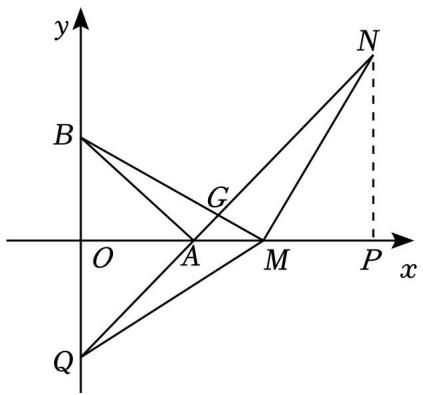

text_image

y
B
G
O
A
M
P
x
Q
N

$$
\because \angle B A N = \angle B M N = 9 0 ^ {\circ}, \angle B G A = \angle N G M,
$$

$$
\therefore \angle A B M = \angle A N M,
$$

由对称性知， $\scriptstyle \angle A B M = \angle A Q M , \ O Q = O B = 4 ,$

$$
\therefore \angle A O M = \angle A N M,
$$

$$
\therefore O M = M N = B M,
$$

当 S△AMN＝ $S _ { \triangle A M N } { = } \frac { 3 } { 2 } S _ { \triangle A M Q } ,$ S△AMQ，

则 $N P { = } { \frac { 3 } { 2 } } O Q { = } 6 ,$

$$
\because \angle B M N = 9 0 ^ {\circ},
$$

$$
\therefore \angle B M O + \angle N M P = 9 0 ^ {\circ},
$$

$$
\because \angle B M O + \angle O B M = 9 0 ^ {\circ},
$$

$$
\therefore \angle O B M = \angle N M P,
$$

$$
\therefore \triangle B O M \cong \triangle M N P (A A S),
$$

$$
\therefore O M = N P = 6,
$$

∴点 M（6，0）

## 类型三：一次函数的实际应用

13．如图，在平面直角坐标系 $x O y ^ { \prime }$ 中，直线 $l { : } y { = } - x { + } m \ { \overset { \vartriangle } { - } }$ 与x轴交于点A，点B在x轴的负半轴上，且 $O B = \frac { 1 } { 2 } O A = 2$

（1）求直线 l 的函数表达式；

（2）点 P 是直线 l 上一点，连接 BP，将线段 BP 绕点 B 顺时针旋转 $9 0 ^ { \circ }$ 得到 BQ．

（ⅰ）当点 Q 落在 y轴上时，连接 AQ，求点 P 的坐标及四边形 APBQ 的面积；

（ⅱ）作直线 BP，AQ，两条直线在第一象限内相交于点 C，记四边形 APBQ 的面积为 S1， $\triangle A B C$ 的面

$\mathsf { S } _ { 2 } = \frac { 1 } { 3 } \mathsf { S } _ { 1 }$

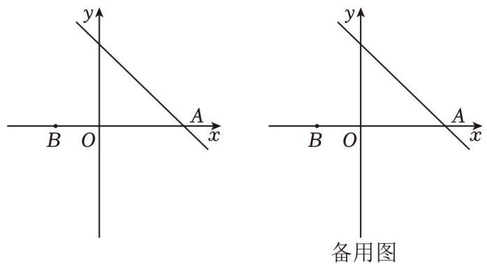

【分析】（1）由 $O B { = } \frac { 1 } { 2 } O A { = } 2$ 得 $O A { = } 4$ ，则 A（4，0），用待定系数法即可求解；

（2）（ⅰ）设 $P \ ( p , \mathrm { ~ \ } - p { + } 4 )$ ），过 P 作 $P D \perp x$ 轴于点 D，证明 $\triangle P D B \cong \triangle B O Q ( A A S )$ ），根据全等三角形的性质可得 P、Q 的坐标，即可求解；

（ⅱ）设 $\begin{array} { r l } { P _ { \mathrm { ~ } } ( n , } & { { } - n { + } 4 ) } \end{array}$ ），过 C 作 $C F \bot x$ 轴于点 F，过 P 作 $P D \perp x$ 轴于点 D，过 Q 作 $\varrho E \bot x$ 轴于点 E，证明 $\triangle P D B \cong \triangle B E Q ( A A S )$ ），根据全等三角形的性质可得 Q 的坐标，可得 $S _ { 1 } { = } \frac { 1 } { 2 } A B ^ { \bullet } ~ ( ~ - n { + } 4 ) ~ + \frac { 1 } { 2 } A B ^ { \bullet }$ $\left( n + 2 \right) = 1 8$ ，则 $S _ { 2 } { = } 6$ ，可得 $C F { = } 2$ ，利用待定系数法求出直线 AQ 为 $y = x - 4$ ，则 $C \ ( 6 , \ 2 )$ ），再利用待定系数法求出直线 BC 为 $y = \frac { 1 } { 4 } x + \frac { 1 } { 2 }$ 联立直线 $l \colon y = - x { + } 4$ 求出 $n { = } \frac { 1 4 } { 5 }$ ， 即可得点 Q 的坐标

【解答】解：（1） $\because O B = { \frac { 1 } { 2 } } O A = 2$ ，

$$
\therefore O A = 4,
$$

$$
\therefore A (4, 0),
$$

∵直线 $l \colon y = - x + m$ 与 x 轴交于点 A，

$\therefore - 4 + m = 0$ ，解得 $m { = } 4$ ，

∴直线 l 的表达式为 $y = - x + 4$ ；

（2）（ⅰ）设 $P \ ( p , \mathrm { ~ \ } - p { + } 4 )$ ），过 P 作 $P D \perp x$ 轴于点 D，

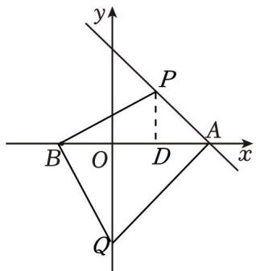

text_image

y
P
B O D A x
Q

图1

$$
\because O B = \frac {1}{2} O A = 2,
$$

∴B 点的坐标为（﹣2，0），

$$
\therefore O B = 2, A B = 6,
$$

$$
\because \angle B O Q = \angle P D B = \angle Q B P = 9 0 ^ {\circ},
$$

$$
\therefore \angle B Q O + \angle Q B O = 9 0 ^ {\circ}, \angle P B D + \angle Q B O = 9 0 ^ {\circ},
$$

$$
\therefore \angle B Q O = \angle P B D,
$$

$$
\because P B = B Q,
$$

$$
\therefore \triangle P D B \cong \triangle B O Q (A A S),
$$

$$
\therefore P D = B O = 2 = - p + 4, O Q = D B = 2 + p,
$$

$$
\therefore p = 2,
$$

∴点 P 的坐标为（2，2），点 Q 的坐标为（0，﹣4），

$$
\therefore S _ {\text {四边形} A P B Q} = S _ {\triangle A P B} + S _ {\triangle A Q B} = \frac {1}{2} \times 6 \times 2 + \frac {1}{2} \times 6 \times 4 = 1 8;
$$

（ⅱ）设 $\begin{array} { r l } { P _ { \mathrm { ~ } } ( n , } & { { } - n { + } 4 ) } \end{array}$ ），过 C 作 $C F \bot x$ 轴于点 F，过 P 作 PD⊥x 轴于点 D，过 Q 作 $\varrho E \bot x$ 轴于点 E，

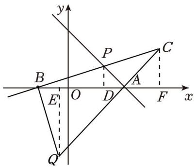

text_image

y
P
C
B
E O D A F x
Q

图2

同理得 $\triangle P D B \cong \triangle B E Q ( A A S )$ ），

$$
\therefore P D = B E = - n + 4, E Q = D B = 2 + n,
$$

$$
\therefore O E = O B - B E = 2 + n - 4 = n - 2,
$$

$$
\therefore Q (- n + 2, - n - 2),
$$

$$
\therefore S _ {1} = \frac {1}{2} A B \cdot (- n + 4) + \frac {1}{2} A B \cdot (n + 2) = \frac {1}{2} \times 6 (- n + 4) + \frac {1}{2} \times 6 (n + 2) = 1 8,
$$

$$
\therefore S _ {2} = \frac {1}{3} S _ {1} = \frac {1}{2} \times 6 \cdot C F = 6,
$$

$$
\therefore C F = 2,
$$

设直线 AQ 的解析式为 $y = k x + a$ ，

$\therefore \{ \frac { 4 k + a = 0 } { ( - n + 2 ) k + a = - n - 2 } ,$ ，解得 $\left\{ \begin{array} { l } { \mathbf { k } = 1 } \\ { \mathbf { a } = - 4 } \end{array} \right. ,$

∴直线 AQ 的解析式为 $y = x - 4$ ，

∴C（6，2），

设直线 BC 的解析式为 $y = s x + t$ ，

$\therefore \left\{ \begin{array} { l l } { 6 \leq + \tt t = 2 } \\ { - 2 \leq + \tt t = 0 } \end{array} \right.$ ，解得 $\left\{ \begin{array} { l } { \displaystyle \mathbf { s } = \frac { 1 } { 4 } } \\ { \displaystyle \mathbf { t } = \frac { 1 } { 2 } } \end{array} \right. ,$

$\therefore$ 直线 BC 的解析式为 $y = \frac { 1 } { 4 } x + \frac { 1 } { 2 }$

联立直线 $l \colon y = - x { + } 4$ 得 $y = \frac { 1 } { 4 } x + \frac { 1 } { 2 }$

解得 $\left\{ { \begin{array} { l } { \mathbf { x } = { \frac { 1 4 } { 5 } } } \\ { \mathbf { y } = { \frac { 6 } { 5 } } } \end{array} } \right. ,$

$$
\therefore P \left(\frac {1 4}{5}, \frac {6}{5}\right),
$$

$$
\therefore n = \frac {1 4}{5},
$$

∴点 Q 的坐标为 $( - \frac { 4 } { 5 } , - \frac { 2 4 } { 5 } )$

14．如图所示，在平面直角坐标系中，点 A（﹣4，3），连结 OA，将线段 OA 绕点 O 顺时针旋转 $9 0 ^ { \circ }$ 到 OB，将点 B 向左平移 5 个单位长度至点 C，连结 BC

（1）求点 B、点 C 的坐标；  
（2）将直线 BC 绕点 C 顺时针旋转 $4 5 ^ { \circ }$ ，交 x 轴于点 D，求直线 CD 的函数表达式；  
（3）现有一动点 P 从 C 出发，以每秒 2 个单位长度的速度沿射线 CD 运动，运动时间为 t 秒．请探究：当 t 等于多少时， $\triangle B C P$ 为等腰三角形

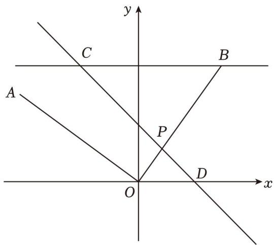

text_image

y
C
B
A
P
O
D
x

【分析】（1）过 A、B 分别做 AE、BF 垂直于 x 轴于 E，F，根据将线段 OA 绕点 O 顺时针旋转 $9 0 ^ { \circ }$ 到OB，可证 $\triangle A E O { \cong } \triangle O F B ~ ( A A S )$ ），有 $A E = O F { = } 3 , O E { = } B F { = } 4$ ，即知 B（3，4），而将点 B 向左平移 5

个单位长度至点 C，故 C（﹣2，4）；

（2）设 BC 交 y轴于 T，CD 交 y 轴于 K，由 B（3，4），BC＝5，得 $C T = B C \cdot B T = 5 \cdot 3 = 2$ ，根据将直线 BC 绕点 C 顺时针旋转 $4 5 ^ { \circ }$ ，交 x 轴于点 D，BC⊥y 轴，知△CKT 是等腰直角三角形，故 $C T { = } K T { = } 2$ ，K（0，2），再用待定系数法可得直线 CD 的解析式为 $y = - x + 2$ ；

（3）分三种情况：①当 $C B { = } C P { = } 5$ 时，2t＝5，得 t＝2.5；②当 $B C { = } B P { = } 5$ 时， $\angle B C P = \angle B P C = 4 5 ^ { \circ }$ °，知 $\angle C B P = 9 0 ^ { \circ }$ ，故 $C P = \sqrt { B C ^ { 2 } + B P ^ { 2 } } = 5 \sqrt { 2 }$ ，可得 $\scriptstyle t = { \frac { 5 { \sqrt { 2 } } } { 2 } }$ ③当 $P B { = } P C$ 时，P 在 BC 的垂直平分线上，有 $x _ { P } = \frac { 3 - 2 } { 2 } = \frac { 1 } { 2 }$ ， 在 $y = - x + 2$ 中，令 $x { = } \frac { 1 } { 2 } P ( \frac { 1 } { 2 } , \frac { 3 } { 2 } )$ ，故 $C P = \sqrt { ( - 2 - \frac { 1 } { 2 } ) ^ { 2 } + ( 4 - \frac { 3 } { 2 } ) ^ { 2 } } = \frac { 5 \sqrt { 2 } } { 2 }$ 得 $\scriptstyle t = { \frac { 5 { \sqrt { 2 } } } { 4 } }$

【解答】解：（1）过 A、B 分别做 AE、BF 垂直于 x轴于 E，F，如图：

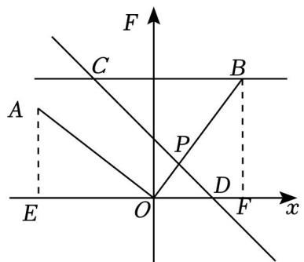

text_image

F
C
A
B
P
D
E
O
x
F

∵将线段 OA 绕点 O 顺时针旋转 $9 0 ^ { \circ }$ °到 $O B$ ，

$$
\therefore O A = O B, \angle A O B = 9 0 ^ {\circ},
$$

$$
\therefore \angle A O E = 9 0 ^ {\circ} - \angle B O F = \angle O B F,
$$

$$
\because \angle A E O = \angle B F O = 9 0 ^ {\circ},
$$

$$
\therefore \triangle A E O \cong \triangle O F B (A A S),
$$

$$
\because A (- 4, 3),
$$

$$
\therefore A E = O F = 3, \quad O E = B F = 4,
$$

$$
\therefore B (3, 4),
$$

∵将点 B 向左平移 5 个单位长度至点 C，

$$
\therefore B C = 5,
$$

$$
\therefore C (- 2, 4);
$$

（2）设 BC 交 y 轴于 T，CD 交 y 轴于 K，如图：

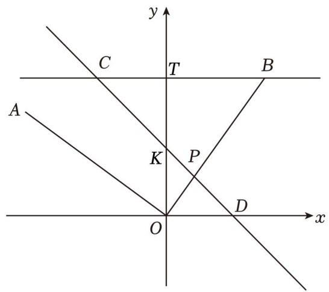

text_image

y
C
T
B
A
K
P
O
D
x

$\because B ( 3 , \ 4 ) , \ B C = 5$

∴CT＝BC﹣BT＝5﹣3＝2，

∵将直线 BC 绕点 C 顺时针旋转 $4 5 ^ { \circ }$ ，交 x 轴于点 $\begin{array} { l l } { \Delta , } & { B C \bot { y } } \end{array}$ 轴，

$\therefore \triangle C K T$ 是等腰直角三角形，

$$
\therefore C T = K T = 2,
$$

$$
\therefore O K = O T - K T = 4 - 2 = 2,
$$

∴K（0，2），

设直线 CD 的解析式为 $y = k x + b$ ，

把 C（﹣2，4），K（0，2）代入得：

$$
\left\{ \begin{array}{l} - 2 k + b = 4 \\ b = 2 \end{array} , \right.
$$

解得 $\left\{ \begin{array} { l l } { \mathbf { k } = - 1 } \\ { \mathbf { b } = 2 } \end{array} \right.$ ，

$\therefore$ 直线 CD 的解析式为 $y = - x + 2$ ；

（3）①当 $C B { = } C P { = } 5$ 时，如图：

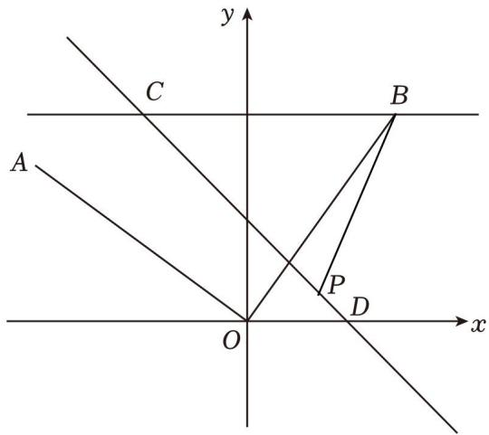

text_image

y
C
B
A
P
D
O
x

∴2t＝5，

解得 $t { = } 2 . 5 ;$

②当 $B C { = } B P { = } 5$ 时，如图：

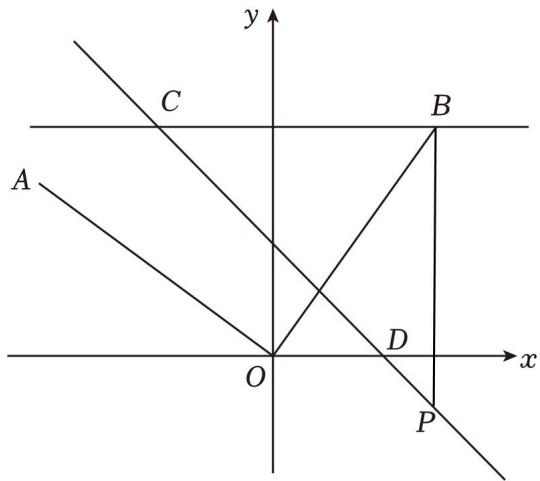

text_image

y
C
B
A
O
D
x
P

$$
\therefore \angle B C P = \angle B P C = 4 5 ^ {\circ},
$$

$$
\therefore \angle C B P = 9 0 ^ {\circ},
$$

$$
\therefore C P = \sqrt {B C ^ {2} + B P ^ {2}} = 5 \sqrt {2},
$$

$$
\therefore 2 t = 5 \sqrt {2},
$$

解得 $\scriptstyle t = { \frac { 5 { \sqrt { 2 } } } { 2 } }$

③当 $P B { = } P C$ 时，如图：

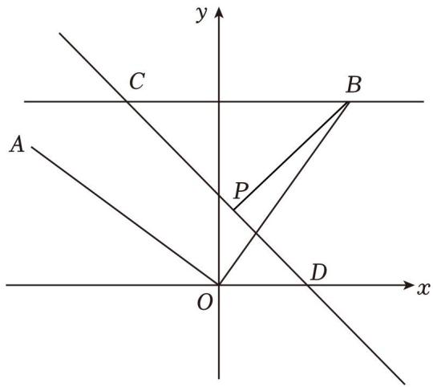

text_image

y
C
B
A
P
O
D
x

∴P 在 BC 的垂直平分线上，

$$
\because B (3, 4), C (- 2, 4),
$$

$$
\therefore x _ {P} = \frac {3 - 2}{2} = \frac {1}{2},
$$

在 $y = - x + 2$ 中， $x { = } \frac { 1 } { 2 }$ 得 y＝ $y = - \frac { 1 } { 2 } + 2 = \frac { 3 } { 2 }$ ，

$$
\therefore P \left(\frac {1}{2}, \frac {3}{2}\right),
$$

$$
\therefore C P = \sqrt {\left(- 2 - \frac {1}{2}\right) ^ {2} + \left(4 - \frac {3}{2}\right) ^ {2}} = \frac {5 \sqrt {2}}{2},
$$

$$
\therefore 2 t = \frac {5 \sqrt {2}}{2},
$$

解得 $\scriptstyle t = { \frac { 5 { \sqrt { 2 } } } { 4 } }$

综上所述，当 t 等 $\mp \frac { 5 } { 2 }$ 秒或 $\frac { 5 { \sqrt { 2 } } } { 2 }$ 秒或 $\frac { 5 { \sqrt { 2 } } } { 4 }$ 秒时，△BCP 为等腰三角形

15．如图，一次函数 $y = k x + 2$ 的图象与 x 轴和 y 轴分别交于点 A 和点 B，且 $A ~ ( ~ - ~ 1 , ~ 0 )$ ）

（1）求 k 的值；  
（2）若将一次函数 $y = k x + 2$ 的图象绕点 B 顺时针旋转 $9 0 ^ { \circ }$ ，所得的直线与 x轴交于点 C，且 $S _ { \triangle A B C } { = } 5$ 求点 C 的坐标；  
（3）在（2）的条件下，若 P 是 x 轴上任意一点，当 $\triangle P B C$ 是以 BC 为腰的等腰三角形时，请求出点 P的坐标．

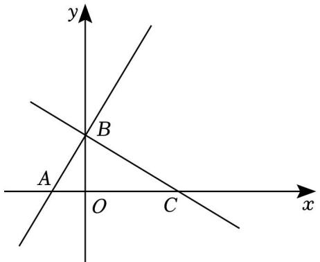

text_image

y
B
A
O
C
x

【分析】（1）把点 A 的坐标代入一次函数解析式中即可求出 k 的值；

（2）根据 $S _ { \triangle A B C } { = } 5$ ，可以求出 AC 的长，即可求得 C 的坐标；  
（3）分 $C B { = } P B , P C { = } B C$ 两种情况，分别求解即可

【解答】解：（1）∵一次函数 $y = k x + 2$ 的图象与 x 轴交于点 $\textit { A } \left( \begin{array} { l l } { - } \end{array} 1 , \begin{array} { l l } { 0 } \end{array} \right)$ ），

$$
\therefore - k + 2 = 0.
$$

$$
\therefore k = 2;
$$

（2） $\because k = 2$ ，

一次函数 $y = 2 x + 2$ ，令 $x { = } 0$ ，则 $y = 2$ ，

$$
\therefore B (0, 2),
$$

$$
\because S _ {\triangle A B C} = 5,
$$

$$
\therefore \frac {1}{2} A C \cdot O B = \frac {1}{2} A C \times 2 = 5,
$$

$$
\therefore A C = 5,
$$

$$
\because A (- 1, 0),
$$

$$
\therefore C (4, 0);
$$

（3）设点 $P \ ( x , 0 )$

由点 C、B、P 的坐标得： $B P ^ { 2 } = x ^ { 2 } + 2 ^ { 2 } , P C ^ { 2 } = \ ( x - 4 ) ^ { 2 } , C B ^ { 2 } = 4 ^ { 2 } + 2 ^ { 2 } = 2 0 .$

当 $C B { = } P B$ 时，即 $x ^ { 2 } + 2 ^ { 2 } = 2 0$ ，解得 x＝4（舍去）或﹣4，

当 $P C { = } B C$ 时， $( x - 4 ) ~ ^ { 2 } = 2 0$ ，解得 $x = 4 + 2 { \sqrt { 5 } } \equiv 5 4 - 2 { \sqrt { 5 } }$

∴点 P 的坐标为（﹣4，0）或 $( 4 + 2 { \sqrt { 5 } } , 0 )$ ）或 $( 4 - 2 { \sqrt { 5 } } , 0 )$

16．如图 1，直线 $y = \frac { 3 } { 4 } x$ $y = - \frac { 1 } { 2 } x + b$ 相交于点 A，直线 $y = - \frac { 1 } { 2 } x + b$ 与 x 轴交于点 C，点 P 在线段AC 上， $P D \perp x$ 轴于点 D，交直线 $y = \frac { 3 } { 4 } x$ 于点 Q．且 $Q P { = } O A$ ，已知 A 点的横坐标为 4

（1）求点 C 的坐标

（2）如图 2， $\angle O Q P$ 平分线交 x 轴于点 M

①求直线 QM 的解析式  
②将直线 QM 绕着点 M 旋转 $4 5 ^ { \circ }$ °，旋转后的直线与 y 轴交于点 N．直接写出点 N 的坐标

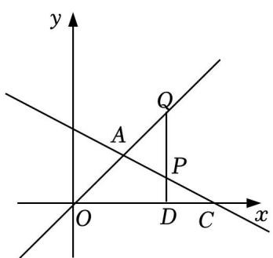

text_image

y
Q
A
P
O
D
C
x

图1

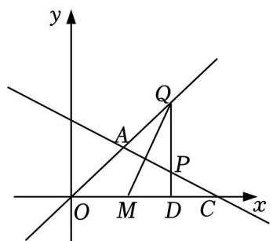

text_image

y
Q
A
P
O M D C x

图2

【分析】（1）先求点 A 的坐标，再由待定系数法确定直线的解析式为 $y = - \frac { 1 } { 2 } x + 5$ ，利用解析式求 C 点坐标即可；

（2）①设 $P ( t , - \frac { 1 } { 2 } t + 5 ) , Q ( t , \frac { 3 } { 4 } t )$ ，根据 $P Q { = } O A$ ，求出 Q（8，6），过点 M 作 $M G \bot O Q$ 交 OQ于点 G，在 Rt△OMG 中，利用勾股定理得 $O M ^ { 2 } { = } 4 ^ { 2 } + \mathrm { ~ ( ~ 8 ~ - ~ } O M ) \ ^ { \ 2 }$ ，求出 MO 即可知 M 点坐标，再求直线 QM 的解析式为 $y = 2 x - 1 0$ ；

②分 MQ 逆时针和顺时针两种情况讨论，利用等腰直角三角形的性质和三角形全等求解即可

【解答】解： $( 1 ) \because A$ 点的横坐标为 4，

∴当 x＝4 时， $y = \frac { 3 } { 4 } \times 4 = 3$

∴A（4，3），

将点（4，3）代入 $y = - \frac { 1 } { 2 } x + b , - 2 + b = 3$

解得 b＝5，

∴直线解析式为 $y = - \frac { 1 } { 2 } x + 5$ ，

当 $y = 0$ 时， $x { = } 1 0$ ，

$$
\therefore C (1 0, 0);
$$

（2）①设 $P ( t , - \frac { 1 } { 2 } t + 5 ) , Q ( t , \frac { 3 } { 4 } t )$

$$
\therefore P Q = \frac {3}{4} t + \frac {1}{2} t - 5,
$$

$$
\because A (4, 3),
$$

$$
\therefore O A = 5,
$$

$$
\therefore 5 = \frac {3}{4} t + \frac {1}{2} t - 5,
$$

解得 t＝8，

$$
\therefore Q (8, 6),
$$

$$
\therefore O Q = 1 0,
$$

如图 2，过点 M 作 $M G \bot O Q$ 交 OQ 于点 G，

$\because Q M$ 是 $\angle O Q D$ 的平分线， $M D \bot O C$ ，

$$
\therefore M G = M D,
$$

$$
\because D Q = 6, O D = 8,
$$

$$
\therefore G Q = D Q = 6,
$$

$$
\therefore O G = 4,
$$

在 $\ R t { \triangle } O M G$ 中， $O M ^ { 2 } { = } O G ^ { 2 } { + } G M ^ { 2 }$ ，即 $O M ^ { 2 } { = } 4 ^ { 2 } + \mathrm { ~ ( ~ 8 ~ - ~ } O M ) \ ^ { 2 }$

解得 $M O { = } 5$ ，

$$
\therefore M (5, 0),
$$

设直线 QM 的解析式为 $y = k x + b$ ，

$$
\therefore \left\{ \begin{array}{l} 5 k + b = 0 \\ 8 k + b = 6 \end{array} , \right.
$$

解得 $\scriptstyle { \left\{ \begin{array} { l } { \mathbf { k } = 2 } \\ { \mathbf { b } = - 1 0 } \end{array} \right. }$

∴直线 QM 的解析式为 $y = 2 x - 1 0$ ；

②当 MQ 绕 M 点逆时针旋转 $4 5 ^ { \circ }$ 时，如图 3，

过点 M 作 $H Q \bot H M ,$ ，过点 H 作 $K L \bot x$ 轴，过点 Q 作 $Q K \bot H L$ 交于 K，

$$
\because \angle H M Q = 4 5 ^ {\circ},
$$

$$
\therefore H M = H Q,
$$

$$
\because \angle K H Q + \angle L H M = 9 0 ^ {\circ},
$$

$$
\because \angle K H Q + \angle K Q H = 9 0 ^ {\circ},
$$

$$
\therefore \angle L H M = \angle K Q H,
$$

$$
\therefore \triangle K H Q \cong \triangle L M H (A A S),
$$

$$
\therefore K Q = H L, \quad K H = L M,
$$

设 $M L { = } a $ ，则 $K H { = } a$

$$
\because K L = 6,
$$

$$
\therefore H L = K Q = 6 - a,
$$

$$
\therefore 8 - (6 - a) = 5 - a,
$$

解得 $a { = } \frac { 3 } { 2 }$ ，

$$
\therefore H \left(\frac {7}{2}, \frac {9}{2}\right),
$$

设直线 HM 的解析式为 $y = k ^ { \prime } x + b ^ { \prime }$ ，

$$
\therefore \left\{ \begin{array}{l l} \frac {7}{2} k ^ {\prime} + b ^ {\prime} = \frac {9}{2}, \\ 5 k ^ {\prime} + b ^ {\prime} = 0 \end{array} \right.
$$

解得 $\left\{ { \begin{array} { l l } { \mathbf { k } ^ { \prime } } & { = - 3 } \\ { \mathbf { b } ^ { \prime } } & { = 1 5 } \end{array} } , \right.$

∴直线 HM 的解析式为 $y = - ~ 3 x + 1 5$ ，

$$
\therefore N (0, 1 5);
$$

当 $\mathcal { Q } M$ 绕 M 点顺时针旋转 $4 5 ^ { \circ }$ °时，如图 4，

过点 Q 作 $Q S \bot M S$ ，过点 S 作 $T R \perp x$ 轴交于 R，过点 Q 作 $Q T \bot T R$ 交于 T，

$$
\therefore \triangle Q T S \cong \triangle S R M (A A S),
$$

$$
\therefore Q T = S R, \quad T S = M R,
$$

设 $M R { = } m$ ，则 $S T { = } m$ ，

$$
\because T R = 6,
$$

$$
\therefore S R = Q T = 6 - m,
$$

$$
\therefore 8 + 6 - m = 5 + m,
$$

解得 $m { = } \frac { 9 } { 2 }$ ，

$$
\therefore S \left(\frac {1 9}{2}, \frac {3}{2}\right),
$$

$\therefore$ 直线 MS 的解析式为 $y = \frac { 1 } { 3 } x - \frac { 5 } { 3 }$ ，

$$
\therefore N (0, - \frac {5}{3});
$$

综上所述：N 点坐标为（0，15）或 $( 0 , - \frac { 5 } { 3 } )$

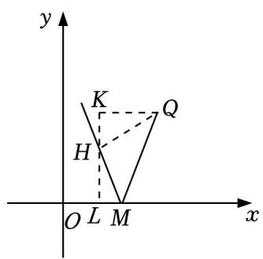

text_image

y
K
Q
H
O L M x

图3

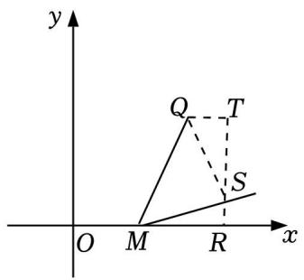

text_image

y
Q
T
S
O
M
R
x

图4

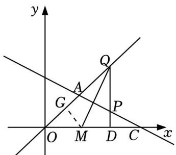

text_image

y
Q
A
G
P
O M D C x

图2

## 类型四：一次函数与三角形

17．如图，直线 $l \colon y = a x { + } 3$ 交 x 轴于点 A（6，0），将直线 l 向下平移 4 个单位长度，得到的直线分别交 x轴，y 轴于点 B，C

（1）求 a 的值及 B，C 两点的坐标；  
（2）点 M 为线段 AB 上一点，连接 CM 并延长，交直线 l 于点 N，若△AMN 是等腰三角形，求点 M 的坐标．

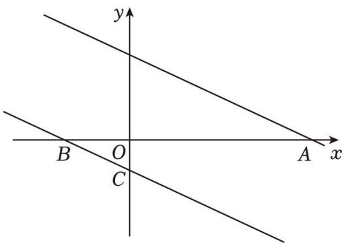

text_image

y
B O A x
C

【分析】（1）把 A 的坐标代入 $y = a x + 3$ 即可求得 $a = - \frac { 1 } { 2 }$ 然后利用平移的规律求得平移后的直线解析式，由函数解析式，令 y＝0 求 A 点坐标，x＝0 求 B 点坐标；

（2）分三种情况讨论：若 $M N { = } A N$ 时，求得 $B C { = } C M$ ，即可求得 $O B { = } O M { = } 2$ ，得到 M（2，0）；若 AM$= A N$ 时，求得 $B M = B C = \sqrt { 5 }$ ，得到 $M \ ( { \sqrt { 5 } } - 2 , \ 0 )$ ）．若 $A M { = } M N$ 时，求得 $C M { = } B M$ ，得到 $M ( - \frac { 3 } { 4 }$ 0）．

【解答】解：（1）∵直线 $l \colon \ y = a x { + } 3$ 交 x轴于点 A（6，0），

$$
\therefore 6 a + 3 = 0,
$$

解得 $a = - \frac { 1 } { 2 }$ ，

$$
\therefore y = - \frac {1}{2} x + 3,
$$

∴将直线 l 向下平移 4 个单位长度，得到的直线 $y = - \frac { 1 } { 2 } { \bf x } ^ { + 3 } - 4 = - \frac { 1 } { 2 } { \bf x } - 1$ +3﹣4＝ ，

令 $y = 0$ ，则 $- \frac { 1 } { 2 } { \bf x } - 1 = 0$ ，解得 $x = - 2$ ，

令 x＝0，则 $y = - \ 1$ ，

$$
\therefore B (- 2, 0), C (0, - 1);
$$

（2）若 $M N { = } A N$ 时，则 $\angle A M N { = } \angle M A N$ ，

$$
\because A N \parallel B C,
$$

$$
\therefore \angle M A N = \angle M B C,
$$

$$
\because \angle A M N = \angle B M C,
$$

$$
\therefore \angle M B C = \angle B M C,
$$

$$
\therefore B C = C M,
$$

$$
\because C O \perp B M,
$$

$$
\therefore O M = O B = 2,
$$

$$
\therefore M (2, 0),
$$

若 $A M { = } A N$ 时，则 $\angle A M N { = } \angle A N M$ ，

$$
\because A N \parallel B C,
$$

$$
\therefore \angle A N M = \angle B C M,
$$

$$
\because \angle A M N = \angle B M C,
$$

$$
\therefore \angle B C M = \angle B M C,
$$

$$
\therefore B C = B M,
$$

$$
\because B (- 2, 0), C (0, - 1),
$$

$$
\therefore B C = \sqrt {2 ^ {2} + 1 ^ {2}} = \sqrt {5},
$$

$$
\therefore O M = \sqrt {5} - 2,
$$

$$
\therefore M (\sqrt {5} - 2, 0),
$$

若 $A M { = } M N$ 时，则 $\angle M A N { = } \angle A N M$ ，

$$
\because A N \parallel B C,
$$

$$
\therefore \angle M A B = \angle M B C, \angle M C B = \angle M N A,
$$

$$
\therefore \angle M B C = \angle M C B,
$$

$$
\therefore C M = B M,
$$

∴ $. C M ^ { 2 } = ~ ( O B - O M ) ~ ^ { 2 } + O C ^ { 2 }$ ，即 $( 2 - O M ) \ ^ { 2 } { = } O M ^ { 2 } { + } 1 ^ { 2 }$ ，

$$
\therefore O M = \frac {3}{4},
$$

$$
\therefore M \left(- \frac {3}{4}, 0\right),
$$

综上，M 的坐标为（2，0）或 $( \sqrt { 5 } - 2 , 0 )$ ）或 $( - \frac { 3 } { 4 } , 0 )$ 0）

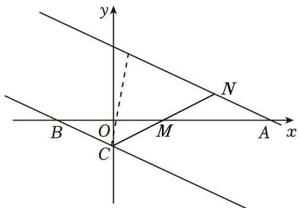

text_image

y
N
B O M A x
C

18．直线 $A B \colon y = - x + b$ 分别与 x，y轴交于 A（8、0）、B 两点，过点 B 的直线交 x轴负半轴于 C，且 OB：$O C { = } 4 \colon ~ 3$

（1）求点 B 的坐标为 （0，8） ；  
（2）求直线 BC 的解析式；  
（3）动点 M 从 C 出发沿 CA 方向运动，运动的速度为每秒 1 个单位长度．设 M 运动 t 秒时，当 t 为何值时 $\triangle B C M$ 为等腰三角形．

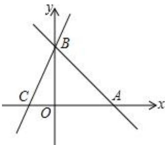

text_image

y
B
C
O
A
x

【分析】（1）根据待定系数法，可得 AB 的解析式，根据自变量的值，可得相应的函数值；

（2）根据 $O B \colon { \ O C = 4 } \colon 3$ ，可得 OC 的长，根据待定系数法，可得函数解析式；

（3）根据等腰三角形的定义，分类讨论： $M C = B C , M C = M B , B C = B M , \textcircled { 1 }$ 当 $M C { = } B C$ 时，根据路程处以速度等于时间，可得答案；②当 $M C { = } M B$ 时，根据两点间的距离，可得关于 a 的方程，根据解方程，可得 a 的值，再根据路程除以速度等于时间，可得答案； $\textcircled{3}$ 当 $B C { = } B M$ 时，根据线段垂直平分线的性质，可得 MO 的长，再根据两点间的距离，可得 MC 的长，根据路程除以速度等于时间，可得答案

【解答】解： $( 1 ) \ y = - x + b$ 分别与 x 轴交于 $A ~ ( 8 , ~ 0 )$ ），得

$- \ 8 + b = 0$ ．解得 $b { = } 8$ ，

即函数解析式为 $y = - x + 8$ ，

当 x＝0 时， $y = 8$ ，

B 点坐标是（0，8）；

（2）由 $O B \colon \ O C { = } 4 \colon \ 3 , \ B C { = } 8$ ，得

8： $B C { = } 4 \colon ~ 3$ ，解得 $B C { = } 6$ ，即 $C ~ \left( \ - \ 6 , \ 0 \right)$ ），

设直线 BC 的解析式为 $y = k x + b$ ，图象经过点 B，C，得

$$
\left\{ \begin{array}{l} {b = 8} \\ {- 6 k + b = 0} \end{array} \right., \text {解得} \left\{ \begin{array}{l} {k = \frac {4}{3},} \\ {b = 8} \end{array} \right.
$$

直线 BC 的解析式为 $y = \frac { 4 } { 3 } x + 8$ ；

（3）设 M 点坐标（a，0），由勾股定理，得 $B C = \sqrt { O B ^ { 2 } + O C ^ { 2 } } = 1 0$ ，

①当 $\scriptstyle M C = B C = 1 0$ 时，由路程处以速度等于时间，得 10÷1＝10（秒），

即 M运动 10秒， $\triangle B C M$ 为等腰三角形；

②当 $M C { = } M B$ 时， $M C ^ { 2 } { = } M B ^ { 2 }$ ，即 $\left( a + 6 \right) ^ { 2 } = a ^ { 2 } + 8 ^ { 2 }$ ，

化简，得 $1 2 a { = } 2 8$ ，

解得 $a = \frac { 7 } { 3 }$ 即 $M ~ ( \frac { 7 } { 3 } , ~ 0 )$

$$
M C = \frac {7}{3} - (- 6) = \frac {7}{3} + 6 = \frac {2 5}{3},
$$

由路程除以速度等于时间，得 $\frac { 2 5 } { 3 } \div 1 = \frac { 2 5 } { 3 }$ （秒），

即 M运 $[ 5 ] \frac { 2 5 } { 3 }$ 秒时， $\triangle B C M$ 为等腰三角形；

③当 $B C { = } B M$ 时，得 $O C { = } O M { = } 6$ ，

即 $M C { = } 6 - \mathrm { ~ ( ~ - ~ 6 ~ ) ~ } = 6 { + } 6 { = } 1 2 ,$ ，

由路程除以速度等于时间，得 $1 2 \div 1 = 1 2 ( 种 )$ ），

即 M运动 12秒时， $\triangle B C M$ 为等腰三角形，

综上所述： $t { = } 1 0$ （秒）， $t { = } \frac { 2 5 } { 3 }$ （秒），t＝12（秒）时， $\triangle B C M$ 为等腰三角形

19．如图，在平面直角坐标系中，直线 $y = x + 2$ 与 x 轴、y 轴分别交 A、B 两点，与直线 $y = - \frac { 1 } { 2 } x + b$ 相交于点 $C \ ( 2 , \ m )$ ．

（1）求 m 和 b的值；

（2）若直线 $\mathbf { y } = \frac { 1 } { 2 } \mathbf { x } + \mathbf { b }$ 与 x 轴相交于点 D，动点 P 从点 D 开始，以每秒 1个单位的速度向 x 轴负方向运动，设点 P 的运动时间为 t 秒

①若点 P 在线段 DA 上，且 $\triangle A C P$ 的面积为 10，求 t 的值；

②是否存在 t 的值，使 $\triangle A C P$ 为等腰三角形？若存在，求出 t 的值；若不存在，请说明理由【分析】（1）在 $y = x + 2$ 中，当 $x { = } 0$ 时，y＝2；当 y＝0 时，x＝﹣2；即可得出答案；求出点 C（2，4），代入直线 $y = - \frac { 1 } { 2 } x + b$ 即可得出答案；求出 D（10，0），则 $O D { = } 1 0 , \ A D { = } O A { + } O D { = } 1 2$ ；①设 $P D = t ,$ ，则 $A P { = } 1 2 \textrm { - } t ,$ ，过 C 作 $C E \bot A P$ 于 E，由三角形面积得出方程，解方程即可；

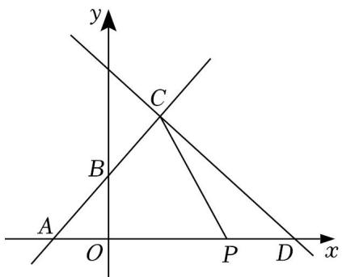

text_image

y
C
B
A
O
P
D
x

②过 C 作 $C E \bot A P$ 于 E，则 CE＝4，AE＝4，由勾股定理求出 $A C { = } 4 { \sqrt { 2 } }$ ；分三种情况：当 $A C { = } P C$ 时；当 $A P { = } A C$ 时；当 $P C { = } P A$ 时；分别求出 t 的值即可

【解答】解：（1）在 $y = x + 2$ 中，当 x＝0 时，y＝2；

当 $y = 0$ 时， $x = - 2$ ；

$$
\therefore A (- 2, 0), B (0, 2);
$$

∵点 C 在直线 $y = x + 2$ 上，

$$
\therefore m = 2 + 2 = 4,
$$

又∵点 C（2，4）也在直线 $y = - \frac { 1 } { 2 } x + b$ 上，

$$
\therefore - \frac {1}{2} \times 2 + b = 4,
$$

解得：b＝5；

（2）在 $y = - \frac { 1 } { 2 } x + 5$ 中，当 y＝0 时， $x { = } 1 0$ ，

$$
\therefore D (1 0, 0),
$$

$$
\therefore O D = 1 0,
$$

$$
\because A (- 2, 0),
$$

$$
\therefore O A = 2,
$$

$$
\therefore A D = O A + O D = 1 2;
$$

①设 $P D { = } t .$ ，则 $A P { = } 1 2 \textrm { - } t .$ ，过 C 作 $C E \bot A P$ 于 E，如图 1所示：

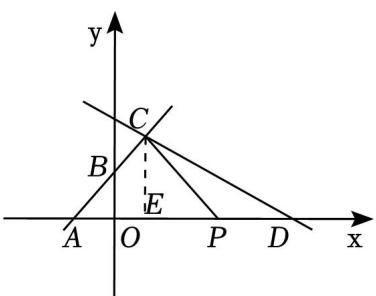

text_image

y
C
B
E
A O P D x

图1

则 $C E { = } 4$ ，

$\because \triangle A C P$ 的面积为 10，

$$
\therefore \frac {1}{2} (1 2 - t) \times 4 = 1 0,
$$

解得：t＝7；

②存在，理由如下：

过 C 作 $C E \bot A P$ 于 E，如图 1所示：

则 $C E { = } 4 , ~ O E { = } 2$ ，

$$
\therefore A E = O A + O E = 4,
$$

$$
\therefore A C = \sqrt {A E ^ {2} + C E ^ {2}} = \sqrt {4 ^ {2} + 4 ^ {2}} = 4 \sqrt {2};
$$

a、当 $A C { = } P C$ 时， $\scriptstyle A P = 2 A E = 8$ ，

$$
\therefore P D = A D - A P = 4,
$$

$$
\therefore t = 4;
$$

b、当 $A P { = } A C$ 时，如图 2所示：

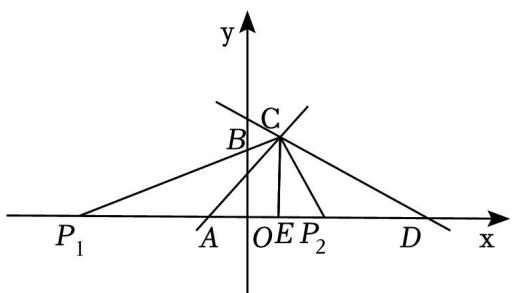

text_image

y
C
B
P₁ A O E P₂ D x

图2

则 $\scriptstyle A P _ { 1 } = A P _ { 2 } = A C = 4 { \sqrt { 2 } }$ ，

$$
\therefore D P _ {1} = 1 2 - 4 \sqrt {2}, D P _ {2} = 1 2 + 4 \sqrt {2},
$$

$\therefore t { = } 1 2 \textrm { - } 4 \sqrt { 2 }$ ，或 $t { = } 1 2 { + } 4 { \sqrt { 2 } }$

c、当 $P C { = } P A$ 时，如图 3所示：

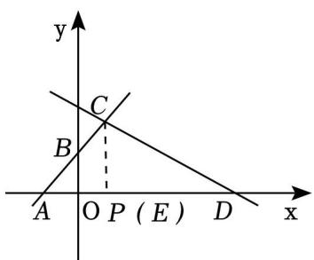

text_image

y
C
B
A O P (E) D x

图3

设 $E P { = } m$ ，则 $C P = \sqrt { { \mathrm { m } } ^ { 2 } + { \bf 4 } ^ { 2 } } , A P = m + 4$ ，

$$
\therefore \sqrt {\mathrm{m} ^ {2} + 4 ^ {2}} = m + 4,
$$

解得： $m { = } 0$ ，

∴ $P$ 与 E 重合， $A P { = } 4$ ，

$$
\therefore P D = 8,
$$

$$
\therefore t = 8;
$$

综上所述，存在 t 的值，使 $\triangle A C P$ 为等腰三角形，t 的值为 4 或 $1 2 \textrm { - } 4 \sqrt { 2 }$ 或 $1 2 { + } 4 \sqrt { 2 }$ 或 8．

20．已知直线 l1： $y = \frac { 1 } { 2 } x - 2$ 2 与 x 轴交于点 A，与 y 轴交于点 B，将直线沿 x 轴翻折，得到一个新函数的图象$l _ { 2 }$ （图 1），直线 $l _ { 2 }$ 与 y轴交于点 C

（1）求新函数的图象 $l _ { 2 }$ 的解析式；  
（2）在射线 AC 上一动点 $D \ ( x , \ y )$ ），连接 BD，试求 $\triangle B A D$ 的面积 S 关于 x 的函数解析式，并写出自变量的取值范围；  
（3）如图 2，过点 E（2，﹣6）画平行于 y 轴的直线 EF，

①求证： $\triangle A B E$ 是等腰直角三角形；  
②将直线 l1沿 $y$ 轴方向平移，当平移到恰当距离的时候，直线 $l _ { 1 }$ 与 x 轴交于点 $A 1$ ，与 y 轴交于点 $B 1$ ，在直线 EF 上是否存在点 P（纵、横坐标均为整数），使得 $\triangle A _ { 1 } B _ { 1 } P$ 是等腰直角三角形，若存在，请直接写出所有符合条件的点 P 的坐标

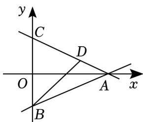

text_image

y
C
D
O
A
x
B

图1

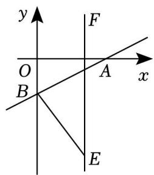

text_image

y
F
O
A
x
B
E

图2

【分析】（1）求出 A，B 的坐标，根据对称性，求出 C 点坐标，待定系数法，求出 $l _ { 2 }$ 的解析式即可；

（2）分点 D 在线段 AC 上和点 D 在线段 AC 的延长线上，两种情况进行讨论求解即可；

（3）①求出 AB，AE，BE 的长，利用勾股定理逆定理进行判断即可；

②分点 $P ,$ ，点 $B 1$ ，点 A1分别为直角顶点，三种情况进行讨论求解即可

【解答】（1）解： $\because y = \frac { 1 } { 2 } x - 2$

当 $x { = } 0$ 时， $y = - ~ 2$ ，当 $y = 0$ 时， $x { = } 4$ ，

$$
\therefore A (4, 0), B (0, - 2),
$$

∵将直线沿 x轴翻折，得到一个新函数的图象 $l _ { 2 }$ （图 1），直线 $l _ { 2 }$ 与 $y$ 轴交于点 C，

$\therefore C$ 与 B 关于 x轴对称，l2过点 A，

$$
\therefore C (0, 2),
$$

设 $l 2 \colon y = k x + 2$ ，将 A（4，0），代入得： $k = - \frac { 1 } { 2 }$ k=

$$
\therefore l _ {2}: y = - \frac {1}{2} x + 2;
$$

（2）解：∵A（4，0），B（0，﹣2），C（0，2），

$$
\therefore B C = 4, \quad O A = 4,
$$

$$
\therefore S _ {\triangle A B C} = \frac {1}{2} \times 4 \times 4 = 8,
$$

①当点 D 在线段 AC 上，如图 1.1：即： $0 { \leqslant } x { < } 4$ 时，

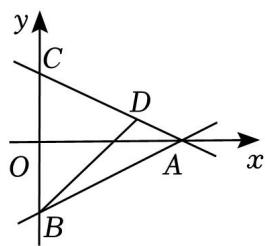

text_image

y
C
D
O
A
x
B

图1.1

$$
S = S _ {\triangle A B C} - S _ {\triangle D B C} = 8 - \frac {1}{2} \times 4 x = 8 - 2 x;
$$

②当点 D 在线段 AC 的延长线上，如图 1.2，即： $x { < } 0$ 时，

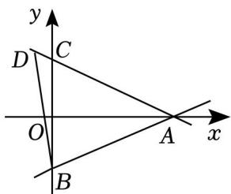

text_image

y
D C
O A x
B

图1.2

$$
S = S _ {\triangle A B C} + S _ {\triangle D B C} = 8 + \frac {1}{2} \times 4 (- x) = 8 - 2 x,
$$

综上： $S { = } 8 \textrm { - } 2 x \ ( x { < } 4 )$ ）；

（3）①证明：∵A（4，0），B（0，﹣2），E（2，﹣6），

$$
\therefore A B = \sqrt {4 ^ {2} + 2 ^ {2}} = 2 \sqrt {5}, \quad A E = \sqrt {(4 - 2) ^ {2} + 6 ^ {2}} = 2 \sqrt {1 0}, \quad B E = \sqrt {2 ^ {2} + (- 6 + 2) ^ {2}} = 2 \sqrt {5},
$$

$$
\therefore A B = B E, \quad A B ^ {2} + B E ^ {2} = 4 0 = A E ^ {2},
$$

$\therefore \triangle A B E$ 是等腰直角三角形；

②存在，理由如下：

当点 P 为直角顶点时，设 $\textit { P } \left( 2 , \textit { n } \right)$ ），如图 2：

text_image

y
F
P
O
H
x
B₁
G
E
A₁

图2

由平移的性质，设直线 $A 1 B 1$ 的解析式为 $y = \frac { 1 } { 2 } x + b$

当 $x { = } 0$ 时， $y = b ;$ ，当 $y = 0$ 时， $x = - ~ 2 b$ ，

$$
\therefore A _ {1} (- 2 b, 0), B (0, b),
$$

过点 $B _ { 1 }$ 作 $B _ { 1 } G \bot E F$ ，设 $E F$ 交 x 轴于点 H，

$\because \triangle A _ { 1 } B _ { 1 } P$ 为等腰直角三角形， $E F / / y$ 轴，

$$
\therefore \angle A _ {1} P B _ {1} = \angle B _ {1} G P = \angle P H A _ {1} = 9 0 ^ {\circ}, P B _ {1} = P A _ {1}, B _ {1} G = 2,
$$

$$
\therefore \angle B _ {1} P G = \angle P A _ {1} H = 9 0 ^ {\circ} - \angle A P H,
$$

$$
\therefore \triangle P A _ {1} H \cong \triangle B _ {1} P G (A A S),
$$

$$
\therefore P H = B _ {1} G = 2, A _ {1} H = P G,
$$

$$
\therefore | n | = 2, \quad | b - n | = | - 2 b - 2 |,
$$

∴当 $n { = } 2$ 时， $b = - 4$ 或 $b { = } 0$ ，当 $n = - 2$ 时， $b = - \frac { 4 } { 3 }$ 或 $b { = } 0$ ；

∴P（2，2）或 $P \ ( 2 , \textrm { ~ - } 2 )$

当点 $B 1$ 为直角顶点时，如图 3：

text_image

y
B₁
O
F
A₁
x
A
B
H
P

图3

过点 P 作 $P H \bot y$ 轴，则 $P H { = } 2$ ，

同上法可得： $\triangle B _ { 1 } O A _ { 1 } \cong \triangle P H B _ { 1 }$ ，

$$
\therefore O B _ {1} = P H = 2, \quad B _ {1} H = O A _ {1},
$$

∴B1（0，2）或 $B _ { 1 } ~ ( 0 , ~ - 2 )$ （舍去）；

∴直线 AB 向上平移了 4个单位，

$\therefore$ 直线 $A _ { 1 } B _ { 1 }$ 的解析式为： $y = \frac { 1 } { 2 } x + 2$ ，

$\therefore$ 当 y＝0 时， $x = - 4$ ，

$$
\therefore A _ {1} (- 4, 0),
$$

$$
\therefore B _ {1} H = O A _ {1} = 4,
$$

$$
\therefore O H = 2,
$$

$$
\therefore P (2, - 2);
$$

当点 A1为直角顶点时：此时 A1在 x轴正半轴上，B1在 y轴负半轴上，

设平移后的解析式为： $\mathbf { y } = \frac { 1 } { 2 } \mathbf { x } + \boldsymbol { \pi } .$

当 $x { = } 0$ 时， $y = m$ ，当 $y = 0$ 时， $x = - ~ 2 m$ ，

∴ $\cdot \ / A _ { 1 } ( \textrm { -- } 2 m , \ 0 ) , B ( 0 , \ m )$ ），

当 A1在 EF 的右侧时，如图 4：

text_image

F
P
y
H
O
A₁ x
B₁
E

图4

同法可得： $\triangle A _ { 1 } O B _ { 1 } \cong \triangle P H A _ { 1 }$ ，

$$
\therefore P H = O A _ {1} = - 2 m, A _ {1} H = O B _ {1} = - m,
$$

$$
\therefore O H = - 2 m - (- m) = 2,
$$

解得： $m = - ~ 2$ ，

$$
\therefore P H = O A _ {1} = 4,
$$

$$
\therefore P (2, 4);
$$

当 A1在 EF 的左侧时，如图 5：

text_image

y
O A₁ F
x
B₁ H P
E

图5

同法可得： $\triangle A _ { 1 } O B _ { 1 } \cong \triangle P H A _ { 1 }$ ，

$$
\therefore P H = O A _ {1} = - 2 m, A _ {1} H = O B _ {1} = - m,
$$

$$
\therefore O H = - 2 m - m = 2,
$$

$$
\therefore m = - \frac {2}{3},
$$

$\therefore P H = O A _ { 1 } = \frac { 4 } { 3 }$ （不合题意，舍去）；

综上：P（2，2）或 P（2，﹣2）或 P（2，4）

## 类型五：一次函数与四边形

21．如图 1，直线 $y _ { 1 } = 2 x - 2$ 与 x 轴，y 轴分别交于 A，B 两点，与直线 $y _ { 2 } { = } k x { + } 2 \ ( k { > } 0 )$ ）交于点 C，直线 y2与 y轴交于点 G．平移线段 BC，点 B，C 的对应点 D，E 分别在直线 $y _ { 2 }$ 和 y 轴上，连结 CE

（1）若 C 点横坐标为 4，求 k的值；  
（2）若 $\angle D E C = 9 0 ^ { \circ }$ ，求点 C 的坐标；  
（3）如图 2，作点 E 关于直线 CD 的对称点 F，连接 FB，FC，是否存在四边形 CFBG 是平行四边形的情况，若存在，请求出此时 k 的值；若不存在，请说明理由

text_image

y
E
C
G
D O A x
B

图1

text_image

y
E
G
D
O
A
F
B
x
Q

图2

text_image

y
E
C
G
D O A x
B

备用图

【分析】（1）先求出 C（4，6），再代入 $y _ { 2 } = k x + 2$ ，即可求得答案；

（2）根据平移的性质可得 $D E / / B C , D E { = } B C$ ，再结合 $\angle D E C = 9 0 ^ { \circ }$ °，得出四边形 BCED 是矩形，推出点 G 是 BE 的中点，也是 CD 的中点， $C D { = } B E$ ，设 $C \ ( m , \ 2 m - 2 )$ ），则 $\textit { D } ( \ - \ m , \ \ 6 \ - \ 2 m )$ ），利用勾股定理建立方程求解即可得出答案；  
（3）设 $C \ ( m , \ 2 m - 2 )$ ），代入 $y _ { 2 } = k x + 2$ ，可求得 $m = \frac { 4 } { 2 - k }$ 2- 即 $C ( \frac { 4 } { 2 - k } , \frac { 2 k + 4 } { 2 - k } )$ 利用平行四边形性质可得 $C F / / B G , C F { = } B G$ ，进而可得 $F ( \frac { 4 } { 2 - k } , \frac { 6 k - 4 } { 2 - k } )$ 运用待定系数法可得直线 EF 的解析式为 $y =$ $( 3 k - 4 ) x + 6$ ，根据轴对称性质可得 $E F \bot C D$ ，即 $k ~ ( 3 k - 4 ) = - 1$ ，即可求得答案

【解答】解：（1）在 $y _ { 1 } = 2 x - 2$ 中，令 x＝4，得 $y = 2 \times 4 - 2 { = } 6$ ，

$$
\therefore C (4, 6),
$$

把 C（4，6）代入 $y _ { 2 } = k x + 2$ ，得： $6 = 4 k + 2$ ，

$$
\therefore k = 1;
$$

（2）如图 1，连接 BD，

text_image

y
E
C
G
O
A
x
D
B

图1

∵平移线段 BC，点 B，C 的对应点 D，E，

$$
\therefore D E \parallel B C, D E = B C,
$$

∴四边形 BCED 是平行四边形，

$$
\because \angle D E C = 9 0 ^ {\circ},
$$

∴四边形 BCED 是矩形，

∴BE 与 CD 互相平分，即点 G 是 BE 的中点，也是 CD 的中点， $C D { = } B E$

$$
\because G (0, 2),
$$

$$
\therefore E (0, 6),
$$

$$
\therefore B E = 6 - (- 2) = 8,
$$

设 $C \ ( m , \ 2 m - 2 )$ ），则 $\textit { D } ( \ - \ m , \ \ 6 \ - \ 2 m )$ ），

$$
\therefore (2 m) ^ {2} + (4 m - 8) ^ {2} = 8 ^ {2},
$$

解得：m＝0（舍去）或 $m { = } \frac { 1 6 } { 5 }$

$$
\therefore C \left(\frac {1 6}{5}, \frac {2 2}{5}\right);
$$

（3）存在四边形 CFBG 是平行四边形的情况， $k { = } 1 \not \equiv \not \{ \frac { 1 } { 3 }$

在 $y _ { 1 } = 2 x - 2$ 中，令 x＝0，得 $y = - ~ 2$

$$
\therefore B (0, - 2),
$$

设 $C \ ( m , \ 2 m - 2 )$ ），代入 $y _ { 2 } = k x + 2$ ，

得： $2 m - 2 { = } k m { + } 2$ ，

$$
\therefore m = \frac {4}{2 - k},
$$

$$
\therefore C \left(\frac {4}{2 - k}, \frac {2 k + 4}{2 - k}\right),
$$

由（2）得： $ { E } ( 0 , \ 6 ) ,  { G } ( 0 , \ 2 )$ ），

如图，设 EF、CD 交于点 H，

text_image

y
E
G
D
H
C
Q
O
A
F
x
B

图2

∵四边形 CFBG 是平行四边形，

$$
\therefore C F \parallel B G, \quad C F = B G,
$$

$$
\therefore F \left(\frac {4}{2 - k}, \frac {6 k - 4}{2 - k}\right),
$$

∴直线 EF 的解析式为 $y = ~ ( 3 k - 4 ) ~ x \div 6$

∵点 E、点 F 关于直线 CD 对称，

$$
\therefore E F \perp C D,
$$

$$
\therefore k (3 k - 4) = - 1,
$$

即 $( k - 1 ) \ ( 3 k - 1 ) \ = 0 .$ ，

解得： $k _ { 1 } = 1 , k _ { 2 } = \frac { 1 } { 3 }$ ；

故存在四边形 CFBG 是平行四边形的情况， $k { = } 1 \not \equiv \not \{ \frac { 1 } { 3 }$

22．如图，已知直线 $y = - \frac { 1 } { 2 } x + 3$ 与 x 轴，y 轴分别交于点 A，B，以 AB 为直角边，∠B 为直角作等腰直角三角形 ABC（点 C 在第一象限）

（1）求点 A，B，C 坐标；  
（2）点 D 为第一象限内一点，当 A，B，C，D 四点围成的四边形为正方形时，求点 D 坐标；  
（3）点 P 为 x 轴上一动点，点 Q 为线段 AC 上一动点，是否存在四边形 BPAQ为平行四边形？若存在，求出 P，Q 点的坐标，若不存在，说明理由

text_image

y
C
B
O
A
x

【分析】（1）利用待定系数法求出 A，B 的坐标，过点 C 作 CH⊥y 轴于点 H．构造全等三角形求出点 C的坐标；

（2）利用正方形的性质，平移变换的性质求解即可；  
（3）求出直线 AC 的解析式，再利用平行四边形的性质求解即可

【解答】解：（1）对于直线 $y = - \frac { 1 } { 2 } x + 3$ ，令 $y = 0$ ，得到 $x { = } 6$ ，

$$
\therefore A (6, 0),
$$

令 $x { = } 0$ ，得到 $y = 3$ ，

$$
\therefore B (0, 3),
$$

$$
\therefore O A = 6, \quad O B = 3,
$$

过点 C 作 CH⊥y 轴于点 H

$$
\because \angle B H C = \angle C B A = \angle A O B = 9 0 ^ {\circ},
$$

$$
\therefore \angle C B H + \angle A B O = 9 0 ^ {\circ}, \angle A B O + \angle B A O = 9 0 ^ {\circ},
$$

$$
\therefore \angle C B H = \angle B A O,
$$

在△BHC 和△AOB 中，

$$
\begin{array}{l} \left\{ \begin{array}{l} \angle B H C = \angle A O B \\ \angle C B H = \angle B A O, \\ B C = A B \end{array} \right. \\ \therefore \triangle B H C \cong \triangle A O B (A A S), \\ \therefore C H = O B = 3, \quad B H = A O = 6, \\ \therefore O H = 9, \\ \therefore C (3, 9); \\ \end{array}
$$

（2）∵四边形 ABCD 是正方形，

$$
\therefore B C = A D, \quad B C \parallel A D,
$$

∵点 B 向右平移 3 个单位，向上平移 6 个单位得到点 C，

∴点 A 向右平移 3 个单位，向上平移 6 个单位得到点 D，

$$
\therefore D (9, 6);
$$

（3） $\because A ( 6 , \ 0 ) , \ C \ ( 3 , \ 9 )$ ，

设直线 AC 的解析式为 $y = k x + b$ ，则有 $\begin{array} { r } { \left\{ \begin{array} { l l } { 6 \mathbf { k } + \mathbf { b } = 0 } \\ { 3 \mathbf { k } + \mathbf { b } = 9 } \end{array} \right. , } \end{array}$

解得 $\left\{ { \begin{array} { l } { _ { \mathrm { k } } = - 3 } \\ { _ { \mathrm { b } } = 1 8 } \end{array} } \right. ,$

∴直线 AC 的解析式为 $y = - ~ 3 x + 1 8$ ，

$\because$ 四边形 $A P B Q$ 是平行四边形，

$$
\therefore B Q \parallel A P, B Q = A P,
$$

$$
\therefore Q (5, 3),
$$

$$
\therefore B Q = A P = 5,
$$

$$
\therefore P (1, 0).
$$

text_image

y
H
C
D
B
Q
O
P
A
x

23．如图 1，矩形 OABC 的边 OA、OC 分别在 x 轴、y 轴上，B 点坐标是（8，4），将 $\triangle A O C$ 沿对角线 AC翻折得 $\triangle A D C , ~ A D$ 与 $B C$ 相交于点 E

（1）求证： $\triangle C D E { \cong } \triangle A B E$ ；  
（2）求 E 点坐标；  
（3）如图 2，若将 $\triangle A D C$ 沿直线 AC 平移得 $\triangle A ^ { \prime } D ^ { \prime } C ^ { \prime }$ ′（边 $A ^ { \prime } \ C ^ { \prime }$ ′始终在直线 $A C \bot \Sigma )$ ），是否存在四边形 $D D ^ { \prime } C ^ { \prime } C$ 为菱形的情况？若存在，请直接写出点 $C ^ { \prime }$ ′的坐标；若不存在，请说明理由

text_image

y
D
C
E
B
O
A
x
图1

text_image

y
D'
D
C'
C
E
B
O
A'
A
x
图2

【分析】（1）用角角边定理即可证明；

（2）设 $C E { = } A E { = } n$ ，则 $B E { = } 8 \mathrm { ~ - ~ } n$ ，利用勾股定理即可求解；  
（3）设点 C 在水平方向上向左移动 m 个单位，则在垂直方向上向上移动 $\daleth \frac { \mathtt { m } } { 2 }$ 个单位，利用 $C C ^ { \prime } = C D$ ，即可求解

【解答】解：（1）证明：∵四边形 OABC 为矩形，

$$
\therefore A B = O C, \angle B = \angle A O C = 9 0 ^ {\circ},
$$

$$
\therefore C D = O C = A B, \angle D = \angle A O C = \angle B,
$$

又 $\angle C E D = \angle A B E , \therefore \triangle C D E \triangle A B E ( A A S )$ ，

$$
\therefore C E = A E;
$$

（2） $\because B \ ( 8 , \ 4 )$ ），即 $A B { = } 4 , B C { = } 8$

∴设 $C E { = } A E { = } n$ ，则 $B E { = } 8 \mathrm { ~ - ~ } n$

可得 $( 8 \mathrm { ~ - ~ } n ) \ ^ { 2 } + 4 ^ { 2 } = n ^ { 2 }$ ，

解得： $n { = } 5$ ，

$$
\therefore E (5, 4);
$$

（3）设点 C 在水平方向上向左移动 m 个单位，则在垂直方向上向上移动了 $\frac { \pi } { 2 }$ 个单位，

则点 $C ^ { \prime }$ ′坐标为 $( - m , 4 + \frac { 1 } { 2 } m )$ m），

则∵四边形 $D D ^ { \prime } C ^ { \prime } C$ 为菱形，

$$
\therefore C C ^ {\prime} ^ {2} = (- m) ^ {2} + \left(\frac {1}{2} m\right) ^ {2} = \frac {5}{4} m ^ {2} = C D ^ {2} = 1 6,
$$

解得： $m = \pm \frac { 8 \sqrt { 5 } } { 5 }$

故点 $C ^ { \prime }$ ′的坐标为 $( - { \frac { 8 { \sqrt { 5 } } } { 5 } } , 4 + { \frac { 4 { \sqrt { 5 } } } { 5 } } )$ 或 $( \frac { 8 \sqrt { 5 } } { 5 } , 4 - \frac { 4 \sqrt { 5 } } { 5 } )$

24．如图，在平面直角坐标系中，O 是坐标原点，点 A 的坐标是（1，3），点 P 的坐标是 $( 0 , \ b ) \ ( b { \neq } 0 )$ ）．直线 AP 交 x轴于点 B，记点 P 关于 x 轴的对称点为 $P ^ { \prime }$ ′，点 Q 为 x轴上一动点

（1）当 b＝1时，求 OB 的长；  
（2）当 $0 { < } b { < } 3$ 时，用含 b 的代数式表示 OB 的长；  
（3）是否存在四边形 $P B P ^ { \prime } \ Q$ ，使四边形 $P B P ^ { \prime } \mathcal { Q }$ 为正方形？若存在，请求出所有满足条件的 b 和点 Q的坐标；若不存在，请说明理由

text_image

y
3
A
P
B
O
Q
x
P'

【分析】（1）根据 b 的值表示出直线 $A P$ 解析式，把 A 坐标代入求出 k 的值，确定出 $A P$ 解析式，进而得出 B 坐标，确定出 OB 的长；

（2）设出 AP 解析式为 $y = k x + b$ ，把 A 坐标代入表示出 k，即可表示出 OB 的长；

（3）存在四边形 $P B P ^ { \prime } \subseteq Q ,$ ，使四边形 $P B P ^ { \prime } \bigcup$ 为正方形，若四边形 $P B P ^ { \prime } \vdash Q$ 为正方形，则有 $O B { = } O P { = }$ $O P ^ { \prime } = O Q$ ，列出关于 b的方程，求出方程的解得到 b 的值，即可确定出 Q 坐标

【解答】解：（1）由 b＝1，得到 $P ~ ( 0 , ~ 1 )$ ），

设直线 AP 解析式为 $y = k x + 1$ ，

把 A（1，3）代入得： $3 { = } k { + } 1$ ，

解得：k＝2，

$\therefore$ 直线 OP 解析式为 $y = 2 x + 1$ ，

令 $y = 0$ ，得到 $x = - \frac { 1 } { 2 }$

$\therefore B ( - \frac { 1 } { 2 } , 0 )$ ，即 $O B { = } \frac { 1 } { 2 }$

（2）根据题意得：直线 AP 解析式为 $y = k x + b$ ，

把（1，3）代入得： $3 = k { + } b$ ，即 $k { = } 3 \mathrm { ~ - ~ } b$ ，

∴直线解析式为 $y = \left( 3 - b \right) x + b$ ，

令 $y = 0$ ，得到 $x = \frac { b } { b - 3 }$ 即 $O B = - \frac { b } { b - 3 }$

（3）存在四边形 $P B P ^ { \prime } \subseteq Q $ ，使四边形 $P B P ^ { \prime } \bigcup$ 为正方形，理由为：

若四边形 $P B P ^ { \prime } \bigcup$ 为正方形，则有 $O B { = } O P { = } O P ^ { \prime } \ = O Q$ ，即 $- \frac { b } { b - 3 } = b$ ，

解得： $b = 2$ ，

则 $b { = } 2 , \ Q \ ( 2 , \ 0 )$