## 第 08 讲专题 2 一次函数与几何图形

类型一：一次函数与图形的平移

类型二：一次函数与图形的对称

类型三：一次函数与图形的旋转

类型四：一次函数与三角形

类型五：一次函数与四边形

## 类型一：一次函数与图形的平移

1．如图，点 M 的坐标为（3，4），将 OM 沿 x 轴正方向平移，使点 M 的对应点 M′落在直线 $y = \frac { 1 } { 2 } x$ 上，

点 O 的对应点为 $O ^ { \prime }$

（1）则点 $M ^ { \prime }$ 的坐标为

（2）连接 $M M ^ { \prime }$ ′，四边形 $M O O ^ { \prime } \ J$ ′的形状为

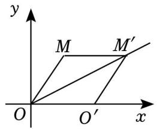

text_image

y
M M'
O O' x

2．如图，在平面直角坐标系中，直线 l1： $y = { \frac { 1 } { 2 } } x + 3$ 与 x 轴、y 轴交点分别为点 A 和点 B，直线 $l _ { 2 }$ 过点 B 且与 x轴交于点 C，将直线 $l _ { 1 }$ 向下平移 4 个单位长度得到直线 $l _ { 3 }$ ，已知直线 $l _ { 3 }$ 刚好过点 C 且与 y 轴交于点

D．

（1）求直线 l2的解析式；

（2）求四边形 ABCD 的面积

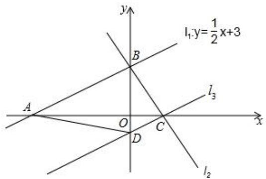

text_image

y
l₁,y=\frac{1}{2}x+3
A
O
C
D
x
l₃
l₂

## 3．综合应用

如图 1，直线 $l _ { 1 } \colon \ y = 2 x \cdot 3$ 与 x 轴交于点 B，直线 l2与 x 轴交于点 $\mathsf { C } ( \frac { 3 } { 2 } , \mathsf { 0 } )$ ，l1、l2 交于 y 轴上一点 A．

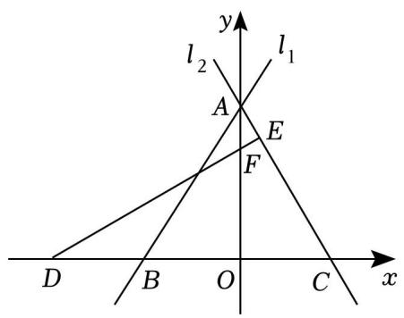

text_image

y
l₂
l₁
A
E
F
D
B
O
C
x

图1

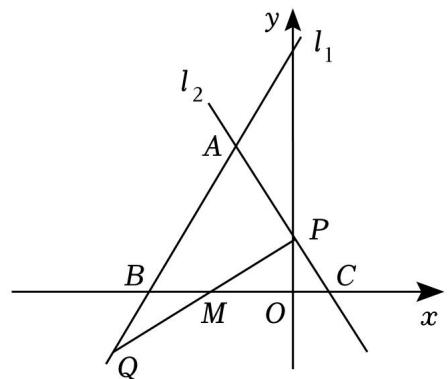

text_image

l₁
y
l₂
A
P
B
M
O
C
x
Q

图2

（1）特征探究：求直线 l2的表达式；  
（2）坐标探究：过 x 轴上一点 $D \ ( \ - \ 3 , \ 0 )$ ），作 $D E \bot A C$ 于点 E，交 y 轴于点 F，求 E 点坐标；  
$( 0 < \pi < \frac { 3 } { 2 } )$ 得到图 2，AC 与 y轴交于点 P（点 P不与 A 点和 C 点重合），在 AB 的延长线上取一点 Q，使 $B Q { = } C P$ ，连接 PQ 交 x 轴于 M 点．请探究△ABC向左平移的过程中，线段 MO 的长度的变化情况？

4．如图，在直角坐标系中，一次函数的图象 l1与 y 轴交于点 A（0，2），与 x

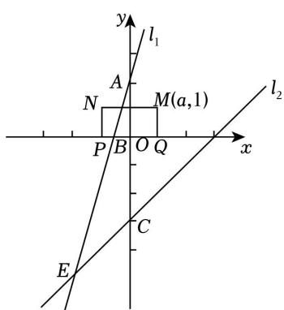

text_image

y
l₁
A
N
M(a,1)
P B O Q x
l₂
C
E

轴交于点 $B ( - \frac { 4 } { 7 } , 0 )$ 4 ，与一次函数 $y = x - 3$ 的图象 l2交于点 E．

（1）求 $l _ { 1 }$ 的函数表达式；

（2）直线 l2与 y 轴交于点 C，求 $\triangle A E C$ 的面积；

（3）如图，已知长方形 MNPQ，PQ＝2，NP＝1，M（a，1），矩形 MNPQ 的边 PQ 在 x 轴上平移，若矩形 $M N P Q$ 与直线 $l _ { 1 }$ 或 $l _ { 2 }$ 有交点，直接写出 a 的取值范围

5．如图，直角三角板 AOB 如图所示在平面直角坐标系内， $\angle B = 3 0 ^ { \circ }$ °，O 为坐标原点，作 $A H \bot x$ 轴，AO＝10，若 $\angle A O H = 3 0 ^ { \circ }$ °

（1）点 A 的坐标为 ；OB＝

（2）求边 AB 所在直线的表达式；

（3）直线 $y = m x + n$ 自与直线 AB 重合的位置向下平移，当其平分三角形 AOB 面积时，直接写出直线 $y = m x + n$ 的表达式

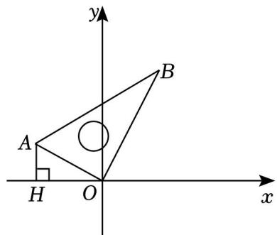

text_image

y
A
B
H
O
x

6．如图，在平面直角坐标系中，直线 $y = 2 x + 8$ 与 x 轴交于点 A，与 $y$ 轴交于点 B，过点 B 的直线交 x 轴于点 C，且点 C（4，0）

（1）求直线 BC 的解析式；  
（2）将直线 BC 向下平移 3个单位长度得到直线 L，此时直线 L 交于 AB 于点 D，交 x 轴于点 E，并且 D的横坐标为 $- \frac { 3 } { 4 }$ 请求出 $\triangle A D E$ 的面积；  
（3）点 P 为线段 AB 上一点，点 Q 为线段 BC 延长线上一点，且 $A P { = } C Q$ ，PQ 交 x 轴于 N，设点 Q 横坐标为 m， $\triangle P B Q$ 的面积为 S，求 S 与 m 的函数关系式（不要求写出自变量 m 的取值范围）

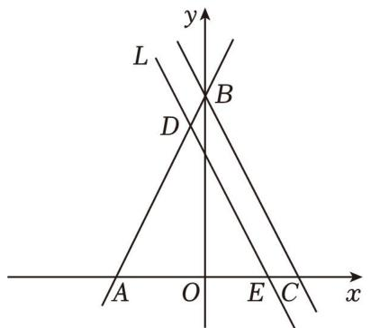

text_image

y
L
B
D
A O E C x

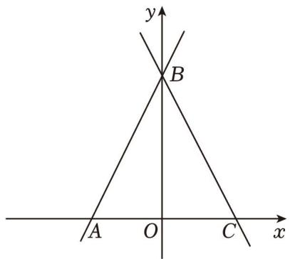

text_image

y
B
A O C x

备用图

## 类型二：一次函数与图形的对称

7．已知一次函数 $y = k x + b ( k \neq 0 )$ ）的图象过点（0，2）

（1）若函数图象还经过点（﹣1，﹣4），求这个函数的表达式；  
（2）若点 M（2m，m+3）关于 x 轴的对称点恰好落在该函数的图象上，求 m 的值

8．如图，直线 $l : ~ y = \frac { 3 } { 4 } x + 3$ 交 x、y 轴分别为 A、B 两点，C 点与 A 点关于 y 轴对称．动点 P、Q 分别在线段 AC、AB 上（点 P 不与点 A、C 重合），满足 $\angle B P Q = \angle B A O$

（1）点 A 坐标是 ，点 B 的坐标 ，BC＝  
（2）当点 P 在什么位置时， $\triangle A P Q { \cong } \triangle C B P$ ，说明理由  
（3）当 $\triangle P Q B$ 为等腰三角形时，求点 P 的坐标

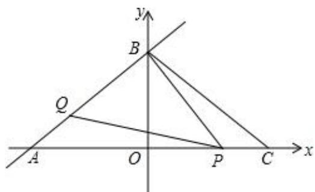

text_image

y
B
Q
A O P C x

10．如图，已知直线 l：y＝2x+4 交 x 轴于点 A，交 y 轴于点 B．

（1）直线 l 向右平移 2 个单位长度得到的直线 l1的表达式为

（2）直线 l 关于 y＝﹣x对称的直线 $l _ { 2 }$ 的表达式为  
（3）点 P 在直线 l 上，若 $S _ { \triangle O A P } { = } 2 S _ { \triangle O B P }$ ，求 P 点坐标

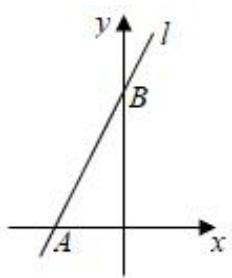

text_image

y
l
B
A
x

11．如图，在平面直角坐标系中，点 A、点 B 分别在 x 轴与 y 轴上，直线 AB 的解析式为 $\gamma = \frac { 3 } { 4 } x + 3$ ，以线段 AB、BC 为边作平行四边形 ABCD

（1）如图 1，若点 C 的坐标为（3，7），判断四边形 ABCD 的形状，并说明理由；  
（2）如图 2，在（1）的条件下，P 为 CD 边上的动点，点 C 关于直线 BP 的对称点是 Q，连接 $P Q , \ B Q$

①当 $\angle C B P = 1 8 0 ^ { \circ }$ 时，点 Q 位于线段 AD 的垂直平分线上；  
②连接 $A Q , \ D Q$ ，设 $C P { = } x$ ，设 PQ 的延长线交 AD 边于点 E，当 $\angle A Q D = 9 0 ^ { \circ }$ 时，求证： $Q E { = } D E$ ，并求出此时 x 的值

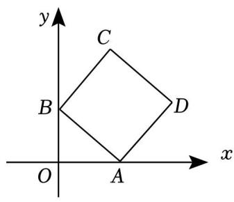

text_image

y
C
B
D
O
A
x

图1

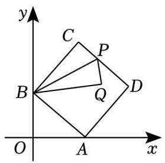

text_image

y
C
P
B
Q
D
O
A
x

图2

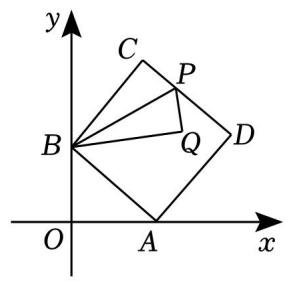

text_image

y
C
P
B
Q
D
O
A
x

备用图

12．平面直角坐标系中，直线 AB 交 x 轴于点（a，0），交 y轴于点（0，b），a、b 满足 $b = \sqrt { a - 4 } + \sqrt { 4 - a } + 4$

（1）求 A、B 两点的坐标；  
（2）如图 1，D 为 OA 上一点，连接 BD，过点 O 作 $O E \bot B D$ 交 AB 于 E，若 $\angle B D O = \angle E D A$ ，求点 D

的坐标；

（3）如图 2，点 B、Q 关于 x 轴对称，M 为 x 轴上 A 点右侧一点，过点 M 作 $M N \bot B M$ 交直线 QA 于点 N，是否存在点 M．使 $S _ { \triangle A M N } { = } \frac { 3 } { 2 } S _ { \triangle A M Q }$ ，若存在，求点 M的坐标，若不存在，请说明理由．

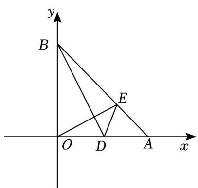

text_image

y
B
E
O D A x

图1

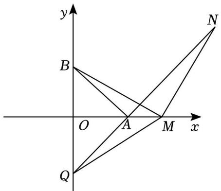

text_image

y
B
O A M x
Q
N

图2

## 类型三：一次函数的实际应用

13．如图，在平面直角坐标系 $x O y$ 中，直线 $l { : } y { = } - x { + } m$ 与x轴交于点A，点B在x轴的负半轴上，且 $O B = \frac { 1 } { 2 } O A = 2$ ．

（1）求直线 l 的函数表达式；

（2）点 P 是直线 l 上一点，连接 BP，将线段 BP 绕点 B 顺时针旋转 $9 0 ^ { \circ }$ 得到 BQ

（ⅰ）当点 Q 落在 y 轴上时，连接 AQ，求点 P 的坐标及四边形 APBQ 的面积；  
（ⅱ）作直线 BP，AQ，两条直线在第一象限内相交于点 C，记四边形 APBQ 的面积为 $S _ { 1 } , \bigtriangleup A B C$ 的面$\mathrm { S } _ { 2 } { = } \frac { 1 } { 3 } \mathrm { S } _ { 1 } ,$ ，求点 Q 的坐标

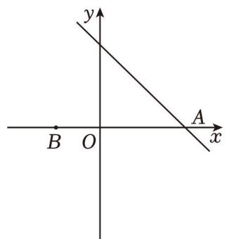

text_image

y
A
x
B O

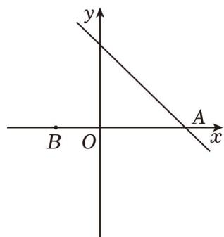

text_image

y
A
x
B O

备用图

14．如图所示，在平面直角坐标系中，点 A（﹣4，3），连结 OA，将线段 OA 绕点 O 顺时针旋转 $9 0 ^ { \circ }$ 到 OB，将点 B 向左平移 5 个单位长度至点 C，连结 BC

（1）求点 B、点 C 的坐标；  
（2）将直线 BC 绕点 C 顺时针旋转 45°，交 x 轴于点 D，求直线 CD 的函数表达式；

（3）现有一动点 P 从 C 出发，以每秒 2 个单位长度的速度沿射线 CD 运动，运动时间为 t 秒．请探究：当 t 等于多少时， $\triangle B C P$ 为等腰三角形

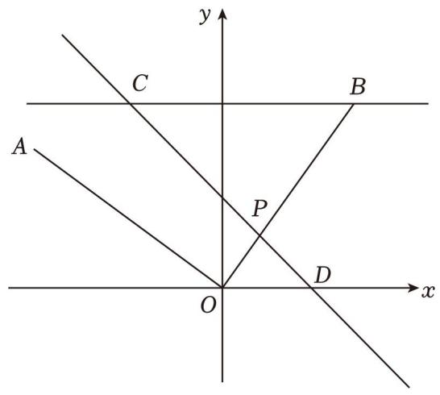

text_image

y
C
B
A
P
O
D
x

15．如图，一次函数 y＝kx+2 的图象与 x 轴和 y 轴分别交于点 A 和点 B，且 A（﹣1，0）

（1）求 k 的值；

（2）若将一次函数 $y = k x + 2$ 的图象绕点 B 顺时针旋转 $9 0 ^ { \circ }$ ，所得的直线与 x轴交于点 C，且 $S _ { \triangle A B C } { = } 5$ ，求点 C 的坐标；

（3）在（2）的条件下，若 P 是 x 轴上任意一点，当△PBC 是以 BC 为腰的等腰三角形时，请求出点 P的坐标

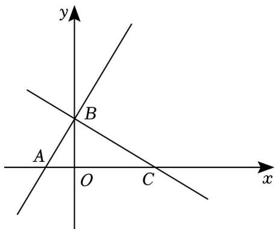

text_image

y
B
A
O C
x

16．如图 1，直线 $y = \frac { 3 } { 4 } x$ $y = - \frac { 1 } { 2 } x + b$ 相交于点 A，直线 $y = - \frac { 1 } { 2 } x + b$ 与 x 轴交于点 C，点 P 在线段AC 上， $P D \perp x$ 轴于点 D，交直线 $y = \frac { 3 } { 4 } x$ 于点 Q．且 $Q P { = } O A$ ，已知 A 点的横坐标为 4

（1）求点 C 的坐标

（2）如图 2，∠OQP 平分线交 x 轴于点 M

①求直线 QM 的解析式  
②将直线 QM 绕着点 M 旋转 45°，旋转后的直线与 y 轴交于点 N．直接写出点 N 的坐标

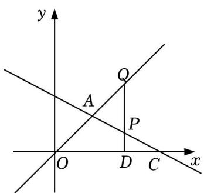

text_image

y
Q
A
P
O
D
C
x

图1

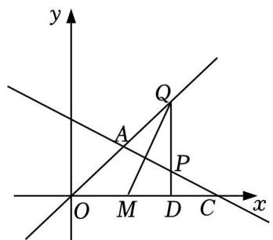

text_image

y
Q
A
P
O M D C x

图2

## 类型四：一次函数与三角形

17．如图，直线 $l \colon y = a x { + } 3$ 交 x 轴于点 A（6，0），将直线 l 向下平移 4 个单位长度，得到的直线分别交 x

轴，y 轴于点 B，C

（1）求 a 的值及 B，C 两点的坐标；  
（2）点 M 为线段 AB 上一点，连接 CM 并延长，交直线 l 于

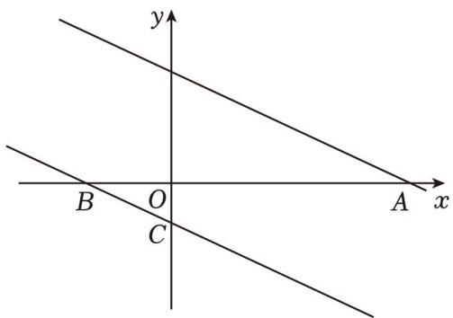

text_image

y
B O A x
C

点 N，若△AMN 是等腰三角形，求点 M 的坐标

18．直线 $A B \colon y = - x + b$ 分别与 x，y轴交于 A（8、0）、B 两点，过点 B 的直线交 x轴负半轴于 C，且 OB：

$$
O C = 4: 3
$$

（1）求点 B 的坐标为

（2）求直线 BC 的解析式；

（3）动点 M 从 C 出发沿 CA 方向运动，运动的速度为每秒 1个单位长度．设M 运动 t 秒时，当 t 为何值时 $\triangle B C M$ 为等腰三角形

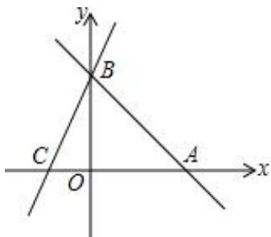

text_image

y
B
C
O
A
x

19．如图，在平面直角坐标系中，直线 $y = x + 2$ 与 x 轴、y 轴分别交 A、B 两点，与直线 $y = - \frac { 1 } { 2 } x + b$ 相交于点 $C \ ( 2 , \ m )$ ．

（1）求 m 和 b的值；

（2）若直线 $\mathbf { y } = \frac { 1 } { 2 } \mathbf { x } + \mathbf { b }$ 与 x 轴相交于点 D，动点 P 从点 D 开始，以每秒 1 个单位的速度向 x 轴负方向运

动，设点 P 的运动时间为 t 秒

①若点 P 在线段 DA 上，且 $. \triangle A C P$ 的面积为 10，求 t 的值；  
②是否存在 t 的值，使△ACP 为等腰三角形？若存在，求出 t 的值；若不存在，请说明理由

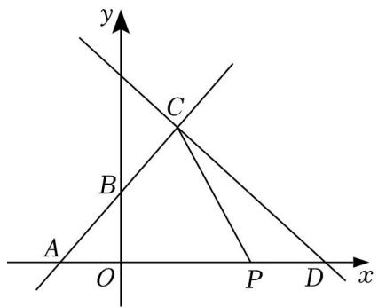

text_image

y
C
B
A
O
P
D
x

20．已知直线 l1： $y = \frac { 1 } { 2 } x - 2$ 与 x 轴交于点 A，与 y 轴交于点 B，将直线沿 x 轴翻折，得到一个新函数的图象$l _ { 2 }$ （图 1），直线 $l _ { 2 }$ 与 y轴交于点 C

（1）求新函数的图象 l 的解析式；  
（2）在射线 $A C$ 上一动点 $D \ ( x , \ y )$ ），连接 BD，试求 $\triangle B A D$ 的面积 S 关于 x 的函数解析式，并写出自变量的取值范围；

（3）如图 2，过点 $\begin{array} { r l } { E \ ( 2 , \ } & { { } - \ 6 ) } \end{array}$ 画平行于 y 轴的直线 $E F$ ，

①求证： $\triangle A B E$ 是等腰直角三角形；  
②将直线 $l _ { 1 }$ 沿 y 轴方向平移，当平移到恰当距离的时候，直线 $l _ { 1 }$ 与 x 轴交于点 $A 1$ ，与 y 轴交于点 $B 1$ ，在直线 EF 上是否存在点 P（纵、横坐标均为整数），使得 $\triangle A _ { 1 } B _ { 1 } P$ 是等腰直角三角形，若存在，请直接写出所有符合条件的点 P 的坐标

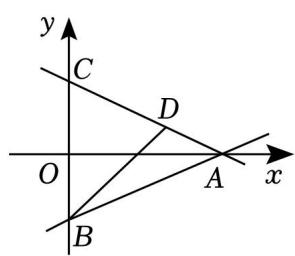

text_image

y
C
D
O
A
x
B

图1

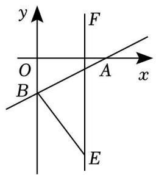

text_image

y
F
O
A
x
B
E

图2

## 类型五：一次函数与四边形

21．如图 1，直线 $y _ { 1 } = 2 x - 2$ 与 x 轴，y 轴分别交于 A，B 两点，与直线 $y _ { 2 } { = } k x { + } 2 \ ( k { > } 0 )$ ）交于点 C，直线 $y _ { 2 }$ 与 y轴交于点 G．平移线段 BC，点 B，C 的对应点 D，E 分别在直线 $y _ { 2 }$ 和 y 轴上，连结 CE

（1）若 C 点横坐标为 4，求 k的值；  
（2）若 $\angle D E C = 9 0 ^ { \circ }$ ，求点 C 的坐标；  
（3）如图 2，作点 E 关于直线 CD 的对称点 F，连接 FB，FC，是否存在四边形 CFBG 是平行四边形的

情况，若存在，请求出此时 k 的值；若不存在，请说明理由

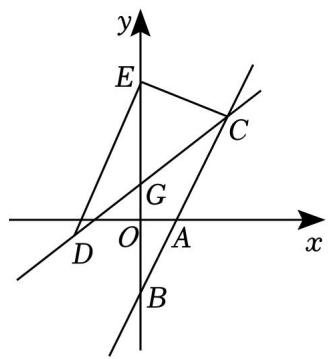

text_image

y
E
C
G
D O A x
B

图1

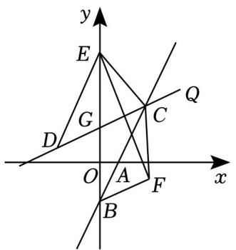

text_image

y
E
Q
G
C
D
O
A
F
x
B

图2

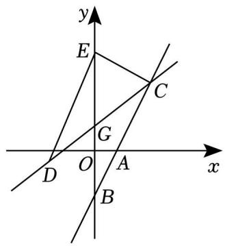

text_image

y
E
C
G
D O A x
B

备用图

22．如图，已知直线 $y = - \frac { 1 } { 2 } x + 3$ 与 x 轴，y 轴分别交于点 A，B，以 AB 为直角边，∠B 为直角作等腰直角

三角形 ABC（点 C 在第一象限）

（1）求点 A，B，C 坐标；  
（2）点 D 为第一象限内一点，当 A，B，C，D 四点围成的四边形为正方形时，求点 D 坐标；  
（3）点 P 为 x 轴上一动点，点 Q 为线段 AC 上一动点，是否存在四

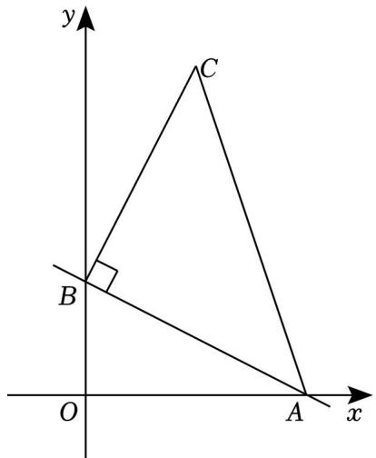

text_image

y
C
B
O
A
x

边形 BPAQ为平行四边形？若存在，求出 P，Q 点的坐标，若不存在，说明理由

23．如图 1，矩形 OABC 的边 OA、OC 分别在 x 轴、y 轴上，B 点坐标是（8，4），将 $\triangle A O C$ 沿对角线 AC翻折得 $\triangle A D C , ~ A D$ 与 BC 相交于点 E

（1）求证： $\triangle C D E { \cong } \triangle A B E ;$ ；

（2）求 E 点坐标；

（3）如图 2，若将△ADC 沿直线 AC 平移得 $\triangle A ^ { \prime } D ^ { \prime } C ^ { \prime }$ ′（边 $A ^ { \prime } \ C ^ { \prime }$ ′始终在直线 AC 上），是否存在四边形 $D D ^ { \prime } C ^ { \prime } C$ 为菱形的情况？若存在，请直接写出点 $C ^ { \prime }$ ′的坐标；若不存在，请说明理由

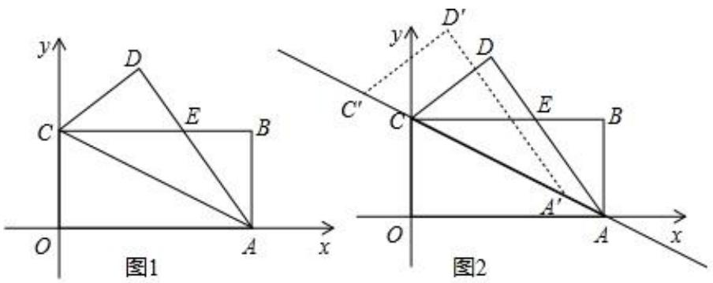

24．如图，在平面直角坐标系中，O 是坐标原点，点 A 的坐标是（1，3），点 P 的坐标是（0，b）（b≠0）．直线 AP 交 x轴于点 B，记点 P 关于 x 轴的对称点为 $P ^ { \prime }$ ′，点 Q 为 x轴上一动点

（1）当 b＝1时，求 OB 的长；  
（2）当 $0 { < } b { < } 3$ 时，用含 b 的代数式表示 OB 的长；  
（3）是否存在四边形 $P B P ^ { \prime } \ Q$ ，使四边形 $P B P ^ { \prime } \mathcal { Q }$ 为正方形？若存在，请求出所有满足条件的 b 和点 Q 的坐标；若不存在，请说明理由

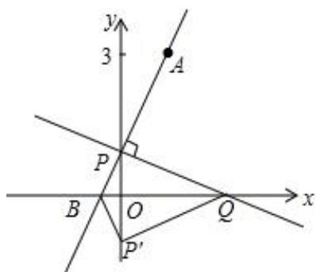

text_image

y
3
A
P
B
O
Q
x
P'

