## 第 03 讲 多边形及其内角和

## 学习目标

<table><tr><td>课程标准</td><td>学习目标</td></tr><tr><td>1多边形的认识2多边形的内角和与外角和3正多边形</td><td>1. 掌握多边形及其与多边形有关的概念。2. 掌握多边形的内角和计算公式,内角和公式的推导过程及其相关计算,掌握多边形的外角和度数。3. 掌握正多边形的概念,且根据正多边形的性质解决相应的题目。</td></tr></table>

## 思维导图

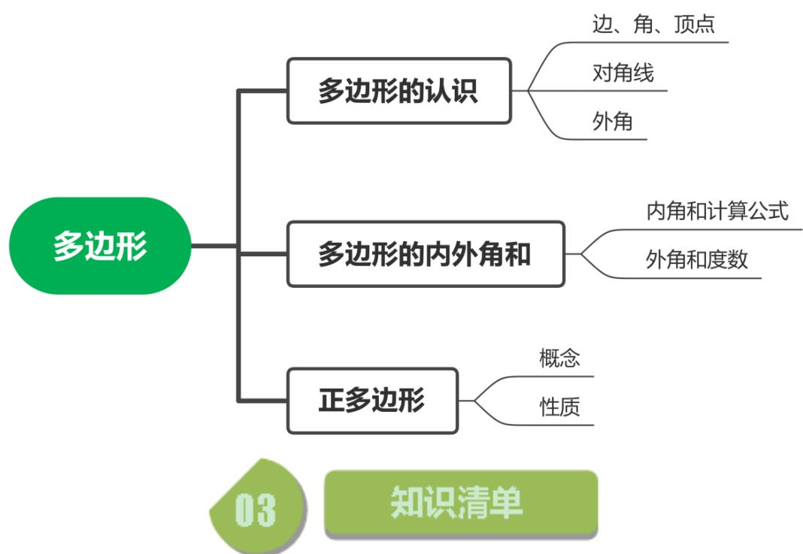

## 知识点01 多边形的认识

1. 多边形的概念： 

在平面内，由多条线段首位顺次连接所组成的图形是多边形。组成的线段有多少条，则图形就是一个 几边形。 

2. 多边形的相关概念： 

如图：组成多边形的线段叫做多边形的 边 ；相邻两条边的交点 叫多边形的 顶点 ；相邻两条边构成的角是多边形的 角 ；任 意两个不相邻的顶点间的连线段叫做多边形的 对角线 ；多边形的 边与邻边的延长线构成的角叫做多边形的 外角 

题型考点：判断图形。 

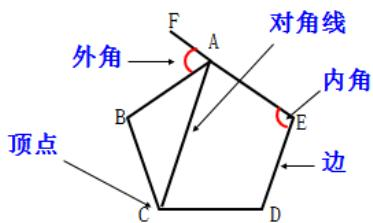

## 【即学即练 1】

1. 如图所示的图形中，属于多边形的有（ ）个 

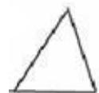

A．3 

B．4 

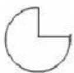

C．5 

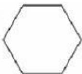

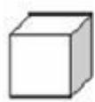

D．6 

【解答】解：所示的图形中，属于多边形的有第一个、第二个、第五个 故选：A 

## 知识点02 多边形的内角和外角和

1. 多边形的对角线计算： 

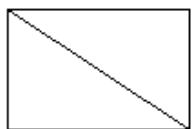

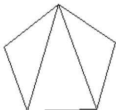

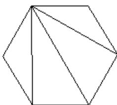

总结规律：若多边形的边数为n，则多边形一个顶点的对角线条数为  条，多边形所有的对角 线条数为 $- { \frac { n ( n - 3 ) } { 2 } }$ 条。 

2. 多边形一个顶点的对角线把多边形分成的三角形数量计算： 

由上图总结：一个顶点的对角线分多边形成三角形的个数为：  个。 

3. 多边形的内角和计算公式： 

由上图可知，多边形的内角和等于图中所有三角形的内角和之和。即： $\_ { } ( n - 2 ) { \cdot } 1 8 0 ^ { \circ }$ _。 

4. 多边形的外角和： 

任意多边形的外角和都等于 360 

题型考点：①利用内角和公式求内角和或求多边形的边数。 

②利用多边形的内外角关系计算。 

## 【即学即练 1】

2. 十二边形的内角和是（ ） A $1 4 4 0 ^ { \circ }$ B $1 6 2 0 ^ { \circ }$ C．1800 D $1 9 8 0 ^ { \circ }$ 

【解答】解：十二边形的内角和等于： $( 1 2 - 2 ) ^ { \bullet } 1 8 0 ^ { \circ } \ = 1 8 0 0 ^ { \circ }$ 故选：C 

3. 若一个多边形的内角和是1080度，则这个多边形的边数为（ ） A．6 B．7 C．8 D．10 

【解答】解：根据n边形的内角和公式，得 $( n - 2 ) \bullet 1 8 0 = 1 0 8 0 ,$ 解得 n＝8 ∴这个多边形的边数是8 故选：C 

## 【即学即练 2】

4. 多边形的边数由3增加到2021时，其外角和的度数（ ） A．增加 B．减少 C．不变 D．不能确定 

【解答】解：∵任何多边形的外角和都是 $3 6 0 ^ { \circ }$ ∴多边形的边数由3增加到 2021时，其外角和的度数不变， 故选：C 

## 【即学即练 3】

5. 一个多边形的内角和比它的外角和的3倍少 $1 8 0 ^ { \circ }$ ，则这个多边形的边数是 【解答】解：设这个多边形的边数为n， 根据题意，得 $( n \mathrm { ~ - ~ } 2 ) \mathrm { ~ } \times 1 8 0 ^ { \circ } \mathrm { ~ } = 3 \times 3 6 0 ^ { \circ } \mathrm { ~ } \mathrm { ~ - ~ } 1 8 0 ^ { \circ }$ 解得 n＝7 故答案为：7 

6. 若一个多边形的内角和比外角和大 $3 6 0 ^ { \circ }$ ，则这个多边形的边数为 

【解答】解：设多边形的边数是 n， 

根据题意得， $\begin{array} { r l } { ( n - 2 ) \bullet 1 8 0 ^ { \circ } } & { { } - 3 6 0 ^ { \circ } \ = 3 6 0 ^ { \circ } } \end{array}$ 

解得 $n { = } 6 .$ 

故答案为：6 

## 知识点03 正多边形

1. 正多边形的概念： 

每条边都 相等 ，每个内角都 相等 的多边形是正多边形。 

2. 正多边形的每个内角计算： 

因为正多边形的内角和为 $\left( n - 2 \right) \cdot 1 8 0 ^ { \circ }$ ，每个内角都相等且有 个内角，所以正多边形的每个内角度数 为： $- { \frac { ( n - 2 ) \cdot 1 8 0 ^ { \circ } } { n } } -$ 

3. 正多边形的每个外角计算： 

正多边形的外角和是 $3 6 0 ^ { \circ }$ ，每个外角也相等，所以正多边形的每个外角度数为 $\cdot { \frac { 3 6 0 ^ { \circ } } { n } }$ 

4. 正多边形的内角与外交关系： 

$$
\frac {(n - 2) \cdot 1 8 0 ^ {\circ}}{n} + \frac {3 6 0 ^ {\circ}}{n} = \underline {{\quad 1 8 0 ^ {\circ} \quad}};
$$

题型考点：利用正多边形的相关计算公式计算。 

## 【即学即练 1】

7. 若一个多边形的每个内角都为 $1 3 5 ^ { \circ }$ ，则它的边数为（ A．6 B．8 C．5 D．10 

【解答】解：∵一个正多边形的每个内角都为 $1 3 5 ^ { \circ }$ ∴这个正多边形的每个外角都为： $1 8 0 ^ { \circ } \ \textrm { ~ - } 1 3 5 ^ { \circ } \ = 4 5 ^ { \circ }$ ∴这个多边形的边数为： $3 6 0 ^ { \circ } ~ \div 4 5 ^ { \circ } ~ = 8$ 故选：B 

8. 一个多边形的每一个外角都等于 $3 6 ^ { \circ }$ ，那么这个多边形的内角和是 【解答】解： $3 6 0 ^ { \circ } ~ \div 3 6 ^ { \circ } ~ = 1 0$ $( 1 0 - 2 ) \times 1 8 0 ^ { \circ } = 1 4 4 0 ^ { \circ }$ 即这个多边形的内角和是 $1 4 4 0 ^ { \circ }$ 故答案为 1440 

9. 如果一个正多边形的一个内角与一个外角的度数之比是 7：2，那么这个正多边形的边数是（ ） A．11 B．10 C．9 D．8 

【解答】解：设这个正多边形的边数为n， 

由题意得： ${ \frac { 2 } { 7 } } \ ( n - 2 ) \ \times 1 8 0 { = } 3 6 0 ,$ 

解得： $n { = } 9$ 

故选：C 

## 题型精讲

## 题型01 多边形的截角问题

【典例 1】 

如图，在 $\triangle A B C$ 中， $\angle C = 7 0 ^ { \circ }$ ，沿图中虚线截去 $\angle C$ ，则 $\angle 1 + \angle 2 = { \left( \begin{array} { l l l } { \quad } & { \quad } & { } \end{array} \right) }$ 

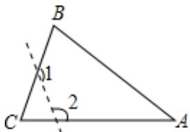

A $1 4 0 ^ { \circ }$ B $1 8 0 ^ { \circ }$ C $2 5 0 ^ { \circ }$ D $3 6 0 ^ { \circ }$ 

【解答】解： $\because \angle C = 7 0 ^ { \circ }$ 

$\therefore \angle 3 + \angle 4 = 1 8 0 ^ { \circ } - 7 0 ^ { \circ } = 1 1 0 ^ { \circ }$ 

$$
\therefore \angle 1 + \angle 2 = (1 8 0 ^ {\circ} - \angle 3) + (1 8 0 ^ {\circ} - \angle 4) = 3 6 0 ^ {\circ} - (\angle 3 + \angle 4) = 2 5 0 ^ {\circ}
$$

故选：C 

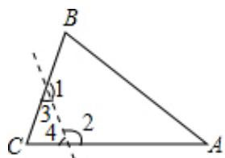

变式 1： 

一个多边形截去一个角（截线不过顶点）之后，所形成的多边形的内角和是 $2 5 2 0 ^ { \circ }$ ，那么原多边形的边数 是（ ） A．19 B．17 C．15 D．13 

【解答】解：设内角和是 $2 5 2 0 ^ { \circ }$ 的多边形的边数是n 

根据题意得： $( n - 2 ) \bullet 1 8 0 = 2 5 2 0$ 

解得： $n { = } 1 6 .$ 

则原来的多边形的边数是 $1 6 - 1 = 1 5$ 

故选：C 

变式 2： 

一个多边形截去一个角后，形成的另一个多边形的内角和是 $1 6 2 0 ^ { \circ }$ ，则原来多边形的边数是（ ） A．10 B．11 C．12 D．10 或 11 或 12 

【解答】解：设多边形截去一个角的边数为n， 

则 $( n - 2 ) \bullet 1 8 0 ^ { \circ } \ = 1 6 2 0 ^ { \circ }$ 

解得 $n { = } 1 1$ 

∵截去一个角后边上可以增加 1，不变，减少1， 

∴原来多边形的边数是10或11或12 

故选：D 

## 变式 3：

一个多边形截去一个角后，形成另一个多边形的内角和为 $1 4 4 0 ^ { \circ }$ ，则原多边形的边数是 

【解答】解：设多边形截去一个角的边数为n， 

则 $( n - 2 ) \bullet 1 8 0 ^ { \circ } \ = 1 4 4 0 ^ { \circ }$ 

解得 $n { = } 1 0 ,$ 

∵截去一个角后边上可以增加 1，不变，减少1， 

∴原多边形的边数是9或10或11 

故答案为：9或10或11 

## 题型02 实际生活与正多边形

## 【典例 1】

小华从 A点出发向前直走50m，向左转 $1 8 ^ { \circ }$ ，继续向前走 50m，再向左转 $1 8 ^ { \circ }$ ，他以同样的走法回到A 点 时，共走了 m 

【解答】解：∵多边形的边数为 $3 6 0 ^ { \circ } ~ \div 1 8 ^ { \circ } ~ = 2 0$ 

∴小华要走20次才能回到原地， 

∴小华走的距离为 $2 0 \times 5 0 { = } 1 0 0 0 ~ ( m )$ 

故答案为：1000 

## 变式 1：

如图，小明从点 A 出发沿直线前进 10 米到达点 B，向左转 $4 5 ^ { \circ }$ 后又沿直线前进 10 米到达点 C，再向左转 $4 5 ^ { \circ }$ 后沿直线前进10米到达点D…照这样走下去，小明第一次回到出发点A时所走的路程为（ ） 

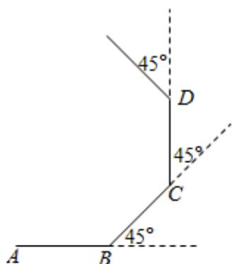

A．100 米 B．80 米 C．60 米 D．40 米 

【解答】解：∵小明每次都是沿直线前进10米后向左转 45度， ∴他走过的图形是正多边形， 

$\therefore$ 边数 $n { = } 3 6 0 ^ { \circ } \ { \div } 4 5 ^ { \circ } \ = 8$ 

∴他第一次回到出发点A时，一共走了 $8 \times 1 0 { = } 8 0 ~ ( m )$ 

故选：B 

【典例 2】 

一名模型赛车手遥控一辆赛车，先前进1m，然后，原地逆时针方向旋转角 $a ~ \left( 0 ^ { \circ } ~ < \alpha < 1 8 0 ^ { \circ } \right.$ ）被称为一次 操作．若五次操作后，发现赛车回到出发点，按照向量考虑，则角α 为（ ） A $7 2 ^ { \circ }$ B． $1 0 8 ^ { \circ }$ 或 $1 4 4 ^ { \circ }$ C $1 4 4 ^ { \circ }$ D． $7 2 ^ { \circ }$ 或 $1 4 4 ^ { \circ }$ 

【解答】解： $3 6 0 \div 5 = 7 2 ^ { \circ }$ 

$7 2 0 \div 5 = 1 4 4 ^ { \circ }$ 

故选：D 

变式 1： 

活动课上，小华从点 O 出发，每前进 1 米，就向右转体 $a ^ { \circ } \quad ( 0 < a < 1 8 0 )$ ），照这样走下去，如果他恰好能 回到O点，且所走过的路程最短，则 a的值等于 

【解答】解：根据题意，小华所走过的路线是正多边形， 

∴边数 $n { = } 3 6 0 ^ { \circ } ~ { \div } a ^ { \circ }$ 

走过的路程最短，则n最小，a最大， 

n最小是3， $a ^ { \circ }$ 最大是 $1 2 0 ^ { \circ }$ 

故答案为：120 

## 题型03 正多边形的图形组合

【典例 1】 

如图，平面上两个正方形与正五边形都有一条公共边，则 α 的度数为（ ） 

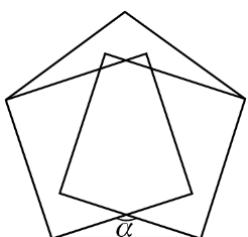

A $3 6 ^ { \circ }$ B $9 2 ^ { \circ }$ C $1 4 4 ^ { \circ }$ D $1 5 0 ^ { \circ }$ 

【解答】解：如图， 

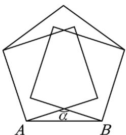

∵正五边形的每个内角是 $1 0 8 ^ { \circ }$ ，正方形的每个内角 $9 0 ^ { \circ }$ 

$$
\therefore \angle O A B = \angle O B A = 1 0 8 ^ {\circ} - 9 0 ^ {\circ} = 1 8 ^ {\circ}
$$

$$
\therefore \angle \alpha = 1 8 0 ^ {\circ} - 1 8 ^ {\circ} - 1 8 ^ {\circ} = 1 4 4 ^ {\circ}
$$

故选：C 

变式 1： 

如图，由一个正六边形和正五边形组成的图形中，∠ABC的度数应是（ ） 

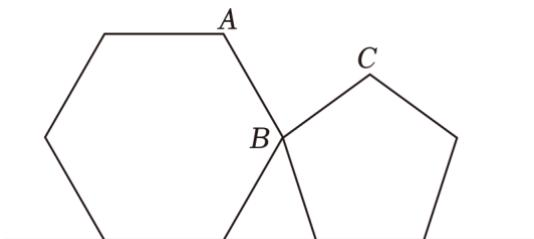

A $7 2 ^ { \circ }$ B $8 4 ^ { \circ }$ C $8 2 ^ { \circ }$ D $9 4 ^ { \circ }$ 

【解答】解：如图， 

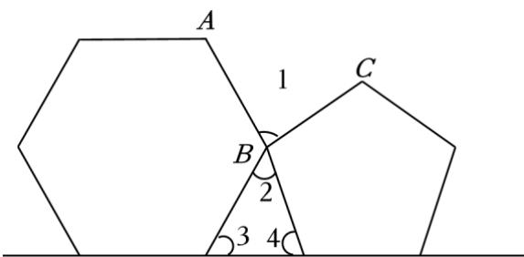

由题意得： $\angle 3 = 3 6 0 ^ { \circ } \div 6 = 6 0 ^ { \circ } , \angle 4 = 3 6 0 ^ { \circ } \div 5 = 7 2 ^ { \circ }$ 

则 $\angle 2 = 1 8 0 ^ { \circ } - 6 0 ^ { \circ } - 7 2 ^ { \circ } = 4 8 ^ { \circ }$ 

所以 $\angle 1 = 3 6 0 ^ { \circ } - 4 8 ^ { \circ } - 1 2 0 ^ { \circ } - 1 0 8 ^ { \circ } = 8 4 ^ { \circ }$ 

故选：B 

## 变式 2：

如图，正六边形 ABCDEF和正五边形 GHCDL的边CD 重合，DH 的延长线与AB交于点 P，则∠BPD的度 数是（ ） 

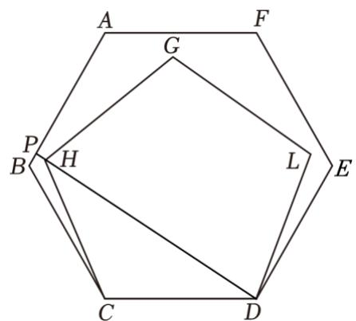

A $8 3 ^ { \circ }$ B $8 4 ^ { \circ }$ C $8 5 ^ { \circ }$ D $8 6 ^ { \circ }$ 

【解答】解：∵六边形 $A B C D E F$ 为正六边形， $\therefore \angle B C D = \angle B = ( 6 - 2 ) \times 1 8 0 ^ { \circ } \div 6 = 1 2 0 ^ { \circ }$ ∵五边形 $G H C D L$ 为正五边形， $\therefore C D = C H , \angle D C H = ( 5 - 2 ) \times 1 8 0 ^ { \circ } \div 5 = 1 0 8 ^ { \circ }$ $\therefore \angle C D H = \angle C H D = \frac { 1 8 0 ^ { \circ } - 1 0 8 ^ { \circ } } { 2 } = 3 6 ^ { \circ }$ ∵四边形 $B C D P$ 的内角和为 $3 6 0 ^ { \circ }$ $\therefore \angle B P D = 3 6 0 ^ { \circ } \quad - 1 2 0 ^ { \circ } \quad - 1 2 0 ^ { \circ } \quad - 3 6 ^ { \circ } = 8 4 ^ { \circ }$ 故选：B 

故选：B 

## 变式 3：

把边长相等的正六边形 ABCDEF 和正五边形 GHCDM 的 CD 边重合，按照如图的方式叠合在一起，延长 MG 交 AF 于点 N，则 $\angle A N G$ 等于（ ） 

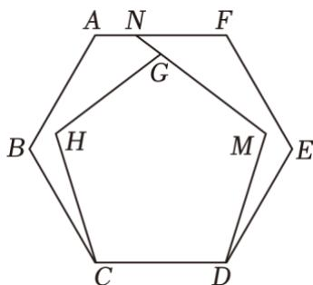

A $1 4 0 ^ { \circ }$ B $1 4 4 ^ { \circ }$ C $1 4 8 ^ { \circ }$ D $1 5 0 ^ { \circ }$ 

【解答】解： $( 6 \div 2 ) \times 1 8 0 ^ { \circ } \div 6 = 1 2 0 ^ { \circ }$ $( 5 \textrm { - } 2 ) \times 1 8 0 ^ { \circ } \ \div 5 = 1 0 8 ^ { \circ }$ $\angle A N G = \mathrm { ~ ( 6 - 2 ) ~ } \times 1 8 0 ^ { \circ } \mathrm { ~ - ~ } 1 2 0 ^ { \circ } \mathrm { ~ } \times 3 \mathrm { ~ - ~ } 1 0 8 ^ { \circ } \mathrm { ~ } \times 2$ $= 7 2 0 ^ { \circ } \quad - 3 6 0 ^ { \circ } \quad - 2 1 6 ^ { \circ }$ ＝ $: 1 4 4 ^ { \circ }$ 

故选：B 

## 05

## 强化训练

1．八边形的内角和是外角和的（ ）倍 A．2 B．3 C．4 D．5 

【解答】解：∵八边形的内角和为： $( 8 - 2 ) \times 1 8 0 ^ { \circ } \ = 1 0 8 0 ^ { \circ }$ ，其外角和为 $3 6 0 ^ { \circ }$ $\therefore 1 0 8 0 ^ { \circ } \ \div 3 6 0 ^ { \circ } \ = 3$ （倍）， 

故选：B 

2．下列角度不可能是多边形内角和的为（ ） A $1 8 0 ^ { \circ }$ B $2 7 0 ^ { \circ }$ C $5 4 0 ^ { \circ }$ D $1 4 4 0 ^ { \circ }$ 

【解答】解：设多边形的边数为 $n \ ( \boldsymbol { n } \geqslant 3$ 且n为整数）， 则 $( n - 2 ) \bullet 1 8 0 ^ { \circ } \ = 1 8 0 ^ { \circ }$ 解得：n＝3， 则A不符合题意； $( n - 2 ) \bullet 1 8 0 ^ { \circ } \ = 2 7 0 ^ { \circ }$ 解得： $n { = } 3 . 5 ,$ 则B符合题意； $( n - 2 ) \bullet 1 8 0 ^ { \circ } \ = 5 4 0 ^ { \circ }$ 解得： $n { = } 5 ,$ 则C不符合题意； $( n - 2 ) \bullet 1 8 0 ^ { \circ } \ = 1 4 4 0 ^ { \circ }$ 解得：n＝10， 则D 不符合题意； 故选：B 

3．如图， $\angle C + \angle D + \angle E - \angle A - \angle B$ 的度数是（ ） 

A $1 8 0 ^ { \circ }$ B $2 4 0 ^ { \circ }$ C $3 0 0 ^ { \circ }$ D $3 6 0 ^ { \circ }$ 

【解答】解： $\because \angle A + \angle B + \angle A F B = 1 8 0 ^ { \circ } ~ , ~ \angle C F E = \angle A F B ,$ $\therefore \angle A + \angle B = 1 8 0 ^ { \circ } \quad - \angle C F E$ $\therefore \angle C + \angle D + \angle E - \angle A - \angle B$ _ $\because \angle C + \angle D + \angle E - ( \angle A + \angle B )$ $= \angle C + \angle D + \angle E - ( 1 8 0 ^ { \circ } - \angle C F E )$ ＝ $\angle C + \angle D + \angle E + \angle C F E - 1 8 0 ^ { \circ }$ $= 3 6 0 ^ { \circ } \quad - 1 8 0 ^ { \circ }$ $= 1 8 0 ^ { \circ }$ 故选：A 

4．清明节当天八年级某班组织学生去烈士林园为革命先烈扫墓，以此表达对先烈的追思和崇敬之情，细心 灯小明发现革命烈士纪念塔的塔底平面为八边形，这个八边形的内角和（ ） 

A $7 2 0 ^ { \circ }$ B $9 0 0 ^ { \circ }$ C $1 0 8 0 ^ { \circ }$ D $1 4 4 0 ^ { \circ }$ 

【解答】解：八边形的内角和为： $( 8 - 2 ) \times 1 8 0 ^ { \circ } \ = 1 0 8 0 ^ { \circ }$ 故选：C 

5．如图，四边形 ABCD 为一矩形纸带，点 E、F 分别在边 AB、CD 上，将纸带沿 EF 折叠，点 A、D 的对 应点分别为A'、D'，若 $\angle 2 = 3 5 ^ { \circ }$ ，则∠1的度数为（ ） 

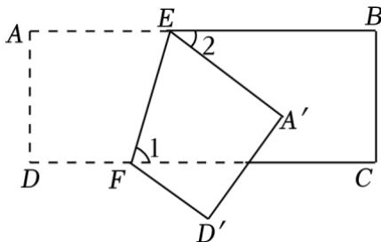

A $6 2 . 5 ^ { \circ }$ B $7 2 . 5 ^ { \circ }$ C $5 5 ^ { \circ }$ D $4 5 ^ { \circ }$ 

【解答】解： $\because \angle 2 = 3 5 ^ { \circ }$ $\therefore \angle A E A ^ { \prime } = 1 8 0 ^ { \circ } \quad - 3 5 ^ { \circ } = 1 4 5 ^ { \circ }$ ∴由折叠性质可得： $\angle A E F { = } \angle A ^ { \prime } E F { = } { \frac { 1 } { 2 } } \angle A E A ^ { \prime } = 7 2 . 5 ^ { \circ }$ $\because A B / / C D ,$ $\therefore \angle 2 = \angle A E F = 7 2 . 5 ^ { \circ }$ 故选：B 

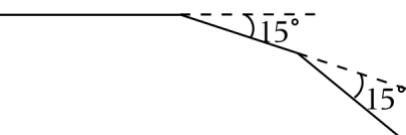

6．如图，奇奇先从点 A 出发前进 4m，向右转 $1 5 ^ { \circ }$ ，再前进 4m，又向右转 $1 5 ^ { \circ }$ ，…，这样一直走下去， 他第一次回到出发点A时，一共走了（ ） A 15° 15 A．24m B．48m C．64m D．96m 

【解答】解：∵奇奇从A点出发最后回到出发点A时正好走了一个正多边形， ∴根据外角和定理可知正多边形的边数为 $n { = } 3 6 0 ^ { \circ } ~ { \div } 1 5 ^ { \circ } ~ { = } 2 4$ 则一共走了 $2 4 \times 4 = 9 6$ （米） 故选：D 

7．若一个正多边形每一个外角都相等，且一个内角的度数是 $1 4 0 ^ { \circ }$ ，则这个多边形是（ ） A．正七边形 B．正八边形 C．正九边形 D．正十边形 【解答】解： $1 8 0 ^ { \circ } \ \textrm { ~ - } 1 4 0 ^ { \circ } \ = 4 0 ^ { \circ }$ $3 6 0 ^ { \circ } ~ \div 4 0 ^ { \circ } ~ = 9$ ∴这个多边形是正九边形 故选：C 

8．如图，在五边形ABCDE 中， $A E / / C D$ $\angle 1 = 5 0 ^ { \circ }$ $\angle 2 = 7 0 ^ { \circ }$ ，则 $\angle 3$ 的度数是（ ） 

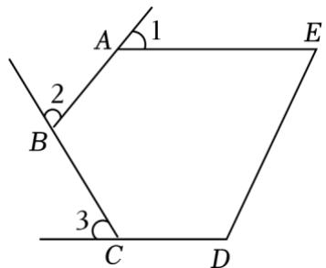

A $4 0 ^ { \circ }$ B $5 0 ^ { \circ }$ C $6 0 ^ { \circ }$ D $7 0 ^ { \circ }$ 

【解答】解：∵四边形 $A B C D E$ 为五边形， ∴其内角和为 $( 5 - 2 ) \times 1 8 0 ^ { \circ } = 5 4 0 ^ { \circ }$ $\because A E / / C D ,$ $\therefore \angle D + \angle E = 1 8 0 ^ { \circ }$ $\therefore \angle B A E + \angle A B C + \angle B C D = 5 4 0 ^ { \circ } - 1 8 0 ^ { \circ } = 3 6 0 ^ { \circ }$ $\therefore \angle 1 + \angle 2 + \angle 3 = 1 8 0 ^ { \circ } \times 3 - 3 6 0 ^ { \circ } = 1 8 0 ^ { \circ }$ $\because \angle 1 = 5 0 ^ { \circ } , \angle 2 = 7 0 ^ { \circ }$ $\therefore \angle 3 = 1 8 0 ^ { \circ } - 5 0 ^ { \circ } - 7 0 ^ { \circ } = 6 0 ^ { \circ }$ 故选：C 

9．如图所示， $\angle A + \angle B + \angle C + \angle D + \angle E + \angle F =$ 

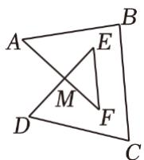

【解答】解：如图，连接AD， 

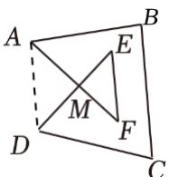

$\because \angle E + \angle F + \angle E M F = \angle M A D + \angle M D A + \angle A M D = 1 8 0 ^ { \circ } ~ , ~ \angle E M F = \angle A M D ,$ $\therefore \angle E + \angle F = \angle M A D + \angle M D A ,$ $\therefore \angle A + \angle B + \angle C + \angle D + \angle E + \angle F$ $= \angle B A M + \angle B + \angle C + \angle C D M + \angle M A D + \angle M D A$ $= \angle D A B + \angle B + \angle C + \angle A D C$ $= 3 6 0 ^ { \circ }$ 故答案为：360 

10．如图，正五边形ABCDE的对角线BD、CE 相交于点F，则 $\angle C F D$ 的度数为 

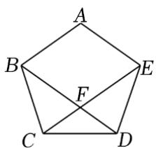

【解答】解：∵五边形ABCDE为正五边形， 

$$
\therefore \angle B C D = \angle C D E = (5 - 2) \times 1 8 0 ^ {\circ} \div 5 = 1 0 8 ^ {\circ}, B C = C D = D E,
$$

$$
\therefore \angle B D C = \angle C B D = \angle D C E = \angle C E D = \frac {1 8 0 ^ {\circ} - 1 0 8 ^ {\circ}}{2} = 3 6 ^ {\circ},
$$

$$
\therefore \angle C F D = 1 8 0 ^ {\circ} - \angle B D C - \angle D C E = 1 8 0 ^ {\circ} - 3 6 ^ {\circ} - 3 6 ^ {\circ} = 1 0 8 ^ {\circ},
$$

故答案为： $1 0 8 ^ { \circ }$ 

11．如图，四边形 ABOC 中， $\angle B A C \ H \angle B O C$ 的角平分线相交于点 P，若 $\angle B = 1 6 ^ { \circ } , \angle C = 4 2 ^ { \circ }$ ，则 $\angle P$ ＝ 

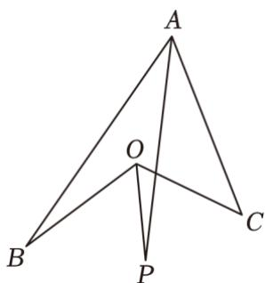

【解答】解：延长CO 交AB于点 $D , ~ O C \bot A P$ 交于点E， 

根据三角形的外角的性质， 

$$
\angle B D C = \angle C + \angle B A C = 4 2 ^ {\circ} + 2 \angle B A P,
$$

$$
\angle B O C = \angle B + \angle B D C = 5 8 ^ {\circ} + 2 \angle B A P \text {则} \angle C O P = 2 9 ^ {\circ} + \angle B A P,
$$

根据三角形的内角和定理， 

$$
\angle C O P + \angle P = \angle C + \angle B A P,
$$

所以 $\angle P = \angle C + \angle B A P - \angle C O P = 1 3 ^ { \circ }$ 

故答案为：13 

12．将正六边形与正方形按如图所示摆放，且正六边形的边AB与正方形的边CD在同一条直线上，则 $\angle B O C$ 的度数是 

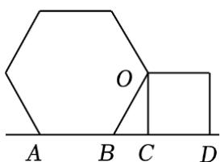

【解答】解：∵图中六边形为正六边形， 

$$
\therefore \angle A B O = (6 - 2) \times 1 8 0 ^ {\circ} \div 6 = 1 2 0 ^ {\circ},
$$

$$
\therefore \angle O B C = 1 8 0 ^ {\circ} - 1 2 0 ^ {\circ} = 6 0 ^ {\circ}
$$

∵正方形中， $O C \bot C D$ 

$\therefore \angle O C B = 9 0 ^ { \circ }$ 

∴∠BOC＝180°﹣90°﹣60°＝30°， 

故答案为： $3 0 ^ { \circ }$ 

13．（1）正八边形的每个内角是每个外角的m 倍，求m 的值； 

（2）一个多边形的外角和是内角和的 $\frac { 1 } { 6 }$ ，求这个多边形的边数 

【解答】解：（1）∵正八边形的每个内角为： $( 8 \textrm { - } 2 ) \times 1 8 0 ^ { \circ } \ \div 8 = 1 3 5 ^ { \circ }$ 

∴它的每个外角为： $1 8 0 ^ { \circ } \ \textrm { ~ - } 1 3 5 ^ { \circ } \ = 4 5 ^ { \circ }$ 

则 $m = 1 3 5 \div 4 5 = 3$ ； 

（2）设这个多边形的边数为 n， 

则 $( n - 2 ) \bullet 1 8 0 ^ { \circ } \times \frac { 1 } { 6 } = 3 6 0 ^ { \circ }$ 

解得： $n { = } 1 4$ 

即这个多边形的边数为14 

14．已知，如图，AD与BC 交于点O 

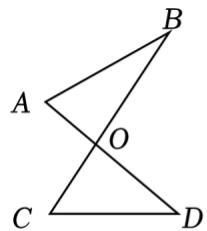

图1

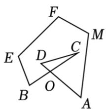

图2

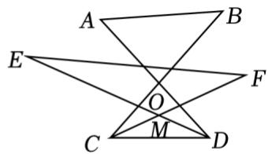

图3

（1）如图1，判断 $\angle A + \angle B$ 与 $\angle C + \angle D$ 的数量关系： ，并证明你的结论 

（2）如图2， $\angle A + \angle B + \angle C + \angle D + \angle E + \angle F + \angle M$ 的度数为 

（3）如图 3，若 $C F$ 平分 $\angle B C D , ~ D E$ 平分 $\angle A D C$ $C F$ 与 DE 交于点 M， $\angle E + \angle F = 5 0 ^ { \circ }$ ，请直接写出 $\angle A + \angle B =$ 

【解答】解：（1） $\because \angle A O B + \angle A + \angle B = 1 8 0 ^ { \circ } \ = \angle C O D + \angle C + \angle D , \angle A O B = \angle C O D ,$ 

$$
\therefore \angle A + \angle B = \angle C + \angle D
$$

故答案为： $\angle A + \angle B = \angle C + \angle D ;$ 

（2）如图2，连接AB， 

由（1）得， $\angle O B A + \angle O A B = \angle C + \angle D$ 

$\therefore \angle D A M + \angle C B E + \angle C + \angle D + \angle E + \angle F + \angle M$ 的度数为五边形 $A B E F M$ 的内角和， 

即 $( 5 - 2 ) \times 1 8 0 ^ { \circ } = 5 4 0 ^ { \circ }$ 

故答案为： $5 4 0 ^ { \circ }$ 

（3） $\because C F$ 平分∠BCD，DE平分 $\angle A D C$ 

$$
\therefore \angle M C D = \frac {1}{2} \angle O C D, \angle M D C = \frac {1}{2} \angle O D C,
$$

由（1）可得， $\angle E + \angle F = \angle M C D + \angle M D C ,$ 

$$
\therefore \frac {1}{2} \angle O C D + \frac {1}{2} \angle O D C = 5 0 ^ {\circ}
$$

$$
\therefore \angle O C D + \angle O D C = 1 0 0 ^ {\circ}
$$

$$
\therefore \angle A + \angle B = \angle O C D + \angle O D C = 1 0 0 ^ {\circ}
$$

故答案为： $1 0 0 ^ { \circ }$ 

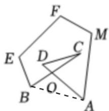

图2

15．如图，四边形ABCD中， $\angle C = 9 0 ^ { \circ }$ ，BE平分 $\angle A B C$ ，BE、CD 交于 G 点 

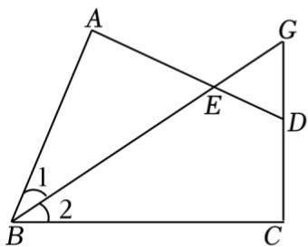

图1

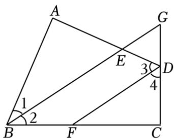

图2

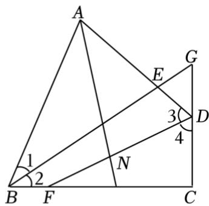

图3

（1）如图1，若 $\angle A = 9 0 ^ { \circ }$ 

①求证： $\angle E D G = \angle A B C$ ； 

②作DF 平分 $\angle A D C$ ，如图 2，求证： $D F / / B G$ 

（2）如图 3，作 DF 平分 $\angle A D C$ ，在锐角 $\angle B A D$ 内部作射线 AN，交 DF 于 N，若 $\angle A N D - \angle G B C$ 的大 小为 $4 5 ^ { \circ }$ °，试说明：AN平分 $\angle B A D$ 

【解答】证明：（1） $\textcircled { 1 } \because \angle C = 9 0 ^ { \circ } , \angle A = 9 0 ^ { \circ }$ 

$$
\therefore \angle A B C + \angle A D C = 3 6 0 ^ {\circ} - 9 0 ^ {\circ} - 9 0 ^ {\circ} = 1 8 0 ^ {\circ}
$$

$$
\because \angle E D G + \angle A D C = 1 8 0 ^ {\circ}
$$

$$
\therefore \angle E D G = \angle A B C;
$$

② $\because B E$ 平分 $\angle A B C$ 

$$
\therefore \angle 1 = \angle 2 = \frac {1}{2} \angle A B C,
$$

$\because D F$ 平分 $\angle A D C$ 

$\therefore \angle 3 = \angle 4 = \frac { 1 } { 2 } \angle A D C ,$ $\therefore \angle 2 + \angle 4 = \frac { 1 } { 2 } \angle A B C + \frac { 1 } { 2 } \angle A D C = 9 0 ^ { \circ }$ $\because \angle C = 9 0 ^ { \circ }$ $\therefore \angle D F C + \angle 4 = 9 0 ^ { \circ }$ $\therefore \angle 2 = \angle D F C ,$ $\therefore D F / / B G ;$ 

（2）延长AB、DF交于点 M，如图所示： 

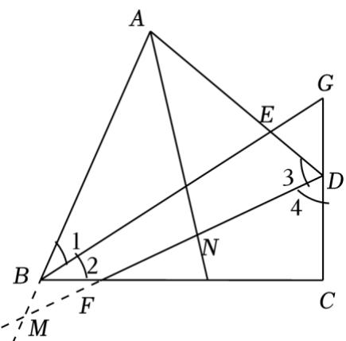

$\because \angle A N D - \angle G B C = 4 5 ^ { \circ }$ $\therefore \angle A N D = \angle 2 + 4 5 ^ { \circ }$ $\therefore \angle D A N = 1 8 0 ^ { \circ } \quad - \angle A N D - \angle 3$ $= 1 8 0 ^ { \circ } - \angle 2 - 4 5 ^ { \circ } - \angle 3$ $= 1 3 5 ^ { \circ } - \angle 2 - \angle 3 ,$ $\because B E$ 平分 $\angle A B C ,$ $\therefore \angle 1 = \angle 2 = \frac { 1 } { 2 } \angle A B C ,$ $\because D F$ 平分 $\angle A D C ,$ $\therefore \angle 3 = \angle 4 = \frac { 1 } { 2 } \angle A D C ,$ $\because \angle B F M = \angle C F D = 9 0 ^ { \circ } - \angle 4 = 9 0 ^ { \circ } - \angle 3 ,$ $\therefore \angle A M N = \angle A B C - \angle B F M = 2 \angle 2 - 9 0 ^ { \circ } + \angle 3 ,$ $\therefore \angle B A N = \angle A N D \cdot \angle A M N$ $= 4 5 ^ { \circ } + \angle 2 - 2 \angle 2 + 9 0 ^ { \circ } - \angle 3$ $= 1 3 5 ^ { \circ } - \angle 2 - \angle 3 ,$ $\therefore \angle D A N { = } \angle B A N ,$ $\therefore A N$ 平分 $\angle B A D .$ 