
# 第 03 讲 多边形及其内角和

## 学习目标

<table><tr><td>课程标准</td><td>学习目标</td></tr><tr><td>1多边形的认识2多边形的内角和与外角和3正多边形</td><td>1. 掌握多边形及其与多边形有关的概念。2. 掌握多边形的内角和计算公式,内角和公式的推导过程及其相关计算,掌握多边形的外角和度数。3. 掌握正多边形的概念,且根据正多边形的性质解决相应的题目。</td></tr></table>

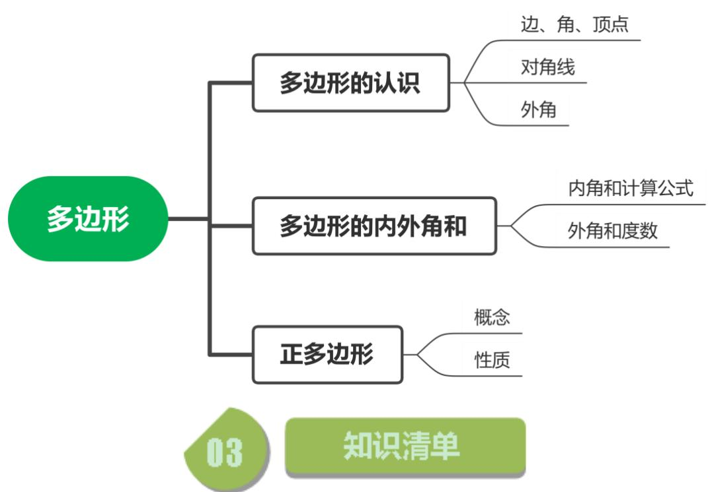

## 知识点01 多边形的认识

1. 多边形的概念： 

在平面内，由多条线段首位顺次连接所组成的图形是多边形。组成的线段有多少条，则图形就是一个 几边形。 

2. 多边形的相关概念： 

如图：组成多边形的线段叫做多边形的 ；相邻两条边的交 点叫多边形的 ；相邻两条边构成的角是多边形的 任意两个不相邻的顶点间的连线段叫做多边形的 ；多边形的 边与邻边的延长线构成的角叫做多边形的 

题型考点：判断图形。 

## 【即学即练 1】

1. 如图所示的图形中，属于多边形的有（ ）个 

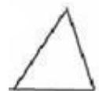

A．3 

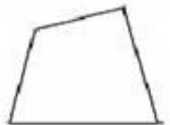

B．4 

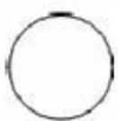

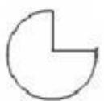

C．5 

D．6 

## 知识点02 多边形的内角和外角和

1. 多边形的对角线计算： 

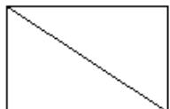

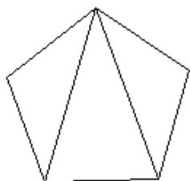

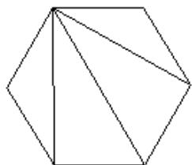

总结规律：若多边形的边数为n，则多边形一个顶点的对角线条数为 条，多边形所有的对角 线条数为 条。 

2. 多边形一个顶点的对角线把多边形分成的三角形数量计算： 

由上图总结：一个顶点的对角线分多边形成三角形的个数为： 个。 

3. 多边形的内角和计算公式： 

由上图可知，多边形的内角和等于图中所有三角形的内角和之和。即： C 

4. 多边形的外角和： 

任意多边形的外角和都等于 

题型考点：①利用内角和公式求内角和或求多边形的边数。 

②利用多边形的内外角关系计算。 

## 【即学即练 1】

2. 十二边形的内角和是（ ） A $1 4 4 0 ^ { \circ }$ B $1 6 2 0 ^ { \circ }$ C．1800 D $1 9 8 0 ^ { \circ }$ 

3. 若一个多边形的内角和是1080度，则这个多边形的边数为（ ） A．6 B．7 C．8 D．10 

## 【即学即练 2】

4. 多边形的边数由3增加到2021时，其外角和的度数（ ） A．增加 B．减少 C．不变 D．不能确定 

## 【即学即练 3】

5. 一个多边形的内角和比它的外角和的3倍少 180°，则这个多边形的边数是 

6. 若一个多边形的内角和比外角和大 $3 6 0 ^ { \circ }$ ，则这个多边形的边数为 

## 知识点03 正多边形

1. 正多边形的概念： 

每条边都 ，每个内角都 的多边形是正多边形。 

2. 正多边形的每个内角计算： 

因为正多边形的内角和为 $\left( n - 2 \right) \cdot 1 8 0 ^ { \circ }$ ，每个内角都相等且有 个内角，所以正多边形的每个内角度数 为： 

3. 正多边形的每个外角计算： 

正多边形的外角和是 $3 6 0 ^ { \circ }$ ，每个外角也相等，所以正多边形的每个外角度数为 C 

4. 正多边形的内角与外交关系： 

${ \frac { \left( n - 2 \right) \cdot 1 8 0 ^ { \circ } } { n } } + { \frac { 3 6 0 ^ { \circ } } { n } } =$ ； 

题型考点：利用正多边形的相关计算公式计算。 

## 【即学即练 1】

7. 若一个多边形的每个内角都为 $1 3 5 ^ { \circ }$ ，则它的边数为（ ） A．6 B．8 C．5 D．10 

8. 一个多边形的每一个外角都等于 $3 6 ^ { \circ }$ ，那么这个多边形的内角和是 

9. 如果一个正多边形的一个内角与一个外角的度数之比是 7：2，那么这个正多边形的边数是（ ） A．11 B．10 C．9 D．8 

## 题型01 多边形的截角问题

## 【典例 1】

如图，在△ABC中， $\angle C = 7 0 ^ { \circ }$ ，沿图中虚线截去∠C，则∠1+∠2＝（ ） 

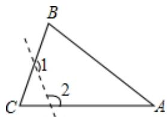

A $1 4 0 ^ { \circ }$ B $1 8 0 ^ { \circ }$ C $2 5 0 ^ { \circ }$ D $3 6 0 ^ { \circ }$ 

变式 1： 

一个多边形截去一个角（截线不过顶点）之后，所形成的多边形的内角和是 $2 5 2 0 ^ { \circ }$ ，那么原多边形的边数 是（ ） A．19 B．17 C．15 D．13 

变式 2： 

一个多边形截去一个角后，形成的另一个多边形的内角和是 $1 6 2 0 ^ { \circ }$ ，则原来多边形的边数是（ ） A．10 B．11 C．12 D．10 或 11 或 12 

变式 3： 

一个多边形截去一个角后，形成另一个多边形的内角和为 $1 4 4 0 ^ { \circ }$ ，则原多边形的边数是 

## 题型02 实际生活与正多边形

【典例 1】 

小华从 A点出发向前直走50m，向左转 $1 8 ^ { \circ }$ ，继续向前走 50m，再向左转 $1 8 ^ { \circ }$ ，他以同样的走法回到A 点 时，共走了 m 

变式 1： 

如图，小明从点 A 出发沿直线前进 10 米到达点 B，向左转 $4 5 ^ { \circ }$ 后又沿直线前进 10 米到达点 C，再向左转 $4 5 ^ { \circ }$ 后沿直线前进10米到达点D…照这样走下去，小明第一次回到出发点A时所走的路程为（ ） 

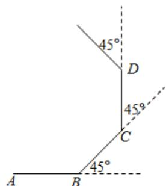

A．100 米 B．80 米 C．60 米 D．40 米 

【典例 2】 

一名模型赛车手遥控一辆赛车，先前进1m，然后，原地逆时针方向旋转角 $a ~ \left( 0 ^ { \circ } ~ < \alpha < 1 8 0 ^ { \circ } \right.$ ）被称为一次 操作．若五次操作后，发现赛车回到出发点，按照向量考虑，则角α 为（ ） A $7 2 ^ { \circ }$ B． $1 0 8 ^ { \circ }$ 或 144° C $1 4 4 ^ { \circ }$ D． $7 2 ^ { \circ }$ 或 $1 4 4 ^ { \circ }$ 

变式 1： 

活动课上，小华从点 O 出发，每前进 1 米，就向右转体 $a ^ { \circ } \quad ( 0 < a < 1 8 0 )$ ），照这样走下去，如果他恰好能 回到O点，且所走过的路程最短，则 a的值等于 

## 题型03 正多边形的图形组合

【典例 1】 

如图，平面上两个正方形与正五边形都有一条公共边，则 α 的度数为（ ） 

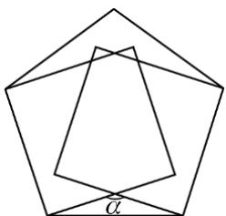

A $3 6 ^ { \circ }$ B $9 2 ^ { \circ }$ C $1 4 4 ^ { \circ }$ D $1 5 0 ^ { \circ }$ 

变式 1： 

如图，由一个正六边形和正五边形组成的图形中，∠ABC的度数应是（ ） 

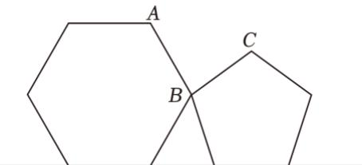

A $7 2 ^ { \circ }$ B $8 4 ^ { \circ }$ C $8 2 ^ { \circ }$ D $9 4 ^ { \circ }$ 

变式 2： 

如图，正六边形 ABCDEF和正五边形 GHCDL的边CD 重合，DH 的延长线与AB交于点 P，则 $\angle B P D$ 的度 数是（ ） 

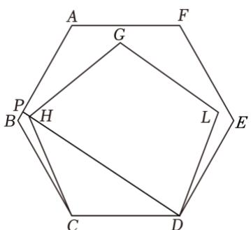

A $8 3 ^ { \circ }$ B $8 4 ^ { \circ }$ C $8 5 ^ { \circ }$ D $8 6 ^ { \circ }$ 

## 变式 3：

把边长相等的正六边形 ABCDEF 和正五边形 GHCDM 的 CD 边重合，按照如图的方式叠合在一起，延长 MG 交 AF 于点 N，则 $\angle A N G$ 等于（ ） 

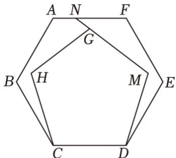

A $1 4 0 ^ { \circ }$ B $1 4 4 ^ { \circ }$ C $1 4 8 ^ { \circ }$ D $1 5 0 ^ { \circ }$ 

## 强化训练

1．八边形的内角和是外角和的（ ）倍 A．2 B．3 C．4 D．5 

2．下列角度不可能是多边形内角和的为（ ） A $1 8 0 ^ { \circ }$ B $2 7 0 ^ { \circ }$ C $5 4 0 ^ { \circ }$ D $1 4 4 0 ^ { \circ }$ 

3．如图， $\angle C + \angle D + \angle E - \angle A - \angle B$ 的度数是（ ） 

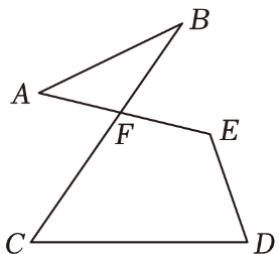

A $1 8 0 ^ { \circ }$ B $2 4 0 ^ { \circ }$ C $3 0 0 ^ { \circ }$ D $3 6 0 ^ { \circ }$ 

4．清明节当天八年级某班组织学生去烈士林园为革命先烈扫墓，以此表达对先烈的追思和崇敬之情，细心 灯小明发现革命烈士纪念塔的塔底平面为八边形，这个八边形的内角和（ ） A $7 2 0 ^ { \circ }$ B $9 0 0 ^ { \circ }$ C．1080 D $1 4 4 0 ^ { \circ }$ 

5．如图，四边形 ABCD 为一矩形纸带，点 E、F 分别在边 AB、CD 上，将纸带沿 $E F$ 折叠，点 A、D 的对 应点分别为A'、D'，若 $\angle 2 = 3 5 ^ { \circ }$ ，则∠1的度数为（ ） 

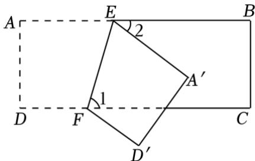

A $6 2 . 5 ^ { \circ }$ B $7 2 . 5 ^ { \circ }$ C $5 5 ^ { \circ }$ D $4 5 ^ { \circ }$ 

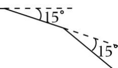

6．如图，奇奇先从点 A 出发前进 4m，向右转 $1 5 ^ { \circ }$ ，再前进 4m，又向右转 $1 5 ^ { \circ }$ ，…，这样一直走下去， 他第一次回到出发点A时，一共走了（ ） A 515° 15 A $2 4 m$ B．48m C．64m D．96m 

7．若一个正多边形每一个外角都相等，且一个内角的度数是 $1 4 0 ^ { \circ }$ ，则这个多边形是（ ） A．正七边形 B．正八边形 C．正九边形 D．正十边形 

8．如图，在五边形ABCDE 中， $A E / / C D$ $\angle 1 = 5 0 ^ { \circ }$ $\angle 2 = 7 0 ^ { \circ }$ ，则∠3的度数是（ ） 

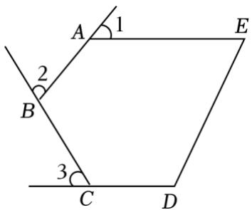

A $4 0 ^ { \circ }$ B $5 0 ^ { \circ }$ C $6 0 ^ { \circ }$ D $7 0 ^ { \circ }$ 

9．如图所示， $\angle A + \angle B + \angle C + \angle D + \angle E + \angle F =$ 

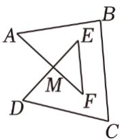

第 9 题

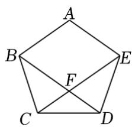

第 10 题

10．如图，正五边形ABCDE的对角线BD、CE 相交于点F，则 $\angle C F D$ 的度数为 

11．如图，四边形 ABOC 中， $\angle B A C \ H \angle B O C$ 的角平分线相交于点 P，若 $\angle B = 1 6 ^ { \circ }$ $\angle C { = } 4 2 ^ { \circ }$ ，则 $\angle P$ 

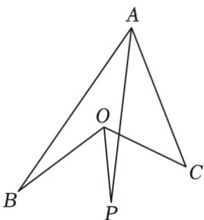

第 11 题

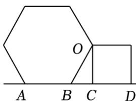

第 12 题

12．将正六边形与正方形按如图所示摆放，且正六边形的边AB与正方形的边CD在同一条直线上，则 $\angle B O C$ 的度数是 

13．（1）正八边形的每个内角是每个外角的m 倍，求m 的值； 

（2）一个多边形的外角和是内角和的 $\frac { 1 } { 6 }$ ，求这个多边形的边数 

14．已知，如图，AD与BC 交于点O 

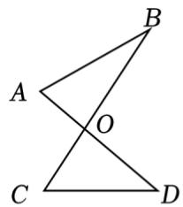

图1

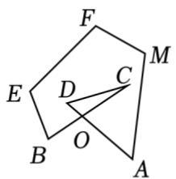

图2

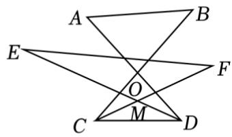

图3

（1）如图1，判断 $\angle A + \angle B  \angle C + \angle D$ 的数量关系： ，并证明你的结论 

（2）如图 2， $\angle A + \angle B + \angle C + \angle D + \angle E + \angle F + \angle M$ 的度数为 

（3）如图3，若 $C F$ 平分 $\angle B C D$ ，DE 平分 $\angle A D C , \ C F$ 与DE交于点M， $\angle E + \angle F = 5 0 ^ { \circ }$ ，求出 $\angle A + \angle B$ 的度数。 

15．如图，四边形ABCD中， $\angle C = 9 0 ^ { \circ }$ ，BE 平分 $\angle A B C$ ，BE、CD 交于 G 点 

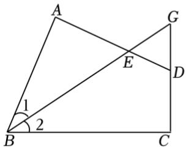

图1

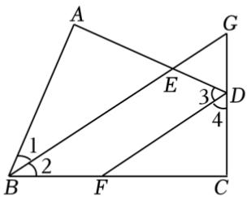

图2

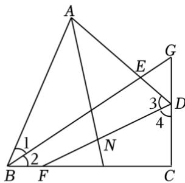

图3

（1）如图 1，若 $\angle A = 9 0 ^ { \circ }$ 

①求证： $\angle E D G = \angle A B C$ ； 

②作 $D F$ 平分 $\angle A D C$ ，如图 2，求证： $D F / / B G$ 

（2）如图 3，作 $D F$ 平分 $\angle A D C .$ ，在锐角 $\angle B A D$ 内部作射线 AN，交 $D F$ 于 N，若 $\angle A N D - \angle G B C$ 的大 小为 $4 5 ^ { \circ }$ °，试说明： $A N$ 平分 $\angle B A D$ 