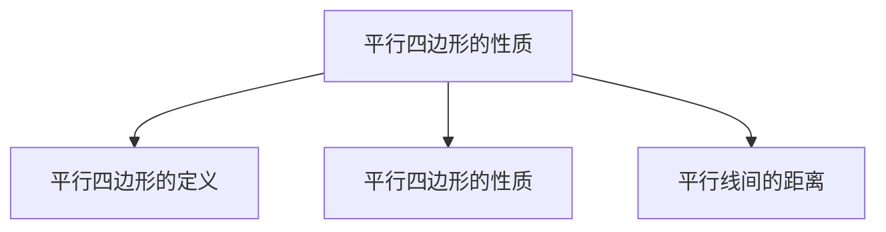

## 第 01 讲 平行四边形的性质

## 01

## 学习目标

| 课程标准 | 学习目标 |
| --- | --- |
| 1平行四边形的概念2平行四边形的性质3平行线间的距离 | 1. 掌握平行四边形的概念并能够进行简单的判断。2. 掌握平行四边形的性质并能够熟练的进行相关的应用。3. 掌握平行线间的距离并熟练应用 |

## 02

## 思维导图

flowchart

##

##

## 知识点01 平行四边形的概念

## 1. 平行四边形的概念：

有两组对边分别 平行 的四边形叫做平行四边形。用符号“▱”来表示。平行四边形 ABCD 表示为 \(^{\dag \dag} \bigcup A B C D^{\dag \prime}\) 。

## 知识点02 平行四边形的性质

## 1. 平行四边形的性质：

①边的性质：平行四边形的两组对边分别 平行且相等 （平行由定义证明，相等由连接对角线证明全等可得）。  
②角的性质：平行四边形的邻角 互补 ，对角 相等 。（由平行与邻角转换可得）

③对角线的性质：平行四边形的对角线 相互平分 （连接两条对角线证明全等可得）。

④平行四边形的面积计算：等于 底×高 。

⑤平行四边形的对称性：是一个中心对称图形。

⑥过对角线交点的直线把平行四边形分成两个全等的图形。直线与对边的交点到对角线的交点的距离相等。

## 【即学即练1】

1．以下平行四边形的性质错误的是（ ）

A．对边平行

B．对角相等

C．对边相等

D．对角线互相垂直

【解答】解：A、平行四边形的对边相互平行，故本选项不符合题意；

B、平行四边形的对角相等，故本选项不符合题意；  
C、平行四边形的对边相等，故本选项不符合题意；  
D、平行四边形的对角线相互平分，但不一定互相垂直，故本选项符合题意；

故选：D．

## 【即学即练2】

2．如图，在▭ ABCD 中， \(\angle A + \angle C = 80^{\circ}\) °，则\(\angle D\)＝（ ）

natural_image

Simple geometric diagram of a parallelogram labeled A, B, C, D (no additional text or symbols)

A． \(80^{\circ}\)

B． \(40^{\circ}\)

C． \(70^{\circ}\)

D． \(140^{\circ}\)

【解答】解：∵四边形 ABCD 是平行四边形，

$\(\therefore \angle A = \angle C, A B \parallel C D, $\)

$\(\therefore \angle A + \angle D = 180^{\circ}, $\)

$\(\because \angle A + \angle C = 80^{\circ}, $\)

$\(\therefore \angle A = \angle C = 40^{\circ}, $\)

$\(\therefore \angle D = 180^{\circ} - \angle A = 140^{\circ}, $\)

故选：D．

## 【即学即练3】

3．如图，▱ ABCD 的对角线 AC、BD 相交于点 O，且 AC+BD＝12，CD＝4，则\(\triangle ABO\) 的周长是（ ）

A．9

B．10

C．11

D．12

【解答】解：∵四边形 ABCD 是平行四边形，

$\(\therefore A O = C O, B O = D O, A B = C D = 4, $\)

$\(\because A C + B D = 12, $\)

$\(\therefore A O + B O = 6, $\)

\(\therefore \triangle A B O\) 的周 \(\ ! \ k = \ l_{A} O + O B + \ l_{A} B = 6 + 4 = 10\)

故选：B．

## 知识点03 平行线间的距离

1. 平行线间的距离的定义：

一组平行线中，其中一条平行线上任意一点到另一条平行线的 距离 是这一组平行间的距离。

2. 平行线间的距离的性质：

①两条平行线间的距离 处处相等 。

②平行线间的平行线段 相等 。

## 【即学即练1】

4．如图，已知 \(l_{1} \parallel l_{2}\) ，\(AB \parallel CD\)， \(C E \bot l_{2}\) 于点 E， \(F G \bot l_{2}\) 于点 G，则下列说法中错误的是（

A． \(A B = C D\)

B． \(C E = F G\)

C．A、B 两点间距离就是线段 AB 的长度

D．l1与 l2两平行线间的距离就是线段 CD 的长度

【解答】解： \(A \ 、 \ : \because l_{1} \parallel l_{2}, \ A B \parallel C D\) ，

∴四边形 ABDC 是平行四边形，

\(\therefore A B = C D\) ，故本选项正确；

B、 \(\because l_{1} \parallel l_{2}, C E \bot l_{2}\) 于点 E， \(F G \bot l_{2}\) 于点 G，

∴四边形 CEGF 是平行四边形，

\(\therefore C E = F G\) ，故本选项正确；

C、 \(\because A B\) 是线段，

∴A、B 两点间距离就是线段 AB 的长度，故本选项正确；

D、 \(\because C E \bot l_{2}\) 于点 E，

∴l 与 l 两平行线间的距离就是线段 CE 的长度，故本选项错误

故选：D．

## 题型 01 平行线的性质的理解判断

【典例 1】关于平行四边形的性质，下列描述错误的是（ ）

A．平行四边形的对角线相等  
B．平行四边形的对角相等  
C．平行四边形的对角线互相平分  
D．平行四边形的对边平行且相等

【解答】解：∵平行四边形的性质是：对边相等且平行；对角相等，邻角互补；对角线互相平分

∴B、C、D 正确，A 错误，

故选：A．

【变式 1】平行四边形不一定具有的性质是（ ）

A．对边平行且相等

B．对角相等

C．对角线相等

D．对角线互相平分

【解答】解：∵平行四边形的对边平行且相等，对角相等，对角线互相平分，

∴平行四边形不一定具有的性质是 C 选项

故选：C

【变式 2】如图所示，在平行四边形 ABCD 中，对角线 AC、BD 交于点 O，下列结论中一定成立的是（ ）

A．\(AC \bot BD\)

B．OA＝OC

C．AC＝AB

D．OA＝OB

【解答】解：∵四边形 ABCD 是平行四边形，

$\(\therefore O A = O C, \quad A B = D C, $\)

故 A、C、D 错误，不符合题意；

故选：B．

【变式 3】平行四边形 ABCD 的对角线 AC 与 BD 交于点 O，若 \(\angle A O B = 180^{\circ} \quad - 2 \angle B A O\) ，那么下列说法正确的是（ ）

A．AB＝OB

B．AB＝OA

C．AC＝BD

D．\(AC \bot BD\)

【解答】解： \(\because \angle A O B + \angle B A O + \angle O B A = 180^{\circ}, \angle A O B = 180^{\circ} - 2 \angle B A O,\) ，

$\(\therefore \angle B A O = \angle O B A, $\)

$\(\therefore O A = O B, $\)

∵四边形 ABCD 为平行四边形，

$\(\therefore A C = 2 O A, B D = 2 O B, $\)

$\(\therefore A C = B D, $\)

故选：C

## 题型 02 平行四边形的性质与角度的计算

【典例 1】在▱ ABCD 中，若 \(\angle A = \angle B + 50^{\circ}\) ，则 \(\angle B\) 的度数为 65 度．

【解答】解：∵四边形 ABCD 是平行四边形，

$\(\therefore \angle A + \angle B = 180^{\circ}, $\)

$\(\because \angle A = \angle B + 50^{\circ}, $\)

$\(\therefore \angle B = 65^{\circ}, \angle A = 115^{\circ}, $\)

故答案为：65．

【变式 1】在▱ ABCD 中， \(\angle A + \angle C = 220^{\circ}\) °，则 \(\angle D\) 的度数是（ ）

A． \(70^{\circ}\)

B． \(80^{\circ}\)

C． \(90^{\circ}\)

D． \(110^{\circ}\)

【解答】解：∵四边形 ABCD 是平行四边形，

$\(\therefore \angle A = \angle C, A B \parallel C D, $\)

$\(\because \angle A + \angle C = 220^{\circ}, $\)

$\(\therefore \angle A = \angle C = 110^{\circ}, $\)

$\(\therefore \angle D = 180^{\circ} - \angle B = 70^{\circ}. $\)

故选：A．

【变式 2】如图，平行四边形 ABCD 中，\(\angle ABC\) 的平分线交 AD 于 E， \(\angle B E D = 155^{\circ}\) °，则\(\angle A\) 的度数为（ ）

A． \(155^{\circ}\) °

B． \(130^{\circ}\)

C． \(125^{\circ}\)

D． \(110^{\circ}\)

【解答】解：∵四边形 ABCD 是平行四边形，

$\(\therefore A D \parallel B C, $\)

$\(\therefore \angle A E B = \angle C B E, $\)

\(\because \angle A B C\) 的平分线交 AD 于 E， \(\angle B E D = 155^{\circ}\) °

$\(\therefore \angle A B E = \angle C B E = \angle A E B = 180^{\circ} - \angle B E D = 25^{\circ}, $\)

$\(\therefore \angle A = 180^{\circ} - \angle A B E - \angle A E B = 130^{\circ}. $\)

故选：B．

【变式 3】如图，在▱ ABCD 中， \(\angle A = 68^{\circ}\) ，DB＝DC，\(CE \bot BD\) 于 E，则\(\angle BCE\) 的度数为 \(22^\circ\)

【解答】解：∵四边形 ABCD 是平行四边形，

$\(\therefore \angle B C D = \angle A = 68^{\circ}, $\)

$\(\because D B = D C, $\)

$\(\therefore \angle D B C = \angle B C D = 68^{\circ}, $\)

$\(\because C E \perp B D, $\)

$\(\therefore \angle C E B = 90^{\circ}, $\)

$\(\therefore \angle B C E = 90^{\circ} - 68^{\circ} = 22^{\circ}. $\)

故答案为： \(22^{\circ}\)

【变式 4】如图，在平行四边形 ABCD 中， \(\angle B = 60^{\circ}\) °，AE 平分 \(\angle B A D\) 交 BC 于点 E，若 \(\angle A E D = 80^{\circ}\) °，则 \(\angle A C E\) 的度数是（ ）

A． \(30^{\circ}\)

B． \(35^{\circ}\)

C． \(40^{\circ}\)

D． \(45^{\circ}\)

【解答】解：∵四边形 ABCD 是平行四边形，

$\(\therefore A B = C D, \angle B = \angle A D C = 60^{\circ}, A D \parallel B C, $\)

$\(\therefore \angle B A D = 180^{\circ} - \angle B = 180^{\circ} - 60^{\circ} = 120^{\circ}, $\)

∵AE 平分 \(\angle B A D\) ，

$\(\therefore \angle B A E = \angle D A E = \frac {1}{2} \angle B A D = 60^{\circ}, $\)

\(\therefore \angle B = \angle D A E\) ，\(\triangle ABE\) 是等边三角形，

$\(\therefore A B = A E, \angle A E B = \angle B A E = 60^{\circ}, $\)

在\(\triangle BAC\) 和\(\triangle AED\) 中，

$\(\begin{array}{l} \left\{ \begin{array}{l} A B = E A \\ \angle B = \angle D A E, \\ B C = A D \end{array} \right. \\ \therefore \triangle B A C \cong \triangle A E D (S A S), \\ \therefore \angle B A C = \angle A E D = 80^{\circ}, \\ \therefore \angle E A C = \angle B A C - \angle B A E = 80^{\circ} - 60^{\circ} = 20^{\circ}, \\ \therefore \angle A C E = \angle A E B - \angle E A C = 60^{\circ} - 20^{\circ} = 40^{\circ}. \\ \end{array} $\)

故选：C

## 题型 03 平行四边形的性质与线段长度的计算

【典例 1】如图，平行四边形 ABCD 的对角线 AC 与 BD 相交于点 O，\(AB \bot AC\)，若 AB＝8，AC＝12，则 BD的长是（ ）

A．16

B．18

C．20

D．22

【解答】解：∵四边形 ABCD 是平行四边形，AC＝12，

$\(\therefore O B = O D, \quad O A = O C = \frac {1}{2} A C = 6, $\)

$\(\because A B \perp A C, $\)

由勾股定理得：OB＝ \(O B = \sqrt { \tt A B^{2} + 0 A^{2} } = \sqrt { 8^{2} + 6^{2} } = 10\) ，

$\(\therefore B D = 2 O B = 20. $\)

故选：C

【变式 1】如图，在平行四边形 ABCD 中，AB＝3，AD＝5，\(\angle ABC\) 的平分线交 AD 于 E，交 CD 的延长线于点 F，则 DF＝（ ）

A．4

B．3

C．2

D．1

【解答】解：∵四边形 ABCD 是平行四边形，

$\(\therefore A B \parallel C D, A D \parallel B C, $\)

$\(\therefore \angle A B F = \angle F, \angle A E B = \angle C B E, $\)

∵BE 平分 \(\angle A B C\) ，

$\(\therefore \angle A B E = \angle C B E, $\)

$\(\therefore \angle A E B = \angle A B E = \angle F = \angle D E F, $\)

$\(\therefore A E = A B = 3, $\)

$\(\therefore D F = D E = A D - A E = 5 - 3 = 2, $\)

故选：C

【变式 2】在▱ ABCD 中，尺规作图后留下的痕迹如图所示，若 AB＝3cm，AD＝10cm，则 EF 的长为（ ）

A．3cm

B．3.5cm

C．4cm

D．4.5cm

【解答】解：∵四边形 ABCD 是平行四边形，

$\(\therefore A B = C D = 3 c m, \quad A D \parallel B C, $\)

由尺规作图后留下的痕迹可知，BE 平分 \(\angle A B C\) ，CF 平分 \(\angle B C D\) ，

$\(\therefore \angle A B E = \angle C B E, \angle D C F = \angle B C F, $\)

$\(\because A D \parallel B C, $\)

$\(\therefore \angle A E B = \angle C B E, \angle D F C = \angle B C F, $\)

$\(\therefore \angle A B E = \angle A E B, \angle D C F = \angle D F C, $\)

$\(\therefore A E = A B = 3 c m, \quad C D = D F = 3 c m, $\)

$\(\therefore E F = A D - A E - D F = 10 - 3 - 3 = 4 (c m), $\)

故选：C

【变式 3】如图，在▱ ABCD 中，\(\angle ABC\)、\(\angle BCD\) 的角平分线交于边 AB 上一点 E，且 \(B E = A B = \sqrt { 3 }\) ，线段CE 的长为（ ）

A． \(2 \sqrt { 3 }\)

B． \(3 \sqrt { 2 }\)

C． \(- 2 \sqrt { 3 }\)

D．3

【解答】解：∵四边形 ABCD 是平行四边形，

$\(\therefore A B = D C = \sqrt {3}, A D = B C, A D \parallel B C, A B \parallel C D, $\)

$\(\therefore \angle A B C + \angle B C D = 180^{\circ}, $\)

\(\because \angle A B C, \angle B C D\) 的角平分线交于边 AB 上一点 E，

$\(\begin{array}{l} \therefore \angle A B E = \angle C B E, \angle D C E = \angle B C E, \\ \therefore \angle E B C + \angle E C B = 90^{\circ}, \\ \therefore \angle B E C = 90^{\circ}, \\ \because A D \parallel B C, \\ \therefore \angle A E B = \angle C B E = \angle A B E, \quad \angle D E C = \angle B C E = \angle D C E, \\ \therefore A B = A E = \sqrt {3}, D E = D C = \sqrt {3}, \\ \therefore A D = B C = 2 \sqrt {3}, \\ \therefore C E = \sqrt {B C^{2} - B E^{2}} = \sqrt {12 - 3} = 3, \\ \end{array} $\)

故选：D．

【变式 4】如图，▱ ABCD 的顶点 C 在等边 \(\triangle B E F\) 的边 BF 上，点 E 在 AB 的延长线上，G 为 DE 的中点，连接 CG．若 \(A D = 5, A B = C F = 3\) ，则 CG 的长为 \(- \frac { 5 } { 2 } -\)

【解答】解：∵四边形 ABCD 是平行四边形，

$\(\therefore A D = B C, \quad C D = A B, \quad D C \parallel A B, $\)

$\(\because A D = 5, \quad A B = C F = 3, $\)

$\(\therefore C D = 3, B C = 5, $\)

$\(\therefore B F = B C + C F = 8, $\)

\(\because \triangle B E F\) 是等边三角形，G 为 DE 的中点，

$\(\therefore B F = B E = 8, D G = E G, $\)

延长 CG 交 BE 于点 H，

$\(\because D C \parallel A B, $\)

$\(\therefore \angle C D G = \angle H E G, $\)

在 \(\triangle D C G\) 和 \(\triangle E H G\) 中，

$\(\left\{ \begin{array}{l} \angle C D G = \angle H E G \\ D G = E G \\ \angle D G C = \angle E G H \end{array}, \right. $\)

$\(\therefore \triangle D C G \cong \triangle E H G (A S A), $\)

$\(\therefore D C = E H, \quad C G = H G, $\)

$\(\because C D = 3, B E = 8, $\)

$\(\therefore H E = 3, B H = 5, $\)

$\(\because \angle C B H = 60^{\circ}, B C = B H = 5, $\)

\(\therefore \triangle C B H\) 是等边三角形，

$\(\therefore C H = B C = 5, $\)

$\(\therefore C G = \frac {1}{2} C H = \frac {5}{2}, $\)

故答案为： \(\frac { 5 } { 2 }\)

## 题型04 平行四边形的面积

【典例 1】观察如图中的三个平行四边形，你认为说法正确的是（ ）

A．它们形状相同，面积相等  
B．它们形状相同，面积不相等  
C．它们形状不相同，面积相等  
D．它们形状不相同，面积不相等

【解答】解：图中三个平行四边形的形状不相同，但面积均为： \(3 \times 5 = 15 ( c m^{2} )\) ），

故选：C

【变式 1】一个平行四边形两条邻边的长度分别是 6cm、8cm，且一条底边上的高是 7cm，则这个平行四边形的面积是（ ） \(c m^{2}\) ．

A． \(42 c m^{2}\)  
B． \(56 c m^{2}\)  
C． \(48 c m^{2}\)  
D． \(42 c m^{2}\) 或者 \(56 c m^{2}\)

【解答】解：∵一个平行四边形两条邻边的长度分别是 6cm、8cm，且一条底边上的高是 7cm，

当底是 8时，高如果为 7，则 7＞斜边 6，不符合题意，

∴这个平行四边形的面积 \(\ ! = 6 \times 7 = 42 ( c m^{2} )\) ），

故选：A．

【变式 2】图中，平行四边形的面积是 30 平方厘米，下列说法错误的是（ ）

A． \(S _ { \mathrm { \Delta \varphi } } = S _ { \mathrm { \Delta \zeta } } { + } S _ { \mathrm { \Delta \vec { \mathbb { H } } } }\)

B． \(S _ { \mathrm { \# } } \colon S _ { \mathrm { \# } } \colon S _ { \mathrm { \# } } = 5 \colon 2 \colon 3\)

C． \(S _ { \mathrm { \scriptsize ~ \sharp } } = 15\) 平方厘米

D． \(S_{\perp} = 6\) 平方厘米

【解答】解：∵平行四边形的面积是 30 平方厘米，

∴甲的面积 \(= \frac { 1 } { 2 } \times 30 = 15\) （平方厘米），乙的面积 \(= \frac { 2 } { 2 + 3 } \times \frac { 1 } { 2 } \times 30 = 5\) （平方厘米），丙的面积＝\(\frac { 3 } { 2 + 3 } \times \frac { 1 } { 2 } \times 30 = 9\) （平方厘米），

故选：D．

【变式 3】如图，F 是▱ ABCD 的边 CD 上的点，Q 是 \(B F\) 中点，连接 CQ 并延长交 AB 于点 E，连接 AF 与DE 相交于点 P，若 \(S_{\Delta A P D} = 2 c m^{2}, S_{\Delta B Q C} = 8 c m^{2}\) ，则阴影部分的面积为（ ） \(c m^{2}\)

A．24

B．17

C．18

D．10

【解答】解：连接 EF，

∵F 是▱ ABCD 的边 CD 上的点，

$\(\therefore B E \parallel C F, $\)

$\(\therefore \angle E B F = \angle C F B, \angle B E C = \angle F C E, $\)

$\(\because B Q = F Q, $\)

$\(\therefore \triangle E B Q \cong \triangle C F Q, $\)

$\(\therefore E Q = C Q, $\)

∴四边形 EBCF 是平行四边形，

$\(\therefore S_{\triangle B E F} = 2 S_{\triangle B Q C} = 16 c m^{2}, $\)

$\(\because S_{\triangle A E D} = S_{\triangle A E F}, $\)

$\(\therefore S_{\triangle A P D} = S_{\triangle E P F} = 2 c m^{2}, $\)

$\(\therefore S _ {\text { 阴影 }} = S_{\triangle E P F} + S_{\triangle E B F} = 18 \mathrm{cm}^{2}, $\)

故选：C

## 题型 05 平行四边形的周长

【典例 1】如图，在平行四边形 ABCD 中， \(A C = 4 m\) ，若 \(\triangle A C D\) 的周长为 13cm，则平行四边形 ABCD 的周长为（ ）

A．26cm

B．24cm

C．20cm

D．18cm

【解答】解： \(\because A C = 4 c m\) ， \(\triangle A D C\) 的周长为 13cm，

$\(\therefore A D + D C = 13 - 4 = 9 (c m). $\)

又∵四边形 ABCD 是平行四边形，

$\(\therefore A B = C D, \quad A D = B C, $\)

∴平行四边形的周长为 2 \(( \mathrm { \Delta } A D + D C )_{ } = 18 c m\)

故选：D．

【变式 1】如图，在▱ ABCD 中，AD＝10，对角线 AC 与 BD 相交于点 O， \(A C + B D = 24\) ，则 \(\triangle B O C\) 的周长为 22 ．

【解答】解：∵四边形 ABCD 是平行四边形，

$\(\therefore A O = O C = \frac {1}{2} A C, B O = O D = \frac {1}{2} B D, A D = B C = 10, $\)

$\(\because A C + B D = 24, $\)

$\(\therefore O C + B O = 12, $\)

\(\therefore \triangle B O C\) 的周长＝ \(O C + O B + B C = 12 + 10 = 22\)

故答案为：22

【变式 2】如图，▱ ABCD 的对角线 AC、BD 交于点 O，▱ ABCD 的周长为 30，直线 EF 过点 O，且与 AD，BC 分别交于点 E．F，若 OE＝5，则四边形 ABFE 的周长是（ ）

A．30

B．25

C．20

D．15

【解答】解：∵四边形 ABCD 是平行四边形，对角线 AC、BD 交于点 O，

$\(\therefore A B = C D, A D = C B, A D \parallel C B, O A = O C, $\)

$\(\therefore \angle O A E = \angle O C F, $\)

在 \(\triangle A O E\) 和 \(\triangle C O F\) 中，

$\(\left\{ \begin{array}{l} \angle A O E = \angle C O F \\ O A = O C \\ \angle O A E = \angle O C F \end{array}, \right. $\)

$\(\therefore \triangle A O E \cong \triangle C O F (A S A), $\)

$\(\therefore O E = O F = 5, A E = C F, $\)

$\(\therefore E F = O E + O F = 5 + 5 = 10, A E + B F = C F + B F = C B, $\)

∵▱ ABCD 的周长为 30，

$\(\therefore 2 A B + 2 C B = 30, $\)

$\(\therefore A B + C B = 15, $\)

$\(\therefore A B + A E + B F + E F = A B + C B + E F = 15 + 10 = 25, $\)

∴四边形 ABFE 的周长是 25，

故选：B．

【变式 3】如图，在平行四边形 ABCD 中，AE 平分\(\angle BAD\) 交 BC 于 E，BE＝4，EC＝3，则平行四边形 ABCD的周长为（ ）cm．

A．11

B．18

C．20

D．22

【解答】解：∵四边形 ABCD 是平行四边形，

∴AD 与 \(B C\) 平行， \(A D = B C, A B = C D\) ，

$\(\therefore \angle D A E = \angle A E B, $\)

∵AE 平分 \(\angle B A D\) ，

$\(\therefore \angle B A E = \angle D A E, $\)

$\(\therefore \angle B A E = \angle A E B, $\)

$\(\therefore B A = B E = 4, $\)

$\(\because B C = B E + E C = 4 + 3 = 7 = A D, $\)

∴平行四边形 ABCD 的周长为 \(2 \times ( 7 + 4 ) = 22 ( c m )\) ），

故选：D．

【变式 4】在平行四边形 ABCD 中，\(\angle A\) 的角平分线把边 BC 分成长度为 4 和 5 的两条线段，则平行四边形ABCD 的周长为（ ）

A．13 或 14

B．26 或 28

C．13

D．无法确定

【解答】解：设\(\angle A\) 的平分线交 BC 于点 E，

∵四边形 ABCD 是平行四边形，

$\(\therefore B C \parallel A D, $\)

$\(\therefore \angle B E A = \angle D A E, $\)

$\(\because \angle B A E = \angle D A E, $\)

$\(\therefore \angle B E A = \angle B A E, $\)

$\(\therefore A B = E B, $\)

当 EB＝5，EC＝4时，如图 1，

则 \(A B = E B = 5, B C = E B + E C = 9\) ，

$\(\therefore 2 A B + 2 B C = 2 \times 5 + 2 \times 9 = 28; $\)

当 \(\scriptstyle { E B = 4, } \ E C = 5\) 时，如图 2，

则 \(\scriptstyle A B = E B = 4, \ B C = E B + E C = 9\) ，

$\(\therefore 2 A B + 2 B C = 2 \times 4 + 2 \times 9 = 26, $\)

∴平行四边形 ABCD 的周长为 26 或 28，

故选：B．

图1  

图2

## 题型 06 利用平行四边形的性质求坐标

【典例 1】在平面直角坐标系 xOy中，▱ ABCD 的对角线交于点 O．若点 A 的坐标为（﹣2，3），则点 C 的坐标为 （2，﹣3）

【解答】解： \(\because A B C D\) 的对角线交于点 O．点 A 的坐标为（﹣2，3），

∴点 C 的坐标为（2，﹣3），

故答案为：（2，﹣3）

【变式 1】（多选）29．如图，在直角坐标系中，以点 O（0，0），A（﹣2，﹣1），B（0，2）为四边形的三个顶点构造平行四边形，则下列各点中可以作为第四个顶点的是（ ）

scatterplot

| Point | x | y |
|---|---|---|
| A | -2 | -1 |
| B | 0 | 2 |

A．（﹣2，1）

B．（﹣2，﹣3）

C．（3，3）

D．（2，3）

【解答】解：∵O（0，0），A（﹣2，﹣1），B（0，2），

$\(\therefore O B = 2, $\)

当 OB 为边时，第四个点的坐标为（﹣2，1），（﹣2，﹣3）；

当 OB 为对角线时，设第四个点的坐标为（x，y），

$\(\therefore 0 + 0 = - 2 + x, \quad 0 + 2 = - 1 + y, $\)

$\(\therefore x = 2, y = 3, $\)

∴第四个点的坐标为（2，3），

故选：ABD

【变式 2】在平面直角坐标系中，平行四边形 ABCD 的顶点 A、B、D 的坐标分别是（0，0），（5，0），（2，3），则顶点 C 的坐标是（ ）

A．（7，3）

B．（8，2）

C．（3，7）

D．（5，3）

【解答】解：∵平行四边形 ABCD 的顶点 A、B、D 的坐标分别是（0，0），（5，0），（2，3），

$\(\therefore D C \parallel A B, D C = A B = 5, $\)

∴点 C 的横坐标＝5+2＝7，纵坐标＝点 D 的纵坐标＝3，

即点 C 的坐标是（7，3），

故选：A

【变式 3】如图，在平面直角坐标系中，▱ ABCD 的边 AD 在 x轴上，顶点 B 在 y 轴上，点 A，D 的坐标分别是（2，0），（7，0）， \(\angle O B A = 30^{\circ}\) ，则顶点 C 的坐标为（ ）

A． \(( 2 \sqrt { 3 }, 5 )\)

B． \(4 \sqrt { 3 } )\)

C． \(2 \sqrt { 3 } )\)

D． \(( 4 \sqrt { 3 }, 5 )\)

【解答】解：∵A（2，0），则 \(O A = 2 .\) ，

$\(\because \angle O B A = 30^{\circ}, $\)

$\(\therefore A B = 2 O A = 4, $\)

在 \(\mathrm { R t } \triangle A O B\) 中， \(O B = \sqrt { A B^{2} - O A^{2} } = 2 \sqrt { 3 }\) ，

\(\therefore B ( 0, 2 { \sqrt { 3 } } ),\)

∵四边形 \(A B C D\) 是平行四边形，A，D 的坐标分别是（2，0），（7，0），

$\(\therefore B C = A D = 5, $\)

$\(\therefore c (5, 2 \sqrt {3}), $\)

故选：C

## 题型 07 平行线间的距离

【典例 1】如图，直线 \(l1 \parallel l2\)，l1和 AB 的夹角 \(\angle D A B = 135^{\circ}\) °，且 \(A B = 4 m m\) ，则两平行线 l1和 l2之间的距离是（ ）

A．2

B．4

C． \(4 \sqrt { 2 }\)

D． \(2 \sqrt { 2 }\)

【解答】解：如图，作 \(A C \bot B C\) ，

∵直线 \(l_{1} \parallel l_{2}, l_{1}\) 和 AB 的夹角 \(\angle D A B = 135^{\circ}\)

$\(\therefore \angle A B C = 45^{\circ}, $\)

\(\therefore \triangle A B C\) 是等腰直角三角形，

$\(\therefore A C = \frac {\sqrt {2}}{2} \times A B = 2 \sqrt {2}. $\)

故选：D．

【变式 1】如图，已知直线 \(a \parallel\) 直线 b，点 A，B 分别在直线 a和直线 b 上，若 \(\angle 18 = 6, \angle 1 = 60^{\circ}\) °，则直线a与直线 b之间的距离是 \(3 \sqrt { 3 } .\)

【解答】解：作 \(A C \bot b\) 于点 C，

$\(\because a \parallel b, \angle 1 = 60^{\circ}, $\)

$\(\therefore \angle A B C = \angle 1 = 60^{\circ}, $\)

$\(\therefore A C = A B \cdot \sin 60^{\circ} = 6 \times \frac {\sqrt {3}}{2} = 3 \sqrt {3}, $\)

∴直线 a 与直线 b之间的距离是 \(3 \sqrt { 3 }\)

故答案为： \(3 \sqrt { 3 }\)

【变式 2】如图， \(a \parallel b _ { \mathrm { : } }\) ，点 A、B 分别在直线 a、b 上， \(\angle 1 = 45^{\circ}\) °，点 C 在直线 b 上，且 \(\angle B A C = 105^{\circ}\) °，若 a、b 之间的距离为 3，则线段 AC 的长度为 6

【解答】解：作 \(A H \bot B C\) 于 H，

$\(\because a \parallel b, $\)

$\(\therefore A H = 3, \angle A C H = \angle 2, $\)

$\(\because \angle 1 = 45^{\circ}, \angle B A C = 105^{\circ}, $\)

$\(\therefore \angle 2 = 180^{\circ} - \angle 1 - \angle B A C = 30^{\circ}, $\)

$\(\therefore \angle A C B = 30^{\circ}, $\)

$\(\therefore A C = 2 A H = 6. $\)

故答案为：6

【变式 3】在同一平面内，已知 \(a \parallel b\)，\(b \parallel c\)，若直线 a、b 之间的距离为 7cm，直线 b、c 之间的距离为 3cm，则直线 a、c 间的距离为（ ）

A．4cm 或 10cm

B．4cm

C．10cm

D．不确定

【解答】解：当直线 c在直线 a、b 之间时，如图（1），

(1）

直线 a、c 间的距离为 \(7 - 3 = 4 ( c m )\) ；

当直线 c在直线 a、b 外部时，如图（2），

直线 a、c 间的距离为 \(7 + 3 = 10 ( c m )\) ，

∴直线 a、c 间的距离是 4 或 10cm

故选：A

## 强化训练

1．如图，在▱ ABCD 中，对角线 AC 与 BD 相交于点 O，则下列结论错误的是（ ）

A． \(A B { \stackrel { \{ \} } = } C D\)

B． \(O B = O D\)

C．AB＝AD

D． \(\angle A B C = \angle A D C\)

【解答】解：∵四边形 ABCD 是平行四边形，对角线 \(A C\) 与 BD 相交于点 O，

$\(\therefore A B \parallel C D, A B = C D, O B = O D, \angle A B C = \angle A D C, $\)

故 A 正确、B 正确、D 正确；

\(\because\) 任意平行四边形的邻边不一定相等，

\(\therefore A B\) 与 AD 不一定相等，

故 C 错误，

故选：C

2．在▱ ABCD 中，如果 \(\angle A + \angle C = 160^{\circ}\) ，那么 \(\angle C\) 等于（ ）

A． \(20^{\circ}\)

B． \(40^{\circ}\)

C． \(60^{\circ}\)

D． \(80^{\circ}\)

【解答】解：如图，

∵四边形 ABCD 是平行四边形，

$\(\therefore \angle A = \angle C, $\)

$\(\because \angle A + \angle C = 160^{\circ}, $\)

$\(\therefore \angle A = \angle C = 80^{\circ}, $\)

故选：D．

3．如图，若直线 \(m \parallel n\)，则下列哪条线段的长可以表示平行线 m 与 n之间的距离（ ）

A．AB

B．AC

C．AD

D．DE

【解答】解：∵\(m \parallel n\)，\(AC \bot n\)，

\(\therefore A C \bot m,\)

\(\therefore A C\) 可以表示平行线 m 与 n 之间的距离，

故选：B．

4．如图，在平行四边形 ABCD 中，\(\angle A\) 的平分线 AE 交 CD 于 E，AB＝8，BC＝6，则 EC 等于（ ）

A．1

B．1.5

C．2

D．3

【解答】解：∵四边形 ABCD 为平行四边形，

$\(\therefore C D = A B = 8, A D = B C = 6. C D \parallel A B, $\)

\(\because \angle D A B\) 的平分线 AE 交 CD 于 E，

$\(\therefore \angle D A E = \angle B A E, $\)

$\(\because C D \parallel A B, $\)

$\(\therefore \angle A E D = \angle B A E, $\)

$\(\therefore \angle D A E = \angle A E D. $\)

$\(\therefore E D = A D = 6, $\)

$\(\therefore E C = C D - E D = 8 - 6 = 2. $\)

故选：C

5．平面直角坐标系中，A、B、C 三点坐标分别为（0，0），（0，﹣4），（﹣3，3），以这三点为平行四边形的三个顶点，则第四个顶点不可能在（ ）

A．第一象限

B．第二象限

C．第三象限

D．第四象限

【解答】解：∵A（0，0），B（0，﹣4），C（﹣3，3），

$\(\therefore A B = 4, $\)

当 AB 为边时，第四个点的坐标为（﹣3，﹣1），（﹣3，7）；

当 AB 为对角线时，设第四个点的坐标为（x，y），

$\(\therefore 0 + 0 = - 3 + x, \quad 0 - 4 = 3 + y, $\)

$\(\therefore x = 3, y = - 7, $\)

∴第四个点的坐标为（3，﹣7），

故选：A．

6．已知直线 a，b，c 在同一平面内，且 \(a \parallel b\)∥c，a 与 b 之间的距离为 5cm，b 与 c 之间的距离为 3cm，则a 与 c 之间的距离是（ ）

A．2cm

B．8cm

C．2cm 或 8cm

D．以上都不对

【解答】解：如图①，a 与 c 之间的距离为 5+3＝8（cm）；

如图②，a 与 c 之间的距离为 \(5 \textrm { - } 3 = 2 \ \left( c m \right)\) ）

∴a与 c之间的距离为 8cm 或 2cm

故选：C

a

a

b

C

C

b

①

②

7．如图，在▱ ABCD 中，AD：AB＝3：4，AE 平分\(\angle DAB\) 交 CD 于点 E，交 BD 于点 F，则 \(\frac { D E } { A B }\) 的值是（ ）

A．3：4

B．9：16

C．4：3

D．16：9

【解答】解：∵四边形 ABCD 是平行四边形，

\(\therefore D C \parallel A B,\)

\(\therefore \angle D E A = \angle B A E,\)

∵AE 平分\(\angle DAB\) 交 CD 于点 E，

$\(\therefore \angle B A E = \angle D A E, $\)

$\(\therefore \angle D E A = \angle D A E, $\)

$\(\therefore A D = D E, $\)

$\(\because A D: A B = 3: 4, $\)

$\(\therefore D E: A B = 3: 4, $\)

故选：A．

8．如图，▱ ABCD 中， \(A B = 22 c m, \ B C = 8 \sqrt { 2 } c m, \angle A = 45^{\circ}\) °，动点 E 从 A 出发，以 2cm/s 的速度沿 AB 向点 B 运动，动点 F 从点 C 出发，以 1cm/s 的速度沿着 CD 向 D 运动，当点 E 到达点 B 时，两个点同时停止．则 EF 的长为 10cm 时点 E 的运动时间是（ ）

A．6s

B．6s 或 10s

C．8s

D．8s 或 12s

【解答】解： \(\sharp \vartriangleleft A B C D\) 中， \(C D = A B = 22 c m\) ， \(A D = B C = 8 \sqrt { 2 } c m\) ，

如图，过点 D 作 \(D G \bot A B\) 于点 G，

$\(\because \angle A = 45^{\circ}, $\)

\(\therefore \triangle A D G\) 是等腰直角三角形，

$\(\therefore A G = D G = \frac {\sqrt {2}}{2} A D = 8, $\)

过点 F 作 \(F H \bot A B\) 于点 H，

得矩形 DGHF，

$\(\therefore D G = F H = 8 c m, \quad D F = G H, $\)

$\(\because E F = 10 c m, $\)

$\(\therefore E H = \sqrt {\mathrm{EF}^{2} - \mathrm{FH}^{2}} = 6 c m, $\)

由题意可知： \(A E = 2 t c m, C F = t c m\) ，

$\(\therefore G E = A E = A G = (2 t - 8) c m, D F = C D - C F = (22 - t) c m, $\)

$\(\therefore G H = G E + E H = (2 t - 8) + 6 = (2 t - 2) c m, $\)

$\(\therefore 2 t - 2 = 22 - t, $\)

解得 t＝8，

当 F 点在 E 点左侧时，

由题意可知： \(A E = 2 t c m, C F = t c m\) ，

$\(\therefore G E = A E - A G = (2 t - 8) c m, D F = C D - C F = (22 - t) c m, $\)

$\(\therefore G H = G E - E H = (2 t - 8) - 6 = (2 t - 14) c m, $\)

$\(\therefore 2 t - 14 = 22 - t, $\)

解得 t＝12，

∵点 E 到达点 B 时，两点同时停止运动，

∴2t\(\le\)22，解得 t\(\le\)11

∴t＝12不符合题意，舍去，

∴EF 的长为 10cm 时点 E 的运动时间是 8s，

故选：C

9．如图，四边形 ABCD 是平行四边形，点 E 是边 CD 上一点，且 BC＝EC，\(CF \bot BE\) 交 AB 于点 F，P 是EB 延长线上一点，下列结论：①BE 平分\(\angle CBF\)；②CF 平分\(\angle DCB\)；③BF＝BE；④PF＝PC．其中正确的个数为（ ）

A．1 个

B．2 个

C．3 个

D．4 个

【解答】解：∵BC＝EC，

$\(\therefore \angle C E B = \angle C B E, $\)

∵四边形 ABCD 是平行四边形，

$\(\therefore D C \parallel A B, $\)

$\(\therefore \angle C E B = \angle E B F, $\)

$\(\therefore \angle C B E = \angle E B F, $\)

∴①BE 平分\(\angle CBF\)，正确；

$\(\because B C = E C, \quad C F \perp B E, $\)

$\(\therefore \angle E C F = \angle B C F, $\)

∴②CF 平分\(\angle DCB\)，正确；

$\(\because D C \parallel A B, $\)

$\(\therefore \angle D C F = \angle C F B, $\)

$\(\because \angle E C F = \angle B C F, $\)

$\(\therefore \angle C F B = \angle B C F, $\)

$\(\therefore B F = B C, $\)

∴③错误；

$\(\because F B = B C, \quad C F \perp B E, $\)

∴B 点一定在 FC 的垂直平分线上，即 PB 垂直平分 \(F C_{:}\)

\(\therefore P F = P C\) ，故④正确．

正确的有 3 个，

故选：C

10．如图所示，以▱ ABCD 的边 AB 为边向内作等边 \(\triangle A B E\) ，使 \(A D = A E\) ，且点 E 在平行四边形内部，连接DE，CE，则 \(\angle C E D\) 的度数为（ ）

A． \(150^{\circ}\)

B． \(145^{\circ}\)

C． \(135^{\circ}\)

D． \(120^{\circ}\)

【解答】解：∵四边形 ABCD 是平行四边形，

$\(\therefore A D = B C, \angle B A D + \angle A B C = 180^{\circ}, $\)

\(\because \triangle A B E\) 是等边三角形，

$\(\therefore A E = A B = B E, \angle A E B = \angle E A B = \angle A B E = 60^{\circ}, $\)

$\(\because A D = A E, $\)

$\(\therefore A D = A E = B E = B C, $\)

$\(\therefore \angle A D E = \angle A E D, \angle B C E = \angle B E C, $\)

设 \(\angle A D E = \angle A E D = x, \angle B C E = \angle B E C = y\) ，

$\(\therefore \angle D A E = 180^{\circ} - 2 x, \angle C B E = 180^{\circ} - 2 y, $\)

$\(\therefore \angle B A D = 180^{\circ} - 2 x + 60^{\circ} = 240^{\circ} - 2 x, \angle A B C = 240^{\circ} - 2 y, $\)

$\(\therefore \angle B A D + \angle A B C = 240^{\circ} - 2 x + 240^{\circ} - 2 y = 180^{\circ}, $\)

$\(\therefore x + y = 150^{\circ}, $\)

$\(\therefore \angle C E D = 360^{\circ} - 150^{\circ} - 60^{\circ} = 150^{\circ}, $\)

故选：A

11．如图， \(l_{1} \parallel l_{2}\) ，点 A 在直线 l 上，点 B、C 在直线 \(l_{2}\) 上， \(A C \bot l_{2}\) ．如果 \(A B = 5 c m, B C = 4 c m\) ．那么平行线 \(l_{1}\) ， \(l_{2}\) 之间的距离为 3 cm

【解答】解： \(\because A C \bot l_{2}\) ，

$\(\therefore \angle A C B = 90^{\circ}, $\)

$\(\because A B = 5 c m, B C = 4 c m. $\)

$\(\therefore A C = \sqrt {A B^{2} - B C^{2}} = 3 (c m), $\)

∴平行线 l1，l2之间的距离为 3cm

故答案为：3

12．如图，▱ ABCD 的对角线交于坐标原点 O．若点 A 的坐标为 \(\left( \begin{array} { l l } { - { \sqrt { 3 } }, } & { 1 } \end{array} \right)\) ），点 B 的坐标为（﹣1，﹣1），则 \(B C = \sqrt { 3 } { \pm } 1\) ．

【解答】解：∵四边形 ABCD 为平行四边形，

$\(\therefore O A = O C, $\)

又∵点 O 为坐标原点，

∴点 A 和点 C 关于原点对称，

∵点 A 的坐标为 \(( \mathbf { \partial } - { \sqrt { 3 } }, \mathbf { \partial } 1 )\) ），

∴C 点坐标为 \(( { \sqrt { 3 } }, \quad - 1 )\) ），

$\(\because B (- 1, - 1), $\)

$\(\therefore B C = \sqrt {3} + 1. $\)

故答案为： \(\sqrt { 3 } + 1\) ．

13．在平行四边形 ABCD 中， \(\angle A B C = 60^{\circ}\) °，AE 为边 BC 上的高， \(\mathbb { A } \mathbb { E } = 3 \sqrt { 3 }\) ，CE＝2，则平行四边形 ABCD的周长为 14或 22

【解答】解：当 E 在 BC 上时，如图，

$\(\because \angle A H B = 90^{\circ}, \angle B = 60^{\circ}, $\)

$\(\therefore \sin B = \frac {A H}{A B}, $\)

$\(\therefore A B = \frac {A H}{\sin 60^{\circ}} = \frac {3 \sqrt {3}}{\frac {\sqrt {3}}{2}} = 6, $\)

$\(\because B E = \frac {1}{2} A B = 3, $\)

$\(\therefore B C = B E + C E = 3 + 2 = 5, $\)

∴平行四边形 ABCD 的周 \(^{\prime} \mathop { [ \begin{array} { l } { { \ell } } \\ { { - 2 } } \end{array} } ( A B + B C ) ~ = 2 \times ~ ( 6 + 5 ) ~ = 22\) ；

当 E 在 BC 延长线上时，如图，

由以上解答知： \(A B = 6, B E = 3\) ，

$\(\therefore B C = B E - C E = 3 - 2 = 1, $\)

∴平行四边形 ABCD 的周长＝ \(: 2 ~ ( A B + B C ) ~ = 2 \times ~ ( 6 + 1 ) ~ = 14\) ，

∴平行四边形 ABCD 的周长是 14 或 22

故答案为：14或 22

14．如图，在 \(\triangle A B C\) 中， \(\angle B A C = 30^{\circ}, A B = A C = 12\) ，P 为 AB 边上一动点，以 PA，PC 为边作平行四边形 \(P A Q C\) ，则对角线 PQ 的长度的最小值为 6

【解答】解：如图所示：

∵四边形 PAQC 是平行四边形，

$\(\therefore A O = C O, \quad O P = O Q, $\)

∵PQ 最短也就是 PO 最短，

过点 O 作 \(O E \bot A B\) ，当点 P 与 E 重合时， \(O P\) 最短，OE 即为所求，

$\(\because \angle B A C = 30^{\circ}, $\)

$\(\therefore O E = \frac {1}{2} O A, $\)

$\(\because A B = A C = 12, $\)

$\(\because A O = \frac {1}{2} A C = \frac {1}{2} \times 12 = 6, $\)

$\(\therefore O E = 3, $\)

∴PQ 的最小值＝2OE＝6，

故答案为：6

15．如图，在平行四边形 ABCD 中，点 E，F 分别是 AD，BC 边的中点，延长 CD 至点 G，使 DG＝CD，以DG，DE 为边向平行四边形 ABCD 外构造平行四边形 DGME，连接 BM 交 AD 于点 N，连接 FN．若 DG\(= D E = 2, \angle A D C = 60^{\circ}\) ，则 FN 的长为

【解答】解：如图所示，连接 EF、AF，

∵四边形 ABCD 是平行四边形，

$\(\therefore A B \parallel C D, A D \parallel B C, A D = B C $\)

∵点 E，F 分别是 AD，BC 边的中点，

$\(\therefore A E = D E = B F = C F, $\)

∴四边形 ABFE，CDEF 是平行四边形，

∵DG＝DE＝2，DG＝DC，四边形 DGME 是平行四边形，

$\(\therefore A E = E F = A B = M E = 2, $\)

$\(\because E F \parallel C D, $\)

$\(\therefore \angle A E F = \angle A D C = 60^{\circ}, $\)

∴\(\triangle AEF\) 是等边三角形，

$\(\because M E \parallel C D, E F \parallel C D, $\)

∴M、E、F 三点共线，

$\(\therefore M F \parallel A B, $\)

$\(\therefore \angle M E N = \angle B A N, $\)

在\(\triangle EMN\) 和\(\triangle ABN\) 中

$\(\begin{array}{l} \left\{ \begin{array}{l} \angle M N E = \angle A N B \\ \angle M E N = \angle B A N, \\ M E = B A \end{array} \right. \\ \therefore \triangle A B N \cong \triangle E M N (A A S), \\ \therefore A N = N E, \\ \therefore \mathrm{NE} = \frac {1}{2} \mathrm{AE} = 1, F N \perp A E, \\ \therefore \mathrm{FN} = \sqrt {\mathrm{EF}^{2} - \mathrm{NE}^{2}} = \sqrt {2^{2} - 1^{2}} = \sqrt {3}, \\ \end{array} $\)

故答案为： \({ \sqrt { 3 } } .\)

16．如图，四边形 ABCD 是平行四边形，AC＝AD，\(AE \bot BC\)，\(DF \bot AC\)，垂足分别为 E，F．证明 \(A E = D F\)

【解答】证明：∵四边形 ABCD 是平行四边形，

$\(\therefore A D \parallel B C, $\)

$\(\therefore \angle D A F = \angle A C E, $\)

$\(\because A E \perp B C, D F \perp A C, $\)

$\(\therefore \angle A E C = \angle A F D = 90^{\circ}, $\)

在 \(\triangle A D F\) 与 \(\triangle A C E\) 中，

$\(\left\{ \begin{array}{l} \angle D A F = \angle A C E \\ \angle A E C = \angle A F D = 90^{\circ}, \\ A C = A D \end{array} \right. $\)

$\(\therefore \triangle A D F \cong \triangle A C E (A A S), $\)

$\(\therefore A E = D F. $\)

17．如图，直线 \(a \parallel b, \ A B\) 与 a，b分别相交于点 A，B，且 \(AC \bot AB\)，AC 交直线 b 于点 C

（1）若 \(\angle 1 = 70^{\circ}\) ，求∠2的度数；  
（2）若 AC＝5，AB＝12，BC＝13，求直线 a 与 b 的距离

【解答】解： \(( 1 ) ~ : \bullet \prime \prime b, ~ \angle 1 = 70^{\circ}\)

$\(\begin{array}{l} \therefore \angle 3 = \angle 1 = 70^{\circ}, \\ \because A C \perp A B, \\ \therefore \angle B A C = 90^{\circ}, \\ \therefore \angle 2 = 180^{\circ} - \angle B A C - \angle 3 = 20^{\circ}. \\ \end{array} $\)

（2）如图，过点 A 作 \(AD \bot BC\) 于点 D，

$\(\because A C \perp A B, A C = 5, A B = 12, B C = 13, $\)

\(\therefore S_{\Delta A B C} = \frac { 1 } { 2 } B C \cdot A D = \frac { 1 } { 2 } A B \cdot A C\) S\(\triangle ABC\)=2 ，即 \(\frac { 1 } { 2 } \times 13 . 8 \textcircled = \frac { 1 } { 2 } \times 12 \times 5\)

解得 \(A D = \frac { 60 } { 13 }\)

即直线 a与 b的距离为 \(\frac { 60 } { 13 }\)

18．如图，在▱ ABCD 中，CE 平分 \(\angle B C D\) ，交 AB 于点 \(E, A E = 3, E B = 5, D E = 4\)

（1）求证： \(\angle D E A = 90^{\circ}\) ；  
（2）求 CE 的长

【解答】（1）证明：∵CE 平分 \(\angle B C D\) ，

$\(\therefore \angle B C E = \angle D C E, $\)

∵四边形 ABCD 是平行四边形，

$\(\therefore A B = C D, \quad A D = B C, \quad A B \parallel C D, $\)

$\(\therefore \angle B E C = \angle D C E, $\)

$\(\therefore \angle B E C = \angle B C E, $\)

$\(\therefore B C = B E = 5, $\)

$\(\therefore A D = 5, $\)

$\(\because E A = 3, \quad E D = 4, \quad 3^{2} + 4^{2} = 5^{2}, $\)

$\(\therefore E A^{2} + E D^{2} = A D^{2}, $\)

\(\therefore \triangle A D E\) 是直角三角形，且 \(\angle D E A = 90^{\circ}\)

（2）解：由（1）可知， \(\angle D E A = 90^{\circ}\) °

∵四边形 ABCD 是平行四边形，

$\(\therefore A B = C D, A B \parallel C D, $\)

$\(\therefore \angle C D E = \angle D E A = 90^{\circ}, C D = A B = A E + E B = 3 + 5 = 8, $\)

在 \(\mathrm { R t } \triangle E D C\) 中，由勾股定理得： \(C E = \sqrt { \tt D E^{2} { + } C D \tt^{2} } = \sqrt { { \tt 4 }^{2} + { 8 }^{2} } = 4 \sqrt { 5 },\)

即 CE 的长为 \(4 \sqrt { 5 }\)

19．如图，在 \(\square A B C D\) 中， \(B C = 3 A B - 6\) ，点 E，F 分别在边 AB，CD 上， \(A E = C F,\) ，直线 EF 分别交 AD，CB 的延长线交于点 H，G

（1）求证： \(D H = B G\)  
（2）作 \(H M \parallel A B\) ，交 BC 延长线于点 M，AM 交 GH 于点 O．若 \(B E = 1, G B = 3, A B \bot A M, \angle A E H = 45^{\circ}\) °，求 AE 的长

【解答】（1）证明：在▱ ABCD 中， \(A D \parallel B C, ~ \angle A = \angle C, ~ A D = C B\)

$\(\because A D \parallel B C, $\)

$\(\therefore \angle G = \angle H. $\)

$\(\because \angle B A D = \angle C, A E = C F, $\)

$\(\therefore \triangle A E H \cong \triangle C F G (A A S), $\)

$\(\therefore A H = C G, $\)

$\(\because A D = C B, $\)

$\(\therefore A H - A D = C G - C B, $\)

即 \(D H = B G\) ；

（2）解：由 \(A B \bot A M, \angle A E H = 45^{\circ}\) ，得 \(\angle M O H = \angle A O E = 45^{\circ}\) °

由 \(H M \parallel A B\) ，得 \(\angle O H M = \angle A E O = 45^{\circ}\)

设 \(\scriptstyle A O = A E = x\) ，

则 \(O M = H M = A B = x { + } 1\) ，

$\(\therefore B C = 3 A B - 6 = 3 x - 3, \quad C M = D H = B G = 3, \quad B M = B C + C M = 3 x, $\)

在 \(\mathrm { R t } \triangle A B M\) 中，由勾股定理，得 \(A B^{2} + A M^{2} = B M^{2}\) ，

即 \(( x + 1 ) \^{2} + \ ( 2 x + 1 ) \^{2} = \ ( 3 x ) \^{2}\) ，

解得 \(x = \frac { 3 { + } \sqrt { 17 } } { 4 } \equiv x - \frac { 3 { - } \sqrt { 17 } } { 4 }\) （舍去），

\(\therefore A E\) 的长为 \(\frac { 3 + { \sqrt { 17 } } } { 4 }\) 4

20．如图 \(\textcircled{1}\) 的对角线 AC 和 BD 相交于点 O，EF 过点 O 且与边 AB，CD 分别相交于点 E 和点 F

（1）求证： \(O E = O F\)

（2）如图②，已知 AD＝1， \(B D = 2, \ A C = 2 { \sqrt { 2 } }, \ C D O F = \angle \alpha,\)

①当∠α为多少度时， \(E F \bot A C ?\)  
②在①的条件下，连接 AF，求\(\triangle ADF\) 的周长

图①

图②

【解答】证明：（1）∵四边形 ABCD 是平行四边形，

$\(\therefore O B = O D, A B \parallel C D. $\)

$\(\therefore \angle E B O = \angle F D O. $\)

又 \(\because \angle B O E = \angle D O F,\) ，

$\(\therefore \triangle B O E \cong \triangle D O F (A S A). $\)

$\(\therefore O E = O F; $\)

（2）①∵四边形 ABCD 是平行四边形，

$\(\therefore O D = \frac {1}{2} B D = 1, O A = \frac {1}{2} A C = \sqrt {2}, $\)

又 \(A D = 1\) ，

$\(\therefore A D^{2} + O D^{2} = O A^{2}. $\)

$\(\therefore \angle A D O = 90^{\circ}, \angle A O D = 45^{\circ}. $\)

$\(\therefore \angle \alpha = 90^{\circ} - 45^{\circ} = 45. $\)

②由（1）可得：EF 垂直平分 AC，

$\(\therefore A F = F C, $\)

\(A B = \sqrt { 1^{2} + 2^{2} } = \sqrt { 5 } = C D\)

\(\therefore \triangle A D F\) 的周长＝ \(\cdot A D + D F + F A = A D + C D = 1 + \sqrt { 5 }\)
