## 第 01 讲 平行四边形的性质

## 01

## 学习目标

<table><tr><td>课程标准</td><td>学习目标</td></tr><tr><td>1平行四边形的概念2平行四边形的性质3平行线间的距离</td><td>1. 掌握平行四边形的概念并能够进行简单的判断。2. 掌握平行四边形的性质并能够熟练的进行相关的应用。3. 掌握平行线间的距离并熟练应用</td></tr></table>

## 02

## 思维导图

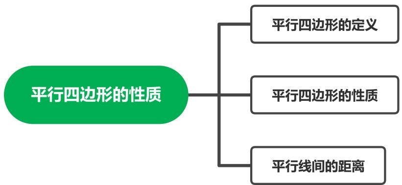

## 知识点01 平行四边形的概念

## 1. 平行四边形的概念：

有两组对边分别 的四边形叫做平行四边形。用符号“▱”来表示。平行四边形 ABCD 表示 为 ▱ ABCD 

## 知识点02 平行四边形的性质

## 1. 平行四边形的性质：

①边的性质：平行四边形的两组对边分别 （平行由定义证明，相等由连接对角线证明全 等可得）。 

②角的性质：平行四边形的邻角 ，对角 。（由平行与邻角转换可得） 

③对角线的性质：平行四边形的对角线 （连接两条对角线证明全等可得）。 

④平行四边形的面积计算：等于 

⑤平行四边形的对称性：是一个中心对称图形。 

⑥过对角线交点的直线把平行四边形分成两个全等的图形。直线与对边的交点到对角线的交点的距离 相等。 

## 【即学即练1】

1．以下平行四边形的性质错误的是（ 

A．对边平行 

B．对角相等 

C．对边相等 

D．对角线互相垂直 

## 【即学即练2】

2．如图，在▭ ABCD 中， $\angle A + \angle C = 8 0 ^ { \circ }$ °，则∠D＝（ ） 

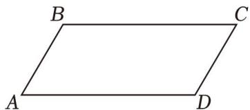

A． $8 0 ^ { \circ }$ 

B． $4 0 ^ { \circ }$ 

C． $7 0 ^ { \circ }$ 

D． $1 4 0 ^ { \circ }$ 

## 【即学即练3】

3．如图，▱ ABCD 的对角线 AC、BD 相交于点 O，且 $A C + B D = 1 2$ ，CD＝4，则△ABO 的周长是（ ） 

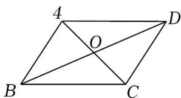

A．9 

B．10 

C．11 

D．12 

## 知识点03 平行线间的距离

1. 平行线间的距离的定义： 

一组平行线中，其中一条平行线上任意一点到另一条平行线的 是这一组平行间的距离。 

2. 平行线间的距离的性质： 

①两条平行线间的距离 

②平行线间的平行线段 

## 【即学即练1】

4．如图，已知 l1∥l2，AB∥CD，CE⊥l2于点 E， $F G \bot l _ { 2 }$ 于点 G，则下列说法中错误的是（ ） 

A． $A B { = } C D$ 

B． $C E { = } F G$ 

C．A、B 两点间距离就是线段 AB 的长度 

D． $l _ { 1 }$ 与 $l _ { 2 }$ 两平行线间的距离就是线段 CD 的长度 

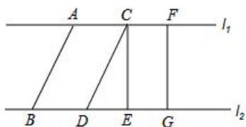

## 题型 01 平行线的性质的理解判断

【典例 1】关于平行四边形的性质，下列描述错误的是（ ） 

A．平行四边形的对角线相等 

B．平行四边形的对角相等 

C．平行四边形的对角线互相平分 

D．平行四边形的对边平行且相等 

【变式 1】平行四边形不一定具有的性质是（ ） 

A．对边平行且相等 

B．对角相等 

C．对角线相等 

D．对角线互相平分 

【变式 2】如图所示，在平行四边形 ABCD 中，对角线 AC、BD 交于点 O，下列结论中一定成立的是（ ） 

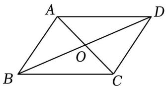

A． $A C \bot B D$ 

B． $O A { = } O C$ 

C．AC＝AB 

D．OA＝OB 

【变式 3】平行四边形 ABCD 的对角线 AC 与 BD 交于点 O，若 $\angle A O B = 1 8 0 ^ { \circ } \quad - 2 \angle B A O$ ，那么下列说法正 确的是（ ） 

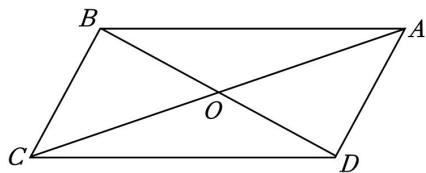

A．AB＝OB 

B．AB＝OA 

C．AC＝BD 

D． $A C \bot B D$ 

## 题型 02 平行四边形的性质与角度的计算

【典例 1】在▱ ABCD 中，若 $\angle A = \angle B + 5 0 ^ { \circ }$ ，则 $\angle B$ 的度数为 度． 

【变式 1】在▱ ABCD 中， $\angle A + \angle C = 2 2 0 ^ { \circ }$ °，则∠D 的度数是（ ） 

A． $7 0 ^ { \circ }$ 

B． $8 0 ^ { \circ }$ 

C． $9 0 ^ { \circ }$ 

D． $1 1 0 ^ { \circ }$ 

【变式 2】如图，平行四边形 ABCD 中， $\angle A B C$ 的平分线交 AD 于 E， $\angle B E D = 1 5 5 ^ { \circ }$ °，则 $\angle A$ 的度数为 （ ） 

A． $1 5 5 ^ { \circ }$ 

B． $1 3 0 ^ { \circ }$ 

C． $1 2 5 ^ { \circ }$ 

D． $1 1 0 ^ { \circ }$ 

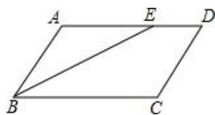

【变式 3】如图，在▱ ABCD 中， $\angle A = 6 8 ^ { \circ }$ ， $D B { = } D C$ ， $C E \bot B D$ 于 E，则∠BCE 的度数为 

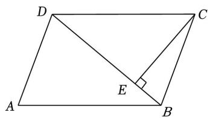

【变式 4】如图，在平行四边形 ABCD 中， $\angle B = 6 0 ^ { \circ }$ °，AE 平分 $\angle B A D$ 交 BC 于点 E，若 $\angle A E D = 8 0 ^ { \circ }$ °， 则 $\angle A C E$ 的度数是（ ） 

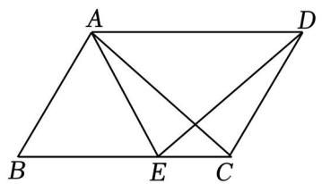

A． $3 0 ^ { \circ }$ 

B． $3 5 ^ { \circ }$ 

C． $4 0 ^ { \circ }$ 

D． $4 5 ^ { \circ }$ 

## 题型 03 平行四边形的性质与线段长度的计算

【典例 1】如图，平行四边形 ABCD 的对角线 AC 与 BD 相交于点 O，AB⊥AC，若 AB＝8，AC＝12，则 BD 的长是（ ） 

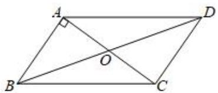

A．16 

B．18 

C．20 

D．22 

【变式 1】如图，在平行四边形 ABCD 中，AB＝3，AD＝5，∠ABC 的平分线交 AD 于 E，交 CD 的延长线 于点 F，则 DF＝（ ） 

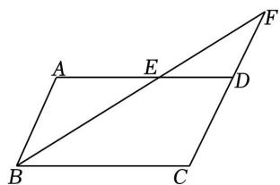

变式 1 

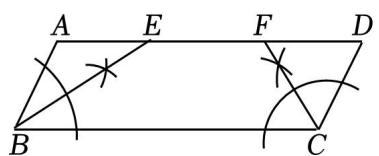

变式 2 

A．4 

B．3 

C．2 

D．1 

【变式 2】在▱ ABCD 中，尺规作图后留下的痕迹如图所示，若 AB＝3cm，AD＝10cm，则 EF 的长为（ ） 

A．3cm 

B．3.5cm 

C．4cm 

D．4.5cm 

【变式 3】如图，在▱ ABCD 中， $\angle A B C$ 、∠BCD 的角平分线交于边 AB 上一点 E，且 $B E { = } A B { = } \sqrt { 3 }$ ，线段 CE 的长为（ ） 

A． $2 \sqrt { 3 }$ 

B． $3 \sqrt { 2 }$ 

C． $- 2 \sqrt { 3 }$ 

D．3 

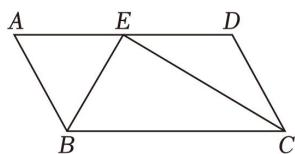

【变式 4】如图，▱ ABCD 的顶点 C 在等边△BEF 的边 BF 上，点 E 在 AB 的延长线上，G 为 DE 的中点， 连接 CG．若 AD＝5，AB＝CF＝3，则 CG 的长为 

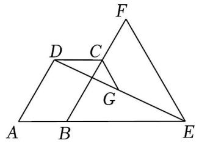

## 题型04 平行四边形的面积

【典例 1】观察如图中的三个平行四边形，你认为说法正确的是（ ） 

A．它们形状相同，面积相等 

B．它们形状相同，面积不相等 

C．它们形状不相同，面积相等 

D．它们形状不相同，面积不相等 

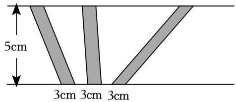

【变式 1】一个平行四边形两条邻边的长度分别是 6cm、8cm，且一条底边上的高是 7cm，则这个平行四边 形的面积是（ ） $c m ^ { 2 }$ ． 

A． $4 2 c m ^ { 2 }$ 

B． $5 6 c m ^ { 2 }$ 

C． $4 8 c m ^ { 2 }$ 

D． $4 2 c m ^ { 2 }$ 或者 $5 6 c m ^ { 2 }$ 

【变式 3】如图，F 是▱ ABCD 的边 CD 上的点，Q 是 BF 中点，连接 CQ 并延长交 AB 于点 E，连接 AF 与 $S _ { \Delta A P D } = 2 c m ^ { 2 } , S _ { \Delta B Q C } = 8 c m ^ { 2 }$ $c m ^ { 2 }$ 

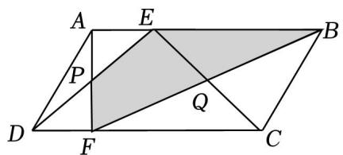

A．24 

B．17 

C．18 

D．10 

## 题型 05 平行四边形的周长

【典例 1】如图，在平行四边形 ABCD 中， $A C { = } 4 m$ ，若 $\triangle A C D$ 的周长为 13cm，则平行四边形 ABCD 的周 长为（ ） 

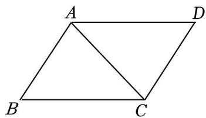

A．26cm 

B．24cm 

C．20cm 

D．18cm 

【变式 1】如图，在▱ ABCD 中，AD＝10，对角线 AC 与 BD 相交于点 O， $A C + B D = 2 4$ ，则 $\triangle B O C$ 的周长 为 

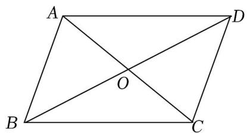

【变式 2】如图，▱ ABCD 的对角线 AC、BD 交于点 $O , \enspace \varXi \enspace A B C D$ 的周长为 30，直线 EF 过点 O，且与 AD， BC 分别交于点 E．F，若 OE＝5，则四边形 ABFE 的周长是（ ） 

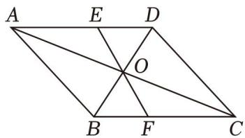

A．30 

B．25 

C．20 

D．15 

【变式 3】如图，在平行四边形 ABCD 中，AE 平分∠BAD 交 BC 于 E，BE＝4，EC＝3，则平行四边形 ABCD 的周长为（ ）cm． 

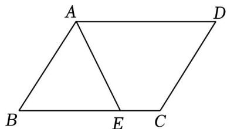

A．11 

B．18 

C．20 

D．22 

【变式 4】在平行四边形 ABCD 中， $\angle A$ 的角平分线把边 BC 分成长度为 4 和 5 的两条线段，则平行四边形 ABCD 的周长为（ ） 

A．13 或 14 

B．26 或 28 

C．13 

D．无法确定 

## 题型 06 利用平行四边形的性质求坐标

【典例 1】在平面直角坐标系 xOy中，▱ ABCD 的对角线交于点 O．若点 A 的坐标为（﹣2，3），则点 C 的 坐标为 

【变式 1】（多选）29．如图，在直角坐标系中，以点 O（0，0），A（﹣2，﹣1），B（0，2）为四边形的三 个顶点构造平行四边形，则下列各点中可以作为第四个顶点的是（ ） 

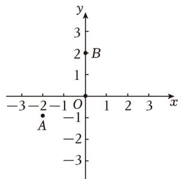

A．（﹣2，1） 

B．（﹣2，﹣3） 

C．（3，3） 

D．（2，3） 

【变式 2】在平面直角坐标系中，平行四边形 ABCD 的顶点 A、B、D 的坐标分别是（0，0），（5，0），（2， 3），则顶点 C 的坐标是（ ） 

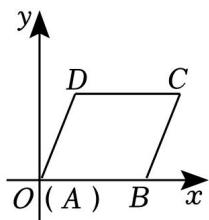

A．（7，3） 

B．（8，2） 

C．（3，7） 

D．（5，3） 

【变式 3】如图，在平面直角坐标系中，▱ ABCD 的边 AD 在 x轴上，顶点 B 在 y 轴上，点 A，D 的坐标分 别是（2，0），（7，0）， $\angle O B A = 3 0 ^ { \circ }$ ，则顶点 C 的坐标为（ ） 

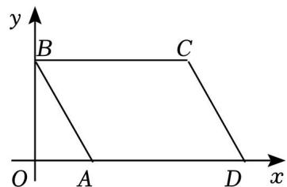

A． $( 2 \sqrt { 3 } , 5 )$ 

B． $4 \sqrt { 3 } )$ 

C． $2 { \sqrt { 3 } } )$ 

D． $( 4 \sqrt { 3 } , 5 )$ 

## 题型 07 平行线间的距离

【典例 1】如图，直线 $l _ { 1 } / / l _ { 2 } , l _ { 1 }$ 和 AB 的夹角 $\angle D A B = 1 3 5 ^ { \circ }$ °，且 $A B { = } 4 m m$ ，则两平行线 l1和 $l _ { 2 }$ 之间的距 离是（ ） 

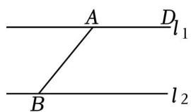

A．2 

B．4 

C． $4 \sqrt { 2 }$ 

D． $2 \sqrt { 2 }$ 

【变式 1】如图，已知直线 a∥直线 b，点 A，B 分别在直线 a和直线 b 上，若 $\angle 1 8 = 6 , \angle 1 = 6 0 ^ { \circ }$ °，则直线 a与直线 b之间的距离是 

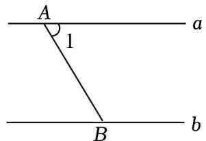

【变式 2】如图， $a / / b ,$ ，点 A、B 分别在直线 a、b 上， $\angle 1 = 4 5 ^ { \circ }$ °，点 C 在直线 b 上，且 $\angle B A C = 1 0 5 ^ { \circ }$ °， 若 a、b 之间的距离为 3，则线段 AC 的长度为 

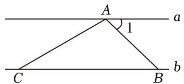

【变式 3】在同一平面内，已知 a∥b，b∥c，若直线 a、b 之间的距离为 7cm，直线 b、c 之间的距离为 3cm， 则直线 a、c 间的距离为（ ） 

A．4cm 或 10cm 

B．4cm 

C．10cm 

D．不确定 

## 强化训练

2．在 $\square A B C D$ 中，如果 $\angle A + \angle C = 1 6 0 ^ { \circ }$ ，那么 $\angle C$ 等于（ ） 

A． $2 0 ^ { \circ }$ 

B． $4 0 ^ { \circ }$ 

C． $6 0 ^ { \circ }$ 

D． $8 0 ^ { \circ }$ 

3．如图，若直线 $m / / n$ ，则下列哪条线段的长可以表示平行线 m 与 n之间的距离（ ） 

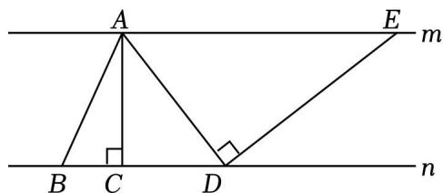

A．AB 

B．AC 

D．DE 

4．如图，在平行四边形 ABCD 中， $\angle A$ 的平分线 AE 交 CD 于 E，AB＝8，BC＝6，则 EC 等于（ ） 

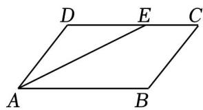

A．1 

B．1.5 

5．平面直角坐标系中，A、B、C 三点坐标分别为（0，0），（0，﹣4），（﹣3，3），以这三点为平行四边形 的三个顶点，则第四个顶点不可能在（ ） 

A．第一象限 

B．第二象限 

C．第三象限 

D．第四象限 

6．已知直线 a，b，c 在同一平面内，且 $a / / b / / c , a$ 与 b 之间的距离为 5cm，b 与 c 之间的距离为 3cm，则 a 与 c 之间的距离是（ ） 

A．2cm 

B．8cm 

C．2cm 或 8cm 

D．以上都不对 

7．如图，在▱ ABCD 中，AD：AB＝3：4，AE 平分 $\angle D A B$ 交 CD 于点 E，交 BD 于点 F，则 $\frac { D E } { A B }$ 的值是（ ） 

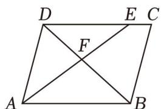

A．3：4 

B．9：16 

C．4：3 

D．16：9 

8．如图，▱ ABCD 中，AB＝22cm， $B C { = } 8 \sqrt { 2 } c m$ ， $\angle A = 4 5 ^ { \circ }$ ，动点 E 从 A 出发，以 2cm/s 的速度沿 AB 向 点 B 运动，动点 F 从点 C 出发，以 1cm/s 的速度沿着 CD 向 D 运动，当点 E 到达点 B 时，两个点同时停 止．则 EF 的长为 10cm 时点 E 的运动时间是（ ） 

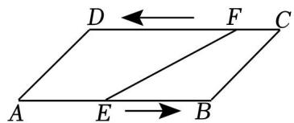

A．6s 

B．6s 或 10s 

C．8s 

D．8s 或 12s 

9．如图，四边形 ABCD 是平行四边形，点 E 是边 CD 上一点，且 BC＝EC， $C F \bot B E$ 交 AB 于点 F，P 是 EB 延长线上一点，下列结论：①BE 平分∠CBF；②CF 平分∠DCB；③ $B F { = } B E$ ；④ $P F { = } P C$ ．其中正 确的个数为（ ） 

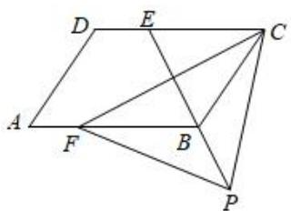

A．1 个 

B．2 个 

C．3 个 

D．4 个 

10．如图所示，以▱ ABCD 的边 AB 为边向内作等边 $\triangle A B E$ ，使 AD＝AE，且点 E 在平行四边形内部，连接 DE，CE，则 $\angle C E D$ 的度数为（ ） 

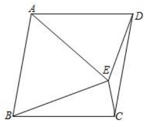

A． $1 5 0 ^ { \circ }$ 

B． $1 4 5 ^ { \circ }$ 

C． $1 3 5 ^ { \circ }$ 

D． $1 2 0 ^ { \circ }$ 

11．如图， $l _ { 1 } / / l _ { 2 } .$ ，点 A 在直线 $l _ { 1 }$ 上，点 B、C 在直线 $l _ { 2 }$ 上， $A C \bot l _ { 2 }$ ．如果 $_ { A B } = 5 c m$ ， $B C { = } 4 c m$ ．那么平行 线 $l _ { 1 }$ ， $l _ { 2 }$ 之间的距离为 cm 

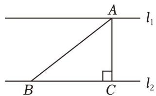

12．如图，▱ ABCD 的对角线交于坐标原点 O．若点 A 的坐标为 $\left( \begin{array} { l l } { - { \sqrt { 3 } } , } & { 1 } \end{array} \right)$ ），点 B 的坐标为（﹣1，﹣1）， 则 BC＝ 

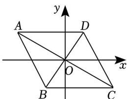

13．在平行四边形 ABCD 中， $\angle A B C = 6 0 ^ { \circ }$ °，AE 为边 BC 上的高， $\mathbb { A } \mathbb { E } { = } 3 \sqrt { 3 }$ ， $C E { = } 2$ ，则平行四边形 ABCD 

的周长为 

14．如图，在 $\triangle A B C$ 中， $\angle B A C = 3 0 ^ { \circ }$ °， $A B { = } A C { = } 1 2$ ，P 为 AB 边上一动点，以 PA，PC 为边作平行四边 形 $P A Q C$ ，则对角线 PQ 的长度的最小值为 

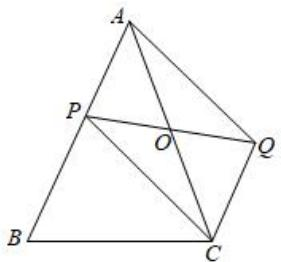

15．如图，在平行四边形 ABCD 中，点 E，F 分别是 AD，BC 边的中点，延长 CD 至点 G，使 $D G { = } C D$ ，以 DG，DE 为边向平行四边形 ABCD 外构造平行四边形 DGME，连接 BM 交 AD 于点 N，连接 FN．若 DG ${ } = { \cal D } E { = } 2$ ， $\angle A D C = 6 0 ^ { \circ }$ ，则 FN 的长为 

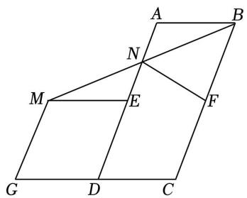

16．如图，四边形 ABCD 是平行四边形， $A C { = } A D$ ， $A E \bot B C$ ， $D F \bot A C$ ，垂足分别为 E，F．证明 $A E { = } D F$ 

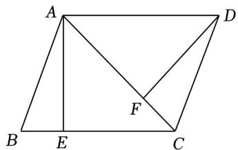

17．如图，直线 a∥b，AB 与 a，b分别相交于点 A，B，且 AC⊥AB，AC 交直线 b 于点 C 

（1）若 $\angle 1 = 7 0 ^ { \circ }$ ，求∠2的度数； 

（2）若 AC＝5，AB＝12，BC＝13，求直线 a 与 b 的距离 

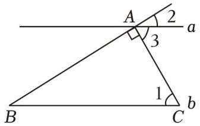

18．如图，在▱ ABCD 中，CE 平分∠BCD，交 AB 于点 E，AE＝3，EB＝5，DE＝4 

（1）求证： $\angle D E A = 9 0 ^ { \circ }$ °； 

（2）求 CE 的长 

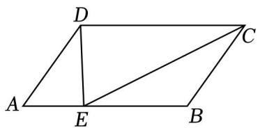

19．如图，在▱ ABCD 中，BC＝3AB﹣6，点 E，F 分别在边 AB，CD 上， $A E { = } C F$ ，直线 EF 分别交 AD， 

CB 的延长线交于点 H，G 

（1）求证： $D H { = } B G$ 

（2）作 $H M / / A B$ ，交 BC 延长线于点 M，AM 交 GH 于点 O．若 BE＝1，GB＝3，AB⊥AM， $\angle A E H = 4 5 ^ { \circ }$ °， 求 AE 的长． 

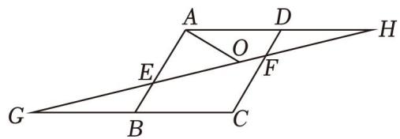

20．如图 ${1}$ 的对角线 AC 和 BD 相交于点 O，EF 过点 O 且与边 AB，CD 分别相交于点 E 和点 F 

（1）求证： $O E { = } O F$ 

（2）如图②，已知 AD＝1，BD＝2， $A C { = } 2 { \sqrt { 2 } }$ ， $\angle D O F = \angle \alpha$ 

①当 $\angle \alpha$ 为多少度时， $E F \bot A C ?$ 

②在 ${1}$ 的条件下，连接 $A F$ ，求 $\triangle A D F$ 的周长

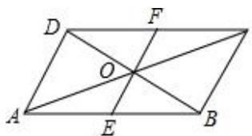

图①

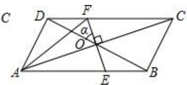

图②
