## 第 02 讲 平行四边形的判定

## 01

## 学习目标

<table><tr><td>课程标准</td><td>学习目标</td></tr><tr><td>1平行四边形的判定2三角形的中位线</td><td>1. 掌握平行四边形的判定方法并能够通过题目已知条件选择合适的判定方法判定平行四边形。2. 掌握三角形的中位线性质与判定,能够熟练的对三角形的中位线进行判断与对性质的熟练应用。</td></tr></table>

## 02

## 思维导图

## 平行四边形的判定

平行四边形的判定 

三角形的中位线 

性质 

判定 

## 知识点01 平行四边形的判定

## 1. 平行四边形的判定：

如图：判定四边形 ABCD 是平行四边形： 

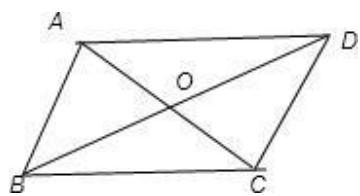

①利用边判定： 

I：利用一组对边判定：一组对边 的四边形是平行四边形。 

符号语言：若 AB CD 或 AD BC 

则四边形 ABCD 是平行四边形 

II：利用两组对边判定：两组对边分别 或分别 的四边形是平行四边形。 

符号语言：若 AB CD，AD BC 或 AB CD，AD BC 

则四边形 ABCD 是平行四边形 

②利用角判定： 

两组对角分别 的四边形是平行四边形。 

符号语言：若∠ABC ∠ADC，∠BAD ∠BCD 

则四边形 ABCD 是平行四边形 

③利用对角线判定： 

对角线 的四边形是平行四边形。 

符号语言：若 OA OC，OB OD 

则四边形 ABCD 是平行四边形 

## 【即学即练1】

1．在四边形 ABCD 中，对角线 AC 与 BD 交于点 O，下列各组条件，其中不能判定四边形 ABCD 是平行四 边形的是（ ） 

A． $O A { = } O C , O B { = } O D$ 

B． $O A { = } O C , A B / / C D$ 

C． $A B { = } C D , O A { = } O C$ 

D． $\angle A D B = \angle C B D , \angle B A D = \angle B C D$ 

## 【即学即练2】

2．如图，在四边形 ABCD 中，AE⊥BD 于点 E，CF⊥BD 于点 F，且 $\scriptstyle A B = C D , B F = D E$ ，求证：四边形 ABCD 

是平行四边形． 

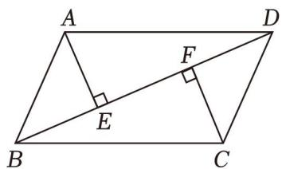

## 【即学即练3】

3．如图，四边形 ABCD 对角线交于点 O，且 O 为 AC 中点，AE＝CF，DF∥BE，求证：四边形 ABCD 是平 行四边形 

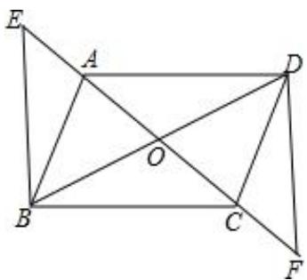

## 知识点02 三角形的中位线

1. 三角形中位线的定义： 

连接三角形任意两边的 得到的线段叫做三角形的中位线。 

2. 三角形的中位线定理： 

三角形的中位线 第三边，且等于第三边的 

几何语言：∵点 D、E 分别是 AB、AC 的中点 

$$
\therefore D E \parallel B C, D E = \frac {1}{2} B C
$$

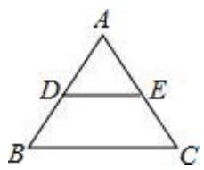

## 【即学即练1】

4．如图，CD 是 $\triangle A B C$ 的中线，E，F 分别是 AC，DC 的中点，EF＝3，则 BD 的长为（ ） 

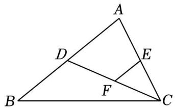

A．3 

B．4 

C．5 

D．6 

## 例题精讲

## 题型 01 熟悉平行四边形的判定条件

【典例 1】下列条件中，能判定四边形是平行四边形的是（ 

A．一组对边相等，另一组对边平行 

B．一组对边平行，一组对角互补 

C．一组对角相等，一组邻角互补 

D．一组对角互补，另一组对角相等 

【变式 1】在四边形 ABCD 中，对角线 AC 与 BD 相交于 O 点，给出五组条件： 

（1） $\scriptstyle A B = D C , \ A D / / B C ;$ 

（2） $\scriptstyle A B = C D , \ A B / / C D ;$ 

（3） $A B / / C D , \ A D / / B C ;$ 

（4） $O A { = } O C , O B { = } O D ;$ 

（5） $\scriptstyle A B = C D , \ A D = B C .$ 

能判定此四边形是平行四边形的有（ ）组． 

A．1 

B．2 

C．3 

D．4 

【变式 2】如图，四边形 ABCD 的对角线相交于点 O，下列条件不能判定四边形 ABCD 是平行四边形的是 （ ） 

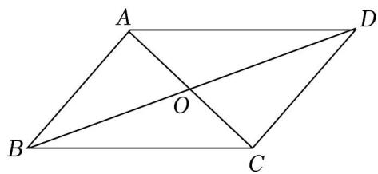

A．$O A = \frac { 1 } { 2 } A C , O B = \frac { 1 } { 2 } B D$

B． $_ { A B } = C D , \ A O = O C$ 

C． $A B / / C D , \angle D A C = \angle B C A$ 

D． $A B = C D , B C = A D$ 

## 题型 02 添加平行四边形的判定条件

【典例 1】在四边形 ABCD 中， $A B / / D C$ ，要使四边形 ABCD 成为平行四边形，还需添加的条件是（ ） 

A． $\angle A + \angle C = 1 8 0 ^ { \circ }$ 

B． $\angle B + \angle D = 1 8 0 ^ { \circ }$ 

C． $\angle A + \angle D = 1 8 0 ^ { \circ }$ 

D． $\angle A + \angle B = 1 8 0 ^ { \circ }$ 

【变式 1】如图，在四边形 ABCD 中，AB∥CD，要使四边形 ABCD 是平行四边形，下列可添加的条件不正 确的是（ ） 

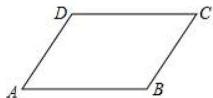

A． $A D { = } B C$ 

B． $A B { = } C D$ 

C． $A D / / B C$ 

D． $\angle A = \angle C$ 

【变式 2】如图，在四边形 ABCD 中， $A B / / C D$ ，若添加一个条件，使四边形 ABCD 为平行四边形，则下列 正确的是（ ） 

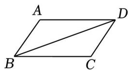

A． $A D { = } B C$ 

B． $\angle A B D = \angle B D C$ 

C． $A B { = } A D$ 

D． $\angle A = \angle C$ 

【变式 3】如图，在四边形 ABCD 中， $A B / / C D$ ，添加下列一个条件后，一定能判定四边形 ABCD 是平行四 边形的是（ ） 

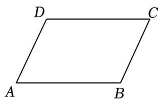

A． $A D { = } B C$ 

B． $\angle A + \angle D = 1 8 0 ^ { \circ }$ 

C． $\angle B = \angle D$ 

D． $A B { = } B C$ 

## 题型 03 三角形的中位线

【典例 1】如图，DE 是 $\triangle A B C$ 的中位线，若 BC＝8，则 DE 的长是（ ） 

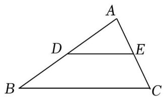

A．3 

B．4 

C．5 

D．6 

【变式 1】如图，DE 垂直平分 $\triangle A B C$ 的边 AB，交 CB 的延长线于点 D，交 AB 于点 E，F 是 AC 的中点， 连接 $A D , ~ E F$ ．若 AD＝5， $C D { = } 9$ ，则 EF 的长为（ ） 

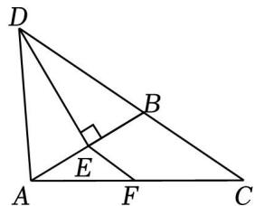

A．3 

B．2.5 

C．2 

D．1.5 

【变式 2】如图，在 $\mathrm { R t } \triangle A B C$ 中， $\angle C = 9 0 ^ { \circ }$ °， $A C { = } 6 , B C { = } 8$ ，点 N 是 BC 边上一点，点 M 为 AB 边上的 动点，点 D、E 分别为 CN，MN 的中点，则 DE 的最小值是（ ） 

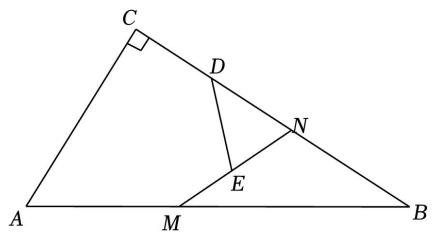

A．2 

B． $\frac { 1 2 } { 5 }$ 

C．3 

D． $\frac { 2 4 } { 5 }$ 

【变式 3】如图，DE 是△ABC 的中位线，∠ACB 的角平分线交 DE 于点 F，若 AC＝6， $B C { = } 1 4$ ，则 DF 的 长为 

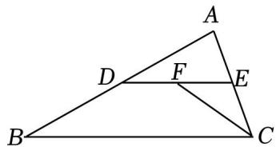

【变式 4】如图，在四边形 ABCD 中， $A B / / C D$ ，E，F 分别是 AC，BD 的中点，已知 AB＝12，CD＝6，则 $E F { = }$ 

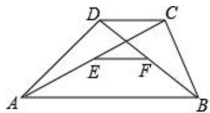

## 题型04 平行四边形的判定证明

【典例 1】17．如图，在 $\triangle A B C$ 中，AD 是 BC 边上的中线，E 是 AD 的中点，延长 BE 到 F，使 $B E { = } E F _ { \mathrm { { i } } }$ 

连接 $A F , ~ C F , ~ D F .$ ．求证：四边形 ADCF 是平行四边形 

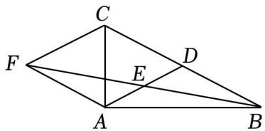

【变式 1】如图，四边形 ABCD 中，对角线 AC，BD 相交于点 O，点 E，F 分别在线段 OA，OC 上，且 OB $= O D , \angle 1 = \angle 2 , A E = C F .$求证：四边形 ABCD 是平行四边形

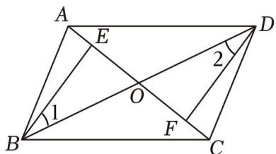

【变式 2】如图，点 O 是△ABC 内部一点，连接 OB，OC，并将边 AB，OB，OC，AC 的中点 D，E，F， G 顺次连接，DEFG 构成四边形，求证：四边形 DEFG 是平行四边形． 

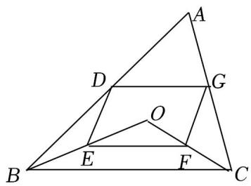

【变式 3】如图，在平面直角坐标系中，A（0，20），B 在原点，C（26， 

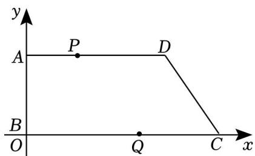

0），D（24，20），动点 P 从点 A 开始沿 AD 边向点 D 以 1cm/s 的速度运动，动点 Q 从点 C 开始沿 CB 以 3cm/s 的速度向点 B 运动，P、Q 同时出发，当其中一点到达终点时，另一点也随之停止运动，设运动时 间为 t s，当 t 为何值时，四边形 PQCD 是平行四边形？并写出 P、Q 的坐标 

## 题型 05 平行四边形的性质与判定

【典例 1】如图，▱ ABCD 的对角线 AC 与 BD 相交于点 O，点 E，F 分别在 OB 和 OD 上 

（1）当 BE，DF 满足什么条件时，四边形 AECF 是平行四边形？请说明理由； 

（2）当 $\angle A E B  \angle C F D$ 满足什么条件时，四边形 AECF 是平行四边形？请说明理由 

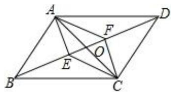

【变式 1】在▱ ABCD 中，E，F 分别是 AB，DC 上的点且 AE＝CF，连接 DE，BF，AF 

（1）求证：四边形 DEBF 是平行四边形； 

（2）若 $\angle D A F { = } \angle B A F$ ，AE＝3，DE＝4，BE＝5，求 AF 的长 

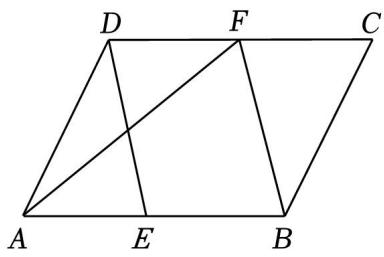

【变式 2】如图 1，在 $\triangle A B C$ 中，D、E 分别为 AB、AC 的中点，延长 BC 至点 F，使 $C F { = } \frac { 1 } { 2 } B C .$ ，连接 CD 和 EF． 

（1）求证：四边形 DEFC 是平行四边形 

（2）如图 2，当 $\triangle A B C$ 是等边三角形且边长是 8，求四边形 DEFC 的面积 

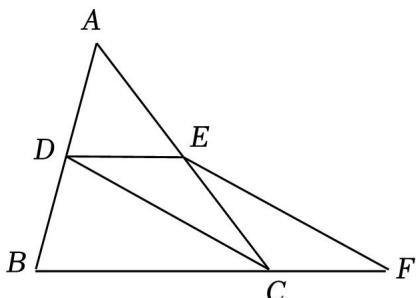

图1

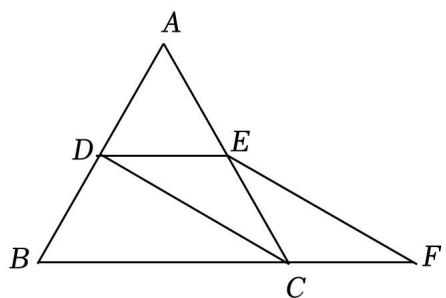

图2

【变式 3】如图，已知▱ ABCD，AC、BD 相交于点 O，延长 CD 到点 E，使 $C D { = } D E$ ，连接 AE 

（1）求证：四边形 ABDE 是平行四边形； 

（2）连接 BE，交 AD 于点 F，连接 OF，判断 CE 与 OF 的数量关系，并说明理由 

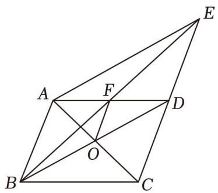

【变式 4】如图，在平行四边形 ABCD 中，点 G，H 分别是 AB，CD 的中点，点 E、F 在对角线 AC 上，且 $A E { = } C F$ ． 

（1）求证：四边形 EGFH 是平行四边形； 

（2）连接 BD 交 AC 于点 O，若 BD＝14， $A E { + } C F { = } E F$ ，求 EG 的长 

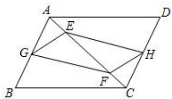

1．下列条件中，能判定四边形是平行四边形的是（ 

A．对角线互相平分 

B．对角线互相垂直 

C．对角线相等 

D．对角线互相垂直且相等 

2．下列说法正确的是（ ） 

A．一组对边平行，另一组对边相等的四边形是平行四边形 

B．平行四边形的对角互补 

C．有两组对角相等的四边形是平行四边形 

D．平行四边形的对角线平分每一组对角 

3．下列条件不能判定四边形 ABCD 是平行四边形的是（ ） 

A．AB∥CD，AD∥BC 

B．AD＝BC，AB＝CD 

C．AB∥CD，AD＝BC 

D．∠A＝∠C，∠B＝∠D 

4．如图，四边形 ABCD 中，对角线 AC、BD 相交于点 O，下列条件不能判定这个四边形是平行四边形的是 （ 

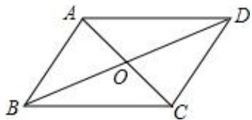

A．AB∥DC，AD∥BC 

B．AB∥DC，AD＝BC 

C．AO＝CO，BO＝DO 

D．AB＝DC，AD＝BC 

5．如图，平地上 A、B 两点被池塘隔开，测量员在岸边选一点 C，并分别找到 AC 和 BC 的中点 D、E，测 量得 DE＝16米，则 A、B 两点间的距离为（ ） 

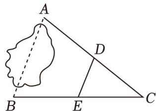

A．30 米 

B．32 米 

C．36 米 

D．48 米 

6．▱ ABCD 中，E、F 是对角线 BD 上不同的两点，下列条件中，不能得出 四边形 AECF 一定为平行四边形的是（ ） 

A．BE＝DF 

B．AF∥CE 

C．CE＝AF 

D．∠DAF＝∠BCE 

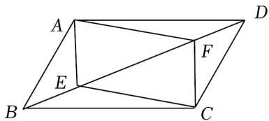

7．如图，在△ABC 中，D，E，F 分别是边 AB，BC，AC 的中点，若 AB＝12，BC＝14，则四边形 BDFE 的周长为（ ） 

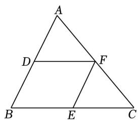

A．13 

B．21 

C．26 

D．52 

8．如图，在四边形 ABCD 中，AB＝CD，E，F，G 分别是 BC，AC，AD 的中点，若 $\angle E F G = 1 3 0 ^ { \circ }$ ，则∠ $E G F$ 的度数为（ ） 

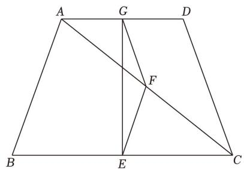

A． $2 0 ^ { \circ }$ 

B． $2 5 ^ { \circ }$ 

C． $3 0 ^ { \circ }$ 

D． $3 5 ^ { \circ }$ 

9．如图，在 $\triangle A B C$ 中，CF、BE 分别平分 $\angle A C B$ 和 $\angle A B C$ ，过点 A 作 $A D \bot C F$ 于点 D，作 $A G \bot B E$ 于点 G， 若 AB＝9，AC＝8，BC＝7，则 GD 的长为（ ） 

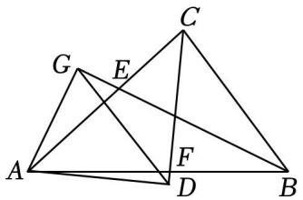

A．5.5 

B．5 

C．6 

D．6.5 

10．如图，在▱ ABCD 中，要在对角线 BD 上找两点 E、F，使 A、E、C、F 四点构成平行四边形，现有①， ②，③，④四种方案，①只需要满足 BE＝DF；②只需要满足 AE⊥BD，CF⊥BD；③只需要满足 AE， CF 分别平分 $\angle B A D , \angle B C D$ ，④只需要满足 $A E { = } C F$ ．则对四种方案判断正确的是（ ） 

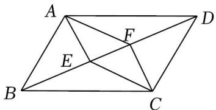

A．①②③ 

B．①③④ 

C．①②④ 

D．②③④ 

11．如图，在四边形 ABCD 中 AB∥CD，若加上 AD∥BC，则四边形 ABCD 为 平 行 四 边 形 ． 现 在 请 你 添 加 一 个 适 当 的 条 件： ，使得四边形 AECF 为平行四边形．（图中不再 添加点和线） 

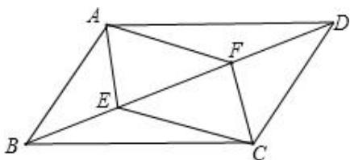

12．如图，在平面直角坐标系中，E 是 BC 的中点，已知 A（0，4），B（﹣2，0），C（8，0），D（4，4）， 点 P 是线段 BC 上的一个动点，当 BP 的长为 时，以点 P，A，D，E 为顶点的四边形是平行四 

边形． 

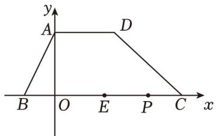

13．如图，在四边形 ABCD 中， $A D / / B C$ ，且 $A D { = } 4 c m$ ， $B C { = } 9 c m$ ．动点 P，Q 分别从点 D，B 同时出发， 点 P 以 1cm/s 的速度向终点 A 运动，点 Q 以 2cm/s 的速度向终点 C 运动， 秒时四边形 CDPQ 是 平行四边形？ 

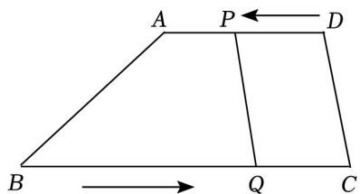

14．在平面直角坐标系中，点 A、B、C 的坐标分别是 A（0，2），B（1，0），C（3，2），点 D 在第一象限 内，若以 A、B、C、D 为顶点的四边形是平行四边形，那么点 D 的坐标是 

15．如图，四边形 ABCD 中， $\angle A = 9 0 ^ { \circ }$ ，AB＝4，AD＝3，点 M，N 分别为线段 BC，AB 上的动点（点 M 不与点 B 重合），点 E，F 分别为 DM，MN 的中点，则 EF 长度的最大值为 

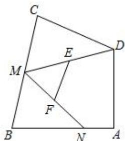

16．如图， $\triangle A B C$ 中， $B C { = } 2 0$ ， $A C { = } 1 4$ ，CE 平分 $\angle A C B$ ， $A E \bot C E$ ，延长 AE 交 BC 于点 F，D 是 AB 的中 点，求 DE 的长． 

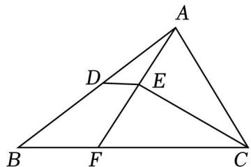

17．如图，已知 $\triangle A B C$ ，分别以它的三边为边长，在 BC 边的同侧作三个等边三角形，即△ABD，△BCE， $\triangle A C F$ ，求证：四边形 ADEF 是平行四边形 

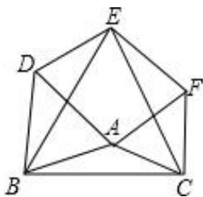

18．如图 1，在 $\triangle A B C$ 中，D，E 分别是边 AB，AC 上的点．对“中位线定理”逆向思考，可得以下 3则命 题： 

Ⅰ．若 D 是 AB 的中点， $= \frac { 1 } { 2 } B C$ ，则 E 是 AC 的中点； 

Ⅱ．若 $D E / / B C ,$ ， $= \frac { 1 } { 2 } \textcircled { 1 }$ ，则 D，E 分别是 AB，AC 的中点； 

Ⅲ．若 D 是 AB 的中点， $D E / / B C$ ，则 E 是 AC 的中点 

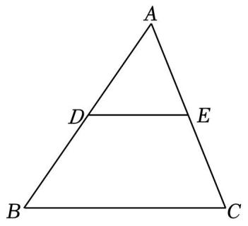

图1

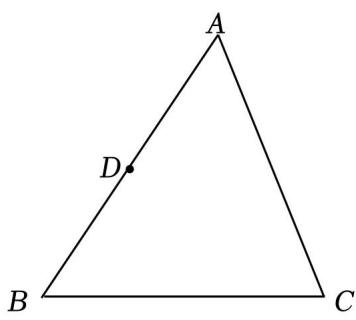

图2

（1）从以上命题中选出一个假命题，并在图 2 中画出反例（尺规作图，保留作图痕迹）； 

（2）从以上命题中选出一个真命题，并进行证明 

19．如图，在▱ $A B C D$ 中，对角线 AC，BD 交于点 O，E，F 为 BD 上两点，连接 AE，AF，CE，CF，且 $B F$ $= D E .$ ． 

（1）求证：四边形 AECF 为平行四边形； 

（2）若 AB⊥AC，CD＝4，AC＝6，E，F 为 BD 的三等分点，求 OE 的长度． 

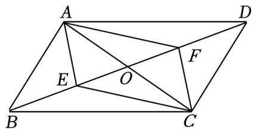

20．如图所示，四边形 ABCD 是平行四边形，∠BAD 的角平分线 AE 交 CD 于点 F，交 BC 的延长线于点 E 

（1）求证： $B E { = } C D ;$ 

（2）若 BF 恰好平分 $\angle A B E$ ，连接 AC、DE，求证：四边形 ACED 是平行四边形； 

（3）若 BF⊥AE， $\angle B E A = 6 0 ^ { \circ }$ ，AB＝4，求平行四边形 ABCD 的面积 

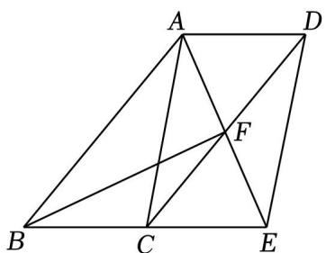
