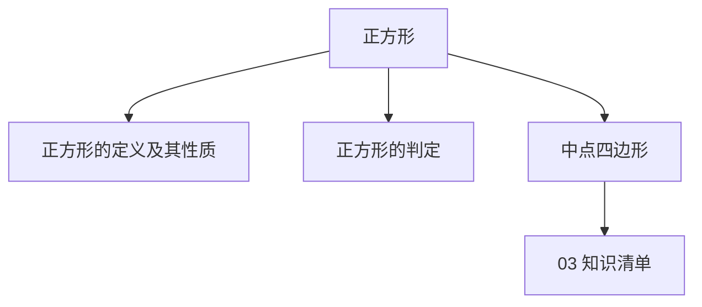
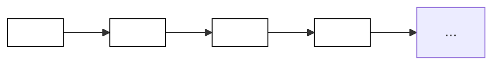
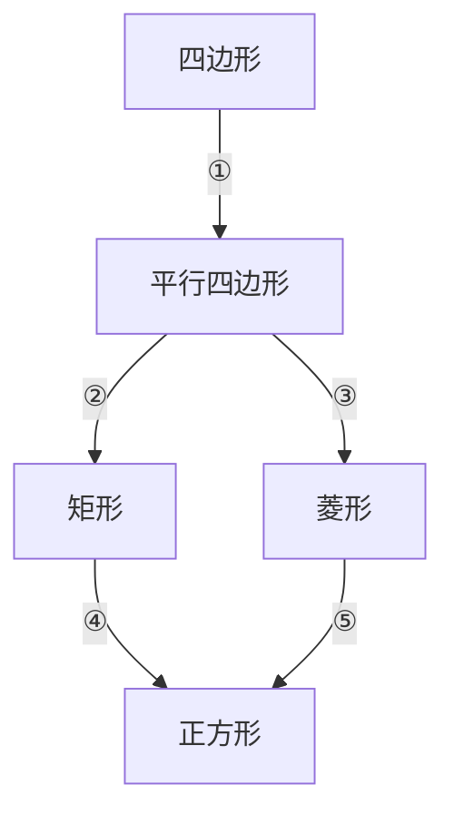

## 第 05 讲 正方形

## 01

## 学习目标

| 课程标准 | 学习目标 |
| --- | --- |
| 1正方形的定义与性质2正方形的判定3中点四边形 | 1. 熟悉正方形的定义,掌握正方形的性质,并能够熟练的应用性质。2. 掌握正方形的判定方法,能够熟练的选择合适的判定方法判定正方形。3. 掌握中点四边形的定义,能够熟练的根据四边形的性质判断中点四边形的形状。 |

## 02

## 思维导图

flowchart

## 知识点01 正方形的定义与性质

1. 正方形的定义：

四条边都 相等 ，四个角都是 直角 的四边形叫做正方形。

所以正方形是特殊的平行四边形，也是特殊的矩形，还是特殊的菱形。

2. 正方形的性质：

同时具有平行四边形、矩形以及菱形的一切性质。

## 【即学即练1】

1．下列有关特殊平行四边形的性质说法正确的是（ ）

A．菱形的对角线相等  
B．矩形的对角线互相垂直  
C．菱形的四个角相等

D．正方形的对角线互相垂直平分且相等

【解答】解：A．因为菱形的对角线互相垂直，所以 A 选项错误，不符合题意；

B．因为矩形的对角线相等，所以 B 选项错误，不符合题意；  
C．正方形、矩形的四个角相等，所以 C 选项错误，不符合题意  
D．因为正方形的对角线互相垂直且相等，所以 D 选项正确，符合题意；

故选：D

## 【即学即练2】

2．如图，正方形 ABCD 的边长为 2，对角线 AC，BD 交于点 O，P 为边 BC 上一点，且 \(B P = O B\) ，则 \(C P\) 的长为（ ）

A． \(2 \sqrt { 2 }\)

B． \(\sqrt { 2 } - 1\)

C．0.5

D．1

【解答】解：∵正方形 ABCD 的边长为 2，

$\(\therefore B D = \sqrt {2} B C = 2 \sqrt {2}, $\)

$\(\therefore B O = \sqrt {2}, $\)

$\(\therefore B P = O B = \sqrt {2}, $\)

$\(\therefore C P = B C - B P = 2 - \sqrt {2}, $\)

故选：A

## 【即学即练3】

3．在正方形 ABCD 中，等边三角形 AEF 的顶点 E、F 分别在边 BC 和 CD 上，则\(\angle CEF\)＝（ ）

A． \(75^{\circ}\)

B． \(60^{\circ}\)

C． \(50^{\circ}\)

D． \(45^{\circ}\)

【解答】解：∵四边形 ABCD 是正方形，

$\(\therefore A B = A D = B C = C D, \angle B = \angle D = \angle C = 90^{\circ}, $\)

∵\(\triangle AEF\) 是等边三角形，

$\(\therefore A E = A F, $\)

$\(\therefore \mathrm{Rt} \triangle A B E \cong \mathrm{Rt} \triangle A D F (H L), $\)

$\(\therefore B E = D F, $\)

$\(\therefore C E = C F, $\)

\(\therefore \triangle C E F\) 是等腰直角三角形，

$\(\therefore \angle C E F = 45^{\circ}, $\)

故选：D．

## 知识点02 正方形的判定

## 1. 直接判定：

四条边相等，四个角也相等的四边形是正方形。

符号语言： \(\begin{array} { r l r l r l } { \ddot { \bf \theta } : \dot { \bf A } B_{-} } & = & { { \cal B C }_{-} } & = & { { \cal C D }_{-} } & = & { { \cal A D }, { \cal L A B C } = \mathcal { L B C } { \cal D } = \mathcal { L C D } \mathcal { A } = \mathcal { L } { \cal D } \mathcal { A } B = } & { 90^{\circ} } \end{array}\) 。

∴四边形 ABCD 是正方形

## 2. 利用平行四边形、矩形以及菱形判定：

先判定四边形是平行四边形，在判定它是矩形和菱形即可判定为正方形。

①平行四边形＋邻边相等＋一个角是 \(90^\circ\)。

符号语言：在▱ABCD 中，

$\(\because A B = B C, \text {且} \angle A B C = 90^{\circ} $\)

$\(\therefore \square A B C D \text { 是正方形 } $\)

②平行四边形＋邻边相等＋对角线相等。

符号语言：▱ABCD 中

$\(\because A B = B C \text { 且 } A C = B D $\)

$\(\therefore \square A B C D \text { 是正方形 } $\)

③平行四边形＋对角线垂直＋一个角是 90

符号语言：▱ABCD 中

$\(\because A C \perp B D \text {且} \angle A B C = 90^{\circ} $\)

$\(\therefore \square A B C D \text { 是正方形 } $\)

④平行四边形＋对角线垂直＋对角线相等。

符号语言：▱ABCD 中

$\(\because A C \perp B D \text {且} A C = B D $\)

$\(\therefore \square A B C D \text { 是正方形 } $\)

可先证矩形再证菱形，也可先证菱形，再证矩形。

## 【即学即练1】

4．若▱ ABCD 中对角线 AC、BD 相交于点 O，则下列说法正确的是（ ）

A．当 \(O A = O D\) 时，▱ ABCD 为菱形  
B．当 \(A B = A D\) 时，▱ ABCD 为正方形  
C．当 \(\angle A B C = 90^{\circ}\) 时，▱ ABCD 为矩形  
D．当 \(A C \bot B D\) 时，▱ ABCD 为矩形

【解答】解：当 OA＝OD 时，平行四边形 ABCD 是不一定是菱形，故选项 A 不符合题意；

当 \(A B = A D\) 时，▱ ABCD 不一定为正方形，故选项 B 不符合题意；

当 \(\angle A B C = 90^{\circ}\) 时，▱ ABCD 为矩形，故选项 C 符合题意；

当 \(A C \bot B D\) 时，▱ ABCD 为是菱形，故选项 D 不符合题意；

故选：C

## 【即学即练2】

5．已知菱形 ABCD 中对角线 AC、BD 相交于点 O，添加条件 AC＝BD 或 \(A B \bot B C\) 可使菱形 ABCD 成为正方形．

【解答】解：根据对角线相等的菱形是正方形，可添加： \(A C = B D ;\)

根据有一个角是直角的菱形是正方形，可添加的： \(A B \bot B C\) ；

故添加的条件为：AC＝BD 或 \(A B \bot B C\)

## 【即学即练3】

6．如图，已知矩形 ABCD 中， \(\angle B A D\) 和\(\angle ADC\) 的平分线交于 BC 边上一点 E．点 F 为矩形外一点，四边形 AEDF 为平行四边形．求证：四边形 AEDF 是正方形

【解答】证明：∵四边形 ABCD 是矩形，

$\(\therefore \angle B A D = \angle C D A = 90^{\circ}, $\)

∵AE，DE 平分\(\angle BAD\) 与 \(\angle C D A\) ，

$\(\therefore \angle E A D = \frac {1}{2} \angle B A D = 45^{\circ}, \angle E D A = \frac {1}{2} \angle C D A = 45^{\circ}, $\)

$\(\begin{array}{l} \therefore \angle E A D = \angle E D A, \\ \therefore A E = D E, \\ \because \angle E A D + \angle E D A + \angle A E D = 180^{\circ}, \\ \therefore \angle A E D = 180^{\circ} - \angle E A D - \angle E D A = 90^{\circ}, \\ \end{array} $\)

∴▱ AEDF 是正方形

## 知识点03 中点四边形

1. 中点四边形的定义：

连接四边形各边的 中点 得到的四边形叫做中点四边形。

2. 中点四边形的形状：

①任意四边形的中点四边形是 平行四边形

②对角线相等的四边形的中点四边形是 菱形 。

③对角线相互垂直的四边形的中点四边形是 矩形 。

## 【即学即练1】

7．顺次连接菱形的四边中点所得的图形为 矩形

【解答】解：菱形 ABCD 中，E、F、G、H 分别是 AD、AB、BC、CD 的中点，则 \(AC \bot BD\)，

$\(\therefore E H \parallel A C, F G \parallel A C, $\)

$\(\therefore E H \parallel F G, $\)

同理得 \(EF \parallel HG\)，

∴四边形 EFGH 是平行四边形，

同理得：四边形 ENOM 是平行四边形，

$\(\therefore \angle F E H = \angle N O M = 90^{\circ}, $\)

∴▱ EFGH 是矩形，

∴顺次连接菱形四边中点所得的四边形一定是矩形；

故答案为：矩形

## 【即学即练2】

8．如图，E、F、G、H 分别是四边形 ABCD 四条边的中点，要使四边形 EFGH 为矩形，四边形 ABCD 应具备的条件是（ ）

A．对角线互相垂直  
B．对角线相等

C．一组对边平行而另一组对边不平行  
D．对角线互相平分

【解答】解：要是四边形 EHGF 是矩形，应添加条件是对角线互相垂直，

理由是：连接 AC、BD，两线交于 O，根据三角形的中位线定理得： \(E F \parallel A C\) ， \(E F = { \frac { 1 } { 2 } } A C\) ，\(GH \parallel AC\)， \(G H = \frac { 1 } { 2 } A C,\) ，

$\(\therefore E F \parallel G H, E F = G H, $\)

∴四边形 EFGH 一定是平行四边形，

$\(\therefore E F \parallel A C, E H \parallel B D, $\)

$\(\because B D \perp A C, $\)

$\(\therefore E H \perp E F, $\)

$\(\therefore \angle H E F = 90^{\circ}, $\)

故选：A

## 题型 01 利用正方形的性质求线段或周长

【典例 1】如图，在边长为 6 的正方形 ABCD 中，E 是对角线 AC 上一点，作 \(EF \bot AD\) 于点 F，连接 DE，若 DF＝2．则 DE 的长为（ ）

A． \(3 \sqrt { 2 }\)

B． \(2 \sqrt { 5 }\)

C．4

D．2.5

【解答】解：∵边长为 6 的正方形 ABCD，

$\(\therefore A D = 6, \angle E A F = 45^{\circ}, $\)

$\(\because D F = 2, $\)

$\(\therefore A F = A D - D F = 6 - 2 - 4, $\)

$\(\because E F \perp A D, $\)

$\(\therefore \angle A F E = \angle D F E = 90^{\circ}, $\)

$\(\therefore \angle A E F = \angle E A F = 45^{\circ}, $\)

$\(\therefore E F = A F = 4, $\)

由勾股定理，得 \(D E = \sqrt { E F^{2} + D F^{2} } = \sqrt { 4^{2} + 2^{2} } = 2 \sqrt { 5 }\)

故选：B．

【变式 1】如图，点 M是正方形 ABCD 边 AB 上一点， \(D N \bot C M\) 于 N，DN＝2CN＝2，则 BN 的长度为（ ）

A．2

B． \(\sqrt { 2 }\)

C \(\frac { 3 } { 2 }\)

D． \(\frac { \sqrt { 2 } } { 2 }\)

【解答】解：如图，过点 B 作 \(B E \bot C M\) 于 E，

∵\(DN \bot CM\)，\(BE \bot CM\)，

$\(\therefore \angle D N C = \angle C E B = 90^{\circ}, $\)

$\(\therefore \angle D C N + \angle C D N = 90^{\circ}, $\)

∵四边形 ABCD 是正方形，

$\(\therefore D C = C B, \angle A B C = \angle B C D = 90^{\circ}, $\)

$\(\therefore \angle D C N + \angle B C E = 90^{\circ}, $\)

$\(\therefore \angle C D N = \angle B C E, $\)

$\(\therefore \triangle D C N \cong \triangle C B E (A A S), $\)

$\(\therefore D N = C E, \quad C N = B E, $\)

$\(\because D N = 2 C N = 2, $\)

$\(\therefore C N = B E = 1, \quad C E = 2, $\)

$\(\therefore E N = C E - C N = 2 - 1 = 1, $\)

$\(\therefore E N = B E = 1, $\)

$\(\because \angle B E N = 90^{\circ}, $\)

\(\therefore \triangle B N E\) 是等腰直角三角形，

$\(\therefore B N = \sqrt {2} B E = \sqrt {2}. $\)

故选：B．

【变式 2】如图所示，在正方形 ABCD 中，O 是对角线 AC、BD 的交点，过 O 作 \(O E \bot O F,\) ，分别交 AB、BC于 E、F，若 AE＝4，CF＝3，则 EF 的长为（

A．3

B．4

C．5

D．6

【解答】解：∵四边形 ABCD 是正方形，

$\(\therefore O B = O C, \angle O B E = \angle O C F = 45^{\circ}, A C \perp B D, $\)

又 \(\because O E \bot O F,\) ，

$\(\therefore \angle E O B + \angle B O F = 90^{\circ} = \angle B O F + \angle C O F, $\)

$\(\therefore \angle E O B = \angle C O F, $\)

$\(\therefore \triangle B E O \cong \triangle C F O (A S A), $\)

$\(\therefore B E = C F = 3, $\)

又 \(\because A B = B C\) ，

$\(\therefore A E = B F = 4, $\)

\(\therefore \mathrm { R t } \triangle B E F\) 中， \(\scriptstyle { E F = { \sqrt { \ B E^{2} + B F^{2} } } = { \sqrt { 3^{2} + 4^{2} } } = 5 }\)

故选：C

【变式 3】如图，在正方形 ABCD 中，AB＝3，点 F 是 AB 边上一点，点 E 是 BC 延长线上一点， \(A F = C E\) ，\(B { \cal F } = 2 A { \cal F }\) ．连接 DF、DE、EF，EF 与对角线 AC 相交于点 G，则线段 BG 的长是（ ）

A． \(\sqrt { 5 }\)

B． \(2 \sqrt { 5 }\)

C． \(\frac { \sqrt { 13 } } { 2 }\)

D． \(\frac { 3 { \sqrt { 2 } } } { 2 }\) 2

【解答】解：过点 F 作 \(FH \parallel BC\) 交 AC 于 H，

∵四边形 ABCD 是正方形，

$\(\therefore A B = A D = C D = B C = 3, \angle A B C = \angle D A F = \angle A D C = \angle B C D = 90^{\circ}, \angle B A C = 45^{\circ}, $\)

$\(\therefore \angle D C E = 180^{\circ} - \angle B C D = 90^{\circ}, $\)

$\(\therefore \angle D A F = \angle D C E, $\)

$\(\because A F = C E, $\)

$\(\therefore \triangle D F A \cong \triangle D E C (S A S), $\)

$\(\therefore D F = D E, \angle F D A = \angle E D C, $\)

$\(\because B F = 2 A F, $\)

$\(\therefore A F = 1, B F = 2, $\)

$\(\therefore D F = \sqrt {\mathrm{AF}^{2} + \mathrm{AD}^{2}} = \sqrt {10} = D E, $\)

$\(\because \angle E D F = \angle E D C + \angle C D F = \angle F D A + \angle C D F = \angle A D C = 90^{\circ}, $\)

\(\therefore \triangle D E F\) 是等腰直角三角形，

$\(\therefore E F = \sqrt {2} D F = 2 \sqrt {5}, $\)

$\(\because F H \parallel B C, $\)

$\(\therefore \angle A F H = \angle A B C = 90^{\circ}, \angle F H G = \angle E C G, $\)

又 \(\because \angle B A C = 45^{\circ}\) °

\(\therefore \triangle A F H\) 是等腰直角三角形，

$\(\therefore F H = A F = C E, $\)

$\(\because \angle F G H = \angle E G C, $\)

$\(\therefore \triangle F G H \cong \triangle E G C (A A S), $\)

$\(\therefore F G = E G, $\)

$\(\because \angle A B C = 90^{\circ}, $\)

$\(\therefore B G = \frac {1}{2} E F = \sqrt {5}, $\)

故选：A

【变式 4】如果一个长方形内部能用一些正方形铺满，既不重叠，又无缝隙，就称为“优美长方形”如图，“优美长方形”ABCD 的周长为 78，则正方形 c 的边长为（ ）

A．6

B．9

C．12

D．15

【解答】解：设正方形 b 的边长为 x，则正方形 a、c、d 的边长分别为 \(2 x, \ 3 x, \ 5 x\)

“优美长方形”ABCD 的周长为 78，

$\(\therefore 2 (A B + B C) = 78, $\)

$\(\therefore 2 (5 x + 8 x) = 78, $\)

$\(\therefore x = 3, $\)

\(\therefore\) 正方形 c 的边长为 \(3 x = 9\) ，

故选：B

【变式 5】如图，已知正方形 ABCD 的边长为 4，P 是对角线 BD 上一点， \(P E \bot B C\) 于点 \(E, \ P F \bot C D\) 于点 F，连接 AP、EF．给出下列结论：① \(P D = \sqrt { 2 }\) ；②四边形 PECF 的周长为 8；③EF 的最小值为 2；④\(A P = E F ; \bigtriangleup A P \bot E F\) ．其中正确的结论有（ ）

A．5 个

B．4 个

C．3 个

D．2 个

【解答】解：①∵四边形 ABCD 为正方形，

$\(\therefore \angle C D B = \angle C B D = 45^{\circ}, $\)

$\(\because P F \perp C D, $\)

$\(\therefore P D = \sqrt {2} P F. $\)

$\(\because P E \perp B C, P F \perp C D, \angle C = 90^{\circ}, $\)

\(\therefore\) 四边形 PECF 为矩形，

$\(\therefore P F = E C, $\)

$\(\therefore P D = \sqrt {2} E C. $\)

∴①的结论正确；

② \(\because \angle C D B = \angle C B D = 45^{\circ} ~, ~ P E \bot B C, ~ P F \bot C D,\)

\(\therefore \triangle P B E\) 和 \(\triangle P D F\) 为等腰直角三角形，

$\(\therefore P E = B E, \quad P F = D F $\)

∴四边形 PECF 的周长 \(= E C + C F + P F + P E = E C + B E + C F + D F = B C + C D = 4 + 4 = 8\) ，

∴②的结论正确；  
④连接 PC，如图，

∵四边形 ABCD 为正方形，

$\(\therefore \angle A D P = \angle C D P = 45^{\circ}, A D = B C, $\)

在 \(\triangle A D P\) 和 \(\triangle C D P\) 中，

$\(\left\{ \begin{array}{l} A D = C D \\ \angle A D P = \angle C D P, \\ D P = D P \end{array} \right. $\)

∴\(\triangle ADP\)≌\(\triangle CDP\)（SAS）

$\(\therefore A P = P C. $\)

由①知：四边形 PECF 为矩形，

$\(\therefore E F = P C, $\)

$\(\therefore A P = E F. $\)

∴④的结论正确；

③由④知： \(A P = E F,\) ，

∴当 AP 取最小值时，EF 取得最小值，

∵点 P 是对角线 BD 上一点，

∴当 \(A P \bot B D\) ，即点 P 为对角线的中点时，AP 的值最小，此时 \(A P = \frac { \sqrt { 2 } } { 2 } A B = 2 \sqrt { 2 }\) ，  
\(\therefore E F\) 的最小值为 \(2 \sqrt { 2 }\) ，  
∴③的结论不正确；  
⑤延长 AP 交 EF 于点 H，延长 FP 交 AB 于点 G，如图，

∵四边形 ABCD 为正方形，

$\(\therefore \angle A B D = \angle C B D = 45^{\circ}, \angle A B C = 90^{\circ}, $\)

$\(\begin{array}{l} \because P E \perp B C, P G \perp A B, \\ \therefore P G = P E = B G, \angle G P E = 90^{\circ}, \\ \therefore \angle A P G + \angle E P H = 90^{\circ}. \\ \because F G = B C, \quad B C = A B, \\ \therefore F G = A B. \\ \therefore F G - P G = A B - B G, \\ \therefore A G = P F. \\ \end{array} $\)

在\(\triangle AGP\) 和\(\triangle FPE\) 中，

$\(\left\{ \begin{array}{l} A G = F P \\ \angle A G P = \angle F P E, \\ P G = E P \end{array} \right. $\)

$\(\therefore \triangle A G P \cong \triangle F P E (S A S), $\)

$\(\therefore \angle A P G = \angle F E P. $\)

$\(\therefore \angle F E P + \angle H P E = 90^{\circ}, $\)

$\(\therefore \angle P H E = 90^{\circ}. $\)

$\(\therefore A P \perp E F. $\)

∴⑤的结论正确；

综上，正确结论的序号为：①②④⑤，共 4 个

故选：B．

## 题型 02 利用正方形的性质求角度

【典例 1】如图所示，在正方形 ABCD 中，E 是对角线 AC 上的一点．连接 BE，且 AB＝AE，则\(\angle EBC\) 的度数是（ ）

A． \(45^{\circ}\)

B． \(30^{\circ}\)

C．22.\(5^\circ\)

D． \(20^{\circ}\)

【解答】解：∵四边形 ABCD 是正方形，

$\(\therefore \angle B A C = 45^{\circ}, $\)

$\(\because A B = A E, $\)

$\(\therefore \angle A B E = \angle A E B = \frac {180^{\circ} - 45^{\circ}}{2} = 67. 5^{\circ}. $\)

$\(\therefore \angle E B C = \angle A B C - \angle A B E = 90^{\circ} - 67. 5^{\circ} = 22. 5^{\circ}. $\)

故选：C

【变式 1】如图，在正方形 ABCD 中，点 E，F 分别在 AD，AB 上，满足 DE＝AF，连接 CE，DF，点 P，Q 分别是 DF，CE 的中点，连接 PQ．若 \(\angle A D F = \alpha\) ．则 \(\angle P Q E\) 可以用α表示为（ ）

A．α

B． \(45^{\circ} \mathrm { ~ ~ { ~ - ~ } ~ } \alpha\)

C． \(45^{\circ} - \frac { a } { 2 }\)

D． \(3 \alpha - 45^{\circ}\)

【解答】解：连接 DQ，如图：

∵四边形 ABCD 是正方形，

$\(\therefore A D = C D, \angle A = \angle C D E = 90^{\circ}, $\)

$\(\because A F = D E, $\)

$\(\therefore \triangle A D F \cong \triangle D C E (S A S), $\)

$\(\therefore D F = C E, \angle A D F = \angle D C E = \alpha, $\)

∵点 P，Q 分别是 DF，CE 的中点，

$\(\therefore P D = \frac {1}{2} D F = D Q = \frac {1}{2} C E, $\)

$\(\therefore \angle D P Q = \angle D Q P, \angle C D Q = \alpha, $\)

$\(\therefore \angle P D Q = 90^{\circ} - 2 \alpha, \angle D Q E = 2 \alpha, $\)

$\(\therefore \angle P Q D = \frac {180^{\circ} - (90^{\circ} - 2 \alpha)}{2} = 45^{\circ} + \alpha, $\)

$\(\therefore \angle P Q E = 45^{\circ} + \alpha - 2 \alpha = 45^{\circ} - \alpha, $\)

故选：B．

【变式 2】如图，在正方形 ABCD 中，E 为 BC 上一点，连接 DE， \(A F \bot D E\) 于点 F，连接 CF，设 \(\angle D A F =\) ，若 \(A F = 2 D F\) ，则 \(\angle D C F\) 一定等于（ ）

A． \(45^{\circ} \mathrm { ~ ~ { ~ - ~ } ~ } \alpha\)

B． \(90^{\circ} \mathrm { ~ ~ { ~ - ~ } ~ } 3 \alpha\)

C \(\frac { 3 } { 4 } a\)

D． \(10^{\circ} + \frac { a } { 8 }\)

【解答】解：过点 C 作 \(C G \bot D E\) 于 G，

则 \(\angle D G C = \angle C G E = 90^{\circ}\)

\(\because A F \bot D E,\) ，

$\(\therefore \angle A F D = 90^{\circ}, $\)

$\(\therefore \angle A F D = \angle D G C, $\)

∵四边形 ABCD 是正方形，

$\(\therefore A D = D C, \angle A D C = 90^{\circ}, $\)

$\(\therefore \angle A D F + \angle C D E = 90^{\circ}, $\)

又∵ \(\angle A D F + \angle D A F = 90^{\circ}\)

$\(\therefore \angle D A F = \angle C D E, $\)

$\(\therefore \triangle A D F \cong \triangle D C G (A A S), $\)

$\(\therefore D F = C G, A F = D G, $\)

$\(\because A F = 2 D F, $\)

$\(\therefore D G = 2 D F, $\)

$\(\therefore D F = F G, $\)

$\(\therefore C G = F G, $\)

\(\therefore \triangle C F G\) 是等腰直角三角形，

$\(\therefore \angle C F G = 45^{\circ}, $\)

$\(\because \angle D A F = \alpha, $\)

$\(\therefore \angle C D E = \alpha, $\)

$\(\because \angle C F G = \angle C D E + \angle D C F, $\)

$\(\therefore \angle D C F = \angle C F G - \angle C D E = 45^{\circ} - \alpha ; $\)

故选：A

【变式 3】如图，在正方形 ABCD 中，点 E 是 AC 上一点，过点 E 作 \(EF \bot ED\) 交 AB 于点 F，连接 BE，DF，若 \(\angle A D F = \alpha\) ，则 \(\angle B E F\) 的度数是（ ）

A．2α

B． \(45^{\circ} + \alpha\)

C． \(90^{\circ} \mathrm { ~ ~ { ~ - ~ } ~ } 2 { \alpha }\)

D．3α

【解答】解：过点 E 作 \(E M \bot A B\) 于 M， \(E N \bot A D\) 于 N，

∵四边形 ABCD 是正方形，

$\(\therefore \angle B A D = 90^{\circ}, A B = A D, $\)

∴四边形 AMEN 是矩形， \(\angle B A E = \angle D A E = 45^{\circ}\)

\(\therefore E M = E N\) ，四边形 AMEN 是正方形，

$\(\therefore \angle M E N = 90^{\circ}, $\)

$\(\because \angle D E F = 90^{\circ}, $\)

$\(\therefore \angle M E F = \angle N E D = 90^{\circ} - \angle F E N, $\)

在\(\triangle EMF\) 和\(\triangle END\) 中，

$\(\left\{ \begin{array}{l} \angle E M F = \angle E N D \\ E M = E N \\ \angle M E F = \angle N E D \end{array}, \right. $\)

$\(\therefore \triangle E M F \cong \triangle E N D (A S A), $\)

$\(\therefore E F = E D, $\)

$\(\therefore \angle E F D = \angle E D F = 45^{\circ}, $\)

$\(\because \angle A D F = \alpha, $\)

$\(\therefore \angle A F D = 90^{\circ} - \alpha, $\)

$\(\therefore \angle B F D = 180^{\circ} - (\angle A F D + E F D) = 180^{\circ} - (90^{\circ} - \alpha + 45^{\circ}) = 45^{\circ} + \alpha, $\)

在\(\triangle ABE\) 和\(\triangle ADE\) 中，

$\(\left\{ \begin{array}{l} A B = A D \\ \angle B A E = \angle D A E, \\ A E = A E \end{array} \right. $\)

$\(\therefore \triangle A B E \cong \triangle A D E (S A S), $\)

$\(\therefore B E = D E, $\)

$\(\therefore B E = E F, $\)

$\(\therefore \angle B F E = \angle E B F = 45^{\circ} + \alpha, $\)

$\(\therefore \angle B E F = 180^{\circ} - (\angle B F E + \angle E B F) = 180^{\circ} - 2 (45^{\circ} + \alpha) = 90^{\circ} - 2 \alpha . $\)

故选：C

【变式 4】如图，正方形 ABCD 中，点 M、N、P 分别在 AB、CD、BD 上， \(\angle M P N = 90^{\circ}\) °，MN 经过对角线 BD 的中点 O，若 \(\angle P M N = \alpha\) ，则 \(\angle A M P\) 一定等于（ ）

A．2α

B． \(45^{\circ} + \alpha\)

C． \(90 - \frac { 1 } { 2 } \ a\)

D． \(135^{\circ} \mathrm { ~ ~ { ~ - ~ } ~ } \alpha\)

【解答】解：∵四边形 ABCD 是正方形，

$\(\therefore \angle A B D = 45^{\circ}, $\)

在 \(\mathrm { R t } \triangle P M N\) 中， \(\angle M P N = 90^{\circ}\)

\(\because O\) 为 MN 的中点，

$\(\therefore O P = \frac {1}{2} M N = O M, $\)

$\(\because \angle P M N = \alpha, $\)

$\(\therefore \angle M P O = \alpha, $\)

$\(\therefore \angle A M P = \angle M P O + \angle M B P = \alpha + 45^{\circ}, $\)

故选：B．

## 题型03 利用正方形的性质求点的坐标

【典例 1】在平面直角坐标系中，正方形 OABC 的顶点 O 的坐标是（0，0），顶点 B 的坐标是（2，0），则顶点 A 的坐标是（ ）

A．（1，1）

B．（﹣1，1）或（1，1）

C．（﹣1，1）

D．（1，﹣1）或（1，1）

【解答】解：有两种情况：

（1）连接 AC，

∵四边形 OABC 是正方形，

∴点 A、C 关于 x 轴对称，

∴AC 所在直线为 OB 的垂直平分线，即 A、C 的横坐标均为 1，

根据正方形对角线相等的性质， \(A C = B O = 2\) ，

又∵A、C 关于 x 轴对称，

∴A 点纵坐标为 1，C 点纵坐标为﹣1，

故 A 点坐标（1，1），

（2）当点 A 和点 C 位置互换，同理可得出 A 点坐标（1，﹣1），

故选：D．

【变式 1】如图，正方形 ABCO 中，O 是坐标原点，A 的坐标为 \(( 1, { \sqrt { 3 } } )\) ，则点 C 的坐标为 \(( \mathbf { \varepsilon } - { \sqrt { 3 } },\) 1）

【解答】解：如图，过点 C 作 \(CD \bot x\) 轴于点 D，过点 A 作 \(AE \bot x\) 轴于点 E，

在正方形 OABC 中， \(\angle A O C = 90^{\circ}, A O = C O,\) ，

$\(\because \angle A O C = \angle C D O = 90^{\circ}, $\)

$\(\therefore \angle C O D + \angle A O E = \angle C O D + \angle O C D = 90^{\circ}, $\)

$\(\therefore \angle O C D = \angle A O E, $\)

在 \(\triangle O C D\) 和 \(\triangle A O E\) 中，

$\(\left\{ \begin{array}{l} \angle C D O = \angle O E A = 90^{\circ} \\ \angle D C O = \angle E O A \\ C O = O A \end{array}, \right. $\)

$\(\therefore \triangle O C D \cong \triangle A O E (A A S), $\)

$\(\therefore C D = O E = 1, \quad O D = A E = \sqrt {3}, $\)

∴C 的坐标为 \(( \mathbf { \Omega } - \sqrt { 3 }, \mathbf { \Omega } 1 )\) ）；

故答案为： \(( \mathbf { \Omega } - \sqrt { 3 }, \mathbf { \Omega } 1 )\) ）．

【变式 2】如图，在平面直角坐标系中，正方形 ABCD 的边长为 2， \(\angle D A O = 60^{\circ}\) °，则点 C 的坐标为 \({ \underline { { \mathbf { \Pi } } } } ( { \sqrt { 3 } },\) ，\(\underline { { 1 + \sqrt { 3 } } } )\)

【解答】解：过点 C 作 \(CE \bot x\) 轴， \(C F \bot y\) 轴，如图：

∵正方形 ABCD 的边长为 2， \(\angle D A O = 60^{\circ}\)

$\(\therefore \angle A D O = 30^{\circ}, $\)

$\(\therefore A O = 1, D O = \sqrt {3}, $\)

∵四边形 ABCD 是正方形，

$\(\therefore A D = C D, \angle A D C = 90^{\circ}, $\)

$\(\therefore \angle A D O = \angle D C F, $\)

$\(\therefore \triangle A O D \cong \triangle D F C (A A S), $\)

$\(\therefore A O = D F = 1, \quad D O = C F = \sqrt {3}, $\)

$\(\therefore C E = 1 + \sqrt {3}, $\)

∴点 C 的坐标为： \(( { \sqrt { 3 } }, \ 1 + { \sqrt { 3 } } )\) ）

故答案为： \(( { \sqrt { 3 } }, 1 + { \sqrt { 3 } } )\) ）

【变式 3】在平面直角坐标系中，点 O 是坐标原点，正方形 ABCD 的顶点 C，D 在第二象限，若点 A 的坐标为（0，2），点 B 的坐标为（﹣3，0），则点 C 的坐标为 （﹣5，3）

【解答】解：作 \(CE \bot x\) 轴于点 E，

∵四边形 ABCD 是正方形，

$\(\therefore \angle B E C = \angle A O B = \angle A B C = 90^{\circ}, B C = A B, $\)

$\(\therefore \angle E B C = \angle O A B = 90^{\circ} - \angle O B A, $\)

在\(\triangle BEC\) 和\(\triangle AOB\) 中，

$\(\left\{ \begin{array}{l} \angle B E C = \angle A O B \\ \angle E B C = \angle O A B, \\ B C = A B \end{array} \right. $\)

$\(\therefore \triangle B E C \cong \triangle A O B (A A S), $\)

$\(\because A (0, 2), B (- 3, 0), $\)

$\(\therefore E B = O A = 2, \quad E C = O B = 3, $\)

$\(\therefore O E = O B + E B = 5, $\)

$\(\therefore C (- 5, 3), $\)

故答案为：（﹣5，3）

【变式 4】如图，在平面直角坐标系中，正方形 ABCD 顶点 A 的坐标为（0，4），B 点在 x 轴上，对角线 AC，BD 交于点 M， \(O M = 6 \sqrt { 2 }\) ，则点 C 的坐标为 （12，8）

【解答】解：过点 C 作 \(CE \bot x\) 轴于点 E，过点 M 作 \(MF \bot x\) 轴于点 F，连接 EM，如图所示：

$\(\therefore \angle M F O = \angle C E O = \angle A O B = 90^{\circ}, A O \parallel M F \parallel C E, $\)

∵四边形 ABCD 是正方形，

$\(\therefore A B = B C, \angle A B C = 90^{\circ}, A M = C M, $\)

$\(\therefore \angle O A B = \angle E B C, O F = E F, $\)

∴MF 是梯形 AOEC 的中位线，

$\(\therefore M F = \frac {1}{2} (A O + E C), $\)

$\(\because M F \perp O E, $\)

$\(\therefore M O = M E. $\)

∵在\(\triangle AOB\) 和\(\triangle BEC\) 中， \(\left\{ \begin{array} { l l } { \angle C E O = \angle A O B } \\ { \angle O A F = \angle E B C } \\ { A B = B C } \end{array} \right.\) ，

$\(\therefore \triangle A O B \cong \triangle B E C (A A S), $\)

$\(\therefore O B = C E, A O = B E. $\)

$\(\therefore M F = \frac {1}{2} (B E + O B), $\)

又 \(\because O F = F E\)

\(\therefore \triangle M O E\) 是直角三角形， \(\because M O = M E\) ，

\(\therefore \triangle M O E\) 是等腰直角三角形，

$\(\therefore O E = \sqrt {(6 \sqrt {2})^{2} + (6 \sqrt {2})^{2}} = 12, $\)

$\(\because A (0, 4), $\)

$\(\therefore O A = 4, $\)

$\(\therefore B E = 4, $\)

$\(\therefore O B = C E = O E - B E = 8. $\)

$\(\therefore C (12, 8). $\)

故答案为：（12，8）

## 题型 04 正方形的判定与性质

【典例 1】如图，在矩形 ABCD 中，对角线 AC、BD 交于点 O，添加下列一个条件，仍不能使矩形 ABCD成为正方形的是（ ）

A．\(AC \bot BD\)

B．AC 平分\(\angle BAD\)

C．AB＝BC

D． \(\triangle O C D\) 是等边三角形

【解答】解：要使矩形成为正方形，可根据正方形的判定定理解答：

（1）有一组邻边相等的矩形是正方形，  
（2）对角线互相垂直的矩形是正方形

∴A、C 不符合题意；

∵AC 平分 \(\angle B A D\)

$\(\therefore \angle B A C = \angle C A D, $\)

$\(\because A D \parallel B C, $\)

$\(\therefore \angle D A C = \angle A C B, $\)

$\(\therefore \angle D A C = \angle A C B, $\)

$\(\therefore A B = B C, $\)

∴矩形 ABCD 成为正方形，

∴B 不符合题意；

∵添加\(\triangle OCD\) 是等边三角形，不能使矩形 ABCD 成为正方形，选项 D 符合题意

故选：D．

【变式 1】如图，AC 和 BD 是菱形 ABCD 的对角线，若再补充一个条件能使其成为正方形，下列条件：①AC＝BD；② \(A C \bot B D\) ；③ \(A B^{2} + A D^{2} = B D^{2}\) ； \(\textcircled{4} \angle A C D = \angle A D C\) ．其中符合要求的是（ ）

A．①②

B．①③

C．②③

D．②④

【解答】解：设对角线 AC 和 BD 交于点 O，

∵四边形 ABCD 为菱形，

$\(\therefore A B = B C = C D = D A, \quad A C \perp B D, \quad O A = O C, \quad O B = O D, $\)

①∵对角线相等的菱形是正方形；

∴补充条件 AC＝BD，可以使四边形 ABCD 成为为正方形，

②∵菱形的对角线具有 \(A C \bot B D,\) ，

∴补充条件 \(A C \bot B D\) ，不能使四边形 ABCD 成为为正方形，

③ \(\because A B 2 + A D 2 = B D 2\)

$\(\therefore \angle B A D = 90^{\circ}, $\)

∴菱形 ABCD 为正方形，

∴补充条件 \(A B 2 + A D 2 = B D 2\) ，可以使四边形 ABCD 成为为正方形，

④当 \(\angle A C D = \angle A D C\) 时， \(A C = A D\) ，

又 \(\therefore A D = C D,\) ，

$\(\therefore A D = A C = C D, $\)

\(\therefore \triangle A C D\) 为等边三角形，

$\(\therefore \angle A D C = 60^{\circ}, $\)

∴补充条件 \(\angle A C D = \angle A D C\) ，不能使四边形 ABCD 成为为正方形

综上所述：当补充的条件 \(\textcircled{1}\) 时，可以使四边形 ABCD 成为为正方形．

故选：B．

【变式 2】如图，E、F、M、N 分别是正方形 ABCD 四条边上的点，且 \(\scriptstyle A E = B F = C M = D N\) ．求证：四边形EFMN 是正方形

【解答】解：四边形 EFMN 是正方形

证明： \(\because A E = B F = C M = D N\) ，

$\(\therefore A N = D M = C F = B E. $\)

$\(\because \angle A = \angle B = \angle C = \angle D = 90^{\circ}, $\)

$\(\therefore \triangle A E N \cong \triangle D M N \cong \triangle C F M \cong \triangle B E F. $\)

$\(\therefore E F = E N = N M = M F, \angle E N A = \angle D M N. $\)

∴四边形 EFMN 是菱形

$\(\because \angle E N A = \angle D M N, \angle D M N + \angle D N M = 90^{\circ}, $\)

$\(\therefore \angle E N A + \angle D N M = 90^{\circ}. $\)

$\(\therefore \angle E N M = 90^{\circ}. $\)

∴四边形 EFMN 是正方形

【变式 3】如图，四边形 AECF 是菱形，对角线 AC、EF 交于点 O，点 D、B 是对角线 EF 所在直线上两点，且 \(D E = B F,\) ，连接 \(A D \setminus A B \setminus C D \setminus C B, \angle A D O = 45^{\circ}\)

（1）求证：四边形 ABCD 是正方形；  
（2）若正方形 ABCD 的面积为 72， \(B F = 4\) ，求点 F 到线段 AE 的距离

【解答】（1）证明：∵菱形 AECF 的对角线 AC 和 EF 交于点 O，

$\(\therefore A C \perp E F, O A = O C, O E = O F, $\)

$\(\because B E = D F, $\)

$\(\therefore B O = D O, $\)

又 \(\because A C \bot B D\) ，

∴四边形 ABCD 是菱形，

$\(\because \angle A D O = 45^{\circ}, $\)

$\(\therefore \angle D A O = \angle A D O = 45^{\circ}, $\)

$\(\therefore A O = D O, $\)

$\(\therefore A C = B D, $\)

∴四边形 ABCD 是正方形；

（2）解：∵正方形 ABCD 的面积为 72，

$\(\therefore \frac {1}{2} A C \cdot B D = 72, $\)

$\(\therefore \frac {1}{2} \times 4 B O^{2} = 72, $\)

$\(\therefore B O = D O = C O = A O = 6, $\)

$\(\therefore A C = 12, $\)

$\(\because B F = 4, $\)

$\(\therefore O F = 2, $\)

∵四边形 ABCD 是菱形，

$\(\therefore E F = 2 E O = 2 O F = 4, A C \perp E F, $\)

∴菱形 AFCE 的面积 \(\scriptstyle { \frac { 1 } { \sqrt { 2 } } } A C^{\bullet} E F = 24\) ，

在 \(\mathrm { R t } \triangle A O E\) 中， \(A E = \sqrt { A O^{2} + O E^{2} } = 2 \sqrt { 10 }\)

设点 F 到线段 AE 的距离为 h，

$\(\therefore A E \cdot h = 24, $\)

即 \(2 { \sqrt { 10 h } } = 24\) ，

$\(\therefore h = \frac {6 \sqrt {10}}{5}. $\)

即点 F 到线段 AE 的距离为 \(\frac { 6 { \sqrt { 10 } } } { 5 }\) 5

【变式 4】如图，已知四边形 ABCD 为正方形， \(\scriptstyle A B = 3 { \sqrt { 2 } }\) ，点 E 为对角线 AC 上一动点，连接 DE，过点 E作 \(E F \bot D E .\) ，交 BC 于点 F，以 DE、EF 为邻边作矩形 DEFG，连接 CG

（1）求证：矩形 DEFG 是正方形；  
（2）探究：CE+CG 的值是否为定值？若是，请求出这个定值；若不是，请说明理由．

【解答】解：（1）如图，作 \(E M \bot B C\) 于 M， \(E N \bot C D\) 于 N，

$\(\therefore \angle M E N = 90^{\circ}, $\)

∵点 E 是正方形 ABCD 对角线上的点，

$\(\therefore E M = E N, $\)

$\(\because \angle D E F = 90^{\circ}, $\)

$\(\therefore \angle D E N = \angle M E F, $\)

$\(\because \angle D N E = \angle F M E = 90^{\circ}, $\)

在\(\triangle DEN\) 和\(\triangle FEM\) 中，

$\(\left\{ \begin{array}{l} \angle D N E = \angle F M E \\ E N = E M \\ \angle D E N = \angle F E M \end{array}, \right. $\)

$\(\therefore \triangle D E N \cong \triangle F E M (A S A), $\)

$\(\therefore E F = D E, $\)

∵四边形 DEFG 是矩形，

∴矩形 DEFG 是正方形；

（2）CE+CG 的值是定值，定值为 6，理由如下：

∵正方形 DEFG 和正方形 ABCD，

$\(\therefore D E = D G, A D = D C, $\)

$\(\because \angle C D G + \angle C D E = \angle A D E + \angle C D E = 90^{\circ}, $\)

$\(\therefore \angle C D G = \angle A D E, $\)

在 \(\therefore \triangle A D E\) 和 \(\triangle C D G\) 中， \(\left\{ \begin{array} { l l } { \tt A D = C D } \\ { \angle A D E = \angle C D G } \\ { \tt D E = D G } \end{array} \right.\) ，

$\(\therefore \triangle A D E \cong \triangle C D G (S A S), $\)

$\(\therefore A E = C G, $\)

\(\therefore C E + C G = C E + A E = A C = { \sqrt { 2 } } A B = { \sqrt { 2 } } \times 3 { \sqrt { 2 } } = 6\) 是定值．

【变式 5】如图，在矩形 ABCD 中， \(\angle B A D\) 的平分线交 BC 于点 E，\(EF \bot AD\) 于点 F，\(DG \bot AE\) 于点 G，DG与 EF 交于点 O

（1）求证：四边形 ABEF 是正方形；  
（2）若 \(A D = A E,\) ，求证： \(A B = A G ;\)  
（3）在（2）的条件下，已知 AB＝1，求 OF 的长

【解答】（1）证明：∵矩形 \(A B C D\) ，

$\(\therefore \angle B A F = \angle A B E = 90^{\circ}, $\)

$\(\because E F \perp A D, $\)

∴四边形 ABEF 是矩形，

\(\because A E\) 平分\(\angle BAD\)，

$\(\therefore E F = E B, $\)

∴四边形 ABEF 是正方形；

（2）证明：∵AE 平分 \(\angle B A D\) ，

$\(\therefore \angle D A G = \angle B A E, $\)

在\(\triangle AGD\) 和\(\triangle ABE\) 中，

$\(\left\{ \begin{array}{l} \angle D A G = \angle B A E \\ \angle A G D = \angle A B E, \\ A D = A E \end{array} \right. $\)

$\(\therefore \triangle A G D \cong \triangle A B E (A A S), $\)

$\(\therefore A B = A G; $\)

（3）解：∵四边形 ABCD 是矩形，

$\(\therefore \angle B A F = \angle A B E = 90^{\circ}, $\)

$\(\because E F \perp A D, $\)

∴四边形 ABEF 是矩形，

∵AE 平分\(\angle BAD\)，

$\(\therefore E F = E B, \angle B A E = \angle D A G = 45^{\circ}, $\)

∴四边形 ABEF 是正方形；

$\(\therefore A B = A F = 1, $\)

$\(\because \triangle A G D \cong \triangle A B E, $\)

$\(\therefore D G = A B = A F = A G = 1, $\)

$\(\therefore A D = \sqrt {2}, \angle D A G = \angle A D G = 45^{\circ}, $\)

$\(\therefore D F = \sqrt {2} - 1, $\)

$\(\because E F \perp A D, $\)

$\(\therefore \angle F D O = \angle F O D = 45^{\circ}, $\)

$\(\therefore D F = O F = \sqrt {2} - 1. $\)

$\(\therefore O F = \sqrt {2} - 1. $\)

【变式 6】如图，已知：在四边形 ABFC 中， \(\angle A C B = 90^{\circ}\) ，BC 的垂直平分线 EF 交 BC 于点 D，交 AB 于点 E，且 \(CF \parallel AE\)．

（1）求证：四边形 BECF 是菱形；  
（2）当 \(\angle A = 45^{\circ}\) 时，四边形 BECF 是正方形；  
（3）在（2）的条件下，若 AC＝4，则四边形 ABFC 的面积为 12

【解答】（1）证明：∵EF 垂直平分 BC，

$\(\therefore B F = F C, \quad B E = E C, $\)

$\(\therefore \angle F C B = \angle F B C, $\)

$\(\because C F \parallel A E $\)

$\(\therefore \angle F C B = \angle C B E, $\)

$\(\therefore \angle F B C = \angle C B E, $\)

$\(\because \angle F D B = \angle E D B, B D = B D, $\)

$\(\therefore \triangle F D B \cong \triangle E D B (A S A), $\)

$\(\therefore B F = B E, $\)

$\(\therefore B E = E C = F C = B F, $\)

∴四边形 BECF 是菱形；

（2）解：当 \(\angle A = 45^{\circ}\) °时，四边形 BECF 是正方形，理由如下：

若四边形 BECF 是正方形，则 \(\angle E C B = \angle F C B = 45^{\circ}\)

$\(\because \angle A C B = 90^{\circ}, $\)

$\(\therefore \angle A C E = 45^{\circ}, $\)

$\(\because \angle A = 45^{\circ}, $\)

$\(\therefore \angle A E C = 90^{\circ}, $\)

由（1）知四边形 BECF 是菱形，

∴四边形 BECF 是正方形；

故答案为：45；

（3）解：由（2）知，四边形 BECF 是正方形， \(A E = B E = C E = 2 { \sqrt { 2 } }\)

∴四边形 的面积为 \(\frac { ( 2 { \sqrt { 2 } } + 4 { \sqrt { 2 } } ) \times 2 { \sqrt { 2 } } } { 2 } = 12\) 2

故答案为：12

## 题型 05 中点四边形

【典例 1】如图，E、F、G、H 分别是四边形 ABCD 四条边的中点，则四边形 EFGH 一定是（ ）

A．平行四边形

B．矩形

C．菱形

D．正方形

【解答】解：如图，连接 AC，

∵E、F、G、H 分别是四边形 ABCD 边的中点，

$\(\therefore H G \parallel A C, H G = \frac {1}{2} A C, E F \parallel A C, E F = \frac {1}{2} A C; $\)

\(\therefore E F = H G\) 且 \(E F \parallel H G\) ；

∴四边形 EFGH 是平行四边形

故选：A．

【变式 1】顺次连接矩形 ABCD 各边中点得到四边形 EFGH，它的形状是（ ）

A．平行四边形

B．矩形

C．菱形

D．正方形

【解答】解：四边形 EFGH 是菱形；理由如下：

连接 BD，AC

∵矩形 ABCD 中，E、F、G、H 分别是 AB、BC、CD、DA 的中点，

$\(\therefore A C = B D, $\)

$\(\therefore E F = \frac {1}{2} A C, E F \parallel A C, G H = \frac {1}{2} A C, G H \parallel A C $\)

同理， \(F G = \frac { 1 } { 2 } B D, F G { \parallel } B D\) ，

$\(E H = \frac {1}{2} B D, E H \parallel B D, $\)

$\(\therefore E F = F G = G H = E H, $\)

∴四边形 EFGH 是菱形

故选：C

【变式 2】四边形 ABCD 中，点 E、F、G、H 分别是 AB、BC、CD、AD 的中点，下列条件中能使四边形EFGH 为矩形的是（ ）

A．\(AB \bot BC\)

B．AB＝BD

C．AC＝BD

D．\(AC \bot BD\)

【解答】证明：∵点 E、F、G、H 分别是边 AB、BC、CD、DA 的中点，

$\(\therefore E F = \frac {1}{2} A C, G H = \frac {1}{2} A C, $\)

$\(\therefore E F = G H, $\)

同理 \(E H = F G,\) ，

∴四边形 EFGH 是平行四边形；

当对角线 AC、BD 互相垂直时，如图所示，

∴EF 与 FG 垂直

∴四边形 EFGH 是矩形

故选：D．

【变式 3】如图，已知四边形 ABCD 中，E、F、G、H 分别为 AB、BC、CD、DA 上的点（不与端点重合）．下列说法错误的是（ ）

A．若 E、F、G、H 分别为各边的中点，则四边形 EFGH 是平行四边形  
B．若四边形 ABCD 是任意矩形，则存在无数个四边形 EFGH 是菱形  
C．若四边形 ABCD 是任意菱形，则存在无数个四边形 EFGH 是矩形  
D．若四边形 ABCD 是任意矩形，则至少存在一个四边形 EFGH 是正方形

【解答】解：如图，∵四边形 ABCD 是矩形，连接 AC，BD 交于 O，

过点 O 直线 EG 和 HF，分别交 AB，BC，CD，AD 于 E，F，G，H，

则四边形 EFGH 是平行四边形，

故存在无数个四边形 EFGH 是平行四边形；故 A 选项不符合题意；

如图，当 EG＝HF 时，四边形 EFGH 是矩形，故存在无数个四边形 EFGH 是矩形；故 B 选项不符合题意；

如图，当 \(EG \bot HF\) 时，存在无数个四边形 EFGH 是菱形；故 C 选项不符合题意；

当四边形 EFGH 是正方形时，EH＝HG，

则 \(\triangle A E H { \cong } \triangle D H G\) ，

$\(\therefore A E = H D, \quad A H = G D, $\)

$\(\because G D = B E, $\)

$\(\therefore A B = A D, $\)

∴四边形 ABCD 是正方形，

当四边形 ABCD 为正方形时，四边形 EFGH 是正方形，故 D 选项符合题意

故选：D

## 05

## 强化训练

1．菱形、矩形、正方形都具有的性质是（

A．对角线互相垂直  
B．对角线相等  
C．四条边相等，四个角相等  
D．两组对边分别平行且相等

【解答】解：A、矩形的对角线不一定互相垂直，故本选项不符合题意；

B、菱形的对角线不一定相等，故本选项不符合题意；  
C、矩形的四条边不一定相等，菱形的四个角不应当相等，故本选项不符合题意；  
D、菱形、矩形、正方形的两组对边分别平行且相等，故本选项符合题意；

故选：D．

2．如图，四边形 ABCD 是平行四边形，下列结论中错误的是（ ）

A．当 \(\angle A B C = 90^{\circ}\) °，平行四边形 ABCD 是矩形  
B．当 \(\scriptstyle A C = B D\) ，平行四边形 ABCD 是矩形  
C．当 \(A B = B C\) ，平行四边形 ABCD 是菱形  
D．当 \(A C \bot B D,\) ，平行四边形 ABCD 是正方形

【解答】解：∵四边形 ABCD 是平行四边形，

∴当 \(\angle A B C = 90^{\circ}\) °，平行四边形 ABCD 是矩形，故选项 A 正确，不符合题意；

当 \(A C = B D\) ，平行四边形 ABCD 是矩形，故选项 B 正确，不符合题意；

当 \(A B = B C\) ，平行四边形 ABCD 是菱形，故选项 C 正确，不符合题意；

当 \(A C \bot B D\) ，平行四边形 ABCD 是菱形，但不一定是正方形，故选项 D 错误，符合题意；

故选：D．

3．如图，已知四边形 ABCD 是平行四边形，下列三个结论：①当 AB＝BC 时，它是菱形；②当 \(AC \bot BD\)时，它是矩形；③当 \(\angle A B C = 90^{\circ}\) °时，它是正方形．其中结论正确的有（ ）

A．0 个

B．1 个

C．2 个

D．3 个

【解答】解：∵四边形 ABCD 是平行四边形， \(A B = B C\) ，

∴四边形 ABCD 是菱形，

故 A 正确；

∵四边形 ABCD 是平行四边形， \(A C \bot B D\) ，

∴四边形 ABCD 是菱形，

∴四边形 ABCD 不一定是矩形，

故 B 错误；

∵四边形 ABCD 是平行四边形， \(\angle A B C = 90^{\circ}\)

∴四边形 ABCD 是矩形，

∴四边形 ABCD 不一定是正方形，

故 C 错误，

故选：B

4．如图，E，F，G，H 分别是矩形 ABCD 各边的中点，AB＝6cm，BC＝8cm，则四边形 EFGH 的面积是（ ）

A． \(48 c m^{2}\)

B． \(32 c m^{2}\)

C． \(24 c m^{2}\)

D． \(12 c m^{2}\)

【解答】解：∵E，F，G，H 分别是矩形 ABCD 各边的中点， \(A B = 6 c m\) ， \(B C = 8 c m\) ，

$\(\therefore A E = \frac {1}{2} A B = 3 c m, A H = \frac {1}{2} A D = 4 c m, A E = D G, $\)

$\(\therefore S_{\triangle E A H} = \frac {1}{2} \times 3 \times 4 = 6 (c m^{2}), $\)

在 \(\triangle E A H\) 和 \(\triangle G D H\) 中，

$\(\left\{ \begin{array}{l} A D = D H \\ \angle A = \angle D, \\ A E = D G \end{array} \right. $\)

$\(\therefore \triangle E A H \cong \triangle G D H (S A S), $\)

同理可得： \(\triangle E A H { \cong } \triangle G D H { \cong } \triangle G C F { \cong } \triangle E B H,\) ，

∴四边形 EFGH 的面积为： \(6 \times 8 \textrm { - } 6 \times 4 = 24 ( c m^{2} )\) ），

故选：C

5．随着科技的进步，机器人在各个领域的应用越来越广泛．如图为正方形形状的擦窗机器人，其边长是28cm．在某次擦窗工作中，PM、PN 为窗户的边缘，擦窗机器人的两个顶点 A、B 分别落在 PM、PN 上，\(P A = 14 c m\) ，将擦窗机器人绕中心 O 逆时针旋转一定的角度，使得 \(AD \parallel PM\)，则旋转角度是（

natural_image

Close-up of a wall-mounted electronic device mounted on a blue square base, with visible wiring and a small screen (no text or symbols)

A． \(15^{\circ}\)

B． \(30^{\circ}\)

C． \(45^{\circ}\)

D． \(60^{\circ}\)

【解答】解：如图，连接 A'O，连接 AO 交 A'D'于点 E，

$\(\because P A = 14 c m, A B = 28 c m, $\)

$\(\therefore \cos \angle P A B = \frac {P A}{A B} = \frac {1}{2}, $\)

$\(\therefore \angle P A B = 60^{\circ}, $\)

$\(\therefore \angle P A O = 105^{\circ}, $\)

$\(\because A^{\prime} D^{\prime} \parallel P M, $\)

$\(\therefore \angle P A O = \angle A^{\prime} E O = 105^{\circ}, $\)

$\(\therefore \angle A^{\prime} O A = 180 - 105^{\circ} - 45^{\circ} = 30^{\circ}, $\)

∴旋转角为 \(30^{\circ}\)

故选：B．

6．如图，正方形 ABCD 的边长为 10，且 AE＝FC＝8， \(B F = D E = 6\) ，则 \(E F\) 的长为（

A．2

B． \(\frac { 3 { \sqrt { 2 } } } { 2 }\) 2

C． \(2 \sqrt { 2 }\)

D． \(3 \sqrt { 2 }\)

【解答】解：延长 BF 交 AE 于点 G，如图所示：

$\(\because A E = F C, B F = D E, A D = C B, $\)

$\(\therefore \triangle A D E \cong \triangle C B F (S S S), $\)

$\(\therefore \angle D A E = \angle B C F, \angle A D E = \angle C B F, \angle D E A = \angle B F C, $\)

$\(\because A D = 10, \quad D E = 6, \quad A E = 8, \quad 10^{2} = 6^{2} + 8^{2}, $\)

$\(\therefore \angle D E A = 90^{\circ} = \angle B F C, $\)

$\(\because \angle D A E + \angle B A G = \angle D A E + \angle A D E = 90^{\circ}, \angle C B F + \angle A B G = \angle C B F + \angle B C F = 90^{\circ}, $\)

$\(\therefore \angle B A G = \angle A D E, \angle A B G = \angle B C F, $\)

$\(\therefore \angle A D E = \angle C B F = \angle B A G, \quad \angle D A E = \angle B C F = \angle A B G, $\)

$\(\because A D = C B = B A, $\)

$\(\therefore \triangle A D E \cong \triangle C B F \cong \triangle B A G (S A S), $\)

$\(\therefore \angle A G B = 90^{\circ}, A G = D E = B F = 6, B G = A E = F C = 8, $\)

$\(\therefore \angle E G F = 90^{\circ}, E G = A E - A G = 2, G F = B G - B F = 2, $\)

$\(\therefore \mathrm{EF} = \sqrt {\mathrm{EG}^{2} + \mathrm{GF}^{2}} = 2 \sqrt {2}. $\)

故选：C

7．小明用四根相同长度的木条制作了一个正方形学具（如图 1），测得对角线 \(\mathtt { A C } = \mathtt { 10 } \sqrt { 2 } \mathtt { c } \mathtt { \pi }\) ，将正方形学具变形为菱形（如图 2）， \(\angle D A B = 60^{\circ}\) °，则图 2中对角线 AC 的长为（

natural_image

Geometric diagram of a square with labeled vertices A, B, C, D and diagonal AC (no text or symbols)

图1

图2

A．20cm

B． \(10 \sqrt { 6 } < \pi\)

C． \(10 \sqrt { 3 } \mathsf { c } \pi\)

D． \(10 \sqrt { 2 } \mathsf { c } \pi\)

【解答】解：如图 1，∵四边形 ABCD 是正方形， \(A C = 10 \sqrt { 2 } c m\) ，

$\(\therefore A B = A D = \frac {\sqrt {2}}{2} A C = 10 c m, $\)

在图 2 中，连接 BD 交 AC 于 O，

图2

$\(\because \angle A B C = 60^{\circ}, A B = A D = 10 c m, $\)

\(\therefore \triangle A B D\) 是等边三角形，则 \(B D = 10 c m\) ，

∵四边形 ABCD 是菱形，

$\(\therefore B O = \frac {1}{2} B D = 5 c m, A O = C O, A C \perp B D, $\)

$\(\therefore A O = \sqrt {A B^{2} - B O^{2}} = \sqrt {10^{2} - 5^{2}} = 5 \sqrt {3} (c m), $\)

$\(\therefore A C = 2 A O = 10 \sqrt {3} (c m), $\)

故选：C

8．如图，正方形 ABCD 的边长为 9，E 为对角线 AC 上一点，连接 DE，过点 E 作 \(E F \bot D E\) ，交射线 BC 于点 F，以 DE，EF 为邻边作矩形 DEFG，连接 CG，下列结论中不正确的是（ ）

A．矩形 DEFG 是正方形

B． \(\angle C E F = \angle A D E\)

C．CG 平分 \(\angle D C H\)

D． \(C E + C G = 9 \sqrt { 2 }\)

【解答】解：如图，作 \(E K \bot B C\) 于点 K， \(E L \bot C D\) 于点 L，则 \(\angle E K F = \angle E L D = 90^{\circ}\) °

∵四边形 ABCD 是正方形，

$\(\therefore A B = C B, A D = C D, \angle B = \angle A D C = 90^{\circ}, $\)

$\(\therefore \angle B C A = \angle B A C = 45^{\circ}, \angle D C A = \angle D A C = 45^{\circ}, $\)

$\(\therefore \angle B C A = \angle D C A, $\)

$\(\therefore E K = E L, $\)

$\(\because \angle E K C = \angle E L C = \angle K C L = 90^{\circ}, $\)

∴四边形 EKCL 是矩形，

∵四边形 DEFG 是矩形，

$\(\therefore \angle K E L = \angle F E D = 90, $\)

$\(\therefore \angle F E K = \angle D E L = 90^{\circ} - \angle F E L, $\)

$\(\therefore \triangle F E K \cong \triangle D E L (A S A), $\)

$\(\therefore D E = F E, $\)

∴矩形 DEFG 是正方形，故 A 正确；

$\(\because \angle E D G = \angle A D C = 90^{\circ}, $\)

$\(\therefore \angle C D G = \angle A D E = 90^{\circ} - \angle C D E, $\)

$\(\because C D = A D, \quad G D = E D, $\)

$\(\therefore \triangle C D G \cong \triangle A D E (S A S), $\)

$\(\therefore C G = A E, $\)

$\(\therefore C E + C G = C E + A E = A C, $\)

$\(\because \angle B = 90^{\circ}, A B = C B = 9, $\)

$\(\therefore A C = \sqrt {2} A B = 9 \sqrt {2}, $\)

\(\therefore C E + C G = 9 { \sqrt { 2 } }\) ，故 D 正确；

$\(\because \triangle C D G \cong \triangle A D E (S A S), $\)

$\(\therefore \angle D A E = \angle D C G = 45^{\circ}, $\)

∴CG 平分\(\angle DCH\)，故 C 正确；

$\(\because \angle A D E = \angle D E L = \angle F E K, \neq \angle C E F, $\)

\(\therefore \angle C E F \neq \angle A D E\) ，故 B 不正确，

故选：B．

9．如图，P 为正方形 ABCD 内一点，过 P 作直线 PD 交 BC 于点 E，过 P 作直线 GH 交 AB、DC 于 G、H，且 \(G H = D E .\) ．若 \(\angle A P D = \angle D E C, \angle E D C = 15^{\circ}\) °．以下结论：

① \(\triangle A B P\) 为等边三角形；

② \(P G = \sqrt { 3 } P D\)  
③ \(S_{\triangle P B E} = \frac { 3 } { 4 } P D^{2}\)  
④ \(\sqrt { 2 } B P = P E + P G\)

其中正确的有（

A．1 个

B．2 个

C．3 个

D．4 个

【解答】解：①∵四边形 ABCD 是正方形，

$\(\therefore A D = B C = A D, A D \parallel B C, \angle B A D = \angle A D C = \angle D C E = 90^{\circ}, $\)

$\(\therefore \angle A D E = \angle D E C, $\)

$\(\because \angle A P D = \angle D E C, $\)

$\(\therefore \angle A D E = \angle A P D, $\)

$\(\therefore A P = A D, $\)

$\(\therefore A P = A B $\)

$\(\because \angle E D C = 15^{\circ}, $\)

$\(\therefore \angle A D P = 90^{\circ} - 15^{\circ} = 75^{\circ} = \angle A P D, $\)

$\(\therefore \angle D A P = 180^{\circ} - 75^{\circ} - 75^{\circ} = 30^{\circ}, $\)

$\(\therefore \angle B A P = 90^{\circ} - 30^{\circ} = 60^{\circ}, $\)

∴\(\triangle ABP\) 是等边三角形；故①正确．

②如图，过点 G 作 \(GK \parallel AD\) 交 CD 于 K，连接 DG，

则 \(\angle G K H = \angle A D C = 90^{\circ} \ = \angle D K G\) ，

$\(\therefore \angle G K H = \angle D C E, $\)

$\(\because \angle B A D = \angle A D C = \angle D K G = 90^{\circ}, $\)

∴四边形 ADKG 是矩形，

$\(\therefore G K = A D = C D, $\)

$\(\because G H = D E, $\)

$\(\therefore \mathrm{Rt} \triangle G H K \cong \mathrm{Rt} \triangle D E C (H L), $\)

$\(\therefore \angle G H K = \angle D E C, $\)

$\(\because \angle D E C + \angle E D C = 90^{\circ}, $\)

$\(\therefore \angle G H K + \angle E D C = 90^{\circ}, $\)

$\(\therefore \angle D P H = 90^{\circ}, $\)

$\(\therefore \angle D P G = 180^{\circ} - \angle D P H = 90^{\circ}, $\)

$\(\because \angle D P G + \angle B A D = 180^{\circ}, $\)

∴四边形 ADPG 是圆内接四边形，

$\(\therefore \angle D G P = \angle D A P = 30^{\circ}, $\)

$\(\therefore D G = 2 P D, $\)

在 \(\mathrm { R t } \triangle D G P\) 中， \(P G = \sqrt { D G^{2} - P D^{2} } = \sqrt { ( 2 \mathrm { P D } )^{2} - \mathrm { P D }^{2} } = \sqrt { 3 } P D,\)

故②正确；

③如图，过点 P 作 \(P L \bot A D\) 于 L，交 BC 于 J，过点 E 作 \(E M \bot B P\) 于 M，则四边形 BALJ 是矩形，

$\(\therefore A L = B J, \angle B J P = \angle A L P = 90^{\circ}, $\)

$\(\because A P = B P, $\)

$\(\therefore \mathrm{Rt} \triangle A P L \cong \mathrm{Rt} \triangle B P J (H L), $\)

$\(\therefore P L = P J, $\)

在 \(\triangle P E J\) 和 \(\triangle P D L\) 中，

$\(\left\{ \begin{array}{l} \angle P J E = \angle P L D = 90^{\circ} \\ P J = P L \\ \angle E P J = \angle D P L \end{array}, \right. $\)

$\(\therefore \triangle P E J \cong \triangle P D L (A S A), $\)

$\(\therefore P J = P D, $\)

$\(\because E M \perp B P, $\)

$\(\therefore \angle B M E = \angle P M E = 90^{\circ}, $\)

$\(\because L J \parallel A B \parallel C D, $\)

$\(\therefore \angle B P J = \angle A B P = 60^{\circ}, \angle E P J = \angle E D C = 15^{\circ}, $\)

$\(\therefore \angle E P M = \angle B P J - \angle E P J = 45^{\circ}, $\)

∴\(\triangle PEM\) 是等腰直角三角形，

$\(\therefore P M = E M = \frac {\sqrt {2}}{2} P E = \frac {\sqrt {2}}{2} P D, $\)

$\(\because \angle A B P = 60^{\circ}, $\)

$\(\therefore \angle E B M = 30^{\circ}, $\)

$\(\therefore B E = 2 M E = \sqrt {2} P D, $\)

$\(\therefore B M = \sqrt {B E^{2} - E M^{2}} = \sqrt {(\sqrt {2} P D)^{2} - (\frac {\sqrt {2}}{2} P D)^{2}} = \frac {\sqrt {6}}{2} P D, $\)

$\(\therefore B P = B M + P M = \frac {\sqrt {6}}{2} P D + \frac {\sqrt {2}}{2} P D = \frac {\sqrt {6} + \sqrt {2}}{2} P D, $\)

$\(\therefore S_{\triangle P B E} = \frac {1}{2} B P \cdot E M = \frac {1}{2} \times \frac {\sqrt {6} + \sqrt {2}}{2} P D \cdot \frac {\sqrt {2}}{2} P D = \frac {\sqrt {3} + 1}{4} P D^{2}, $\)

故③错误；

④过点 B 作 \(BN \bot BP\)，交 PG 的延长线于 N，连接 DG，

$\(\because \angle G B N + \angle G B P = 90^{\circ}, \angle G B P + \angle E B P = 90^{\circ}, $\)

$\(\therefore \angle G B N = \angle E B P, $\)

$\(\because \angle E B G + \angle B G P + \angle E P G + \angle B E P = 360^{\circ}, $\)

$\(\therefore \angle B G P + \angle B E P = 360^{\circ} - (\angle E B G + \angle E P G) = 180^{\circ}, $\)

$\(\because \angle B G P + \angle B G N = 180^{\circ}, $\)

$\(\therefore \angle B G N = \angle B E P, $\)

由②知， \(\angle D G P = 30^{\circ}\)

$\(\therefore \angle G D P = 60^{\circ}, $\)

$\(\therefore \angle A D G = 90^{\circ} - 60^{\circ} - 15^{\circ} = 15^{\circ} = \angle E D C, $\)

$\(\therefore \triangle D G A \cong \triangle D E C (A S A), $\)

$\(\therefore A G = C E, $\)

$\(\therefore B G = B E, $\)

$\(\therefore \triangle B G N \cong \triangle B E P (A S A), $\)

$\(\therefore B N = B P, \quad G N = P E, $\)

∴\(\triangle BPN\) 是等腰直角三角形，

$\(\therefore P N = \sqrt {2} B P, $\)

$\(\because P N = P G + G N = P E + P G, $\)

\(\therefore \sqrt { 2 } B P = P E + P G\) ，故④正确；

故选：C

10．如图，依次连接第一个矩形各边的中点得到一个菱形，再依次连接菱形各边的中点得到第二个矩形，按照此方法继续下去，已知第一个矩形的面积为 1，则第 n个矩形的面积为（ ）

flowchart

【解答】解：已知第一个矩形的面积为 1；

第二个矩形的面积为原来的 \(( { \frac { 1 } { 2 } } ) \^{2 \times 2 \cdot 2} = \frac { 1 } { 4 }\)

第三个矩形的面积是 \(( { \frac { 1 } { 2 } } ) \^{2 \times 3 - 2} = { \frac { 1 } { 16 } }\)

故第 n 个矩形的面积为： \(( \frac { 1 } { 2 } ) ^ { 2 n^{-} 2 } = ( \frac { 1 } { 4 } ) ^ { n^{-} 1 }\)

故选：D

11．小华在复习四边形的相关知识时，绘制了如图所示的框架图，④号箭头处可以添加的条件是 有一组邻边相等（答案不唯一） ．（写出一种即可）

flowchart

【解答】解：有一组邻边相等的矩形是正方形，

故答案为：有一组邻边相等（答案不唯一）

12．已知正方形 ABCD，分别以 BC，DC 为边长作等边\(\triangle BEC\) 和等边\(\triangle DCF\)，连接 EF，则 \(\angle C E F = 15 \ \mathrm { ~ \textdegree ~ }\)

【解答】解：∵四边形 ABCD 是正方形，

$\(\therefore B C = C D, \angle B C D = 90^{\circ}, $\)

∵\(\triangle BEC\) 和\(\triangle DCF\) 都是等边三角形，

$\(\therefore B C = E C, \quad C D = C F, \quad \angle B C E = \angle D C F = 60^{\circ}, $\)

$\(\therefore E C = F C, \angle E C F = 360^{\circ} - \angle B C D - \angle B C E - \angle D C F = 150^{\circ}, $\)

$\(\therefore \angle C E F = 15^{\circ}, $\)

故答案为：15

13．如图，正方形 ABCD 的对角线相交于点 O，点 O 又是另一个正方形 A'B'C'O 的一个顶点．若两个正方

形的边长均为 2，则图中阴影部分图形的面积为 1

【解答】解：设 \(A^{\prime} O\) 与 AB 交于点 E， \(C^{\prime} \mathcal { O }\) 与 BC 交于点 F，

因为四边形 ABCD 是正方形，

所以 \(A O = B O, \angle A O B = 90^{\circ}, \angle E A O = \angle F B O .\)

$\(\therefore \angle A O E + \angle B O E = 90^{\circ}. $\)

又 \(\angle B O F + \angle B O E = 90^{\circ}\) ，

$\(\therefore \angle A O E = \angle B O F. $\)

所以 \(\triangle A E O \cong \triangle B F O ( A S A )\) ）

∴四边形 \(E B F O\) 面积 \(\scriptstyle { \vec { \cdot } } = \triangle B E O\) 面积+ \(- \triangle B F O\) 面积 \(= \triangle B E O\) 面积+ \(- \triangle A E O\) 面积＝ \(\triangle A B O\) 面积

因为正方形 \(A B C D\) 边长为 2，

\(\therefore\) 正方形面积为 4，

\(\therefore \triangle A B O\) 面积为 1

所以阴影部分面积为 1

故答案为 1

14．如图，菱形 ABCD 的对角线 AC，BD 相交于点 O，点 E，F 同时从 O 点出发在线段 AC 上以 1cm/s的速度反向运动（点 E，F 分别到达 A，C 两点时停止运动），设运动时间为 t s．连接 DE，DF，BE，BF，已知 \(\triangle A B D\) 是边长为 6cm 的等边三角形，当 t＝ 3 s 时，四边形 DEBF 为正方形

【解答】解：由题意得 \(O E = O F = t c m\) ，

$\(\therefore E F = 2 t c m, $\)

∵菱形 ABCD 的对角线 AC，BD 相交于点 O，

$\(\therefore O B = O D, A C \perp B D, $\)

∴四边形 DEBF 是菱形，

∴当 \(E F = B D\) 时，四边形 DEBF 是正方形，

\(\because \triangle A B D\) 是边长为 6cm 的等边三角形，

$\(\therefore B D = 6 c m, $\)

∴由 \(E F = B D\) 得 2t＝6，

解得 t＝3，

∴当 t＝3s 时，四边形 DEBF 是正方形，

故答案为：3

15．如图，分别以 \(\mathrm { R t } \triangle A C B\) 的直角边 AC 和斜边 AB 为边向外作正方形 ACFG 和正方形 ABDE，连接 CE，BG，GE．已知 \(A C = 4, A B = 5\) ，则 GE 的长为 \(\sqrt { 73 }\)

【解答】解：如图，作 EP 垂直于 GA，交 GA 的延长线于点 P

$\(\because \angle C A B + \angle P A B = 90^{\circ}, $\)

$\(\angle P A B + \angle P A E = 90^{\circ}, $\)

$\(\therefore \angle C A B = \angle P A E. $\)

在\(\triangle BCA\) 和\(\triangle EPA\) 中，

$\(\angle B C A = \angle E P A, $\)

$\(\angle C A B = \angle P A E, $\)

$\(B A = E A, $\)

$\(\therefore \triangle B C A \cong \triangle E P A (A A S), $\)

即 \(O E = B C = \sqrt { 5^{2} - 4^{2} } = 3\)

$\(A P = A C = 4. $\)

$\(\therefore G E = \sqrt {(4 + 4)^{2} + 3^{2}} = \sqrt {73}. $\)

故答案为： \(\sqrt { 73 }\)

16．如图，在正方形 ABCD 中，P 是对角线 BD 上的一点，点 E 在 AD 的延长线上，且 \(\angle P A E = \angle E\) ，PE 交CD 于点 F．

（1）求证： \(P C = P E ;\) ；  
（2）求\(\angle CPE\) 的度数

【解答】（1）证明：在正方形 ABCD 中， \(A D = D C, \angle A D P = \angle C D P = 45^{\circ}\) °

在 \(\triangle A D P\) 和 \(\triangle C D P\) 中

$\(\left\{ \begin{array}{l} A D = D C \\ \angle A D P = \angle C D P, \\ P D = P D \end{array} \right. $\)

$\(\therefore \triangle A D P \cong \triangle C D P (S A S), $\)

$\(\therefore P A = P C, $\)

$\(\because \angle P A E = \angle E, $\)

$\(\therefore P A = P E, $\)

$\(\therefore P C = P E; $\)

（2）∵在正方形 ABCD 中， \(\angle A D C = 90^{\circ}\)

$\(\therefore \angle E D F = 90^{\circ}, $\)

由（1）知， \(\triangle A D P { \cong } \triangle C D P\) ，

$\(\therefore \angle D A P = \angle D C P, $\)

$\(\because \angle D A P = \angle E, $\)

$\(\therefore \angle D C P = \angle E, $\)

\(\because \angle C F P = \angle E F D\) （对顶角相等），

$\(\therefore 180^{\circ} - \angle P F C - \angle P C F = 180^{\circ} - \angle D F E - \angle E, $\)

即 \(\angle C P F = \angle E D F = 90^{\circ}\)

17．定义：若一个四边形满足三个条件①有一组对角互补，②一组邻边相等，③相等邻边的夹角为直角，则称这样的四边形为“直角等邻对补”四边形，简称为“直等补”四边形．根据以上定义，解答下列问

题．

（1）如图 1，四边形 ABCD 是正方形，点 E 在 CD 边上，点 F 在 CB 边的延长线上，且 \(D E = B F\) ，连接AE，AF，请根据定义判断四边形 AFCE 是否是“直等补”四边形，并说明理由  
（2）如图 2，已知四边形 ABCD 是“直等补”四边形， \(A B = A D\) ，若 \(A B = 20, C D = 4\) ，求 BC 的长

图1

图2

【解答】解：（1）四边形 AFCE 是“直等补”四边形，

理由：∵四边形 ABCD 是正方形，

$\(\therefore A B = A D, \angle B A D = \angle D = \angle A B C = 90^{\circ}, $\)

$\(\therefore \angle A B F = 90^{\circ}, $\)

在 \(\triangle A B F\) 与 \(\triangle A D E\) 中，

$\(\left\{ \begin{array}{l} A B = A D \\ \angle D = \angle A B F, \\ B F = D E \end{array} \right. $\)

$\(\therefore \triangle A B F \cong \triangle A D E (S A S), $\)

$\(\therefore A F = A E, \angle B A F = \angle D A E, $\)

$\(\therefore \angle B A F + \angle B A E = \angle D A E + \angle B A E = 90^{\circ}, $\)

$\(\therefore \angle F A E = 90^{\circ}, $\)

$\(\therefore \angle F A E + \angle C = 180^{\circ}, $\)

∴四边形 AFCE 是“直等补”四边形；

（2）连接 BD，

∵四边形 ABCD 是“直等补”四边形，AB＝AD，

$\(\therefore \angle B A D = 90^{\circ}, $\)

$\(\therefore \angle C + \angle B A D = 180^{\circ}, $\)

$\(\therefore \angle C = 90^{\circ}, $\)

$\(\because A B = A D = 20, $\)

$\(\therefore B D = \sqrt {A B^{2} + A D^{2}} = 20 \sqrt {2}, $\)

$\(\because C D = 4, $\)

$\(\therefore B C = \sqrt {B D^{2} - C D^{2}} = 28. $\)

图2

18．已知四边形 ABCD 和 AEFG 均为正方形

（1）如图①，当点 A，B，G 三点在一条直线上时，连接 BE，DG，请判断线段 BE 与 DG 的数量关系和位置关系，并说明理由；  
（2）如图②，当点 A，B，G 三点不在一条直线上时，则（1）的结论是否成立？请说明理由

①

②

【解答】解：（1）BE＝DG， \(B E \bot D G\) ．理由：

延长 BE 交 DG 于点 N．如图：

∵四边形 ABCD 和 AEFG 均为正方形，

$\(\therefore A B = A D, \angle B A D = \angle E A G = 90^{\circ}, A E = A G. $\)

$\(\therefore \triangle A B E \cong \triangle A D G (S A S). $\)

$\(\therefore B E = D G, \angle A B E = \angle A D G. $\)

$\(\because \angle A B E + \angle A E B = 90^{\circ}, \angle A E B = \angle D E N, $\)

$\(\therefore \angle A D G + \angle D E N = 90^{\circ}. $\)

即 \(\angle D N E = 90^{\circ}\)

$\(\therefore B E \perp D G. $\)

（2）解：当点 A，B，G 三点不在一条直线上时，（1）的结论仍然成立．理由：

∵四边形 ABCD 和 AEFG 均为正方形，

$\(\therefore A E = A G, A B = A D, \angle B A D = \angle E A G = 90^{\circ}. $\)

$\(\therefore \angle B A D + \angle D A E = \angle E A G + \angle D A E, $\)

$\(\therefore \angle B A E = \angle D A G. $\)

在\(\triangle ABE\) 和\(\triangle ADG\) 中，

$\(\left\{ \begin{array}{l} A B = A D \\ \angle B A E = \angle D A G, \\ A E = A G \end{array} \right. $\)

$\(\therefore \triangle A B E \cong \triangle A D G (S A S). $\)

$\(\therefore B E = D G, \angle A B E = \angle A D G. $\)

$\(\because \angle A B E + \angle A O B = 90^{\circ}, \angle A O B = \angle D O N, $\)

$\(\therefore \angle A D G + \angle A O B = \angle A D G + \angle D O N = 90^{\circ}. $\)

即 \(\angle D N O = 90^{\circ}\)

$\(\therefore B E \perp D G. $\)

∴（1）的结论仍然成立

19．如图， \(\mathrm { R t } \triangle C E F\) 中， \(\angle C = 90^{\circ}\) ，\(\angle CEF\)，\(\angle CFE\) 外角平分线交于点 A，过点 A 分别作直线 CE，CF 的垂线，B，D 为垂足．

（1） \(\angle E A F = 45^{\circ}\) （直接写出结果不写解答过程）；

（2）①求证：四边形 ABCD 是正方形

②若 \(B E = E C = 3\) ，求 DF 的长

【解答】（1）解： \(\because \angle C = 90^{\circ}\)

$\(\therefore \angle C F E + \angle C E F = 90^{\circ}, $\)

$\(\therefore \angle D F E + \angle B E F = 360^{\circ} - 90^{\circ} = 270^{\circ}, $\)

\(\because A F\) 平分\(\angle DFE\)，AE 平分 \(\angle B E F\) ，

$\(\therefore \angle A F E = \frac {1}{2} \angle D F E, \angle A E F = \frac {1}{2} \angle B E F, $\)

$\(\therefore \angle A E F + \angle A F E = \frac {1}{2} (\angle D F E + \angle B E F) = \frac {1}{2} \times 270^{\circ} = 135^{\circ}, $\)

$\(\therefore \angle E A F = 180^{\circ} - \angle A E F - \angle A F E = 45^{\circ}, $\)

故答案为：45；

（2）①证明：作 \(A G \bot E F\) 于 G，如图 1 所示：

则 \(\angle A G E = \angle A G F = 90^{\circ}\)

$\(\because A B \perp C E, A D \perp C F, $\)

$\(\therefore \angle B = \angle D = 90^{\circ} = \angle C, $\)

∴四边形 ABCD 是矩形，

\(\because \angle C E F, \angle C F E\) 外角平分线交于点 A，

$\(\therefore A B = A G, \quad A D = A G, $\)

$\(\therefore A B = A D, $\)

∴四边形 ABCD 是正方形；

②解：设 DF＝x，

$\(\because B E = E C = 3, $\)

$\(\therefore B C = 6, $\)

由①得四边形 ABCD 是正方形，

$\(\therefore B C = C D = 6, $\)

在 Rt\(\triangle ABE\) 与 Rt\(\triangle AGE\) 中，

$\(\left\{ \begin{array}{l} A B = A G \\ A E = A E \end{array}, \right. $\)

$\(\therefore \mathrm{Rt} \triangle A B E \cong \mathrm{Rt} \triangle A G E (H L), $\)

$\(\therefore B E = E G = 6, $\)

同理， \(G F = D F = x\) ，

在 \(\mathrm { R t } \triangle C E F\) 中， \(E C^{2} { + } F C^{2} = E F^{2}\) ，

即 \(3^{2} + \ ( 6 - x ) \^{2} = \ ( x + 3 ) \^{2}\)

解得：x＝2，

∴DF 的长为 2

图1

20．四边形 ABCD 为正方形，点 E 为线段 AC 上一点，连接 DE，过点 E 作 \(E F \bot D E\) ，交射线 BC 于点 F，以 DE、EF 为邻边作矩形 DEFG，连接 CG

（1）如图 1，求证：矩形 DEFG 是正方形；  
（2）若 AB＝2， \(C E = \sqrt { 2 }\) ，求 CG 的长度；  
（3）当线段 DE 与正方形 ABCD 的某条边的夹角是 \(30^{\circ}\) 时，直接写出\(\angle EFC\) 的度数

【解答】（1）证明：作 \(E P \bot C D\) 于 P， \(E Q \bot B C \mp Q\) ，

$\(\begin{array}{l} \because \angle D C A = \angle B C A, \\ \therefore E Q = E P, \\ \because \angle Q E F + \angle F E C = 45^{\circ}, \angle P E D + \angle F E C = 45^{\circ}, \\ \therefore \angle Q E F = \angle P E D, \\ \end{array} $\)

在 \(\mathrm { R t } \triangle E Q F\) 和 \(\mathrm { R t } \triangle E P D\) 中，

$\(\left\{ \begin{array}{l} \angle Q E F = \angle P E D \\ E Q = E P \\ \angle E Q F = \angle E P D \end{array}, \right. $\)

$\(\therefore \mathrm{Rt} \triangle E Q F \cong \mathrm{Rt} \triangle E P D (A S A), $\)

$\(\therefore E F = E D, $\)

∴矩形 DEFG 是正方形；

（2）如图 2 中，在 \(\mathrm { R t } \triangle A B C\) 中． \(A C = { \sqrt { 2 } } A B = 2 { \sqrt { 2 } }\)

$\(\because E C = \sqrt {2}, $\)

$\(\therefore A E = C E, $\)

∴点 F 与 C 重合，此时 \(\triangle D C G\) 是等腰直角三角形，易知 \(C G = \sqrt { 2 }\)

图2

（3）①当 DE 与 AD 的夹角为 \(30^{\circ}\) 时，点 F 在 BC 边上， \(\angle A D E = 30^{\circ}\) °

则 \(\angle C D E = 90^{\circ} - 30^{\circ} = 60^{\circ}\) 1

在四边形 CDEF 中，由四边形内角和定理得： \(\angle E F C = 360^{\circ} \quad - 90^{\circ} \quad - 90^{\circ} \quad - 60^{\circ} = 120^{\circ}\)

②当 DE 与 DC 的夹角为 \(30^{\circ}\) 时，点 F 在 BC 的延长线上， \(\angle C D E = 30^{\circ}\) ，如图 3 所示：

图3

$\(\because \angle H C F = \angle D E F = 90^{\circ}, \angle C H F = \angle E H D, $\)

$\(\therefore \angle E F C = \angle C D E = 30^{\circ}, $\)

综上所述， \(\angle E F C = 120^{\circ}\) 或 \(30^{\circ}\)

图1
