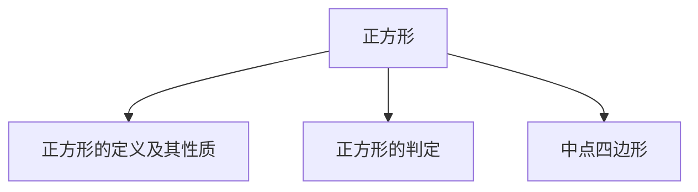
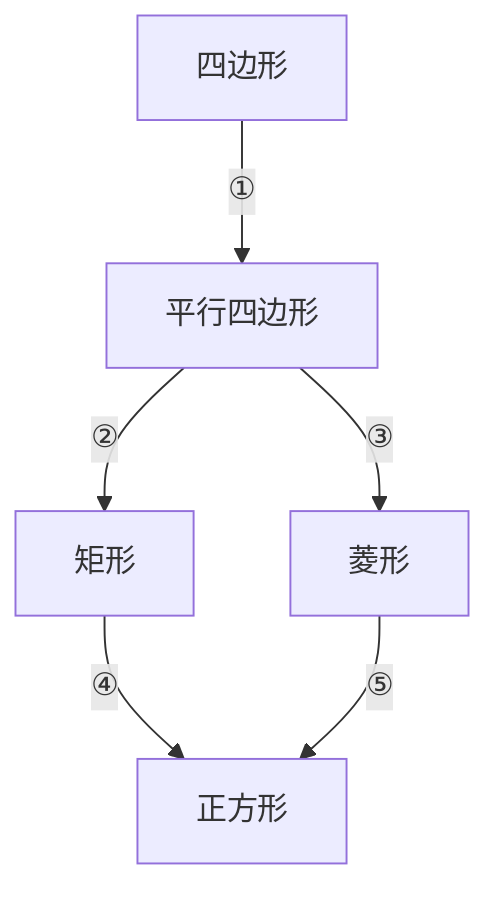

## 第 05 讲 正方形

## 01

## 学习目标

| 课程标准 | 学习目标 |
| --- | --- |
| 1正方形的定义与性质2正方形的判定3中点四边形 | 1. 熟悉正方形的定义,掌握正方形的性质,并能够熟练的应用性质。2. 掌握正方形的判定方法,能够熟练的选择合适的判定方法判定正方形。3. 掌握中点四边形的定义,能够熟练的根据四边形的性质判断中点四边形的形状。 |

## 02

## 思维导图

flowchart

##

##

## 知识点01 正方形的定义与性质

1. 正方形的定义：

四条边都 ，四个角都是 的四边形叫做正方形。

所以正方形是特殊的平行四边形，也是特殊的矩形，还是特殊的菱形。

2. 正方形的性质：

同时具有平行四边形、矩形以及菱形的一切性质。

## 【即学即练1】

1．下列有关特殊平行四边形的性质说法正确的是（ ）

A．菱形的对角线相等  
B．矩形的对角线互相垂直  
C．菱形的四个角相等

D．正方形的对角线互相垂直平分且相等

## 【即学即练2】

2．如图，正方形 ABCD 的边长为 2，对角线 AC，BD 交于点 O，P 为边 BC 上一点，且 \(B P = O B\) ，则 \(C P\) 的长为（ ）

A． \(2 \sqrt { 2 }\)

B． \(\sqrt { 2 } - 1\)

C．0.5

D．1

## 【即学即练3】

3．在正方形 ABCD 中，等边三角形 AEF 的顶点 E、F 分别在边 BC 和 CD 上，则 \(\angle C E F =\) （ ）

A． \(75^{\circ}\)

B． \(60^{\circ}\)

C． \(50^{\circ}\)

D． \(45^{\circ}\)

## 知识点02 正方形的判定

1. 直接判定：

四条边相等，四个角也相等的四边形是正方形。

符号语言：∵AB BC CD AD， \(\angle A B C = \angle B C D = \angle C D A = \angle D A B\) ＝ 。

∴四边形 ABCD 是正方形

2. 利用平行四边形、矩形以及菱形判定：

先判定四边形是平行四边形，在判定它是矩形和菱形即可判定为正方形。

①平行四边形＋邻边相等＋一个角是 \(90^{\circ}\) 。

符号语言：在 \(\square A B C D\) 中，

$\(\because A B = B C, \text {且} \angle A B C = 90^{\circ} $\)

$\(\therefore \square A B C D \text { 是正方形 } $\)

②平行四边形＋邻边相等＋对角线相等。

符号语言：▱ABCD 中

$\(\because A B = B C \text {且} A C = B D $\)

$\(\therefore \square A B C D \text { 是正方形 } $\)

③平行四边形＋对角线垂直＋一个角是 \(90^{\circ}\)

符号语言：▱ABCD 中

$\(\because A C \perp B D \text {且} \angle A B C = 90^{\circ} $\)

$\(\therefore \square A B C D \text { 是正方形 } $\)

④平行四边形＋对角线垂直＋对角线相等。

符号语言：▱ABCD 中

$\(\because A C \perp B D \text {且} A C = B D $\)

$\(\therefore \square A B C D \text { 是正方形 } $\)

可先证矩形再证菱形，也可先证菱形，再证矩形。

## 【即学即练1】

4．若▱ ABCD 中对角线 AC、BD 相交于点 O，则下列说法正确的是（ ）

A．当 \(O A = O D\) 时，▱ ABCD 为菱形

B．当 AB＝AD 时，▱ ABCD 为正方形

C．当 \(\angle A B C = 90^{\circ}\) °时，▱ ABCD 为矩形

D．当 \(AC \bot BD\) 时，▱ ABCD 为矩形

## 【即学即练2】

5．已知菱形 ABCD 中对角线 AC、BD 相交于点 O，添加条件 可使菱形 ABCD 成为正方形．

## 【即学即练3】

6．如图，已知矩形 ABCD 中，\(\angle BAD\) 和\(\angle ADC\) 的平分线交于 BC 边上一点 E．点 F 为矩形外一点，四边

形 AEDF 为平行四边形．求证：四边形 AEDF 是正方形

## 知识点03 中点四边形

1. 中点四边形的定义：

连接四边形各边的 得到的四边形叫做中点四边形。

2. 中点四边形的形状：

①任意四边形的中点四边形是

②对角线相等的四边形的中点四边形是

③对角线相互垂直的四边形的中点四边形是 。

## 【即学即练1】

7．顺次连接菱形的四边中点所得的图形为 。

## 【即学即练2】

8．如图，E、F、G、H 分别是四边形 ABCD 四条边的中点，要使四边形 EFGH 为矩形，四边形 ABCD 应具备的条件是（ ）

A．对角线互相垂直

B．对角线相等

C．一组对边平行而另一组对边不平行

D．对角线互相平分

## 题型 01 利用正方形的性质求线段或周长

【典例 1】如图，在边长为 6 的正方形 ABCD 中，E 是对角线 AC 上一点，作 \(E F \bot A D\) 于点 F，连接 DE，若 DF＝2．则 DE 的长为（ ）

A． \(3 \sqrt { 2 }\)

B． \(2 \sqrt { 5 }\)

C．4

D．2.5

【变式 1】如图，点 M是正方形 ABCD 边 AB 上一点， \(D N \bot C M\) 于 N，DN＝2CN＝2，则 BN 的长度为（ ）

A．2

B． \(\sqrt { 2 }\)

C ． \(\frac { 3 } { 2 }\)

D． \(\frac { \sqrt { 2 } } { 2 }\)

【变式 2】如图所示，在正方形 ABCD 中，O 是对角线 AC、BD 的交点，过 O 作 \(O E \bot O F\) ，分别交 AB、BC于 E、F，若 \(A E = 4, C F = 3\) ，则 EF 的长为（

A．3

B．4

C．5

D．6

【变式 3】如图，在正方形 ABCD 中，AB＝3，点 F 是 AB 边上一点，点 E 是 BC 延长线上一点， \(A F = C E\) ，\(B { \cal F } = 2 A { \cal F }\) ．连接 DF、DE、EF，EF 与对角线 AC 相交于点 G，则线段 BG 的长是（ ）

A． \(\sqrt { 5 }\)

B． \(2 \sqrt { 5 }\)

C． \(\frac { \sqrt { 13 } } { 2 }\)

D． \(\frac { 3 { \sqrt { 2 } } } { 2 }\) 2

【变式 4】如果一个长方形内部能用一些正方形铺满，既不重叠，又无缝隙，就称为“优美长方形”如图，“优美长方形”ABCD 的周长为 78，则正方形 c 的边长为（ ）

A．6

B．9

C．12

D．15

【变式 5】如图，已知正方形 ABCD 的边长为 4，P 是对角线 BD 上一点，\(PE \bot BC\) 于点 E，\(PF \bot CD\) 于点 F，连接 AP、EF．给出下列结论：① \(P D = \sqrt { 2 } E C\) ；②四边形 PECF 的周长为 8；③EF 的最小值为 2；④\(A P = E F\) ； \(\textcircled{5} A P \bot E F\) ．其中正确的结论有（ ）

A．5 个

B．4 个

C．3 个

D．2 个

## 题型 02 利用正方形的性质求角度

【典例 1】如图所示，在正方形 ABCD 中，E 是对角线 AC 上的一点．连接 BE，且 AB＝AE，则 \(\angle E B C\) 的度数是（ ）

A． \(45^{\circ}\)

B． \(30^{\circ}\)

C． \(22 . 5^{\circ}\)

D． \(20^{\circ}\)

【变式 1】如图，在正方形 ABCD 中，点 E，F 分别在 AD，AB 上，满足 \(D E = A F,\) ，连接 CE，DF，点 P，Q 分别是 DF，CE 的中点，连接 PQ．若 \(\angle A D F = \alpha\) ．则 \(\angle P Q E\) 可以用α表示为（ ）

A．α

B． \(45^{\circ} \mathrm { ~ ~ { ~ - ~ } ~ } \alpha\)

C． \(45^{\circ} - \frac { a } { 2 }\)

D． \(3 \alpha - 45^{\circ}\)

【变式 2】如图，在正方形 ABCD 中，E 为 BC 上一点，连接 DE， \(A F \bot D E\) 于点 F，连接 CF，设 \(\angle D A F =\) ，若 \(A F = 2 D F\) ，则\(\angle DCF\) 一定等于（ ）

A． \(45^{\circ} \mathrm { ~ ~ { ~ - ~ } ~ } \alpha\)

B． \(90^{\circ} \mathrm { ~ ~ { ~ - ~ } ~ } 3 \alpha\)

C \(\frac { 3 } { 4 } a\)

D． \(10^{\circ} + \frac { a } { 8 }\)

【变式 3】如图，在正方形 ABCD 中，点 E 是 AC 上一点，过点 E 作 \(EF \bot ED\) 交 AB 于点 F，连接 BE，DF，

若 \(\angle A D F = \alpha\) ，则\(\angle BEF\) 的度数是（ ）

A．2α

B． \(45^{\circ} + \alpha\)

C． \(90^{\circ} \mathrm { ~ ~ { ~ - ~ } ~ } 2 { \alpha }\)

D．3α

【变式 4】如图，正方形 ABCD 中，点 M、N、P 分别在 AB、CD、BD 上， \(\angle M P N = 90^{\circ}\) °，MN 经过对角线 BD 的中点 O，若 \(\angle P M N = \alpha\) ，则 \(\angle A M P -\) 定等于（ ）

A．2α

B． \(45^{\circ} + \alpha\)

\(90 - \frac { 1 } { 2 } \ a\)

D． \(135^{\circ} \mathrm { ~ ~ { ~ - ~ } ~ } \alpha\)

## 题型03 利用正方形的性质求点的坐标

【典例 1】在平面直角坐标系中，正方形 OABC 的顶点 O 的坐标是（0，0），顶点 B 的坐标是（2，0），则顶点 A 的坐标是（ ）

A．（1，1）

B．（﹣1，1）或（1，1）

C．（﹣1，1）

D．（1，﹣1）或（1，1）

【变式 1】如图，正方形 ABCO 中，O 是坐标原点，A 的坐标为 \(( 1, { \sqrt { 3 } } )\) ，则点 C 的坐标为

【变式 2】如图，在平面直角坐标系中，正方形 ABCD 的边长为 2， \(\angle D A O = 60^{\circ}\) °，则点 C 的坐标为

【变式 3】在平面直角坐标系中，点 O 是坐标原点，正方形 ABCD 的顶点 C，D 在第二象限，若点 A 的坐

标为（0，2），点 B 的坐标为（﹣3，0），则点 C 的坐标为

【变式 4】如图，在平面直角坐标系中，正方形 ABCD 顶点 A 的坐标为（0，4），B 点在 x 轴上，对角线 AC，BD 交于点 M， \(O M = 6 \sqrt { 2 }\) ，则点 C 的坐标为

## 题型 04 正方形的判定与性质

【典例 1】如图，在矩形 ABCD 中，对角线 AC、BD 交于点 O，添加下列一个条件，仍不能使矩形 ABCD成为正方形的是（

A． \(A C \bot B D\)

B．AC 平分 \(\angle B A D\)

C． \(A B = B C\)

D．\(\triangle OCD\) 是等边三角形

【变式 1】如图，AC 和 BD 是菱形 ABCD 的对角线，若再补充一个条件能使其成为正方形，下列条件：①\(\scriptstyle A C = B D ;\) ；② \(A C \bot B D\) ； \(\textcircled { 3 } A B^{2} + A D^{2} = B D^{2}\) ；④ \(\angle A C D = \angle A D C\) ．其中符合要求的是（ ）

A．①②

B．①③

C．②③

D．②④

【变式 2】如图，E、F、M、N 分别是正方形 ABCD 四条边上的点，且 \(\scriptstyle A E = B F = C M = D N\) ．求证：四边形EFMN 是正方形

【变式 3】如图，四边形 AECF 是菱形，对角线 AC、EF 交于点 O，点 D、B

是

对角线 EF 所在直线上两点，且 \(D E = B F\) ，连接 \(A D \setminus A B \setminus C D \setminus C B, \angle A D O = 45^{\circ}\) °

（1）求证：四边形 ABCD 是正方形；  
（2）若正方形 ABCD 的面积为 72，BF＝4，求点 F 到线段 AE 的距离

【变式 4】如图，已知四边形 ABCD 为正方形， \(\scriptstyle A B = 3 { \sqrt { 2 } }\) ，点 E 为对角线 AC 上一动点，连接 DE，过点 E作 \(E F \bot D E\) ，交 BC 于点 F，以 DE、EF 为邻边作矩形 DEFG，连接 CG

（1）求证：矩形 DEFG 是正方形；  
（2）探究：CE+CG 的值是否为定值？若是，请求出这个定值；若不是，请说明理由．

【变式 5】如图，在矩形 ABCD 中，\(\angle BAD\) 的平分线交 BC 于点 E，EF⊥

AD 于点 \(F, D G \bot A E\) 于点 \(G, \ D G\) 与 EF 交于点 O

（1）求证：四边形 \(A B E F\) 是正方形；  
（2）若 \(\ A D = A E .\) ，求证： \(A B = A G\) ；  
（3）在（2）的条件下，已知 \(A B = 1\) ，求 OF 的长

【变式 6】如图，已知：在四边形 ABFC 中， \(\angle A C B = 90^{\circ}\) ，BC 的垂直平分线 EF 交 BC 于点 D，交 AB 于点 E，且 \(C F \parallel A E .\) ．

（1）求证：四边形 BECF 是菱形；  
（2）当\(\angle A\)＝ °时，四边形 BECF 是正方形；  
（3）在（2）的条件下，若 \(A C = 4\) ，则四边形 ABFC 的面积为

【典例 1】如图，E、F、G、H 分别是四边形 ABCD 四条边的中点，则四边形 EFGH 一定是（ ）

A．平行四边形

B．矩形

C．菱形

D．正方形

【变式 1】顺次连接矩形 ABCD 各边中点得到四边形 EFGH，它的形状是（ ）

A．平行四边形

B．矩形

C．菱形

D．正方形

【变式 2】四边形 ABCD 中，点 E、F、G、H 分别是 AB、BC、CD、AD 的中点，下列条件中能使四边形EFGH 为矩形的是（ ）

A．\(AB \bot BC\)

B．AB＝BD

C．AC＝BD

D．\(AC \bot BD\)

【变式 3】如图，已知四边形 ABCD 中，E、F、G、H 分别为 AB、BC、CD、DA 上的点（不与端点重合）．下列说法错误的是（ ）

A．若 E、F、G、H 分别为各边的中点，则四边形 EFGH 是平行四边形

B．若四边形 ABCD 是任意矩形，则存在无数个四边形 EFGH 是菱形

C．若四边形 ABCD 是任意菱形，则存在无数个四边形 EFGH 是矩形

D．若四边形 ABCD 是任意矩形，则至少存在一个四边形 EFGH 是正方形

1．菱形、矩形、正方形都具有的性质是（

A．对角线互相垂直

B．对角线相等

C．四条边相等，四个角相等

D．两组对边分别平行且相等

2．如图，四边形 ABCD 是平行四边形，下列结论中错误的是（ ）

A．当 \(\angle A B C = 90^{\circ}\) ，平行四边形 ABCD 是矩形  
B．当 AC＝BD，平行四边形 ABCD 是矩形  
C．当 AB＝BC，平行四边形 ABCD 是菱形  
D．当 \(A C \bot B D,\) ，平行四边形 ABCD 是正方形

3．如图，已知四边形 ABCD 是平行四边形，下列三个结论：①当 AB＝BC 时，它是菱形；②当 \(A C \bot B D\) 时，它是矩形；③当 \(\angle A B C = 90^{\circ}\) °时，它是正方形．其中结论正确的有（ ）

A．0 个

B．1 个

C．2 个

D．3 个

4．如图，E，F，G，H 分别是矩形 ABCD 各边的中点，AB＝6cm，BC＝8cm，则四边形 EFGH 的面积是（ ）

A． \(48 c m^{2}\)

B． \(32 c m^{2}\)

C． \(24 c m^{2}\)

D． \(12 c m^{2}\)

5．随着科技的进步，机器人在各个领域的应用越来越广泛．如图为正方形形状的擦窗机器人，其边长是28cm．在某次擦窗工作中，PM、PN 为窗户的边缘，擦窗机器人的两个顶点 A、B 分别落在 PM、PN 上，\(P A = 14 c m\) ，将擦窗机器人绕中心 O 逆时针旋转一定的角度，使得 \(AD \parallel PM\)，则旋转角度是（

natural_image

Close-up of a blue square wall-mounted device with a white panel and cable, mounted on a window (no visible text or symbols)

A． \(15^{\circ}\)

B． \(30^{\circ}\)

C． \(45^{\circ}\)

D． \(60^{\circ}\)

6．如图，正方形 ABCD 的边长为 10，且 AE＝FC＝8， \(B F = D E = 6\) ，则 EF 的长为（ ）

A．2

B． \(\frac { 3 { \sqrt { 2 } } } { 2 }\)

C． \(2 \sqrt { 2 }\)

D． \(3 \sqrt { 2 }\)

7．小明用四根相同长度的木条制作了一个正方形学具（如图 1），测得对角线 \(\mathtt { A C } = \mathtt { 10 } \sqrt { 2 } \mathtt { c m }\) ，将正方形学具变形为菱形（如图 2）， \(\angle D A B = 60^{\circ}\) °，则图 2中对角线 AC 的长为（

natural_image

Simple geometric diagram of a square with labeled vertices A, B, C, D and diagonal line (no text or symbols)

图1

图2

A．20cm

B． \(10 \sqrt { 6 } < \pi\)

C． \(10 \sqrt { 3 } \mathtt { c } \mathtt { \pi }\)

D． \(10 \sqrt { 2 } \mathsf { c } \pi\)

8．如图，正方形 ABCD 的边长为 9，E 为对角线 AC 上一点，连接 DE，过点 E 作 \(E F \bot D E\) ，交射线 BC 于点 F，以 DE，EF 为邻边作矩形 DEFG，连接 CG，下列结论中不正确的是（ ）

A．矩形 DEFG 是正方形

B． \(\angle C E F = \angle A D E\)

C．CG 平分\(\angle DCH\)

D． \(C E + C G = 9 \sqrt { 2 }\)

9．如图，P 为正方形 ABCD 内一点，过 P 作直线 PD 交 BC 于点 E，过 P 作直线 GH 交 AB、DC 于 G、H，且 \(G H = D E\) ．若 \(\angle A P D = \angle D E C\) ， \(\angle E D C = 15^{\circ}\) ．以下结论：

① \(\triangle A B P\) 为等边三角形；  
② \(P G = \sqrt { 3 } P D\)  
③ \(S_{\triangle P B E} = \frac { 3 } { 4 } P D^{2}\)  
④ \(\sqrt { 2 } B P = P E + P G\)

其中正确的有（

A．1 个

B．2 个

C．3 个

D．4 个

10．如图，依次连接第一个矩形各边的中点得到一个菱形，再依次连接菱形各边的中点得到第二个矩形，

按照此方法继续下去，已知第一个矩形的面积为 1，则第 n个矩形的面积为（ ）

flowchart

11．小华在复习四边形的相关知识时，绘制了如图所示的框架图，④号箭头处可以添加的条件是 ．（写出一种即可）

flowchart

12．已知正方形 ABCD，分别以 BC，DC 为边长作等边 \(\triangle B E C\) 和等边 \(\triangle D C F _ { \mathrm { { ; } } }\) ，连接 EF，则 \(\angle C E F =\)

13．如图，正方形 ABCD 的对角线相交于点 O，点 O 又是另一个正方形 A'B'C'O 的一个顶点．若两个正方形的边长均为 2，则图中阴影部分图形的面积为

14．如图，菱形 ABCD 的对角线 AC，BD 相交于点 O，点 E，F 同时从 O 点出发在线段 AC 上以 1cm/s的速度反向运动（点 E，F 分别到达 A，C 两点时停止运动），设运动时间为 t s．连接 DE，DF，BE，BF，已知 \(\triangle A B D\) 是边长为 6cm 的等边三角形，当 t＝ s 时，四边形 DEBF 为正方形

15．如图，分别以 \(\mathrm { R t } \triangle A C B\) 的直角边 AC 和斜边 AB 为边向外作正方形 ACFG 和正方形 ABDE，连接 CE，

\(B G, \ G E .\) ．已知 \(A C = 4, A B = 5\) ，则 GE 的长为

16．如图，在正方形 ABCD 中，P 是对角线 BD 上的一点，点 E 在 AD 的延长线上，且 \(\angle P A E = \angle E\) ，PE 交CD 于点 F．

（1）求证： \(P C = P E ;\) ；  
（2）求\(\angle CPE\) 的度数

17．定义：若一个四边形满足三个条件①有一组对角互补，②一组邻边相等，③相等邻边的夹角为直角，则称这样的四边形为“直角等邻对补”四边形，简称为“直等补”四边形．根据以上定义，解答下列问题．

（1）如图 1，四边形 ABCD 是正方形，点 E 在 CD 边上，点 F 在 CB 边的延长线上，且 \(D E = B F\) ，连接AE，AF，请根据定义判断四边形 AFCE 是否是“直等补”四边形，并说明理由

（2）如图 2，已知四边形 ABCD 是“直等补”四边形， \(A B = A D\) ，若 AB＝20， \(C D = 4\) ，求 BC 的长

图1

图2

18．已知四边形 ABCD 和 AEFG 均为正方形

（1）如图①，当点 A，B，G 三点在一条直线上时，连接 BE，DG，请判断线段 BE 与 DG 的数量关系和位置关系，并说明理由；

（2）如图②，当点 A，B，G 三点不在一条直线上时，则（1）的结论是否成立？请说明理由

①

②

19．如图， \(\mathrm { R t } \triangle C E F\) 中， \(\angle C = 90^{\circ}\) ， \(\angle C E F\) ，\(\angle CFE\) 外角平分线交于点 A，过点 A

分别作直线 CE，CF 的垂线，B，D 为垂足

（1） \(\angle E A F = 45^{\circ}\) （直接写出结果不写解答过程）；

（2）①求证：四边形 ABCD 是正方形．

②若 \(B E = E C = 3\) ，求 DF 的长．

20．四边形 ABCD 为正方形，点 E 为线段 AC 上一点，连接 DE，过点 E 作 \(EF \bot DE\)，交射线 BC 于点 F，

以 DE、EF 为邻边作矩形 DEFG，连接 CG

（1）如图 1，求证：矩形 DEFG 是正方形；  
（2）若 AB＝2， \(C E = \sqrt { 2 }\) ，求 CG 的长度；  
（3）当线段 DE 与正方形 ABCD 的某条边的夹角是 \(30^{\circ}\) 时，直接写出 \(\angle E F C\) 的度数

备用图
