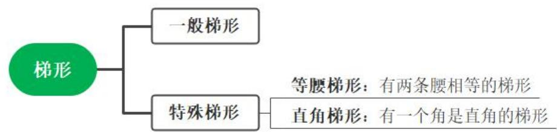
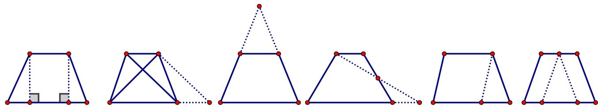
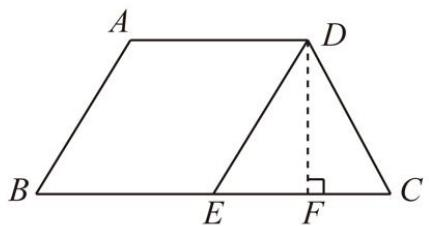
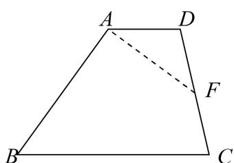
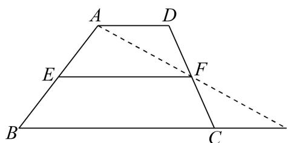
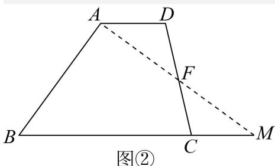
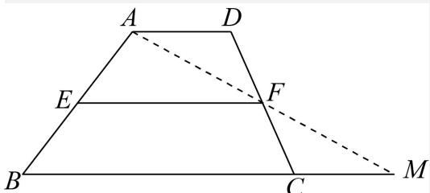
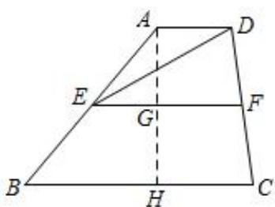

## 考点三 梯形的性质与判定

## 夯基·必备基础知识梳理

梯形的定义：一组对边平行而另一组对边不平行的四边形叫梯形. 

梯形的分类: 

等腰梯形性质：1）等腰梯形的两底平行，两腰相等； 

2）等腰梯形的同一底边上的两个角相等； 

3）等腰梯形的两条对角线相等； 

4）等腰梯形是轴对称图形（底边的中垂线就是它的对称轴）. 

等腰梯形判定：1）两腰相等的梯形是等腰梯形； 

2）同一底边上的两个角相等的梯形是等腰梯形； 

3）对角线相等的梯形是等腰梯形. 

【解题思路】判定一个四边形是等腰梯形, 必须先判定四边形是梯形, 再证明同一底边上的两个角相等或两腰相等或两条对角线相等. 

梯形的面积公式： $S=\frac{1}{2}\times$ （上底+下底）×高 

解决梯形问题的常用方法（如下图所示）： 

1）“作高”：使两腰在两个直角三角形中； 

2）“平移对角线”：使两条对角线在同一个三角形中. 

3）“延长两腰”：构造具有公共角的两个三角形. 

4）“等积变形”：连接梯形上底一端点和另一腰中点，并延长交下底的延长线于一点，构成三角形．并且这个三角形面积与原来的梯形面积相等. 

5）平移腰. 过上底端点作一腰的平行线，构造一个平行四边形和三角形. 

6）过上底中点平移两腰.构造两个平行四边形和一个三角形. 

## 提升·必考题型归纳

题型01 等腰三角形的性质求解 

【变式 1-3】（2023·四川达州·统考二模）如图，在梯形 ABCD 中， $AD \parallel BC$ ，点 E 在 BC 上，且 $AB \parallel DE$ ， 

(1)试判断四边形ABED的形状，并说明理由； 

(2)若 $AB = AD = DC$ ， $EC = BE$ 

①求 $\angle B$ 的度数; 

②当 $DC = 4\mathrm{cm}$ 时，求四边形ABED的面积. 

【答案】(1)平行四边形，理由见解析 

(2)① $60^{\circ}$ ; ② $8\sqrt{3}cm^{2}$ 

【分析】（1）根据对边互相平行的四边形是平行四边形即可作出判断. 

(2) ①根据题意可先确定 $\Delta DCE$ 是等边三角形、梯形是等腰梯形, 然后即可得出答案; ②先求出 $DF$ 的长, 

从而根据 $S = EB \times DF$ 即可得出答案. 

【详解】（1）解：∵ $AD \parallel BC$ ， $AB \parallel DE$ ， 

∴四边形 ABED 是平行四边形; 

(2) ①: 四边形 ABED 是平行四边形, 

$$
\therefore A D = B E, \quad A B = D E,
$$

$$
\because A B = A D = D C, E C = B E
$$

$$
\therefore D E = C D = E C,
$$

$\therefore \triangle DCE$ 是等边三角形， 

$$
\therefore \angle C = 6 0 ^ {\circ},
$$

∵四边形 ABCD 是等腰梯形 

$$
\therefore \angle B = \angle C = 6 0 ^ {\circ},
$$

$$
② \because D C = 4 \mathrm{cm}
$$

$$
\therefore B E = E C = D C = 4 \mathrm{cm},
$$

作 $DF \perp BC$ 于点 $F$ , 则 $CF = \frac{1}{2} EC = 2\mathrm{cm}$ , 

在 Rt $\triangle DCF$ 中，根据勾股定理，得： $DF = \sqrt{CD^{2} - CF^{2}} = \sqrt{4^{2} - 2^{2}} = \sqrt{12} \, (\text{cm})$ , 

∴四边形 ABED 的面积= $BE \cdot DF = 4 \times \sqrt{12} = 8\sqrt{3}(\text{cm}^2)$ . 

【点睛】本题考查等腰梯形及等边三角形的知识，难度不算太大，但题目综合的知识点比较多，同学们要注意细心解答. 

## 题型 03 解决梯形问题的常用方法

【例 3】（2023 上·上海静安·八年级上海市风华初级中学校考期末）如图，四边形 ABCD 中， $AD \parallel BC$ ，E 是边 CD 的中点，如果 AE 平分 $\angle BAD$ ，那么下列结论中不一定成立的是（） 

A. $BE$ 平分 $\angle ABC$ B. $\angle AEB = 90^{\circ}$ C. $AE = \frac{1}{2} AB$ D. $AB = AD + BC$ 

【答案】C 

【分析】延长 AE 交 BC 延长线于 M，求出 $\angle EAB = \angle M$ ，推出 AB = BM，AD = CM，AE = EM，即可推出 A，B 正确，根据梯形中位线与三角形的面积公式即可判断 D；根据含 30 度角的直角三角形的性质判断 C 选项. 

【详解】解：延长 AE 交 BC 延长线于 M， 

$\because AD \parallel BC,$ $\therefore \angle DAE = \angle M,$ $\because \angle EAD = \angle EAB,$ $\therefore \angle EAB = \angle M,$ $\therefore AB = BM,$ $\because E$ 为 $CD$ 中点， $\therefore DE = EC,$ $\because \angle DEA = \angle CEM,$ $\therefore \triangle DAE \cong \triangle CME,$ $\therefore AD = CM, AE = EM,$ $\therefore AD + BC = CM + BC = BM = AB,$ ∵ AB = BM, AE = EM, 

∴ $BE \perp AE$ ; BE 平分 $\angle ABC$ ; 

$$
\therefore \angle A E B = 9 0 ^ {\circ},
$$

故 A，B 选项正确， 

取 AB 中点 F，连接 EF， 

∵ E, F 分别是 AB, DC 的中点, 

∴ EF 是梯形 ABCD 是中位线 

$$
\therefore E F = \frac {1}{2} (A D + B C)
$$

$$
\because \angle A E B = 9 0 ^ {\circ},
$$

$$
\therefore E F = \frac {1}{2} A B,
$$

$\therefore AB = AD + BC$ ，故 D 选项正确， 

当 $\angle ABE = 30^{\circ}$ 时， $AE = \frac{1}{2} AB$ ，故C选项不一定成立 

故选：C. 

【点睛】本题考查了全等三角形的性质和判断，平行线的性质，等腰三角形的性质和判定的应用，梯形的性质，关键是推出 $\triangle ABM$ 是等腰三角形. 

【变式 3-1】（2023 下·江苏南京·八年级统考期中）在探索平面图形的性质时，往往需通过剪拼的方式帮助我们寻找解题思路. 

图①

图②

图③

知识回顾 

例如，在证明三角形中位线定理时，就采用了如图①的剪拼方式，将三角形转化为平行四边形使问题得以解决. 

实践操作 

如图②，在梯形 ABCD 中， $AD \parallel BC$ ，F 是腰 DC 的中点，请你沿着 AF 将上图的梯形剪开，并重新拼成一个完整的三角形. 

数学发现 

如图③, 在梯形 $ABCD$ 中, $AD \parallel BC$ , $E 、 F$ 分别是两腰 $AB 、 DC$ 的中点, 我们把 $EF$ 叫做梯形 $ABCD$ 的中位线. 请类比三角形的中位线的性质, 猜想 $EF$ 和 $AD 、 BC$ 有怎样的位置和数量关系? 

证明猜想 

请结合“实践操作”完成猜想的证明. 

【答案】实践操作：画图见解析；数学发现： $EF\|AD\|BC$ ， $EF=\frac{1}{2}(AD+BC)$ ；证明猜想：证明见解析

【分析】数学发现：延长 AF 交 BC 延长线于 M，证明 $\triangle ADF \cong \triangle MCF(AAS)$ 可得到所要的三角形； 

数学发现：根据梯形性质和三角形的中位线进行猜想即可得出结论； 

证明猜想:如图③,连接 AF 并延长,交 BC 延长线于点 M,证明 $\triangle ADF \cong \triangle MCF(AAS)$ 得到 AD = MC, AF = MF,
在 $\triangle ABM$ 中，利用三角形的中位线可证得 $EF\parallel BM$ ， $EF=\frac{1}{2}BM$ ，进而可证得结论. 

【详解】解：实践操作：画出如图②所示△ABE. 

数学发现： $EF\|AD\|BC,\ EF=\frac{1}{2}(AD+BC)$ . 

证明猜想：连接 AF 并延长，交 BC 延长线于点 M， 

图③

∵ AD∥BC, 

$\therefore \angle M = \angle DAF.$ 

∵ F 是 DC 的中点， 

$$
\therefore D F = C F.
$$

$$
\because \angle A F D = \angle M F C,
$$

$$
\therefore \triangle A D F \cong \triangle M C F (A A S).
$$

$$
\therefore A D = M C, \quad A F = M F.
$$

∴点 F 是 AM 的中点，又点 E 是 AB 的中点， 

∴ EF 是 $\triangle ABM$ 的中位线， 

$\therefore EF \parallel BM, EF = \frac{1}{2} BM.$ 

$\therefore EF = \frac{1}{2} (MC + BC) = \frac{1}{2} (AD + BC).$ 

∵ $AD \parallel BC$ , $EF \parallel BC$ , 

∴ EF ∥ AD. 

$\therefore EF\|AD\|BC, EF = \frac{1}{2}(AD + BC).$ 

【点睛】本题考查三角形的中位线、梯形的性质、全等三角形的判定与性质、平行线的性质，解答的关键是添加辅助线，利用转化思想解决问题. 

【变式 3-2】(2022 上·上海·九年级开学考试) 如图, 点 $E$ 、 $F$ 分别是梯形 $ABCD$ 两腰的中点, 联结 $EF$ 、 $DE$ , 如果图中 $\triangle DEF$ 的面积为 1.5, 那么梯形 $ABCD$ 的面积等于 ____. 

【答案】6 

【分析】过点 A 作 $AH \perp BC$ 于 H，交 EF 于 G，根据梯形中位线定理得到 $AD \parallel EF \parallel BC$ ，根据三角形的面积公式、梯形的面积公式计算，得到答案. 

【详解】解：过点 A 作 $AH \perp BC$ 于 H，交 EF 于 G，如图， 

∵点 E、F 分别是梯形 ABCD 两腰的中点， 

∴EF 是梯形 ABCD 的中位线， 

$\therefore AD \parallel EF \parallel BC,$ 

$\therefore AG \perp EF, \quad AG = GH,$ 

$$
\because S _ {\triangle D E F} = 1. 5,
$$

$$
\therefore \frac {1}{2} E F \cdot A G = 1. 5,
$$

$$
\therefore E F \cdot A H = 1. 5 \times 4 = 6,
$$

$\therefore S_{\text{梯形}ABCD}=EF\cdot AH=6,$ 

故答案为：6. 

【点睛】本题考查的是梯形的中位线、三角形的面积计算，掌握梯形中位线定理是解题的关键. 