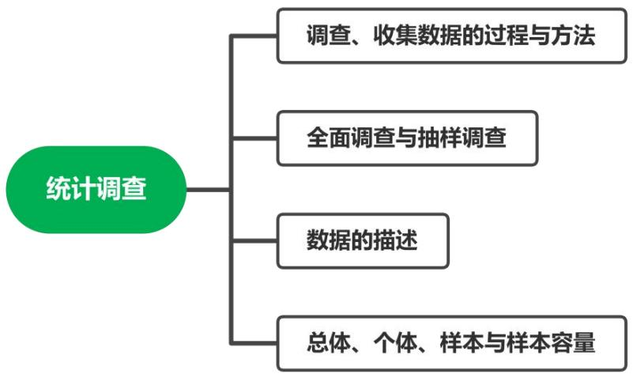
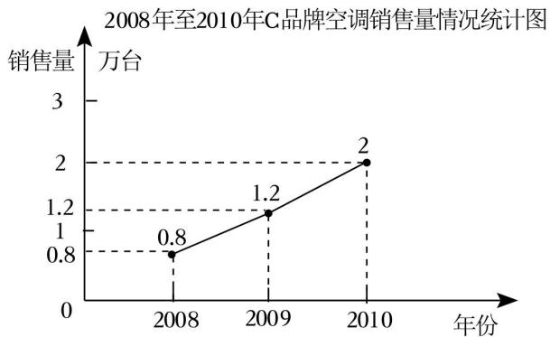
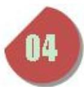
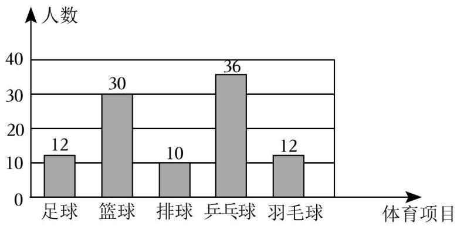
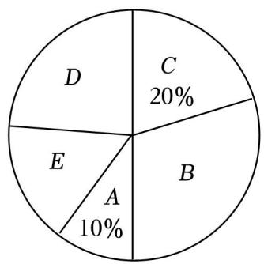
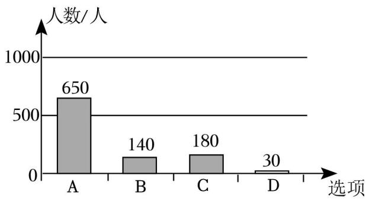

## 第 01 讲 统计调查

## 01

## 学习目标

<table><tr><td>课程标准</td><td>学习目标</td></tr><tr><td>1调查、收集数据的过程与方法2全面调查与抽样调查3数据的描述4总体、个体、样本和样本容量</td><td>1. 掌握调查、收集数据的过程与方法,能够熟练的设计恰当的调查过程。2. 掌握全面调查与抽样调查的意义,能够在调查过程中选择恰当的方式调查。3. 掌握描述数据的方法,能够用适当的方法来描述数据。4. 掌握总体、个体、样本以及样本容量的意义,能够熟练的判断。</td></tr></table>

## 02

## 思维导图

## 知识点01 调查、收集数据的过程与方法

## 1. 统计调查的一般步骤：

（1）确定 调查问题 ； 

（2）确定 调查对象 ； 

（3）确定 调查方法与形式 ； 

（4）展开调查； 

（5）统计、整理调查数据； 

（6）分析数据得出结论； 

2. 收集数据的方式与方法： 

方法：① 问卷 调查；② 实地 调查 ；③ 媒体 调查；④实验法。 

方式： 全面 调查与 抽样 调查。 

3. 整理数据的方法： 

统计中，一般采用表格整理的数据，采用“划记”的方法，写“正”字，字的每一笔代表一个数据。 

4. 描述数据的方法： 

一般用 统计表 与 统计图 描述数据。 

## 【即学即练1】

1．为了了解某校九年级 1200 学生的体重情况，请你运用所学的统计知识，将解决上述问题要经历的几个 重要步骤进行排序．①收集数据；②设计调查问卷；③用样本估计总体；④整理数据；⑤分析数据．则 正确的排序为 ②①④⑤③ ．（填序号） 

【分析】根据已知统计调查的一般过程：①问卷调查法﹣ ﹣收集数据；②列统计表﹣ 整理数据；③画统计图﹣﹣ ﹣﹣描述数据进而得出答案 

【解答】解：解决上述问题要经历的几个重要步骤进行排序为： 

②设计调查问卷，①收集数据，④整理数据，⑤分析数据，③用样本估计总体 

故答案为：②①④⑤③ 

## 【即学即练2】

2．某班调查学生最喜欢的体育运动，设计了如下尚不完整的调查问卷：该班准备在“①蛙泳，②球类， ③游泳，④篮球，⑤自由泳，⑥排球”中选取四个作为问卷问题的备选项目，你认为最合理的是（ ） 

A．①②③④ 

B．①④⑤⑥ 

C．②③⑤⑥ 

D．②③④⑤ 

【分析】根据调查问卷设置选项的不重复性，不包含性，即可解答 

【解答】解：该班准备在“①蛙泳，②球类，③游泳，④篮球，⑤自由泳，⑥排球”中选取四个作 为问卷问题的备选项目，我认为最合理的是①④⑤⑥， 

故选：B． 

## 【即学即练3】

3．为了考察 4 名篮球运动员投篮的命中率，让每名运动员投篮 10 次．记录员记下这 4 名运动员投篮命中 次数如下： 

甲： ；乙： ；丙： ；丁： .请将数据整理后填写表． 

<table><tr><td></td><td>甲</td><td>乙</td><td>丙</td><td>丁</td></tr><tr><td>命中次数</td><td>___</td><td>___</td><td>___</td><td>___</td></tr><tr><td>命中率</td><td>—</td><td>—</td><td>—</td><td>—</td></tr></table>

【分析】根据记录员记下这 4 名运动员投篮命中次数，将数据整理后填表即可 

【解答】解：由题意可知， 

甲命中 9次，命中率为 ${ \frac { 9 } { 1 0 } } \times 1 0 0 \% = 9 0 \%$ 

乙命中 6次，命中率为 ${ \frac { 6 } { 1 0 } } \times 1 0 0 \% { = } 6 0 \%$ ， 

丙命中 8次，命中率为 ${ \frac { 8 } { 1 0 } } \times 1 0 0 \% = 8 0 \%$ ， 

丁命中 10次，命中率为 100%， 

数据整理如下表： 

<table><tr><td></td><td>甲</td><td>乙</td><td>丙</td><td>丁</td></tr><tr><td>命中次数</td><td>9</td><td>6</td><td>8</td><td>10</td></tr><tr><td>命中率</td><td>90%</td><td>60%</td><td>80%</td><td>100%</td></tr></table>

## 知识点02 全面调查与抽样调查

## 1. 全面调查：

调查 全体 对象的调查叫做全面调查。适用于调查范围较小，调查不具有破坏性且数据要求准确全 面的调查。 

优点： 结果准确，数据全面 。 

缺点： 工作量大，耗时耗力，受外部条件影响大 。 

## 2. 抽样调查：

抽取 部分 对象进行调查的方法叫做抽样调查。适用于调查范围广，涉及面大，受条件限制或具 有破坏性的调查。 

优点： 工作量小，省时省力，受外部条件影响小 。 

缺点： 数据不全面，结果不是很准确 。 

## 【即学即练1】

4．下列调查中，适宜采用普查方式的是（ 

A．调查市场上蔬菜保鲜的情况 

B．调查乘坐高铁的旅客是否携带了违禁物品 

C．调查某品牌电池的使用寿命 

D．调查某地区初中生一天完成作业所用时间 

【分析】根据普查得到的调查结果比较准确，但所费人力、物力和时间较多，而抽样调查得到的调查结 

果比较近似解答 

【解答】解：A．调查市场上蔬菜保鲜的情况，有破坏性，适合抽样调查调，故此项不符合题意； 

B．调查乘坐高铁的旅客是否携带了违禁物品，事关重大，适宜采用普查，故此项符合题意； 

C．调查某品牌电池的使用寿命，有破坏性，适合抽样调查调，故此项不符合题意； 

D．调查某地区初中生一天完成作业所用时间，调查范围广，适合抽样调查，故此项不符合题意 

故选：B． 

## 【即学即练2】

5．下列调查中，适合采用抽样调查的是（ 

A．了解全班中学生每周使用手机的时间 

B．对乘坐高铁的乘客进行安全检查 

C．调查我校初三某班的视力情况 

D．环保部门调查任河全域水质情况 

【分析】根据普查得到的调查结果比较准确，但所费人力、物力和时间较多，而抽样调查得到的调查结 果比较近似进行判断 

【解答】解：A．了解全班中学生每周使用手机的时间，采用全面调查，故不符合题意； 

B．对乘坐高铁的乘客进行安全检查，适合全面调查，故不符合题意； 

C．调查我校初三某班的视力情况，适合全面调查，故不符合题意； 

D．环保部门调查任河的水质情况，工作量大，范围广，应采用抽样调查，故符合题意 

故选：D． 

## 知识点03 数据的描述

1. 数据的两种描述方法： 

数据的描述常利用 统计图 或 统计表 。常见的统计图有 条形统计图、折线统计图、扇形 统计图 。 

2. 条形统计图、折线统计图以及扇形统计图的优缺点： 

条形统计图：优点：能够清楚的表示出每一组的具体数据。 

缺点：不能表示出数据在不同时间内的变化情况以及数据占总数的百分比。 

折线统计图：优点：能够清楚反映出数据的变化情况。 

缺点：不能表示出数据占总数的百分比。 

扇形统计图：优点：能够清楚的表示出各部分在总体中所占的百分比。 

缺点：不能清楚的表示出每一项的数目。 

3. 画扇形统计图的步骤： 

第一步：计算百分比：计算各部分数据占总数的百分比。 

第二步：求圆心角：计算各部分在圆中所对应的圆心角度数，利用公式 360°×百分比 计算。 

第三步：画扇形：根据第二步求出的圆心角度数在圆中画出各部分的扇形。 

第四步：在每个扇形中标出相应的名称以及百分比。 

## 【即学即练1】

6．某一家电卖场对其销售的空调情况进行了调查，得到下面的信息： 

2008年至 2010年各种品牌空调的销售量（单位：方台） 

<table><tr><td>年份</td><td>A</td><td>B</td><td>C</td><td>其他品牌</td><td>总量</td></tr><tr><td>2008</td><td>1.7</td><td>1</td><td>0.8</td><td>4.5</td><td>8</td></tr><tr><td>2009</td><td>1.6</td><td>1.2</td><td>1.2</td><td>5</td><td>9</td></tr><tr><td>2010</td><td>1.55</td><td>1.45</td><td>2</td><td>5</td><td>10</td></tr></table>

请你制作适当的统计图，反映下列信息： 

（1）2008年至 2010年，C 品牌空调在该卖场销售量的变化情况； 

（2）2010年，A，B，C 及其他品牌的空调在该卖场的市场占有率情况 

【分析】（1）绘制折线统计图即可； 

（2）绘制扇形统计图即可 

【解答】解：（1）要反应 2008年至 2010年 C 品牌空调在该卖场销售量的变化情况，选择折线统计图， 如图所示； 

（2）反应 2010年，A，B，C 及其他品牌的空调在该卖场的市场占有率情况．选择扇形统计图，如图所 示： 

某商场2010年各种空调销售情况统计图 

## 知识点04 总体、个体、样本及样本容量

1. 总体、个体、样本及其样本容量： 

总体：要考察的 全体 对象。 

个体：组成总体的 每一个 考察对象。 

样本：所有被抽取出来的个体组成一个样本。 

样本容量：样本中个体的 数目 称为样本容量。 

2. 简单随机抽样： 

在抽取样本的过程中，总体中的每一个个体都有 相等 的机会被抽到，这样的抽样方法是一种简 单随机抽样。抽出的样本必须具有 随机性 、 广泛性 、 代表性 

## 【即学即练1】

7．为了解某校初二年级 900名学生每天花费在数学学习上的时间，抽取了 100名学生进行调查，以下说法 正确的是（ ） 

A．样本容量是 100 

B．每名学生是个体 

C．从中抽取的 100 名学生是样本 

D．初二年级 900名学生是总体 

【分析】根据总体、个体、样本、样本容量的定义解答即可 

【解答】解：A．样本容量是 100，说法正确，故本选项符合题意； 

B．每名学生每天花费在数学学习上的时间是个体，故原说法错误，故本选项不符合题意； 

C．从中抽取的 100名学生每天花费在数学学习上的时间是样本，故原说法错误，故本选项不符合题意； 

D．初二年级 900名学生每天花费在数学学习上的时间是总体，故原说法错误，故本选项不符合题意 

故选：A． 

## 题型 01 统计调查的过程与方法

【典例 1】实施“双减”政策后，为了解我县初中生每天完成家庭作业所花时间及质量情况，根据以下四 个步骤完成调查：①收集数据；②分析数据；③制作并发放调查问卷；④得出结论，提出建议和整改 意见．你认为这四个步骤合理的先后排序为（ ） 

A．①②③④ 

B．①③②④ 

C．③①②④ 

D．②③④① 

【分析】根据题目提供的问题情境，采取抽样调查的方式进行，于是先确定抽查样本，紧接着统计收集 来的数据，对数据进行分析，最后得出结论，提出建议 

【解答】解：在统计调查中，我们利用调查问卷收集数据，利用表格整理分析数据，利用统计图描述数 据，通过分析表和图来了解情况，最后得出结论，提出建议和整改意见 

因此合理的排序为：③①②④ 

故选：C 

【变式 1】实施“双减政策”之后，为了解贵阳市某初中 2735名学生平均每天完成各科家庭作业所用的时 间，根据以下 4个步骤进行调查活动：①整理数据；②得出结论，提出建议；③分析数据；④收集数 据． 

对这 4 个步骤进行合理的排序移动： ④①③② 

【分析】根据统计调查的顺序进行即可 

【解答】解：统计调查的顺序是：收集数据；整理数据；分析数据；得出结论，提出建议四个步骤，故 合理的排序为：④①③②， 

故答案为：④①③② 

【典例 2】万州区教师进修学院为了督查国家双减政策的落实情况，现调查某校学生每日睡眠时长问题， 选用下列哪种方法最恰当（ ） 

A．查阅文献资料 

B．对学生问卷调查 

C．上网查询 

D．对校领导问卷调查 

【分析】根据调查收集数据的过程和方法以及抽样调查的可靠性进行判断即可 

【解答】解：为了调查某校学生每日睡眠时长问题，最恰当的方法是对学生进行问卷调查， 故选：B． 

【变式 1】王老师了解到七年级 5 个班学生完成课后作业的平均时间分别为（单位：分钟）：30，45，40， 30，35，获得这组数据的方法（ ） 

A．直接观察 

B．测量 

C．实验 

D．调查 

【分析】根据调查收集数据的过程与方法，结合具体的问题情境进行判断即可 

【解答】解：王老师获得七年级 5 个班学生完成课后作业的平均时间所用的方法是调查，不可能利用观 察、测量、实验， 

故选：D． 

【变式 2】为了解游客在 A，B，C 三个城市旅游的满意度，某旅游公司商议了四种收集数据的方案．方案 一：在多家旅游公司调查 1000名导游；方案二：在 A 城市调查 1000名游客；方案三：在三个城市各调 查 5 名游客；方案四：在三个城市各调查 1000 名游客，其中最合理的是 四 方案． 

【分析】根据抽样调查的代表性、普遍性结合具体的问题情境进行判断即可 

【解答】解：根据抽样调查的代表性、普遍性可知，为了解游客在 A，B，C 三个城市旅游的满意度，在 三个城市各调查 1000 名游客比较合理 

故答案为：四． 

## 题型 02 全面调查与抽样调查

【典例 1】下列调查中，适宜采用普查方式的是（ ） 

A．了解神舟飞船的设备零部件的质量情况 

B．了解一批灯泡的使用寿命 

C．了解江苏省中学生观看电影《第二十条》的情况 

D．了解无锡市中小学生的课外阅读时间 

【分析】根据普查得到的调查结果比较准确，但所费人力、物力和时间较多，而抽样调查得到的调查结 果比较近似解答 

【解答】解：A．了解神舟飞船的设备零部件的质量情况，属于精确度要求高的调查，适宜采用普查，故 此项符合题意； 

B．了解一批灯泡的使用寿命，有破坏性适合抽样调查调，故此项不符合题意； 

C．了解江苏省中学生观看电影《第二十条》的情况，调查范围广适合抽样调查，故此项不符合题意； 

D．了解无锡市中小学生的课外阅读时间，调查范围广适合抽样调查，故此项不符合题意 

故选：A． 

【变式 1】下列调查中，适合普查方式的是（ ） 

A．调查全国初中生的睡眠时间 

B．调查某班级学生的身高情况 

C．调查长江江苏段的水质情况 

D．调查某品牌灯泡的使用寿命 

【分析】选择全面调查还是抽样调查要根据所要考查的对象的特征灵活选用，一般来说，对于具有破坏 性的调查、无法进行全面调查、全面调查的意义或价值不大，应选择抽样调查，对于精确度要求高的调 查，事关重大的调查往往选用全面调查 

【解答】解：A、调查全国初中生的睡眠时间，范围广，人数众多，不易调查，应采用抽样调查，不符合 题意； 

B、调查某班级学生的身高情况，范围小，人数不多，适合普查，符合题意； 

C、调查长江江苏段的水质情况，范围广，人数众多，应采用抽样调查，不符合题意； 

D、调查某品牌灯泡的使用寿命，具有破坏性，应采用抽样调查，不符合题意； 

故选：B． 

【典例 2】下列调查中，适合用抽样调查的是（ ） 

A．订购校服时了解学生衣服尺寸 

B．了解全班学生上学的交通方式 

C．了解神舟七号飞船零部件的质量 

D．了解我国初中生视力情况 

【分析】根据全面调查与抽样调查的特点，逐一判断即可解答 

【解答】解：A、订购校服时了解学生衣服尺寸，适合用普查，故 A 不符合题意； 

B、了解全班学生上学的交通方式，适合用普查，故 B 不符合题意； 

C、了解神舟七号飞船零部件的质量，适合用普查，故 C 不符合题意； 

D、了解我国初中生视力情况，适合用抽样调查，故 D 符合题意； 

故选：D． 

【变式 1】下列调查中，适合用抽样调查的是（ ） 

A．订购校服时了解某班学生衣服的尺寸 

B．考察一批灯泡的使用寿命 

C．发射运载火箭前的检查 

D．对登机的旅客进行安全检查 

【分析】根据全面调查与抽样调查的特点，逐一判断即可解答 

【解答】解：A．订购校服时了解某班学生衣服的尺寸，适合用全面调查，不符合题意； 

B．考察一批灯泡的使用寿命，适合用抽样调查，符合题意； 

C．发射运载火箭前的检查，适合用全面调查，不符合题意； 

D．对登机的旅客进行安全检查，适合用全面调查，不符合题意 

故选：B． 

## 题型 03 总体、个体、样本以及样本容量的理解

【典例1】为了解我校八年级600名学生期中数学考试成绩，从中抽取了100名学生的数学成绩进行统计．下 列判断正确的是（ ） 

A．被抽取的 100名学生的数学成绩是总体 

B．样本容量是 600 

C．被抽取的 100名学生是总体的一个样本 

D．样本容量是 100 

【分析】根据总体、个体、样本、样本容量的意义，逐一判断即可解答 

【解答】解：A、我校八年级 600 名学生的数学成绩是总体，故 A 不符合题意； 

B、样本容量是 100，故 B 不符合题意； 

C、被抽取的 100名学生的数学成绩是总体的一个样本，故 C 不符合题意； 

D、样本容量是 100，故 D 符合题意； 

故选：D 

【变式 1】为了了解我校八年级的 1200名学生的数学期中成绩，随机抽取 80 名学生的数学成绩进行分析， 则下列说法错误结是（ ） 

A．总体是我校八年级的 1200名学生的数学期中成绩的全体 

B．其中 80 名学生是总体的一个样本 

C．样本容量是 80 

D．个体是我校八年级学生中每名学生数学期中成绩 

【分析】总体是指考查的对象的全体，个体是总体中的每一个考查的对象，样本是总体中所抽取的一部 分个体，而样本容量则是指样本中个体的数目．我们在区分总体、个体、样本、样本容量，这四个概念 时，首先找出考查的对象．从而找出总体、个体．再根据被收集数据的这一部分对象找出样本，最后再 根据样本确定出样本容量 

【解答】解：A．总体是我校八年级的 1200 名学生的数学期中成绩的全体，说法正确，故本选项不符合 题意； 

B．其中 80 名学生的数学期中成绩是总体的一个样本，原说法错误，故本选项符合题意； 

C．样本容量是 80，说法正确，故本选项不符合题意； 

D．个体是我校八年级学生中每名学生数学期中成绩，说法正确，故本选项不符合题意 

故选：B． 

【变式 2】劳动教育是发挥劳动的育人功能，对学生进行热爱劳动、热爱劳动人民的教育活动．为了解某 校 3500名学生参加课外劳动的时间，从中抽取 500名学生，对他们参加课外劳动的时间进行分析，在此 项调查中，样本是指（ 

A．3500 名学生 

B．从中抽取的 500 名学生参加课外劳动的时间 

C．从中抽取的 500 名学生 

D．3500名学生参加课外劳动的时间 

【分析】总体是指考查的对象的全体，个体是总体中的每一个考查的对象，样本是总体中所抽取的一部 分个体，而样本容量则是指样本中个体的数目 

【解答】解：为了解某校 3500名学生参加课外劳动的时间，从中抽取 500名学生，对他们参加课外劳动 的时间进行分析，在此项调查中，样本是指从中抽取的 500名学生参加课外劳动的时间 

故选：B． 

【变式 3】去年某市有 5.6 万名学生参加联招考试，为了了解他们的数学成绩，从中抽取 2000 名考生的数 学成绩进行统计分析，下列说法错误的是（ ） 

A．个体是每名考生的数学成绩 

B．5.6 万名学生是总体 

C．2000是样本容量 

D．20000 名考生的数学成绩是总体的一个样本 

【分析】总体是指考察的对象的全体，个体是总体中的每一个考察的对象，样本是总体中所抽取的一部 分个体，而样本容量则是指样本中个体的数目．我们在区分总体、个体、样本、样本容量，这四个概念 时，首先找出考察的对象．从而找出总体、个体 

【解答】解：A、为了了解这 5.6 万名考生的数学成绩，从中抽取了 2000名考生的数学成绩进行统计分 析，这种调查采用了抽样调查的方式，故说法正确，不符合题意； 

B、5.6 万名考生的数学成绩是总体，故说法错误，符合题意； 

C、2000是样本容量，故说法正确，不符合题意； 

D、2000 名考生的数学成绩是总体的一个样本，故说法正确，不符合题意 

故选：B 

## 题型 03 用样本估算总体

【典例 1】某厂生产了 1000 只灯泡．为了解这 1000 只灯泡的使用寿命，从中随机抽取了 50 只灯泡进行检 测，结果有 28 只灯泡的使用寿命超过了 2500 小时，那么估计这 1000只灯泡中使用寿命超过 2500小时 的灯泡的数量为 560 只 

【分析】先求出调查中使用寿命超过了 2500 小时的灯泡占比，再用占比乘总数，即可求解 

【解答】解： $( 2 8 \div 5 0 ) \times 1 0 0 0 { = } 5 6 0 ( \sharp )$ ） 

故答案为：560． 

【变式 1】为了估计湖里有多少条鱼，先从湖里捕捞 100条鱼做上标记，然后放回池塘去，经过一段时间， 带有标记的鱼完全混合于鱼群后，小刚又从湖里捕捞 200 条鱼，发现有 15条有标记，那么你估计池塘里 有多少条鱼（ 

A．1333 条 

B．3000 条 

C．300 条 

D．1500 条 

【分析】在样本中“捕捞 200条鱼，发现其中 15 条有标记”，即可求得有标记的所占比例，而这一比例 也适用于整体，据此即可解答 

【解答】解：设池塘中有 x条鱼， 

则 $2 0 0 \colon \ 1 5 = x \colon \ 1 0 0 ,$ 

解得 x≈1333 

答：估计池塘里大约有 1333条鱼 

故选：A 

【变式 2】某年级为了解学生对“足球”“篮球”“排球”“乒乓球”“羽毛球”五类体育项目的喜爱情况， 现从中随机抽取了 100名学生进行问卷调查，根据数据绘制了如图所示的统计图．若该年级有 800名学 生，估计该年级喜爱“篮球”项目的学生有 240 人 

【分析】先用调查中喜欢篮球的人数除以调查总人数，求出喜欢篮球的占比，再乘该年级的总人数，即 可求解． 

【解答】解：（30÷100）×800＝240（人） 

故答案为：240． 

【变式 3】为了更好地落实课后延时服务工作，某校决定根据学生的兴趣爱好采购一批体育用品供学生使 用该校团委随机抽取了该校 100名学生就体育兴趣爱好情况进行调查，并将收集到的数据整理绘制成如 图所示的统计图．若该校共有学生 1500人，则该校喜欢足球的学生大约有（ ） 

A．100 人 

B．150 人 

C．200 人 

D．250 人 

【分析】用总人数乘以喜欢足球的学生所占的百分比即可 

【解答】解：∵100名同学中喜欢足球的学生有 10名， 

$$
\therefore 1 5 0 0 \times \frac {1 0}{1 0 0} = 1 5 0 (\text { 名 }),
$$

答：该校喜欢足球的学生大约有 150名 

故选：B． 

## 强化训练

1．要调查某工厂职工的收入情况，下列调查对象选取最合适的是（ ） 

A．在该工厂每个车间中随机选取 10 名职工 

B．选取该工厂的一个车间的职工 

C．选取该工厂 30 岁以下的男职工 

D．选取该工厂 45 岁以上的女职工 

【分析】根据调查数据要具有随机性，进而得出符合题意的答案 

【解答】解：要调查某工厂职工的收入情况，最合适的是在该工厂每个车间中随机选取 10 名职工 

故选：A． 

2．国际数学奥林匹克（InternationalMathematical Olympiad，简称 IMO）是世界上规模和影响最大的中学生 数学学科竞赛活动，我国自 1985年第一次参加比赛以来取得卓越的成绩．想了解历届我国参赛的获奖情 况获得数据的方式是（ ） 

A．实验 

B．问卷调查 

C．查阅文献资料 

D．实地考察 

【分析】根据获取样本的可靠性，代表性结合具体的问题情境进行判断即可 

【解答】解：想了解历届我国参赛的获奖情况获得数据的方式是查阅文献资料， 故选：C 

3．某校为了解七年级 14个班级学生吃零食的情况，下列做法中，比较合理的是（ ） 

A．了解每一名学生吃零食情况 

B．了解每一名女生吃零食情况 

C．了解每一名男生吃零食情况 

D．每班各抽取 7 男 7 女，了解他们吃零食情况 

【分析】根据样本抽样的原则要求，逐项进行判断即可 

【解答】解：根据样本抽样具有普遍性、代表性和可操作性，选项 D 比较合理， 

选项 A 为普查，没有必要，也不容易操作； 

选项 B、C 仅代表男生或女生的情况，不能反映全面的情况，不具有代表性， 

故选：D． 

4．某学校数学社团为了解本校学生每天完成家庭作业所花时间，根据以下四个步骤完成调查：①收集数据： ②分析数据；③得出结论，提出建议；④制作并发放调查问卷．这四个步骤的先后顺序为（ 

A．①②③④ 

B．④①②③ 

C．①③②④ 

D．④①③② 

【分析】根据调查收集数据的过程和方法，按照收集数据的过程进行判断即可 

【解答】解：有调查收集数据的过程可知，四个步骤的先后顺序为④①②③， 

故选：B 

5．下列调查中，最适宜全面调查的是（ ） 

A．检测某城市的空气质量 

B．检查一枚运载火箭的各零部件 

C．调查某款节能灯的使用寿命 

D．调查观众对春节联欢晚会的满意度 

【分析】根据普查得到的调查结果比较准确，但所费人力、物力和时间较多，而抽样调查得到的调查结 果比较近似解答 

【解答】解：A．检测某城市的空气质量，适合抽样调查，故本选项不符合题意； 

B．检查一枚运载火箭的各零部件，适合全面调查，故本选项符合题意； 

C．调查某款节能灯的使用寿命，适合抽样调查，故本选项不符合题意； 

D．调查观众对春节联欢晚会的满意度，适合抽样调查，故本选项不符合题意 

故选：B 

6．邳州市今年共约有 38000名考生参加体育中考，为了了解这 38000 名考生的体育成绩，从中抽取了 1000 名考生的体育成绩进行统计分析，以下说法正确的是（ ） 

A．该调查方式是普查 

B．每一名考生是个体 

C．抽取的 1000 名考生的体育成绩是总体的一个样本 

D．样本容量是 1000名考生 

【分析】根据总体、个体、样本、样本容量已经全面调查和抽样调查的定义解答即可 

【解答】解：A．该调查方式是抽样调查，原说法错误，故 A 不符合题意； 

B．每一名考生的体育成绩是个体，原说法错误，故 B 不符合题意； 

C．抽取的 1000 名考生的体育成绩是总体的一个样本，说法正确，故 C 符合题意； 

D．样本容量是 1000，原说法错误，故 D 不符合题意； 

故选：C 

7．第 19 届亚运会将于 2023 年 9 月 23 日至 10 月 8 日在杭州举行．本届亚运会共设有 42 个竞赛大项，这 42 个竞赛大项包括 31 个奥运项目和 11 个非奥运项目，其中这 11个非奥运项目具有浓郁的亚洲特色和 中国特色．为了调查全校学生最喜爱的亚运竞赛项目情况，下列做法中，比较合理的是（ ） 

A．抽取八年级的女生，了解他们最喜爱的亚运竞赛项目 

B．抽取七年级的男生，了解他们最喜爱的亚运竞赛项目 

C．抽取九年级 5 个班的学生，了解他们最喜爱的亚运竞赛项目 

D．三个年级每班随机抽取男生和女生各 5个，了解他们最喜爱的亚运竞赛项目 

【分析】根据抽样调查的可靠性：抽调查要具有广泛性、代表性，可得答案．本题考查了抽样调查的可 靠性，抽样调查要具有广泛性，代表性 

【解答】解：三个年级每班随机抽取男生和女生各 5 个，了解他们最喜爱的亚运竞赛项目，调查具有随 机性，广泛性， 

故选：D． 

8．某射手在同一条件下进行多次射击，结果如表： 

<table><tr><td>射击次数</td><td>10</td><td>20</td><td>50</td><td>100</td><td>200</td><td>500</td></tr><tr><td>击中靶心次数</td><td>9</td><td>17</td><td>46</td><td>92</td><td>178</td><td>452</td></tr></table>

如果这个射手射击 1000次，估计他击中靶心的次数和下面数最接近的是（ ） 

A．800 

B．850 

C．900 

D．950 

【分析】根据表格得出击中靶心的概率约为 90%，进行求解即可 

【解答】解：由表格数据可知：击中靶心的概率约为 90%， 

∴如果这个射手射击 1000 次，估计他击中靶心的次数为 $1 0 0 0 \times 9 0 \% = 9 0 0$ ； 

故选：C 

9．县教体局为了传承中华优秀传统文化，组织了一次全县 500名学生参加的“经典诗文诵读”大赛．为了 解本次大赛的选手成绩，随机抽取了其中 50 名选手的成绩进行统计分析．在这个问题中，下列说法： 

①这 500名学生的“经典诗文诵读”大赛成绩的全体是总体 

②每个学生是个体 

③50 名学生是总体的一个样本 

③样本容量是 50名 

其中说法正确的有（ ） 

A．1 个 

B．2 个 

C．3 个 

D．4 个 

【分析】直接利用总体、个体、样本、样本容量的定义分别分析得出答案 

【解答】解：①这 500名学生的“中华经典诵读”大赛成绩的全体是总体，正确； 

②每个学生的成绩是个体，故原说法错误； 

③50 名学生的成绩是总体的一个样本，故原说法错误； 

④样本容量是 50，故原说法错误 

正确的有 1 个 

故选：A 

10．某异地扶贫搬迁学生定点学校七年级共有 1000 人，为了了解这些学生的视力情况，从中抽查了 20 名 学生的视力，对所得数据进行整理．若数据在 4.8～5.1这一小组的频率为 0.3，则可估计该校七年级学生 视力在 4.8～5.1范围内的人数有（ ） 

A．600 人 

B．300 人 

C．150 人 

D．30 人 

【分析】用总人数乘以样本中数据在 4.8～5.1这一小组的频率即可 

【解答】解：估计该校七年级学生视力在 4.8～5.1范围内的人数有 $1 0 0 0 \times 0 . 3 = 3 0 0 ( \lambda )$ ， 

故选：B 

11．为了调查某品牌护眼灯的使用寿命，比较适合的调查方式是 抽样调查 （填“普查”或“抽样调查”） 

【分析】根据全面调查与抽样调查的特点解答即可 

【解答】解：调查某品牌护眼灯的使用寿命，具有破坏性，适合采用的调查方式是抽样调查 

故答案为：抽样调查 

12．学校为了考察我校七年级同学的视力情况，从七年级的 10个班共 540名学生中，每班抽取了 5名进行 分析．在这个问题中．样本是 抽取的 50 名学生的视力情况 ，样本的容量是 50 

【分析】根据样本是从总体中抽取的部分，样本容量指的是样本的个数，进行作答即可 

【解答】解：每班抽取 5 名学生，共抽取 $1 0 \times 5 { = } 5 0$ 名学生， 

∴样本是抽取的 50名学生的视力情况，样本容量是 50； 

故答案为：抽取的 50 名学生的视力情况，50 

13．为了了解某地区初中学生的视力情况，随机抽取了该地区 500 名初中学生进行调查．整理样本数据， 得到如表数据： 

<table><tr><td>视力</td><td>4.7以下</td><td>4.7</td><td>4.8</td><td>4.9</td><td>5.0</td><td>5.0以上</td></tr><tr><td>人数</td><td>98</td><td>96</td><td>86</td><td>95</td><td>82</td><td>43</td></tr></table>

根据抽样调查结果，估计该地区 20000 名初中学生视力不低于 4.9的人数为 8800 ． 

【分析】用总人数乘以样本中视力不低于 4.9所占的比例即可求解 

【解答】解：由题意， $2 0 0 0 0 \times \frac { 9 5 + 8 2 + 4 3 } { 5 0 0 } = 8 8 0 0$ （名）， 

故该地区 20000 名初中学生视力不低于 4.9的人数为 8800名， 

故答案为：8800 

14．某区教育局为了评价某校初三学生的英语口语水平，采用抽样调查的方式随机抽取该校初三 50名学生 进行测试．结果 50 名学生中有 45人获得优秀，那么这所学校初三 750名学生中约有 675 人可以获 得优秀． 

【分析】用总人数乘以样本中的优秀率进行计算即可 

【解答】解： $7 5 0 \times \frac { 4 5 } { 5 0 } = 6 7 5$ （人）； 

故答案为：675． 

15．一个袋中有黑球 15 个，白球若干个，小明从袋中随机摸出 10 个球，记下其中黑球的数目，再把他们 放回，搅匀后重复上述过程共 20次，发现一共摸出黑球 20 个，由此你能估计出袋中白球数是 135 个 

【分析】根据题意和题目中的数据，可以列出算式 $1 5 \div \frac { 2 0 } { 1 0 \times 2 0 } - 1 5$ ，然后计算即可 

【解答】解：由题意可得， 

白球的个数为： $1 5 \div \frac { 2 0 } { 1 0 \times 2 0 } - 1 5$ 

$$
\begin{array}{l} = 1 5 \times \frac {2 0 0}{2 0} - 1 5 \\ = 1 5 0 - 1 5 \\ = 1 3 5 (\text {个}), \\ \end{array}
$$

故答案为：135． 

16．为了了解庆阳市 2022 年约 2.8万名考生的数学中考成绩，从中抽取了 300 名考生数学中考成绩进行统 计，指出该统计中的个体、样本、样本容量 

【分析】总体是指考查的对象的全体，个体是总体中的每一个考查的对象，样本是总体中所抽取的一部 分个体，而样本容量则是指样本中个体的数目．我们在区分总体、个体、样本、样本容量，这四个概念 时，首先找出考查的对象，从而找出总体、个体．再根据被收集数据的这一部分对象找出样本，最后再 根据样本确定出样本容量 

【解答】解：该统计中的个体是每名考生数学中考成绩； 

样本是被抽取的 300名考生数学中考成绩； 

样本容量是 300 

17．试指出以下问题适合用全面调查还是用抽样调查 

（1）去菜市场买的鸡蛋想知道是否有破损； 

（2）电视台想知道某电视连续剧的收视率； 

（3）临近考试，英语老师想在课堂上花 10 分钟的时间了解每个同学记忆单词和短语的情况； 

（4）中国“蛟龙号”深水探测器在深潜之前，工作人员正在做最后一道工序的检查 

【分析】选择普查还是抽样调查要根据所要考查的对象的特征灵活选用，一般来说，对于具有破坏性的 调查、无法进行普查、普查的意义或价值不大，应选择抽样调查，对于精确度要求高的调查，事关重大 的调查往往选用普查 

【解答】解：（1）去菜市场买的鸡蛋想知道是否有破损，适合用抽样调查； 

（2）电视台想知道某电视连续剧的收视率，适合用抽样调查； 

（3）临近考试，英语老师想在课堂上花 10 分钟的时间了解每个同学记忆单词和短语的情况，适合用全 面调查； 

（4）中国“蛟龙号”深水探测器在深潜之前，工作人员正在做最后一道工序的检查，适合用全面调查 

18．某印刷厂准备采购某种型号的打印机，采购量估计为 10 至 25台（包含 10台和 25台），甲、乙两家经 销商提供的打印机型号、质量都相同，且报价都是每台 2000元，经协商，甲经销商表示可给予每台打印 机七五折优惠；乙经销商表示可先免费提供一台打印机作为样本，然后给予其余打印机八折优惠 

（1）若该印刷厂购买这批打印机 20台，则选择哪家经销商支付的费用更少？ 

（2）若该印刷厂购买这批打印机所支出的费用不超过 19400 元，则选择哪家经销商可以购买更多打印 机？ 

【分析】（1）分别计算两家经销商支付的费用，再进行比较即可； 

（2）根据协商购买条件列出不等式分别求出购买台数的最大值，再进行比较即可 

【解答】解：（1）选择甲经销商的费用为： $2 0 0 0 \times 0 . 7 5 \times 2 0 { = } 3 0 0 0 0 ( \textcircled { \pi } )$ ， 

选择乙经销商的费用为： $2 0 0 0 \times 0 . 8 \times \mathrm { ~ ( 2 0 - 1 ) ~ } = 3 0 4 0 0 \mathrm { ~ ( \overrightarrow { \mathcal { D } } ) }$ ）， 

$$
\because 3 0 0 0 0 <   3 0 4 0 0,
$$

$\therefore$ 当采购的打印机为 20台时，选择甲经销商的费用更少 

（2）设购买打印机 x 台， 

选择甲经销商时：1500x≤19400， $x = \frac { 1 9 4 } { 1 5 }$ 

$\because x$ 为整数， 

$\therefore x$ 最大取 12 

选择乙经销商时： $1 6 0 0 x - 1 6 0 0 { \leqslant } 1 9 4 0 0$ ， $x \leq \frac { 1 0 5 } { 8 }$ 

$\because x$ 为整数， 

$\therefore x$ 最大取 13 

∴选择乙经销商可以购买更多打印机 

19．某校有学生 3000人，准备开展学校社团活动，组建摄影社、国学社、篮球社、科技制作社四个社团．每 名学生最多只能报一个社团，也可以不报．为了估计各社团人数，现在学校随机抽取了 50名学生做问卷 调查，得到了如图所示的两个不完整的统计图 

结合以上信息，回答下列问题： 

（1）本次抽样调查的样本容量是 50 ； 

（2）条形统计图国学（B）上的具体数据是 15 ； 

（3）参与科技制作社团（D）所在扇形的圆心角度数是 86.4° 

（4）请你估计全校有多少学生报名参加篮球社团活动 

【分析】（1）利用摄影社团的人数除以摄影社团所占的百分比即可得到结论； 

（2）求出参与篮球社的人数和国学社的人数，补全条形统计图即可； 

（3）利用科技制作社团所占的百分比乘以 $3 6 0 ^ { \circ }$ 即可得到结论； 

（4）利用全校学生数乘以参加篮球社团所占的百分比即可得到结论 

【解答】解：（1）本次抽样调查的样本容量是 $\frac { 5 } { 1 0 \% } { = } 5 0$ ， 

故答案为：50； 

（2）参与篮球社的人数 $= 5 0 \times 2 0 \% = 1 0$ 人， 

参与国学社的人数为 50﹣5﹣10﹣12﹣8＝15 人， 

补全条形统计图如图所示； 

故答案为：15； 

（3）参与科技制作社团所在扇形的圆心角度数为 $3 6 0 ^ { \circ } \times \frac { 1 2 } { 5 0 } = 8 6 . 4 ^ { \circ }$ ° 

故答案为： $8 6 . 4 ^ { \circ }$ ° 

（4） $3 0 0 0 \times 2 0 \% = 6 0 0$ 名， 

答：全校有 600学生报名参加篮球社团活动 

20．某地区有城区居民和农村居民共 120万人，某机构准备采用抽取样本的方法调查该地区居民“早餐的 用餐情况”． 

（1）该机构设计了以下三种调查方案： 

方案一：随机抽取部分城区居民进行调查； 

方案二：随机抽取部分农村居民进行调查； 

方案三：随机抽取部分城区居民和部分农村居民进行调查．其中最具有代表性的一个方案是 方案三 ； 

（2）该机构采用了最具有代表性的调查方案进行调查，供选择的选项有：天天吃早餐（A）、经常吃早餐 （B）、很少吃早餐（C）、不吃早餐（D），其他，共五个选项，每位被调查居民只选择一个选项．现根据 调查结果绘制统计图，请根据统计图回答下列问题： 

①这次接受调查的居民人数为 1000 ； 

②统计图中人数最多的选项为 天天吃早餐（A） ； 

③请你估计该地区城区居民和农村居民天天吃早餐（A）和经常吃早餐（B）的总人数 

【分析】（1）根据三个方案选出最具有代表性的一个方案即可； 

（2）①把天天吃早餐、经常吃早餐、很少吃早餐、不吃早餐、其他，这五个选项的总人数相加即可； 

②从统计图中找出人数最多的选项即可； 

③用 120 万乘样本中 A 和 B 两个选项所占百分百之和即可 

【解答】解：（1）最具有代表性的一个方案是方案三， 

故答案为：方案三； 

（2）①这次接受调查的居民人数为为： $6 5 0 + 1 4 0 + 1 8 0 + 3 0 = 1 0 0 0 ( \lambda )$ ）， 

故答案为：1000； 

②统计图中人数最多的选项为天天吃早餐（A）， 

故答案为：天天吃早餐（A）； 

③ $1 2 0 \times \frac { 6 5 0 + 1 4 0 } { 1 0 0 0 } = 9 4 . 8 ( \mathcal { F } \Lambda ) .$ 

所以，该地区城区居民和农村居民天天吃早餐（A）经常吃早餐（B）的总人数约为 94.8万人 