# 全等三角形的判定（第2课时）教材问题参考解答

## 教材任务清单

| 教材顺序 | question_id | 教材位置 | 任务类型 | 图片依赖 | 答案来源 |
|---:|---|---|---|---|---|
| 1 | 13.3.2-正文-1 | 正文导入问题 | 判断说明题 | 28c81631...jpg | AI参考推导 |
| 2 | 13.3.2-观察思考-1 | 观察与思考 | 操作探究题 | 4765aa10...jpg | 教材原文 |
| 3 | 13.3.2-正文-2 | 夹角情形设问 | 判断说明题 | ec3ebf19...jpg | AI参考推导 |
| 4 | 13.3.2-一起探究-1 | 一起探究第（1）问 | 操作探究题 | 540b597b...jpg；b1b3dfdd...jpg | AI参考推导 |
| 5 | 13.3.2-一起探究-2 | 一起探究第（2）问 | 推理论证题 | 540b597b...jpg；b1b3dfdd...jpg | AI参考推导 |
| 6 | 13.3.2-基本事实-1 | 基本事实二填空 | 填空题 | 4412eb0d...jpg | 教材原文 |
| 7 | 13.3.2-大家谈谈-1 | 大家谈谈 | 解释说明题 | 8509d6f4...jpg；31012a0e...jpg | AI参考推导 |
| 8 | 13.3.2-例1 | 例1 | 证明题 | e1dcd7d4...jpg | 教材原文 |
| 9 | 13.3.2-练习-1-1 | 练习第1题第（1）问 | 判断说明题 | 6212758f...jpg | AI参考推导 |
| 10 | 13.3.2-练习-1-2 | 练习第1题第（2）问 | 判断说明题 | cedb99f1...jpg | AI参考推导 |
| 11 | 13.3.2-练习-1-3 | 练习第1题第（3）问 | 判断说明题 | c9a8c1b0...jpg | AI参考推导 |
| 12 | 13.3.2-练习-2 | 练习第2题 | 证明题 | 33c28da7...jpg | AI参考推导 |
| 13 | 13.3.2-习题A-1 | 习题A组第1题 | 证明题 | 6c1f4f13...jpg | AI参考推导 |
| 14 | 13.3.2-习题A-2 | 习题A组第2题 | 证明题 | b249d945...jpg | AI参考推导 |
| 15 | 13.3.2-习题A-3 | 习题A组第3题 | 证明题 | ff57caaa...jpg | AI参考推导 |
| 16 | 13.3.2-习题B-1 | 习题B组第1题 | 证明题 | 34ceff65...jpg | AI参考推导 |
| 17 | 13.3.2-习题B-2 | 习题B组第2题 | 证明题 | b1749e92...jpg | AI参考推导 |
| 18 | 13.3.2-习题C-1 | 习题C组第1题 | 方案设计题 | a2c92289...jpg | AI参考推导 |

## 参考解答

### 正文导入问题

```yaml
question_id: "13.3.2-正文-1"
source_id: "教材原文_13.3全等三角形的判定_第二课时"
source_type: textbook
教材位置: "正文导入问题"
教材顺序: 1
任务类型: 判断说明题
认知层级: 基础层
答案来源: AI参考推导
```

**原题**：两条边和一个角分别相等的两个三角形是不是全等的呢?


**参考解答**：不一定全等。若相等的角不是这两条边的夹角，可能画出两个形状不同的三角形；若相等的角是这两条边的夹角，则可由“边角边”判定两个三角形全等。

### 观察与思考

```yaml
question_id: "13.3.2-观察思考-1"
source_id: "教材原文_13.3全等三角形的判定_第二课时"
source_type: textbook
教材位置: "观察与思考"
教材顺序: 2
任务类型: 操作探究题
认知层级: 中间层
答案来源: 教材原文
```

**原题**：画一个三角形,使它的两条边长分别是 $2.5\text{ cm}$, $1.5\text{ cm}$,并且使长为 $1.5\text{ cm}$ 的这条边所对的角是 $30^\circ$.

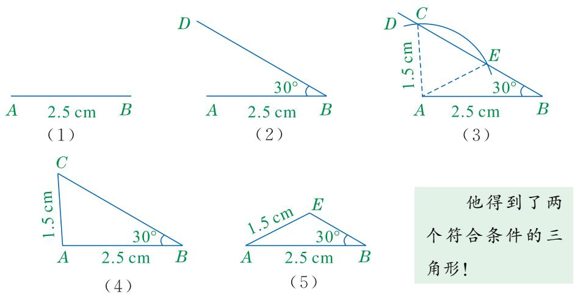

**参考解答**：教材图13.3-3给出两种符合条件的三角形。它们都有一条边长为 $2.5\text{ cm}$，另一条边长为 $1.5\text{ cm}$，且长为 $1.5\text{ cm}$ 的边所对的角为 $30^\circ$，但两个三角形形状不同。因此，两条边和其中一边的对角分别相等时，两个三角形不一定全等。

### 夹角情形设问

```yaml
question_id: "13.3.2-正文-2"
source_id: "教材原文_13.3全等三角形的判定_第二课时"
source_type: textbook
教材位置: "夹角情形设问"
教材顺序: 3
任务类型: 判断说明题
认知层级: 基础层
答案来源: AI参考推导
```

**原题**：当两边和它们的夹角分别相等时,这两个三角形是否全等呢?


**参考解答**：全等。若两个三角形有两条边分别相等，并且这两条边所夹的角也相等，把一个三角形叠放到另一个三角形上时，两条相等的边和夹角可分别重合，第三个顶点也随之重合，所以两个三角形全等。

### 一起探究第（1）问

```yaml
question_id: "13.3.2-一起探究-1"
source_id: "教材原文_13.3全等三角形的判定_第二课时"
source_type: textbook
教材位置: "一起探究第（1）问"
教材顺序: 4
任务类型: 操作探究题
认知层级: 中间层
答案来源: AI参考推导
```

**原题**：如图,在 $\triangle ABC$ 和 $\triangle A'B'C'$ 中, $AB=A'B'$, $\angle B=\angle B'$, $BC=B'C'$. 将 $\triangle ABC$ 叠放在 $\triangle A'B'C'$ 上,使顶点 $B$ 与顶点 $B'$ 重合,边 $BC$ 落在边 $B'C'$ 上,点 $A$ 与点 $A'$ 在边 $B'C'$ 的同侧.那么,点 $C$ 与点 $C'$ 是否重合,边 $BC$ 与边 $B'C'$ 是否重合? 边 $BA$ 是否落在边 $B'A'$ 上,点 $A$ 与点 $A'$ 是否重合?

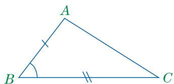
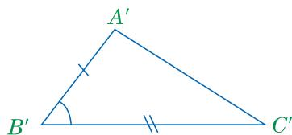

**参考解答**：

- 因为 $B$ 与 $B'$ 重合，$BC$ 落在 $B'C'$ 上，且 $BC=B'C'$，所以点 $C$ 与点 $C'$ 重合，边 $BC$ 与边 $B'C'$ 重合。
- 因为 $\angle B=\angle B'$，且点 $A$ 与点 $A'$ 在边 $B'C'$ 的同侧，所以射线 $BA$ 落在射线 $B'A'$ 上。
- 因为 $AB=A'B'$，且 $B$ 与 $B'$ 重合，射线 $BA$ 与射线 $B'A'$ 重合，所以点 $A$ 与点 $A'$ 重合。

### 一起探究第（2）问

```yaml
question_id: "13.3.2-一起探究-2"
source_id: "教材原文_13.3全等三角形的判定_第二课时"
source_type: textbook
教材位置: "一起探究第（2）问"
教材顺序: 5
任务类型: 推理论证题
认知层级: 中间层
答案来源: AI参考推导
```

**原题**：由“两点确定一条直线”,能不能得到边 $AC$ 与边 $A'C'$ 重合, $\triangle ABC$ 和 $\triangle A'B'C'$ 全等?

**参考解答**：能。第（1）问已经得到点 $A$ 与点 $A'$ 重合，点 $C$ 与点 $C'$ 重合。由“两点确定一条直线”，边 $AC$ 与边 $A'C'$ 重合。三角形的三个顶点分别重合，所以 $\triangle ABC \cong \triangle A'B'C'$。

### 基本事实二填空

```yaml
question_id: "13.3.2-基本事实-1"
source_id: "教材原文_13.3全等三角形的判定_第二课时"
source_type: textbook
教材位置: "基本事实二填空"
教材顺序: 6
任务类型: 填空题
认知层级: 基础层
答案来源: 教材原文
```

**原题**：基本事实二 两边及其夹角分别相等的两个三角形全等。基本事实二可简记为“边角边”或“ ”。


**参考解答**：填 $SAS$。

### 大家谈谈

```yaml
question_id: "13.3.2-大家谈谈-1"
source_id: "教材原文_13.3全等三角形的判定_第二课时"
source_type: textbook
教材位置: "大家谈谈"
教材顺序: 7
任务类型: 解释说明题
认知层级: 中间层
答案来源: AI参考推导
```

**原题**：图13.3-5是一种测量tools-2的示意图。其中 $AB$ 与 $CD$ 的中点 $O$ 被固定在一起, $AB$, $CD$ 可以绕点 $O$ 张合。在图13.3-6中,要想知道玻璃瓶的内径是多少,只要量出 $BD$ 的长就可以了。你知道这是为什么吗? 请把你的想法和同学交流一下。

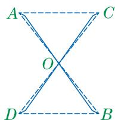
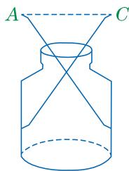

**参考解答**：因为 $O$ 是 $AB$ 与 $CD$ 的中点，所以 $AO=BO$，$CO=DO$。又因为 $\angle AOC$ 与 $\angle BOD$ 是对顶角，所以 $\angle AOC=\angle BOD$。在 $\triangle AOC$ 和 $\triangle BOD$ 中，

$$
\begin{cases}
AO=BO,\\
\angle AOC=\angle BOD,\\
CO=DO,
\end{cases}
$$

所以 $\triangle AOC\cong \triangle BOD(SAS)$。因此 $AC=BD$。玻璃瓶的内径为 $AC$，量出 $BD$ 的长即可得到玻璃瓶内径的长度。

### 例1

```yaml
question_id: "13.3.2-例1"
source_id: "教材原文_13.3全等三角形的判定_第二课时"
source_type: textbook
教材位置: "例1"
教材顺序: 8
任务类型: 证明题
认知层级: 基础层
答案来源: 教材原文
```

**原题**：已知:如图13.3-7, $AD//BC$, $AD=CB$。求证: $\triangle ADC\cong\triangle CBA$。

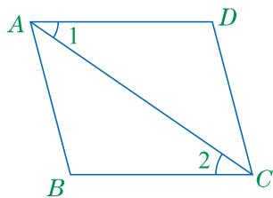

**参考解答**：

已知：$AD//BC$，$AD=CB$。

求证：$\triangle ADC\cong\triangle CBA$。

证明：

因为 $AD//BC$，所以 $\angle 1=\angle 2$（两直线平行，内错角相等）。

在 $\triangle ADC$ 和 $\triangle CBA$ 中，

$$
\begin{cases}
AD=CB,\\
\angle 1=\angle 2,\\
AC=CA,
\end{cases}
$$

所以 $\triangle ADC\cong\triangle CBA(SAS)$。

### 练习第1题第（1）问

```yaml
question_id: "13.3.2-练习-1-1"
source_id: "教材原文_13.3全等三角形的判定_第二课时"
source_type: textbook
教材位置: "练习第1题第（1）问"
教材顺序: 9
任务类型: 判断说明题
认知层级: 基础层
答案来源: AI参考推导
```

**原题**：判断图（1）中的 $\triangle AEC$ 与 $\triangle ADB$ 是否全等,并说明理由。已知条件是 $AB=AC$, $AD=AE$。

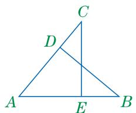

**参考解答**：全等。因为 $AB=AC$，$AD=AE$，且 $\angle EAC$ 与 $\angle DAB$ 都是由射线 $AB$ 与 $AC$ 形成的角，所以 $\angle EAC=\angle DAB$。在 $\triangle AEC$ 和 $\triangle ADB$ 中，

$$
\begin{cases}
AE=AD,\\
\angle EAC=\angle DAB,\\
AC=AB,
\end{cases}
$$

所以 $\triangle AEC\cong\triangle ADB(SAS)$。

### 练习第1题第（2）问

```yaml
question_id: "13.3.2-练习-1-2"
source_id: "教材原文_13.3全等三角形的判定_第二课时"
source_type: textbook
教材位置: "练习第1题第（2）问"
教材顺序: 10
任务类型: 判断说明题
认知层级: 基础层
答案来源: AI参考推导
```

**原题**：判断图（2）中的 $\triangle ABC$ 与 $\triangle BAD$ 是否全等,并说明理由。已知条件是 $\angle BAC=\angle ABD$, $AC=BD$。

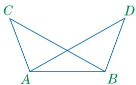

**参考解答**：全等。因为 $AB=BA$，$\angle BAC=\angle ABD$，$AC=BD$。在 $\triangle ABC$ 和 $\triangle BAD$ 中，

$$
\begin{cases}
AB=BA,\\
\angle BAC=\angle ABD,\\
AC=BD,
\end{cases}
$$

所以 $\triangle ABC\cong\triangle BAD(SAS)$。

### 练习第1题第（3）问

```yaml
question_id: "13.3.2-练习-1-3"
source_id: "教材原文_13.3全等三角形的判定_第二课时"
source_type: textbook
教材位置: "练习第1题第（3）问"
教材顺序: 11
任务类型: 判断说明题
认知层级: 中间层
答案来源: AI参考推导
```

**原题**：判断图（3）中的 $\triangle ABD$ 与 $\triangle ACE$ 是否全等,并说明理由。已知条件是 $AB=AC$, $AD=AE$, $BE=CD$。

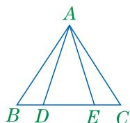

**参考解答**：全等。因为 $BE=CD$，且 $BE=BD+DE$，$CD=CE+DE$，所以 $BD=CE$。在 $\triangle ABE$ 和 $\triangle ACD$ 中，

$$
\begin{cases}
AB=AC,\\
AE=AD,\\
BE=CD,
\end{cases}
$$

所以 $\triangle ABE\cong\triangle ACD(SSS)$，从而 $\angle BAE=\angle CAD$。两边同时减去公共角 $\angle DAE$，得 $\angle BAD=\angle CAE$。在 $\triangle ABD$ 和 $\triangle ACE$ 中，

$$
\begin{cases}
AB=AC,\\
\angle BAD=\angle CAE,\\
AD=AE,
\end{cases}
$$

所以 $\triangle ABD\cong\triangle ACE(SAS)$。

### 练习第2题

```yaml
question_id: "13.3.2-练习-2"
source_id: "教材原文_13.3全等三角形的判定_第二课时"
source_type: textbook
教材位置: "练习第2题"
教材顺序: 12
任务类型: 证明题
认知层级: 中间层
答案来源: AI参考推导
```

**原题**：已知:如图, $AB=AC$, $AD=AE$, $BD$ 与 $CE$ 相交于点 $O$。求证: $\angle B=\angle C$。

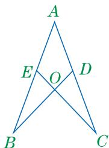

**参考解答**：

证明：因为 $AD$ 在 $AC$ 上，$AE$ 在 $AB$ 上，所以 $\angle BAD=\angle CAE$。

在 $\triangle BAD$ 和 $\triangle CAE$ 中，

$$
\begin{cases}
AB=AC,\\
\angle BAD=\angle CAE,\\
AD=AE,
\end{cases}
$$

所以 $\triangle BAD\cong\triangle CAE(SAS)$。

因此 $\angle B=\angle C$（全等三角形的对应角相等）。

### 习题A组第1题

```yaml
question_id: "13.3.2-习题A-1"
source_id: "教材原文_13.3全等三角形的判定_第二课时"
source_type: textbook
教材位置: "习题A组第1题"
教材顺序: 13
任务类型: 证明题
认知层级: 中间层
答案来源: AI参考推导
```

**原题**：已知:如图, $AC$、$BD$ 相交于点 $O$,且 $AO=CO$, $BO=DO$。求证: $AB=CD$。

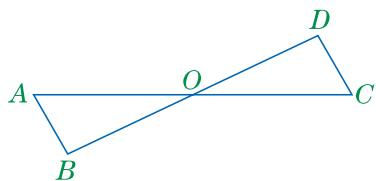

**参考解答**：

证明：因为 $AC$ 与 $BD$ 相交于点 $O$，所以 $\angle AOB=\angle COD$（对顶角相等）。

在 $\triangle AOB$ 和 $\triangle COD$ 中，

$$
\begin{cases}
AO=CO,\\
\angle AOB=\angle COD,\\
BO=DO,
\end{cases}
$$

所以 $\triangle AOB\cong\triangle COD(SAS)$。

因此 $AB=CD$（全等三角形的对应边相等）。

### 习题A组第2题

```yaml
question_id: "13.3.2-习题A-2"
source_id: "教材原文_13.3全等三角形的判定_第二课时"
source_type: textbook
教材位置: "习题A组第2题"
教材顺序: 14
任务类型: 证明题
认知层级: 基础层
答案来源: AI参考推导
```

**原题**：已知:如图, $AC=DB$, $\angle ACB=\angle DBC$。求证: $\triangle ABC\cong\triangle DCB$。

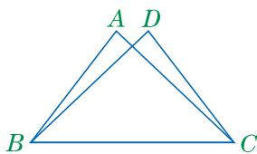

**参考解答**：

证明：在 $\triangle ABC$ 和 $\triangle DCB$ 中，

$$
\begin{cases}
AC=DB,\\
\angle ACB=\angle DBC,\\
BC=CB,
\end{cases}
$$

所以 $\triangle ABC\cong\triangle DCB(SAS)$。

### 习题A组第3题

```yaml
question_id: "13.3.2-习题A-3"
source_id: "教材原文_13.3全等三角形的判定_第二课时"
source_type: textbook
教材位置: "习题A组第3题"
教材顺序: 15
任务类型: 证明题
认知层级: 拓展层
答案来源: AI参考推导
```

**原题**：已知:如图, $AC=DE$, $BC=DF$, $AC//DE$。求证: $AB//FE$。

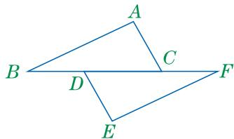

**参考解答**：

证明：因为 $AC//DE$，且 $B,D,C,F$ 在同一条直线上，所以 $\angle ACB=\angle EDF$。

在 $\triangle ABC$ 和 $\triangle EFD$ 中，

$$
\begin{cases}
AC=DE,\\
\angle ACB=\angle EDF,\\
BC=DF,
\end{cases}
$$

所以 $\triangle ABC\cong\triangle EFD(SAS)$。

因此 $\angle ABC=\angle EFD$。又因为 $B,D,C,F$ 在同一条直线上，所以 $AB//FE$。

### 习题B组第1题

```yaml
question_id: "13.3.2-习题B-1"
source_id: "教材原文_13.3全等三角形的判定_第二课时"
source_type: textbook
教材位置: "习题B组第1题"
教材顺序: 16
任务类型: 证明题
认知层级: 拓展层
答案来源: AI参考推导
```

**原题**：已知:如图, $AB=AD$, $AC=AE$, $\angle BAD=\angle CAE$。求证: $\angle B=\angle D$。

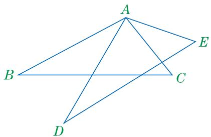

**参考解答**：

证明：因为 $\angle BAD=\angle CAE$，两边同时加上 $\angle DAC$，得

$$
\angle BAC=\angle DAE.
$$

在 $\triangle BAC$ 和 $\triangle DAE$ 中，

$$
\begin{cases}
AB=AD,\\
\angle BAC=\angle DAE,\\
AC=AE,
\end{cases}
$$

所以 $\triangle BAC\cong\triangle DAE(SAS)$。

因此 $\angle B=\angle D$（全等三角形的对应角相等）。

### 习题B组第2题

```yaml
question_id: "13.3.2-习题B-2"
source_id: "教材原文_13.3全等三角形的判定_第二课时"
source_type: textbook
教材位置: "习题B组第2题"
教材顺序: 17
任务类型: 证明题
认知层级: 拓展层
答案来源: AI参考推导
```

**原题**：已知:如图, $AB=AC$, $BE=CE$, $AE$ 的延长线交 $BC$ 于点 $D$。求证: $BD=CD$。

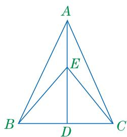

**参考解答**：

证明：在 $\triangle ABE$ 和 $\triangle ACE$ 中，

$$
\begin{cases}
AB=AC,\\
BE=CE,\\
AE=AE,
\end{cases}
$$

所以 $\triangle ABE\cong\triangle ACE(SSS)$。

因此 $\angle BAE=\angle EAC$。因为 $A,E,D$ 在同一条直线上，所以 $\angle BAD=\angle DAC$。

在 $\triangle ABD$ 和 $\triangle ACD$ 中，

$$
\begin{cases}
AB=AC,\\
\angle BAD=\angle DAC,\\
AD=AD,
\end{cases}
$$

所以 $\triangle ABD\cong\triangle ACD(SAS)$。

因此 $BD=CD$（全等三角形的对应边相等）。

### 习题C组第1题

```yaml
question_id: "13.3.2-习题C-1"
source_id: "教材原文_13.3全等三角形的判定_第二课时"
source_type: textbook
教材位置: "习题C组第1题"
教材顺序: 18
任务类型: 方案设计题
认知层级: 拓展层
答案来源: AI参考推导
```

**原题**：如图,有一个池塘,要测量池塘岸边 $A$, $B$ 两点间的距离。请设计一个可行的测量方案,按照设计的方案画出图形,并说明理由。

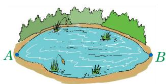

**参考解答**：

一种可行方案如下。

1. 在池塘外选取一点 $O$，使 $A,O,C$ 在同一条直线上，$B,O,D$ 在同一条直线上，且点 $C,D$ 都在可测量的一侧。
2. 用测量tools-2量出 $OA$ 和 $OB$，再在射线 $OA$ 的反向延长线上取点 $C$，使 $OC=OA$；在射线 $OB$ 的反向延长线上取点 $D$，使 $OD=OB$。
3. 连接 $C,D$，量出 $CD$ 的长。

理由：因为 $A,O,C$ 在同一条直线上，$B,O,D$ 在同一条直线上，所以 $\angle AOB=\angle COD$（对顶角相等）。又因为 $OA=OC$，$OB=OD$，所以

$$
\triangle AOB\cong\triangle COD(SAS).
$$

因此 $AB=CD$。池塘岸边 $A,B$ 两点间的距离等于可直接测量的 $CD$ 的长度。

合理答案边界：方案应把待测线段转化为岸外可测线段，并用本课“边角边”或已学三边判定说明两个三角形全等，不能虚构实测数据。

## 覆盖统计

| 统计项 | 数量 |
|---|---:|
| 教材任务总数 | 18 |
| 参考解答条目数 | 18 |
| 唯一 question_id 数 | 18 |
| 基础层 | 6 |
| 中间层 | 7 |
| 拓展层 | 5 |
| 图片依赖任务 | 18 |
| 教材原文 | 3 |
| AI参考推导 | 15 |
| 暂停任务 | 0 |

教材顺序从 1 至 18 连续，任务清单与参考解答一一对应。本文件为教材问题参考解答，不是出版社标准答案。
