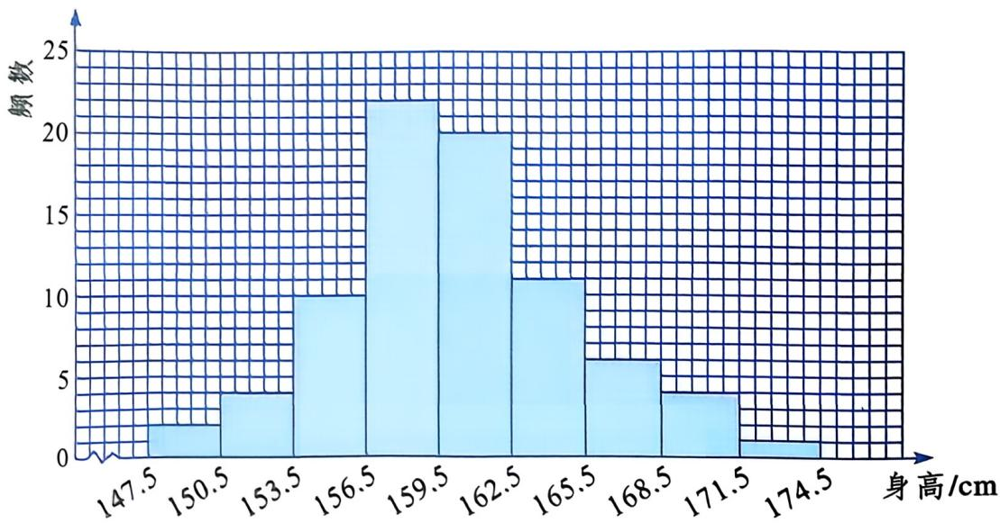
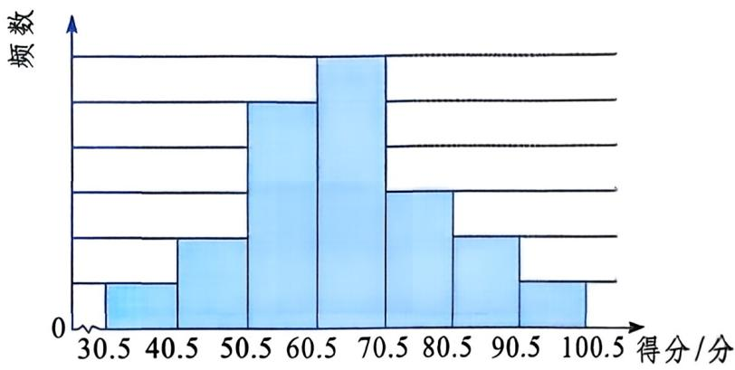

# 频数分布与直方图 教材问题参考解答

## 教材任务清单

| 教材顺序 | question_id | 教材位置 | 任务类型 | 图片依赖 | 答案来源 |
|---:|---|---|---|---|---|
| 1 | 22.4-正文-1 | 正文整理数据第（1）步 | 计算题 | 无 | 教材原文 |
| 2 | 22.4-正文-2 | 正文整理数据第（2）步 | 数据整理题 | 无 | 教材原文 |
| 3 | 22.4-正文-3 | 正文整理数据第（3）步 | 统计表题 | 无 | 教材原文 |
| 4 | 22.4-正文-4 | 正文整理数据第（4）步 | 作图题 | f01de117...jpg | 教材原文 |
| 5 | 22.4-大家谈谈-1 | 大家谈谈第（1）题 | 读图表题 | f01de117...jpg | 教材原文 |
| 6 | 22.4-大家谈谈-2 | 大家谈谈第（2）题 | 应用与评价题 | 无 | AI参考推导补充 |
| 7 | 22.4-练习-1 | 练习第（1）题 | 读图题 | ff4ecd37...jpg | AI参考推导 |
| 8 | 22.4-练习-2 | 练习第（2）题 | 读图题 | ff4ecd37...jpg | AI参考推导 |
| 9 | 22.4-练习-3 | 练习第（3）题 | 读图与计算题 | ff4ecd37...jpg | AI参考推导 |
| 10 | 22.4-练习-4 | 练习第（4）题 | 填表题 | ff4ecd37...jpg | AI参考推导 |
| 11 | 22.4-练习-5 | 练习第（5）题 | 应用题 | ff4ecd37...jpg | AI参考推导 |
| 12 | 22.4-习题A-1-1 | A组第1题第（1）问 | 读图题 | ecb6cead...jpg | AI参考推导 |
| 13 | 22.4-习题A-1-2 | A组第1题第（2）问 | 读图与计算题 | ecb6cead...jpg | AI参考推导 |
| 14 | 22.4-习题A-1-3 | A组第1题第（3）问 | 计算题 | ecb6cead...jpg | AI参考推导 |
| 15 | 22.4-习题A-2-1 | A组第2题第（1）问 | 计算题 | 无 | AI参考推导 |
| 16 | 22.4-习题A-2-2 | A组第2题第（2）问 | 计算题 | 无 | AI参考推导 |
| 17 | 22.4-习题A-2-3 | A组第2题第（3）问 | 作图与评价题 | 无 | AI参考推导 |
| 18 | 22.4-习题B-3-1 | B组第3题第（1）问 | 计算题 | 无 | AI参考推导 |
| 19 | 22.4-习题B-3-2 | B组第3题第（2）问 | 数据整理题 | 无 | AI参考推导 |
| 20 | 22.4-习题B-3-3 | B组第3题第（3）问 | 比较评价题 | 无 | AI参考推导 |
| 21 | 22.4-习题B-3-4 | B组第3题第（4）问 | 统计表题 | 无 | AI参考推导 |
| 22 | 22.4-习题C-4 | C组第4题 | 调查实践题 | 无 | AI参考推导 |

## 参考解答

### 正文整理数据第（1）步

```yaml
question_id: "22.4-正文-1"
source_id: "教材原文_22.4_频数分布与直方图"
source_type: textbook
教材位置: "正文整理数据第（1）步"
教材顺序: 1
任务类型: 计算题
认知层级: 基础层
答案来源: 教材原文
```

**原题**：确定数据的最小值和最大值。

**参考解答**：逐项比较 50 个数据，最小值为 100，最大值为 218。

### 正文整理数据第（2）步

```yaml
question_id: "22.4-正文-2"
source_id: "教材原文_22.4_频数分布与直方图"
source_type: textbook
教材位置: "正文整理数据第（2）步"
教材顺序: 2
任务类型: 数据整理题
认知层级: 中间层
答案来源: 教材原文
```

**原题**：确定数据分组的组数和组距。

**参考解答**：分为 6 组。因为 $218-100=118$，$118\div6\approx19.7$，取组距 20，分组为
$100\leqslant x<120$，$120\leqslant x<140$，$140\leqslant x<160$，$160\leqslant x<180$，$180\leqslant x<200$，$200\leqslant x<220$。

### 正文整理数据第（3）步

```yaml
question_id: "22.4-正文-3"
source_id: "教材原文_22.4_频数分布与直方图"
source_type: textbook
教材位置: "正文整理数据第（3）步"
教材顺序: 3
任务类型: 统计表题
认知层级: 中间层
答案来源: 教材原文
```

**原题**：列频数（频率）分布表。

**参考解答**：

| 全年月平均用电量/(千瓦·时) | 频数 | 频率 |
|---|---:|---:|
| $100\leqslant x<120$ | 5 | 10% |
| $120\leqslant x<140$ | 10 | 20% |
| $140\leqslant x<160$ | 15 | 30% |
| $160\leqslant x<180$ | 12 | 24% |
| $180\leqslant x<200$ | 5 | 10% |
| $200\leqslant x<220$ | 3 | 6% |
| 合计 | 50 | 100% |

检验：$5+10+15+12+5+3=50$，各组频率之和为 100%。

### 正文整理数据第（4）步

```yaml
question_id: "22.4-正文-4"
source_id: "教材原文_22.4_频数分布与直方图"
source_type: textbook
教材位置: "正文整理数据第（4）步"
教材顺序: 4
任务类型: 作图题
认知层级: 中间层
答案来源: 教材原文
```

**原题**：画频数分布直方图。


**参考解答**：横轴表示全年月平均用电量，按组距 20 标出各组；纵轴表示频数。依次画高为 5、10、15、12、5、3 的相邻小长方形。检验时，各柱对应的组界、组距和柱高应与频数分布表一致。

### 大家谈谈第（1）题

```yaml
question_id: "22.4-大家谈谈-1"
source_id: "教材原文_22.4_频数分布与直方图"
source_type: textbook
教材位置: "大家谈谈第（1）题"
教材顺序: 5
任务类型: 读图表题
认知层级: 基础层
答案来源: 教材原文
```

**原题**：观察统计图表，全年月平均用电量在哪个范围内分布的户数最多？

**参考解答**：$140\leqslant x<160$ 千瓦·时这一组的频数为 15，是各组中最大的，因此该范围内分布的户数最多。

### 大家谈谈第（2）题

```yaml
question_id: "22.4-大家谈谈-2"
source_id: "教材原文_22.4_频数分布与直方图"
source_type: textbook
教材位置: "大家谈谈第（2）题"
教材顺序: 6
任务类型: 应用与评价题
认知层级: 拓展层
答案来源: AI参考推导补充
```

**原题**：该城市的阶梯电价方案如表所示．就这50户居民来说，各档用电量的户数分别占多大比例？你认为这个阶梯电价方案合理吗？

**参考解答**：第一档有 42 户，占 $42\div50=84\%$；第二档有 8 户，占 $8\div50=16\%$；第三档有 0 户，占 0%。第一档覆盖了大多数被调查家庭，从“使大多数家庭不增加电费支出”这一要求看，该方案有一定合理性。这里只依据这 50 户样本作出判断，实际方案还应结合更大范围的数据。

### 练习第（1）题

练习共用图：



```yaml
question_id: "22.4-练习-1"
source_id: "教材原文_22.4_频数分布与直方图"
source_type: textbook
教材位置: "练习第（1）题"
教材顺序: 7
任务类型: 读图题
认知层级: 基础层
答案来源: AI参考推导
```

**原题**：数据个数 $n$ 为多少？数据的大致分布范围在哪两数之间？

**参考解答**：各组频数依次为 2、4、10、22、20、11、6、4、1，所以
$n=2+4+10+22+20+11+6+4+1=80$。数据大致分布在 147.5 cm 与 174.5 cm 之间；由于测量结果精确到 1 cm，实际整数数据在 148 cm 至 174 cm 范围内。

### 练习第（2）题

```yaml
question_id: "22.4-练习-2"
source_id: "教材原文_22.4_频数分布与直方图"
source_type: textbook
教材位置: "练习第（2）题"
教材顺序: 8
任务类型: 读图题
认知层级: 基础层
答案来源: AI参考推导
```

**原题**：组距和组数各为多少？

**参考解答**：相邻分点之差为 $150.5-147.5=3$，所以组距为 3 cm；从 147.5 到 174.5 共分 9 组。

### 练习第（3）题

```yaml
question_id: "22.4-练习-3"
source_id: "教材原文_22.4_频数分布与直方图"
source_type: textbook
教材位置: "练习第（3）题"
教材顺序: 9
任务类型: 读图与计算题
认知层级: 中间层
答案来源: AI参考推导
```

**原题**：频数最大的组为哪一组？该组的频数和频率各为多少？

**参考解答**：频数最大的组是 $156.5\leqslant x<159.5$，该组频数为 22，频率为 $22\div80=27.5\%$。

### 练习第（4）题

```yaml
question_id: "22.4-练习-4"
source_id: "教材原文_22.4_频数分布与直方图"
source_type: textbook
教材位置: "练习第（4）题"
教材顺序: 10
任务类型: 填表题
认知层级: 中间层
答案来源: AI参考推导
```

**原题**：根据频数分布直方图提供的信息，填写下表。

**参考解答**：

| 身高/cm | 148～156 | 157～165 | 166～174 |
|---|---:|---:|---:|
| 频数 | 16 | 53 | 11 |
| 频率 | 20% | 66.25% | 13.75% |

其中，$16=2+4+10$，$53=22+20+11$，$11=6+4+1$；频数合计为 80，频率合计为 100%。

### 练习第（5）题

```yaml
question_id: "22.4-练习-5"
source_id: "教材原文_22.4_频数分布与直方图"
source_type: textbook
教材位置: "练习第（5）题"
教材顺序: 11
任务类型: 应用题
认知层级: 拓展层
答案来源: AI参考推导
```

**原题**：学校要给八年级男生订购校服，男生的校服按上表分组方式设计了小、中、大三个尺码。请对订购各尺码校服的数量提出你的建议。

**参考解答**：若每名男生订购 1 套，可按统计结果订购小号 16 套、中号 53 套、大号 11 套。实际订购时可在总量不变或少量增加备用服装的前提下，结合试穿结果微调相邻尺码数量。

### A组第1题第（1）问

A组第1题共用图：



```yaml
question_id: "22.4-习题A-1-1"
source_id: "教材原文_22.4_频数分布与直方图"
source_type: textbook
教材位置: "A组第1题第（1）问"
教材顺序: 12
任务类型: 读图题
认知层级: 基础层
答案来源: AI参考推导
```

**原题**：标注频数轴上的刻度。

**参考解答**：7 个柱高的相对份数依次为 1、2、5、6、3、2、1，总份数为 20。参赛同学共 100 名，所以每份表示 $100\div20=5$ 人。频数轴从下到上各等间隔刻度应标为 5、10、15、20、25、30。

### A组第1题第（2）问

```yaml
question_id: "22.4-习题A-1-2"
source_id: "教材原文_22.4_频数分布与直方图"
source_type: textbook
教材位置: "A组第1题第（2）问"
教材顺序: 13
任务类型: 读图与计算题
认知层级: 中间层
答案来源: AI参考推导
```

**原题**：得分在 $61\sim70$ 分的人数为 ____，得分在 71 分及以上的人数为 ____。

**参考解答**：$61\sim70$ 分对应柱高 30，所以有 30 人。71 分及以上对应后三组，人数为 $15+10+5=30$。两空均填 30。

### A组第1题第（3）问

```yaml
question_id: "22.4-习题A-1-3"
source_id: "教材原文_22.4_频数分布与直方图"
source_type: textbook
教材位置: "A组第1题第（3）问"
教材顺序: 14
任务类型: 计算题
认知层级: 中间层
答案来源: AI参考推导
```

**原题**：如果得分大于 80 分定为优秀，那么优秀率为

**参考解答**：大于 80 分的人数为 $10+5=15$，优秀率为 $15\div100=15\%$。

### A组第2题第（1）问

```yaml
question_id: "22.4-习题A-2-1"
source_id: "教材原文_22.4_频数分布与直方图"
source_type: textbook
教材位置: "A组第2题第（1）问"
教材顺序: 15
任务类型: 计算题
认知层级: 基础层
答案来源: AI参考推导
```

**原题**：全班共有多少名学生？组距为多少？

**参考解答**：全班人数为 $3+6+21+13+7=50$。组距为 $80-60=20$，即 20 次。

### A组第2题第（2）问

```yaml
question_id: "22.4-习题A-2-2"
source_id: "教材原文_22.4_频数分布与直方图"
source_type: textbook
教材位置: "A组第2题第（2）问"
教材顺序: 16
任务类型: 计算题
认知层级: 中间层
答案来源: AI参考推导
```

**原题**：跳绳次数在 $100\leqslant x<140$ 范围内的学生有多少名？占全班学生的百分之多少？

**参考解答**：人数为 $21+13=34$，占全班的 $34\div50=68\%$。

### A组第2题第（3）问

```yaml
question_id: "22.4-习题A-2-3"
source_id: "教材原文_22.4_频数分布与直方图"
source_type: textbook
教材位置: "A组第2题第（3）问"
教材顺序: 17
任务类型: 作图与评价题
认知层级: 拓展层
答案来源: AI参考推导
```

**原题**：画出频数分布直方图，并根据频数分布直方图评价这个班的跳绳成绩。

**参考解答**：横轴依次标出 $[60,80)$、$[80,100)$、$[100,120)$、$[120,140)$、$[140,160)$，纵轴表示频数，画出柱高依次为 3、6、21、13、7 的相邻小长方形。50 名学生中有 34 名的成绩在 100 次至不足 140 次之间，占 68%；不足 100 次的有 9 名，占 18%；140 次及以上的有 7 名，占 14%。评价时应结合学校采用的具体达标标准，上述图表只反映本班次数的分布。

### B组第3题第（1）问

```yaml
question_id: "22.4-习题B-3-1"
source_id: "教材原文_22.4_频数分布与直方图"
source_type: textbook
教材位置: "B组第3题第（1）问"
教材顺序: 18
任务类型: 计算题
认知层级: 基础层
答案来源: AI参考推导
```

**原题**：数据中的最小值和最大值各为多少？

**参考解答**：逐项比较可得，最小值为 $5.05\ \mathrm{g/cm^3}$，最大值为 $5.88\ \mathrm{g/cm^3}$。

### B组第3题第（2）问

```yaml
question_id: "22.4-习题B-3-2"
source_id: "教材原文_22.4_频数分布与直方图"
source_type: textbook
教材位置: "B组第3题第（2）问"
教材顺序: 19
任务类型: 数据整理题
认知层级: 中间层
答案来源: AI参考推导
```

**原题**：整理数据时，如果组距取 0.2，应该分几组，如何分组？如果组距取 0.1，又应该分几组，如何分组？

**参考解答**：数据极差为 $5.88-5.05=0.83$。

- 组距取 0.2 时，$0.83\div0.2=4.15$，应分 5 组：$[5.0,5.2)$、$[5.2,5.4)$、$[5.4,5.6)$、$[5.6,5.8)$、$[5.8,6.0)$。
- 组距取 0.1 时，$0.83\div0.1=8.3$，应分 9 组：$[5.0,5.1)$、$[5.1,5.2)$、$[5.2,5.3)$、$[5.3,5.4)$、$[5.4,5.5)$、$[5.5,5.6)$、$[5.6,5.7)$、$[5.7,5.8)$、$[5.8,5.9)$。

### B组第3题第（3）问

```yaml
question_id: "22.4-习题B-3-3"
source_id: "教材原文_22.4_频数分布与直方图"
source_type: textbook
教材位置: "B组第3题第（3）问"
教材顺序: 20
任务类型: 比较评价题
认知层级: 拓展层
答案来源: AI参考推导
```

**原题**：以上两种分组方式，哪种能较好地反映测量数据的分布？

**参考解答**：组距取 0.2 时分为 5 组，各组数据不过于零散，能较清楚地呈现 29 个数据的集中范围；组距取 0.1 时分为 9 组，部分组的数据较少。因此本题采用组距 0.2 的分组方式较合适。

### B组第3题第（4）问

```yaml
question_id: "22.4-习题B-3-4"
source_id: "教材原文_22.4_频数分布与直方图"
source_type: textbook
教材位置: "B组第3题第（4）问"
教材顺序: 21
任务类型: 统计表题
认知层级: 中间层
答案来源: AI参考推导
```

**原题**：按下表的分组统计各组的频数。

**参考解答**：

| 密度/(g/cm³) | 5.0～5.2 | 5.2～5.4 | 5.4～5.6 | 5.6～5.8 | 5.8～6.0 | 合计 |
|---|---:|---:|---:|---:|---:|---:|
| 频数 | 3 | 10 | 7 | 7 | 2 | 29 |

检验：$3+10+7+7+2=29$，与测量次数相同。

### C组第4题

```yaml
question_id: "22.4-习题C-4"
source_id: "教材原文_22.4_频数分布与直方图"
source_type: textbook
教材位置: "C组第4题"
教材顺序: 22
任务类型: 调查实践题
认知层级: 拓展层
答案来源: AI参考推导
```

**原题**：收集你所在地区连续 30 天的空气质量指数，将收集的数据绘制成频数分布直方图。

**参考解答**：本题需使用所在地区连续 30 天的实际数据，不能虚构具体频数。可按以下步骤完成：

1. 记录连续 30 天每天的空气质量指数，并注明日期和数据来源。
2. 按教材表中的类别边界分组：0～50、51～100、101～150、151～200、201～300、大于 300。
3. 逐项计数，列出各组频数，检验频数合计是否为 30。
4. 横轴表示空气质量指数类别，纵轴表示频数，按统计结果画出各柱。
5. 根据频数最大的类别和各污染类别的天数，用实际数据写出分布特点。

合理答案边界：数据必须来自同一地区连续 30 天；各组不能重复或遗漏数据；频数合计必须为 30；直方图柱高必须与统计表一致。

## 覆盖统计

| 项目 | 数量 |
|---|---:|
| 正文整理数据任务 | 4 |
| 大家谈谈 | 2 |
| 练习 | 5 |
| A组小问 | 6 |
| B组小问 | 4 |
| C组任务 | 1 |
| 教材任务合计 | 22 |
| 参考解答条目 | 22 |
| 图片依赖任务 | 9 |
| 暂停任务 | 0 |

本文件为教材问题参考解答，不是出版社标准答案。
