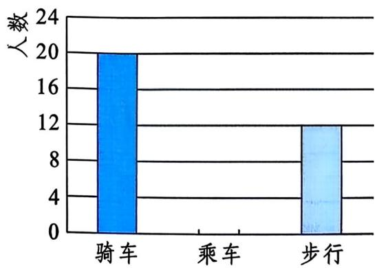
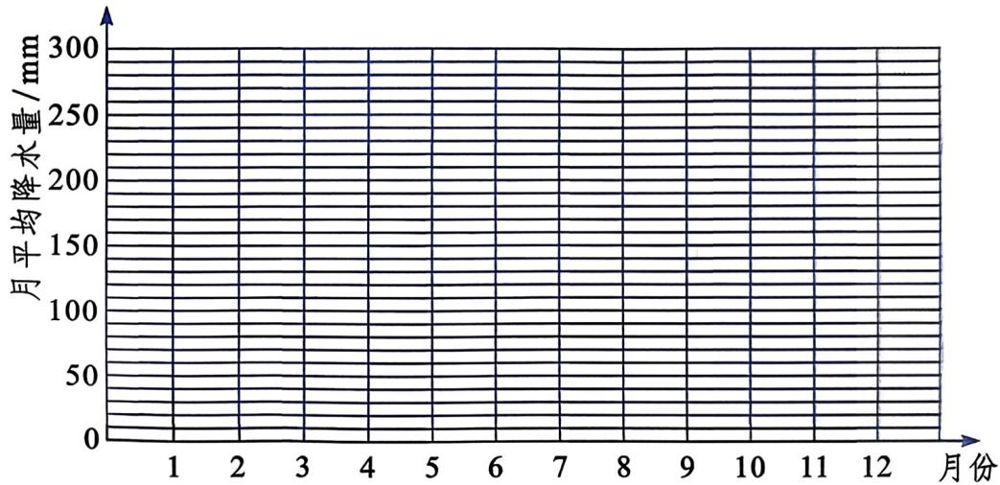

# 第22章 回顾与反思（第2课时）教材问题参考解答

## 教材任务清单

| 教材顺序 | question_id | 教材位置 | 任务类型 | 图片依赖 | 答案来源 |
|---------|------------|---------|---------|---------|---------|
| 1 | 22.6.2-习题B-7-1 | 习题B组第7题第(1)问 | 计算题 | 无 | AI参考推导 |
| 2 | 22.6.2-习题B-7-2 | 习题B组第7题第(2)问 | 作图题 | 无 | AI参考推导 |
| 3 | 22.6.2-习题B-8-1 | 习题B组第8题第(1)问 | 计算题 | 无 | AI参考推导 |
| 4 | 22.6.2-习题B-8-2 | 习题B组第8题第(2)问 | 作图题 | 无 | AI参考推导 |
| 5 | 22.6.2-习题B-8-3 | 习题B组第8题第(3)问 | 解答题 | 无 | AI参考推导 |
| 6 | 22.6.2-习题B-9-1 | 习题B组第9题第(1)问 | 计算题 | 有 | AI参考推导 |
| 7 | 22.6.2-习题B-9-2 | 习题B组第9题第(2)问 | 计算题 | 有 | AI参考推导 |
| 8 | 22.6.2-习题B-9-3 | 习题B组第9题第(3)问 | 作图题 | 有 | AI参考推导 |
| 9 | 22.6.2-习题B-10 | 习题B组第10题 | 操作探究题 | 无 | AI参考推导 |
| 10 | 22.6.2-习题C-11-1 | 习题C组第11题第(1)问 | 操作实践题 | 无 | 教材原文 |
| 11 | 22.6.2-习题C-11-2 | 习题C组第11题第(2)问 | 计算题 | 无 | 教材原文 |
| 12 | 22.6.2-习题C-11-3 | 习题C组第11题第(3)问 | 操作实践题 | 无 | 教材原文 |
| 13 | 22.6.2-习题C-11-4 | 习题C组第11题第(4)问 | 解答题 | 无 | 教材原文 |
| 14 | 22.6.2-习题C-11-5 | 习题C组第11题第(5)问 | 开放题 | 无 | AI参考推导 |
| 15 | 22.6.2-习题C-12-1 | 习题C组第12题第(1)问 | 作图题 | 有 | AI参考推导 |
| 16 | 22.6.2-习题C-12-2 | 习题C组第12题第(2)问 | 解答题 | 有 | AI参考推导 |
| 17 | 22.6.2-习题C-12-3 | 习题C组第12题第(3)问 | 计算题 | 有 | AI参考推导 |

## 参考解答

### 习题B组第7题

**题目元数据 YAML**
```yaml
question_id: "22.6.2-习题B-7-1"
source_id: "教材原文_第22章_回顾与反思_第2课时"
source_type: textbook
教材位置: 习题B组第7题第(1)问
教材顺序: 1
任务类型: 计算题
认知层级: 基础层
答案来源: AI参考推导
```

**原题**：
计算每袋面粉的质量与标准质量的差。统计各类误差的面粉袋数，并填写统计表：

| 误差/kg | -1.5 | -1.0 | -0.5 | 0 | 0.5 | 1.0 | 1.5 |
|---------|------|------|------|---|---|------|------|
| 袋数 | | | | | | | |
| 百分比 | | | | | | | |

**参考解答**：

每袋面粉的误差 = 实际质量 - 标准质量(50kg)

计算各误差对应的袋数：

- 误差 -1.5kg：48.5kg → 1袋
- 误差 -1.0kg：49.0kg → 4袋
- 误差 -0.5kg：49.5kg → 8袋
- 误差 0kg：50.0kg → 12袋
- 误差 +0.5kg：50.5kg → 6袋
- 误差 +1.0kg：51.0kg → 6袋
- 误差 +1.5kg：51.5kg → 3袋

| 误差/kg | -1.5 | -1.0 | -0.5 | 0 | 0.5 | 1.0 | 1.5 |
|---------|------|------|------|---|---|------|------|
| 袋数 | 1 | 4 | 8 | 12 | 6 | 6 | 3 |
| 百分比 | 2.5% | 10% | 20% | 30% | 15% | 15% | 7.5% |

---

**题目元数据 YAML**
```yaml
question_id: "22.6.2-习题B-7-2"
source_id: "教材原文_第22章_回顾与反思_第2课时"
source_type: textbook
教材位置: 习题B组第7题第(2)问
教材顺序: 2
任务类型: 作图题
认知层级: 中间层
答案来源: AI参考推导
```

**原题**：
画条形统计图表示数据，描述误差分布的特点。

**参考解答**：

条形统计图：


条形统计图的绘制：
- 横轴：误差（kg），刻度为 -1.5, -1.0, -0.5, 0, 0.5, 1.0, 1.5
- 纵轴：袋数，刻度从0开始，以2为间隔
- 各误差对应的条形高度分别为 1, 4, 8, 12, 6, 6, 3

误差分布特点描述：
- 数据分布近似对称，以0误差为中心
- 大部分（30%）面粉袋质量正好为标准质量50kg
- 误差在±0.5kg范围内的面粉袋占65%，说明装袋工艺较为稳定
- 极端误差（±1.5kg）较少，仅占10%

---

### 习题B组第8题

**题目元数据 YAML**
```yaml
question_id: "22.6.2-习题B-8-1"
source_id: "教材原文_第22章_回顾与反思_第2课时"
source_type: textbook
教材位置: 习题B组第8题第(1)问
教材顺序: 3
任务类型: 计算题
认知层级: 中间层
答案来源: AI参考推导
```

**原题**：
(1) 求 x 的值，计算各组的频率并填表。

| 时间t/min | 0≤t<10 | 10≤t<20 | 20≤t<30 | 30≤t<40 | 40≤t<50 | 50≤t<60 |
|-----------|--------|---------|---------|---------|---------|---------|
| 频数 | 7 | 17 | 13 | x | 7 | 6 |
| 频率 | | | | | | |

**参考解答**：

总人数为60人，各组频数之和应等于60：
7 + 17 + 13 + x + 7 + 6 = 60
60 + x = 60
x = 14

各组频率 = 频数 ÷ 总人数：

| 时间t/min | 0≤t<10 | 10≤t<20 | 20≤t<30 | 30≤t<40 | 40≤t<50 | 50≤t<60 |
|-----------|--------|---------|---------|---------|---------|---------|
| 频数 | 7 | 17 | 13 | 14 | 7 | 6 |
| 频率 | 7/60 ≈ 11.67% | 17/60 ≈ 28.33% | 13/60 ≈ 21.67% | 14/60 ≈ 23.33% | 7/60 ≈ 11.67% | 6/60 = 10% |

---

**题目元数据 YAML**
```yaml
question_id: "22.6.2-习题B-8-2"
source_id: "教材原文_第22章_回顾与反思_第2课时"
source_type: textbook
教材位置: 习题B组第8题第(2)问
教材顺序: 4
任务类型: 作图题
认知层级: 中间层
答案来源: AI参考推导
```

**原题**：
(2) 绘制频数分布直方图。

**参考解答**：

频数分布直方图：


频数分布直方图的绘制：
- 横轴：等候时间t/min，刻度为 0, 10, 20, 30, 40, 50, 60
- 纵轴：频数，刻度从0开始
- 各组对应的矩形高度分别为 7, 17, 13, 14, 7, 6
- 各矩形等宽且连续排列，无间隔

---

**题目元数据 YAML**
```yaml
question_id: "22.6.2-习题B-8-3"
source_id: "教材原文_第22章_回顾与反思_第2课时"
source_type: textbook
教材位置: 习题B组第8题第(3)问
教材顺序: 5
任务类型: 解答题
认知层级: 拓展层
答案来源: AI参考推导
```

**原题**：
(3) 估计在这家医院门诊看病的病人等候时间超过30min的百分比。

**参考解答**：

等候时间超过30min的病人包括：
- 30≤t<40 组：14人
- 40≤t<50 组：7人
- 50≤t<60 组：6人

总计：14 + 7 + 6 = 27人

百分比 = 27 ÷ 60 = 45%

因此，估计约有45%的病人等候时间超过30分钟。

---

### 习题B组第9题

**题目元数据 YAML**
```yaml
question_id: "22.6.2-习题B-9-1"
source_id: "教材原文_第22章_回顾与反思_第2课时"
source_type: textbook
教材位置: 习题B组第9题第(1)问
教材顺序: 6
任务类型: 计算题
认知层级: 中间层
答案来源: AI参考推导
图片依赖: "./images/6887c1d01e98d208aa2db5b9d760f94c70ecb87c02d93a6123df67a02a1c87bb.jpg"
```

**原题**：
(1) 该班共有多少名学生？

**参考解答**：



观察图(1)扇形统计图，步行占40%，对应16人。

班级总人数 = 16 ÷ 40% = 40人

---

**题目元数据 YAML**
```yaml
question_id: "22.6.2-习题B-9-2"
source_id: "教材原文_第22章_回顾与反思_第2课时"
source_type: textbook
教材位置: 习题B组第9题第(2)问
教材顺序: 7
任务类型: 计算题
认知层级: 中间层
答案来源: AI参考推导
图片依赖: "./images/6887c1d01e98d208aa2db5b9d760f94c70ecb87c02d93a6123df67a02a1c87bb.jpg"
```

**原题**：
(2) 该班有多少名学生乘车到校?

**参考解答**：

班级共40名学生。

乘车比例 = 1 - 40%(步行) - 15%(骑车) = 45%

乘车人数 = 40 × 45% = 18人

---

**题目元数据 YAML**
```yaml
question_id: "22.6.2-习题B-9-3"
source_id: "教材原文_第22章_回顾与反思_第2课时"
source_type: textbook
教材位置: 习题B组第9题第(3)问
教材顺序: 8
任务类型: 作图题
认知层级: 中间层
答案来源: AI参考推导
图片依赖: "./images/d07c950f5c496fb802d5f1e4c4d020574509910746cd45410128bc7d2ba2c02c.jpg"
```

**原题**：
(3) 在图(1)中，将表示"乘车"的部分补充完整。

**参考解答**：


在扇形统计图中，"乘车"部分占整个圆的45%。

补全方法：在图(1)中画出表示乘车的扇形，其圆心角为 360° × 45% = 162°

---

### 习题B组第10题

**题目元数据 YAML**
```yaml
question_id: "22.6.2-习题B-10"
source_id: "教材原文_第22章_回顾与反思_第2课时"
source_type: textbook
教材位置: 习题B组第10题
教材顺序: 9
任务类型: 操作探究题
认知层级: 拓展层
答案来源: AI参考推导
```

**原题**：
对48个橘子的维生素C含量(单位: mg)进行测量，数据如下。确定适当的分组个数，整理数据，列频数分布表，画频数分布直方图，描述数据的分布情况。

**参考解答**：

**第一步：确定分组个数**

数据范围：26.2 ~ 32.8
极差：32.8 - 26.2 = 6.6

根据数据个数48，建议分为8组。

组距 = 6.6 ÷ 8 ≈ 0.825，取整为1

**第二步：频数分布表**

| 分组 | 频数 | 频率 |
|------|------|------|
| 26.2~27.2 | 5 | 10.42% |
| 27.2~28.2 | 6 | 12.5% |
| 28.2~29.2 | 9 | 18.75% |
| 29.2~30.2 | 14 | 29.17% |
| 30.2~31.2 | 8 | 16.67% |
| 31.2~32.2 | 4 | 8.33% |
| 32.2~33.2 | 2 | 4.17% |

**第三步：频数分布直方图**


横轴：维生素C含量(mg)，刻度为各分组区间
纵轴：频数
各矩形高度对应频数：5, 6, 9, 14, 8, 4, 2

**第四步：分布特点描述**

- 数据分布呈右偏态（正偏分布）
- 大部分橘子的维生素C含量集中在29~31mg之间
- 约50%的橘子维生素C含量在28.2~31.2mg范围内
- 含量在30~32mg的橘子较多，说明成熟度较好

---

### 习题C组第11题

**题目元数据 YAML**
```yaml
question_id: "22.6.2-习题C-11-1"
source_id: "教材原文_第22章_回顾与反思_第2课时"
source_type: textbook
教材位置: 习题C组第11题第(1)问
教材顺序: 10
任务类型: 操作实践题
认知层级: 中间层
答案来源: 教材原文
```

**原题**：
(1) 每人测量自己的身高(结果精确到0.01m)和体重(结果精确到0.1kg)。

**参考解答**：

此题为实践活动，要求每位同学实际测量。参考步骤：
- 身高测量：脱鞋直立，用身高计测量，精确到0.01m
- 体重测量：穿校服，用体重计测量，精确到0.1kg
- 记录数据

---

**题目元数据 YAML**
```yaml
question_id: "22.6.2-习题C-11-2"
source_id: "教材原文_第22章_回顾与反思_第2课时"
source_type: textbook
教材位置: 习题C组第11题第(2)问
教材顺序: 11
任务类型: 计算题
认知层级: 中间层
答案来源: 教材原文
```

**原题**：
(2) 按公式 K = 体重(身高)^2，计算K的值。

**参考解答**：

此题为实际操作，按照BMI计算公式 K = 体重(kg) / 身高(m)^2 计算个人BMI值。

例如：身高1.65m，体重55kg
K = 55 / (1.65)^2 = 55 / 2.7225 ≈ 20.2

---

**题目元数据 YAML**
```yaml
question_id: "22.6.2-习题C-11-3"
source_id: "教材原文_第22章_回顾与反思_第2课时"
source_type: textbook
教材位置: 习题C组第11题第(3)问
教材顺序: 12
任务类型: 操作实践题
认知层级: 中间层
答案来源: 教材原文
```

**原题**：
(3) 汇总全班数据，按下表中的分组，分别计算各组的频数和频率。

| K值 | K<16 | 16≤K<18 | 18≤K<20 | 20≤K<22 | 22≤K<24 | 24≤K<26 | K≥26 |
|-----|------|---------|---------|---------|---------|---------|------|
| 频数 | | | | | | | |
| 频率 | | | | | | | |

**参考解答**：

此题为全班实践活动。汇总全班数据后，按给定分组统计：

| K值 | K<16 | 16≤K<18 | 18≤K<20 | 20≤K<22 | 22≤K<24 | 24≤K<26 | K≥26 |
|-----|------|---------|---------|---------|---------|---------|------|
| 频数 | 统计得 | 统计得 | 统计得 | 统计得 | 统计得 | 统计得 | 统计得 |
| 频率 | 计算得 | 计算得 | 计算得 | 计算得 | 计算得 | 计算得 | 计算得 |

---

**题目元数据 YAML**
```yaml
question_id: "22.6.2-习题C-11-4"
source_id: "教材原文_第22章_回顾与反思_第2课时"
source_type: textbook
教材位置: 习题C组第11题第(4)问
教材顺序: 13
任务类型: 解答题
认知层级: 中间层
答案来源: 教材原文
```

**原题**：
(4) 你的K值在哪组？如果K < 16，那么你要注意补充营养，加强体育锻炼；如果K ≥ 26，那么你要控制饮食，加强体育锻炼。

**参考解答**：

此题为个人分析题。根据第(2)步计算的个人K值，对照分组表确定所在区间，并参照标准给出健康建议：

- K < 16：体重过轻，建议补充营养，加强体育锻炼
- 16 ≤ K < 18：体重偏轻
- 18 ≤ K < 20：体重正常
- 20 ≤ K < 22：体重正常
- 22 ≤ K < 24：体重偏重
- 24 ≤ K < 26：体重超重
- K ≥ 26：肥胖，建议控制饮食，加强体育锻炼

---

**题目元数据 YAML**
```yaml
question_id: "22.6.2-习题C-11-5"
source_id: "教材原文_第22章_回顾与反思_第2课时"
source_type: textbook
教材位置: 习题C组第11题第(5)问
教材顺序: 14
任务类型: 开放题
认知层级: 拓展层
答案来源: AI参考推导
```

**原题**：
(5) 请根据(3)中计算出的结果，对全班同学提出健康建议。

**参考解答**：

根据全班BMI分布统计，提出的健康建议要点：

1. **分析全班BMI分布情况**：统计各组别人数占比，判断整体营养状况
2. **针对性建议**：
   - 对K值偏低（<18）的同学：建议增加营养摄入，合理膳食
   - 对K值正常（18-24）的同学：保持现有生活习惯
   - 对K值偏高（≥24）的同学：建议控制高热量食物摄入，加强运动
3. **普遍性建议**：坚持体育锻炼，保持营养均衡

参考表达框架：
"根据本次调查，全班同学的BMI分布为...，其中...%的同学处于正常范围。建议...（根据具体情况提出）"

---

### 习题C组第12题

**题目元数据 YAML**
```yaml
question_id: "22.6.2-习题C-12-1"
source_id: "教材原文_第22章_回顾与反思_第2课时"
source_type: textbook
教材位置: 习题C组第12题第(1)问
教材顺序: 15
任务类型: 作图题
认知层级: 中间层
答案来源: AI参考推导
图片依赖: "./images/1d9eede3f9496b892ae59a7c0e45b5323968923bf18f0bee8a1490d690522204.jpg"
```

**原题**：
(1) 在下面的网格图中画折线统计图表示两市各月份平均降水量的变化情况。

**参考解答**：

教材网格图：



折线统计图：


折线统计图绘制要点：
- 横轴：月份（1-12月）
- 纵轴：降水量(mm)，刻度从0开始
- 用不同颜色或线型区分甲市和乙市
- 各点对应数值：
  - 甲市：10, 15, 20, 30, 60, 130, 200, 210, 70, 35, 20, 15
  - 乙市：20, 40, 80, 160, 290, 280, 250, 240, 200, 110, 35, 20

---

**题目元数据 YAML**
```yaml
question_id: "22.6.2-习题C-12-2"
source_id: "教材原文_第22章_回顾与反思_第2课时"
source_type: textbook
教材位置: 习题C组第12题第(2)问
教材顺序: 16
任务类型: 解答题
认知层级: 拓展层
答案来源: AI参考推导
```

**原题**：
(2) 从总体看，两市月平均降水量之间最明显的差别是什么？

**参考解答**：

从总体看，两市月平均降水量最明显的差别是：

1. **降水量差异**：乙市的月平均降水量明显高于甲市
2. **变化趋势**：甲市降水集中在夏季（6-8月），呈单峰型；乙市降水更为均匀，峰值在5月
3. **季节分布**：甲市夏季降水占全年比重更大；乙市降水季节分布相对均衡

---

**题目元数据 YAML**
```yaml
question_id: "22.6.2-习题C-12-3"
source_id: "教材原文_第22章_回顾与反思_第2课时"
source_type: textbook
教材位置: 习题C组第12题第(3)问
教材顺序: 17
任务类型: 计算题
认知层级: 中间层
答案来源: AI参考推导
```

**原题**：
(3) 两市月平均降水量差别最大的月份是____月，月平均降水量最接近的月份是____月。

**参考解答**：

计算各月降水量差值绝对值：

| 月份 | 1 | 2 | 3 | 4 | 5 | 6 | 7 | 8 | 9 | 10 | 11 | 12 |
|------|---|---|---|---|---|---|---|---|---|---|----|----|-----|
| 甲市 | 10 | 15 | 20 | 30 | 60 | 130 | 200 | 210 | 70 | 35 | 20 | 15 |
| 乙市 | 20 | 40 | 80 | 160 | 290 | 280 | 250 | 240 | 200 | 110 | 35 | 20 |
| 差值 | 10 | 25 | 60 | 130 | 230 | 150 | 50 | 30 | 130 | 75 | 15 | 5 |

差别最大的月份：5月（差值230mm）
最接近的月份：12月（差值5mm）

答案：5；12

---

## 覆盖统计

| 统计项 | 数值 |
|-------|------|
| 教材任务总条目 | 17 |
| 教材原文来源 | 6 |
| AI参考推导 | 11 |
| 基础层题目 | 3 |
| 中间层题目 | 10 |
| 拓展层题目 | 4 |
| 图片依赖题目 | 5 |
| 作图题 | 5 |
| 计算题 | 7 |
| 解答题 | 2 |
| 操作实践题 | 2 |
| 操作探究题 | 1 |
| 开放题 | 1 |
