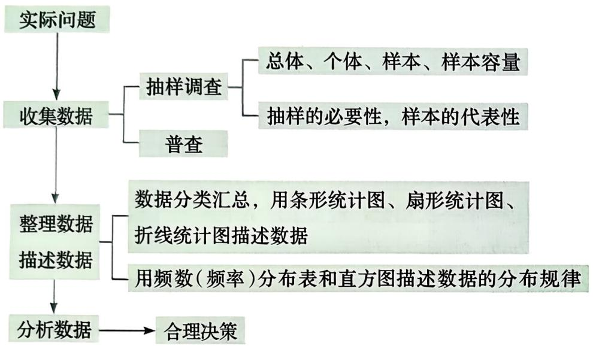

# 回顾与反思（第1课时）教材问题参考解答

## 教材任务清单

| 教材顺序 | question_id | 教材位置 | 任务类型 | 图片依赖 | 答案来源 |
|---:|---|---|---|---|---|
| 1 | 22.6.1-回顾反思-4-1 | 总结与反思第4题第（1）问 | 举例说明题 | 无 | AI参考推导 |
| 2 | 22.6.1-回顾反思-4-2 | 总结与反思第4题第（2）问 | 归纳题 | 无 | AI参考推导 |
| 3 | 22.6.1-回顾反思-4-3 | 总结与反思第4题第（3）问 | 比较说明题 | b108ae4c...jpg | AI参考推导 |
| 4 | 22.6.1-习题A-1-1 | A组第1题第（1）问 | 调查实践题 | 无 | AI参考推导 |
| 5 | 22.6.1-习题A-1-2 | A组第1题第（2）问 | 调查实践题 | 无 | AI参考推导 |
| 6 | 22.6.1-习题A-1-3 | A组第1题第（3）问 | 调查实践题 | 无 | AI参考推导 |
| 7 | 22.6.1-习题A-2-1 | A组第2题第（1）问 | 概念辨析题 | 无 | AI参考推导 |
| 8 | 22.6.1-习题A-2-2 | A组第2题第（2）问 | 概念辨析题 | 无 | AI参考推导 |
| 9 | 22.6.1-习题A-2-3 | A组第2题第（3）问 | 概念辨析题 | 无 | AI参考推导 |
| 10 | 22.6.1-习题A-3-1 | A组第3题第（1）问 | 调查方案题 | 无 | AI参考推导 |
| 11 | 22.6.1-习题A-3-2 | A组第3题第（2）问 | 调查方案题 | 无 | AI参考推导 |
| 12 | 22.6.1-习题A-3-3 | A组第3题第（3）问 | 调查方案题 | 无 | AI参考推导 |
| 13 | 22.6.1-习题A-3-4 | A组第3题第（4）问 | 调查方案题 | 无 | AI参考推导 |
| 14 | 22.6.1-习题A-4-1 | A组第4题第（1）问 | 统计计算题 | 无 | AI参考推导 |
| 15 | 22.6.1-习题A-4-2 | A组第4题第（2）问 | 统计推断题 | 无 | AI参考推导 |
| 16 | 22.6.1-习题A-5-1 | A组第5题第（1）问 | 统计计算题 | 无 | AI参考推导 |
| 17 | 22.6.1-习题A-5-2 | A组第5题第（2）问 | 作图题 | 无 | AI参考推导 |
| 18 | 22.6.1-习题A-5-3 | A组第5题第（3）问 | 作图题 | 无 | AI参考推导 |
| 19 | 22.6.1-习题A-5-4 | A组第5题第（4）问 | 解释题 | 无 | AI参考推导 |
| 20 | 22.6.1-习题A-6 | A组第6题 | 统计计算与比较题 | 无 | AI参考推导 |

## 参考解答

### 总结与反思第4题第（1）问

```yaml
question_id: "22.6.1-回顾反思-4-1"
source_id: "教材原文_第22章_回顾与反思_第1课时"
source_type: textbook
教材位置: "总结与反思第4题第（1）问"
教材顺序: 1
任务类型: 举例说明题
认知层级: 中间层
答案来源: AI参考推导
```

**原题**：(1) 举例说明, 如何抽样才能使样本对总体具有较好的代表性.

**参考解答**：例如调查全校学生每天的睡眠时间。可以先按年级确定各年级应抽取的人数，使各年级样本人数与该年级学生人数所占比例大致相同；再在各年级中把学生编号，用随机抽取的方式选取学生。这样既兼顾不同年级，又避免只调查某一类学生，样本对全校学生总体具有较好的代表性。

合理答案边界：所举方法应覆盖总体中的主要不同部分，并尽量避免按个人方便或主观意愿选取样本。

### 总结与反思第4题第（2）问

```yaml
question_id: "22.6.1-回顾反思-4-2"
source_id: "教材原文_第22章_回顾与反思_第1课时"
source_type: textbook
教材位置: "总结与反思第4题第（2）问"
教材顺序: 2
任务类型: 归纳题
认知层级: 基础层
答案来源: AI参考推导
```

**原题**：(2) 整理数据的一般步骤有哪些?

**参考解答**：

- 根据调查目的对原始数据进行检查；
- 按一定标准对数据分类或分组；
- 统计各类或各组数据的频数，必要时计算频率；
- 列出统计表，并选择合适的统计图描述数据的特征或分布规律。

### 总结与反思第4题第（3）问

```yaml
question_id: "22.6.1-回顾反思-4-3"
source_id: "教材原文_第22章_回顾与反思_第1课时"
source_type: textbook
教材位置: "总结与反思第4题第（3）问"
教材顺序: 3
任务类型: 比较说明题
认知层级: 基础层
答案来源: AI参考推导
```

**原题**：（3）条形统计图、扇形统计图、折线统计图、直方图分别描述数据哪方面的特征？



**参考解答**：

| 统计图 | 主要描述的数据特征 |
|---|---|
| 条形统计图 | 各类别数据数量的多少，便于比较不同类别的大小 |
| 扇形统计图 | 各部分数量占总数量的百分比，便于表示部分与总体的关系 |
| 折线统计图 | 数据随时间等顺序变量的变化情况，便于表示变化趋势 |
| 直方图 | 分组数据在各区间内的频数或频率，便于表示数据的分布规律 |

### A组第1题第（1）问

```yaml
question_id: "22.6.1-习题A-1-1"
source_id: "教材原文_第22章_回顾与反思_第1课时"
source_type: textbook
教材位置: "A组第1题第（1）问"
教材顺序: 4
任务类型: 调查实践题
认知层级: 基础层
答案来源: AI参考推导
```

**原题**：1. 有关部门规定：初中生每天的睡眠时间应达到9小时。请对你所在班的学生作一次调查，了解有多大比例的学生每天睡眠时间能达到9小时。

(1) 调查的问题是什么?

**参考解答**：调查所在班学生每天的睡眠时间，以及每天睡眠时间达到 $9$ 小时的学生占全班学生的百分比。

### A组第1题第（2）问

```yaml
question_id: "22.6.1-习题A-1-2"
source_id: "教材原文_第22章_回顾与反思_第1课时"
source_type: textbook
教材位置: "A组第1题第（2）问"
教材顺序: 5
任务类型: 调查实践题
认知层级: 中间层
答案来源: AI参考推导
```

**原题**：(2) 调查的范围有多大? 怎样进行调查?

**参考解答**：调查范围是所在班的全体学生。班级人数通常不多，可采用普查：统一规定“每天睡眠时间”的计算口径，向全班每名学生发放调查表，记录其最近一段时间内具有代表性的一天或若干天的睡眠时间，再汇总数据。为减小误差，可让学生依据作息记录填写，而不是只凭印象估计。

### A组第1题第（3）问

```yaml
question_id: "22.6.1-习题A-1-3"
source_id: "教材原文_第22章_回顾与反思_第1课时"
source_type: textbook
教材位置: "A组第1题第（3）问"
教材顺序: 6
任务类型: 调查实践题
认知层级: 中间层
答案来源: AI参考推导
```

**原题**：(3) 共调查了多少人？每天睡眠时间达到 9 小时的有多少人，所占的百分比是多少？

**参考解答**：本题须依据所在班的实际调查数据作答，不虚构人数。可按下表记录：

| 项目 | 实际数据 |
|---|---:|
| 共调查人数 | $n$ 人 |
| 每天睡眠时间达到 $9$ 小时的人数 | $m$ 人 |
| 所占百分比 | $\dfrac{m}{n}\times100\%$ |

将实际调查得到的 $m,n$ 代入计算，并按需要保留适当的小数位。

### A组第2题第（1）问

```yaml
question_id: "22.6.1-习题A-2-1"
source_id: "教材原文_第22章_回顾与反思_第1课时"
source_type: textbook
教材位置: "A组第2题第（1）问"
教材顺序: 7
任务类型: 概念辨析题
认知层级: 基础层
答案来源: AI参考推导
```

**原题**：2. 某乡镇有 8000 户家庭，请分别指出下列调查的总体和样本.

(1) 抽样调查 200 户家庭的人口.

**参考解答**：总体是该乡镇 $8000$ 户家庭的人口数据；样本是被抽取的 $200$ 户家庭的人口数据；样本容量是 $200$。

### A组第2题第（2）问

```yaml
question_id: "22.6.1-习题A-2-2"
source_id: "教材原文_第22章_回顾与反思_第1课时"
source_type: textbook
教材位置: "A组第2题第（2）问"
教材顺序: 8
任务类型: 概念辨析题
认知层级: 基础层
答案来源: AI参考推导
```

**原题**：(2) 抽样调查 100 户家庭的年实际收入.

**参考解答**：总体是该乡镇 $8000$ 户家庭的年实际收入数据；样本是被抽取的 $100$ 户家庭的年实际收入数据；样本容量是 $100$。

### A组第2题第（3）问

```yaml
question_id: "22.6.1-习题A-2-3"
source_id: "教材原文_第22章_回顾与反思_第1课时"
source_type: textbook
教材位置: "A组第2题第（3）问"
教材顺序: 9
任务类型: 概念辨析题
认知层级: 基础层
答案来源: AI参考推导
```

**原题**：(3) 抽样调查 100 户家庭的年消费支出金额.

**参考解答**：总体是该乡镇 $8000$ 户家庭的年消费支出金额数据；样本是被抽取的 $100$ 户家庭的年消费支出金额数据；样本容量是 $100$。

### A组第3题第（1）问

```yaml
question_id: "22.6.1-习题A-3-1"
source_id: "教材原文_第22章_回顾与反思_第1课时"
source_type: textbook
教材位置: "A组第3题第（1）问"
教材顺序: 10
任务类型: 调查方案题
认知层级: 中间层
答案来源: AI参考推导
```

**原题**：3. 解决下列问题需要哪些数据？采用什么样的调查方式能得到这些数据？

(1) 学校召开运动会, 要统一购买运动鞋。你所在班各种号码的鞋各要买多少双?

**参考解答**：需要收集全班每名学生所需运动鞋的号码。应对全班学生进行普查，逐人登记鞋号，再按鞋号分类汇总频数。某号码出现多少次，该号码通常就购买多少双；同时应核对登记人数之和是否等于全班实际购买人数。

### A组第3题第（2）问

```yaml
question_id: "22.6.1-习题A-3-2"
source_id: "教材原文_第22章_回顾与反思_第1课时"
source_type: textbook
教材位置: "A组第3题第（2）问"
教材顺序: 11
任务类型: 调查方案题
认知层级: 中间层
答案来源: AI参考推导
```

**原题**：(2) 你所在班全体同学的视力情况如何?

**参考解答**：需要收集全班每名学生的视力检查数据。应采用普查，可依据同一时间、同一标准下的视力检测记录，按预先确定的视力范围分类，统计各类人数和所占百分比，再用统计表或合适的统计图表示全班视力情况。

### A组第3题第（3）问

```yaml
question_id: "22.6.1-习题A-3-3"
source_id: "教材原文_第22章_回顾与反思_第1课时"
source_type: textbook
教材位置: "A组第3题第（3）问"
教材顺序: 12
任务类型: 调查方案题
认知层级: 中间层
答案来源: AI参考推导
```

**原题**：(3) 去年植树节某单位种下的树木的成活率是多少?

**参考解答**：需要收集去年植树节该单位种下的树木总数和目前成活的树木数。若树木数量允许逐棵核查，应采用普查。设种下 $n$ 棵，成活 $m$ 棵，则

$$
\text{成活率}=\frac{m}{n}\times100\%.
$$

若树木数量很多、分布范围很广，可采用有代表性的抽样调查，并用样本成活率估计总体成活率。

### A组第3题第（4）问

```yaml
question_id: "22.6.1-习题A-3-4"
source_id: "教材原文_第22章_回顾与反思_第1课时"
source_type: textbook
教材位置: "A组第3题第（4）问"
教材顺序: 13
任务类型: 调查方案题
认知层级: 拓展层
答案来源: AI参考推导
```

**原题**：(4) 一张选定的报纸上大约有多少个字?

**参考解答**：需要收集报纸各版面的字数数据。因为只求大约字数，可采用抽样调查：从不同版面随机选取若干个面积相同的文字区域，逐一统计字数，求出每个单位面积的平均字数；再测算整张报纸文字区域的总面积，用

$$
\text{估计总字数}=\text{单位面积平均字数}\times\text{文字区域总面积}
$$

进行估计。图片、空白和广告版面应从文字区域中扣除，样本应兼顾不同字号和排版形式。

### A组第4题第（1）问

```yaml
question_id: "22.6.1-习题A-4-1"
source_id: "教材原文_第22章_回顾与反思_第1课时"
source_type: textbook
教材位置: "A组第4题第（1）问"
教材顺序: 14
任务类型: 统计计算题
认知层级: 中间层
答案来源: AI参考推导
```

**原题**：4. 小亮随意选取了 10 期电脑体育彩票的中奖号码，结果如下：

```text
4924288 1041749 2756345 9437063 5415205
4382477 0257196 5147653 0417769 3652891
```

(1) 分别统计数字 $0 \sim 9$ 出现的次数, 并计算各数字出现的频率.

**参考解答**：$10$ 期中奖号码共有 $10\times7=70$ 个数字。逐个统计得：

| 数字 | 0 | 1 | 2 | 3 | 4 | 5 | 6 | 7 | 8 | 9 | 合计 |
|---:|---:|---:|---:|---:|---:|---:|---:|---:|---:|---:|---:|
| 频数 | 5 | 7 | 7 | 6 | 11 | 9 | 6 | 9 | 4 | 6 | 70 |
| 频率 | $\frac5{70}$ | $\frac7{70}$ | $\frac7{70}$ | $\frac6{70}$ | $\frac{11}{70}$ | $\frac9{70}$ | $\frac6{70}$ | $\frac9{70}$ | $\frac4{70}$ | $\frac6{70}$ | 1 |
| 频率（约） | 0.0714 | 0.1000 | 0.1000 | 0.0857 | 0.1571 | 0.1286 | 0.0857 | 0.1286 | 0.0571 | 0.0857 | 1.0000 |

检验：各数字频数之和为 $70$，各频率之和为 $1$。

### A组第4题第（2）问

```yaml
question_id: "22.6.1-习题A-4-2"
source_id: "教材原文_第22章_回顾与反思_第1课时"
source_type: textbook
教材位置: "A组第4题第（2）问"
教材顺序: 15
任务类型: 统计推断题
认知层级: 拓展层
答案来源: AI参考推导
```

**原题**：(2) 各数字出现的频率差异大吗？如果选100期中奖号码的700个数字进行统计，你认为各数字出现的频率有什么规律？

**参考解答**：在这 $70$ 个数字中，各数字频率在 $0.0571$ 到 $0.1571$ 之间，最大值与最小值相差约 $0.1000$，存在较明显差异。

若统计 $100$ 期的 $700$ 个数字，样本容量增大，各数字出现的频率一般会比本题的结果更接近，通常会在 $0.1$ 附近波动，但不一定都恰好等于 $0.1$。这是一种基于较大样本作出的合理推测，实际结果仍应以统计数据为准。

### A组第5题第（1）问

```yaml
question_id: "22.6.1-习题A-5-1"
source_id: "教材原文_第22章_回顾与反思_第1课时"
source_type: textbook
教材位置: "A组第5题第（1）问"
教材顺序: 16
任务类型: 统计计算题
认知层级: 基础层
答案来源: AI参考推导
```

**原题**：5. 小明家的电表在 3 月底至 9 月底的读数(取整千瓦·时)如下表:

| 记录时间 | 3月底 | 4月底 | 5月底 | 6月底 | 7月底 | 8月底 | 9月底 |
|---|---:|---:|---:|---:|---:|---:|---:|
| 电表读数 | 1750 | 1850 | 1960 | 2110 | 2360 | 2600 | 2720 |

(1) 计算小明家 $4 \sim 9$ 月份的用电量，并填写统计表：

| 月份 | 4 | 5 | 6 | 7 | 8 | 9 |
|---:|---:|---:|---:|---:|---:|---:|
| 用电量/(千瓦·时) |  |  |  |  |  |  |

**参考解答**：每月用电量等于本月底电表读数减去上月底电表读数。例如，$4$ 月用电量为 $1850-1750=100$（千瓦·时）。

| 月份 | 4 | 5 | 6 | 7 | 8 | 9 |
|---:|---:|---:|---:|---:|---:|---:|
| 用电量/（千瓦·时） | 100 | 110 | 150 | 250 | 240 | 120 |

检验：$100+110+150+250+240+120=970$，且 $2720-1750=970$，前后一致。

### A组第5题第（2）问

```yaml
question_id: "22.6.1-习题A-5-2"
source_id: "教材原文_第22章_回顾与反思_第1课时"
source_type: textbook
教材位置: "A组第5题第（2）问"
教材顺序: 17
任务类型: 作图题
认知层级: 中间层
答案来源: AI参考推导
```

**原题**：(2) 画条形统计图表示各月的用电量.

**参考解答**：

- 画横轴表示月份，依次标出 $4,5,6,7,8,9$ 月；
- 画纵轴表示用电量，单位为“千瓦·时”，纵轴刻度至少能表示到 $250$；
- 分别画出高度为 $100,110,150,250,240,120$ 的六个直条；
- 各直条宽度相同、间隔相等，并标明统计图名称与单位。

检验时，六个直条的高度应分别与统计表中的六个用电量数据一致。

### A组第5题第（3）问

```yaml
question_id: "22.6.1-习题A-5-3"
source_id: "教材原文_第22章_回顾与反思_第1课时"
source_type: textbook
教材位置: "A组第5题第（3）问"
教材顺序: 18
任务类型: 作图题
认知层级: 中间层
答案来源: AI参考推导
```

**原题**：(3) 画折线统计图表示各月用电量的变化情况.

**参考解答**：

- 画横轴表示月份，纵轴表示用电量，单位为“千瓦·时”；
- 依次描出点 $(4,100)$、$(5,110)$、$(6,150)$、$(7,250)$、$(8,240)$、$(9,120)$；
- 按月份先后顺序用线段连接相邻各点；
- 标明统计图名称、坐标轴名称和单位。

所得折线从 $4$ 月到 $7$ 月总体上升，$7$ 月达到最高，随后下降。

### A组第5题第（4）问

```yaml
question_id: "22.6.1-习题A-5-4"
source_id: "教材原文_第22章_回顾与反思_第1课时"
source_type: textbook
教材位置: "A组第5题第（4）问"
教材顺序: 19
任务类型: 解释题
认知层级: 中间层
答案来源: AI参考推导
```

**原题**：(4) 解释用电量变化的主要原因.

**参考解答**：$4$ 月至 $7$ 月用电量逐渐增大，可能是天气逐渐变热，电风扇、空调等用电设备的使用时间增加；$8$ 月仍处于较高水平；$9$ 月天气转凉，制冷设备使用减少，用电量明显下降。

合理答案边界：这是结合季节变化作出的解释。若家庭成员人数、外出时间或大功率电器使用情况发生变化，也可能影响用电量，应结合小明家的实际情况判断。

### A组第6题

```yaml
question_id: "22.6.1-习题A-6"
source_id: "教材原文_第22章_回顾与反思_第1课时"
source_type: textbook
教材位置: "A组第6题"
教材顺序: 20
任务类型: 统计计算与比较题
认知层级: 拓展层
答案来源: AI参考推导
```

**原题**：6. 2000 年 6 月, 人类基因组计划中的 DNA 全序列草图完成, 人类拥有了一本记录着自身生老病死及遗传进化全部信息的 “天书”。这本天书是由四个字符 A, T, C, G 按一定顺序排成的长约 30 亿个字符的序列, 这四个字符表示四种碱基。下表所示的是两个类型的 DNA 序列片段。

| 类型 | DNA 序列片段 |
|---|---|
| A类 | ATGGCCGATCGGCTGGAAGGAACAAATAGGCGGAATTAAGGA AGGCGTTCTCGCTTTCGACAAGGAGGCGGACCATAGGAGGCGGATTAGGAACGGTTATGAGGAAGTTA |
| B类 | GTTAGATTTAACGTTTTTTATGGAATTTATGGAATTATAAATT TAAAAATTTATATTTTTTAGGTAAGTAATCCAACGTTTTTATTACTTTTTAAAATTAAATATTTATT |

统计这两个类型的 DNA 序列片段中字符 A, T, C, G 出现的频数，比较它们的主要差异.

**参考解答**：两个序列片段都含有 $110$ 个字符。逐字符统计得：

| 类型 | A 的频数 | T 的频数 | C 的频数 | G 的频数 | 合计 |
|---|---:|---:|---:|---:|---:|
| A类 | 33 | 20 | 17 | 40 | 110 |
| B类 | 39 | 55 | 5 | 11 | 110 |

相应频率为：

| 类型 | A 的频率 | T 的频率 | C 的频率 | G 的频率 |
|---|---:|---:|---:|---:|
| A类 | $30.00\%$ | $18.18\%$ | $15.45\%$ | $36.36\%$ |
| B类 | $35.45\%$ | $50.00\%$ | $4.55\%$ | $10.00\%$ |

主要差异：A类中 G 出现最多，四种字符的频数差距相对较小；B类中 T 出现最多，A、T 合计占 $85.45\%$，而 C、G 的频数明显较少。与 A 类相比，B 类的 T 更多，C 和 G 更少。

检验：A类频数之和为 $33+20+17+40=110$；B类频数之和为 $39+55+5+11=110$。

## 覆盖统计

| 统计项 | 数量 |
|---|---:|
| 教材任务总数 | 20 |
| 参考解答条目数 | 20 |
| 唯一 question_id 数 | 20 |
| 基础层 | 7 |
| 中间层 | 9 |
| 拓展层 | 4 |
| 图片依赖任务 | 1 |
| 暂停任务 | 0 |

教材顺序从 1 至 20 连续，任务清单与参考解答一一对应。本文件为教材问题参考解答，不是出版社标准答案。
