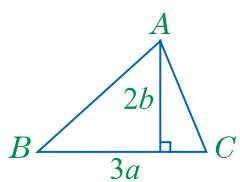
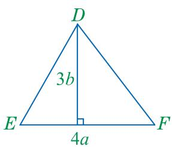

## 12.1分式—（第二课时）
## 观察与思考

当 $d \neq 0, b + c \neq 0$ 时，分式 $\frac{ab + ac}{bd + cd}$ 能不能化简？如果能，那么化简的依据是什么，化简的结果又是什么？ 

分式 $\frac{ab + ac}{bd + cd}$ 可以化简，化简过程如下： 

$$
\begin{array}{r l} & \text {分解因式} \\ & \text {分子和分母同除以b+c} \\ & \text {原分式} \frac {a b + a c}{b d + c d} = \frac {a (b + c)}{d (b + c)} = \frac {a}{d} \text {化简后的分式} \\ & \text {确定分子和分母的公因式} \quad \text {约去公因式} \end{array}
$$

像上面这样，把分式中分子和分母的公因式约去，叫作分式的约分(reduction of a fraction). 分子和分母没有公因式的分式，叫作最简分式(fraction in lowest terms). 

如在分式 $\frac{ab + ac}{bd + cd}$ 中，分子和分母的公因式为 $b + c$ ，约去这个公因式，得到 $\frac{a}{d}$ 。分式 $\frac{a}{d}$ 是最简分式。约分是为了将分式化为最简分式。 

分式化简的结果应是最简分式或整式. 

例 2 约分: 

(1) $\frac{35a^2b^2}{15a^3b}$ ; (2) $\frac{x^2 - y^2}{a(x + y)}$ ; (3) $\frac{4m - m^2}{m^2 - 8m + 16}$ . 

解：(1) $\frac{35a^2b^2}{15a^3b} = \frac{7b\cdot 5a^2b}{3a\cdot 5a^2b} = \frac{7b}{3a}.$ 

(2) $\frac{x^2 - y^2}{a(x + y)} = \frac{(x - y)(x + y)}{a(x + y)} = \frac{x - y}{a}.$ 

(3) $\frac{4m - m^2}{m^2 - 8m + 16}$ $= \frac{m(4 - m)}{(4 - m)^2}$ $= \frac{m}{4 - m}.$ 

## 做一做

当 p=12，q=-8 时，请分别用直接代入求值和化简后代入求值两种方法求分式 $\frac{p^{2}-pq}{p^{2}-2pq+q^{2}}$ 的值，并比较哪种方法较简单. 

## 练习

1. 下列分式的约分是否正确？请把不正确的改正过来.
(1) $\frac{x^{3}}{x^{2}}=x$ ; (2) $\frac{a^{2}}{2a}=1$ ; (3) $\frac{mn}{mn^{2}}=0$ ; (4) $\frac{-x+y}{x-y}=-1$ . 

2. 约分：
(1) $\frac{6ab^{2}}{8b^{3}}$ ; (2) $\frac{x^{2}-2xy}{x^{2}-4xy+4y^{2}}$ ; (3) $\frac{a^{2}+2a+1}{a^{2}+a}$ . 

## 习题

## A组

1. 约分：
(1) $\frac{5m^2x}{10mx^2}$ ; (2) $\frac{-2a}{3a + a^2}$ ; (3) $\frac{x^2 - 9}{x + 3}$ ; (4) $\frac{ab + ab^2}{1 - b^2}$ ; (5) $\frac{a^2 - b^2}{a^2 + 2ab + b^2}$ ; (6) $\frac{a^3 - 4ab^2}{-a^3 - 4a^2b - 4ab^2}$ . 

2. 当 $x = 2, y = 3$ 时，求 $\frac{x^2 + xy}{x^2 + 2xy + y^2}$ 的值. 

## B组

3. 如图，计算 $\triangle ABC$ 与 $\triangle DEF$ 的面积比. 

(第3题)

C组 

4. 已知 $x, y$ 满足 $|x + 1| + (y - 2)^2 = 0$ . 求 $\frac{x^2 - 2xy + y^2}{(x - y)^3}$ 的值. 
