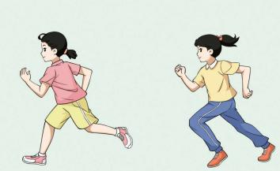
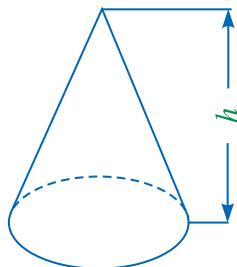

## 12.2 分式的乘除（第二课时）
## 观察与思考

一个分数除以另一个分数，是将除数的分子与分母颠倒位置后，与被除数相乘．如： 

$$
\frac {2}{3} \div \frac {7}{3} = \frac {2}{3} \times \frac {3}{7} = \frac {2}{7}.
$$

请类比分数的除法运算，思考分式 $\frac{A}{B}$ 除以 $\frac{C}{D}$ 的结果. 

与分数除法的运算法则类似，我们得到分式除法的运算法则.
分式的除法法则 

分式除以分式，把除式的分子与分母颠倒位置后，与被除式相乘. 

$$
\frac {A}{B} \div \frac {C}{D} = \frac {A}{B} \cdot \frac {D}{C} = \frac {A \cdot D}{B \cdot C}.
$$

由此可知，分式的除法运算是转化为分式的乘法运算进行的. 

例 3 计算下列各式: 

(1) $\frac{5y^2}{2x} \div \frac{y}{4x}$ ; (2) $\frac{2x - 6}{x - 2} \div (x - 3)$ ; (3) $\frac{a^2 + 3ab}{a^2 + 2ab + b^2} \div \frac{a + 3b}{a^2 - b^2}$ . 

解：（1） $\frac{5y^2}{2x}\div \frac{y}{4x}$ $= \frac{5y^2}{2x}\cdot \frac{4x}{y}$ $= 10y.$ 

$$
\begin{array}{r l} & \frac {2 x - 6}{x - 2} \div (x - 3) \\ & = \frac {2 x - 6}{x - 2} \cdot \frac {1}{x - 3} \end{array} \tag {2}
$$

$$
\begin{array}{r l} & = \frac {2 (x - 3)}{(x - 2) (x - 3)} \\ & = \frac {2}{x - 2}. \end{array}
$$

(3) 

$$
\begin{array}{r l} & \frac {a ^ {2} + 3 a b}{a ^ {2} + 2 a b + b ^ {2}} \div \frac {a + 3 b}{a ^ {2} - b ^ {2}} \\ & = \frac {a ^ {2} + 3 a b}{a ^ {2} + 2 a b + b ^ {2}} \cdot \frac {a ^ {2} - b ^ {2}}{a + 3 b} \\ & = \frac {a (a + 3 b) (a + b) (a - b)}{(a + b) ^ {2} (a + 3 b)} \\ & = \frac {a (a - b)}{a + b}. \end{array}
$$

例 4 八年级(1)班的同学在体育课上进行长跑训练, 小芳跑完 $1000 \mathrm{~m}$ 用了 $t \mathrm{~s}$ , 小雯用相同的时间跑完了 $800 \mathrm{~m}$ . 这次训练, 小芳的平均速度是小雯平均速度的多少倍? 

解：小芳的平均速度为 $\frac{1000}{t} \mathrm{~m/s}$ ，小雯的平均速度为 $\frac{800}{t} \mathrm{~m/s}$ . 

$$
\frac {1 0 0 0}{t} \div \frac {8 0 0}{t} = \frac {1 0 0 0}{t} \times \frac {t}{8 0 0} = \frac {1 0 0 0}{8 0 0} = 1. 2 5.
$$

答：这次训练，小芳的平均速度是小雯平均速度的 1.25 倍. 

## 练习

1. 计算下列各式: 

(1) $\frac{2a}{3m^2n} \div \frac{a}{6m}$ ; 

(2) $\frac{2 - x}{x + 1} \div (2x - x^2)$ ; 

(3) $\frac{a^2 - b^2}{a^2 + 2ab} \div \frac{(a + b)^2}{a + 2b}$ . 

2. 已知 $a^2 - a = 3$ . 求 $\frac{a - 1}{a + 2} \cdot \frac{a^2 - 4}{a^2 - 2a + 1} \div \frac{1}{a^2 - 1}$ 的值. 

## 习题

## A组

1. 计算下列各式：
(1) $\frac{a^{2}}{b^{2}}\div\frac{a^{2}}{2b}$ ; (2) $\frac{x-y}{xy}\div(x-y)$ ;
(3) $(x-2)\div\frac{x^{2}-4x+4}{x+2}$ ; (4) $\frac{a-2}{a^{2}+8a+16}\div\frac{a^{2}-4}{a+4}$ . 

2. 如图，圆锥的体积 $V = \frac{1}{3} Sh$ 。其中， $S$ 为圆锥的底面积， $h$ 为圆锥的高。 

（1）当圆锥的高扩大到原来的 $a$ 倍而底面积不变时，变化后的圆锥的体积是原来的多少倍？ 

(2) 当圆锥的底面积扩大到原来的 $a$ 倍而体积不变时，（第2题）变化后的圆锥的高是原来的几分之一？ 

## B 组

3. 计算下列各式：
(1) $\frac{a^{2}-1}{a^{2}+4a+4}\div(a+1)\cdot\frac{(a+1)(a+2)}{a-1};$ (2) $(xy-x^{2})\div\frac{x^{2}-2xy+y^{2}}{xy}\cdot\frac{x-y}{x^{2}}.$ 

4. 已知 $x = 3, y = -4$ . 求 $\frac{x^2}{(x - y)^2} \cdot \frac{x^3 + xy^2 - 2x^2y}{x^2} \div \frac{y^2 - x^2}{xy + y^2}$ 的值. 

C组 

5. 有这样一道题：“先化简，再求值： $\frac{(x-y)^{2}}{x^{2}-y^{2}}\cdot\frac{x^{2}+xy}{x-y}\div x^{3}$ . 其中，x=-3.”小杰同学在做这道题时，错将x=-3看成x=3，但他的答案是正确的．你能找出其中的原因吗？ 
