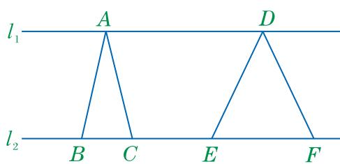

## 12.4 分式方程（第一课时）

我们在用方程解决实际问题时，会遇到一些分母中含有未知数的方程。这就是我们将要学习的分式方程。 

## 做一做

1. 一个两位数的十位数字是4，如果把这个两位数的个位数字与十位数字交换，那么得到的新两位数与原两位数的比值是 $\frac{4}{7}$ ，求原来的两位数。 

设原两位数的个位数字是 x，列出的方程为 ____. 

2. 某公司生产 A, B 两种设备, 生产 B 设备每台的成本是生产 A 设备每台成本的 1.5 倍. 若公司投入 16 万元生产 A 设备, 36 万元生产 B 设备, 则可生产两种设备共 10 台. 生产 A, B 两种设备每台的成本分别是多少万元? 

设生产 A 设备每台的成本是 x 万元，列出的方程为 ____. 

由此，我们得到了方程： $\frac{10x + 4}{40 + x} = \frac{4}{7}$ ， $\frac{16}{x} +\frac{36}{1.5x} = 10.$ 

## 大家谈谈

上面得到的方程与我们已学过的方程有什么不同？这两个方程有哪些共同特点？ 

像 $\frac{10x+4}{40+x}=\frac{4}{7}$ 和 $\frac{16}{x}+\frac{36}{1.5x}=10$ 这样，分母中含有未知数的方程，叫作分式方程(fractional equation). 使得分式方程两边相等的未知数的值，叫作分式方程的解(也叫作分式方程的根). 

## 观察与思考

解分式方程 $\frac{10x + 4}{40 + x} = \frac{4}{7}$ 和 $\frac{x + 1}{x - 1} = \frac{x - 3}{1 - x} + 1.$ 

解分式方程 $\frac{10x + 4}{40 + x} = \frac{4}{7}$ . 

解：方程两边同乘 $7(40 + x)$ ，得 

$$
7 (1 0 x + 4) = 4 (4 0 + x).
$$

整理，得 66x=132. 

解得 $x = 2$ 

所以，方程的解是 $x = 2$ 解分式方程 $\frac{x + 1}{x - 1} = \frac{x - 3}{1 - x} + 1$ . 解：方程两边同乘 $x - 1$ ，得 $x + 1 = -(x - 3) + (x - 1)$ . 整理，得 $x = 1$ . 所以，方程的解是 $x = 1$ . 

1. 小明和大刚求出的方程的解是原分式方程的解吗？为什么？ 

2. 你认为在解分式方程时应注意些什么？ 

实际上，把 $x = 2$ 代入分式方程 $\frac{10x + 4}{40 + x} = \frac{4}{7}$ 中，方程左右两边相等，所以， $x = 2$ 是分式方程 $\frac{10x + 4}{40 + x} = \frac{4}{7}$ 的解；而当 $x = 1$ 时， $x - 1 = 0$ ，即分式方程 $\frac{x + 1}{x - 1} = \frac{x - 3}{1 - x} + 1$ 中的分母为 0，方程中的分式无意义，所以， $x = 1$ 不是这个分式方程的解. 

在解分式方程时，首先通过去分母将分式方程转化为整式方程，并解这个整式方程，然后将整式方程的解代入分式方程中检验。当分式方程左右两边相等时，这个整式方程的解就是分式方程的解。当分式方程中某个分式的分母的值等于0(或公分母等于0)时，分式方程无解，我们把这样的根叫作分式方程的增根。 

例 解方程 $\frac{2}{x+2}-\frac{2-x}{2+x}=3.$ 

解：方程两边同乘 $x + 2$ ，得 

$$
2 - (2 - x) = 3 (x + 2).
$$

解这个整式方程，得 

$$
x = - 3.
$$

经检验，x=-3 是原分式方程的解. 

解分式方程时一定要注意验根. 

## 练习

1. 解下列方程：
(1) $\frac{1}{x}=\frac{4}{x-3};$ (2) $\frac{x}{x-3}=2-\frac{3}{3-x}.$ 

2. 如图，已知直线 $l_{1} \parallel l_{2}$ ，点 A, D 和点 B, C, E, F 分别在直线 $l_{1}, l_{2}$ 上， $\triangle ABC$ 与 $\triangle DEF$ 的面积之比为 1:2，边 EF 比边 BC 长 3 cm. 求 BC, EF 的长. 

3. 解分式方程时，首先要考虑去分母. 

(第2题) 

请思考：去分母的目的是什么？解分式方程为什么必须验根？ 

## 习题

## A组

1. 解下列方程：
(1) $\frac{1}{x+1}=\frac{2}{x+2};$ (2) $\frac{15}{x}-\frac{25}{2x}=\frac{1}{2};$ (3) $\frac{x-8}{x-7}-\frac{1}{7-x}=8;$ (4) $\frac{1}{x+1}-\frac{2}{x-4}=0.$ 

2. 某玩具厂接到一份生产 2400 件儿童玩具的订单。如果由一车间生产这批玩具，那么恰好按规定时间完成；如果由二车间生产这批玩具，那么在规定时间内还差 400 件没有完成。已知一车间和二车间每天一共生产 550 件玩具，那么一车间和二车间平均每天各生产多少件？ 

## B组

3. 解下列方程：
(1) $\frac{1}{x-1}+\frac{1}{x-2}=\frac{2}{x};$ (2) $\frac{5}{x^{2}+x}-\frac{1}{x^{2}-x}=0;$ (3) $\frac{x}{x-1}-1=\frac{3}{(x-1)(x+2)};$ (4) $\frac{2x+2}{x}-\frac{x+2}{x-2}=\frac{x^{2}-2}{x^{2}-2x}.$ 

## C组

4. 已知 A, B 是数轴上关于原点对称的两点，它们表示的数分别是 $\frac{x}{x-2}$ 和 $\frac{x^{2}-4x+4}{2x-x^{2}}$ . 求 x 的值. 

## 读一读

## 分式方程的增根

解分式方程为什么会出现增根呢？ 

事实上，解分式方程产生增根，主要是在去分母时造成的。根据等式的基本性质，等式的两边同乘(或除以)一个不等于0的数，所得的结果仍是等式。而在解分式方程时，由于去分母是将方程左右两边同乘公分母，但此时还无法知道所乘的公分母的值是不是0，于是，未知数的取值范围可能就扩大了。如果去分母后得到的整式方程的根使所乘的公分母的值为0，就产生了增根。增根是整式方程的根，但不是原分式方程的根。 

例如：解方程 $\frac{1}{x + 1} +\frac{2}{x - 1} = \frac{4}{x^2 - 1}.$ 

① 

解：方程两边同乘 $(x + 1)(x - 1)$ ，得整式方程 

$$
(x - 1) + 2 (x + 1) = 4.\tag{②}
$$

解这个整式方程，得 

$$
x = 1.
$$

检验：当 x=1 时， $(x+1)(x-1)=0$ . 

所以 $x = 1$ 是整式方程②的根，是原分式方程①的增根.因为解分式方程时可能产生增根，所以，解分式方程必须验根 
