## 13.2全等图形（第一课时）

图形的形状和大小是几何研究的重要内容。本节我们来研究形状相同、大小相等的这类图形。 

## 观察与思考

如图 13.2-1，观察给出的五组图形. 

（1）在每组中，两个图形的形状和大小各有怎样的关系？ 

（2）先在半透明纸上画出同样大小的图形，再将每组中的一个图形叠放在另一个图形上，观察它们是否能够完全重合. 

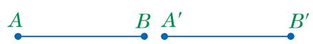

(1) 

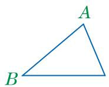

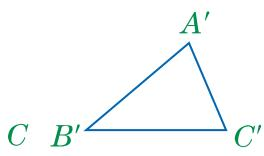

(2) 

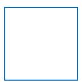

(3)

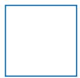

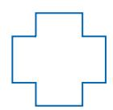

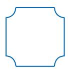

(4)

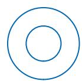

(5)

图13.2-1 

在上面的五组图形中，(1)组、(2)组和(3)组中的两个图形能够完全重合；(4)组和(5)组中的两个图形不能完全重合。我们把能够完全重合的两个图形叫作全等图形(congruent figures)。在这两个全等图形中，互相重合的点叫作对应点。 

能够完全重合的两个三角形叫作全等三角形(congruent triangles). 在两个全等的三角形中，互相重合的边叫作对应边，互相重合的角叫作对应角. 

如图13.2-1(2)， $\triangle ABC$ 与 $\triangle A'B'C'$ 是两个全等三角形，点 $A$ 与点 $A'$ ，点 $B$ 与点 $B'$ ，点 $C$ 与点 $C'$ 分别是对应点；边 $AB$ 与边 $A'B'$ ，边 $AC$ 与边 $A^{\prime}C^{\prime}$ ，边 BC 与边 $B^{\prime}C^{\prime}$ 分别是对应边； $\angle A$ 与 $\angle A^{\prime}$ ， $\angle B$ 与 $\angle B^{\prime}$ ， $\angle C$ 与 $\angle C^{\prime}$ 分别是对应角. 

我们用符号“ $\cong$ ”来表示两个图形全等。如图13.2-1(2)， $\triangle ABC$ 与 $\triangle A'B'C'$ 是两个全等三角形，记作“ $\triangle ABC \cong \triangle A'B'C'$ ”，读作“三角形 $ABC$ 全等于三角形 $A'B'C'$ ”。 

表示两个三角形全等时，通常把表示对应顶点的字母写在对应的位置上. 

## 大家谈谈

1. 两条能够完全重合的线段有什么关系？ 

2. 两个能够完全重合的角有什么关系？ 

3. 两个全等三角形的对应边之间有什么关系，对应角之间又有什么关系？ 

## 全等三角形的对应边相等，对应角相等.

例 已知：如图 13.2 - 2， $\triangle ABC \cong \triangle DEF$ ， $\angle A=78^{\circ},\quad\angle B=35^{\circ},\quad BC=18.$ 

(1) 写出 $\triangle ABC$ 和 $\triangle DEF$ 的对应边和对应角. 

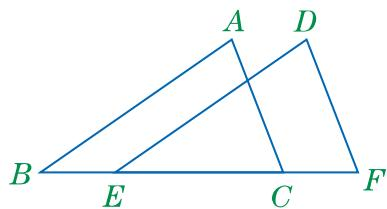

图13.2-2

(2) 求 $\angle F$ 的度数和边 EF 的长. 

解：（1）边 AB 和边 DE，边 BC 和边 EF，边 AC 和边 DF 分别是对应边； $\angle A$ 和 $\angle D$ ， $\angle B$ 和 $\angle DEF$ ， $\angle ACB$ 和 $\angle F$ 分别是对应角. 

(2) 在 $\triangle ABC$ 中， $\because \angle A + \angle B + \angle ACB = 180^{\circ}$ （三角形内角和定理）， $\therefore \angle ACB = 180^{\circ} - \angle A - \angle B = 180^{\circ} - 78^{\circ} - 35^{\circ} = 67^{\circ}$ . $\because \triangle ABC \cong \triangle DEF$ （已知）， $\therefore \angle F = \angle ACB = 67^{\circ}, EF = BC = 18.$ （全等三角形的对应边相等，对应角相等） 

## 练习

1. 写出下列每组全等图形中的对应边和对应角. 

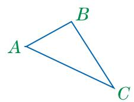

(1) 

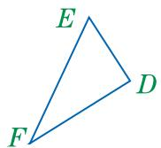

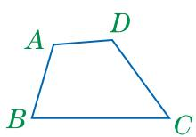

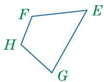

(第1题)

(2) 

2. 如图， $\triangle AMB \cong \triangle AMC$ 。请写出图中相等的线段。 

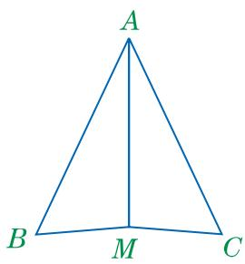

(第2题)

## 习题

## A组

1. 观察房梁支架和窗户的示意图。请分别指出图中的三组全等图形。 

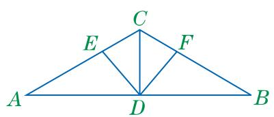

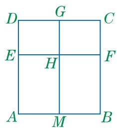

(第1题) 

2. 如图， $\triangle AOC \cong \triangle BOD$ 。请写出它们的对应边和对应角。 

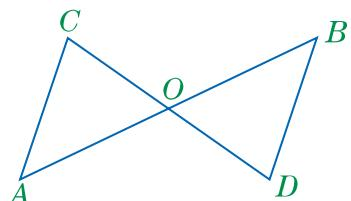

(第2题)

## B组

3. 如图， $\triangle ABD \cong \triangle ACE$ . 

(1) 写出这两个三角形的对应边和对应角. 

(2) 若 $\angle ADB = 75^{\circ}$ ，求 $\angle AEB$ 的度数. 

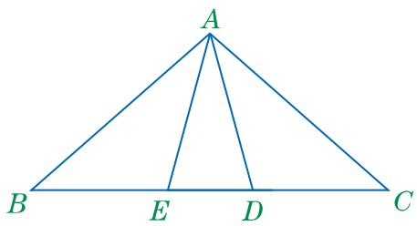

(第3题)

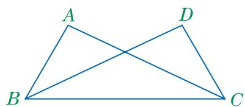

(第4题)

4. 已知：如图， $\triangle ABC \cong \triangle DCB$ 。求证： $\angle ACD = \angle DBA$ . 

C组 

5. 把如图所示的各个图形分别分割成两个全等的图形. 

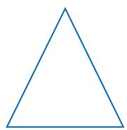

(第 5 题)

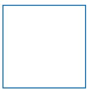

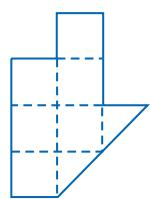
