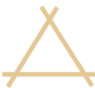
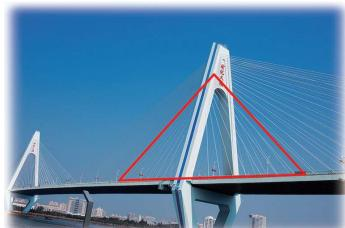
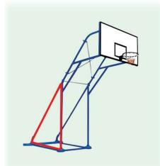
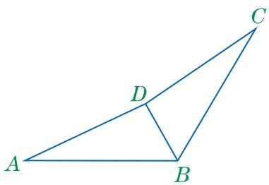
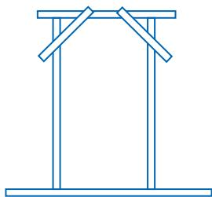
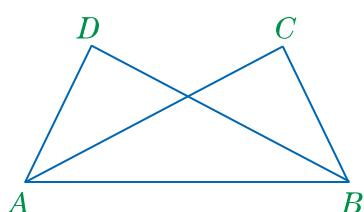
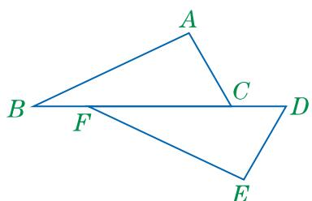
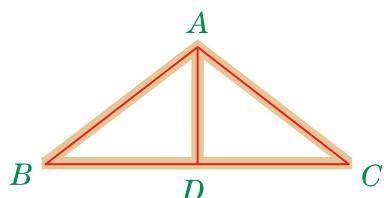
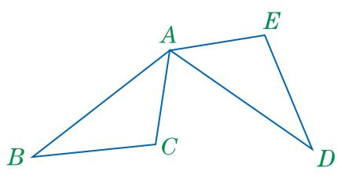
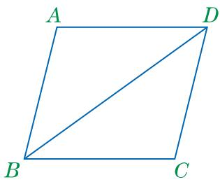

## 13.3 全等三角形的判定（第一课时）

在全等图形中，全等三角形是最基本、应用最广泛的一类图形。那么，如何判定两个三角形全等呢？ 

我们知道，三条边分别相等、三个角分别相等的两个三角形全等，但我们希望能用较少的条件来判定两个三角形全等。这样的条件应当是怎样的呢？ 

## 观察与思考

1. 根据下面表中给出的 $\triangle ABC$ 和 $\triangle A'B'C'$ 边和角的相等条件及对应的图形，判断 $\triangle ABC$ 和 $\triangle A'B'C'$ 是否全等，并把结果填写在表中. 

| 边和角的相等条件 | 对应的图形 | 是否全等 |
| --- | --- | --- |
| BC=B'C' |  |  |
| \angle B=\angle B' |  |  |
| AB=A'B'BC=B'C' |  |  |
| BC=B'C'\angle B=\angle B' |  |  |
| \angle A=\angle B'A'C'\angle B=\angle B' |  |  |

2. 有三个角分别相等的两个三角形一定全等吗？说说你的理由. 

3. 小亮认为，判断两个三角形全等的较少条件，只有以下三种情况才有可能：三条边分别相等，或两条边和一个角分别相等，或两个角和一条边分别相等。你认为这种说法对吗？ 

## 一起探究

准备一些长为 $3 \, cm$ ， $4 \, cm$ ， $5 \, cm$ ， $7 \, cm$ 的细木条. 

(1) 取三根细木条摆成边长分别为 $4 \mathrm{~cm}, 5 \mathrm{~cm}, 7 \mathrm{~cm}$ 的三角形。把你摆出的三角形和同学摆出的三角形作一下比较，它们能重合吗？ 

（2）取三根细木条摆成边长分别为 $3 \, cm$ ， $4 \, cm$ ， $5 \, cm$ 的三角形。和同学摆出的三角形作一下比较，它们能重合吗？ 

（3）和同桌取同样长度的三根能摆成三角形的细木条，同时摆三角形。摆成的两个三角形能重合吗？ 

## 基本事实一 三边分别相等的两个三角形全等.

基本事实一可简记为“边边边”或“SSS”. 

如图13.3-1，用三根木条钉成一个三角形框架，不论怎样拉动，它的形状和大小都不改变，即只要三角形的三边确定，它的形状和大小就完全确定了。三角形所具有的这一性质叫作三角形的稳定性。 

图13.3-1

在日常生活中，三角形的稳定性有着广泛的应用，图13.3-2反映了三角形稳定性的部分应用。除此之外，你还能举出应用三角形稳定性的例子吗？ 

图13.3-2

## 大家谈谈

回顾 “作一个角等于已知角” 的方法，并说说作图的依据. 

## 练习

1. 已知：如图， $AB = CB$ ， $AD = CD$ ．求证： $\triangle ABD\cong \triangle CBD$ 

(第1题)

(第2题)

2. 如图，工人师傅在安装木制门框时，为了防止门框变形，常常先在门框上钉上两个斜拉的木条。请说明这样做的道理。 

## 习题

A组 

1. 已知：如图， $AD = BC$ ， $BD = AC$ ．求证： $\triangle ABD\cong \triangle BAC.$ 

(第1题)

(第2题)

2. 已知：如图， $AB = EF$ ， $AC = ED$ ， $BF = CD$ ．求证： $\angle A = \angle E$ 

## B 组

3. 如图是房梁支架的示意图。如果 AB=AC，BD=CD，那么 $\angle BAD$ 和 $\angle CAD$ 相等吗？如果不相等，请说明理由；如果相等，请给出证明。 

(第3题)

4. 已知：如图， $AB = AD$ ， $AC = AE$ ， $BC = DE$ 。求证： $\angle BAD = \angle CAE$ 

(第 4 题)

(第 5 题)

5. 如图， $AB = CD$ ， $AD = CB$ 。那么， $AB$ 和 $CD$ 具有怎样的位置关系？ $AD$ 和 $CB$ 呢？请说明理由. 

两条边和一个角分别相等的两个三角形是不是全等的呢？ 

