## 13.3 全等三角形的判定（第二课时）
## 观察与思考

画一个三角形，使它的两条边长分别是 $1.5 \, cm$ ， $2.5 \, cm$ ，并且使长为 $1.5 \, cm$ 的这条边所对的角是 $30^{\circ}$ . 

小明的画图过程如图 13.3-3 所示： 

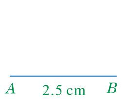

(1)

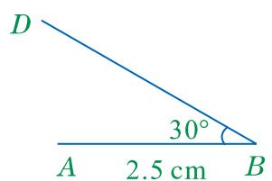

(2)

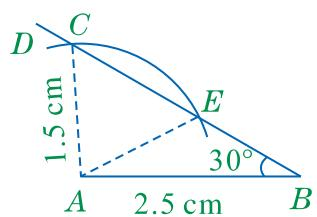

(3)

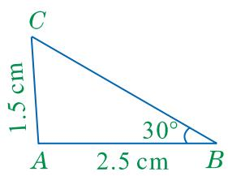

(4)

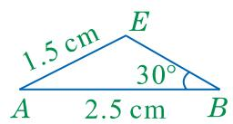

(5)

他得到了两个符合条件的三角形！ 

图13.3-3 

小明根据所给的条件，画出了两个形状不同的三角形。这说明两个三角形的两条边和其中一边的对角分别相等时，这两个三角形不一定全等。 

当两边和它们的夹角分别相等时，这两个三角形是否全等呢？ 

## 一起探究

如图13.3-4，在 $\triangle ABC$ 和 $\triangle A'B'C'$ 中， $AB = A'B'$ ， $\angle B = \angle B'$ ， $BC = B'C'$ . 

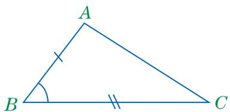

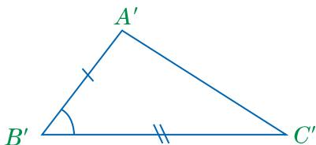

图13.3-4

(1) 将 $\triangle ABC$ 叠放在 $\triangle A'B'C'$ 上, 使顶点 $B$ 与顶点 $B'$ 重合, 边 $BC$ 落在边 $B'C'$ 上, 点 $A$ 与点 $A'$ 在边 $B'C'$ 的同侧. 那么, 点 $C$ 与点 $C'$ 是否重合, 边 $BC$ 与边 $B'C'$ 是否重合? 边 $BA$ 是否落在边 $B'A'$ 上, 点 $A$ 与点 $A'$ 是否重合? 

（2）由“两点确定一条直线”，能不能得到边 $AC$ 与边 $A^{\prime}C^{\prime}$ 重合， $\triangle ABC$ 和 $\triangle A^{\prime}B^{\prime}C^{\prime}$ 全等？ 

## 基本事实二 两边及其夹角分别相等的两个三角形全等.

基本事实二可简记为“边角边”或“SAS”. 

## 大家谈谈

图13.3-5是一种测量工具的示意图．其中， $AB = CD$ ， $AB$ ， $CD$ 的中点 $O$ 被固定在一起， $AB$ ， $CD$ 可以绕点 $O$ 张合. 

在图13.3-6中，要想知道玻璃瓶的内径是多少，只要量出 $AC$ 的长就可以了．你知道这是为什么吗？请把你的想法和同学交流一下. 

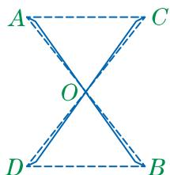

图13.3-5

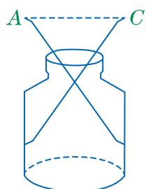

图13.3-6

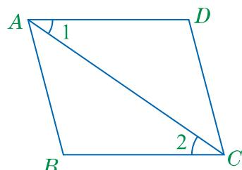

例 1 已知：如图 13.3-7， $AD \parallel BC$ ，AD = CB.
求证： $\triangle ADC \cong \triangle CBA$ .
证明：∵ AD∥BC（已知），
∴ $\angle1=\angle2$ （两直线平行，内错角相等）.
在 $\triangle ADC$ 和 $\triangle CBA$ 中， $\because\left\{\begin{aligned}AD=CB\text{(已知)},\\ \angle1=\angle2\text{(已证)},\\ AC=CA\text{(公共边)},\end{aligned}\right.$ $\therefore \triangle ADC \cong \triangle CBA (SAS).$ 

图13.3-7

## 练习

1. 判断下列各组中的两个三角形是否全等，并说明理由. 

(1) 图(1)中的 $\triangle AEC$ 与 $\triangle ADB$ ．已知条件是 $AB=AC$ ， $AD=AE$ ． 

(2) 图(2)中的 $\triangle ABC$ 与 $\triangle BAD$ . 已知条件是 $\angle BAC = \angle ABD$ , $AC = BD$ . 

（3）图(3)中的 $\triangle ABD$ 与 $\triangle ACE$ 。已知条件是 $AB = AC$ ， $AD = AE$ ， $BE = CD$ 。 

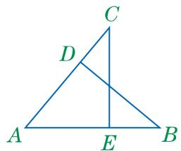

(1)

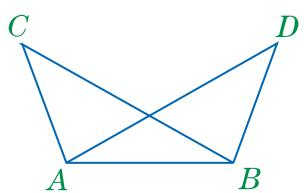

(2)

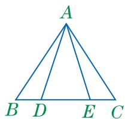

(3)

(第1题)

2. 已知：如图， $AB = AC$ ， $AD = AE$ ，BD与CE相交于点O．求证： $\angle B = \angle C$ 

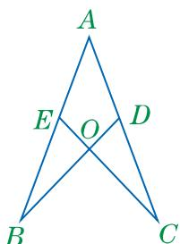

(第2题)

## 习题

## A组

1. 已知：如图，AC，BD 相交于点 O，且 AO=CO，BO=DO。求证：AB=CD。 

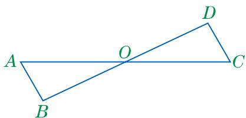

(第1题)

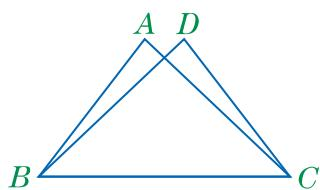

(第2题)

2. 已知：如图， $AC = DB$ ， $\angle ACB = \angle DBC.$ 求证： $\triangle ABC\cong \triangle DCB.$ 

3. 已知：如图， $AC = ED$ ， $BD = FC$ ， $AC \parallel DE$ . 求证： $AB \parallel FE$ . 

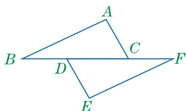

(第3题)

## B 组

4. 已知：如图， $AB = AD$ ， $AE = AC$ ， $\angle BAD = \angle CAE$ ．求证： $\angle B = \angle D$ 

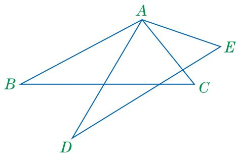

(第4题)

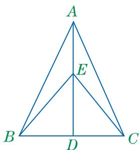

(第 5 题)

5. 已知：如图， $AB = AC$ ， $EB = EC$ ， $AE$ 的延长线交 $BC$ 于点 $D$ 。求证： $BD = CD$ . 

## C 组

6. 如图，有一个池塘，要测量池塘岸边 A, B 两点间的距离。请设计一个可行的测量方案，按照设计的方案画出图形，并说明理由。 

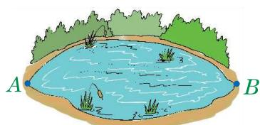

(第6题)

有两角和一边分别相等的两个三角形全等吗？ 

