## 13.3 全等三角形的判定（第四课时）
## 观察与思考

如图13.3-11，每组图形中都有两个三角形全等. 

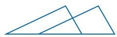

(1)

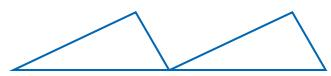

(2)

(3)

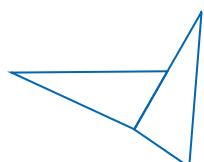

(4)

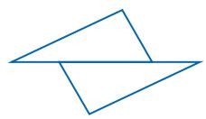

(5)

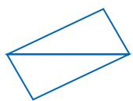

图13.3-11

（1）观察每组中两个全等的三角形，请说出其中一个三角形经过怎样的变化(平移或旋转)后，能够与另一个三角形重合. 

(2) 请再分别画出几组具有类似位置关系的两个全等的三角形. 

实际上，在我们遇到的两个全等的三角形中，有些图形具有特殊的位置关系，即其中一个三角形是由另一个三角形经过平移或旋转(有时是两种变化)得到的。发现两个三角形间的这种特殊关系，能够帮助我们找到命题证明的途径，快捷地解决问题。 

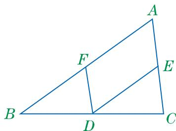

图13.3-12

例 3 已知：如图 13.3-12，在△ABC 中，D 是 BC 的中点， $DE \parallel AB$ ，交 AC 于点 E， $DF \parallel AC$ ，交 AB 于点 F.
求证： $\triangle BDF \cong \triangle DCE.$ 证明：∵ D 是 BC 的中点（已知），
∴ BD = DC （线段中点的定义）.
∵ DE∥AB, DF∥AC, （已知）
∴ $\angle B = \angle EDC$ , $\angle BDF = \angle C$ . （两直
在 $\triangle BDF$ 和 $\triangle DCE$ 中，
∵ $\left\{\begin{aligned}\angle B &= \angle EDC,\\BD &= DC,\\ \angle BDF &= \angle C,\end{aligned}\right.$ ∴ $\triangle BDF \cong \triangle DCE$ (ASA). 

观察可知，将 $\triangle BDF$ 沿 $BC$ 方向向右平移，可使 $\triangle BDF$ 与 $\triangle DCE$ 重合. 

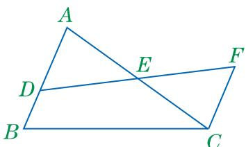

图13.3-13

例 4 已知：如图 13.3-13，在△ABC 中，D 是 AB 上任意一点，E 是 AC 的中点，CF∥AB，交 DE 的延长线于点 F.

求证：DE=FE.

证明：∵ CF∥AB（已知），

∴ ∠A=∠ECF（两直线平行，内错角在△EAD 和△ECF 中，

∵ $\left\{\begin{aligned}\angle A &= \angle ECF, \\ AE &= CE, \\ \angle AED &= \angle CEF\end{aligned}\right.$ （对顶角相等，

∴ △EAD≌△ECF（ASA）.

∴ DE=FE（全等三角形的对应边相等） 

观察可知，将 $\triangle ECF$ 绕点 $E$ 旋转 $180^{\circ}$ ，它可与 $\triangle EAD$ 重合. 

## 做一做

已知：如图13.3-14， $AB / / CD$ ， $AD / / BC$ 

求证： $AB = CD$ ， $AD = BC$ 

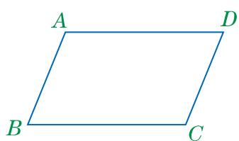

图13.3-14

## 练习

1. 已知：如图， $AC=EF$ ， $AB\parallel CD$ ，AB=CD。求证： $BE\parallel DF$ 。 

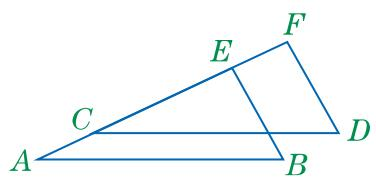

(第1题)

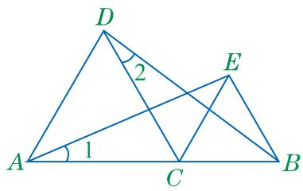

(第2题)

2. 已知：如图，AC=DC，BC=EC， $\angle ACD=\angle BCE$ . 求证： $\angle1=\angle2$ . 

## 习题

## A组

1. 已知：如图， $AB$ ， $CD$ 相交于点 $E$ ， $AD = CB$ ， $\angle D = \angle B$ ．求证： $AB = CD$ . 

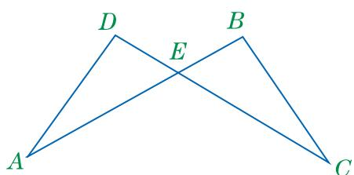

(第1题)

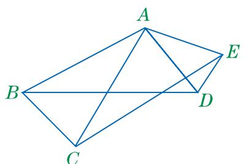

(第2题)

2. 已知：如图， $AB = AC$ ， $AD = AE$ ， $BD = CE$ 求证： $\angle BAC = \angle DAE$ 

3. 在 $\triangle ABC$ 中， $AB = AC$ 。 $P$ 是任意一点，连接 $AP$ ，再将 $AP$ 绕点 $A$ 顺时针旋转至 $AQ$ ，使 $\angle QAP = \angle BAC$ ，连接 $BQ$ ， $CP$ 。 

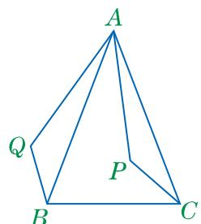

(1)

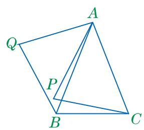

(第3题)

(2)

(1) 如图(1)，若点 $P$ 在 $\triangle ABC$ 的内部，则 $BQ$ 与 $CP$ 相等吗？若相等，请给出证明. 

(2) 如图(2)，若点 $P$ 在 $\triangle ABC$ 的外部，则 $BQ$ 与 $CP$ 相等吗？若相等，请给出证明. 

## B组

4. 已知：如图， $AD \perp BC$ ，垂足为 D，AD = BD，点 E 在 AD 上， $\angle ABD = \angle CED = 45^{\circ}$ ， $\angle ABE = \angle ACE$ 。请写出图中相等的线段，并进行证明。 

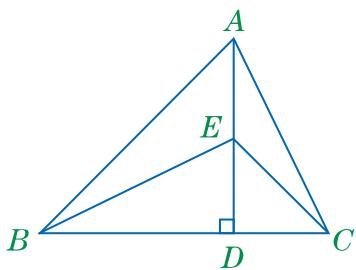

(第 4 题)

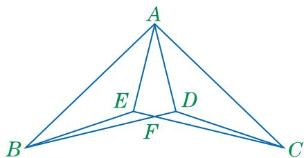

(第 5 题)

5. 已知：如图， $\triangle ABD \cong \triangle ACE$ ， $BD$ ， $CE$ 相交于点 $F$ 。请写出图中相等的线段，并进行证明。 

## C组

6. (1) 如图(1)， $\angle BAC = 90^{\circ}$ ， $AB = AC$ ，直线 $m$ 经过点 $A$ ， $BD \perp m$ ， $CE \perp m$ ，垂足分别为 $D$ ， $E$ 。猜想 $DE$ ， $BD$ ， $CE$ 之间有怎样的数量关系，并进行证明。 

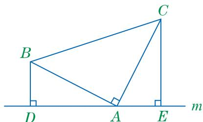

(1)

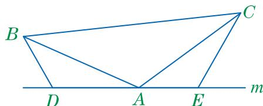

(第6题)

(2)

(2) 如图(2)，若将(1)中的条件改为 “AB=AC, D, A, E 三点都在直线 m 上，且 $\angle BDA = \angle CEA = \angle BAC = \alpha$ (其中， $\alpha$ 为任意锐角或钝角)”，则上述数量关系还成立吗？如果成立，请给出证明；如果不成立，请说明理由. 

读一读
