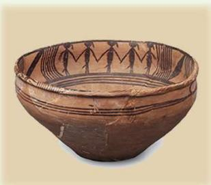
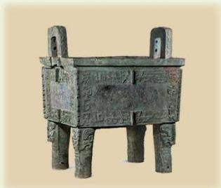
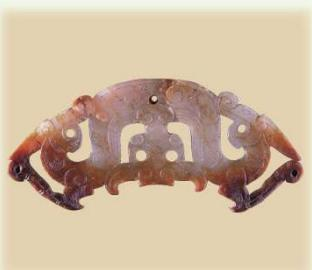
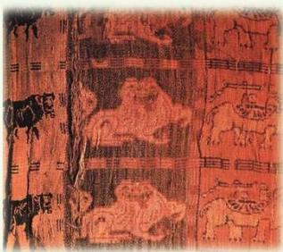

## 历史悠久的几何学

几何学是一门古老而实用的科学，是自然科学的重要组成部分，它和算术一样产生于实践。在远古时代，人们在实践中形成了十分丰富的几何概念，如平面、直线、方、圆、长、短等，这些都成了几何学的基本概念。古代中国、古巴比伦、古埃及、古印度、古希腊都是几何学的重要发源地。 

大量出土文物表明，很早以前，我国劳动人民就已经掌握了几何学的基本知识，并将其广泛应用于生产生活实际，如一些陶器、青铜器、玉器、丝织品等，上面都有设计精巧的图案。文物中的几何元素，不仅体现了我国古人的数学智慧，也反映了他们对几何美学的深刻理解与熟练应用。这些瑰宝是中华民族的骄傲，印证了我国在几何学领域的重要历史贡献，为世界几何学发展史书写了璀璨的篇章。 

新石器时代
舞蹈纹彩陶盆

商
后母戊鼎

战国玉透雕双夔龙纹佩

北朝方格兽纹锦
