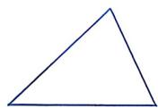
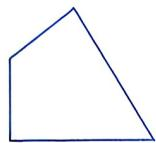
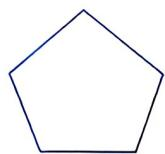
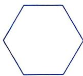
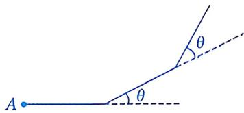
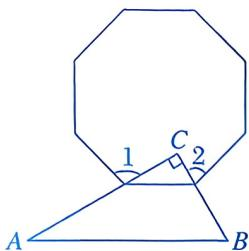
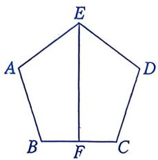
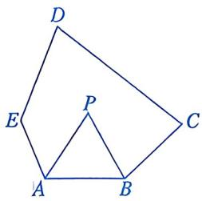

# 21.1 多边形(二)

# 知识点拨

1. $n$ 边形的内角和等于 $(n - 2) \times 180^{\circ} (n \geqslant 3)$ . 

2. 多边形的外角和等于 $360^{\circ}$ . 

# 夯实基础

# 1. 选择题.

(1)下列多边形中，内角和为 $540^{\circ}$ 的是（） 

A

B

C

D

(2)若一个多边形的内角和为 $900^{\circ}$ , 则这个多边形是 ( ) 

A. 五边形 

B. 六边形 

C. 七边形 

D. 八边形 

(3)七边形的外角和为 ( ) 

A. ${180}^{ \circ  }$ 

B. $360^{\circ}$ 

C. ${900}^{ \circ  }$ 

D. $1260^{\circ}$ 

(4)若一个 n 边形的每个外角都是 $36^{\circ}$ ，则 n 的值为（） 

A. 7 

B. 8 

C. 9 

D. 10 

(5)若将一个 $n$ 边形变成 $n + 2$ 边形，则其内角和将 （） 

A. 减少 ${180}^{ \circ  }$ 

B. 增加 $180^{\circ}$ 

C. 减少 $360^{\circ}$ 

D. 增加 $360^{\circ}$ 

(6)若一个多边形的内角和是其外角和的5倍，则这个多边形的边数是（） 

A. 12 

B. 13 

C. 14 

D. 15 

(7)从一个 n 边形的某个顶点出发，分别连接这个顶点与其余各顶点，将此多边形分割成了 6 个三角形，则 n 的值为（） 

A. 6 

B. 7 

C. 8 

D. 9 

(8)如图, 小磊从点 $A$ 处出发, 沿直线前进 $5 \mathrm{~m}$ 后向左转 $\theta$ , 接着沿直线前进 $5 \mathrm{~m}$ 后, 再向左转 $\theta \cdots \cdots$ 如此下去, 当他第一次回到点 $A$ 处时, 发现自己走了 $60 \mathrm{~m}$ , 则 $\theta$ 的度数为 ( ) 

第 1(8)题

A. $28^{\circ}$ 

B. $30^{\circ}$ 

C. $33^{\circ}$ 

D. $36^{\circ}$ 

# 2. 填空题.

(1)六边形的内角和为____。 

(2)若七边形的内角中有一个角的度数为 $100^{\circ}$ , 则其余六个内角的度数之和为 

(3)有一个五边形，它的四个外角分别为 $111^{\circ}$ ， $80^{\circ}$ ， $30^{\circ}$ ， $129^{\circ}$ ，则与第五个外角相邻的内角的度数为____。 

(4)如图, 含 $30^{\circ}$ 的直角三角板的直角边 $AC$ , $BC$ 分别经过正八边形的两个顶点, 则 $\angle 1 + \angle 2 =$ ____. 

第 2(4) 题

# 数学思考

3. 若一个多边形的每个内角都比它相邻外角的 4 倍多 $30^{\circ}$ , 求这个多边形的内角和及其对角线的总条数. 

4. 已知：如图，五边形 $ABCDE$ 的内角都相等， $EF$ 平分 $\angle AED$ 。求证： $EF \perp BC$ . 

第4题

5. 如图, 在五边形 $ABCDE$ 中, $\angle C = 100^{\circ}$ , $\angle D = 75^{\circ}$ , $\angle E = 135^{\circ}$ , $AP$ 平分 $\angle EAB$ , $BP$ 平分 $\angle ABC$ . 求 $\angle P$ 的度数. 

第5题

# 解决问题

6. 在一个多边形中，某个内角的外角与这个内角之外的所有其他内角的和为 $600^{\circ}$ . 

(1)若这个多边形是五边形，求这个外角的度数. 

(2)除五边形外，是否还存在其他符合题意的多边形？若存在，请求出多边形的边数及这个外角的度数；若不存在，请说明理由. 

