# 21.2 平行四边形的性质(二)

# 知识点拨

平行四边形的性质定理：平行四边形的对角线互相平分. 

# 夯实基础

# 1. 选择题.

(1)证明：平行四边形的对角线互相平分. 

已知：如图，四边形 ABCD 是平行四边形，对角线 AC，BD 相交于点 O．求证：OA=OC，OB=OD. 

以下是打乱顺序的证明过程，那么正确的顺序应是 （） 

① $\therefore \angle {ABO} = \angle {CDO},\angle {BAO} = \angle {DCO}$ ; 

②∵四边形 ABCD 是平行四边形； 

③∴AB//CD，AB=CD； 

④∴△AOB≌△COD; 

⑤∴OA=OC，OB=OD. 
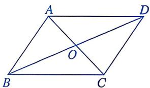
第 1(1) 题

A. ②①③④⑤ 

B. ②③⑤①④ 

C. ②③①④⑤ 

D. ③②①④⑤ 

(2)如图， $\square ABCD$ 的对角线 $AC, BD$ 相交于点 $O$ 。若 $AC + BD = 20, CD = 7$ ，则 $\triangle ABO$ 的周长为 （） 
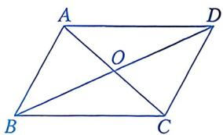
第1(2)题

A. 16 

B. 17 

C. 20 

D. 27 

(3)如图， $\square ABCD$ 的对角线 $AC, BD$ 相交于点 $O$ . 若 $AC = 6, BD = 8$ , 则 $AB$ 的长可能为 ( ) 
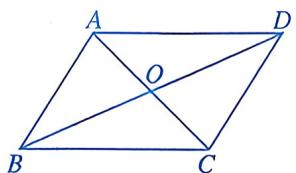
第1(3)题

A. 10 

B. 8 

C. 7 

D. 6 

(4)如图, 四边形 $ABCD$ 是平行四边形. 下列结论中, 不正确的是 ( ) 
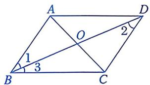
第1(4)题

A. $\angle 1 = \angle 2$ 

B. ${OA} = {OC}$ 

C. ${AB} = {CD}$ 

D. $\angle 1 = \angle 3$ 

(5)如图，□ABCD的对角线AC，BD相交于点O，AE⊥BD于点E，CF⊥BD于点F，则图中全等三角形共有（） 
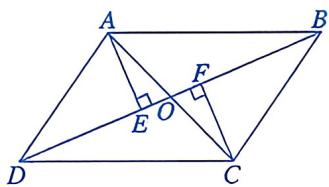
第1(5)题

A. 7 对 

B. 6 对 

C. 5 对 

D. 4 对 

(6)如图, 在 $\square ABCD$ 中, $AB \perp AC$ . 若 $AB = 8$ , $AC = 12$ , 则 $BD$ 的长为 ( ) 
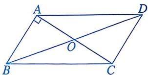
第 1(6)题

A. 22 

B. 16 

C. 18 

D. 20 

(7)如图, 在周长为 $26 \mathrm{~cm}$ 的 $\square ABCD$ 中, $AB \neq AD$ , 对角线 $AC$ , $BD$ 相交于点 $O$ , $OE \perp BD$ 交 $AD$ 于点 $E$ , 则 $\triangle ABE$ 的周长为 ( ) 
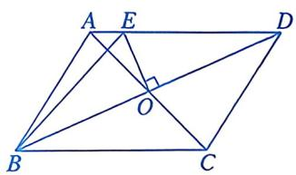
第 1(7) 题

A. $4 \mathrm{~cm}$ 

B. $6 \mathrm{~cm}$ 

C. $8 \mathrm{~cm}$ 

D. $13 \mathrm{~cm}$ 

(8)如图, 在 $\square ABCD$ 中, 对角线 $AC$ , $BD$ 相交于点 $O$ , $EF$ 过点 $O$ , 交 $AD$ 于点 $E$ , 交 $BC$ 于点 $F$ . 若 $AB = 3$ , $AC = 4$ , $\angle BAC = 90^{\circ}$ , 则图中阴影部分的面积为 ( ) 
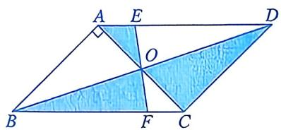
第1(8)题

A. 1.5 B. 3 

C. 6 D. 4 

2. 填空题. 

(1)如图, $\square ABCD$ 的周长为 $60 \mathrm{~cm}$ , 对角线 $AC$ , $BD$ 相交于点 $O$ , $\triangle BOC$ 的周长比 $\triangle AOB$ 的周长小 $8 \mathrm{~cm}$ , 则 $AB$ , $BC$ 的长分别为 ____ cm, ____ cm. 
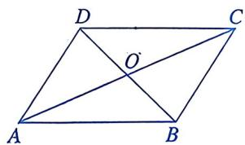
第2(1)题

(2)如图, 在 $\square ABCD$ 中, 对角线 $AC$ , $BD$ 相交于点 $O$ . 若 $\triangle ABO$ 的面积是 4 , 则 $\square ABCD$ 的面积为 
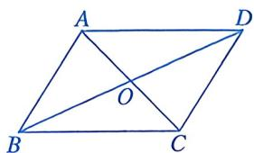
第2(2)题

(3)如图, 在 $\square ABCD$ 中, $AB = 10$ , $AD = 6$ , $AC \perp BC$ , 则 $BD = \_$ . 
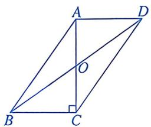
第2(3)题

(4)如图, 在 $\square ABCD$ 中, $O$ 是 $BD$ 的中点, $EF$ 过点 $O$ . 下列结论中, 正确结论的个数为 ____. 

① ${AB}//{DC}$ ； 

②EO=ED; 

③ $\angle A=\angle C;$ 

④ $S_{四边形ABOE}=S_{四边形CDOF}.$ 
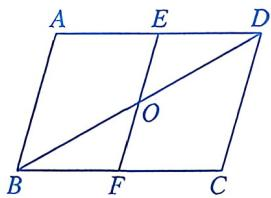
第2(4)题

# 数学思考

3. 如图，在□ABCD中，对角线AC，BD相交于点O，分别过点A，C作AE⊥BD，CF⊥BD，垂足分别为E，F，AC平分∠DAE. 

(1) 若 $\angle AOE = 50^{\circ}$ , 则 $\angle ACB$ 的度数为 ____. 

(2)求证：AE=CF. 
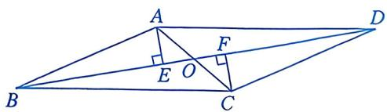
第3题

# 解决问题

5. (1)如图①, 四边形 $ABCD$ 是平行四边形, $AC$ 是对角线. 求作 $AC$ 的垂直平分线, 交 $DC$ 于点 $E$ , 交 $AB$ 于点 $F$ , 垂足为 $O$ . (用尺规作图, 保留作图痕迹, 不要求写出作法) 
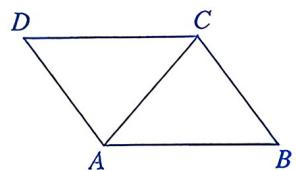
①
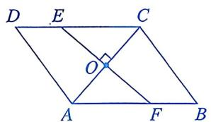
②

第5题

4. 如图，在□ABCD中，对角线AC，BD相交于点O，AE⊥BC，垂足为E， $AB=\sqrt{3}$ ，AC=2，BD=4。求AE的长。 
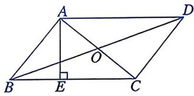
第4题

(2)已知：如图②，四边形ABCD是平行四边形，AC是对角线，EF垂直平分AC，垂足为O．求证：OE=OF. 

(3)补全命题：过平行四边形对角线中点的直线 

