# 21.3 平行四边形的判定(一)

# 知识点拨

平行四边形的判定方法： 

(1)两组对边分别平行的四边形是平行四边形. 

(2)一组对边平行且相等的四边形是平行四边形. 

# 夯实基础

# 1. 选择题.

(1)如图, 根据图中所给条件可判定四边形 $ABCD$ 是平行四边形, 依据是 ( ) 
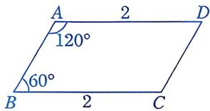
第1(1)题

A. 两组对边分别平行的四边形是平行四边形 

B. 对角线互相平分的四边形是平行四边形 

C. 一组对边相等、另一组对边平行的四边形是平行四边形 

D. 一组对边平行且相等的四边形是平行四边形 

(2)如图, 在四边形 $ABCD$ 中, $AB \parallel CD$ . 要使四边形 $ABCD$ 是平行四边形, 下列要添加的条件中不正确的是 ( ) 
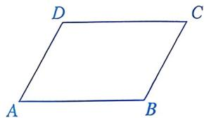
第1(2)题

A. ${AB} = {CD}$ 

B. ${BC} = {AD}$ 

C. $\angle A = \angle C$ 

D. $BC \parallel AD$ 

(3)如图, 在四边形 $ABCD$ 中, $AD \parallel BC$ , $AD = BC$ . 下列结论中, 不正确的是 ( ) 
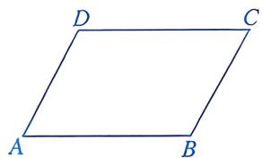
第1(3)题

A. ${AB} = {CD}$ 

B. $AB \parallel CD$ 

C. $\angle A = \angle C$ 

D. $\angle A + \angle C = 180^{\circ}$ 

(4)如图，在□ABCD中，点E，F分别在BC，AD上．要使四边形AFCE是平行四边形，需要添加一个条件，这个条件可以是 （） 

① $AF = CE$ ；② $AE = CF$ ；③ $\angle BAE = \angle FCD$ ；④ $\angle BEA = \angle FCE$ . 
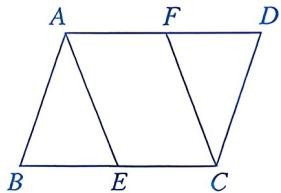
第1(4)题

A. ①或② 

B. ①或④ 

C. ③或④ 

D. ①或③或④ 

(5)下列 $\angle A: \angle B: \angle C: \angle D$ 的值中, 能判定四边形 $ABCD$ 是平行四边形的是 ( ) 

A. $1: 2: 1: 2$ 

B. $1: 4: 2: 3$ 

C. $1: 2: 2: 1$ 

D. $3: 2: 3: 3$ 

(6)如图， $a \parallel b$ ， $AB \parallel CD$ ， $CE \perp b$ ， $FG \perp b$ ， $E$ ， $G$ 为垂足．下列说法中，不正确的是 （） 
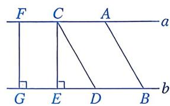
第1(6)题

A. ${AB} = {CD}$ 

B. $EC = GF$ 

C. $A, B$ 两点之间的距离就是线段 $AB$ 的长度 

D. $a$ 与 $b$ 之间的距离就是线段 $CD$ 的长度 

(7)如图，在 $\triangle ABC$ 中， $AB=AC=8$ ，点 $E$ ， $F$ ， $G$ 分别在边 $AB$ ， $BC$ ， $AC$ 上， $EF//AC$ ， $GF//AB$ ，则四边形AEFG的周长为 （） 
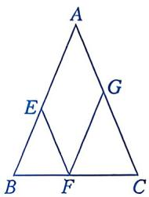
第 1(7) 题

A. 16 B. 24 C. 32 D. 36 

(8)如图, $CE$ 垂直平分 $AF$ , $AB \parallel CD$ , $BC \parallel DF$ . 从点 $B$ 到点 $E$ 有两条路线: 路线 1 是 $B \rightarrow D \rightarrow A \rightarrow E$ , 路线 2 是 $B \rightarrow C \rightarrow F \rightarrow E$ . 这两条路线的长度关系为 ( ) 
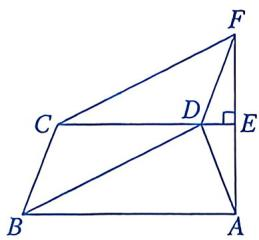
第1(8)题

A. 路线 1 较短 

B. 路线 2 较短 

C. 相等 

D. 不确定 

2. 填空题. 

(1)如图, 在四边形 $ABCD$ 中, $AB = CD$ . 若添加一个条件, 使四边形 $ABCD$ 是 

平行四边形，则这个条件可以是____。 
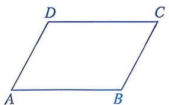
第 2(1) 题

(2)如图, 若 $\angle 1 = \angle 2$ , $AD = BC$ , 则四边形 $ABCD$ 是____四边形, 判定的依据是____; 若 $\angle 1 = \angle 2$ , $\angle 3 = \angle 4$ , 则判定四边形 $ABCD$ 形状的依据是____. 
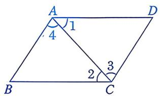
第2(2)题

(3)如图, 在 $\square ABCD$ 中, 点 $E$ , $F$ 分别在 $BC$ , $AD$ 上, 且 $FD = BE$ . 若 $\angle FAE = 60^{\circ}$ , 则 $\angle FCE$ 的度数为 
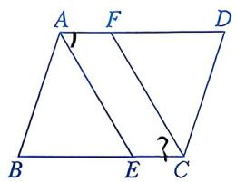
第2(3)题

(4)如图, 在四边形 $ABCD$ 中, $AB \parallel DC$ , $AD=BC=6$ , $DC=9$ , $AB=15$ , 点 $P$ 从点 $A$ 出发, 以每秒 2 个单位长度的速度沿 $AD \rightarrow DC$ 向终点 $C$ 运动, 同时点 $Q$ 从点 $B$ 出发, 以每秒 1 个单位长度的速度沿 $BA$ 向终点 $A$ 运动. 当有一点到达终点时, 点 $P$ , $Q$ 就停止运动. 当运动时间为 $\mathrm{~s}$ 时, 四边形 $PQBC$ 是平行四边形. 
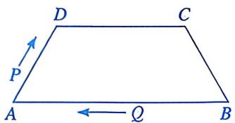
第 2(4) 题

# 数学思考

3. 已知：点 $E, F$ 分别在 $\square ABCD$ 的边 $BC, AD$ 上， $BE = \frac{1}{3} BC, DF = \frac{1}{3} AD$ 连接 $BF, DE$ 。求证：四边形 $BEDF$ 是平行四边形。 

$$
\left. \begin{array}{l} {B E = F D} \\ {B E / / F D} \end{array} \right\} \square
$$
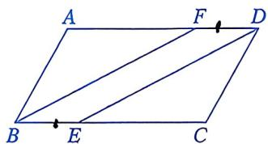
第3题

# 解决问题

4. 如图，在四边形 $ABCD$ 中， $AB \parallel CD$ ，点 $E$ 在边 $AB$ 上，____。请先从下列两个条件中任选一个作为已知条件，填在横线上(填序号)，再回答下列问题： 

① $\angle B=\angle AED$ ; ②AE=BE, AE=CD. 

(1)求证：四边形 ${BCDE}$ 是平行四边形. 

(2) 若 $AD \perp AB, AD = 8, BC = 10$ , 求线段 $AE$ 的长. 

① BE//CD
DE//BC 

② $BE \parallel CD$ $BF = CD$ 
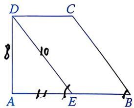
第4题

$$
A D = 8, D E = B C = 1 0
$$

$$
P _ {t \Delta A E D} \text {   中   } A E = 6
$$

