# 21.3 平行四边形的判定(二)

# 知识点拨

平行四边形的判定方法： 

(1)两组对边分别相等的四边形是平行四边形. 

(2)两条对角线互相平分的四边形是平行四边形. 

# 夯实基础

1. 选择题. 

(1)现有长为 $5 \, cm$ ， $5 \, cm$ ， $7 \, cm$ 的三根木条。若想将它们钉成一个平行四边形木框，则第四根木条的长应为（） 

A. $5 \mathrm{~cm}$ 

B. $7 \mathrm{~cm}$ 

C. $2 \mathrm{~cm}$ 

D. ${12}\mathrm{\;{cm}}$ 

(2)如图, 在四边形 $ABCD$ 中, $AB \parallel CD$ . 若添加一个条件, 使四边形 $ABCD$ 成为平行四边形, 则下列条件中正确的是 ( ) 
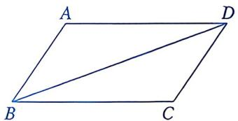
第1(2)题

A. ${AD} = {BC}$ 

B. $\angle {ABD} = \angle {BDC}$ 

C. ${AB} = {AD}$ 

D. $\angle A = \angle C$ 

(3)已知四边形ABCD的对角线AC，BD相交于点O．下列四组条件中，能判定四边形ABCD为平行四边形的是（） 

A. ${AD}//{BC}$ 

B. $OA = OC, OB = OD$ 

C. $AD \parallel BC, AB = DC$ 

D. $AC \perp BD$ 

(4) 在 $\square ABCD$ 中, $AD > AB$ . 现有甲、乙两种方案, 其中能使四边形 $ANCM$ 为平行四边形的是 ( ) 
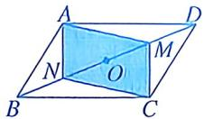
甲：如图，取 $BD$ 的中点 $O$ ，作 $BN = NO$ $OM = MD.$ 
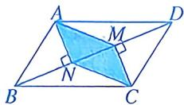
乙: 如图, 作 $AN \perp BD$ 于点 $N$ , $CM \perp BD$ 于点 $M$ . 

第1(4)题 

A. 甲 

B. 乙 

C. 甲、乙都可以 

D. 甲、乙都不可以 

(5)在如图所示的 4 个四边形中, 能根据图中标出的条件判定四边形 $ABCD$ 是平行四边形的有 ( ) 
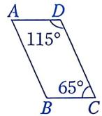
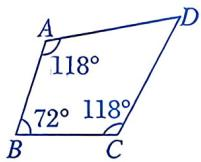
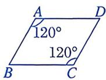
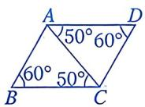
第1(5)题

A. 1个 B. 2个 C. 3个 D. 4个 

(6)如图, $A$ 是直线 $l$ 外一点, 在 $l$ 上取两点 $B$ , $C$ , 分别以点 $A$ , $C$ 为圆心, 以 $BC$ , $AB$ . 长为半径画弧, 两弧交于点 $D$ , 连接 $AB$ , $AD$ , $CD$ . 下列判定四边形 $ABCD$ 是平行四边形的依据中, 正确的是 ( ) 
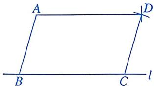
第1(6)题

A. 两组对边分别平行的四边形是平行四边形 

B. 对角线互相平分的四边形是平行四边形 

C. 两组对边分别相等的四边形是平行四边形 

D. 一组对边平行且相等的四边形是平行四边形 

(7)如图, 在四边形 $ABCD$ 中, 对角线 $AC$ , $BD$ 相交于点 $O$ . 从下列四个条件中,任选两个, 可得出 “四边形 $ABCD$ 是平行四边形” 这一结论的选法有 ( ) 

① $AB \parallel CD$ ; ②OA=OC; ③AD=BC;
④ $\angle BAD = \angle BCD$ . 
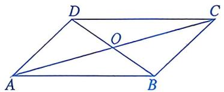
第1(7)题

A. 5种 

B. 4 种 

C. 3 种 

D. 2 种 

(8)下面是嘉嘉作业本上的一道习题及其解答过程： 

已知：如图，在 $\triangle ABC$ 中， $AB = AC$ ， $AE$ 平分 $\triangle ABC$ 的外角 $\angle CAN$ $M$ 为 $AC$ 的中点，连接BM并延长交 $AE$ 于点 $D$ ，连接CD. 
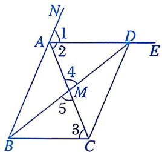
第1(8)题

求证：四边形 ABCD 是平行四边形. 

证明：∵AB=AC, 

$$
\therefore \angle A B C = \angle 3.
$$

$$
\begin{array}{r l} & \because \angle C A N = \angle A B C + \angle 3, \angle C A N = \angle 1 + \\ & \angle 2, \angle 1 = \angle 2, \end{array}
$$

$$
\therefore \underline {{\quad}} ①.
$$

又∵∠4=∠5，MA=MC， 

$$
\therefore \triangle M A D \cong \triangle M C B (\_ \_ \_ \_ ②).
$$

$$
\therefore M D = M B.
$$

∴四边形 ABCD 是平行四边形. 

若解答过程是正确的，则①，②应分别为（） 

A. $\angle 1 = \angle 3$ ，AAS 

B. $\angle 1 = \angle 3$ , ASA 

C. $\angle 2 = \angle 3$ , AAS 

D. $\angle 2 = \angle 3$ , ASA 

# 2. 填空题.

(1)如图, 在四边形 $ABCD$ 中, $AC$ 与 $BD$ 相交于点 $O$ . 若 $AC = 10$ , $BD = 6$ , 则当 $AO = \_\_\_\_ , DO = \_\_\_\_$ 时, 四边形 $ABCD$ 是平行四边形. 
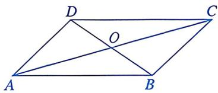
第2(1)题

(2)阅读以下作图步骤: 

①任意画两条相交直线 m, n，它们相交于点 O； 

②以点 O 为对称中心，分别在直线 m，n 上截取 OB 与 OD，OA 与 OC，使 OB = OD，OA = OC； 

③顺次连接所得的四点，得到四边形ABCD. 

根据以上作图过程，可以判定四边形 ABCD 的形状是 ____. 
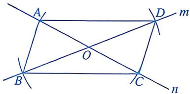
第2(2)题

(3)小敏不慎将一块平行四边形玻璃摔成如图所示的四块，为了能在商店配到一块与原来相同的平行四边形玻璃，她带来了两块碎玻璃，其编号应该是____。 
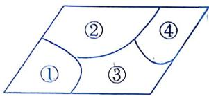
第2(3)题

(4)如图, 在四边形 $ABCD$ 中, 对角线 $AC$ , $BD$ 相交于点 $O$ , $\angle CBD = 90^\circ$ , $BC = 4$ , $OB = OD = 3$ , $AC = 10$ , 则四边形 $ABCD$ 的面积为 ____. 
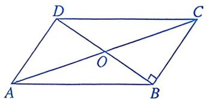
第2(4)题

# 数学思考

3. 如图，在 $4 \times 4$ 的方格纸中， $\triangle ABC$ 的三个顶点都在格点上. 

(1)画出□ABEC，其中点E在格点上. 

(2)请用平行四边形的判定方法说明画图的合理性. 
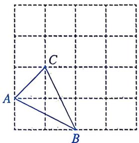
第3题

4. 如图, ${AB}$ , ${CD}$ 相交于点 $O$ , ${AC}//{DB}$ , ${OA} = {OB}$ , $E$ , $F$ 分别为 ${OC}$ , ${OD}$ 的中点. 

(1)求证：OC=OD.△AOC≌△BOD(ASA) 

(2)求证: 四边形 $AFBE$ 是平行四边形. 

$$
\left. \begin{array}{l} {O A = O B} \\ {O F = O F} \end{array} \right\}
$$
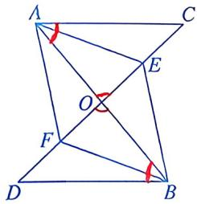
第4题

# 解决问题

5. 如图， $\square ABCD$ 的对角线 $AC, BD$ 相交于点 $O$ ，点 $E, F$ 在对角线 $BD$ 上，且 $BE = EF = FD$ ，连接 $AE, EC, CF, FA$ . 

(1)求证: 四边形 $AECF$ 是平行四边形. 

(2)若 $\triangle ABE$ 的面积为2，求 $\triangle CFO$ 的面积. 

$$
\left. \begin{array}{l} {(1) O A = 0 C} \\ {O E = O F} \end{array} \right\}
$$
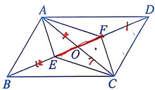
第5题

