# 21.4 三角形的中位线

# 知识点拨

1. 连接三角形两边中点的线段，叫作三角形的中位线。一个三角形有三条中位线。 

2. 三角形的中位线定理：三角形的中位线平行于第三边，并且等于第三边的一半. 

# 夯实基础

# 1. 选择题.

(1)如图, 在 $\triangle ABC$ 中, $AB = 8 \mathrm{~cm}$ , $AC = 10 \mathrm{~cm}$ , $AD = 4 \mathrm{~cm}$ , $CE = 5 \mathrm{~cm}$ . 下列线段中, 是 $\triangle ABC$ 的中位线的是 ( ) 
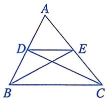
第1(1)题

A. 线段 $CD$ 

B. 线段 $BE$ 

C. 线段 ${DE}$ 

D. 线段 $AE$ 

(2)如图, 在 $\triangle ABC$ 中, $D$ , $E$ 分别是 $AB$ , $AC$ 的中点. 下列说法中, 正确的是 ( ) 
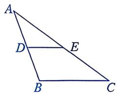
第1(2)题

A. $CE = BC$ 

B. $DE = \frac{1}{2} AB$ 

C. $\angle {AED} = \angle C$ 

D. $\angle A = \angle C$ 

(3)如图， $\triangle ABC$ 的三边长分别为 $a$ ， $b, c$ ，它的三条中位线组成一个新三角形， 

这个新三角形的三条中位线又组成一个小三角形，那么这个小三角形的周长为（） 
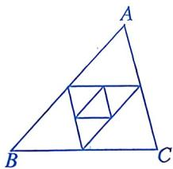
第1(3)题

A. $\frac{1}{2} (a + b + c)$ 

B. $\frac{1}{4} (a + b + c)$ 

C. $\frac{1}{3} (a + b + c)$ 

D. $a + b + c$ 

(4)如图， $M$ ， $N$ 分别是 $\triangle ABC$ 的边 $AB$ ， $AC$ 的中点．若 $\angle A = 65^{\circ}$ ， $\angle ANM =$ $45^{\circ}$ ，则 $\angle B$ 的度数为 （） 
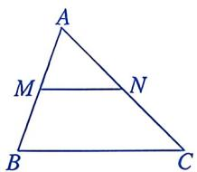
第1(4)题

A. ${20}^{ \circ  }$ 

B. ${45}^{ \circ  }$ 

C. $65^{\circ}$ 

D. ${70}^{ \circ  }$ 

(5)如图, 在 $\triangle ABC$ 中, $D$ , $E$ 分别是 $AB$ , $BC$ 的中点, 点 $F$ 在 $DE$ 的延长线上. 若添加一个条件, 使四边形 $ADFC$ 是平行四边形, 则这个条件可以是 ( ) 
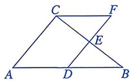
第1(5)题

A. $\angle B = \angle F$ 

B. $\angle B = \angle B C F$ 

C. $AC = CF$ 

D. ${AD} = {CF}$ 

(6)如图, 在 $\triangle ABC$ 中, $AB = 6$ , $AC = 10$ , $D$ , $E$ , $F$ 分别是 $AB$ , $BC$ , $AC$ 的中点, 则四边形 $ADEF$ 的周长为 ( ) 
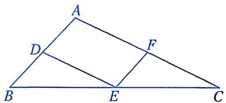
第1(6)题

A. 8 

B. 10 

C. 12 

D. 16 

(7)如图，D，E，F分别为 $\triangle ABC(AB>AC)$ 各边的中点．下列说法中，不正确的是() 
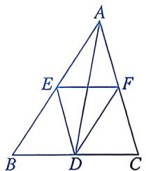
第1(7)题

A. $EF = \frac{1}{2} BC$ 

B. $EF$ 与 $AD$ 互相平分 

C. ${AD}$ 平分 $\angle {BAC}$ 

D. 四边形 AEDF 是平行四边形 

(8)如图, 在 $\triangle ABC$ 中, $BC = 20$ , $D$ , $E$ 分别为 $AB$ , $AC$ 的中点, $F$ 是 $DE$ 上一点, $DF = 4$ , 连接 $AF$ , $CF$ . 若 $\angle AFC = 90^{\circ}$ , 则 $AC$ 的长为 ( ) 
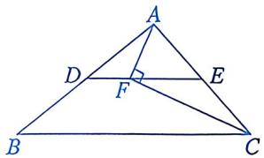
第1(8)题

A. 10 

B. 12 

C. 13 

D. 20 

2. 填空题. 

(1)如图，A，B两点被池塘隔开，在池塘外选一点C，连接AC，BC，取AC，BC的中点D，E，量出DE=a，则AB=2a。这样测量的依据是 
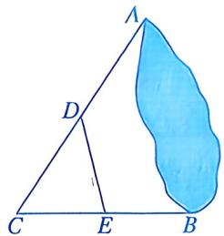
第2(1)题

(2)如图, $\square ABCD$ 的对角线 $AC$ , $BD$ 相交于点 $O$ , $E$ 为 $AB$ 的中点. 若 $\triangle BEO$ 的周长为 8 , 则 $\triangle BCD$ 的周长为 
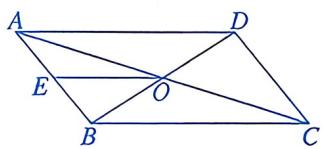
第2(2)题

(3)如图, 在 $\triangle ABC$ 中, $M$ , $N$ 分别为 $AB$ , $AC$ 的中点, 连接 $MN$ , $E$ 为 $CN$ 的中点, 连接 $ME$ 并延长交 $BC$ 的延长线于点 $D$ . 若 $BC = 4$ , 则 $CD$ 的长为 ____. 
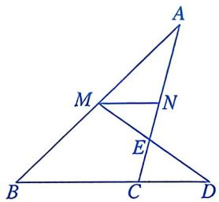
第2(3)题

(4)如图，在四边形ABCD中，P为对角线BD的中点，E，F分别为AB，CD的中点，AD=BC， $\angle EPF=147^{\circ}$ ，则 $\angle PFE$ 的度数为____。 
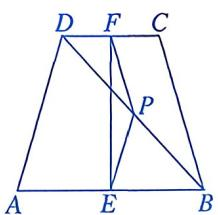
第2(4)题

# 数学思考

3. 如图，在 $\triangle ABC$ 中， $D, E$ 分别为 $AB, AC$ 的中点，点 $H$ 在线段 $CE$ 上，连接 $BH, G, F$ 分别为 $BH, CH$ 的中点. 

(1) 求证: 四边形 $DEFG$ 是平行四边形. 

(2) 若 $DG \perp BH, BD = 3, EF = 2$ ，求线段 $BG$ 的长. 
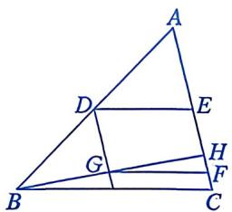
第3题

# 解决问题

4. 在 $\triangle ABC$ 中， $M$ 为边 $BC$ 的中点， $AB=12$ ， $AC=18$ ， $BD\perp AD$ 于点 $D$ ，连接 $DM$ . 

(1)如图①，若 $AD$ 为 $\angle BAC$ 的平分线，求 $MD$ 的长. 

(2)如图②，若 $AD$ 为 $\angle BAC$ 外角的平分线，求 $MD$ 的长. 
| | |
|:---:|:---:|
| 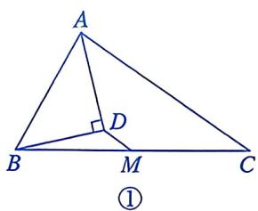 | 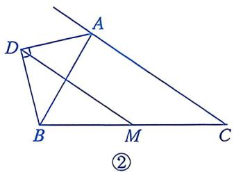 |
第4题

