# 21.5 矩形(一)

# 知识点拨

1. 有一个角是直角的平行四边形叫作矩形. 

2. 矩形既是中心对称图形，也是轴对称图形. 

3. 矩形的性质定理：矩形的四个角都是直角；矩形的两条对角线相等. 

# 夯实基础

1. 选择题. 

(1)矩形具有的性质是 ( ) 

A. 四条边相等 

B. 四个角相等 

C. 两条对角线互相垂直 

D. 每一条对角线平分一组对角 

(2)如图, 现有一张矩形纸片 $ABCD$ . 若沿虚线剪去 $\angle C$ , 则 $\angle 1 + \angle 2$ 的度数为 ( ) 
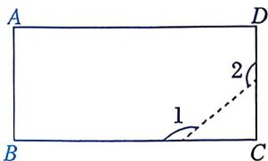
第 1(2) 题

A. ${180}^{ \circ  }$ 

B. $240^{\circ}$ 

C. $270^{\circ}$ 

D. ${330}^{ \circ  }$ 

(3)矩形具有而一般平行四边形不一定具有的性质是 （） 

A. 对边相等 

B. 对角相等 

C. 两条对角线相等 

D. 两条对角线互相平分 

(4)如图, 矩形 $ABCD$ 的两条对角线相交于点 $O$ . 若 $AC = 4$ , 则 $OB$ 的长为 ( ) 
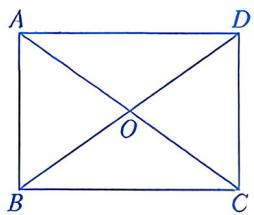
第 1(4) 题

A. 8 B. 4 C. 3 D. 2 

(5) 如图, 在矩形 $ABCD$ 中, $AB < BC$ , 对角线 $AC$ , $BD$ 相交于点 $O$ , 则图中等腰三角形的个数是 ( ) 
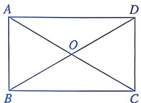
第1(5)题

A. 4 B. 3 C. 2 D. 1 

(6)如图, 在矩形 $ABCD$ 中, 对角线 $AC$ , $BD$ 相交于点 $O$ , $E$ , $F$ 分别为 $AO$ , $AD$ 的中点, 连接 $EF$ . 若 $AB = 6 \mathrm{~cm}$ , $BC = 8 \mathrm{~cm}$ , 则 $EF$ 的长为 ( ) 
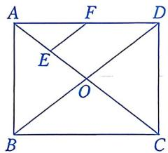
第1(6)题

A. $2.2 \mathrm{~cm}$ B. $2.3 \mathrm{~cm}$ 

C. $2.4 \mathrm{~cm}$ D. $2.5 \mathrm{~cm}$ 

(7)如图, 在矩形 $ABCD$ 中, 点 $E$ 在 $AD$ 上. 当 $\triangle EBC$ 是等边三角形时, $\angle ABE$ 的度数为 ( ) 
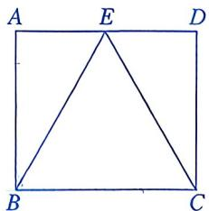
第1(7)题

A. $30^{\circ}$ B. $45^{\circ}$ C. $60^{\circ}$ D. $75^{\circ}$ 

(8)如图, 在矩形 $ABCD$ 中, $AB = 4$ , $AD = 5$ , $E$ 为 $AB$ 的中点, 点 $F$ , $G$ 分别在 $CD$ , $AD$ 上, $\triangle EFG$ 为等腰直角三角形, 且 $\angle EGF = 90^{\circ}$ , 则四边形 $BCFE$ 的面积为 ( ) 
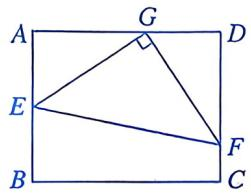
第1(8)题

A. 10 

B. 9 

C. $\frac{35}{4}$ 

D. $\frac{15}{2}$ 

# 2. 填空题.

(1)如图, 矩形 $ABCD$ 的对角线 $AC$ , $BD$ 相交于点 $O$ , 点 $E$ 在 $BD$ 的延长线上. 若 $\angle BOC = 110^{\circ}$ , 则 $\angle ADE$ 的度数为 ____. 
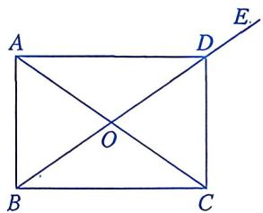
第2(1)题

(2)如图, 矩形 $ABCD$ 的对角线 $AC$ , $BD$ 相交于点 $O$ , $E$ 为 $BC$ 的中点, $\angle OCB = 30^{\circ}$ . 若 $OE = 2$ , 则对角线 $BD$ 的长为 ____. 
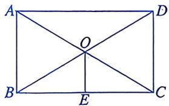
第2(2)题

(3)如图，O 为矩形 ABCD 的对角线 AC 的中点，M 为 AD 的中点。若 AB=3，BC=4，则四边形 ABOM 的周长为 ____。 
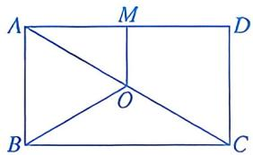
第 2(3) 题

(4)如图, 将矩形纸片 $ABCD$ 沿着直线 $BE$ 折叠, 使点 $A$ 落在对角线 $BD$ 上的点 $A'$ 处. 若 $\angle DBC = 24^{\circ}$ , 则 $\angle AEB$ 的度数为 ____. 
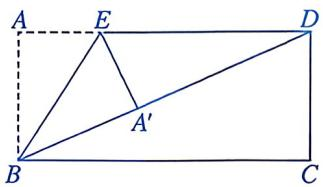
第2(4)题

# 数学思考

3. 如图，在矩形 $ABCD$ 中， $E$ 为 $BC$ 的中点，连接 $AE, DE$ . 

(1)求证： $\triangle ABE \cong \triangle DCE.$ 

(2)求证： $\angle {EAD} = \angle {EDA}$ . 
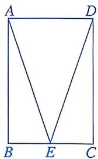
第3题

4. 如图，四边形 ABCD 是矩形，对角线 AC，BD 相交于点 O，BE // AC 交 DC 的延长线于点 E. 

(1)求证：BD=BE. 

(2) 若 $\angle DBC = 30^{\circ}$ , $BO = 1$ , 求四边形 $ABED$ 的面积. 
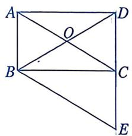
第4题

# 解决问题

5. 如图，在矩形 $ABCD$ 中， $AB = 3$ ， $BC = 9$ ，将矩形沿着对角线 $BD$ 折叠，使点 $C$ 落在点 $F$ 处， $BF$ 与 $AD$ 交于点 $E$ 。求 $\triangle ABE$ 的面积。 
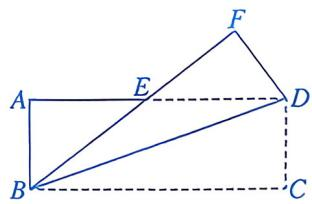
第5题

