# 21.6 菱形(一)

# 知识点拨

1. 有一组邻边相等的平行四边形叫作菱形. 

2. 菱形既是中心对称图形，也是轴对称图形. 

3. 菱形的性质定理：菱形的四条边相等；菱形的两条对角线互相垂直，且每条对角线平分一组对角。 

# 夯实基础

1. 选择题. 

(1)如图，在菱形ABCD中， $\angle D =$ $150^{\circ}$ ，则∠1的度数为 （） 
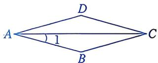
第1(1)题

A. $30^{\circ}$ B. $25^{\circ}$ C. $20^{\circ}$ D. $15^{\circ}$ 

(2)如图，菱形ABCD的周长是 $4\mathrm{cm}$ $\angle ABC = 60^{\circ}$ ，则菱形的对角线AC的长为 （） 
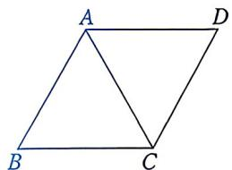
第1(2)题

A. $1 \mathrm{~cm}$ 

B. $2 \mathrm{~cm}$ 

C. $3 \mathrm{~cm}$ 

D. $4 \mathrm{~cm}$ 

(3) 在菱形 $ABCD$ 中, 对角线 $AC$ , $BD$ 相交于点 $O$ . 下列说法中, 不正确的是 ( ) 

A. $AB \parallel DC$ 

B. ${AC} = {BD}$ 

C. $AC \perp BD$ 

D. ${OA} = {OC}$ 

(4)如图, 在菱形 $ABCD$ 中, $AB = 1$ , $\angle DAB = 60^{\circ}$ , 则 $AC$ 的长为 ( ) 
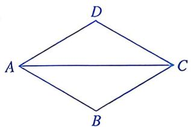
第1(4)题

A. $\frac{1}{2}$ 

B. 1 

C. $\frac{\sqrt{3}}{2}$ 

D. $\sqrt{3}$ 

(5)如图, 在菱形 $ABCD$ 中, 连接 $AC$ , $BD$ . 若 $\angle 1 = 20^{\circ}$ , 则 $\angle 2$ 的度数为 ( ) 
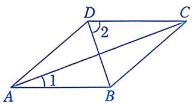
第1(5)题

A. $50^{\circ}$ B. $60^{\circ}$ C. $70^{\circ}$ D. $80^{\circ}$ 

(6)如图, 菱形 $ABCD$ 的对角线 $AC$ , $BD$ 相交于点 $O$ , $E$ 为 $AB$ 的中点, 连接 $OE$ . 若 $OE = 3$ , 则菱形的边长为 ( ) 
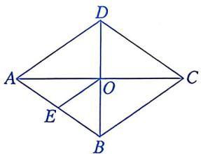
第1(6)题

A. 6 B. 8 C. 10 D. 12 

(7)如图，在平面直角坐标系中，菱形AOBC的顶点A在x轴的负半轴上，顶点B在直线 $y=\frac{3}{4}x$ 上．若点B的横坐标为8，则点C的坐标为() 
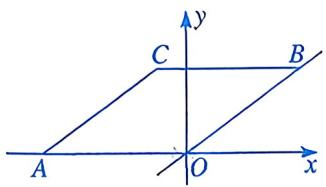
第1(7)题

A. $(-1, 6)$ 

B. $(-2, 6)$ 

C. $(-3, 6)$ 

D. $(-4, 6)$ 

(8)如图, 菱形 $ABCD$ 的对角线 $AC$ , $BD$ 相交于点 $O$ , $AC = 4$ , $BD = 16$ , 将 $\triangle ABO$ 沿点 $A$ 到点 $C$ 的方向平移, 得到 $\triangle A'B'O'$ . 当点 $A'$ 与点 $C$ 重合时, 点 $A$ 与点 $B'$ 之间的距离为 ( ) 
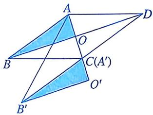
第1(8)题

A. 6 

B. 8 

C. 10 

D. 12 

# 2. 填空题.

(1)如图, 在菱形 $ABCD$ 中, $E$ 为 $AB$ 的中点, $F$ 为 $AC$ 的中点, 连接 $EF$ . 若 $EF = 4$ , 则菱形 $ABCD$ 的周长为 
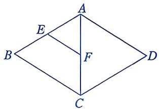
第2(1)题

(2)如图, 在菱形 $ABCD$ 中, 对角线 $AC$ , $BD$ 相交于点 $O$ , $\angle DBC = 60^{\circ}$ , $BD = 10$ , $E$ 为 $BC$ 的中点, 则 $OE$ 的长为 ____. 
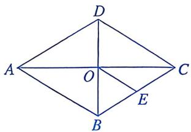
第2(2)题

(3)如图, 在菱形 $ABCD$ 中, $\angle A = 60^{\circ}$ , $BD = 7$ , 则菱形 $ABCD$ 的面积为 
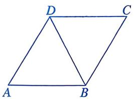
第2(3)题

(4)已知一个菱形的边长为6，面积为28，则该菱形两条对角线的长度之和为____。 

# 数学思考

3. 已知：如图，在菱形ABCD中，点E，F分别在边BC，CD上， $\angle AEB=\angle AFD$ . 求证：BE=DF. 
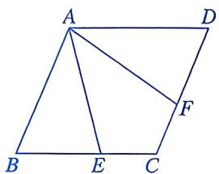
第3题

4. 如图，在菱形 $ABCD$ 中，对角线 $AC$ ， $BD$ 相交于点 $O$ ，过点 $D$ 作对角线 $BD$ 的垂线，交 $BA$ 的延长线于点 $E$ . 

(1)求证: 四边形 $ACDE$ 是平行四边形. 

(2) 若 $AC = 24, BD = 10$ ，求 $\triangle ADE$ 的周长. 
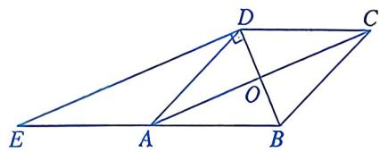
第4题

# 解决问题

5. 如图，四边形 ABCD 是平行四边形，对角线 AC，BD 相交于点 O，点 E，F 分别在 OB，OD 上，连接 AE，CE，AF，CF，AC=4，BD=6. 

(1) 当 $BE = DF = 1$ 时，判断四边形 $AECF$ 的形状并证明. 

(2) 当四边形 AECF 是菱形时, 求 □ABCD 的周长. 
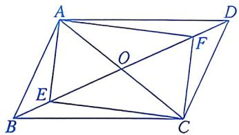
第5题

6. 已知：如图，在 Rt△ABC 中，∠B=90°，E 是 AC 的中点，AC=2AB，∠BAC 的平分线 AD 交 BC 于点 D，作 AF∥BC，连接 DE 并延长交 AF 于点 F，连接 FC。求证：四边形 ADCF 是菱形。 
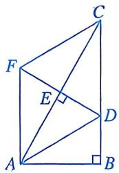
第6题

# 开阔视野

# 对角线互相垂直的四边形的面积

我们已经知道：菱形的面积等于其对角线乘积的一半。那么，如果是对角线互相垂直的任意一个四边形，还能得到上述结论吗？ 

如图，四边形 ABCD 的对角线 AC，BD 互相垂直，请用含 AC，BD 的代数式表示四边形 ABCD 的面积. 
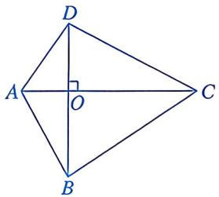
$$
\begin{array}{l} \because S _ {\text {四边形} A B C D} = S _ {\triangle A D C} + S _ {\triangle A B C} \\ = \frac {1}{2} A C \cdot O D + \frac {1}{2} A C \cdot O B \\ = \frac {1}{2} A C \cdot (O D + O B) \\ = \frac {1}{2} A C \cdot B D, \\ \end{array}
$$

∴四边形 ABCD 的面积等于其对角线 AC，BD 乘积的一半. 

由此，我们可以得到一个一般性的结论：对角线互相垂直的四边形的面积等于其对角线乘积的一半. 

