# 21.6 菱形(二)

# 知识点拨

菱形的判定方法： 

(1)有一组邻边相等的平行四边形是菱形. 

(2)四条边相等的四边形是菱形. 

(3)两条对角线互相垂直的平行四边形是菱形. 

# 夯实基础

# 1. 选择题.

(1) 如图, 在 $\square ABCD$ 中, $AB = 4$ , $BC = 6$ , 将线段 $AB$ 水平向右平移 $a$ 个单位长度得到线段 $EF$ . 若四边形 $ECDF$ 为菱形, 则 $a$ 的值为 ( ) 
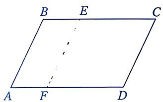
第1(1)题

A. 1 

B. 2 

C. 3 

D. 4 

(2) 如图, 添加下列一个条件, 能使 $\square ABCD$ 为菱形的是 ( ) 
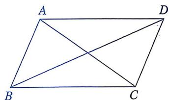
第1(2)题

① $AC \perp BD$ ; 

② $\angle BAD=90^{\circ}$ ; 

③AB=BC; 

④ ${AC} = {BD}.$ 

A. ①③ 

B. ②③ 

C. ③④ 

D. ①②③ 

(3)已知□ABCD的对角线相交于点O.若AB=AD=5，BD=8，则□ABCD的 

面积为 （） 

A. 40 

B. 24 

C. 20 

D. 15 

(4)如图, 以点 $A$ 为圆心、适当长为半径画弧, 交 $\angle A$ 的两边于点 $M$ , $N$ , 再分别以点 $M$ , $N$ 为圆心, 以 $AM$ 长为半径画弧, 两弧相交于点 $B$ , 连接 $MB$ , $NB$ . 若 $\angle A = 40^{\circ}$ , 则 $\angle MBN$ 的度数为 ( ) 
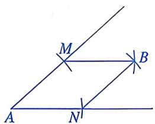
第 1(4) 题

A. ${40}^{ \circ  }$ 

B. ${50}^{ \circ  }$ 

C. ${60}^{ \circ  }$ 

D. ${140}^{ \circ  }$ 

(5)如图， $\square ABCD$ 的对角线 $AC, BD$ 相交于点 $O$ 。添加下列条件后，不能证明 $\square ABCD$ 是菱形的是 （） 
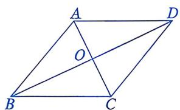
第1(5)题

A. $\angle BAC = \angle BCA$ 

B. $\angle ABD = \angle CBD$ 

C. $OA^2 +OD^2 = AD^2$ 

D. $AD^{2} + OA^{2} = OD^{2}$ 

(6)如图, 四边形 $ABCD$ 是矩形, $DE \parallel AC$ , $CE \parallel BD$ , $AC = 4$ , 则四边形 $OCED$ 的周长为 ( ) 
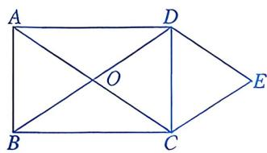
第1(6)题

A. 6 

B. 8 

C. 10 

D. 12 

(7)利用所学知识在□ABCD内作一个菱形，甲、乙两名同学的作法如下： 

甲：如图①，连接 $AC$ ，作 $AC$ 的垂直平分线，分别交 $AD$ ， $BC$ 于点 $E$ ， $F$ ，则四边形AFCE是菱形. 

乙：如图②，作∠BAD与∠ABC的平分线AE，BF，分别交BC于点E，交AD于点F，则四边形ABEF是菱形. 
| | |
|:---:|:---:|
| 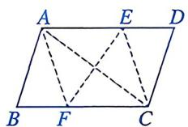   ① | 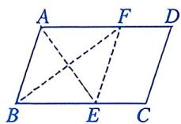   ② |

第1(7)题

下列判断中，正确的是 （） 

A. 甲、乙均正确 

B. 甲不正确，乙正确 

C. 甲正确，乙不正确 

D. 甲、乙均不正确 

2. 填空题. 

(1)如图, $AC$ 为矩形 $ABCD$ 的对角线, 将边 $AB$ 沿 $AE$ 折叠, 使点 $B$ 落在 $AC$ 上的点 $M$ 处, 将边 $CD$ 沿 $CF$ 折叠, 使点 $D$ 落在 $AC$ 上的点 $N$ 处. 当 $\angle BAE =$ ____时, 四边形 $AECF$ 是菱形. 
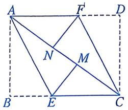
第2(1)题

(2)如图，点 A, B 的坐标分别为(5,0)，(1,3)，C 是平面直角坐标系内一点. 

若以 O, A, B, C 四点为顶点的四边形是菱形，则点 C 的坐标为 ____. 
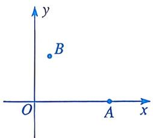
第2(2)题

(3)如图， $\square ABCD$ 的对角线 $AC, BD$ 相交于点 $O$ ，且 $AB = 5, OA = 3, OB = 4$ . 过点 $B$ 作 $BE \perp CD$ 于点 $E$ ，则 $BE$ 的长为 ____. 
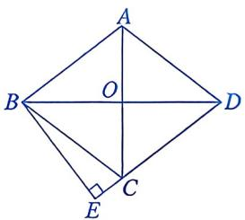
第 2(3) 题

(4)由四边形四条边的中点组成的四边形叫作原四边形的中点四边形。如图，四边形ABCD是矩形，取矩形ABCD四条边的中点得到中点四边形 $A_{1}B_{1}C_{1}D_{1}$ ，再取四边形 $A_{1}B_{1}C_{1}D_{1}$ 四条边的中点得到中点四边形 $A_{2}B_{2}C_{2}D_{2}\cdots\cdots$ 按此规律继续取下去。若矩形ABCD的面积为1，则得到的中点四边形 $A_{n}B_{n}C_{n}D_{n}$ 的面积为____。 
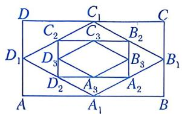
第 2(4) 题

# 数学思考

3. 已知：如图，在 $\square ABCD$ 中， $E, F$ 分别是 $AD, BC$ 上的点，且 $DE = BF, AC \perp EF$ . 求证：四边形 $AECF$ 是菱形. 
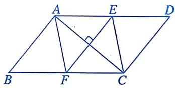
第3题

4. 如图，O 是 □ABCD 对角线 BD 的中点，过点 O 的直线分别交 AD，BC 于点 E，F，连接 BE，DF. 

(1)求证： $\triangle ODE \cong \triangle OBF$ . 

(2) 若 $EF \perp BD$ , $DE = 15 \mathrm{~cm}$ , 求四边形 BEDF 的周长. 
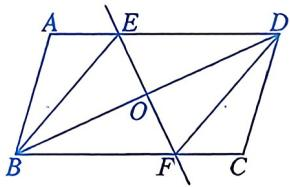
第4题

# 解决问题

5. 如图①，将两个宽度相等的矩形纸条叠放在一起，得到四边形ABCD. 

(1)判断四边形ABCD的形状，并说明理由. 

(2)已知矩形纸条的宽度为 $2 \, cm$ ，将矩形纸条旋转至图②所示的位置时，四边形 ABCD 的面积为 $8 \, cm^{2}$ ，此时 AD，CD 所夹锐角 $\angle 1$ 的度数为 ____. 
| | |
|:---:|:---:|
| 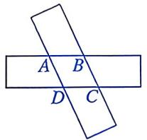   ① | 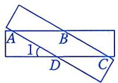   ② |

第5题

