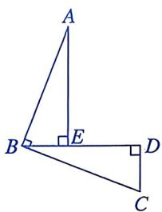

# 21.7 正方形(一)

# 知识点拨

1. 有一组邻边相等且有一个角是直角的平行四边形叫作正方形. 

2. 正方形具有平行四边形、矩形和菱形的一切性质. 

# 夯实基础

1. 选择题. 

(1)如图是以正方形的边长为直径，在正方形内画半圆得到的图形。该图形的对称轴有（） 

第1(1)题

A. 2 条 

B. 4 条 

C. 6 条 

D. 8 条 

(2) 如图, 四边形 $OABC$ 是正方形, $O, C$ 两点的坐标分别为 $(0, 0)$ , $(0, 6)$ , 点 $B$ 在第一象限, 则点 $B$ 的坐标为 ( ) 

第1(2)题

A. (6, 3) 

B. (3, 6) 

C. (6, 6) 

D. (0, 6) 

(3)如图, 正方形 $ABCD$ 的边长为 $4 \mathrm{~cm}$ , 则图中阴影部分的面积为 ( ) 

第1(3)题

A. $4 \mathrm{~cm}^{2}$ 

B. $8 \mathrm{~cm}^{2}$ 

C. $12 \mathrm{~cm}^{2}$ 

D. ${16}{\mathrm{\;{cm}}}^{2}$ 

(4)正方形具有而矩形不具有的性质是（） 

A. 对角线互相平分 

B. 对角线相等 

C. 对角线互相平分且相等 

D. 对角线互相垂直 

(5)如图, 正方形 $ABCD$ 的对角线 $AC$ , $BD$ 相交于点 $O$ . 下列结论中, 正确的个数为 ( ) 

①AB=BC=CD=DA；②AO=BO=CO=DO；③AC⊥BD. 

第1(5)题

A. 0 

B. 1 

C. 2 

D. 3 

(6)如图，将 n 个边长都为 2 的正方形按如图所示的方式摆放，点 $A_{1}, A_{2}, \cdots, A_{n}$ 分别为正方形的对称中心，则这 n 个正方形重叠部分(阴影)的面积之和是（） 

第1(6)题

A. $n$ 

B. $n - 1$ 

C. $4 (n - 1)$ 

D. $4n$ 

(7)如图，在正方形纸片ABCD上进行如下操作： 

第一步：剪去长方形纸条 AEFD. 

第二步：从长方形纸片 BCFE 上剪去长方形纸条 CFGH. 

若长方形纸条 AEFD 和长方形纸条 CFGH 的面积相等，则 AB 的长为（） 

第1(7)题

A. $30 \mathrm{~cm}$ 

B. $15 \mathrm{~cm}$ 

C. $16 \mathrm{~cm}$ 

D. $90 \mathrm{~em}$ 

2. 填空题. 

(1)已知正方形的边长为4，则这个正方形一条对角线的长为____。 

(2)如图, 正方形 $ABCD$ 的面积为 4, $E$ , $F$ , $G$ , $H$ 分别为边 $AB$ , $BC$ , $CD$ , $AD$ 的中点, 则四边形 $EFGH$ 的面积为 ____. 

第 2(2) 题

(3)如图, 在正方形 $ABCD$ 中, $E$ 是对角线 $BD$ 上一点, $AE$ 的延长线交 $CD$ 于点 $F$ , 连接 $CE$ . 若 $\angle BAE = 56^{\circ}$ , 则 $\angle CEF$ 的度数为 ____. 

第 2(3) 题

(4)如图，正方形 ABCD 在平面直角坐标系中，点 A 的坐标为 $(0, 4)$ ，点 B 的坐标为 $(-3, 0)$ ，则点 C 的坐标为 ____. 

第2(4)题

# 数学思考

3. 已知：如图，在正方形 $ABCD$ 中，对角线 $AC, BD$ 相交于点 $O, E, F$ 分别是边 $BC, CD$ 上的点，且 $\angle EOF = 90^\circ$ 。求证： $CE = DF$ . 

第3题

4. 如图，在正方形 $ABCD$ 中， $E, F$ 分别是边 $AD, DC$ 上的点，连接 $BE, AF$ ，交于点 $G$ . 

(1) 若 $DE = CF$ ，判断 $BE$ 与 $AF$ 的数量关系和位置关系，并说明理由。 

(2)若 $BE = AF$ ，求证： $BE \perp AF$ . 

(3)若 $BE \perp AF$ , 求证: $BE = AF$ . 

第4题

# 解决问题

5. (1)如图①, 已知 $\triangle ABE$ 和 $\triangle BCD$ , $AB \perp BC$ , $CD \perp BD$ , $AE \perp BD$ , $AB = BC$ . 直接写出线段 $AE$ , $DE$ , $CD$ 之间的数量关系. 

(2)如图②, 在正方形 $ABCD$ 中, $E$ , $F$ 分别在对角线 $BD$ 和边 $CD$ 上, $AE \perp EF$ , $AE = EF$ . 写出线段 $BE$ , $AD$ , $DF$ 之间的数量关系, 并说明理由. 
| | |
|:---:|:---:|
|    ① |    ② |

第5题

