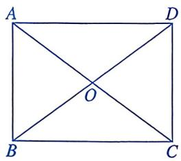
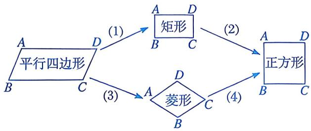
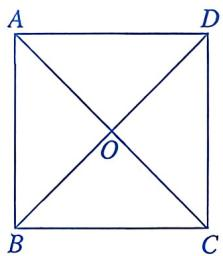
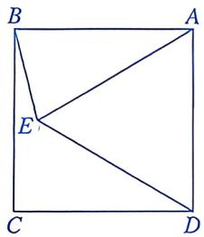
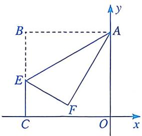
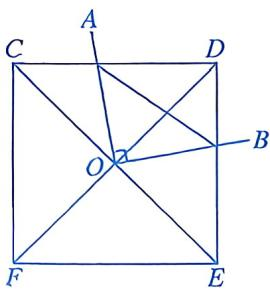
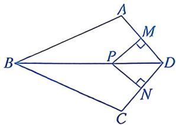

# 21.7 正方形(二)

# 知识点拨

判定一个四边形是正方形，可以先判定这个四边形是矩形，再证明这个矩形是菱形；也可以先判定这个四边形是菱形，再证明这个菱形是矩形. 

# 夯实基础

# 1. 选择题.

(1)已知四边形 ABCD 是平行四边形.下列说法中，正确的是 ( ) 

A. 当 $AC \perp BD$ 时, 它是矩形 

B. 当 $AC \perp BD$ 时, 它是菱形 

C. 当 $AC = BD$ 时, 它是正方形 

D. 当 $AC \perp BD$ 时, 它是正方形 

(2)如图, 在矩形 $ABCD$ 中, 对角线 $AC$ , $BD$ 相交于点 $O$ . 添加下列一个条件后, 能使矩形 $ABCD$ 成为正方形的是 ( ) 

第1(2)题

A. ${BD} = {AC}$ 

B. ${DC} = {AD}$ 

C. $\angle AOB = 60^{\circ}$ 

D. ${OD} = {CD}$ 

(3)小琦在复习几种特殊四边形之间的关系时，整理了下面的关系图。下列添加的条件中，不正确的是 

第1(3)题

A. (1)处可填 $\angle A = 90^{\circ}$ 

B. (2)处可填 ${AD} = {AB}$ 

C. (3)处可填 $BC = CD$ 

D. (4)处可填 $\angle B = \angle D$ 

(4)如图, 在四边形 $ABCD$ 中, $O$ 是对角线的交点. 下列条件中, 能判定这个四边形是正方形的是 ( ) 

第1(4)题

A. $AC = BD, AB \parallel CD, AB = CD$ 

B. $AD \parallel BC$ , $\angle BAD = \angle BCD$ 

C. ${AO} = {CO},{BO} = {DO},{AB} = {BC}$ 

D. ${AO} = {BO} = {CO} = {DO},{AC}\bot {BD}$ 

(5)依次连接正方形各边的中点, 得到的四边形是 ( ) 

A. 矩形 

B. 平行四边形 

C. 菱形 

D. 正方形 

(6)如图，在正方形ABCD中， $AB=2$ ，P是AD边上的动点， $PE\perp AC$ 于点E， $PF\perp BD$ 于点F，则 $PE+PF$ 的值为() 

第1(6)题

A. 4 B. $2 \sqrt{2}$ C. $\sqrt{2}$ D. 2 

(7)如图，将正方形ABCD的各边AB，BC，CD，DA分别延长至点E，F，G，H，且使BE=CF=DG=AH，则四边形EFGH为() 

第1(7)题

A. 平行四边形 

B. 菱形 

C. 矩形 

D. 正方形 

(8)学习了正方形后, 王老师提出如下问题: 要判定一个四边形是正方形, 有哪些思路? 甲同学说: 先判定四边形是菱形, 再证明这个菱形有一个角是直角. 乙同学说: 先判定四边形是矩形, 再证明这个矩形有一组邻边相等. 丙同学说: 判定四边形的对角线相等, 并且互相垂直平分. 丁同学说: 先判定四边形是平行四边形, 再证明这个平行四边形有一个角是直角并且有一组邻边相等. 四名同学的说法中, 正确的是 ( ) 

A. 甲、乙 

B. 甲、丙 

C. 乙、丙、丁 

D. 甲、乙、丙、丁 

# 2. 填空题.

(1)如图, 正方形 $ABCD$ 的边长为 2, $E$ 是 $BC$ 的中点, $DF \perp AE$ 与 $AB$ 交于点 $F$ , 则 $DF$ 的长为 ____. 

第2(1)题

(2)如图，在正方形ABCD的内部，作等边三角形ADE，连接BE，则∠CBE的度数为____。 

第2(2)题

(3)如图, 在平面直角坐标系中, 四边形 $OABC$ 是正方形, 点 $A$ 的坐标为 (0, 2), $E$ 是线段 $BC$ 上一点, 且 $\angle AEB = 60^{\circ}$ , $\triangle ABE$ 沿 $AE$ 折叠后点 $B$ 落在点 $F$ 处, 则点 $F$ 的坐标为 ____. 

第2(3)题

(4)如图, 以边长为 2 的正方形的对角线交点 $O$ 为端点, 引两条互相垂直的射线,分别与正方形的边 $C D$ , $D E$ 交于 $A$ , $B$ 两点, 则线段 $A B$ 长度的最小值为 

第2(4)题

# 数学思考

3. 已知：如图，四边形 ABCD 是矩形，E 是 BD 上一点， $\angle BAE = \angle BCE$ ， $\angle AED = \angle CED$ 。求证：四边形 ABCD 是正方形。 

第3题

# 解决问题

4. 如图，在四边形 ABCD 中，AB = BC，对角线 BD 平分 $\angle ABC$ ，P 是 BD 上一点，过点 P 作 $PM \perp AD$ ， $PN \perp CD$ ，垂足分别为 M，N. 

(1)求证： $\angle {ADB} = \angle {CDB}$ . 

(2) 当 $\angle ADC =$ ____ 时, 四边形 $MPND$ 是正方形. 填空并说明理由. 

第4题

