# 21.8 梯形

# 知识点拨

1. 只有一组对边平行的四边形叫作梯形. 

2. 有一个角是直角的梯形是直角梯形. 

3. 两腰相等的梯形是等腰梯形. 

# 夯实基础

# 1. 选择题.

(1)如图，有一个含 $60^{\circ}$ 角的直角三角形纸片，沿其斜边和长直角边的中点剪开后，不能拼成的四边形是 （） 
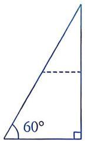
第1(1)题

A. 邻边不相等的矩形 

B. 等腰梯形 

C. 有一角是锐角的菱形 

D. 正方形 

(2)如图, 在等腰梯形 $ABCD$ 中, $AD \parallel BC$ , 过点 $D$ 作 $DF \perp BC$ 于点 $F$ . 若 $AD = 2$ , $BC = 4$ , $DF = 2$ , 则 $DC$ 的长为 ( ) 
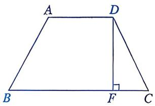
第1(2)题

A. 1 

B. $\sqrt{3}$ 

C. 2 

D. $\sqrt{5}$ 

(3)在四边形ABCD中，若 $\angle A:\angle B:\angle C:\angle D = 2:2:1:3$ ，则四边形ABCD是（） 

A. 平行四边形 

B. 等腰梯形 

C. 直角梯形 

D. 任意四边形 

(4)如图, 在等腰梯形 $ABCD$ 中, $AD \parallel BC$ , $AB = AD = DC$ , $\angle B = 60^{\circ}$ , $DE \parallel AB$ , 梯形 $ABCD$ 的周长为 $20 \mathrm{~cm}$ , 则 $DE$ 的长为 ( ) 
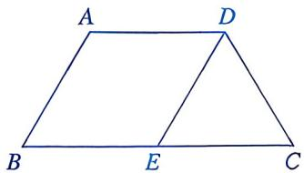
第1(4)题

A. $3 \mathrm{~cm}$ 

B. $4 \mathrm{~cm}$ 

C. $5 \mathrm{~cm}$ 

D. $6 \mathrm{~cm}$ 

(5) 如图, 在等腰梯形 $ABCD$ 中, $AB \parallel CD$ , $AD = BC = 5 \mathrm{~cm}$ , $\angle A = 60^{\circ}$ , $BD$ 平分 $\angle ABC$ , 则这个梯形的周长为 ( ) 
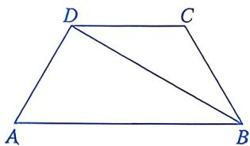
第 1(5)题

A. $16 \mathrm{~cm}$ 

B. $18 \mathrm{~cm}$ 

C. $20 \mathrm{~cm}$ 

D. $25 \mathrm{~cm}$ 

(6)如图，在等腰梯形ABCD中， $AD / / BC$ ，下底BC与上底AD的差恰好等于腰长AB，则 $\angle BAD$ 的度数为 （） 
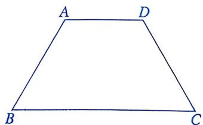
第 1(6) 题

A. ${120}^{ \circ  }$ 

B. ${135}^{ \circ  }$ 

C. ${150}^{ \circ  }$ 

D. ${160}^{ \circ  }$ 

(7)下列说法中，不正确的是 （） 

A. 一组邻边相等的矩形是正方形 

B. 对角线互相平分且相等的四边形是矩形 

C. 对角线平分一组对角的平行四边形是菱形 

D. 有两个底角相等的梯形是等腰梯形 

2. 填空题. 

(1) 如图, 在梯形 $ABCD$ 中, $DC \parallel AB$ , $AD = BC$ , $\angle A = 60^{\circ}$ , $BD \perp AD$ , 则 $\angle DBC = \_\_\_\_, \angle C = \_\_\_\_.$ 
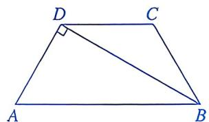
第2(1)题

(2)如图, 在等腰梯形 $ABCD$ 中, $AB \parallel CD$ , $AD = BC$ . 若 $\angle ACB = 90^{\circ}$ , $\angle B = 60^{\circ}$ , $DC = 2$ , 则 $AB$ 的长为 ____. 
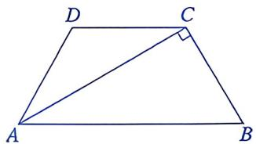
第2(2)题

(3)已知一等腰梯形的对角线互相垂直, 上底与下底之和为 16 , 则这个梯形的面积为 ____. 

(4)如图，在直角梯形ABCD中， $AB \parallel CD$ ， $\angle BAD = 90^{\circ}$ ，AD = 4，AB = 3，BC = 6，则CD的长为____。 
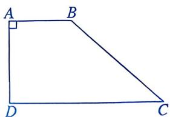
第2(4)题

(5)如图, 某花园里有一块等腰梯形空地 $ABCD$ , 其各边的中点分别是 $E, F, G, H$ . 若用篱笆围成的四边形 $EFGH$ 场地的周长为 $20 \mathrm{~m}$ , 则对角线 $AC$ 的长为 ____ m. 
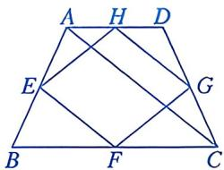
第 2(5) 题

# 数学思考

3. 如图，在梯形 $ABCD$ 中， $AD \parallel BC$ ， $\angle B = 45^\circ$ ， $AD = 8$ ， $AB = 10\sqrt{2}$ ， $CD = 26$ 。求 $BC$ 的长。 
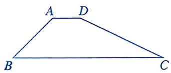
第3题

4. 如图，在梯形 ABCD 中， $AD \parallel BC$ ， $\angle B = 60^{\circ}$ ， $\angle C = 30^{\circ}$ ，AD = 4，BC = 10。求梯形两腰 AB 和 CD 的长。 
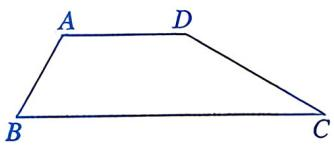
第4题

(1)求线段 $AD$ 的长. 

(2) 当 $t$ 为何值时，四边形ABPQ是矩形？ 

(3)当 $t$ 为何值时，线段 $PQ$ 与 $CD$ 的长度相等？ 
| | |
|:---:|:---:|
| 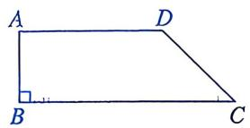 | 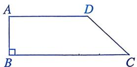   备用图 |

第5题

# 解决问题

5. 如图，在梯形 ABCD 中， $\angle ABC = 90^{\circ}$ ，AD // BC，AB = 12 cm，BC = 27 cm，CD = 15 cm，点 P 从点 B 开始沿 BC 向终点 C 以 3 cm/s 的速度移动，点 Q 从点 D 开始沿 DA 向终点 A 以 2 cm/s 的速度移动，连接 PQ。设点 P 移动的时间为 t s。 

# 回顾与反思

# 知识点拨

本章按照从一般到特殊的认知逻辑，围绕“定义—性质—判定”展开，是图形与几何中基础应用、推理能力的重点考查内容. 

特殊四边形的性质和判定是解决其他数学问题及实际问题的基础. 

# 夯实基础

# 1. 选择题.

(1)如图是某工件的截面示意图, 其中 $AD \parallel BC$ , $\angle ABC = 70^{\circ}$ , 则 $\angle BAD$ 的度数为 ( ) 
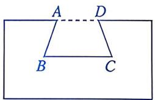
第 1(1) 题

A. $70^{\circ}$ B. $100^{\circ}$ C. $110^{\circ}$ D. $130^{\circ}$ 

(2)如图, 将三角形纸片 $ABC$ 剪掉一角后得到四边形 $BCDE$ . 设 $\triangle ABC$ 的外角和与四边形 $BCDE$ 的外角和分别为 $\alpha, \beta$ . 下列判断中, 正确的是 ( ) 
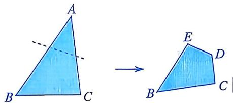
第1(2)题

A. $\alpha - \beta = 0$ 

B. $\alpha - \beta < 0$ 

C. $\alpha - \beta > 0$ 
